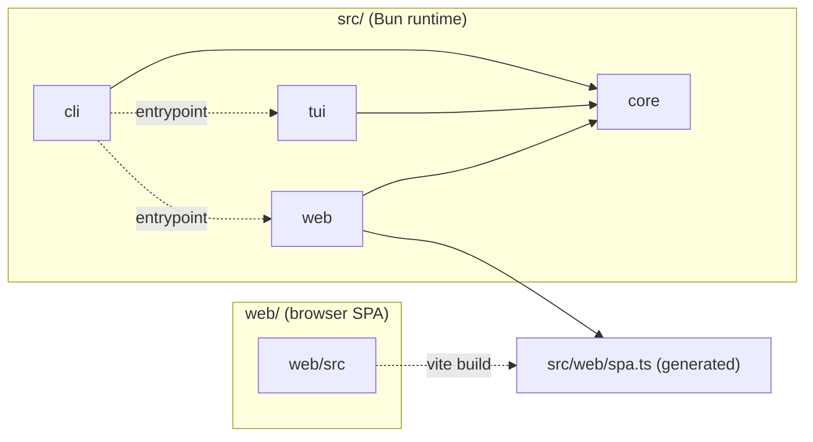
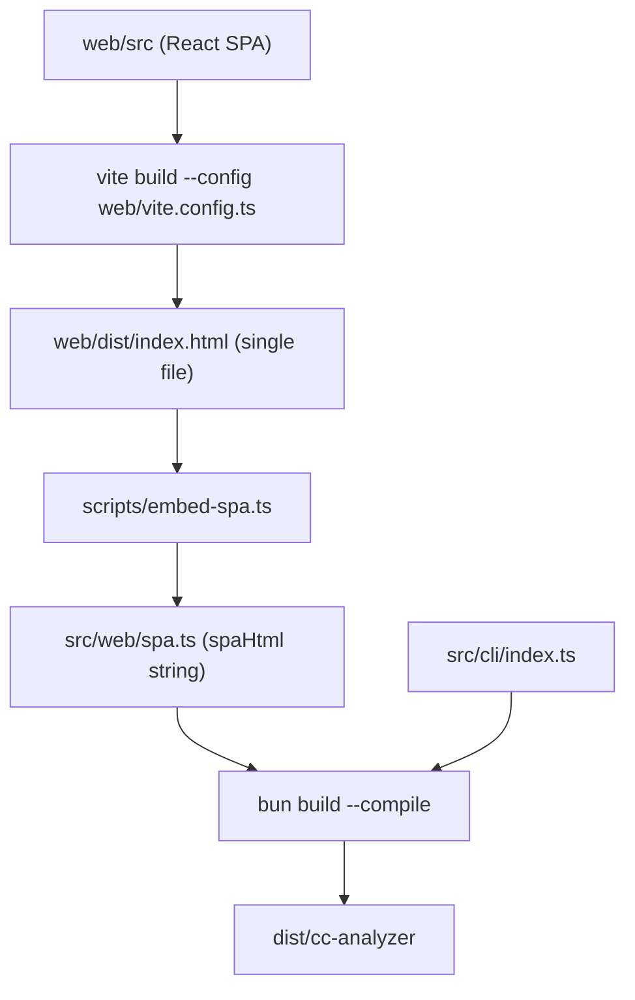

# Repository Structure

> Indexed at commit `4eeed24` on 2026-07-10 · [view on GitHub](https://github.com/yorch/cc-analyzer/tree/4eeed24)

## Relevant source files

- [package.json](https://github.com/yorch/cc-analyzer/blob/4eeed24/package.json)
- [tsconfig.json](https://github.com/yorch/cc-analyzer/blob/4eeed24/tsconfig.json)
- [web/tsconfig.json](https://github.com/yorch/cc-analyzer/blob/4eeed24/web/tsconfig.json)
- [biome.json](https://github.com/yorch/cc-analyzer/blob/4eeed24/biome.json)
- [scripts/embed-spa.ts](https://github.com/yorch/cc-analyzer/blob/4eeed24/scripts/embed-spa.ts)
- [.github/workflows/ci.yml](https://github.com/yorch/cc-analyzer/blob/4eeed24/.github/workflows/ci.yml)
- [.github/workflows/release.yml](https://github.com/yorch/cc-analyzer/blob/4eeed24/.github/workflows/release.yml)
- [README.md](https://github.com/yorch/cc-analyzer/blob/4eeed24/README.md)
- [.gitignore](https://github.com/yorch/cc-analyzer/blob/4eeed24/.gitignore)

## Overview

`cc-analyzer` is a read-only TypeScript command-line tool that browses and analyzes [Claude Code](https://claude.com/claude-code) sessions stored under `~/.claude`, reporting tokens, cost, tools, skills, models, and a per-turn breakdown ([README.md#L5-L7](https://github.com/yorch/cc-analyzer/blob/4eeed24/README.md#L5-L7)). It runs on [Bun](https://bun.sh) ≥ 1.3 and ships as a single compiled binary that bundles the CLI, terminal UI, HTTP API, and web UI together ([README.md#L27](https://github.com/yorch/cc-analyzer/blob/4eeed24/README.md#L27) [README.md#L117-L119](https://github.com/yorch/cc-analyzer/blob/4eeed24/README.md#L117-L119)).

The repository is a single-package project — not a workspace monorepo — declared by [package.json](https://github.com/yorch/cc-analyzer/blob/4eeed24/package.json). Source lives in `src/`, split into four modules (`core`, `cli`, `tui`, `web`), while the browser React Single-Page Application (SPA) has its own source tree under `web/`. A build step in `scripts/` embeds the compiled SPA into the binary. This page documents that layout, the dual TypeScript configuration, the Biome lint/format setup, the SPA-embed build pipeline, and the GitHub Actions that gate and release the project.

Sources: [README.md:L1-L52](https://github.com/yorch/cc-analyzer/blob/4eeed24/README.md#L1-L52) [package.json:L1-L20](https://github.com/yorch/cc-analyzer/blob/4eeed24/package.json#L1-L20)

## Architecture

The four `src/` modules run under Bun and are typechecked against Bun types, while `web/src` is a separate browser target compiled by Vite. `src/cli/index.ts` is the sole binary entrypoint declared in the `bin` field ([package.json#L6-L8](https://github.com/yorch/cc-analyzer/blob/4eeed24/package.json#L6-L8)); it delegates to the TUI and web modules, all of which depend on `core`. The Vite build converts `web/src` into a single HTML file that is embedded as `src/web/spa.ts` and served by the web module.

## Module Layout

| Module | Path | Responsibility |
| ------ | ---- | -------------- |
| Core analysis engine | `src/core/` | Session discovery, JSONL parsing, cost/token analysis, SQLite index, pricing |
| CLI | `src/cli/` | Argument parsing, command dispatch, human/JSON rendering; binary entrypoint |
| TUI | `src/tui/` | Interactive Ink terminal UI (projects → sessions → detail) |
| Web server & API | `src/web/` | Hono HTTP API plus the embedded SPA served by `serve` |
| Web SPA source | `web/src/` | React browser application built by Vite into a single HTML file |
| SPA embed script | `scripts/embed-spa.ts` | Writes the Vite output into `src/web/spa.ts` as a string |
| Tests | `test/` | Mirrors `src/` — `core`, `tui`, `web` suites plus `fixtures` |

The `src/core/` directory holds the domain logic: `analyze.ts`, `parser.ts`, `discover.ts`, `indexer.ts`, `db.ts`, `queries.ts`, `stats.ts`, `pricing.ts`, `pricing-source.ts`, `transcript.ts`, `events.ts`, and `paths.ts`, alongside a `bundled-pricing.json` fallback table. `src/cli/` contains `index.ts`, `format.ts`, and `render.ts`. `src/tui/` uses `.tsx` files (`App.tsx`, `run.tsx`) with `components/` and `screens/` subdirectories. `src/web/` contains `api.ts`, `server.ts`, and the generated `spa.ts`. The `test/` tree mirrors these source modules with `core/`, `tui/`, `web/`, and a shared `fixtures/` directory.

Sources: [package.json:L6-L19](https://github.com/yorch/cc-analyzer/blob/4eeed24/package.json#L6-L19) [README.md:L42-L110](https://github.com/yorch/cc-analyzer/blob/4eeed24/README.md#L42-L110)

## Key Components

### Package manifest and scripts

[package.json](https://github.com/yorch/cc-analyzer/blob/4eeed24/package.json) defines the project as an ES module (`"type": "module"`) at version `0.1.0` with a single binary named `cc-analyzer` pointing at `./src/cli/index.ts` ([package.json#L2-L8](https://github.com/yorch/cc-analyzer/blob/4eeed24/package.json#L2-L8)). The `scripts` block wires the whole workflow: `start` runs the CLI, `test` invokes `bun test`, and `lint`/`format`/`check` drive Biome ([package.json#L9-L14](https://github.com/yorch/cc-analyzer/blob/4eeed24/package.json#L9-L14)). Runtime dependencies include `hono`, `ink`, `react`, `react-dom`, and `zod`; dev dependencies include `@biomejs/biome`, `typescript`, `vite`, `@vitejs/plugin-react`, and `vite-plugin-singlefile` ([package.json#L21-L41](https://github.com/yorch/cc-analyzer/blob/4eeed24/package.json#L21-L41)).

Sources: [package.json:L1-L42](https://github.com/yorch/cc-analyzer/blob/4eeed24/package.json#L1-L42)

### Dual TypeScript configuration

The project uses two separate TypeScript configs because two different runtimes are involved. The root [tsconfig.json](https://github.com/yorch/cc-analyzer/blob/4eeed24/tsconfig.json) targets Bun: it sets `"types": ["bun"]`, includes only `src` and `test`, and uses a plain `ESNext` lib without DOM types ([tsconfig.json#L3-L19](https://github.com/yorch/cc-analyzer/blob/4eeed24/tsconfig.json#L3-L19)). The browser config [web/tsconfig.json](https://github.com/yorch/cc-analyzer/blob/4eeed24/web/tsconfig.json) adds `"DOM"` and `"DOM.Iterable"` to `lib`, sets `"types": ["vite/client"]`, and includes `src` and `vite.config.ts` relative to the `web/` directory ([web/tsconfig.json#L3-L16](https://github.com/yorch/cc-analyzer/blob/4eeed24/web/tsconfig.json#L3-L16)).

Both configs share strict settings — `strict`, `noUncheckedIndexedAccess`, `allowImportingTsExtensions`, `verbatimModuleSyntax`, and `jsx: "react-jsx"` ([tsconfig.json#L8-L18](https://github.com/yorch/cc-analyzer/blob/4eeed24/tsconfig.json#L8-L18) [web/tsconfig.json#L6-L14](https://github.com/yorch/cc-analyzer/blob/4eeed24/web/tsconfig.json#L6-L14)). Because the type environments differ, they are typechecked by two commands: `typecheck` runs `tsc --noEmit` against the root config, and `typecheck:web` runs `tsc --noEmit -p web/tsconfig.json` ([package.json#L15-L16](https://github.com/yorch/cc-analyzer/blob/4eeed24/package.json#L15-L16)).

Sources: [tsconfig.json:L1-L20](https://github.com/yorch/cc-analyzer/blob/4eeed24/tsconfig.json#L1-L20) [web/tsconfig.json:L1-L17](https://github.com/yorch/cc-analyzer/blob/4eeed24/web/tsconfig.json#L1-L17) [package.json:L15-L16](https://github.com/yorch/cc-analyzer/blob/4eeed24/package.json#L15-L16)

### Biome lint and format

Linting and formatting are handled by [Biome](https://biomejs.dev), configured in [biome.json](https://github.com/yorch/cc-analyzer/blob/4eeed24/biome.json) pinned to schema version `2.5.3`. It enables Git-aware ignoring via `useIgnoreFile` and scopes files to `src/**`, `test/**`, `web/**`, and `*.json`, while explicitly excluding `web/dist` and the generated `src/web/spa.ts` ([biome.json#L3-L10](https://github.com/yorch/cc-analyzer/blob/4eeed24/biome.json#L3-L10)). The formatter uses 2-space indentation and a 100-character line width, with double quotes, always-on semicolons, and trailing commas for JavaScript ([biome.json#L11-L29](https://github.com/yorch/cc-analyzer/blob/4eeed24/biome.json#L11-L29)).

The linter runs Biome's `recommended` preset, and the assist block enables automatic import organization ([biome.json#L17-L36](https://github.com/yorch/cc-analyzer/blob/4eeed24/biome.json#L17-L36)). The `check` script applies fixes in place while `lint` only reports, matching the CI usage described below ([package.json#L12-L14](https://github.com/yorch/cc-analyzer/blob/4eeed24/package.json#L12-L14)).

Sources: [biome.json:L1-L37](https://github.com/yorch/cc-analyzer/blob/4eeed24/biome.json#L1-L37) [package.json:L12-L14](https://github.com/yorch/cc-analyzer/blob/4eeed24/package.json#L12-L14)

### Generated SPA artifact

The file `src/web/spa.ts` is a build output, not hand-written source. [.gitignore](https://github.com/yorch/cc-analyzer/blob/4eeed24/.gitignore) excludes it from version control alongside `node_modules/`, `dist/`, `web/dist/`, and `*.bun-build`, noting that a placeholder is force-added once and regenerated content stays out of Git ([.gitignore#L1-L14](https://github.com/yorch/cc-analyzer/blob/4eeed24/.gitignore#L1-L14)). This is why Biome also excludes it from linting ([biome.json#L9](https://github.com/yorch/cc-analyzer/blob/4eeed24/biome.json#L9)).

Sources: [.gitignore:L1-L14](https://github.com/yorch/cc-analyzer/blob/4eeed24/.gitignore#L1-L14) [biome.json:L9](https://github.com/yorch/cc-analyzer/blob/4eeed24/biome.json#L9)

## Data Flow

The build pipeline turns two source trees into one executable. The `build:web` script first runs `vite build` against `web/vite.config.ts`, then invokes the embed script ([package.json#L17](https://github.com/yorch/cc-analyzer/blob/4eeed24/package.json#L17)). Vite, together with `vite-plugin-singlefile`, produces a self-contained `web/dist/index.html` with all assets inlined ([package.json#L40](https://github.com/yorch/cc-analyzer/blob/4eeed24/package.json#L40) [README.md#L107-L110](https://github.com/yorch/cc-analyzer/blob/4eeed24/README.md#L107-L110)).

[scripts/embed-spa.ts](https://github.com/yorch/cc-analyzer/blob/4eeed24/scripts/embed-spa.ts) reads that HTML file, exits with an error if it is missing, then writes `src/web/spa.ts` exporting `spaHtml` as a `JSON.stringify`-escaped string plus a `hasSpa` flag ([scripts/embed-spa.ts#L7-L22](https://github.com/yorch/cc-analyzer/blob/4eeed24/scripts/embed-spa.ts#L7-L22)). The top-level `build` script then chains `build:web` with `bun build --compile --outfile dist/cc-analyzer src/cli/index.ts`, baking the CLI, TUI, API, and embedded web UI into a single executable ([package.json#L19](https://github.com/yorch/cc-analyzer/blob/4eeed24/package.json#L19) [README.md#L112-L119](https://github.com/yorch/cc-analyzer/blob/4eeed24/README.md#L112-L119)).

Sources: [package.json:L17-L19](https://github.com/yorch/cc-analyzer/blob/4eeed24/package.json#L17-L19) [scripts/embed-spa.ts:L1-L22](https://github.com/yorch/cc-analyzer/blob/4eeed24/scripts/embed-spa.ts#L1-L22) [README.md:L102-L119](https://github.com/yorch/cc-analyzer/blob/4eeed24/README.md#L102-L119)

## Continuous Integration and Release

Two GitHub Actions workflows gate and ship the project. [.github/workflows/ci.yml](https://github.com/yorch/cc-analyzer/blob/4eeed24/.github/workflows/ci.yml) runs on every push to `main` and on all pull requests, with in-progress runs cancelled per ref ([.github/workflows/ci.yml#L3-L11](https://github.com/yorch/cc-analyzer/blob/4eeed24/.github/workflows/ci.yml#L3-L11)). Its single `check` job sets up Bun `1.3.14`, installs with a frozen lockfile, then runs the lint step, both typechecks, the test suite, and the full build — exactly mirroring the local development scripts ([.github/workflows/ci.yml#L13-L38](https://github.com/yorch/cc-analyzer/blob/4eeed24/.github/workflows/ci.yml#L13-L38)). The two separate typecheck steps reflect the dual-tsconfig design ([.github/workflows/ci.yml#L28-L32](https://github.com/yorch/cc-analyzer/blob/4eeed24/.github/workflows/ci.yml#L28-L32)).

[.github/workflows/release.yml](https://github.com/yorch/cc-analyzer/blob/4eeed24/.github/workflows/release.yml) triggers on `v*` tags and requests `contents: write` permission to publish releases ([.github/workflows/release.yml#L3-L9](https://github.com/yorch/cc-analyzer/blob/4eeed24/.github/workflows/release.yml#L3-L9)). It runs `build:web` once to embed the SPA, then loops over five Bun cross-compilation targets — Linux x64/arm64, macOS x64/arm64, and Windows x64 — compiling a minified binary for each with `bun build --compile --minify --target` ([.github/workflows/release.yml#L23-L44](https://github.com/yorch/cc-analyzer/blob/4eeed24/.github/workflows/release.yml#L23-L44)). Finally it publishes a GitHub release with auto-generated notes and attaches every `dist/cc-analyzer-*` artifact via the `gh` CLI ([.github/workflows/release.yml#L46-L54](https://github.com/yorch/cc-analyzer/blob/4eeed24/.github/workflows/release.yml#L46-L54)).

Sources: [.github/workflows/ci.yml:L1-L38](https://github.com/yorch/cc-analyzer/blob/4eeed24/.github/workflows/ci.yml#L1-L38) [.github/workflows/release.yml:L1-L54](https://github.com/yorch/cc-analyzer/blob/4eeed24/.github/workflows/release.yml#L1-L54) [README.md:L121-L131](https://github.com/yorch/cc-analyzer/blob/4eeed24/README.md#L121-L131)

## Related Pages

- Core analysis engine: [Core Analysis Engine](./2-core-analysis-engine.md)
- CLI: [CLI](./3-cli.md)
- TUI: [TUI](./4-tui.md)
- Web server and API: [Web Server and API](./5-web-server-and-api.md)
- Web SPA frontend: [Web SPA Frontend](./6-web-spa-frontend.md)
