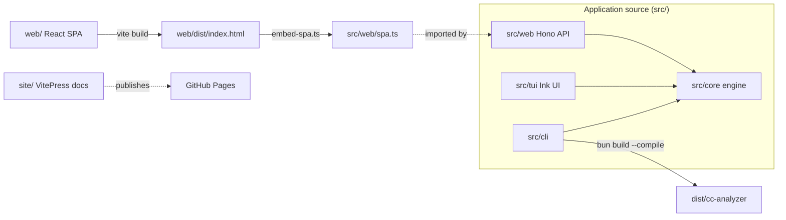
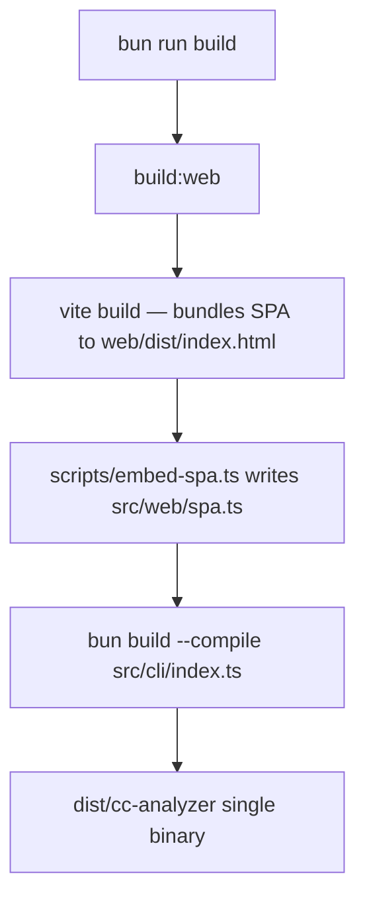

# Repository Structure

> Indexed at commit `bf5a4c8` on 2026-07-12 · [view on GitHub](https://github.com/yorch/cc-analyzer/tree/bf5a4c8)

## Relevant source files

- [package.json](https://github.com/yorch/cc-analyzer/blob/bf5a4c8/package.json)
- [tsconfig.json](https://github.com/yorch/cc-analyzer/blob/bf5a4c8/tsconfig.json)
- [web/tsconfig.json](https://github.com/yorch/cc-analyzer/blob/bf5a4c8/web/tsconfig.json)
- [biome.json](https://github.com/yorch/cc-analyzer/blob/bf5a4c8/biome.json)
- [scripts/embed-spa.ts](https://github.com/yorch/cc-analyzer/blob/bf5a4c8/scripts/embed-spa.ts)
- [.github/workflows/ci.yml](https://github.com/yorch/cc-analyzer/blob/bf5a4c8/.github/workflows/ci.yml)
- [.github/workflows/release.yml](https://github.com/yorch/cc-analyzer/blob/bf5a4c8/.github/workflows/release.yml)
- [.github/workflows/deploy-site.yml](https://github.com/yorch/cc-analyzer/blob/bf5a4c8/.github/workflows/deploy-site.yml)
- [README.md](https://github.com/yorch/cc-analyzer/blob/bf5a4c8/README.md)
- [CLAUDE.md](https://github.com/yorch/cc-analyzer/blob/bf5a4c8/CLAUDE.md)
- [.gitignore](https://github.com/yorch/cc-analyzer/blob/bf5a4c8/.gitignore)

## Overview

`cc-analyzer` is a read-only Command-Line Interface (CLI) that browses and analyzes Claude Code sessions stored under `~/.claude`, and ships as a single self-contained binary. The runtime is Bun ≥ 1.3 and the language is TypeScript, declared in [package.json#L7](https://github.com/yorch/cc-analyzer/blob/bf5a4c8/package.json#L7) and [README.md#L100](https://github.com/yorch/cc-analyzer/blob/bf5a4c8/README.md#L100). The repository follows a "one core, three frontends" layout: all parsing, analysis, pricing, and indexing lives in `src/core/`, while thin presentation layers in `src/cli/`, `src/tui/`, and `src/web/` consume it, as documented in [CLAUDE.md#L36-L45](https://github.com/yorch/cc-analyzer/blob/bf5a4c8/CLAUDE.md#L36-L45).

Beyond the application source, the repository contains a separate browser-targeted React Single-Page Application (SPA) under `web/`, a VitePress documentation and landing site under `site/`, a `scripts/` directory holding the SPA embedding step, and a `test/` tree that mirrors `src/`. The build pipeline stitches these together: Vite bundles the SPA into one Hypertext Markup Language (HTML) file, [scripts/embed-spa.ts](https://github.com/yorch/cc-analyzer/blob/bf5a4c8/scripts/embed-spa.ts) writes it into `src/web/spa.ts`, and `bun build --compile` bakes everything into `dist/cc-analyzer`, per [package.json#L17-L19](https://github.com/yorch/cc-analyzer/blob/bf5a4c8/package.json#L17-L19).

Sources: [CLAUDE.md#L1-L45](https://github.com/yorch/cc-analyzer/blob/bf5a4c8/CLAUDE.md#L1-L45) [package.json#L1-L20](https://github.com/yorch/cc-analyzer/blob/bf5a4c8/package.json#L1-L20) [README.md#L1-L15](https://github.com/yorch/cc-analyzer/blob/bf5a4c8/README.md#L1-L15)

## Architecture

The four application modules share `src/core/` as their single engine, while the `web/` SPA is a distinct browser codebase compiled into `src/web/spa.ts` before the binary is built. The `site/` tree is an independent VitePress project deployed separately to GitHub Pages. This separation is why the repository maintains two TypeScript configurations and three CI/CD workflows, described below.

Sources: [CLAUDE.md#L36-L55](https://github.com/yorch/cc-analyzer/blob/bf5a4c8/CLAUDE.md#L36-L55) [package.json#L17-L19](https://github.com/yorch/cc-analyzer/blob/bf5a4c8/package.json#L17-L19) [scripts/embed-spa.ts#L1-L22](https://github.com/yorch/cc-analyzer/blob/bf5a4c8/scripts/embed-spa.ts#L1-L22)

## Module Layout

| Module | Path | Responsibility |
| ------ | ---- | -------------- |
| Core engine | `src/core/` | Parsing, analysis, pricing, indexing, self-update — consumed by every frontend |
| CLI | `src/cli/` | Scriptable commands; `index.ts` is the entrypoint and argument router |
| TUI | `src/tui/` | Interactive terminal UI built with Ink + React |
| Web server | `src/web/` | `cc-analyzer serve`: a Hono Application Programming Interface (API) plus embedded SPA |
| Web SPA | `web/` | Browser React SPA source, bundled by Vite into one HTML file |
| Docs site | `site/` | VitePress landing page and documentation |
| Build scripts | `scripts/` | `embed-spa.ts`, which bakes the SPA HTML into `src/web/spa.ts` |
| Tests | `test/` | Bun test suite mirroring `src/` (`cli/`, `core/`, `tui/`, `web/`, `fixtures/`) |

The `bin` field points the `cc-analyzer` executable at [src/cli/index.ts](https://github.com/yorch/cc-analyzer/blob/bf5a4c8/package.json#L6-L8), which is both the development entrypoint (`bun start`) and the compile target for the binary, per [package.json#L6-L19](https://github.com/yorch/cc-analyzer/blob/bf5a4c8/package.json#L6-L19). Runtime dependencies are minimal: `hono` for the API server, `ink` and `react`/`react-dom` for the TUI and SPA, `zod` for schema validation, and two font packages, listed in [package.json#L21-L30](https://github.com/yorch/cc-analyzer/blob/bf5a4c8/package.json#L21-L30).

Sources: [package.json#L6-L41](https://github.com/yorch/cc-analyzer/blob/bf5a4c8/package.json#L6-L41) [CLAUDE.md#L36-L45](https://github.com/yorch/cc-analyzer/blob/bf5a4c8/CLAUDE.md#L36-L45)

## Key Components

### Package manifest and scripts

[package.json](https://github.com/yorch/cc-analyzer/blob/bf5a4c8/package.json) defines the version (`0.2.0`), the module type (`module`), the executable binding, and every npm-style script the project uses. The scripts block at [package.json#L9-L20](https://github.com/yorch/cc-analyzer/blob/bf5a4c8/package.json#L9-L20) encodes the whole developer workflow: `start` runs the CLI through Bun, `test` invokes Bun's built-in runner, `lint`/`format`/`check` drive Biome, and the two typecheck scripts (`typecheck` and `typecheck:web`) run `tsc --noEmit` against the two separate configurations. `build:web` and `build` compose the release pipeline described below.

Sources: [package.json#L1-L20](https://github.com/yorch/cc-analyzer/blob/bf5a4c8/package.json#L1-L20) [CLAUDE.md#L10-L28](https://github.com/yorch/cc-analyzer/blob/bf5a4c8/CLAUDE.md#L10-L28)

### Dual TypeScript configuration

The repository carries two `tsconfig.json` files with intentionally incompatible settings. The root [tsconfig.json](https://github.com/yorch/cc-analyzer/blob/bf5a4c8/tsconfig.json) targets Bun: it sets `"types": ["bun"]` at [tsconfig.json#L18](https://github.com/yorch/cc-analyzer/blob/bf5a4c8/tsconfig.json#L18) and includes both `src` and `test` at [tsconfig.json#L20](https://github.com/yorch/cc-analyzer/blob/bf5a4c8/tsconfig.json#L20). The browser config [web/tsconfig.json](https://github.com/yorch/cc-analyzer/blob/bf5a4c8/web/tsconfig.json) instead pulls in the Document Object Model (DOM) libraries at [web/tsconfig.json#L3](https://github.com/yorch/cc-analyzer/blob/bf5a4c8/web/tsconfig.json#L3) and uses `"types": ["vite/client"]` at [web/tsconfig.json#L14](https://github.com/yorch/cc-analyzer/blob/bf5a4c8/web/tsconfig.json#L14). Because Bun globals and DOM globals cannot coexist cleanly in one project, Continuous Integration (CI) runs both typechecks and contributors must run both before claiming types pass, per [CLAUDE.md#L29-L31](https://github.com/yorch/cc-analyzer/blob/bf5a4c8/CLAUDE.md#L29-L31).

Both configurations share strict settings including `strict`, `noUncheckedIndexedAccess`, and `verbatimModuleSyntax`, and both enable `allowImportingTsExtensions` so imports carry explicit `.ts`/`.tsx` extensions. The root config additionally enables `resolveJsonModule` at [tsconfig.json#L10](https://github.com/yorch/cc-analyzer/blob/bf5a4c8/tsconfig.json#L10), which lets `src/core/version.ts` import `package.json` directly so the compiled binary knows its own version, as noted in [CLAUDE.md#L88-L94](https://github.com/yorch/cc-analyzer/blob/bf5a4c8/CLAUDE.md#L88-L94).

Sources: [tsconfig.json#L1-L21](https://github.com/yorch/cc-analyzer/blob/bf5a4c8/tsconfig.json#L1-L21) [web/tsconfig.json#L1-L17](https://github.com/yorch/cc-analyzer/blob/bf5a4c8/web/tsconfig.json#L1-L17) [CLAUDE.md#L116-L122](https://github.com/yorch/cc-analyzer/blob/bf5a4c8/CLAUDE.md#L116-L122)

### Biome tooling

Formatting and linting are handled by Biome, configured in [biome.json](https://github.com/yorch/cc-analyzer/blob/bf5a4c8/biome.json). The formatter uses two-space indentation and a line width of 100, per [biome.json#L11-L16](https://github.com/yorch/cc-analyzer/blob/bf5a4c8/biome.json#L11-L16), with double quotes, always-on semicolons, and trailing commas at [biome.json#L23-L29](https://github.com/yorch/cc-analyzer/blob/bf5a4c8/biome.json#L23-L29). The `includes` glob at [biome.json#L9](https://github.com/yorch/cc-analyzer/blob/bf5a4c8/biome.json#L9) covers `src`, `test`, and `web` but explicitly excludes `web/dist` and the generated `src/web/spa.ts`. Biome also reads the Git ignore file and organizes imports as an assist action, defined at [biome.json#L3-L7](https://github.com/yorch/cc-analyzer/blob/bf5a4c8/biome.json#L3-L7) and [biome.json#L30-L36](https://github.com/yorch/cc-analyzer/blob/bf5a4c8/biome.json#L30-L36).

Sources: [biome.json#L1-L37](https://github.com/yorch/cc-analyzer/blob/bf5a4c8/biome.json#L1-L37)

### The generated SPA artifact

`src/web/spa.ts` is a generated, Git-ignored artifact and must not be edited by hand. [scripts/embed-spa.ts](https://github.com/yorch/cc-analyzer/blob/bf5a4c8/scripts/embed-spa.ts) reads the single-file Vite build at `web/dist/index.html`, exits with an error if it is missing at [scripts/embed-spa.ts#L10-L14](https://github.com/yorch/cc-analyzer/blob/bf5a4c8/scripts/embed-spa.ts#L10-L14), then writes a module exporting `spaHtml` (the JSON-escaped HTML string) and `hasSpa` at [scripts/embed-spa.ts#L16-L21](https://github.com/yorch/cc-analyzer/blob/bf5a4c8/scripts/embed-spa.ts#L16-L21). The `.gitignore` keeps regenerated content untracked at [.gitignore#L12-L14](https://github.com/yorch/cc-analyzer/blob/bf5a4c8/.gitignore#L12-L14); a placeholder version is force-added to Git once so the module resolves, as explained in [CLAUDE.md#L107-L114](https://github.com/yorch/cc-analyzer/blob/bf5a4c8/CLAUDE.md#L107-L114). The `.gitignore` also excludes `node_modules/`, `dist/`, `web/dist/`, and build artifacts like `*.tsbuildinfo`, per [.gitignore#L1-L14](https://github.com/yorch/cc-analyzer/blob/bf5a4c8/.gitignore#L1-L14).

Sources: [scripts/embed-spa.ts#L1-L22](https://github.com/yorch/cc-analyzer/blob/bf5a4c8/scripts/embed-spa.ts#L1-L22) [.gitignore#L1-L17](https://github.com/yorch/cc-analyzer/blob/bf5a4c8/.gitignore#L1-L17) [CLAUDE.md#L107-L114](https://github.com/yorch/cc-analyzer/blob/bf5a4c8/CLAUDE.md#L107-L114)

## Build Pipeline

The `build` script chains `build:web` and the compile step at [package.json#L19](https://github.com/yorch/cc-analyzer/blob/bf5a4c8/package.json#L19). `build:web` first runs `vite build` against `web/vite.config.ts`, which uses `vite-plugin-singlefile` to inline all assets into one HTML file, then runs `scripts/embed-spa.ts` to write that HTML into `src/web/spa.ts`, per [package.json#L17](https://github.com/yorch/cc-analyzer/blob/bf5a4c8/package.json#L17). Finally, `bun build --compile --outfile dist/cc-analyzer src/cli/index.ts` produces a single executable containing the CLI, TUI, API, and web UI, described in [README.md#L196-L202](https://github.com/yorch/cc-analyzer/blob/bf5a4c8/README.md#L196-L202). Because the SPA is embedded, the release binary serves the whole interface with no external assets.

Sources: [package.json#L17-L19](https://github.com/yorch/cc-analyzer/blob/bf5a4c8/package.json#L17-L19) [scripts/embed-spa.ts#L1-L22](https://github.com/yorch/cc-analyzer/blob/bf5a4c8/scripts/embed-spa.ts#L1-L22) [README.md#L182-L202](https://github.com/yorch/cc-analyzer/blob/bf5a4c8/README.md#L182-L202)

## Continuous Integration and Delivery

The repository runs three GitHub Actions workflows. The CI workflow [.github/workflows/ci.yml](https://github.com/yorch/cc-analyzer/blob/bf5a4c8/.github/workflows/ci.yml) triggers on pushes to `main` and on every pull request, per [.github/workflows/ci.yml#L3-L6](https://github.com/yorch/cc-analyzer/blob/bf5a4c8/.github/workflows/ci.yml#L3-L6). It installs dependencies with a frozen lockfile, then runs lint, the two typechecks, the test suite, and a full build in sequence at [.github/workflows/ci.yml#L25-L38](https://github.com/yorch/cc-analyzer/blob/bf5a4c8/.github/workflows/ci.yml#L25-L38), pinning Bun to `1.3.14`.

The release workflow [.github/workflows/release.yml](https://github.com/yorch/cc-analyzer/blob/bf5a4c8/.github/workflows/release.yml) triggers on `v*` tags at [.github/workflows/release.yml#L3-L5](https://github.com/yorch/cc-analyzer/blob/bf5a4c8/.github/workflows/release.yml#L3-L5). It embeds the web UI, then cross-compiles five platform binaries — Linux x64/arm64, macOS x64/arm64, and Windows x64 — in a loop over Bun compile targets at [.github/workflows/release.yml#L26-L44](https://github.com/yorch/cc-analyzer/blob/bf5a4c8/.github/workflows/release.yml#L26-L44). It then generates a `SHA256SUMS` manifest from the binaries at [.github/workflows/release.yml#L46-L50](https://github.com/yorch/cc-analyzer/blob/bf5a4c8/.github/workflows/release.yml#L46-L50) and publishes a GitHub release attaching every binary plus the manifest at [.github/workflows/release.yml#L52-L60](https://github.com/yorch/cc-analyzer/blob/bf5a4c8/.github/workflows/release.yml#L52-L60). The install scripts and `cc-analyzer update` verify downloads against this manifest, per [README.md#L92-L96](https://github.com/yorch/cc-analyzer/blob/bf5a4c8/README.md#L92-L96).

The site deploy workflow [.github/workflows/deploy-site.yml](https://github.com/yorch/cc-analyzer/blob/bf5a4c8/.github/workflows/deploy-site.yml) deploys the VitePress site to GitHub Pages. It triggers on pushes to `main` that touch `site/**` or `wiki/**`, or manually, per [.github/workflows/deploy-site.yml#L3-L10](https://github.com/yorch/cc-analyzer/blob/bf5a4c8/.github/workflows/deploy-site.yml#L3-L10). Its build job runs `docs:build` inside `site/` — which syncs the `wiki/` directory before running the VitePress build — uploads the Pages artifact, and a dependent `deploy` job publishes it at [.github/workflows/deploy-site.yml#L22-L55](https://github.com/yorch/cc-analyzer/blob/bf5a4c8/.github/workflows/deploy-site.yml#L22-L55).

Sources: [.github/workflows/ci.yml#L1-L38](https://github.com/yorch/cc-analyzer/blob/bf5a4c8/.github/workflows/ci.yml#L1-L38) [.github/workflows/release.yml#L1-L60](https://github.com/yorch/cc-analyzer/blob/bf5a4c8/.github/workflows/release.yml#L1-L60) [.github/workflows/deploy-site.yml#L1-L55](https://github.com/yorch/cc-analyzer/blob/bf5a4c8/.github/workflows/deploy-site.yml#L1-L55)

## Related Pages

- Core analysis engine: [Core Analysis Engine](./2-core-analysis-engine.md)
- CLI frontend: [CLI](./3-cli.md)
- Terminal UI: [TUI](./4-tui.md)
- Web server and API: [Web Server and API](./5-web-server-and-api.md)
- Web SPA: [Web SPA Frontend](./6-web-spa-frontend.md)
- Self-update and distribution: [Updates and Distribution](./7-updates-and-distribution.md)
- Documentation site: [Docs Site](./8-docs-site.md)
