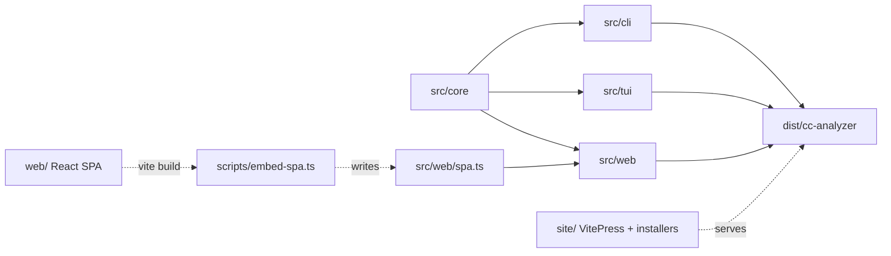
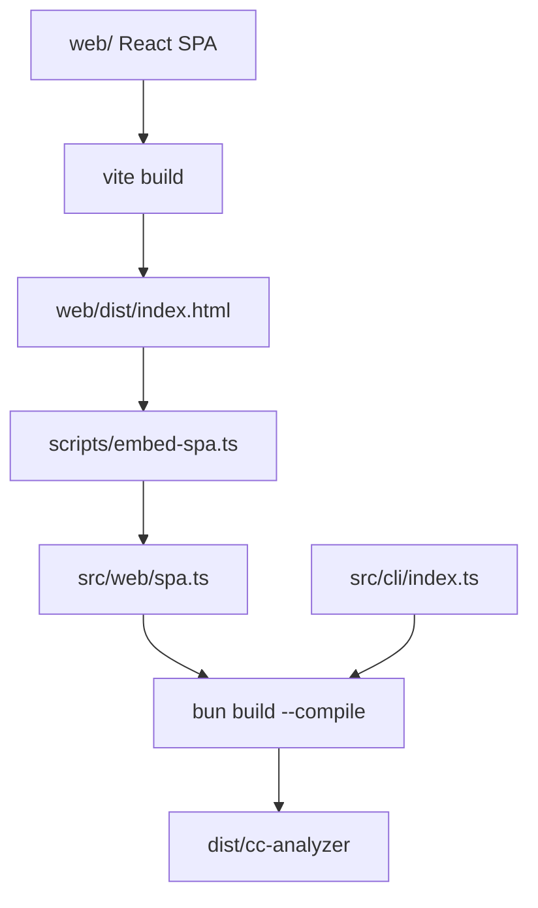

# Repository Structure

> Indexed at commit `9d4dd3f` on 2026-07-23 · [view on GitHub](https://github.com/yorch/cc-analyzer/tree/9d4dd3f)

## Relevant source files

- [package.json](https://github.com/yorch/cc-analyzer/blob/9d4dd3f/package.json)
- [tsconfig.json](https://github.com/yorch/cc-analyzer/blob/9d4dd3f/tsconfig.json)
- [web/tsconfig.json](https://github.com/yorch/cc-analyzer/blob/9d4dd3f/web/tsconfig.json)
- [biome.json](https://github.com/yorch/cc-analyzer/blob/9d4dd3f/biome.json)
- [scripts/embed-spa.ts](https://github.com/yorch/cc-analyzer/blob/9d4dd3f/scripts/embed-spa.ts)
- [.github/workflows/ci.yml](https://github.com/yorch/cc-analyzer/blob/9d4dd3f/.github/workflows/ci.yml)
- [.github/workflows/release.yml](https://github.com/yorch/cc-analyzer/blob/9d4dd3f/.github/workflows/release.yml)
- [.github/workflows/deploy-site.yml](https://github.com/yorch/cc-analyzer/blob/9d4dd3f/.github/workflows/deploy-site.yml)
- [README.md](https://github.com/yorch/cc-analyzer/blob/9d4dd3f/README.md)
- [CLAUDE.md](https://github.com/yorch/cc-analyzer/blob/9d4dd3f/CLAUDE.md)
- [.gitignore](https://github.com/yorch/cc-analyzer/blob/9d4dd3f/.gitignore)

## Overview

`cc-analyzer` is a read-only command-line tool that browses and analyzes Claude Code sessions stored under `~/.claude`, reporting tokens, cost, tools, skills, models, and a per-turn breakdown ([README.md#L6-L8](https://github.com/yorch/cc-analyzer/blob/9d4dd3f/README.md#L6-L8)). It is written in TypeScript, runs on Bun ≥ 1.3, and ships as a single self-contained binary ([package.json#L5-L7](https://github.com/yorch/cc-analyzer/blob/9d4dd3f/package.json#L5-L7)). The current version is `0.6.0` ([package.json#L3](https://github.com/yorch/cc-analyzer/blob/9d4dd3f/package.json#L3)).

The repository follows a single-core, three-frontend layout: all parsing, analysis, pricing, and indexing live in `src/core/`, and three thin presentation layers (`src/cli/`, `src/tui/`, `src/web/`) consume it ([CLAUDE.md#L44-L60](https://github.com/yorch/cc-analyzer/blob/9d4dd3f/CLAUDE.md#L44-L60)). Supporting directories hold the browser React SPA (`web/`), the VitePress documentation site and installers (`site/`), build tooling (`scripts/`), and a mirrored test tree (`test/`). This page documents that layout, the build pipeline, the dual TypeScript configuration, the Biome tooling, and the three GitHub Actions workflows.

## Architecture

The three frontends all depend on `src/core` and are compiled together into `dist/cc-analyzer` ([CLAUDE.md#L44-L54](https://github.com/yorch/cc-analyzer/blob/9d4dd3f/CLAUDE.md#L44-L54), [package.json#L22](https://github.com/yorch/cc-analyzer/blob/9d4dd3f/package.json#L22)). The `web/` React application is a separate build unit whose Vite output is embedded into `src/web/spa.ts` so the compiled binary serves the whole UI with no external assets ([scripts/embed-spa.ts#L1-L4](https://github.com/yorch/cc-analyzer/blob/9d4dd3f/scripts/embed-spa.ts#L1-L4)). The `site/` directory is the public documentation and installer host, downstream of the release binary.

Sources: [CLAUDE.md#L44-L60](https://github.com/yorch/cc-analyzer/blob/9d4dd3f/CLAUDE.md#L44-L60) [scripts/embed-spa.ts#L1-L22](https://github.com/yorch/cc-analyzer/blob/9d4dd3f/scripts/embed-spa.ts#L1-L22) [package.json#L20-L22](https://github.com/yorch/cc-analyzer/blob/9d4dd3f/package.json#L20-L22)

## Module Layout

| Module | Path | Responsibility |
| ------ | ---- | -------------- |
| Core engine | `src/core/` | Parsing, analysis, pricing, indexing, self-update — the shared library ([CLAUDE.md#L43-L44](https://github.com/yorch/cc-analyzer/blob/9d4dd3f/CLAUDE.md#L43-L44)) |
| CLI | `src/cli/` | Scriptable commands; `index.ts` is the entrypoint and arg router ([CLAUDE.md#L46-L47](https://github.com/yorch/cc-analyzer/blob/9d4dd3f/CLAUDE.md#L46-L47)) |
| TUI | `src/tui/` | Interactive terminal UI (Ink + React) launched with no command ([CLAUDE.md#L48-L50](https://github.com/yorch/cc-analyzer/blob/9d4dd3f/CLAUDE.md#L48-L50)) |
| Web server | `src/web/` | `serve` command: a Hono API plus the embedded React SPA ([CLAUDE.md#L51-L52](https://github.com/yorch/cc-analyzer/blob/9d4dd3f/CLAUDE.md#L51-L52)) |
| Web SPA source | `web/` | Browser React application built by Vite ([web/tsconfig.json#L3-L16](https://github.com/yorch/cc-analyzer/blob/9d4dd3f/web/tsconfig.json#L3-L16)) |
| Docs site | `site/` | VitePress docs, landing page, and install scripts ([.github/workflows/deploy-site.yml#L27-L39](https://github.com/yorch/cc-analyzer/blob/9d4dd3f/.github/workflows/deploy-site.yml#L27-L39)) |
| Build scripts | `scripts/` | `embed-spa.ts` bakes the built SPA into `src/web/spa.ts` ([scripts/embed-spa.ts#L1-L4](https://github.com/yorch/cc-analyzer/blob/9d4dd3f/scripts/embed-spa.ts#L1-L4)) |
| Tests | `test/` | Bun test suite mirroring source under `core/`, `cli/`, `tui/`, `web/` ([tsconfig.json#L20](https://github.com/yorch/cc-analyzer/blob/9d4dd3f/tsconfig.json#L20)) |

The `bin` field maps the `cc-analyzer` executable to `src/cli/index.ts`, confirming the CLI as the single process entrypoint for all frontends ([package.json#L9-L11](https://github.com/yorch/cc-analyzer/blob/9d4dd3f/package.json#L9-L11)). Running the CLI with no command launches the TUI, and the `serve` command starts the web server — both dispatched from the same entrypoint ([README.md#L121-L129](https://github.com/yorch/cc-analyzer/blob/9d4dd3f/README.md#L121-L129)).

Sources: [package.json#L9-L23](https://github.com/yorch/cc-analyzer/blob/9d4dd3f/package.json#L9-L23) [CLAUDE.md#L42-L54](https://github.com/yorch/cc-analyzer/blob/9d4dd3f/CLAUDE.md#L42-L54) [tsconfig.json#L20](https://github.com/yorch/cc-analyzer/blob/9d4dd3f/tsconfig.json#L20)

## Key Components

### Package manifest and scripts

[package.json](https://github.com/yorch/cc-analyzer/blob/9d4dd3f/package.json) declares Bun ≥ 1.3 as the runtime engine and pins runtime dependencies `hono`, `ink`, `react`, `react-dom`, and `zod` ([package.json#L5-L30](https://github.com/yorch/cc-analyzer/blob/9d4dd3f/package.json#L5-L30)). The scripts define the developer surface: `start` runs the CLI through Bun, `test` invokes Bun's built-in runner, and `lint` / `check` / `format` delegate to Biome ([package.json#L12-L23](https://github.com/yorch/cc-analyzer/blob/9d4dd3f/package.json#L12-L23)). Two separate typecheck scripts exist — `typecheck` for the root Bun config and `typecheck:web` for the browser SPA config — because the two tsconfigs have incompatible settings ([package.json#L18-L19](https://github.com/yorch/cc-analyzer/blob/9d4dd3f/package.json#L18-L19)).

Sources: [package.json#L1-L45](https://github.com/yorch/cc-analyzer/blob/9d4dd3f/package.json#L1-L45)

### Dual TypeScript configuration

The repository carries two TypeScript configs with deliberately divergent settings. The root [tsconfig.json](https://github.com/yorch/cc-analyzer/blob/9d4dd3f/tsconfig.json) targets Bun — `types: ["bun"]`, an `ESNext` lib with no DOM, and it includes `src`, `test`, and `scripts` ([tsconfig.json#L3-L20](https://github.com/yorch/cc-analyzer/blob/9d4dd3f/tsconfig.json#L3-L20)). The browser config [web/tsconfig.json](https://github.com/yorch/cc-analyzer/blob/9d4dd3f/web/tsconfig.json) adds `DOM` and `DOM.Iterable` libs and uses `types: ["vite/client"]` instead ([web/tsconfig.json#L3-L15](https://github.com/yorch/cc-analyzer/blob/9d4dd3f/web/tsconfig.json#L3-L15)). Both enable `strict`, `noUncheckedIndexedAccess`, `allowImportingTsExtensions`, and `verbatimModuleSyntax`, so imports use explicit `.ts`/`.tsx` extensions across the codebase ([tsconfig.json#L9-L17](https://github.com/yorch/cc-analyzer/blob/9d4dd3f/tsconfig.json#L9-L17), [web/tsconfig.json#L8-L14](https://github.com/yorch/cc-analyzer/blob/9d4dd3f/web/tsconfig.json#L8-L14)).

The root config sets `resolveJsonModule: true`, which lets `version.ts` import `package.json` directly so the compiled binary knows its own version ([tsconfig.json#L10](https://github.com/yorch/cc-analyzer/blob/9d4dd3f/tsconfig.json#L10), [CLAUDE.md#L136-L139](https://github.com/yorch/cc-analyzer/blob/9d4dd3f/CLAUDE.md#L136-L139)). Web code that touches the DOM belongs to the web config; the Hono server under `src/web` is covered by the root config since it runs on Bun ([CLAUDE.md#L215-L219](https://github.com/yorch/cc-analyzer/blob/9d4dd3f/CLAUDE.md#L215-L219)).

Sources: [tsconfig.json#L1-L21](https://github.com/yorch/cc-analyzer/blob/9d4dd3f/tsconfig.json#L1-L21) [web/tsconfig.json#L1-L17](https://github.com/yorch/cc-analyzer/blob/9d4dd3f/web/tsconfig.json#L1-L17) [CLAUDE.md#L211-L219](https://github.com/yorch/cc-analyzer/blob/9d4dd3f/CLAUDE.md#L211-L219)

### Biome tooling

Formatting and linting are handled by Biome rather than ESLint and Prettier ([biome.json#L1-L2](https://github.com/yorch/cc-analyzer/blob/9d4dd3f/biome.json#L1-L2)). The config enforces 2-space indentation, a 100-character line width, double quotes, always-on semicolons, and trailing commas everywhere ([biome.json#L19-L37](https://github.com/yorch/cc-analyzer/blob/9d4dd3f/biome.json#L19-L37)). It reads the project's `.gitignore` through the `vcs` integration and scopes checks to `src`, `test`, `web`, `scripts`, and root JSON files ([biome.json#L3-L17](https://github.com/yorch/cc-analyzer/blob/9d4dd3f/biome.json#L3-L17)).

Two paths are explicitly excluded: `web/dist` (Vite build output) and the generated `src/web/spa.ts` ([biome.json#L14-L15](https://github.com/yorch/cc-analyzer/blob/9d4dd3f/biome.json#L14-L15)). Biome's `organizeImports` assist action is enabled to keep import ordering consistent ([biome.json#L38-L44](https://github.com/yorch/cc-analyzer/blob/9d4dd3f/biome.json#L38-L44)).

Sources: [biome.json#L1-L45](https://github.com/yorch/cc-analyzer/blob/9d4dd3f/biome.json#L1-L45)

### The generated SPA artifact

[scripts/embed-spa.ts](https://github.com/yorch/cc-analyzer/blob/9d4dd3f/scripts/embed-spa.ts) reads the single-file Vite build at `web/dist/index.html` and writes it into `src/web/spa.ts` as a JSON-stringified `spaHtml` export plus a `hasSpa` flag ([scripts/embed-spa.ts#L7-L21](https://github.com/yorch/cc-analyzer/blob/9d4dd3f/scripts/embed-spa.ts#L7-L21)). If the build output is missing, the script exits with an error prompting the developer to run `vite build` first ([scripts/embed-spa.ts#L10-L14](https://github.com/yorch/cc-analyzer/blob/9d4dd3f/scripts/embed-spa.ts#L10-L14)). `src/web/spa.ts` is a generated, git-ignored artifact; a placeholder is force-added to git once, and regenerated content stays untracked ([.gitignore#L12-L14](https://github.com/yorch/cc-analyzer/blob/9d4dd3f/.gitignore#L12-L14)).

Sources: [scripts/embed-spa.ts#L1-L22](https://github.com/yorch/cc-analyzer/blob/9d4dd3f/scripts/embed-spa.ts#L1-L22) [.gitignore#L7-L14](https://github.com/yorch/cc-analyzer/blob/9d4dd3f/.gitignore#L7-L14)

## Data Flow

The `build` script chains the whole pipeline: `build:web` first runs Vite (which bundles the SPA into one self-contained HTML file) and then `embed-spa.ts`, after which `bun build --compile` bakes the embedded SPA and the CLI entrypoint into `dist/cc-analyzer` ([package.json#L20-L22](https://github.com/yorch/cc-analyzer/blob/9d4dd3f/package.json#L20-L22)). The result is a single executable containing the CLI, TUI, API, and web UI ([README.md#L244-L251](https://github.com/yorch/cc-analyzer/blob/9d4dd3f/README.md#L244-L251)). Because the SPA is embedded rather than served from disk, the release binary needs no external assets ([CLAUDE.md#L222-L228](https://github.com/yorch/cc-analyzer/blob/9d4dd3f/CLAUDE.md#L222-L228)).

Sources: [package.json#L20-L22](https://github.com/yorch/cc-analyzer/blob/9d4dd3f/package.json#L20-L22) [scripts/embed-spa.ts#L1-L22](https://github.com/yorch/cc-analyzer/blob/9d4dd3f/scripts/embed-spa.ts#L1-L22) [README.md#L244-L251](https://github.com/yorch/cc-analyzer/blob/9d4dd3f/README.md#L244-L251)

## Continuous Integration & Delivery

Three GitHub Actions workflows govern the repository. The [ci.yml](https://github.com/yorch/cc-analyzer/blob/9d4dd3f/.github/workflows/ci.yml) workflow runs on pushes to `main` and on every pull request across a two-OS matrix of `ubuntu-latest` and `macos-latest`, the latter exercising the platform for which darwin binaries ship ([.github/workflows/ci.yml#L3-L21](https://github.com/yorch/cc-analyzer/blob/9d4dd3f/.github/workflows/ci.yml#L3-L21)). Each leg installs dependencies with a frozen lockfile, then runs the Biome lint/format check, both typechecks, the test suite, and a full build ([.github/workflows/ci.yml#L29-L45](https://github.com/yorch/cc-analyzer/blob/9d4dd3f/.github/workflows/ci.yml#L29-L45)). Both `setup-bun` steps pin Bun `1.3.14` ([.github/workflows/ci.yml#L25-L27](https://github.com/yorch/cc-analyzer/blob/9d4dd3f/.github/workflows/ci.yml#L25-L27)).

The [release.yml](https://github.com/yorch/cc-analyzer/blob/9d4dd3f/.github/workflows/release.yml) workflow triggers on `v*` tags ([.github/workflows/release.yml#L3-L5](https://github.com/yorch/cc-analyzer/blob/9d4dd3f/.github/workflows/release.yml#L3-L5)). It first verifies that the pushed tag matches `package.json`'s version, aborting otherwise, since the compiled binary embeds that version ([.github/workflows/release.yml#L28-L36](https://github.com/yorch/cc-analyzer/blob/9d4dd3f/.github/workflows/release.yml#L28-L36)). It then cross-compiles five binaries — Linux x64/arm64, macOS x64/arm64, and Windows x64 — with `bun build --compile --minify --target` ([.github/workflows/release.yml#L44-L62](https://github.com/yorch/cc-analyzer/blob/9d4dd3f/.github/workflows/release.yml#L44-L62)). A `SHA256SUMS` manifest is generated for integrity, and `actions/attest-build-provenance` signs each binary with a workflow identity via OpenID Connect (OIDC) that job code cannot forge, giving origin as well as integrity ([.github/workflows/release.yml#L64-L75](https://github.com/yorch/cc-analyzer/blob/9d4dd3f/.github/workflows/release.yml#L64-L75)). The `gh release create` step publishes the five binaries plus `SHA256SUMS` with auto-generated notes ([.github/workflows/release.yml#L77-L85](https://github.com/yorch/cc-analyzer/blob/9d4dd3f/.github/workflows/release.yml#L77-L85)).

The [deploy-site.yml](https://github.com/yorch/cc-analyzer/blob/9d4dd3f/.github/workflows/deploy-site.yml) workflow deploys the VitePress documentation to GitHub Pages on pushes to `main` that touch `site/**`, `wiki/**`, or the workflow file, and can be run manually via `workflow_dispatch` ([.github/workflows/deploy-site.yml#L3-L10](https://github.com/yorch/cc-analyzer/blob/9d4dd3f/.github/workflows/deploy-site.yml#L3-L10)). Its build job runs `docs:build` inside `site/` — which syncs `/wiki` before the VitePress build — and uploads the resulting `site/.vitepress/dist` as a Pages artifact ([.github/workflows/deploy-site.yml#L23-L45](https://github.com/yorch/cc-analyzer/blob/9d4dd3f/.github/workflows/deploy-site.yml#L23-L45)). A dependent `deploy` job publishes the artifact to the `github-pages` environment ([.github/workflows/deploy-site.yml#L47-L55](https://github.com/yorch/cc-analyzer/blob/9d4dd3f/.github/workflows/deploy-site.yml#L47-L55)).

Sources: [.github/workflows/ci.yml#L1-L45](https://github.com/yorch/cc-analyzer/blob/9d4dd3f/.github/workflows/ci.yml#L1-L45) [.github/workflows/release.yml#L1-L85](https://github.com/yorch/cc-analyzer/blob/9d4dd3f/.github/workflows/release.yml#L1-L85) [.github/workflows/deploy-site.yml#L1-L55](https://github.com/yorch/cc-analyzer/blob/9d4dd3f/.github/workflows/deploy-site.yml#L1-L55)

## Related Pages

- Core engine: [Core Analysis Engine](./2-core-analysis-engine.md)
- CLI: [CLI](./3-cli.md)
- TUI: [TUI](./4-tui.md)
- Web server: [Web Server and API](./5-web-server-and-api.md)
- Web SPA: [Web SPA Frontend](./6-web-spa-frontend.md)
- Analytics: [Analytics and Insights](./7-analytics-and-insights.md)
- Updates: [Updates and Distribution](./8-updates-and-distribution.md)
- Docs site: [Docs Site](./9-docs-site.md)
