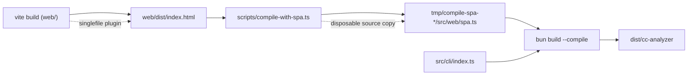
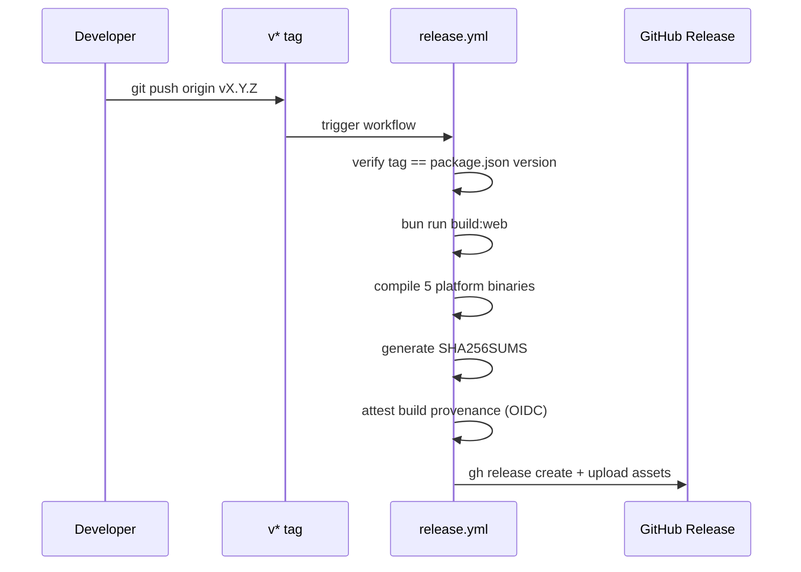

# Repository Structure

> Indexed at commit `51ccd4e` on 2026-07-23 · [view on GitHub](https://github.com/yorch/cc-analyzer/tree/51ccd4e)

## Relevant source files

- [package.json](https://github.com/yorch/cc-analyzer/blob/51ccd4e/package.json)
- [tsconfig.json](https://github.com/yorch/cc-analyzer/blob/51ccd4e/tsconfig.json)
- [web/tsconfig.json](https://github.com/yorch/cc-analyzer/blob/51ccd4e/web/tsconfig.json)
- [biome.json](https://github.com/yorch/cc-analyzer/blob/51ccd4e/biome.json)
- `scripts/compile-with-spa.ts`
- [.github/workflows/ci.yml](https://github.com/yorch/cc-analyzer/blob/51ccd4e/.github/workflows/ci.yml)
- [.github/workflows/release.yml](https://github.com/yorch/cc-analyzer/blob/51ccd4e/.github/workflows/release.yml)
- [.github/workflows/deploy-site.yml](https://github.com/yorch/cc-analyzer/blob/51ccd4e/.github/workflows/deploy-site.yml)
- [README.md](https://github.com/yorch/cc-analyzer/blob/51ccd4e/README.md)
- [CLAUDE.md](https://github.com/yorch/cc-analyzer/blob/51ccd4e/CLAUDE.md)
- [.gitignore](https://github.com/yorch/cc-analyzer/blob/51ccd4e/.gitignore)

## Overview

`cc-analyzer` is a read-only command-line interface (CLI) that browses and analyzes Claude Code sessions stored in `~/.claude`, reporting tokens, cost, tools, skills, and a per-turn breakdown ([README.md#L6-L8](https://github.com/yorch/cc-analyzer/blob/51ccd4e/README.md#L6-L8)). It is written in TypeScript, runs on Bun ≥ 1.3, and ships as a single compiled binary at version `0.6.0` ([package.json:L1-L11](https://github.com/yorch/cc-analyzer/blob/51ccd4e/package.json#L1-L11)). The repository uses a single-package layout: one shared core plus three thin presentation frontends, a separately-configured browser bundle, a documentation site, and a build script that fuses them into one executable.

The top-level directories divide the codebase by concern. `src/` holds all runtime code split into `core/`, `cli/`, `tui/`, and `web/`; `web/` is a standalone React single-page application (SPA) with its own browser-targeted TypeScript config; `site/` is a VitePress documentation site that also hosts the install scripts; `scripts/` contains the SPA-embedding build step; and `test/` mirrors the source tree ([CLAUDE.md#L28-L54](https://github.com/yorch/cc-analyzer/blob/51ccd4e/CLAUDE.md#L28-L54)). Three GitHub Actions workflows govern continuous integration, releases, and documentation deployment.

Sources: [README.md:L1-L27](https://github.com/yorch/cc-analyzer/blob/51ccd4e/README.md#L1-L27) [package.json:L1-L23](https://github.com/yorch/cc-analyzer/blob/51ccd4e/package.json#L1-L23) [CLAUDE.md:L28-L54](https://github.com/yorch/cc-analyzer/blob/51ccd4e/CLAUDE.md#L28-L54)

## Architecture

The release build is a two-stage pipeline. `bun run build:web` first runs Vite over the `web/` SPA, producing a single self-contained `web/dist/index.html`. `scripts/compile-with-spa.ts` then copies the source tree and `package.json` under ignored `tmp/`, writes the HTML as a string module into that disposable copy, and invokes `bun build --compile` against the copied entrypoint. The resulting executable serves the whole web UI with no external assets while builds never modify tracked source.

Sources: `package.json`, `scripts/compile-with-spa.ts`, `README.md`

## Module Layout

| Module | Path | Responsibility |
| ------ | ---- | -------------- |
| Core engine | `src/core/` | Parsing, analysis, pricing, indexing, and self-update logic shared by all frontends |
| CLI | `src/cli/` | Scriptable commands; `index.ts` is the entrypoint and argument router |
| TUI | `src/tui/` | Interactive terminal UI built with Ink + React, launched when the CLI runs with no command |
| Web server | `src/web/` | `cc-analyzer serve`: a Hono API plus the embedded React SPA |
| Web SPA | `web/` | Standalone browser React app, browser-targeted tsconfig, built by Vite |
| Docs site | `site/` | VitePress documentation, landing page, and install scripts |
| Build script | `scripts/` | `compile-with-spa.ts` embeds the Vite build in a disposable source copy |
| Tests | `test/` | Bun test suite mirroring the source tree under `core/`, `cli/`, `tui/`, `web/` |

All parsing, analysis, pricing, and indexing live in `src/core/`; the three frontends under `src/cli/`, `src/tui/`, and `src/web/` are thin presentation layers that consume it ([CLAUDE.md#L30-L45](https://github.com/yorch/cc-analyzer/blob/51ccd4e/CLAUDE.md#L30-L45)). The `web/` directory is distinct from `src/web/`: `web/` is the browser SPA compiled by Vite, whereas `src/web/` is the Bun-side Hono server that serves the embedded SPA ([CLAUDE.md#L37-L45](https://github.com/yorch/cc-analyzer/blob/51ccd4e/CLAUDE.md#L37-L45)).

Sources: [CLAUDE.md:L28-L54](https://github.com/yorch/cc-analyzer/blob/51ccd4e/CLAUDE.md#L28-L54) [package.json:L8-L23](https://github.com/yorch/cc-analyzer/blob/51ccd4e/package.json#L8-L23)

## Key Components

### Package manifest and scripts

[package.json](https://github.com/yorch/cc-analyzer/blob/51ccd4e/package.json) declares the package as an ES module (`"type": "module"`) that requires Bun ≥ 1.3.0 and exposes a single `cc-analyzer` bin pointing at `src/cli/index.ts` ([package.json#L5-L11](https://github.com/yorch/cc-analyzer/blob/51ccd4e/package.json#L5-L11)). The `scripts` block defines the developer workflow: `start`, `test`, `lint`, `check`, two typecheck commands, `build:web`, `dev:web`, and `build` ([package.json#L12-L23](https://github.com/yorch/cc-analyzer/blob/51ccd4e/package.json#L12-L23)). Runtime dependencies are minimal — `hono`, `ink`, `react`, `react-dom`, and `zod` — with Vite, Biome, TypeScript, and testing tooling confined to `devDependencies` ([package.json#L24-L44](https://github.com/yorch/cc-analyzer/blob/51ccd4e/package.json#L24-L44)).

Sources: [package.json:L1-L45](https://github.com/yorch/cc-analyzer/blob/51ccd4e/package.json#L1-L45)

### Dual TypeScript configuration

The repository maintains two TypeScript configs with intentionally incompatible settings, and CI runs both ([CLAUDE.md#L221-L227](https://github.com/yorch/cc-analyzer/blob/51ccd4e/CLAUDE.md#L221-L227)). The root [tsconfig.json](https://github.com/yorch/cc-analyzer/blob/51ccd4e/tsconfig.json) targets Bun with `"types": ["bun"]` and includes `src`, `test`, and `scripts`; it enables `allowImportingTsExtensions`, `resolveJsonModule`, and `verbatimModuleSyntax` ([tsconfig.json#L1-L21](https://github.com/yorch/cc-analyzer/blob/51ccd4e/tsconfig.json#L1-L21)). The browser config [web/tsconfig.json](https://github.com/yorch/cc-analyzer/blob/51ccd4e/web/tsconfig.json) adds `DOM` and `DOM.Iterable` libs and swaps to `"types": ["vite/client"]`, scoping the DOM-facing SPA to its own compilation ([web/tsconfig.json#L1-L17](https://github.com/yorch/cc-analyzer/blob/51ccd4e/web/tsconfig.json#L1-L17)). Both enable `strict` and `noUncheckedIndexedAccess`, and imports use explicit `.ts`/`.tsx` extensions across the project ([tsconfig.json#L9-L18](https://github.com/yorch/cc-analyzer/blob/51ccd4e/tsconfig.json#L9-L18), [web/tsconfig.json#L8-L14](https://github.com/yorch/cc-analyzer/blob/51ccd4e/web/tsconfig.json#L8-L14)).

Sources: [tsconfig.json:L1-L21](https://github.com/yorch/cc-analyzer/blob/51ccd4e/tsconfig.json#L1-L21) [web/tsconfig.json:L1-L17](https://github.com/yorch/cc-analyzer/blob/51ccd4e/web/tsconfig.json#L1-L17) [CLAUDE.md:L219-L227](https://github.com/yorch/cc-analyzer/blob/51ccd4e/CLAUDE.md#L219-L227)

### Linting and formatting

[biome.json](https://github.com/yorch/cc-analyzer/blob/51ccd4e/biome.json) configures Biome as the single lint-and-format tool, replacing ESLint and Prettier. The formatter uses 2-space indentation, a 100-column line width, double quotes, always-on semicolons, and trailing commas everywhere ([biome.json#L19-L37](https://github.com/yorch/cc-analyzer/blob/51ccd4e/biome.json#L19-L37)). Biome reads the Git ignore file, and its `includes` glob covers `src`, `test`, `web`, `scripts`, and top-level JSON while explicitly excluding `web/dist` and the temporarily generated `src/web/spa.ts` ([biome.json#L3-L18](https://github.com/yorch/cc-analyzer/blob/51ccd4e/biome.json#L3-L18)). Import organization runs as an assist action ([biome.json#L38-L44](https://github.com/yorch/cc-analyzer/blob/51ccd4e/biome.json#L38-L44)).

Sources: [biome.json:L1-L45](https://github.com/yorch/cc-analyzer/blob/51ccd4e/biome.json#L1-L45)

### Embedded SPA artifact

`src/web/spa.ts` is a tracked placeholder exporting an empty SPA for typechecking and source-mode commands. `scripts/compile-with-spa.ts` reads `web/dist/index.html` and embeds it only in a disposable source copy under ignored `tmp/`. The tracked placeholder remains byte-for-byte stable across builds.

Sources: `scripts/compile-with-spa.ts`, `.gitignore`, `CLAUDE.md`

### Continuous integration and release workflows

Three GitHub Actions workflows drive the repository. [.github/workflows/ci.yml](https://github.com/yorch/cc-analyzer/blob/51ccd4e/.github/workflows/ci.yml) runs on every push to `main` and every pull request across an `ubuntu-latest` and `macos-latest` matrix, pinning Bun to `1.3.14` and running lint, both typechecks, tests, and a full build in sequence ([.github/workflows/ci.yml#L15-L45](https://github.com/yorch/cc-analyzer/blob/51ccd4e/.github/workflows/ci.yml#L15-L45)). [.github/workflows/release.yml](https://github.com/yorch/cc-analyzer/blob/51ccd4e/.github/workflows/release.yml) fires on `v*` tags: it verifies the tag matches `package.json`'s version, cross-compiles five binaries (Linux x64/arm64, macOS x64/arm64, Windows x64), generates a `SHA256SUMS` manifest, signs a build-provenance attestation via OpenID Connect (OIDC), and publishes a GitHub release ([.github/workflows/release.yml#L1-L85](https://github.com/yorch/cc-analyzer/blob/51ccd4e/.github/workflows/release.yml#L1-L85)). [.github/workflows/deploy-site.yml](https://github.com/yorch/cc-analyzer/blob/51ccd4e/.github/workflows/deploy-site.yml) rebuilds and deploys the VitePress site to GitHub Pages when `site/**`, `wiki/**`, or the workflow file itself changes on `main` ([.github/workflows/deploy-site.yml#L3-L46](https://github.com/yorch/cc-analyzer/blob/51ccd4e/.github/workflows/deploy-site.yml#L3-L46)).

Sources: [.github/workflows/ci.yml:L1-L45](https://github.com/yorch/cc-analyzer/blob/51ccd4e/.github/workflows/ci.yml#L1-L45) [.github/workflows/release.yml:L1-L85](https://github.com/yorch/cc-analyzer/blob/51ccd4e/.github/workflows/release.yml#L1-L85) [.github/workflows/deploy-site.yml:L1-L55](https://github.com/yorch/cc-analyzer/blob/51ccd4e/.github/workflows/deploy-site.yml#L1-L55)

## Data Flow

The release pipeline is gated by a version-consistency check: the compiled binary embeds `package.json`'s version, so a tag on a commit with a stale version would ship binaries reporting the wrong number, and the workflow fails fast when `v$(jq -r .version package.json)` does not equal the tag ([.github/workflows/release.yml#L25-L36](https://github.com/yorch/cc-analyzer/blob/51ccd4e/.github/workflows/release.yml#L25-L36)). After compiling, the workflow generates checksums inside `dist/` so manifest entries are basenames, then attaches every binary plus `SHA256SUMS` to an auto-noted GitHub release ([.github/workflows/release.yml#L64-L85](https://github.com/yorch/cc-analyzer/blob/51ccd4e/.github/workflows/release.yml#L64-L85)).

Sources: [.github/workflows/release.yml:L25-L85](https://github.com/yorch/cc-analyzer/blob/51ccd4e/.github/workflows/release.yml#L25-L85) [CLAUDE.md:L255-L262](https://github.com/yorch/cc-analyzer/blob/51ccd4e/CLAUDE.md#L255-L262)

## Related Pages

- Core analysis engine: [Core Analysis Engine](./2-core-analysis-engine.md)
- Scriptable commands: [CLI](./3-cli.md)
- Terminal UI: [TUI](./4-tui.md)
- Local web server: [Web Server and API](./5-web-server-and-api.md)
- Browser application: [Web SPA Frontend](./6-web-spa-frontend.md)
- Release and self-update: [Updates and Distribution](./8-updates-and-distribution.md)
- Documentation site: [Docs Site](./9-docs-site.md)
