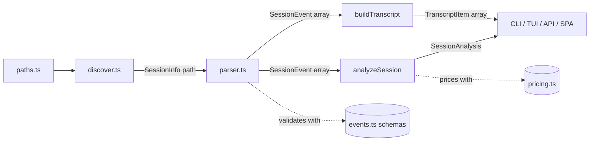
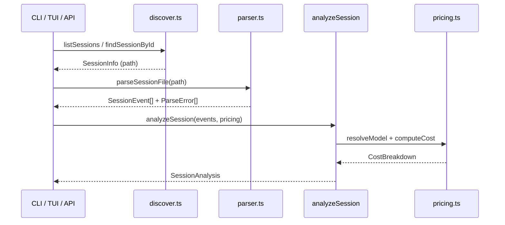

# Core Analysis Engine

> Indexed at commit `4eeed24` on 2026-07-10 · [view on GitHub](https://github.com/yorch/cc-analyzer/tree/4eeed24)

## Relevant source files

- [src/core/analyze.ts](https://github.com/yorch/cc-analyzer/blob/4eeed24/src/core/analyze.ts)
- [src/core/events.ts](https://github.com/yorch/cc-analyzer/blob/4eeed24/src/core/events.ts)
- [src/core/discover.ts](https://github.com/yorch/cc-analyzer/blob/4eeed24/src/core/discover.ts)
- [src/core/paths.ts](https://github.com/yorch/cc-analyzer/blob/4eeed24/src/core/paths.ts)
- [src/core/parser.ts](https://github.com/yorch/cc-analyzer/blob/4eeed24/src/core/parser.ts)
- [src/core/transcript.ts](https://github.com/yorch/cc-analyzer/blob/4eeed24/src/core/transcript.ts)

## Overview

The core analysis engine is the domain layer of cc-analyzer. It reads Claude Code session logs from disk, parses them into typed events, and reduces those events into structured analytics. Every user-facing surface — the CLI, the Ink Terminal User Interface (TUI), the Hono HTTP Application Programming Interface (API), and the React Single Page Application (SPA) — is a thin presentation layer over the functions in `src/core/`.

The engine has two public output shapes. `analyzeSession()` produces a [`SessionAnalysis`](https://github.com/yorch/cc-analyzer/blob/4eeed24/src/core/analyze.ts#L68-L84) with per-turn and aggregate metrics, and `buildTranscript()` produces a linear list of [`TranscriptItem`](https://github.com/yorch/cc-analyzer/blob/4eeed24/src/core/transcript.ts#L6-L17) for human-readable display. Both consume the same `SessionEvent[]` produced by the tolerant parser in [src/core/parser.ts](https://github.com/yorch/cc-analyzer/blob/4eeed24/src/core/parser.ts). The file-discovery layer ([src/core/discover.ts](https://github.com/yorch/cc-analyzer/blob/4eeed24/src/core/discover.ts) and [src/core/paths.ts](https://github.com/yorch/cc-analyzer/blob/4eeed24/src/core/paths.ts)) locates the `.jsonl` files that feed the pipeline. Pricing and index/analytics concerns live in sibling modules documented on their own detail pages.

Sources: [src/core/analyze.ts:L68-L84](https://github.com/yorch/cc-analyzer/blob/4eeed24/src/core/analyze.ts#L68-L84) [src/core/transcript.ts:L1-L17](https://github.com/yorch/cc-analyzer/blob/4eeed24/src/core/transcript.ts#L1-L17) [src/core/parser.ts:L22-L71](https://github.com/yorch/cc-analyzer/blob/4eeed24/src/core/parser.ts#L22-L71)

## Architecture

Discovery resolves the Claude data directory through [src/core/paths.ts](https://github.com/yorch/cc-analyzer/blob/4eeed24/src/core/paths.ts) and enumerates `.jsonl` session files. Each file is read and validated into a `SessionEvent[]` by the parser using the Zod schemas in [src/core/events.ts](https://github.com/yorch/cc-analyzer/blob/4eeed24/src/core/events.ts). That event array then fans out to `analyzeSession()`, which folds it into metrics using the pricing table, and to `buildTranscript()`, which flattens it for reading. The pricing module is a boundary dependency covered on its own page.

Sources: [src/core/discover.ts:L31-L102](https://github.com/yorch/cc-analyzer/blob/4eeed24/src/core/discover.ts#L31-L102) [src/core/parser.ts:L22-L71](https://github.com/yorch/cc-analyzer/blob/4eeed24/src/core/parser.ts#L22-L71) [src/core/analyze.ts:L170-L303](https://github.com/yorch/cc-analyzer/blob/4eeed24/src/core/analyze.ts#L170-L303)

## Module Layout

| Module | Path | Responsibility |
| ------ | ---- | -------------- |
| `analyze` | [src/core/analyze.ts](https://github.com/yorch/cc-analyzer/blob/4eeed24/src/core/analyze.ts) | Fold events into `SessionAnalysis` with per-turn and aggregate metrics |
| `events` | [src/core/events.ts](https://github.com/yorch/cc-analyzer/blob/4eeed24/src/core/events.ts) | Tolerant Zod schemas and TypeScript types for JSONL records |
| `parser` | [src/core/parser.ts](https://github.com/yorch/cc-analyzer/blob/4eeed24/src/core/parser.ts) | Parse JSONL text into typed events, collecting per-line errors |
| `transcript` | [src/core/transcript.ts](https://github.com/yorch/cc-analyzer/blob/4eeed24/src/core/transcript.ts) | Flatten events into a linear human-readable transcript |
| `discover` | [src/core/discover.ts](https://github.com/yorch/cc-analyzer/blob/4eeed24/src/core/discover.ts) | List projects and sessions under `~/.claude/projects` |
| `paths` | [src/core/paths.ts](https://github.com/yorch/cc-analyzer/blob/4eeed24/src/core/paths.ts) | Resolve the Claude data dir and cc-analyzer state dir |

Sources: [src/core/analyze.ts:L1-L84](https://github.com/yorch/cc-analyzer/blob/4eeed24/src/core/analyze.ts#L1-L84) [src/core/events.ts:L1-L58](https://github.com/yorch/cc-analyzer/blob/4eeed24/src/core/events.ts#L1-L58) [src/core/paths.ts:L1-L42](https://github.com/yorch/cc-analyzer/blob/4eeed24/src/core/paths.ts#L1-L42)

## Key Components

### The turn concept and `isRealPrompt()`

The central domain concept is a "turn": one genuine user prompt plus every assistant API call and tool loop that follows it until the next genuine prompt. Turns are discriminated by `isRealPrompt()`, which returns `true` only for a user event that is not `isMeta` and whose content carries at least one block that is not a `tool_result` ([src/core/analyze.ts#L122-L130](https://github.com/yorch/cc-analyzer/blob/4eeed24/src/core/analyze.ts#L122-L130)). User events that carry only `tool_result` blocks are loop continuations, not new turns. The comment notes that `promptId` cannot serve as a discriminator because it is present on `tool_result` carriers too.

This logic is intentionally duplicated: `analyze.ts` and `transcript.ts` each define their own `isRealPrompt()` with the same rule ([src/core/analyze.ts#L122-L130](https://github.com/yorch/cc-analyzer/blob/4eeed24/src/core/analyze.ts#L122-L130), [src/core/transcript.ts#L44-L49](https://github.com/yorch/cc-analyzer/blob/4eeed24/src/core/transcript.ts#L44-L49)). Both modules number turns identically so that analytics turns and transcript turns line up.

Sources: [src/core/analyze.ts:L118-L130](https://github.com/yorch/cc-analyzer/blob/4eeed24/src/core/analyze.ts#L118-L130) [src/core/transcript.ts:L44-L49](https://github.com/yorch/cc-analyzer/blob/4eeed24/src/core/transcript.ts#L44-L49)

### `analyzeSession()`

`analyzeSession()` is the central orchestrator. It walks the event array once, opening a new [`Turn`](https://github.com/yorch/cc-analyzer/blob/4eeed24/src/core/analyze.ts#L38-L50) whenever `isRealPrompt()` matches and attributing every subsequent assistant event to the `current` turn ([src/core/analyze.ts#L200-L303](https://github.com/yorch/cc-analyzer/blob/4eeed24/src/core/analyze.ts#L200-L303)). For each assistant event it extracts token usage via `usageToTokens()`, resolves the model against the pricing table, and computes cost, marking the cost `estimated` when the model match is a non-exact family heuristic ([src/core/analyze.ts#L233-L244](https://github.com/yorch/cc-analyzer/blob/4eeed24/src/core/analyze.ts#L233-L244)).

Alongside per-turn accumulation, the function maintains session-wide sets and maps: git branches, versions, per-model usage, tool counts, invoked skills, spawned subagents, and touched files ([src/core/analyze.ts#L170-L198](https://github.com/yorch/cc-analyzer/blob/4eeed24/src/core/analyze.ts#L170-L198)). Tool-use blocks are inspected by name — a `Skill` block records its `skill` or `command` input, a `Task` block records its `subagent_type`, and file-mutating tools in `FILE_TOOLS` record their `file_path` ([src/core/analyze.ts#L257-L267](https://github.com/yorch/cc-analyzer/blob/4eeed24/src/core/analyze.ts#L257-L267)). The `touchTime()` closure widens both the session and current-turn time bounds on every timestamped event, yielding `startTime`, `endTime`, and `durationMs` ([src/core/analyze.ts#L190-L198](https://github.com/yorch/cc-analyzer/blob/4eeed24/src/core/analyze.ts#L190-L198)).

Tool error status is resolved up front by `collectToolErrors()`, which scans every `tool_result` in the session into a `tool_use_id → is_error` map so each `ToolCall` can be flagged ([src/core/analyze.ts#L144-L159](https://github.com/yorch/cc-analyzer/blob/4eeed24/src/core/analyze.ts#L144-L159), [src/core/analyze.ts#L251-L256](https://github.com/yorch/cc-analyzer/blob/4eeed24/src/core/analyze.ts#L251-L256)). After the pass, per-turn totals are summed into `SessionTotals` and the assembled `SessionAnalysis` is returned ([src/core/analyze.ts#L305-L340](https://github.com/yorch/cc-analyzer/blob/4eeed24/src/core/analyze.ts#L305-L340)).

Sources: [src/core/analyze.ts:L170-L341](https://github.com/yorch/cc-analyzer/blob/4eeed24/src/core/analyze.ts#L170-L341)

### `buildTranscript()`

`buildTranscript()` flattens events into a linear list of `TranscriptItem` shared by the TUI and web transcript readers ([src/core/transcript.ts#L55-L139](https://github.com/yorch/cc-analyzer/blob/4eeed24/src/core/transcript.ts#L55-L139)). A genuine prompt increments `turnIndex` and emits a `prompt` item labeled "You"; a `tool_result` carrier emits one `tool_result` item per block, labeled "result" or "result (error)" ([src/core/transcript.ts#L64-L98](https://github.com/yorch/cc-analyzer/blob/4eeed24/src/core/transcript.ts#L64-L98)). Assistant events emit `text`, `thinking`, and `tool_use` items, with tool inputs serialized to formatted JSON ([src/core/transcript.ts#L101-L135](https://github.com/yorch/cc-analyzer/blob/4eeed24/src/core/transcript.ts#L101-L135)). The helper `contentToText()` normalizes string-or-block `tool_result` content, rendering images as `[image]` ([src/core/transcript.ts#L27-L42](https://github.com/yorch/cc-analyzer/blob/4eeed24/src/core/transcript.ts#L27-L42)).

Sources: [src/core/transcript.ts:L27-L139](https://github.com/yorch/cc-analyzer/blob/4eeed24/src/core/transcript.ts#L27-L139)

### Parser and event schemas

`parseSessionText()` splits the file on newlines and parses each non-empty line as JSON, recording invalid JSON as a `ParseError` rather than throwing ([src/core/parser.ts#L22-L37](https://github.com/yorch/cc-analyzer/blob/4eeed24/src/core/parser.ts#L22-L37)). It looks up a schema by the record's `type` in `schemaByType` and validates with `safeParse`; a known type whose shape has drifted is preserved as a tolerant unknown event with a noted validation error, so downstream counts stay consistent ([src/core/parser.ts#L39-L64](https://github.com/yorch/cc-analyzer/blob/4eeed24/src/core/parser.ts#L39-L64)). Every schema in [src/core/events.ts](https://github.com/yorch/cc-analyzer/blob/4eeed24/src/core/events.ts) is a `looseObject`, so unknown or future fields are preserved rather than stripped ([src/core/events.ts#L1-L58](https://github.com/yorch/cc-analyzer/blob/4eeed24/src/core/events.ts#L1-L58)). `parseSessionFile()` reads the file through `Bun.file(path).text()` before delegating to `parseSessionText()` ([src/core/parser.ts#L67-L71](https://github.com/yorch/cc-analyzer/blob/4eeed24/src/core/parser.ts#L67-L71)). Deeper coverage of the schemas lives on the session-parsing detail page.

Sources: [src/core/parser.ts:L15-L71](https://github.com/yorch/cc-analyzer/blob/4eeed24/src/core/parser.ts#L15-L71) [src/core/events.ts:L1-L58](https://github.com/yorch/cc-analyzer/blob/4eeed24/src/core/events.ts#L1-L58)

### Discovery layer

`listProjects()` reads the `projectsDir()` root, counts `.jsonl` files in each subdirectory, and returns `ProjectInfo` records sorted by descending session count ([src/core/discover.ts#L31-L51](https://github.com/yorch/cc-analyzer/blob/4eeed24/src/core/discover.ts#L31-L51)). `listSessions()` enumerates session files for one project, stats each for size and modification time, and sorts newest-first ([src/core/discover.ts#L53-L79](https://github.com/yorch/cc-analyzer/blob/4eeed24/src/core/discover.ts#L53-L79)). `listAllSessions()` and `findSessionById()` compose these to span every project ([src/core/discover.ts#L81-L102](https://github.com/yorch/cc-analyzer/blob/4eeed24/src/core/discover.ts#L81-L102)). All directory reads swallow errors and fall back to empty results, so a missing or unreadable directory never crashes discovery ([src/core/discover.ts#L23-L48](https://github.com/yorch/cc-analyzer/blob/4eeed24/src/core/discover.ts#L23-L48)).

`decodeProjectLabel()` reconstructs a best-effort path from an encoded project directory name, but the encoding replaces both `/` and `.` with `-` and is therefore not reversible; the authoritative project path is the `cwd` read from a session's events ([src/core/paths.ts#L32-L42](https://github.com/yorch/cc-analyzer/blob/4eeed24/src/core/paths.ts#L32-L42)).

Sources: [src/core/discover.ts:L23-L102](https://github.com/yorch/cc-analyzer/blob/4eeed24/src/core/discover.ts#L23-L102) [src/core/paths.ts:L32-L42](https://github.com/yorch/cc-analyzer/blob/4eeed24/src/core/paths.ts#L32-L42)

## Data Flow

A consumer first discovers a session path, parses the file into events, then folds those events into a `SessionAnalysis`. During the fold, `analyzeSession()` calls into the pricing module per assistant event to resolve the model and compute cost ([src/core/analyze.ts#L233-L244](https://github.com/yorch/cc-analyzer/blob/4eeed24/src/core/analyze.ts#L233-L244)). The same event array can instead be handed to `buildTranscript()` when the caller wants a readable log rather than metrics.

Sources: [src/core/parser.ts:L67-L71](https://github.com/yorch/cc-analyzer/blob/4eeed24/src/core/parser.ts#L67-L71) [src/core/analyze.ts:L170-L303](https://github.com/yorch/cc-analyzer/blob/4eeed24/src/core/analyze.ts#L170-L303) [src/core/discover.ts:L53-L102](https://github.com/yorch/cc-analyzer/blob/4eeed24/src/core/discover.ts#L53-L102)

## Configuration & Extension Points

Filesystem locations are overridable through environment variables so the read-only engine can be pointed at fixtures during testing.

| Setting | Type | Default | Purpose |
| ------- | ---- | ------- | ------- |
| `CC_ANALYZER_CLAUDE_DIR` | env var | `~/.claude` | Root of the Claude Code data directory read by discovery |
| `CC_ANALYZER_STATE_DIR` | env var | `$XDG_CONFIG_HOME/cc-analyzer` or `~/.config/cc-analyzer` | cc-analyzer's own state directory for the index db and pricing cache |

`claudeDir()` and `stateDir()` read these overrides, and `stateDir()` further honors `XDG_CONFIG_HOME` before falling back to `~/.config` ([src/core/paths.ts#L11-L30](https://github.com/yorch/cc-analyzer/blob/4eeed24/src/core/paths.ts#L11-L30)). New JSONL record types are supported by adding a schema to the `schemaByType` registry in [src/core/events.ts](https://github.com/yorch/cc-analyzer/blob/4eeed24/src/core/events.ts) ([src/core/events.ts#L147-L157](https://github.com/yorch/cc-analyzer/blob/4eeed24/src/core/events.ts#L147-L157)).

Sources: [src/core/paths.ts:L11-L30](https://github.com/yorch/cc-analyzer/blob/4eeed24/src/core/paths.ts#L11-L30) [src/core/events.ts:L147-L157](https://github.com/yorch/cc-analyzer/blob/4eeed24/src/core/events.ts#L147-L157)

## Related Pages

- Detail: [Session Parsing & Events](./2.1-session-parsing-and-events.md)
- Detail: [Cost & Pricing](./2.2-cost-and-pricing.md)
- Detail: [Index & Analytics](./2.3-index-and-analytics.md)
- Sibling: [CLI](./3-cli.md)
- Sibling: [TUI](./4-tui.md)
- Sibling: [Web Server & API](./5-web-server-and-api.md)
- Sibling: [Web SPA Frontend](./6-web-spa-frontend.md)
