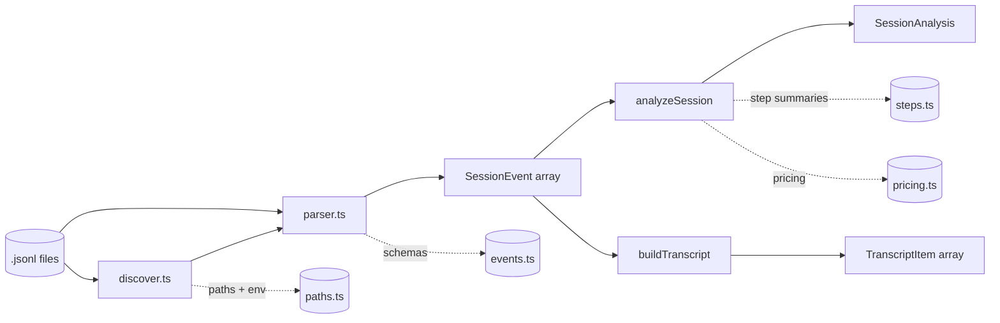
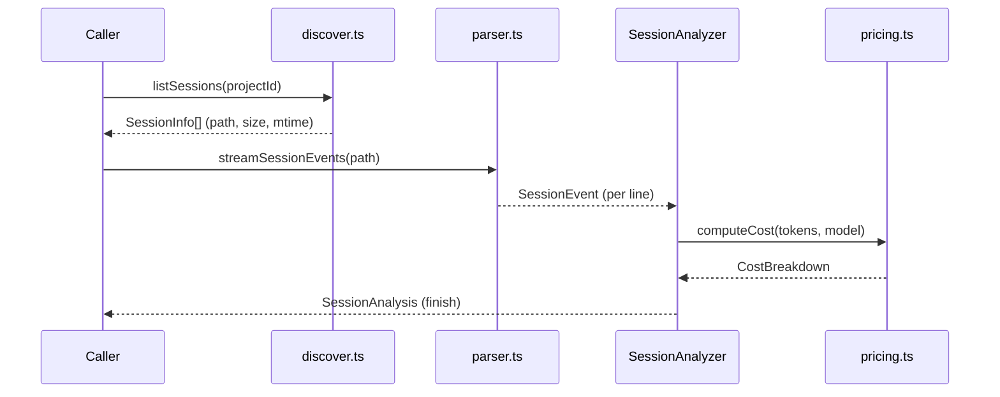

# Core Analysis Engine

> Indexed at commit `51ccd4e` on 2026-07-23 · [view on GitHub](https://github.com/yorch/cc-analyzer/tree/51ccd4e)

## Relevant source files

- [src/core/analyze.ts](https://github.com/yorch/cc-analyzer/blob/51ccd4e/src/core/analyze.ts)
- [src/core/events.ts](https://github.com/yorch/cc-analyzer/blob/51ccd4e/src/core/events.ts)
- [src/core/parser.ts](https://github.com/yorch/cc-analyzer/blob/51ccd4e/src/core/parser.ts)
- [src/core/transcript.ts](https://github.com/yorch/cc-analyzer/blob/51ccd4e/src/core/transcript.ts)
- [src/core/steps.ts](https://github.com/yorch/cc-analyzer/blob/51ccd4e/src/core/steps.ts)
- [src/core/discover.ts](https://github.com/yorch/cc-analyzer/blob/51ccd4e/src/core/discover.ts)
- [src/core/paths.ts](https://github.com/yorch/cc-analyzer/blob/51ccd4e/src/core/paths.ts)

## Overview

The Core Analysis Engine is the shared library under `src/core/` that turns a Claude Code session's raw JSON Lines (JSONL) log into structured metrics. Every frontend — the scriptable Command-Line Interface (CLI), the terminal UI, and the web server — is a thin presentation layer over this engine; none of them re-implement parsing, turn segmentation, or metric aggregation. The engine reads from `~/.claude` but never writes to it, and all parsing is tolerant so newer Claude Code log formats never break analysis ([src/core/events.ts:L1-L8](https://github.com/yorch/cc-analyzer/blob/51ccd4e/src/core/events.ts#L1-L8)).

The public surface is small: `parseSessionFile` / `streamSessionEvents` produce a typed `SessionEvent[]` stream from a `.jsonl` file ([src/core/parser.ts#L142](https://github.com/yorch/cc-analyzer/blob/51ccd4e/src/core/parser.ts#L142)), `analyzeSession` / `analyzeSessionStream` fold those events into a `SessionAnalysis` ([src/core/analyze.ts#L834](https://github.com/yorch/cc-analyzer/blob/51ccd4e/src/core/analyze.ts#L834)), `buildTranscript` flattens the same events into a linear reading view ([src/core/transcript.ts#L54](https://github.com/yorch/cc-analyzer/blob/51ccd4e/src/core/transcript.ts#L54)), and `listProjects` / `listSessions` discover the files on disk ([src/core/discover.ts#L32-L79](https://github.com/yorch/cc-analyzer/blob/51ccd4e/src/core/discover.ts#L32-L79)). `SessionAnalysis` is the central data structure the CLI and web renderers consume directly, and it is what `indexer.ts` flattens into a SQLite row.

## Architecture

The pipeline is strictly forward: [src/core/discover.ts](https://github.com/yorch/cc-analyzer/blob/51ccd4e/src/core/discover.ts) locates session files, [src/core/parser.ts](https://github.com/yorch/cc-analyzer/blob/51ccd4e/src/core/parser.ts) decodes each line into a typed event validated against the schemas in [src/core/events.ts](https://github.com/yorch/cc-analyzer/blob/51ccd4e/src/core/events.ts), and the event stream fans out to two consumers — `analyzeSession` for metrics and `buildTranscript` for a human-readable view. `analyze.ts` leans on [src/core/steps.ts](https://github.com/yorch/cc-analyzer/blob/51ccd4e/src/core/steps.ts) for per-operation summaries and on `pricing.ts` for cost. [src/core/paths.ts](https://github.com/yorch/cc-analyzer/blob/51ccd4e/src/core/paths.ts) supplies every filesystem location and the test-only environment overrides.

## Module Layout

| Module | Path | Responsibility |
| ------ | ---- | -------------- |
| `analyze` | [src/core/analyze.ts](https://github.com/yorch/cc-analyzer/blob/51ccd4e/src/core/analyze.ts) | Fold `SessionEvent[]` into a `SessionAnalysis` (turns + aggregates) |
| `events` | [src/core/events.ts](https://github.com/yorch/cc-analyzer/blob/51ccd4e/src/core/events.ts) | Tolerant Zod schemas, event types, `isRealPrompt` turn discriminator |
| `parser` | [src/core/parser.ts](https://github.com/yorch/cc-analyzer/blob/51ccd4e/src/core/parser.ts) | Parse JSONL text/files/streams into events, never throwing |
| `transcript` | [src/core/transcript.ts](https://github.com/yorch/cc-analyzer/blob/51ccd4e/src/core/transcript.ts) | Flatten events into a linear `TranscriptItem[]` reading view |
| `steps` | [src/core/steps.ts](https://github.com/yorch/cc-analyzer/blob/51ccd4e/src/core/steps.ts) | Tool-aware one-line summaries and result hints for turn steps |
| `discover` | [src/core/discover.ts](https://github.com/yorch/cc-analyzer/blob/51ccd4e/src/core/discover.ts) | Enumerate projects and session files under `~/.claude/projects` |
| `paths` | [src/core/paths.ts](https://github.com/yorch/cc-analyzer/blob/51ccd4e/src/core/paths.ts) | Resolve data/state paths and honor env-var overrides |

Sources: [src/core/analyze.ts:L1-L28](https://github.com/yorch/cc-analyzer/blob/51ccd4e/src/core/analyze.ts#L1-L28) [src/core/events.ts:L156-L198](https://github.com/yorch/cc-analyzer/blob/51ccd4e/src/core/events.ts#L156-L198) [src/core/parser.ts:L71-L152](https://github.com/yorch/cc-analyzer/blob/51ccd4e/src/core/parser.ts#L71-L152) [src/core/discover.ts:L1-L21](https://github.com/yorch/cc-analyzer/blob/51ccd4e/src/core/discover.ts#L1-L21)

## Key Components

### Discovery and paths

`discover.ts` walks `~/.claude/projects`, treating each subdirectory as a project and each `.jsonl` file as a session. `listProjects` returns one `ProjectInfo` per directory with a `sessionCount`, sorted by count ([src/core/discover.ts#L32-L51](https://github.com/yorch/cc-analyzer/blob/51ccd4e/src/core/discover.ts#L32-L51)); `listSessions` returns `SessionInfo` records carrying `sizeBytes` and `mtimeMs`, sorted newest-first ([src/core/discover.ts#L54-L79](https://github.com/yorch/cc-analyzer/blob/51ccd4e/src/core/discover.ts#L54-L79)). The `(size, mtime)` pair on each `SessionInfo` is exactly what the incremental indexer uses to skip unchanged files. Every filesystem read is wrapped so a missing or unreadable directory yields an empty list rather than an exception.

A project's stable identity is its encoded directory name, exposed as `ProjectInfo.id` ([src/core/discover.ts#L5-L12](https://github.com/yorch/cc-analyzer/blob/51ccd4e/src/core/discover.ts#L5-L12)). `decodeProjectLabel` produces a display label by replacing `-` with `/`, but the encoding collapses both `/` and `.` into `-` and is therefore not reversible ([src/core/paths.ts#L40-L43](https://github.com/yorch/cc-analyzer/blob/51ccd4e/src/core/paths.ts#L40-L43)); the authoritative project path comes from a session's `cwd` field, not from decoding the id. `paths.ts` centralizes every location — `claudeDir`, `projectsDir`, `stateDir`, `indexDbPath`, `pricingCachePath`, and `updateCachePath` — and reads the `CC_ANALYZER_CLAUDE_DIR` and `CC_ANALYZER_STATE_DIR` overrides that the test suite relies on ([src/core/paths.ts#L12-L31](https://github.com/yorch/cc-analyzer/blob/51ccd4e/src/core/paths.ts#L12-L31)).

Sources: [src/core/discover.ts:L1-L102](https://github.com/yorch/cc-analyzer/blob/51ccd4e/src/core/discover.ts#L1-L102) [src/core/paths.ts:L1-L43](https://github.com/yorch/cc-analyzer/blob/51ccd4e/src/core/paths.ts#L1-L43)

### Parsing and events

`parser.ts` decodes JSONL through a single per-line function, `parseLineOutcome`, shared by all three entry points so their behavior can never drift ([src/core/parser.ts#L30-L69](https://github.com/yorch/cc-analyzer/blob/51ccd4e/src/core/parser.ts#L30-L69)). The parser never throws: a line that is not valid JSON becomes a recorded `ParseError` and is skipped, and a known event type whose Zod schema fails validation is still surfaced as a tolerant "unknown" event so downstream counts stay consistent ([src/core/parser.ts#L44-L59](https://github.com/yorch/cc-analyzer/blob/51ccd4e/src/core/parser.ts#L44-L59)). `streamSessionEvents` yields events lazily off a byte stream that reassembles lines spanning chunks, so multi-hundred-megabyte sessions never materialize as one string ([src/core/parser.ts#L93-L139](https://github.com/yorch/cc-analyzer/blob/51ccd4e/src/core/parser.ts#L93-L139)).

`events.ts` defines the schemas and TypeScript types for every record kind — `assistant`, `user`, `system`, `ai-title`, and more — keyed in a `schemaByType` registry ([src/core/events.ts#L156-L166](https://github.com/yorch/cc-analyzer/blob/51ccd4e/src/core/events.ts#L156-L166)). Every object schema is a `looseObject`, preserving unknown or future fields instead of stripping them ([src/core/events.ts#L10-L27](https://github.com/yorch/cc-analyzer/blob/51ccd4e/src/core/events.ts#L10-L27)). Deep coverage of the schema layer lives in its own detail page.

Sources: [src/core/parser.ts:L21-L69](https://github.com/yorch/cc-analyzer/blob/51ccd4e/src/core/parser.ts#L21-L69) [src/core/events.ts:L1-L166](https://github.com/yorch/cc-analyzer/blob/51ccd4e/src/core/events.ts#L1-L166)

### Turn segmentation and `isRealPrompt`

A *turn* is one genuine user prompt plus every assistant API call and tool loop until the next genuine prompt. The discriminator is `isRealPrompt` in [src/core/events.ts#L191-L198](https://github.com/yorch/cc-analyzer/blob/51ccd4e/src/core/events.ts#L191-L198): a user event opens a turn only when it is not a sidechain, not `isMeta`, not an `isCompactSummary` record, and carries something other than `tool_result` blocks. Because both `analyze.ts` and `transcript.ts` import this same function, turn boundaries cannot diverge between the metrics view and the reading view — the rule changes in exactly one place ([src/core/analyze.ts#L529](https://github.com/yorch/cc-analyzer/blob/51ccd4e/src/core/analyze.ts#L529), [src/core/transcript.ts#L78](https://github.com/yorch/cc-analyzer/blob/51ccd4e/src/core/transcript.ts#L78)).

Turn depth is tracked as the number of main-chain API calls in the open turn, finalized into a `turnDepths` array at each boundary; this series survives even the aggregate-only mode where the full `turns` array is never built ([src/core/analyze.ts#L362-L366](https://github.com/yorch/cc-analyzer/blob/51ccd4e/src/core/analyze.ts#L362-L366), [src/core/analyze.ts#L529-L557](https://github.com/yorch/cc-analyzer/blob/51ccd4e/src/core/analyze.ts#L529-L557)).

Sources: [src/core/events.ts:L176-L198](https://github.com/yorch/cc-analyzer/blob/51ccd4e/src/core/events.ts#L176-L198) [src/core/analyze.ts:L529-L560](https://github.com/yorch/cc-analyzer/blob/51ccd4e/src/core/analyze.ts#L529-L560) [src/core/transcript.ts:L63-L110](https://github.com/yorch/cc-analyzer/blob/51ccd4e/src/core/transcript.ts#L63-L110)

### `SessionAnalyzer` and the streaming API

The heart of the engine is the `SessionAnalyzer` class, a streaming accumulator that both public functions wrap ([src/core/analyze.ts#L316-L397](https://github.com/yorch/cc-analyzer/blob/51ccd4e/src/core/analyze.ts#L316-L397)). `analyzeSession` builds an analyzer, pushes an in-memory `SessionEvent[]` through it, and calls `finish` ([src/core/analyze.ts#L834-L838](https://github.com/yorch/cc-analyzer/blob/51ccd4e/src/core/analyze.ts#L834-L838)); `analyzeSessionStream` does the same over an `AsyncIterable`, avoiding a full event array — the memory win for the indexer over large sessions ([src/core/analyze.ts#L847-L855](https://github.com/yorch/cc-analyzer/blob/51ccd4e/src/core/analyze.ts#L847-L855)). `AnalyzeOptions.detail` toggles the per-turn timeline: with `detail: false` only aggregate fields are computed, but `promptChars` and `turnDepths` still carry the turn-derived aggregates the indexer needs ([src/core/analyze.ts#L156-L163](https://github.com/yorch/cc-analyzer/blob/51ccd4e/src/core/analyze.ts#L156-L163)).

`SessionAnalysis` is the output record: per-turn `turns`, aggregate `totals`, and dozens of rollups — `models`, `tools`, `toolErrors`, `skills`, `subagents`, `filesTouched`, `stopReasons`, `permissionModes`, `bashCommands`, `commandHeads`, `testRuns`, `retries`, and `compactions` ([src/core/analyze.ts#L106-L154](https://github.com/yorch/cc-analyzer/blob/51ccd4e/src/core/analyze.ts#L106-L154)). A single forward pass resolves tool errors: each `tool_use` registers a `PendingTool`, and the later-arriving `tool_result` patches its status and attributes any error, so no second pass over the events is needed ([src/core/analyze.ts#L289-L301](https://github.com/yorch/cc-analyzer/blob/51ccd4e/src/core/analyze.ts#L289-L301), [src/core/analyze.ts#L436-L460](https://github.com/yorch/cc-analyzer/blob/51ccd4e/src/core/analyze.ts#L436-L460)).

Sources: [src/core/analyze.ts:L106-L163](https://github.com/yorch/cc-analyzer/blob/51ccd4e/src/core/analyze.ts#L106-L163) [src/core/analyze.ts:L316-L397](https://github.com/yorch/cc-analyzer/blob/51ccd4e/src/core/analyze.ts#L316-L397) [src/core/analyze.ts:L834-L855](https://github.com/yorch/cc-analyzer/blob/51ccd4e/src/core/analyze.ts#L834-L855)

### Streamed-response de-duplication and compaction

A single API response is logged as one `assistant` line per content block, each repeating the same `message.id` and `requestId` and the full `usage`. `SessionAnalyzer` keys each call by that id via `usageKey`, treats any repeat as a continuation, and counts `usage` exactly once while still merging the continuation's steps into the originating `ApiCall` ([src/core/analyze.ts#L386-L392](https://github.com/yorch/cc-analyzer/blob/51ccd4e/src/core/analyze.ts#L386-L392), [src/core/analyze.ts#L579-L707](https://github.com/yorch/cc-analyzer/blob/51ccd4e/src/core/analyze.ts#L579-L707)). This is what keeps token and cost totals from being inflated by the streaming block count. A call's `stop_reason` is counted once regardless of which line first carries it ([src/core/analyze.ts#L426-L433](https://github.com/yorch/cc-analyzer/blob/51ccd4e/src/core/analyze.ts#L426-L433)).

The engine also reconstructs context compactions. A newer `system`/`compact_boundary` event carries a trigger and pre-compaction token count, while older Claude Code versions leave only the synthetic `isCompactSummary` prompt ([src/core/analyze.ts#L66-L87](https://github.com/yorch/cc-analyzer/blob/51ccd4e/src/core/analyze.ts#L66-L87)). `SessionAnalyzer` pairs a boundary with its immediately following summary — per chain kind, since subagents compact too — so one compaction is never recorded twice, and it flags records as `isSidechain` or `inherited` from a parent session ([src/core/analyze.ts#L482-L513](https://github.com/yorch/cc-analyzer/blob/51ccd4e/src/core/analyze.ts#L482-L513), [src/core/analyze.ts#L570-L577](https://github.com/yorch/cc-analyzer/blob/51ccd4e/src/core/analyze.ts#L570-L577)). Cost itself is derived by `pricing.ts` from token counts, with a non-exact model match flagging the cost as `estimated` ([src/core/analyze.ts#L716-L719](https://github.com/yorch/cc-analyzer/blob/51ccd4e/src/core/analyze.ts#L716-L719)); the pricing model has its own detail page.

Sources: [src/core/analyze.ts:L66-L104](https://github.com/yorch/cc-analyzer/blob/51ccd4e/src/core/analyze.ts#L66-L104) [src/core/analyze.ts:L386-L433](https://github.com/yorch/cc-analyzer/blob/51ccd4e/src/core/analyze.ts#L386-L433) [src/core/analyze.ts:L482-L513](https://github.com/yorch/cc-analyzer/blob/51ccd4e/src/core/analyze.ts#L482-L513) [src/core/analyze.ts:L570-L719](https://github.com/yorch/cc-analyzer/blob/51ccd4e/src/core/analyze.ts#L570-L719)

### Transcript and step summaries

`buildTranscript` produces the linear reading view: it walks the same events and emits `TranscriptItem` records for prompts, assistant text, thinking blocks, tool uses, and tool results, tagging post-compaction summaries as a `system` role rather than a prompt ([src/core/transcript.ts#L54-L110](https://github.com/yorch/cc-analyzer/blob/51ccd4e/src/core/transcript.ts#L54-L110)). Turn numbering advances only on `isRealPrompt`, keeping it aligned with the analyzer ([src/core/transcript.ts#L78-L88](https://github.com/yorch/cc-analyzer/blob/51ccd4e/src/core/transcript.ts#L78-L88)).

`steps.ts` supplies the per-operation summaries that populate a turn's timeline. `summarizeToolUse` maps a tool name and input to a `StepKind`, a display label, and a one-line summary — a `Bash` call surfaces its `description` or `command`, a `Read` its `file_path`, a `Grep` its `pattern` ([src/core/steps.ts#L86-L169](https://github.com/yorch/cc-analyzer/blob/51ccd4e/src/core/steps.ts#L86-L169)). `makeResultHint` derives a short status like `"3 lines"` or an error's first line from the result text ([src/core/steps.ts#L171-L182](https://github.com/yorch/cc-analyzer/blob/51ccd4e/src/core/steps.ts#L171-L182)), and `capDetail` bounds long inputs and results for inline expansion ([src/core/steps.ts#L45-L57](https://github.com/yorch/cc-analyzer/blob/51ccd4e/src/core/steps.ts#L45-L57)). The full step model has its own detail page.

Sources: [src/core/transcript.ts:L1-L150](https://github.com/yorch/cc-analyzer/blob/51ccd4e/src/core/transcript.ts#L1-L150) [src/core/steps.ts:L1-L182](https://github.com/yorch/cc-analyzer/blob/51ccd4e/src/core/steps.ts#L1-L182)

## Data Flow

For one session, a caller discovers the file, streams its events line by line, and pushes each event into a `SessionAnalyzer` that prices token usage as it goes and returns a `SessionAnalysis` when the stream ends. The same event stream can be handed to `buildTranscript` instead of, or alongside, the analyzer.

Sources: [src/core/discover.ts:L54-L79](https://github.com/yorch/cc-analyzer/blob/51ccd4e/src/core/discover.ts#L54-L79) [src/core/parser.ts:L129-L152](https://github.com/yorch/cc-analyzer/blob/51ccd4e/src/core/parser.ts#L129-L152) [src/core/analyze.ts:L710-L765](https://github.com/yorch/cc-analyzer/blob/51ccd4e/src/core/analyze.ts#L710-L765)

## Configuration & Extension Points

| Setting | Type | Default | Purpose |
| ------- | ---- | ------- | ------- |
| `CC_ANALYZER_CLAUDE_DIR` | env var | `~/.claude` | Override the Claude Code data directory (tests) |
| `CC_ANALYZER_STATE_DIR` | env var | `$XDG_CONFIG_HOME/cc-analyzer` or `~/.config/cc-analyzer` | Override cc-analyzer's own state directory |
| `AnalyzeOptions.detail` | `boolean` | `true` | Build the per-turn timeline, or compute aggregates only |

Sources: [src/core/paths.ts:L12-L31](https://github.com/yorch/cc-analyzer/blob/51ccd4e/src/core/paths.ts#L12-L31) [src/core/analyze.ts:L156-L163](https://github.com/yorch/cc-analyzer/blob/51ccd4e/src/core/analyze.ts#L156-L163)

## Related Pages

- Detail: [Session Parsing and Events](./2.1-session-parsing-and-events.md)
- Detail: [Cost and Pricing](./2.2-cost-and-pricing.md)
- Detail: [Index and Analytics](./2.3-index-and-analytics.md)
- Detail: [Per-Turn Steps](./2.4-per-turn-steps.md)
- Sibling: [Analytics and Insights](./7-analytics-and-insights.md)
- Sibling: [CLI](./3-cli.md)
- Sibling: [TUI](./4-tui.md)
- Sibling: [Web Server and API](./5-web-server-and-api.md)
