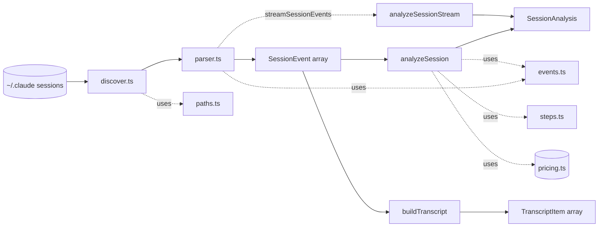
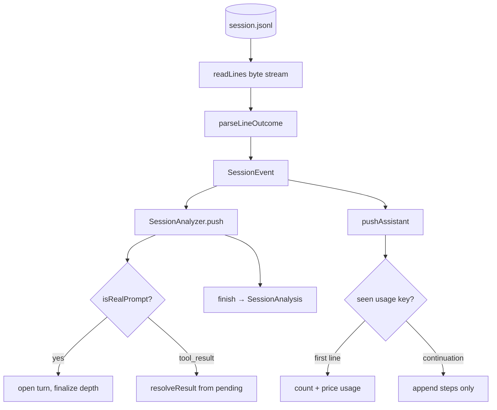

# Core Analysis Engine

> Indexed at commit `9d4dd3f` on 2026-07-23 · [view on GitHub](https://github.com/yorch/cc-analyzer/tree/9d4dd3f)

## Relevant source files

- [src/core/analyze.ts](https://github.com/yorch/cc-analyzer/blob/9d4dd3f/src/core/analyze.ts)
- [src/core/events.ts](https://github.com/yorch/cc-analyzer/blob/9d4dd3f/src/core/events.ts)
- [src/core/parser.ts](https://github.com/yorch/cc-analyzer/blob/9d4dd3f/src/core/parser.ts)
- [src/core/transcript.ts](https://github.com/yorch/cc-analyzer/blob/9d4dd3f/src/core/transcript.ts)
- [src/core/steps.ts](https://github.com/yorch/cc-analyzer/blob/9d4dd3f/src/core/steps.ts)
- [src/core/discover.ts](https://github.com/yorch/cc-analyzer/blob/9d4dd3f/src/core/discover.ts)
- [src/core/paths.ts](https://github.com/yorch/cc-analyzer/blob/9d4dd3f/src/core/paths.ts)

## Overview

The Core Analysis Engine is the read-only pipeline that turns a Claude Code session file into structured metrics. Every Claude Code session lives as a JSON Lines (JSONL) file under `~/.claude/projects/<project>/<session>.jsonl`; the engine discovers those files, parses each line into a typed `SessionEvent`, and folds the events into a `SessionAnalysis` — the central data structure carrying both per-turn timelines and aggregate token, cost, and tool metrics. All three frontends (CLI, terminal UI, and web server) are thin presentation layers over this one core.

The public surface is small and deliberate. [src/core/discover.ts](https://github.com/yorch/cc-analyzer/blob/9d4dd3f/src/core/discover.ts) enumerates projects and session files; [src/core/paths.ts](https://github.com/yorch/cc-analyzer/blob/9d4dd3f/src/core/paths.ts) resolves filesystem locations with test-friendly env overrides; [src/core/parser.ts](https://github.com/yorch/cc-analyzer/blob/9d4dd3f/src/core/parser.ts) tolerantly decodes JSONL; [src/core/analyze.ts](https://github.com/yorch/cc-analyzer/blob/9d4dd3f/src/core/analyze.ts) exposes `analyzeSession` and `analyzeSessionStream`; [src/core/transcript.ts](https://github.com/yorch/cc-analyzer/blob/9d4dd3f/src/core/transcript.ts) builds a linear human-readable transcript; and [src/core/steps.ts](https://github.com/yorch/cc-analyzer/blob/9d4dd3f/src/core/steps.ts) renders per-inference `TurnStep` timelines. Event schemas and the shared turn discriminator `isRealPrompt` live in [src/core/events.ts](https://github.com/yorch/cc-analyzer/blob/9d4dd3f/src/core/events.ts).

## Architecture

The engine has two entry shapes into the same accumulator: `analyzeSession` consumes an in-memory `SessionEvent[]`, while `analyzeSessionStream` consumes an `AsyncIterable<SessionEvent>` fed directly by `streamSessionEvents`, avoiding materializing multi-hundred-MB files. Both drive one `SessionAnalyzer` class, so the metrics never diverge between the array and streaming paths ([src/core/analyze.ts:L833-L855](https://github.com/yorch/cc-analyzer/blob/9d4dd3f/src/core/analyze.ts#L833-L855)).

## Module Layout

| Module | Path | Responsibility |
| ------ | ---- | -------------- |
| `analyze` | [src/core/analyze.ts](https://github.com/yorch/cc-analyzer/blob/9d4dd3f/src/core/analyze.ts) | Fold events into `SessionAnalysis` (turns, tokens, cost, tools) via `SessionAnalyzer` |
| `events` | [src/core/events.ts](https://github.com/yorch/cc-analyzer/blob/9d4dd3f/src/core/events.ts) | Tolerant Zod schemas, `SessionEvent` union, `isRealPrompt` turn discriminator |
| `parser` | [src/core/parser.ts](https://github.com/yorch/cc-analyzer/blob/9d4dd3f/src/core/parser.ts) | Decode JSONL to events; never throws on bad input |
| `transcript` | [src/core/transcript.ts](https://github.com/yorch/cc-analyzer/blob/9d4dd3f/src/core/transcript.ts) | Flatten events into a linear `TranscriptItem[]` |
| `steps` | [src/core/steps.ts](https://github.com/yorch/cc-analyzer/blob/9d4dd3f/src/core/steps.ts) | Summarize each tool_use/text/thinking block into a `TurnStep` |
| `discover` | [src/core/discover.ts](https://github.com/yorch/cc-analyzer/blob/9d4dd3f/src/core/discover.ts) | Enumerate projects and session files on disk |
| `paths` | [src/core/paths.ts](https://github.com/yorch/cc-analyzer/blob/9d4dd3f/src/core/paths.ts) | Resolve `~/.claude` and state-dir locations, with env overrides |

Sources: [src/core/analyze.ts:L833-L855](https://github.com/yorch/cc-analyzer/blob/9d4dd3f/src/core/analyze.ts#L833-L855) [src/core/discover.ts:L1-L21](https://github.com/yorch/cc-analyzer/blob/9d4dd3f/src/core/discover.ts#L1-L21) [src/core/paths.ts:L11-L31](https://github.com/yorch/cc-analyzer/blob/9d4dd3f/src/core/paths.ts#L11-L31)

## Key Components

### Discovery and paths

Discovery walks the on-disk layout without ever writing to it. `listProjects` reads every subdirectory under `projectsDir()`, counts `.jsonl` files, and sorts projects by session count ([src/core/discover.ts:L32-L51](https://github.com/yorch/cc-analyzer/blob/9d4dd3f/src/core/discover.ts#L32-L51)). `listSessions` stats each session file for `sizeBytes` and `mtimeMs` — the two fields the incremental indexer uses to skip unchanged files ([src/core/discover.ts:L54-L79](https://github.com/yorch/cc-analyzer/blob/9d4dd3f/src/core/discover.ts#L54-L79)). `findSessionById` locates a single session across all projects by basename ([src/core/discover.ts:L92-L102](https://github.com/yorch/cc-analyzer/blob/9d4dd3f/src/core/discover.ts#L92-L102)).

Path resolution centralizes every filesystem location. `claudeDir()` honors `CC_ANALYZER_CLAUDE_DIR`, and `stateDir()` honors `CC_ANALYZER_STATE_DIR` (then `XDG_CONFIG_HOME`, then `~/.config`), which is what lets the test suite redirect both trees ([src/core/paths.ts:L11-L27](https://github.com/yorch/cc-analyzer/blob/9d4dd3f/src/core/paths.ts#L11-L27)). The state-dir helpers `indexDbPath`, `pricingCachePath`, and `updateCachePath` derive the index database, pricing cache, and update-check cache paths ([src/core/paths.ts:L29-L31](https://github.com/yorch/cc-analyzer/blob/9d4dd3f/src/core/paths.ts#L29-L31)). `decodeProjectLabel` produces a best-effort display label from the encoded directory name; because the encoding maps both `/` and `.` to `-` it is not reversible, so the authoritative project path comes from a session's `cwd` field, not from decoding ([src/core/paths.ts:L33-L43](https://github.com/yorch/cc-analyzer/blob/9d4dd3f/src/core/paths.ts#L33-L43)).

Sources: [src/core/discover.ts:L32-L102](https://github.com/yorch/cc-analyzer/blob/9d4dd3f/src/core/discover.ts#L32-L102) [src/core/paths.ts:L11-L43](https://github.com/yorch/cc-analyzer/blob/9d4dd3f/src/core/paths.ts#L11-L43)

### Parsing

The parser is tolerant by design and never throws on session content. `parseLineOutcome` skips blank lines, records invalid JSON as a `ParseError`, and — when a known event `type` fails its Zod schema — still surfaces the record as a tolerant "unknown" event so downstream counts stay consistent ([src/core/parser.ts:L30-L69](https://github.com/yorch/cc-analyzer/blob/9d4dd3f/src/core/parser.ts#L30-L69)). Three entry points share that single per-line function: `parseSessionText` for in-memory text, `parseSessionFile` for on-disk files, and `streamSessionEvents` for the streaming consumer ([src/core/parser.ts:L72-L152](https://github.com/yorch/cc-analyzer/blob/9d4dd3f/src/core/parser.ts#L72-L152)).

Large sessions are read as a byte stream rather than a single string. `readLines` decodes chunks incrementally, accumulating a line that spans chunk boundaries in a `pending` array joined once at the newline, keeping a single huge record O(n) ([src/core/parser.ts:L93-L120](https://github.com/yorch/cc-analyzer/blob/9d4dd3f/src/core/parser.ts#L93-L120)). Deeper coverage of the schemas and the tolerant-unknown fallback lives on the [Session parsing and events](./2.1-session-parsing-and-events.md) page.

Sources: [src/core/parser.ts:L30-L152](https://github.com/yorch/cc-analyzer/blob/9d4dd3f/src/core/parser.ts#L30-L152)

### The SessionAnalyzer accumulator

`SessionAnalyzer` is a single-forward-pass accumulator behind both public entry points. Its `push` method dispatches each event by type and its `finish` method emits the finished `SessionAnalysis` ([src/core/analyze.ts:L316-L397](https://github.com/yorch/cc-analyzer/blob/9d4dd3f/src/core/analyze.ts#L316-L397)). The constructor takes a `PricingTable` and a `detail` flag; with `detail` false it computes only aggregate fields and skips building the per-turn `turns` array — the memory win for the indexer, which reads `promptChars` and `turnDepths` rather than `turns` ([src/core/analyze.ts:L156-L163](https://github.com/yorch/cc-analyzer/blob/9d4dd3f/src/core/analyze.ts#L156-L163)).

Streamed API responses are de-duplicated inside `pushAssistant`. A single API response is logged as one `assistant` line per content block, each repeating the same `message.id`/`requestId` and full `usage`; `usageKey` derives a stable key and `seenUsage` marks continuation lines so token counts and cost are priced exactly once, while later blocks still append their steps to the originating `ApiCall` via `callsByKey` ([src/core/analyze.ts:L570-L707](https://github.com/yorch/cc-analyzer/blob/9d4dd3f/src/core/analyze.ts#L570-L707)). Tool calls register in a `pending` map at the tool_use and resolve when their later-arriving `tool_result` arrives, so error attribution, test-failure counts, and step results all work in one pass ([src/core/analyze.ts:L435-L460](https://github.com/yorch/cc-analyzer/blob/9d4dd3f/src/core/analyze.ts#L435-L460)).

The analyzer also derives shell metrics inline. `commandFamily`, `commandHead`, and `isTestCommand` segment a Bash command line — stripping leading env assignments and `cd`/`pushd` navigation — into a program family and normalized head for query-time classification in the index ([src/core/analyze.ts:L195-L237](https://github.com/yorch/cc-analyzer/blob/9d4dd3f/src/core/analyze.ts#L195-L237)). `usageToTokens` splits a `usage` block into the four priced categories (input, output, cache-write 5m/1h, cache-read) that pricing consumes ([src/core/analyze.ts:L239-L259](https://github.com/yorch/cc-analyzer/blob/9d4dd3f/src/core/analyze.ts#L239-L259)). Cost computation itself, model resolution, and index aggregation belong to the [Cost and pricing](./2.2-cost-and-pricing.md) and [Index and analytics](./2.3-index-and-analytics.md) pages.

Sources: [src/core/analyze.ts:L316-L765](https://github.com/yorch/cc-analyzer/blob/9d4dd3f/src/core/analyze.ts#L316-L765)

### Turn segmentation

A *turn* is one genuine user prompt plus every assistant API call and tool loop until the next genuine prompt. The discriminator `isRealPrompt` defines "genuine": a user event that is not a sidechain, not `isMeta`, not a post-compaction `isCompactSummary`, and carrying at least one non-`tool_result` block ([src/core/events.ts:L191-L198](https://github.com/yorch/cc-analyzer/blob/9d4dd3f/src/core/events.ts#L191-L198)). Both the analyzer and the transcript builder call this same function so turn boundaries never drift between them ([src/core/analyze.ts:L529-L557](https://github.com/yorch/cc-analyzer/blob/9d4dd3f/src/core/analyze.ts#L529-L557) [src/core/transcript.ts:L78-L88](https://github.com/yorch/cc-analyzer/blob/9d4dd3f/src/core/transcript.ts#L78-L88)).

Turn depth is tracked separately so it survives aggregate-only mode. Each main-chain API call increments `currentDepth`, finalized into `turnDepths` at every turn boundary, so the turn-depth series is available even when `turns` is never built ([src/core/analyze.ts:L362-L366](https://github.com/yorch/cc-analyzer/blob/9d4dd3f/src/core/analyze.ts#L362-L366) [src/core/analyze.ts:L729-L731](https://github.com/yorch/cc-analyzer/blob/9d4dd3f/src/core/analyze.ts#L729-L731)). Sidechain (subagent) API calls do not add depth; a subagent burst counts as one main-loop step via `mainApiCalls` ([src/core/analyze.ts:L52-L58](https://github.com/yorch/cc-analyzer/blob/9d4dd3f/src/core/analyze.ts#L52-L58)).

Sources: [src/core/events.ts:L176-L198](https://github.com/yorch/cc-analyzer/blob/9d4dd3f/src/core/events.ts#L176-L198) [src/core/analyze.ts:L529-L557](https://github.com/yorch/cc-analyzer/blob/9d4dd3f/src/core/analyze.ts#L529-L557)

### Transcript and steps

`buildTranscript` flattens the same events into a linear, human-readable `TranscriptItem[]` for the TUI and web transcript readers. It numbers turns off `isRealPrompt`, labels post-compaction summaries as `system` rather than prompts, and expands each assistant text, thinking, and tool_use block plus each user tool_result into its own item ([src/core/transcript.ts:L54-L149](https://github.com/yorch/cc-analyzer/blob/9d4dd3f/src/core/transcript.ts#L54-L149)).

`steps.ts` produces the finer per-inference timeline embedded in each `ApiCall`. `summarizeToolUse` maps a tool name and input to a `StepKind`, display label, and one-line summary — for example a `Bash` call summarizes its `description` or `command`, a `Read` its `file_path`, a `Grep` its `pattern` ([src/core/steps.ts:L92-L169](https://github.com/yorch/cc-analyzer/blob/9d4dd3f/src/core/steps.ts#L92-L169)). `makeResultHint` derives a short status such as `"3 lines"` or an error's first line, and `capDetail`/`truncate` bound long inputs and results for inline display ([src/core/steps.ts:L48-L57](https://github.com/yorch/cc-analyzer/blob/9d4dd3f/src/core/steps.ts#L48-L57) [src/core/steps.ts:L171-L182](https://github.com/yorch/cc-analyzer/blob/9d4dd3f/src/core/steps.ts#L171-L182)). The per-turn step model is detailed on the [Per-turn steps](./2.4-per-turn-steps.md) page.

Sources: [src/core/transcript.ts:L54-L149](https://github.com/yorch/cc-analyzer/blob/9d4dd3f/src/core/transcript.ts#L54-L149) [src/core/steps.ts:L48-L182](https://github.com/yorch/cc-analyzer/blob/9d4dd3f/src/core/steps.ts#L48-L182)

## Data Flow

The forward pass keys three kinds of deferral off maps: `pending` resolves tool errors when a result arrives, `seenUsage`/`callsByKey` de-duplicate streamed responses, and `prevToolByChain` detects churn (a tool call identical to the immediately preceding one on the same chain) ([src/core/analyze.ts:L462-L568](https://github.com/yorch/cc-analyzer/blob/9d4dd3f/src/core/analyze.ts#L462-L568)). At `finish`, all event timestamps are sorted once so active-work time (gaps ≤ `ACTIVE_GAP_MS`) stays exact under interleaved out-of-order sidechain lines ([src/core/analyze.ts:L767-L794](https://github.com/yorch/cc-analyzer/blob/9d4dd3f/src/core/analyze.ts#L767-L794)).

Sources: [src/core/analyze.ts:L462-L794](https://github.com/yorch/cc-analyzer/blob/9d4dd3f/src/core/analyze.ts#L462-L794) [src/core/parser.ts:L93-L139](https://github.com/yorch/cc-analyzer/blob/9d4dd3f/src/core/parser.ts#L93-L139)

## Configuration & Extension Points

| Setting | Type | Default | Purpose |
| ------- | ---- | ------- | ------- |
| `CC_ANALYZER_CLAUDE_DIR` | env var | `~/.claude` | Override the Claude Code data directory |
| `CC_ANALYZER_STATE_DIR` | env var | `~/.config/cc-analyzer` | Override cc-analyzer's own state directory |
| `AnalyzeOptions.detail` | `boolean` | `true` | Build the per-turn timeline; `false` computes aggregates only |

Sources: [src/core/paths.ts:L11-L27](https://github.com/yorch/cc-analyzer/blob/9d4dd3f/src/core/paths.ts#L11-L27) [src/core/analyze.ts:L156-L163](https://github.com/yorch/cc-analyzer/blob/9d4dd3f/src/core/analyze.ts#L156-L163)

## Related Pages

- Detail: [Session parsing and events](./2.1-session-parsing-and-events.md)
- Detail: [Cost and pricing](./2.2-cost-and-pricing.md)
- Detail: [Index and analytics](./2.3-index-and-analytics.md)
- Detail: [Per-turn steps](./2.4-per-turn-steps.md)
- Sibling: [CLI](./3-cli.md)
- Sibling: [Terminal UI](./4-tui.md)
- Sibling: [Web server and API](./5-web-server-and-api.md)
- Sibling: [Analytics and insights](./7-analytics-and-insights.md)
