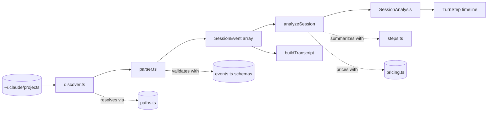
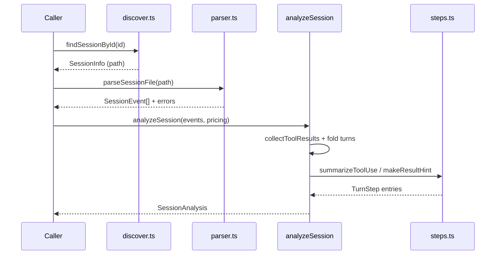

# Core Analysis Engine

> Indexed at commit `bf5a4c8` on 2026-07-12 · [view on GitHub](https://github.com/yorch/cc-analyzer/tree/bf5a4c8)

## Relevant source files

- [src/core/analyze.ts](https://github.com/yorch/cc-analyzer/blob/bf5a4c8/src/core/analyze.ts)
- [src/core/events.ts](https://github.com/yorch/cc-analyzer/blob/bf5a4c8/src/core/events.ts)
- [src/core/discover.ts](https://github.com/yorch/cc-analyzer/blob/bf5a4c8/src/core/discover.ts)
- [src/core/paths.ts](https://github.com/yorch/cc-analyzer/blob/bf5a4c8/src/core/paths.ts)
- [src/core/parser.ts](https://github.com/yorch/cc-analyzer/blob/bf5a4c8/src/core/parser.ts)
- [src/core/transcript.ts](https://github.com/yorch/cc-analyzer/blob/bf5a4c8/src/core/transcript.ts)
- [src/core/steps.ts](https://github.com/yorch/cc-analyzer/blob/bf5a4c8/src/core/steps.ts)

## Overview

The Core Analysis Engine is the domain layer of cc-analyzer. It reads Claude Code session transcripts from disk, parses them into typed events, and folds those events into per-turn and aggregate metrics. Every user-facing frontend — the command-line interface (CLI), the terminal user interface (TUI), and the local web server — is a thin presentation layer over the functions in `src/core/`, and none of them re-implement session semantics.

The engine owns four responsibilities: filesystem discovery of projects and sessions ([src/core/discover.ts](https://github.com/yorch/cc-analyzer/blob/bf5a4c8/src/core/discover.ts), [src/core/paths.ts](https://github.com/yorch/cc-analyzer/blob/bf5a4c8/src/core/paths.ts)), tolerant JSON Lines (JSONL) parsing into validated events ([src/core/parser.ts](https://github.com/yorch/cc-analyzer/blob/bf5a4c8/src/core/parser.ts), [src/core/events.ts](https://github.com/yorch/cc-analyzer/blob/bf5a4c8/src/core/events.ts)), analysis of events into a `SessionAnalysis` metric tree ([src/core/analyze.ts](https://github.com/yorch/cc-analyzer/blob/bf5a4c8/src/core/analyze.ts)), and two human-readable projections — a linear transcript ([src/core/transcript.ts](https://github.com/yorch/cc-analyzer/blob/bf5a4c8/src/core/transcript.ts)) and a per-turn step timeline ([src/core/steps.ts](https://github.com/yorch/cc-analyzer/blob/bf5a4c8/src/core/steps.ts)). The engine is strictly read-only with respect to `~/.claude`; all of cc-analyzer's own state lives under a separate config directory ([src/core/paths.ts#L4-L9](https://github.com/yorch/cc-analyzer/blob/bf5a4c8/src/core/paths.ts#L4-L9)).

Sources: [src/core/analyze.ts:L180-L391](https://github.com/yorch/cc-analyzer/blob/bf5a4c8/src/core/analyze.ts#L180-L391) [src/core/paths.ts:L1-L43](https://github.com/yorch/cc-analyzer/blob/bf5a4c8/src/core/paths.ts#L1-L43) [src/core/discover.ts:L1-L102](https://github.com/yorch/cc-analyzer/blob/bf5a4c8/src/core/discover.ts#L1-L102)

## Architecture

The pipeline is a straight fold: [discover.ts](https://github.com/yorch/cc-analyzer/blob/bf5a4c8/src/core/discover.ts) locates a `.jsonl` file, [parser.ts](https://github.com/yorch/cc-analyzer/blob/bf5a4c8/src/core/parser.ts) turns its text into a `SessionEvent[]`, and that array feeds two independent consumers — `analyzeSession` for metrics and `buildTranscript` for a flat reading view. `analyzeSession` embeds each turn's `TurnStep[]` timeline directly, so the step projection is produced as a side effect of analysis rather than in a separate pass.

Sources: [src/core/parser.ts:L22-L71](https://github.com/yorch/cc-analyzer/blob/bf5a4c8/src/core/parser.ts#L22-L71) [src/core/analyze.ts:L180-L354](https://github.com/yorch/cc-analyzer/blob/bf5a4c8/src/core/analyze.ts#L180-L354) [src/core/transcript.ts:L55-L139](https://github.com/yorch/cc-analyzer/blob/bf5a4c8/src/core/transcript.ts#L55-L139)

## Module Layout

| Module | Path | Responsibility |
| ------ | ---- | -------------- |
| paths | [src/core/paths.ts](https://github.com/yorch/cc-analyzer/blob/bf5a4c8/src/core/paths.ts) | Resolve Claude and state directories, with env-var overrides |
| discover | [src/core/discover.ts](https://github.com/yorch/cc-analyzer/blob/bf5a4c8/src/core/discover.ts) | Enumerate projects and session files on disk |
| events | [src/core/events.ts](https://github.com/yorch/cc-analyzer/blob/bf5a4c8/src/core/events.ts) | Tolerant Zod schemas and TypeScript types for JSONL records |
| parser | [src/core/parser.ts](https://github.com/yorch/cc-analyzer/blob/bf5a4c8/src/core/parser.ts) | Parse and validate JSONL text into `SessionEvent[]` |
| analyze | [src/core/analyze.ts](https://github.com/yorch/cc-analyzer/blob/bf5a4c8/src/core/analyze.ts) | Fold events into `SessionAnalysis` (turns, totals, models, tools) |
| transcript | [src/core/transcript.ts](https://github.com/yorch/cc-analyzer/blob/bf5a4c8/src/core/transcript.ts) | Flatten events into a linear `TranscriptItem[]` |
| steps | [src/core/steps.ts](https://github.com/yorch/cc-analyzer/blob/bf5a4c8/src/core/steps.ts) | Summarize tool calls into a per-turn `TurnStep[]` timeline |

Sources: [src/core/paths.ts:L1-L43](https://github.com/yorch/cc-analyzer/blob/bf5a4c8/src/core/paths.ts#L1-L43) [src/core/discover.ts:L1-L102](https://github.com/yorch/cc-analyzer/blob/bf5a4c8/src/core/discover.ts#L1-L102) [src/core/events.ts:L1-L165](https://github.com/yorch/cc-analyzer/blob/bf5a4c8/src/core/events.ts#L1-L165) [src/core/steps.ts:L1-L43](https://github.com/yorch/cc-analyzer/blob/bf5a4c8/src/core/steps.ts#L1-L43)

## Key Components

### Discovery layer

`discover.ts` maps the on-disk layout of `~/.claude/projects` to typed records. `listProjects` reads each subdirectory, counts its `.jsonl` files, and returns `ProjectInfo` records sorted by session count ([src/core/discover.ts#L32-L51](https://github.com/yorch/cc-analyzer/blob/bf5a4c8/src/core/discover.ts#L32-L51)). `listSessions` returns `SessionInfo` records for one project sorted by modification time, `listAllSessions` flattens every project, and `findSessionById` locates a single session by basename across all projects ([src/core/discover.ts#L54-L102](https://github.com/yorch/cc-analyzer/blob/bf5a4c8/src/core/discover.ts#L54-L102)). All directory reads swallow errors and return empty arrays, so a missing or unreadable `~/.claude` yields no projects rather than a crash.

Sources: [src/core/discover.ts:L32-L102](https://github.com/yorch/cc-analyzer/blob/bf5a4c8/src/core/discover.ts#L32-L102)

### Path resolution and env overrides

`paths.ts` centralizes every filesystem location. `claudeDir` defaults to `~/.claude` but honors the `CC_ANALYZER_CLAUDE_DIR` environment variable, and `stateDir` resolves cc-analyzer's own writable directory from `CC_ANALYZER_STATE_DIR`, falling back to `XDG_CONFIG_HOME` and then `~/.config/cc-analyzer` ([src/core/paths.ts#L12-L27](https://github.com/yorch/cc-analyzer/blob/bf5a4c8/src/core/paths.ts#L12-L27)). Three helpers derive concrete state files from `stateDir`: `indexDbPath`, `pricingCachePath`, and `updateCachePath` for the update-check cache ([src/core/paths.ts#L29-L31](https://github.com/yorch/cc-analyzer/blob/bf5a4c8/src/core/paths.ts#L29-L31)). `decodeProjectLabel` reconstructs a best-effort path label from an encoded directory name, but the encoding replaces both `/` and `.` with `-` and is therefore not reversible; the authoritative project path comes from the `cwd` field of a parsed session event instead ([src/core/paths.ts#L33-L43](https://github.com/yorch/cc-analyzer/blob/bf5a4c8/src/core/paths.ts#L33-L43)).

Sources: [src/core/paths.ts:L12-L43](https://github.com/yorch/cc-analyzer/blob/bf5a4c8/src/core/paths.ts#L12-L43)

### Tolerant parsing and event schemas

`parseSessionText` splits a file on newlines and processes one JSON object per line. A line that is not valid JSON is recorded in `errors` and skipped; a line whose declared `type` matches a known schema but fails validation is also logged, then kept as a tolerant "unknown" event so downstream counts stay consistent ([src/core/parser.ts#L22-L64](https://github.com/yorch/cc-analyzer/blob/bf5a4c8/src/core/parser.ts#L22-L64)). The schema registry in `events.ts` keys Zod schemas by their `type` discriminator and marks every object `loose`, so unknown or future fields are preserved rather than stripped — a deliberate choice so that new Claude Code versions never break parsing ([src/core/events.ts#L3-L8](https://github.com/yorch/cc-analyzer/blob/bf5a4c8/src/core/events.ts#L3-L8) [src/core/events.ts#L147-L157](https://github.com/yorch/cc-analyzer/blob/bf5a4c8/src/core/events.ts#L147-L157)). Full coverage of the schema catalog lives in the child page below.

Sources: [src/core/parser.ts:L15-L71](https://github.com/yorch/cc-analyzer/blob/bf5a4c8/src/core/parser.ts#L15-L71) [src/core/events.ts:L1-L27](https://github.com/yorch/cc-analyzer/blob/bf5a4c8/src/core/events.ts#L1-L27) [src/core/events.ts:L147-L165](https://github.com/yorch/cc-analyzer/blob/bf5a4c8/src/core/events.ts#L147-L165)

### analyzeSession — the central orchestrator

`analyzeSession(events, pricing)` is the heart of the engine. It first builds a `Map` from every `tool_use_id` to its result via `collectToolResults`, then walks the event stream once, accumulating aggregate sets for git branches, versions, models, tools, skills, subagents, and touched files ([src/core/analyze.ts#L181-L210](https://github.com/yorch/cc-analyzer/blob/bf5a4c8/src/core/analyze.ts#L181-L210)). Session metadata such as `sessionId`, `projectPath` (from `cwd`), and the AI-generated `title` are captured from whichever event carries them first ([src/core/analyze.ts#L212-L226](https://github.com/yorch/cc-analyzer/blob/bf5a4c8/src/core/analyze.ts#L212-L226)).

Each genuine user prompt opens a new `Turn` appended to `turns`, and every subsequent assistant event is attributed to that current turn ([src/core/analyze.ts#L228-L349](https://github.com/yorch/cc-analyzer/blob/bf5a4c8/src/core/analyze.ts#L228-L349)). For each assistant event the function extracts token counts via `usageToTokens`, resolves the model against the pricing table, computes cost, and marks the cost `estimated` when the model matched only by family heuristic rather than an exact identifier ([src/core/analyze.ts#L245-L256](https://github.com/yorch/cc-analyzer/blob/bf5a4c8/src/core/analyze.ts#L245-L256)). It walks the assistant content blocks to emit `TurnStep` entries for narration, thinking, and each `tool_use`, and simultaneously tallies tool counts, detected skills, spawned subagents, and edited file paths ([src/core/analyze.ts#L258-L321](https://github.com/yorch/cc-analyzer/blob/bf5a4c8/src/core/analyze.ts#L258-L321)). Timestamps are folded through `touchTime`, which maintains both session-wide and per-turn start and end bounds, and a final pass rolls turn tokens and cost into `SessionTotals` ([src/core/analyze.ts#L202-L210](https://github.com/yorch/cc-analyzer/blob/bf5a4c8/src/core/analyze.ts#L202-L210) [src/core/analyze.ts#L356-L390](https://github.com/yorch/cc-analyzer/blob/bf5a4c8/src/core/analyze.ts#L356-L390)).

Sources: [src/core/analyze.ts:L146-L390](https://github.com/yorch/cc-analyzer/blob/bf5a4c8/src/core/analyze.ts#L146-L390)

### The "turn" concept and isRealPrompt

A turn is the engine's central domain concept: one genuine user prompt plus every assistant Application Programming Interface (API) call and tool loop that follows it, up to the next genuine prompt. The discriminator is `isRealPrompt`, which rejects any user event where `isMeta` is `true` and requires the message to carry at least one content block that is not a `tool_result` ([src/core/analyze.ts#L120-L132](https://github.com/yorch/cc-analyzer/blob/bf5a4c8/src/core/analyze.ts#L120-L132)). This excludes system-injected messages such as caveats, command output, and reminders, and it excludes the `tool_result` carriers that Claude Code emits as user-role events during a tool loop — those are continuations of the current turn, not new turns. The comment notes that `promptId` cannot serve as the discriminator because tool-result carriers also carry it ([src/core/analyze.ts#L124-L128](https://github.com/yorch/cc-analyzer/blob/bf5a4c8/src/core/analyze.ts#L124-L128)).

This same `isRealPrompt` logic is duplicated in [src/core/transcript.ts#L44-L49](https://github.com/yorch/cc-analyzer/blob/bf5a4c8/src/core/transcript.ts#L44-L49), where `buildTranscript` uses it to advance `turnIndex`. The two copies are byte-for-byte identical, so turn numbering stays consistent between the analysis metrics and the linear transcript; any change to turn semantics must be applied in both files.

Sources: [src/core/analyze.ts:L120-L132](https://github.com/yorch/cc-analyzer/blob/bf5a4c8/src/core/analyze.ts#L120-L132) [src/core/transcript.ts:L44-L49](https://github.com/yorch/cc-analyzer/blob/bf5a4c8/src/core/transcript.ts#L44-L49)

### Transcript and step projections

`buildTranscript` flattens events into an ordered `TranscriptItem[]` for reading views in the TUI and web server. It emits a `prompt` item for each genuine prompt, `tool_result` items for the carrier events, and `text`, `thinking`, and `tool_use` items for assistant content, tagging every item with its `turnIndex` ([src/core/transcript.ts#L55-L138](https://github.com/yorch/cc-analyzer/blob/bf5a4c8/src/core/transcript.ts#L55-L138)). `steps.ts` supplies the vocabulary for the per-turn timeline: `summarizeToolUse` maps a tool name and input to a `StepKind`, display `label`, and one-line `summary` for each supported tool, while `makeResultHint` derives a short status such as `"3 lines"` or an error's first line ([src/core/steps.ts#L92-L182](https://github.com/yorch/cc-analyzer/blob/bf5a4c8/src/core/steps.ts#L92-L182)). `analyzeSession` calls these helpers to build the `TurnStep[]` embedded in each `ApiCall`.

Sources: [src/core/transcript.ts:L55-L139](https://github.com/yorch/cc-analyzer/blob/bf5a4c8/src/core/transcript.ts#L55-L139) [src/core/steps.ts:L92-L182](https://github.com/yorch/cc-analyzer/blob/bf5a4c8/src/core/steps.ts#L92-L182)

## Data Flow

A caller resolves a session path through discovery, parses the file into events with tolerant validation, then hands the events plus a pricing table to `analyzeSession`. Analysis makes a single pass, delegating per-tool summarization to `steps.ts`, and returns the complete `SessionAnalysis` tree that frontends render.

Sources: [src/core/discover.ts:L92-L102](https://github.com/yorch/cc-analyzer/blob/bf5a4c8/src/core/discover.ts#L92-L102) [src/core/parser.ts:L67-L71](https://github.com/yorch/cc-analyzer/blob/bf5a4c8/src/core/parser.ts#L67-L71) [src/core/analyze.ts:L180-L354](https://github.com/yorch/cc-analyzer/blob/bf5a4c8/src/core/analyze.ts#L180-L354)

## Configuration & Extension Points

| Setting | Type | Default | Purpose |
| ------- | ---- | ------- | ------- |
| `CC_ANALYZER_CLAUDE_DIR` | env var | `~/.claude` | Override the Claude Code data directory that discovery reads |
| `CC_ANALYZER_STATE_DIR` | env var | `$XDG_CONFIG_HOME/cc-analyzer` or `~/.config/cc-analyzer` | Override cc-analyzer's writable state directory |
| `XDG_CONFIG_HOME` | env var | `~/.config` | Base for the default state directory when `CC_ANALYZER_STATE_DIR` is unset |

These variables make the engine hermetic under test: pointing `CC_ANALYZER_CLAUDE_DIR` at a fixture tree and `CC_ANALYZER_STATE_DIR` at a scratch path isolates a run from the developer's real home directory ([src/core/paths.ts#L12-L27](https://github.com/yorch/cc-analyzer/blob/bf5a4c8/src/core/paths.ts#L12-L27)).

Sources: [src/core/paths.ts:L11-L31](https://github.com/yorch/cc-analyzer/blob/bf5a4c8/src/core/paths.ts#L11-L31)

## Related Pages

- Detail: [Session Parsing and Events](./2.1-session-parsing-and-events.md)
- Detail: [Cost and Pricing](./2.2-cost-and-pricing.md)
- Detail: [Index and Analytics](./2.3-index-and-analytics.md)
- Detail: [Per-Turn Steps](./2.4-per-turn-steps.md)
- Sibling: [CLI](./3-cli.md)
- Sibling: [TUI](./4-tui.md)
- Sibling: [Web Server and API](./5-web-server-and-api.md)
