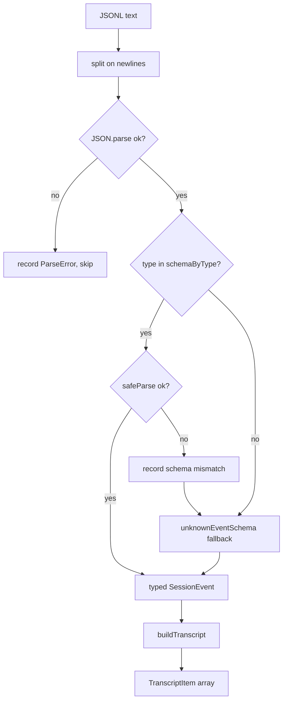

# Session Parsing & Event Model

> Indexed at commit `4eeed24` on 2026-07-10 · [view on GitHub](https://github.com/yorch/cc-analyzer/tree/4eeed24)

## Relevant source files

- [src/core/parser.ts](https://github.com/yorch/cc-analyzer/blob/4eeed24/src/core/parser.ts)
- [src/core/events.ts](https://github.com/yorch/cc-analyzer/blob/4eeed24/src/core/events.ts)
- [src/core/transcript.ts](https://github.com/yorch/cc-analyzer/blob/4eeed24/src/core/transcript.ts)

## Overview

This subsystem turns a raw Claude Code session JSONL (JSON Lines) file into two consumable shapes: a typed list of `SessionEvent` records, and a flattened, human-readable `TranscriptItem[]`. It is the ingestion boundary for every downstream analyzer, and it is built to be tolerant — malformed lines and schema drift from newer Claude Code versions never crash the pipeline. The public surface is three functions: `parseSessionText` and `parseSessionFile` in [src/core/parser.ts](https://github.com/yorch/cc-analyzer/blob/4eeed24/src/core/parser.ts), and `buildTranscript` in [src/core/transcript.ts](https://github.com/yorch/cc-analyzer/blob/4eeed24/src/core/transcript.ts), backed by the Zod schema registry in [src/core/events.ts](https://github.com/yorch/cc-analyzer/blob/4eeed24/src/core/events.ts).

## Implementation

Parsing runs line by line. `parseSessionText` splits the file on newlines, skips blank lines, and attempts `JSON.parse` on each remaining line at [src/core/parser.ts#L32-L37](https://github.com/yorch/cc-analyzer/blob/4eeed24/src/core/parser.ts#L32-L37). A line that fails to parse is not fatal: it is pushed onto a `ParseError` list carrying the 1-based `line` number, the `raw` text, and an `invalid JSON` message, then skipped. This is the first of two tolerance layers, and it keeps a single corrupt line from aborting an entire session.

The second layer handles schema drift. For each parsed object, the parser reads the `type` discriminator and looks it up in `schemaByType` at [src/core/parser.ts#L39-L44](https://github.com/yorch/cc-analyzer/blob/4eeed24/src/core/parser.ts#L39-L44). When a schema exists it runs `safeParse`; on success the validated event is kept. When validation fails — a known `type` whose shape has drifted — the parser records a `schema mismatch` error but does not drop the record. Instead it falls through to `unknownEventSchema.safeParse`, and if even that fails it keeps the raw object as-is at [src/core/parser.ts#L60-L61](https://github.com/yorch/cc-analyzer/blob/4eeed24/src/core/parser.ts#L60-L61). Every non-blank line therefore produces exactly one event, so downstream counts stay consistent regardless of version skew. `parseSessionFile` is a thin async wrapper that reads the file via `Bun.file(path).text()` and delegates to `parseSessionText` at [src/core/parser.ts#L68-L71](https://github.com/yorch/cc-analyzer/blob/4eeed24/src/core/parser.ts#L68-L71).

The schemas themselves live in [src/core/events.ts](https://github.com/yorch/cc-analyzer/blob/4eeed24/src/core/events.ts) and are deliberately permissive. Every object is declared with `z.looseObject` so unknown or future fields are preserved rather than stripped, which the module documents as a requirement that newer Claude Code versions must never break parsing at [src/core/events.ts#L3-L8](https://github.com/yorch/cc-analyzer/blob/4eeed24/src/core/events.ts#L3-L8). The `usageSchema` captures token accounting — `input_tokens` and `output_tokens` default to `0`, with optional `cache_creation_input_tokens`, `cache_read_input_tokens`, nested `cache_creation` ephemeral buckets, and `server_tool_use` web request counts at [src/core/events.ts#L10-L27](https://github.com/yorch/cc-analyzer/blob/4eeed24/src/core/events.ts#L10-L27). Content blocks are modeled as a union of `text`, `thinking`, `tool_use`, `tool_result`, and a catch-all `unknownBlockSchema` at [src/core/events.ts#L52-L58](https://github.com/yorch/cc-analyzer/blob/4eeed24/src/core/events.ts#L52-L58).

Each event type shares a common `baseMeta` set of optional fields (`uuid`, `parentUuid`, `sessionId`, `timestamp`, `cwd`, `gitBranch`, `version`, and more) at [src/core/events.ts#L63-L73](https://github.com/yorch/cc-analyzer/blob/4eeed24/src/core/events.ts#L63-L73). The `assistantEventSchema` nests a `message` object with `model`, `stop_reason`, an array of content blocks, and optional `usage` at [src/core/events.ts#L75-L87](https://github.com/yorch/cc-analyzer/blob/4eeed24/src/core/events.ts#L75-L87), while `userEventSchema` allows `content` to be either a plain string or an array of blocks at [src/core/events.ts#L90-L100](https://github.com/yorch/cc-analyzer/blob/4eeed24/src/core/events.ts#L90-L100). All schemas are registered in `schemaByType`, keyed by their `type` string, at [src/core/events.ts#L147-L157](https://github.com/yorch/cc-analyzer/blob/4eeed24/src/core/events.ts#L147-L157); the `unknownEventSchema` requires only that a `type` string is present at [src/core/events.ts#L144-L145](https://github.com/yorch/cc-analyzer/blob/4eeed24/src/core/events.ts#L144-L145).

`buildTranscript` flattens the typed events into a linear `TranscriptItem[]` shared by both the terminal UI and web transcript readers, as stated at [src/core/transcript.ts#L51-L55](https://github.com/yorch/cc-analyzer/blob/4eeed24/src/core/transcript.ts#L51-L55). Each `TranscriptItem` carries a `role`, a `kind`, a short `label`, and a full-text `body`, plus optional `isError` and `timestamp` fields at [src/core/transcript.ts#L6-L17](https://github.com/yorch/cc-analyzer/blob/4eeed24/src/core/transcript.ts#L6-L17). The function walks events in order: real user prompts increment `turnIndex` and emit a `prompt` item; user events that merely carry `tool_result` blocks emit `tool_result` items without advancing the turn at [src/core/transcript.ts#L64-L98](https://github.com/yorch/cc-analyzer/blob/4eeed24/src/core/transcript.ts#L64-L98). Assistant events fan out their content blocks into `text`, `thinking`, and `tool_use` items, with the tool name used as the label and JSON-stringified input as the body at [src/core/transcript.ts#L101-L135](https://github.com/yorch/cc-analyzer/blob/4eeed24/src/core/transcript.ts#L101-L135).

Turn numbering hinges on the `isRealPrompt` discriminator at [src/core/transcript.ts#L44-L49](https://github.com/yorch/cc-analyzer/blob/4eeed24/src/core/transcript.ts#L44-L49): an event counts as a genuine prompt only when it is not marked `isMeta` and its content is either a plain string or contains at least one non-`tool_result` block. This same logic is duplicated in the analytics path — `analyze.ts` declares its own private `isRealPrompt` at [src/core/analyze.ts#L122](https://github.com/yorch/cc-analyzer/blob/4eeed24/src/core/analyze.ts#L122) and applies it during event iteration at [src/core/analyze.ts#L216](https://github.com/yorch/cc-analyzer/blob/4eeed24/src/core/analyze.ts#L216). The two copies must stay in agreement for transcript turn counts and analytics turn counts to match.

Sources: [src/core/parser.ts:L1-L71](https://github.com/yorch/cc-analyzer/blob/4eeed24/src/core/parser.ts#L1-L71) [src/core/events.ts:L1-L165](https://github.com/yorch/cc-analyzer/blob/4eeed24/src/core/events.ts#L1-L165) [src/core/transcript.ts:L1-L139](https://github.com/yorch/cc-analyzer/blob/4eeed24/src/core/transcript.ts#L1-L139)

## Diagram

The diagram traces a single JSONL line through both tolerance layers and into the transcript flattening step. Note that a `schema mismatch` records an error yet still yields an event through the `unknownEventSchema` fallback, so the event stream is never shorter than the count of non-blank lines.

## Usage

`parseSessionText` returns a `ParseResult` containing both `events` and `errors`, letting callers surface parse-error counts without inspecting the raw file at [src/core/parser.ts#L10-L13](https://github.com/yorch/cc-analyzer/blob/4eeed24/src/core/parser.ts#L10-L13). Downstream analyzers consume the `events` array directly, while `buildTranscript` is invoked by the TUI and web readers to render conversations. Because `buildTranscript` accepts any `SessionEvent[]`, callers pass the parser output straight through without an intermediate transformation.

Sources: [src/core/parser.ts:L10-L13](https://github.com/yorch/cc-analyzer/blob/4eeed24/src/core/parser.ts#L10-L13) [src/core/transcript.ts:L55-L55](https://github.com/yorch/cc-analyzer/blob/4eeed24/src/core/transcript.ts#L55)

## Related Pages

- Parent: [Core Analysis Engine](./2-core-analysis-engine.md)
- Sibling: [Cost & Pricing](./2.2-cost-and-pricing.md)
- Sibling: [Index & Analytics](./2.3-index-and-analytics.md)
