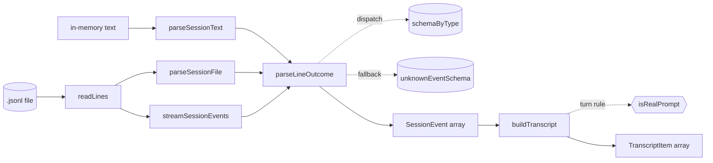

# Session Parsing & Event Model

> Indexed at commit `51ccd4e` on 2026-07-23 · [view on GitHub](https://github.com/yorch/cc-analyzer/tree/51ccd4e)

## Relevant source files

- [src/core/parser.ts](https://github.com/yorch/cc-analyzer/blob/51ccd4e/src/core/parser.ts)
- [src/core/events.ts](https://github.com/yorch/cc-analyzer/blob/51ccd4e/src/core/events.ts)
- [src/core/transcript.ts](https://github.com/yorch/cc-analyzer/blob/51ccd4e/src/core/transcript.ts)

## Overview

Claude Code stores each session as a JSON Lines (JSONL) file under `~/.claude`, one record per line. This subsystem turns those raw lines into typed `SessionEvent` values and, from there, into a linear `TranscriptItem[]` that the terminal and web frontends render. It owns three concerns: tolerant per-line parsing that never throws, the Zod schema catalog that defines every known record shape, and the transcript flattening that both readers share. All three files live in `src/core/` and feed the downstream analyzer and indexer.

## Implementation

Parsing is centralized in a single per-line function so every entry point behaves identically. `parseLineOutcome` in [src/core/parser.ts#L30-L69](https://github.com/yorch/cc-analyzer/blob/51ccd4e/src/core/parser.ts#L30-L69) takes a raw line plus a 1-based line number and returns a `LineOutcome` holding an event, an error, or neither. A blank line yields nothing. A line that fails `JSON.parse` becomes a recorded `ParseError` and is skipped ([src/core/parser.ts#L33-L38](https://github.com/yorch/cc-analyzer/blob/51ccd4e/src/core/parser.ts#L33-L38)). This tolerance is the invariant documented at [src/core/parser.ts#L21-L29](https://github.com/yorch/cc-analyzer/blob/51ccd4e/src/core/parser.ts#L21-L29): the parser never throws on content, only file I/O can fail.

The known-type path reads the record's `type` field and looks it up in the `schemaByType` registry ([src/core/parser.ts#L40-L48](https://github.com/yorch/cc-analyzer/blob/51ccd4e/src/core/parser.ts#L40-L48)). When a schema exists and validation succeeds, the parsed data is returned as the event. When the type is known but its shape has drifted — a newer Claude Code version changed a field — validation fails, and the code records a `schema mismatch` error yet still surfaces the record, falling back to `unknownEventSchema` (or the raw JSON if even that fails) so downstream event counts stay consistent ([src/core/parser.ts#L49-L59](https://github.com/yorch/cc-analyzer/blob/51ccd4e/src/core/parser.ts#L49-L59)). A record whose `type` is unrecognized is validated against `unknownEventSchema` directly; valid JSON that is not an object (a bare `null`, number, or string) is rejected as an error because consumers assume safe property access ([src/core/parser.ts#L61-L68](https://github.com/yorch/cc-analyzer/blob/51ccd4e/src/core/parser.ts#L61-L68)).

Three entry points wrap this per-line logic. `parseSessionText` splits an in-memory string on newlines and accumulates events and errors into a `ParseResult` ([src/core/parser.ts#L72-L82](https://github.com/yorch/cc-analyzer/blob/51ccd4e/src/core/parser.ts#L72-L82)). For files, `parseSessionFile` and the generator `streamSessionEvents` both read through `readLines`, a chunk-streaming async generator that decodes `Bun.file(path).stream()` and yields complete lines without holding the whole file — sessions can reach hundreds of megabytes, so it accumulates cross-chunk fragments in a `pending` array and joins them once the newline arrives ([src/core/parser.ts#L93-L120](https://github.com/yorch/cc-analyzer/blob/51ccd4e/src/core/parser.ts#L93-L120)). `streamSessionEvents` yields events one at a time and routes parse errors to an optional `onError` sink, which is the memory-frugal path the indexer uses for bulk scans ([src/core/parser.ts#L129-L139](https://github.com/yorch/cc-analyzer/blob/51ccd4e/src/core/parser.ts#L129-L139)). Because all three share `parseLineOutcome` and the same line counter, error line numbers agree across every entry point ([src/core/parser.ts#L141-L152](https://github.com/yorch/cc-analyzer/blob/51ccd4e/src/core/parser.ts#L141-L152)).

The event catalog lives in [src/core/events.ts](https://github.com/yorch/cc-analyzer/blob/51ccd4e/src/core/events.ts). Every object schema is built with `z.looseObject` so unknown or future fields are preserved rather than stripped, ensuring newer session formats never break parsing ([src/core/events.ts#L3-L27](https://github.com/yorch/cc-analyzer/blob/51ccd4e/src/core/events.ts#L3-L27)). `usageSchema` defines the token shape that pricing depends on: `input_tokens` and `output_tokens` default to `0`, with optional `cache_creation_input_tokens`, `cache_read_input_tokens`, and a nested `cache_creation` object carrying `ephemeral_5m_input_tokens` and `ephemeral_1h_input_tokens` ([src/core/events.ts#L10-L28](https://github.com/yorch/cc-analyzer/blob/51ccd4e/src/core/events.ts#L10-L28)). Content blocks are a union of `text`, `thinking`, `tool_use`, `tool_result`, and a catch-all `unknownBlockSchema` keyed only on a string `type` ([src/core/events.ts#L30-L61](https://github.com/yorch/cc-analyzer/blob/51ccd4e/src/core/events.ts#L30-L61)). The top-level record schemas — `assistant`, `user`, `system`, `ai-title`, `last-prompt`, `permission-mode`, `file-history-snapshot`, and `attachment` — are registered by their `type` discriminator in `schemaByType`, the exact table the parser dispatches on ([src/core/events.ts#L156-L166](https://github.com/yorch/cc-analyzer/blob/51ccd4e/src/core/events.ts#L156-L166)). `unknownEventSchema` is the loose fallback that keeps any typed-but-unmatched record alive ([src/core/events.ts#L153-L154](https://github.com/yorch/cc-analyzer/blob/51ccd4e/src/core/events.ts#L153-L154)).

Turn segmentation is decided by `isRealPrompt` in [src/core/events.ts#L191-L198](https://github.com/yorch/cc-analyzer/blob/51ccd4e/src/core/events.ts#L191-L198). A user event opens a new turn only when it is a genuine prompt: not a sidechain subagent task, not system-injected (`isMeta`), not the machine-written post-compaction summary (`isCompactSummary`), and not merely a carrier of `tool_result` blocks continuing a loop. The comment at [src/core/events.ts#L176-L190](https://github.com/yorch/cc-analyzer/blob/51ccd4e/src/core/events.ts#L176-L190) records why `promptId` cannot be the discriminator — it appears on tool_result carriers too. This function is the single source of truth for turn boundaries and is imported by both the analyzer and the transcript builder so the two never diverge.

`buildTranscript` in [src/core/transcript.ts#L54-L150](https://github.com/yorch/cc-analyzer/blob/51ccd4e/src/core/transcript.ts#L54-L150) walks the event list once and emits a flat `TranscriptItem[]`, tagging each item with a running `index` and a `turnIndex` that increments only when `isRealPrompt` returns true ([src/core/transcript.ts#L78-L88](https://github.com/yorch/cc-analyzer/blob/51ccd4e/src/core/transcript.ts#L54-L88)). User events branch three ways: a compaction summary is emitted as a `system` item labeled `Compaction summary`; a genuine prompt advances the turn and becomes a `You` prompt item; and a tool_result carrier expands into one `tool_result` item per block, flagged `isError` when the block reports failure ([src/core/transcript.ts#L64-L109](https://github.com/yorch/cc-analyzer/blob/51ccd4e/src/core/transcript.ts#L64-L109)). Assistant events split their content blocks into `text`, `thinking`, and `tool_use` items, the last labeled by tool name with its JSON input as the body ([src/core/transcript.ts#L112-L146](https://github.com/yorch/cc-analyzer/blob/51ccd4e/src/core/transcript.ts#L112-L146)). The `contentToText` helper normalizes a tool_result's string-or-block content into readable text, rendering images as `[image]` and stringifying leftover objects ([src/core/transcript.ts#L33-L48](https://github.com/yorch/cc-analyzer/blob/51ccd4e/src/core/transcript.ts#L33-L48)). The `TranscriptItem` shape it produces — role, kind, label, body, and optional error/timestamp — is the contract both the terminal UI and web reader consume ([src/core/transcript.ts#L9-L23](https://github.com/yorch/cc-analyzer/blob/51ccd4e/src/core/transcript.ts#L9-L23)).

Sources: [src/core/parser.ts:L1-L152](https://github.com/yorch/cc-analyzer/blob/51ccd4e/src/core/parser.ts#L1-L152) [src/core/events.ts:L1-L198](https://github.com/yorch/cc-analyzer/blob/51ccd4e/src/core/events.ts#L1-L198) [src/core/transcript.ts:L1-L150](https://github.com/yorch/cc-analyzer/blob/51ccd4e/src/core/transcript.ts#L1-L150)

## Diagram

Every entry point funnels through `parseLineOutcome`, which dispatches on `schemaByType` and falls back to `unknownEventSchema`; the resulting events flow into `buildTranscript`, whose turn numbering reuses `isRealPrompt`.

## Usage

`streamSessionEvents` is the low-memory reader for bulk consumers, while `parseSessionText` and `parseSessionFile` return a full `ParseResult` for callers that need every event and error at once. `buildTranscript` is the shared reader for the terminal and web frontends, and `isRealPrompt` is exported specifically so the analyzer can compute the same turn boundaries the transcript uses — changing the rule in one place changes both.

Sources: [src/core/parser.ts:L71-L152](https://github.com/yorch/cc-analyzer/blob/51ccd4e/src/core/parser.ts#L71-L152) [src/core/events.ts:L191-L198](https://github.com/yorch/cc-analyzer/blob/51ccd4e/src/core/events.ts#L191-L198) [src/core/transcript.ts:L50-L54](https://github.com/yorch/cc-analyzer/blob/51ccd4e/src/core/transcript.ts#L50-L54)

## Related Pages

- Parent: [Core Analysis Engine](./2-core-analysis-engine.md)
- Sibling: [Cost & Pricing](./2.2-cost-and-pricing.md)
- Sibling: [Index & Analytics](./2.3-index-and-analytics.md)
- Sibling: [Per-Turn Steps](./2.4-per-turn-steps.md)
