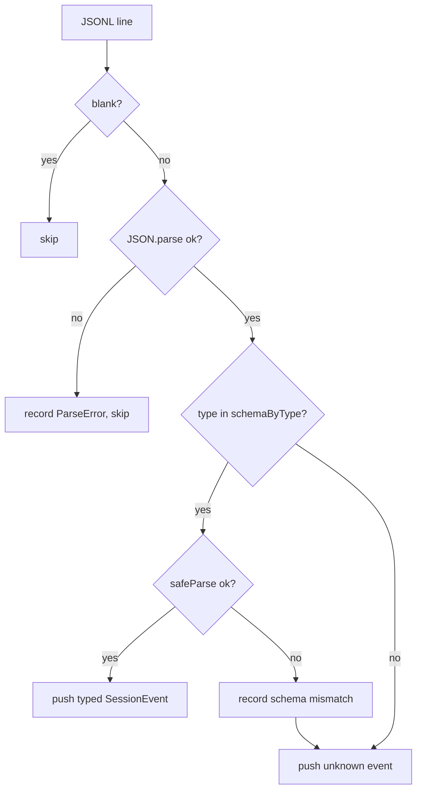

# Session Parsing & Event Model

> Indexed at commit `bf5a4c8` on 2026-07-12 · [view on GitHub](https://github.com/yorch/cc-analyzer/tree/bf5a4c8)

## Relevant source files

- [src/core/parser.ts](https://github.com/yorch/cc-analyzer/blob/bf5a4c8/src/core/parser.ts)
- [src/core/events.ts](https://github.com/yorch/cc-analyzer/blob/bf5a4c8/src/core/events.ts)
- [src/core/transcript.ts](https://github.com/yorch/cc-analyzer/blob/bf5a4c8/src/core/transcript.ts)

## Overview

This subsystem turns a raw Claude Code session JSONL (JSON Lines) file into two representations: a list of typed `SessionEvent` objects and a linear, human-readable `TranscriptItem[]`. The JSONL format is one JSON object per line, written by Claude Code across many versions, so the parser is built to tolerate malformed lines and unfamiliar record shapes without ever throwing. It owns the boundary between untrusted on-disk data and every downstream reader — analytics, the terminal UI (TUI), and the web app all consume its output rather than parsing JSONL themselves.

Sources: [src/core/parser.ts:L15-L21](https://github.com/yorch/cc-analyzer/blob/bf5a4c8/src/core/parser.ts#L15-L21) [src/core/transcript.ts:L51-L54](https://github.com/yorch/cc-analyzer/blob/bf5a4c8/src/core/transcript.ts#L51-L54)

## Implementation

### Tolerant line parsing

`parseSessionText` splits the file on newlines and processes each line independently, returning a `ParseResult` that pairs the successful `events` with a list of `errors` ([src/core/parser.ts#L22-L65](https://github.com/yorch/cc-analyzer/blob/bf5a4c8/src/core/parser.ts#L22-L65)). Blank lines are skipped silently. A line that fails `JSON.parse` is recorded as a `ParseError` carrying its 1-based `line` number, the `raw` text, and the error message, then skipped — one corrupt line never aborts the file ([src/core/parser.ts#L31-L37](https://github.com/yorch/cc-analyzer/blob/bf5a4c8/src/core/parser.ts#L31-L37)). The `ParseError` shape is defined at [src/core/parser.ts:L3-L8](https://github.com/yorch/cc-analyzer/blob/bf5a4c8/src/core/parser.ts#L3-L8).

For a line that parses as JSON, the parser reads its `type` discriminator and looks it up in `schemaByType`. If a schema exists, it runs `schema.safeParse`; on success the typed event is pushed ([src/core/parser.ts#L39-L50](https://github.com/yorch/cc-analyzer/blob/bf5a4c8/src/core/parser.ts#L39-L50)). The important design choice is the drift path: when the type is known but its Zod schema fails validation — a field changed shape in a newer Claude Code release — the parser records a `schema mismatch` error but does not drop the record. It falls through to `unknownEventSchema` and pushes the object as a raw untyped event, so downstream event counts stay consistent with the file's line count ([src/core/parser.ts#L51-L61](https://github.com/yorch/cc-analyzer/blob/bf5a4c8/src/core/parser.ts#L51-L61)). Lines whose `type` is entirely unrecognized take the same fallback path without an error entry. `parseSessionFile` is a thin wrapper that reads the file via `Bun.file(path).text()` and delegates to `parseSessionText` ([src/core/parser.ts#L67-L71](https://github.com/yorch/cc-analyzer/blob/bf5a4c8/src/core/parser.ts#L67-L71)).

### The event schemas

[src/core/events.ts](https://github.com/yorch/cc-analyzer/blob/bf5a4c8/src/core/events.ts) defines one Zod schema per record type. Every object schema uses `z.looseObject`, which preserves unknown or future fields instead of stripping them — the explicit rule that newer Claude Code versions must never break parsing ([src/core/events.ts#L3-L8](https://github.com/yorch/cc-analyzer/blob/bf5a4c8/src/core/events.ts#L3-L8)). The `assistantEventSchema` and `userEventSchema` carry a `message` whose `content` is an array of `contentBlockSchema`, a union of `text`, `thinking`, `tool_use`, `tool_result`, and a catch-all `unknownBlockSchema` that matches any block with a string `type` ([src/core/events.ts#L30-L58](https://github.com/yorch/cc-analyzer/blob/bf5a4c8/src/core/events.ts#L30-L58)). A user message's `content` is either a plain string or a block array ([src/core/events.ts#L90-L100](https://github.com/yorch/cc-analyzer/blob/bf5a4c8/src/core/events.ts#L90-L100)). Shared metadata — `uuid`, `parentUuid`, `sessionId`, `timestamp`, `cwd`, `gitBranch`, `version` — is spread into most schemas via `baseMeta` ([src/core/events.ts#L63-L73](https://github.com/yorch/cc-analyzer/blob/bf5a4c8/src/core/events.ts#L63-L73)).

The `usageSchema` captures the token accounting attached to assistant messages: `input_tokens` and `output_tokens` (defaulting to `0`), the optional `cache_creation_input_tokens` and `cache_read_input_tokens`, and nested `cache_creation` and `server_tool_use` breakdowns ([src/core/events.ts#L10-L28](https://github.com/yorch/cc-analyzer/blob/bf5a4c8/src/core/events.ts#L10-L28)). This `Usage` shape is the input to the cost engine. Beyond `assistant`, `user`, and `system`, the module models auxiliary record types the CLI writes — `ai-title`, `last-prompt`, `permission-mode`, `file-history-snapshot`, and `attachment` ([src/core/events.ts#L112-L142](https://github.com/yorch/cc-analyzer/blob/bf5a4c8/src/core/events.ts#L112-L142)). All known schemas are registered in `schemaByType`, keyed by their `type` discriminator, which is the exact map the parser dispatches against ([src/core/events.ts#L147-L157](https://github.com/yorch/cc-analyzer/blob/bf5a4c8/src/core/events.ts#L147-L157)). The `unknownEventSchema` — a loose object requiring only a string `type` — is both a registry-independent fallback and the last resort for the parser ([src/core/events.ts#L144-L145](https://github.com/yorch/cc-analyzer/blob/bf5a4c8/src/core/events.ts#L144-L145)).

### Building the transcript

`buildTranscript` flattens the event list into a flat `TranscriptItem[]`, where each item carries an `index`, a `turnIndex`, a `role`, a `kind`, a short `label`, and a `body` ([src/core/transcript.ts#L6-L17](https://github.com/yorch/cc-analyzer/blob/bf5a4c8/src/core/transcript.ts#L6-L17)). It walks events in order, expanding each assistant message's content blocks into separate items — `text`, `thinking`, and `tool_use` each become their own line, with the tool name used as the label and stringified `input` as the body ([src/core/transcript.ts#L101-L135](https://github.com/yorch/cc-analyzer/blob/bf5a4c8/src/core/transcript.ts#L101-L135)). User events split two ways: a genuine prompt starts a new turn and produces a `You` item, while a user event that only carries `tool_result` blocks is emitted as `result` items without advancing the turn counter ([src/core/transcript.ts#L64-L98](https://github.com/yorch/cc-analyzer/blob/bf5a4c8/src/core/transcript.ts#L64-L98)). The `contentToText` helper normalizes a `tool_result` content — string, block array, or object — into readable text, rendering image blocks as `[image]` ([src/core/transcript.ts#L26-L42](https://github.com/yorch/cc-analyzer/blob/bf5a4c8/src/core/transcript.ts#L26-L42)).

Turn numbering hinges on `isRealPrompt`, which discriminates a true user prompt from a tool-result carrier: it returns `false` for meta events and for messages whose blocks are all `tool_result`, and `true` otherwise ([src/core/transcript.ts#L44-L49](https://github.com/yorch/cc-analyzer/blob/bf5a4c8/src/core/transcript.ts#L44-L49)). This exact predicate is duplicated in `analyze.ts`, where an identically named `isRealPrompt` drives turn segmentation for analytics ([src/core/analyze.ts#L124](https://github.com/yorch/cc-analyzer/blob/bf5a4c8/src/core/analyze.ts#L124)). The two copies must stay in sync: transcript turn indices and analytics turn counts derive from the same notion of a "real" prompt, so a change to one without the other would desynchronize the reader and the statistics.

Sources: [src/core/parser.ts:L22-L71](https://github.com/yorch/cc-analyzer/blob/bf5a4c8/src/core/parser.ts#L22-L71) [src/core/events.ts:L10-L165](https://github.com/yorch/cc-analyzer/blob/bf5a4c8/src/core/events.ts#L10-L165) [src/core/transcript.ts:L26-L139](https://github.com/yorch/cc-analyzer/blob/bf5a4c8/src/core/transcript.ts#L26-L139) [src/core/analyze.ts#L124](https://github.com/yorch/cc-analyzer/blob/bf5a4c8/src/core/analyze.ts#L124)

## Diagram

The flow shows the per-line decision in `parseSessionText`: only unparseable JSON is dropped from `events`, while schema drift and unknown types both survive as untyped fallback events so counts stay aligned with the file.

## Related Pages

- Parent: [Core Analysis Engine](./2-core-analysis-engine.md)
- Sibling: [Cost & Pricing](./2.2-cost-and-pricing.md)
- Sibling: [Index & Analytics](./2.3-index-and-analytics.md)
- Sibling: [Per-Turn Steps](./2.4-per-turn-steps.md)
