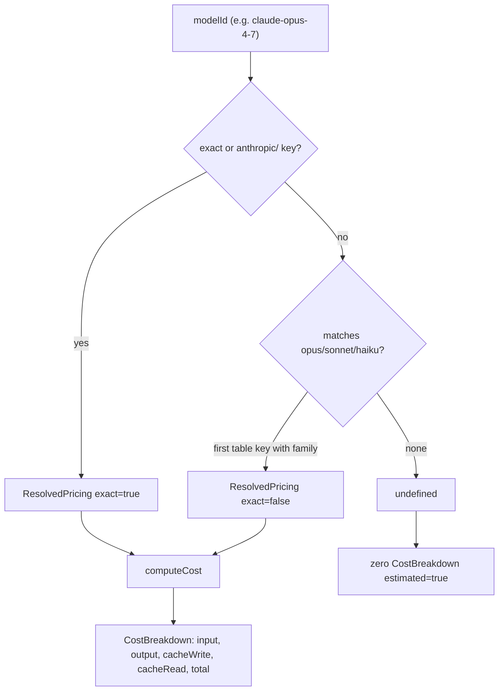

# Cost & Pricing Model

> Indexed at commit `bf5a4c8` on 2026-07-12 · [view on GitHub](https://github.com/yorch/cc-analyzer/tree/bf5a4c8)

## Relevant source files

- [src/core/pricing.ts](https://github.com/yorch/cc-analyzer/blob/bf5a4c8/src/core/pricing.ts)
- [src/core/pricing-source.ts](https://github.com/yorch/cc-analyzer/blob/bf5a4c8/src/core/pricing-source.ts)
- [src/core/bundled-pricing.json](https://github.com/yorch/cc-analyzer/blob/bf5a4c8/src/core/bundled-pricing.json)

## Overview

Claude Code session records store token counts but never a dollar cost, so `cc-analyzer` derives cost itself by multiplying token counts against per-model rates. This subsystem owns two responsibilities: the arithmetic that turns a `TokenCounts` bundle into a `CostBreakdown` for a given model, and the acquisition of the pricing table itself from a remote source with an offline fallback. Anthropic prices four token categories differently — input, output, cache-write (with distinct 5-minute and 1-hour Time To Live rates), and cache-read — and modeling all four separately is what keeps the totals accurate, because cache accounting is where most spend accumulates ([src/core/pricing.ts#L1-L18](https://github.com/yorch/cc-analyzer/blob/bf5a4c8/src/core/pricing.ts#L1-L18)).

## Token Categories and Types

The pricing model is built around four interlocking types. `ModelPricing` holds the five per-token rates for one model: `inputCostPerToken`, `outputCostPerToken`, `cacheWrite5mCostPerToken`, `cacheWrite1hCostPerToken`, and `cacheReadCostPerToken` ([src/core/pricing.ts#L10-L18](https://github.com/yorch/cc-analyzer/blob/bf5a4c8/src/core/pricing.ts#L10-L18)). `TokenCounts` mirrors that structure with the observed counts — `inputTokens`, `outputTokens`, `cacheWrite5mTokens`, `cacheWrite1hTokens`, and `cacheReadTokens` ([src/core/pricing.ts#L22-L28](https://github.com/yorch/cc-analyzer/blob/bf5a4c8/src/core/pricing.ts#L22-L28)). A `PricingTable` is a plain `Record<string, ModelPricing>` keyed by model id ([src/core/pricing.ts#L20](https://github.com/yorch/cc-analyzer/blob/bf5a4c8/src/core/pricing.ts#L20)).

The output type `CostBreakdown` collapses the two cache-write TTL buckets into a single `cacheWrite` figure alongside `input`, `output`, `cacheRead`, and `total`, plus an `estimated` boolean that flags when the number could not be sourced from an exact pricing entry ([src/core/pricing.ts#L30-L38](https://github.com/yorch/cc-analyzer/blob/bf5a4c8/src/core/pricing.ts#L30-L38)). Helper constructors and combinators support aggregation across turns and sessions: `zeroTokens` and `zeroCost` produce empty accumulators, `addTokens` and `addCost` sum two values field by field, and `ioTokens` and `cacheTokens` split a `TokenCounts` into "real work" (input + output) versus cache traffic (write 5m + write 1h + read) ([src/core/pricing.ts#L40-L100](https://github.com/yorch/cc-analyzer/blob/bf5a4c8/src/core/pricing.ts#L40-L100)). Notably `addCost` propagates `estimated` with a logical OR, so any estimated component taints the aggregate ([src/core/pricing.ts#L93-L100](https://github.com/yorch/cc-analyzer/blob/bf5a4c8/src/core/pricing.ts#L93-L100)).

Sources: [src/core/pricing.ts:L10-L100](https://github.com/yorch/cc-analyzer/blob/bf5a4c8/src/core/pricing.ts#L10-L100)

## Cost Computation

`computeCost` performs the core arithmetic. Given a `TokenCounts` and a `ModelPricing`, it multiplies each token count by its rate: input and output are direct products, `cacheWrite` sums the 5-minute and 1-hour buckets against their separate rates, and `cacheRead` uses the read rate; `total` is the sum of all four ([src/core/pricing.ts#L64-L82](https://github.com/yorch/cc-analyzer/blob/bf5a4c8/src/core/pricing.ts#L64-L82)). When `pricing` is `undefined`, the function returns an all-zero breakdown with `estimated` set to `true`, so an unpriceable model contributes nothing to totals rather than throwing ([src/core/pricing.ts#L65-L67](https://github.com/yorch/cc-analyzer/blob/bf5a4c8/src/core/pricing.ts#L64-L67)). A successful computation sets `estimated: false` ([src/core/pricing.ts#L80](https://github.com/yorch/cc-analyzer/blob/bf5a4c8/src/core/pricing.ts#L74-L81)).

Sources: [src/core/pricing.ts:L64-L82](https://github.com/yorch/cc-analyzer/blob/bf5a4c8/src/core/pricing.ts#L64-L82)

## Model Resolution

Session records carry versioned model ids such as `claude-opus-4-7`, and pricing tables do not always contain an exact entry for every version. `resolveModel` bridges that gap with a three-stage lookup and reports which stage matched via the `exact` flag on its `ResolvedPricing` return ([src/core/pricing.ts#L102-L130](https://github.com/yorch/cc-analyzer/blob/bf5a4c8/src/core/pricing.ts#L102-L130)). It first tries the raw id, then the same id with an `anthropic/` prefix — both counting as exact matches ([src/core/pricing.ts#L114-L115](https://github.com/yorch/cc-analyzer/blob/bf5a4c8/src/core/pricing.ts#L113-L115)).

If neither exact form is present, it falls back to a family heuristic: a case-insensitive regex classifies the id as `opus`, `sonnet`, or `haiku`, then scans the table for the first key whose lowercased form contains that family name, returning it with `exact: false` ([src/core/pricing.ts#L117-L128](https://github.com/yorch/cc-analyzer/blob/bf5a4c8/src/core/pricing.ts#L117-L128)). This heuristic is what lets a brand-new versioned model still receive a plausible price. Because that price comes from a sibling version rather than the model itself, callers treat the non-exact match as the trigger for marking the resulting cost `estimated`. When no family matches, `resolveModel` returns `undefined`, which flows into `computeCost` as the unpriceable path ([src/core/pricing.ts#L129](https://github.com/yorch/cc-analyzer/blob/bf5a4c8/src/core/pricing.ts#L124-L129)).

Sources: [src/core/pricing.ts:L102-L130](https://github.com/yorch/cc-analyzer/blob/bf5a4c8/src/core/pricing.ts#L102-L130)

## Diagram

The diagram traces a model id from `resolveModel` through the three lookup stages into `computeCost`, showing where a result becomes estimated versus zeroed.

## Pricing Table Acquisition

`loadPricing` sources the `PricingTable` at runtime with a layered strategy that never throws for network reasons: fresh cache, then remote fetch, then stale cache, then the bundled snapshot ([src/core/pricing-source.ts#L69-L94](https://github.com/yorch/cc-analyzer/blob/bf5a4c8/src/core/pricing-source.ts#L69-L94)). It reads a JSON cache file from `pricingCachePath()`; if the cache exists, is younger than `maxAgeMs` (default seven days), and `force` is not set, it returns that table with `source: "cache"` ([src/core/pricing-source.ts#L73-L81](https://github.com/yorch/cc-analyzer/blob/bf5a4c8/src/core/pricing-source.ts#L73-L81)). Otherwise it fetches from the LiteLLM price document at `LITELLM_URL`, parses it, writes the result back to the cache with a `fetchedAt` timestamp, and returns `source: "remote"` ([src/core/pricing-source.ts#L7-L8](https://github.com/yorch/cc-analyzer/blob/bf5a4c8/src/core/pricing-source.ts#L7-L8) [src/core/pricing-source.ts#L83-L89](https://github.com/yorch/cc-analyzer/blob/bf5a4c8/src/core/pricing-source.ts#L83-L89)). A failed or empty fetch falls back to whatever stale cache exists, and if none does, to `bundledPricing` with `source: "bundled"` ([src/core/pricing-source.ts#L90-L93](https://github.com/yorch/cc-analyzer/blob/bf5a4c8/src/core/pricing-source.ts#L90-L93)).

The LiteLLM document uses a different field vocabulary, so `mapLiteLLMEntry` translates each entry into `ModelPricing`. It requires numeric `input_cost_per_token` and `output_cost_per_token`, returning `null` for any entry lacking them, and derives missing cache rates from input: 5-minute cache-write defaults to `input * 1.25`, 1-hour cache-write to `input * 2`, and cache-read to `input * 0.1` ([src/core/pricing-source.ts#L23-L34](https://github.com/yorch/cc-analyzer/blob/bf5a4c8/src/core/pricing-source.ts#L22-L34)). `parseLiteLLMTable` walks the full document, skipping non-object and unmappable entries, to assemble the final `PricingTable` ([src/core/pricing-source.ts#L37-L46](https://github.com/yorch/cc-analyzer/blob/bf5a4c8/src/core/pricing-source.ts#L36-L46)). The `fetchImpl` option injects a custom fetch for testing ([src/core/pricing-source.ts#L48-L55](https://github.com/yorch/cc-analyzer/blob/bf5a4c8/src/core/pricing-source.ts#L48-L55)).

Sources: [src/core/pricing-source.ts:L23-L94](https://github.com/yorch/cc-analyzer/blob/bf5a4c8/src/core/pricing-source.ts#L23-L94)

## Bundled Fallback

[src/core/bundled-pricing.json](https://github.com/yorch/cc-analyzer/blob/bf5a4c8/src/core/bundled-pricing.json) is a pricing snapshot compiled directly into the binary and imported as a typed JSON module, exposed as `bundledPricing` ([src/core/pricing-source.ts#L3](https://github.com/yorch/cc-analyzer/blob/bf5a4c8/src/core/pricing-source.ts#L3) [src/core/pricing-source.ts#L10-L11](https://github.com/yorch/cc-analyzer/blob/bf5a4c8/src/core/pricing-source.ts#L10-L11)). Unlike the raw LiteLLM document, it already conforms to the `PricingTable` shape: each key is a model id mapping to the five `*CostPerToken` fields, so it needs no translation. Entries include both fully versioned ids like `claude-haiku-4-5-20251001` and their unversioned aliases like `claude-haiku-4-5`, which maximizes the odds of an exact match in `resolveModel` even when the network is unavailable ([src/core/bundled-pricing.json#L1-L17](https://github.com/yorch/cc-analyzer/blob/bf5a4c8/src/core/bundled-pricing.json#L1-L17)).

Sources: [src/core/bundled-pricing.json:L1-L17](https://github.com/yorch/cc-analyzer/blob/bf5a4c8/src/core/bundled-pricing.json#L1-L17) [src/core/pricing-source.ts:L1-L11](https://github.com/yorch/cc-analyzer/blob/bf5a4c8/src/core/pricing-source.ts#L1-L11)

## Related Pages

- Parent: [Core Analysis Engine](./2-core-analysis-engine.md)
- Sibling: [Session Parsing & Events](./2.1-session-parsing-and-events.md)
- Sibling: [Index & Analytics](./2.3-index-and-analytics.md)
- Sibling: [Per-Turn Steps](./2.4-per-turn-steps.md)
