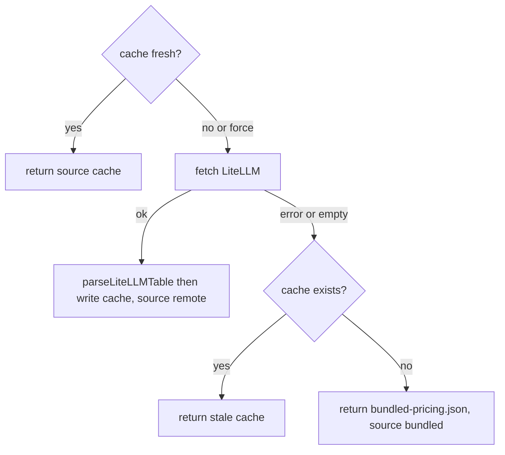

# Cost & Pricing Model

> Indexed at commit `4eeed24` on 2026-07-10 · [view on GitHub](https://github.com/yorch/cc-analyzer/tree/4eeed24)

## Relevant source files

- [src/core/pricing.ts](https://github.com/yorch/cc-analyzer/blob/4eeed24/src/core/pricing.ts)
- [src/core/pricing-source.ts](https://github.com/yorch/cc-analyzer/blob/4eeed24/src/core/pricing-source.ts)
- [src/core/bundled-pricing.json](https://github.com/yorch/cc-analyzer/blob/4eeed24/src/core/bundled-pricing.json)

## Overview

Claude Code session records store token counts but never a dollar cost, so `cc-analyzer` derives cost itself from tokens times per-model rates. This subsystem owns that derivation: [src/core/pricing.ts](https://github.com/yorch/cc-analyzer/blob/4eeed24/src/core/pricing.ts) defines the money types and the arithmetic, [src/core/pricing-source.ts](https://github.com/yorch/cc-analyzer/blob/4eeed24/src/core/pricing-source.ts) supplies the rate table from a remote source with offline fallbacks, and [src/core/bundled-pricing.json](https://github.com/yorch/cc-analyzer/blob/4eeed24/src/core/bundled-pricing.json) is the snapshot compiled into the binary. Anthropic prices four token categories at different rates, and getting the cache categories right is where most real spend is accounted for.

## Token categories and cost arithmetic

The `TokenCounts` interface tracks the five raw counts pulled from session records: `inputTokens`, `outputTokens`, `cacheWrite5mTokens`, `cacheWrite1hTokens`, and `cacheReadTokens`, defined in [src/core/pricing.ts#L22-L28](https://github.com/yorch/cc-analyzer/blob/4eeed24/src/core/pricing.ts#L22-L28). Cache writes are split by time-to-live (TTL) because Anthropic charges them differently: the 5-minute TTL rate is roughly 1.25 times input, and the 1-hour TTL rate is roughly 2 times input, as documented on the `ModelPricing` fields at [src/core/pricing.ts#L10-L18](https://github.com/yorch/cc-analyzer/blob/4eeed24/src/core/pricing.ts#L10-L18). Cache reads are billed at a steep discount to fresh input.

`computeCost` multiplies each count by its per-token rate and sums them into a `CostBreakdown` of `input`, `output`, `cacheWrite`, `cacheRead`, and `total` at [src/core/pricing.ts#L57-L75](https://github.com/yorch/cc-analyzer/blob/4eeed24/src/core/pricing.ts#L57-L75). The two cache-write TTLs collapse into the single `cacheWrite` field, each priced against its own rate before being added. When no `pricing` argument is supplied, `computeCost` returns an all-zero breakdown with `estimated: true` rather than throwing, so an unpriceable model never breaks a report.

The module also exposes monoid-style helpers for aggregation. `zeroTokens` and `addTokens` accumulate raw counts across turns and sessions ([src/core/pricing.ts#L40-L54](https://github.com/yorch/cc-analyzer/blob/4eeed24/src/core/pricing.ts#L40-L54)), while `zeroCost` and `addCost` fold cost breakdowns, propagating `estimated` with a logical OR so that any estimated component taints the aggregate ([src/core/pricing.ts#L77-L93](https://github.com/yorch/cc-analyzer/blob/4eeed24/src/core/pricing.ts#L77-L93)).

Sources: [src/core/pricing.ts:L10-L93](https://github.com/yorch/cc-analyzer/blob/4eeed24/src/core/pricing.ts#L10-L93)

## Model resolution and the `estimated` flag

Session records name models with versioned ids such as `claude-opus-4-7`, which may not have an exact table entry. `resolveModel` handles this in three tiers at [src/core/pricing.ts#L106-L123](https://github.com/yorch/cc-analyzer/blob/4eeed24/src/core/pricing.ts#L106-L123): it first tries an exact key lookup, then the same id with an `anthropic/` prefix, and both of those return `ResolvedPricing` with `exact: true`. If neither hits, it derives a family from the id by testing for `opus`, `sonnet`, or `haiku` and scans the table for the first key containing that family name, returning `exact: false`.

The `exact` flag drives cost honesty. A family-heuristic match still produces a price so that newer versioned models are not silently dropped, but the caller marks the resulting cost as estimated because it was priced against a sibling model rather than the exact one. The `estimated` field on `CostBreakdown` at [src/core/pricing.ts#L36-L37](https://github.com/yorch/cc-analyzer/blob/4eeed24/src/core/pricing.ts#L36-L37) is how that uncertainty travels through every downstream aggregation.

Sources: [src/core/pricing.ts:L95-L123](https://github.com/yorch/cc-analyzer/blob/4eeed24/src/core/pricing.ts#L95-L123)

## Loading the pricing table

`loadPricing` resolves the rate table through a fallback chain and never throws for network reasons, always returning a usable `LoadedPricing` at [src/core/pricing-source.ts#L73-L94](https://github.com/yorch/cc-analyzer/blob/4eeed24/src/core/pricing-source.ts#L73-L94). It reads a cache file from the `cc-analyzer` state directory; if the cache is present and younger than `maxAgeMs` (default seven days) and `force` is not set, it returns immediately with `source: "cache"`. Otherwise it fetches the LiteLLM table from [src/core/pricing-source.ts#L7-L8](https://github.com/yorch/cc-analyzer/blob/4eeed24/src/core/pricing-source.ts#L7-L8), writes the cache, and returns `source: "remote"`.

When the fetch fails, returns a non-OK status, or yields an empty table, the `catch` falls back to any cached table, and failing that to the bundled snapshot with `source: "bundled"` at [src/core/pricing-source.ts#L90-L93](https://github.com/yorch/cc-analyzer/blob/4eeed24/src/core/pricing-source.ts#L90-L93). The `source` field lets the UI report which table backed a computation. A `force` option bypasses the freshness check to trigger a refresh, and a `fetchImpl` option injects a stub fetch for tests ([src/core/pricing-source.ts#L48-L55](https://github.com/yorch/cc-analyzer/blob/4eeed24/src/core/pricing-source.ts#L48-L55)).

The remote document uses LiteLLM's schema, which `mapLiteLLMEntry` translates into `ModelPricing` at [src/core/pricing-source.ts#L23-L34](https://github.com/yorch/cc-analyzer/blob/4eeed24/src/core/pricing-source.ts#L23-L34). Entries lacking a numeric `input_cost_per_token` or `output_cost_per_token` are dropped as unpriceable; when the cache-write and cache-read fields are absent, it synthesizes them from input at the 1.25x, 2x, and 0.1x multipliers. `parseLiteLLMTable` walks the whole document and keeps only mappable entries ([src/core/pricing-source.ts#L37-L46](https://github.com/yorch/cc-analyzer/blob/4eeed24/src/core/pricing-source.ts#L37-L46)).

Sources: [src/core/pricing-source.ts:L7-L94](https://github.com/yorch/cc-analyzer/blob/4eeed24/src/core/pricing-source.ts#L7-L94)

## Bundled fallback table

[src/core/bundled-pricing.json](https://github.com/yorch/cc-analyzer/blob/4eeed24/src/core/bundled-pricing.json) is the offline snapshot, imported directly as a typed `PricingTable` at [src/core/pricing-source.ts#L3-L11](https://github.com/yorch/cc-analyzer/blob/4eeed24/src/core/pricing-source.ts#L3-L11). Each key is a model id mapping to the same five-field `ModelPricing` shape used at runtime, already expressed as per-token dollar rates. For example, `claude-opus-4-5` lists an input rate of `0.000005` and an output rate of `0.000025` at [src/core/bundled-pricing.json#L107-L113](https://github.com/yorch/cc-analyzer/blob/4eeed24/src/core/bundled-pricing.json#L107-L113), and the file carries both bare ids like `claude-sonnet-4-5` and date-stamped ids like `claude-sonnet-4-5-20250929` ([src/core/bundled-pricing.json#L51-L64](https://github.com/yorch/cc-analyzer/blob/4eeed24/src/core/bundled-pricing.json#L51-L64)) so exact matches succeed for both naming forms.

Sources: [src/core/bundled-pricing.json:L1-L163](https://github.com/yorch/cc-analyzer/blob/4eeed24/src/core/bundled-pricing.json#L1-L163) [src/core/pricing-source.ts:L3-L11](https://github.com/yorch/cc-analyzer/blob/4eeed24/src/core/pricing-source.ts#L3-L11)

## Diagram

The chain in `loadPricing` prefers a fresh cache, then a remote fetch, then a stale cache, then the bundled snapshot, guaranteeing a usable table regardless of network state ([src/core/pricing-source.ts#L73-L94](https://github.com/yorch/cc-analyzer/blob/4eeed24/src/core/pricing-source.ts#L73-L94)).

## Related Pages

- Parent: [Core Analysis Engine](./2-core-analysis-engine.md)
- Sibling: [Session Parsing & Events](./2.1-session-parsing-and-events.md)
- Sibling: [Index & Analytics](./2.3-index-and-analytics.md)
