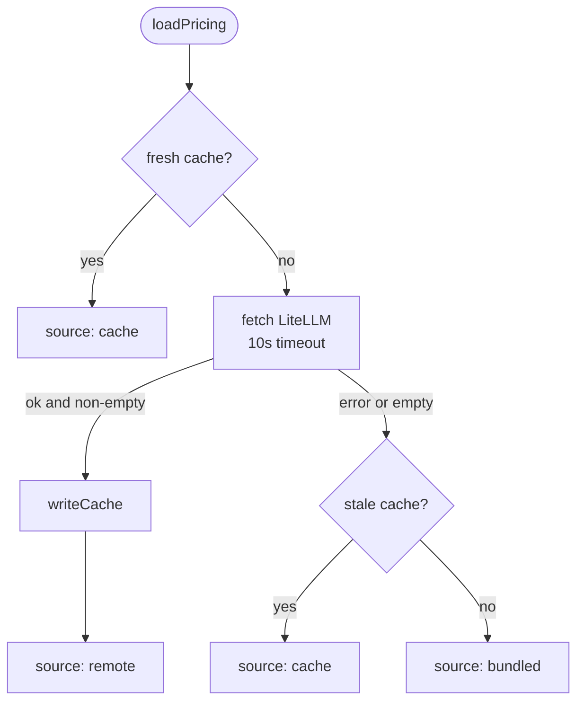

# Cost & Pricing Model

> Indexed at commit `51ce1a4` on 2026-08-26 · [view on GitHub](https://github.com/yorch/cc-analyzer/tree/51ce1a4)

## Relevant source files

- [src/core/pricing.ts](https://github.com/yorch/cc-analyzer/blob/51ce1a4/src/core/pricing.ts)
- [src/core/pricing-source.ts](https://github.com/yorch/cc-analyzer/blob/51ce1a4/src/core/pricing-source.ts)
- [src/core/bundled-pricing.json](https://github.com/yorch/cc-analyzer/blob/51ce1a4/src/core/bundled-pricing.json)

## Overview

Claude Code session records store token counts but never a dollar figure, so `cc-analyzer` derives cost itself. [src/core/pricing.ts](https://github.com/yorch/cc-analyzer/blob/51ce1a4/src/core/pricing.ts) computes cost as tokens times per-model rates, pricing the four token categories separately: input, output, cache-write (with distinct 5-minute and 1-hour Time-To-Live rates), and cache-read. [src/core/pricing-source.ts](https://github.com/yorch/cc-analyzer/blob/51ce1a4/src/core/pricing-source.ts) supplies the rate table, fetching it from LiteLLM at runtime, caching it in the state directory, and falling back to the compiled-in [src/core/bundled-pricing.json](https://github.com/yorch/cc-analyzer/blob/51ce1a4/src/core/bundled-pricing.json) when the network is unavailable. Getting cache accounting right is where most real spend hides, so the two cache-write TTL tiers and cache-read are each priced on their own rate.

Sources: [src/core/pricing.ts:L1-L38](https://github.com/yorch/cc-analyzer/blob/51ce1a4/src/core/pricing.ts#L1-L38) [src/core/pricing-source.ts:L1-L11](https://github.com/yorch/cc-analyzer/blob/51ce1a4/src/core/pricing-source.ts#L1-L11)

## Implementation

The rate shape is `ModelPricing`, holding five `…CostPerToken` fields — input, output, `cacheWrite5mCostPerToken` (Anthropic charges roughly 1.25x input for a 5-minute cache write), `cacheWrite1hCostPerToken` (roughly 2x input for a 1-hour write), and `cacheReadCostPerToken` ([src/core/pricing.ts#L10-L18](https://github.com/yorch/cc-analyzer/blob/51ce1a4/src/core/pricing.ts#L10-L18)). Beyond the rates the shape carries two optional pieces of metadata: `maxInputTokens`, the context-window ceiling the context-fill charts draw as their limit line, and `above200k`, the long-context tier rates (next section). Token counts mirror those categories in `TokenCounts` ([src/core/pricing.ts#L22-L28](https://github.com/yorch/cc-analyzer/blob/51ce1a4/src/core/pricing.ts#L22-L28)), and the result of pricing a bundle of tokens is a `CostBreakdown` carrying `input`, `output`, `cacheWrite`, `cacheRead`, `total`, and an `estimated` flag ([src/core/pricing.ts#L30-L38](https://github.com/yorch/cc-analyzer/blob/51ce1a4/src/core/pricing.ts#L30-L38)).

`computeCost()` multiplies each token count by its matching rate and sums them ([src/core/pricing.ts#L64-L82](https://github.com/yorch/cc-analyzer/blob/51ce1a4/src/core/pricing.ts#L64-L82)). The two cache-write tiers collapse into a single `cacheWrite` figure — `cacheWrite5mTokens` priced at the 5-minute rate plus `cacheWrite1hTokens` at the 1-hour rate ([src/core/pricing.ts#L70-L73](https://github.com/yorch/cc-analyzer/blob/51ce1a4/src/core/pricing.ts#L70-L73)). When no pricing is supplied the function returns an all-zero breakdown with `estimated: true` rather than throwing ([src/core/pricing.ts#L65-L67](https://github.com/yorch/cc-analyzer/blob/51ce1a4/src/core/pricing.ts#L65-L67)). Helper reducers `addTokens()` and `addCost()` aggregate across turns, and `addCost()` propagates `estimated` with a logical OR so any single estimated component taints the aggregate ([src/core/pricing.ts#L55-L61](https://github.com/yorch/cc-analyzer/blob/51ce1a4/src/core/pricing.ts#L55-L61), [src/core/pricing.ts#L93-L100](https://github.com/yorch/cc-analyzer/blob/51ce1a4/src/core/pricing.ts#L93-L100)).

`resolveModel()` maps a session model id such as `claude-opus-4-7` to a `ModelPricing` in three stages ([src/core/pricing.ts#L177-L193](https://github.com/yorch/cc-analyzer/blob/51ce1a4/src/core/pricing.ts#L177-L193)). It first tries an exact lookup, then an `anthropic/`-prefixed lookup; either produces `{ exact: true }` ([src/core/pricing.ts#L178-L179](https://github.com/yorch/cc-analyzer/blob/51ce1a4/src/core/pricing.ts#L178-L179)). Failing that, it classifies the id into an `opus`, `sonnet`, or `haiku` family by regular expression and calls `familyPricing()`, returning `{ exact: false }` ([src/core/pricing.ts#L181-L191](https://github.com/yorch/cc-analyzer/blob/51ce1a4/src/core/pricing.ts#L181-L191)). A non-exact match is what flags a cost as `estimated` downstream, so an unrecognized future model still gets a defensible price instead of zero.

`familyPricing()` scans the whole table — LiteLLM ships thousands of entries — so its result is memoized per table instance via a `WeakMap` keyed cache ([src/core/pricing.ts#L108-L110](https://github.com/yorch/cc-analyzer/blob/51ce1a4/src/core/pricing.ts#L108-L110), [src/core/pricing.ts#L140-L170](https://github.com/yorch/cc-analyzer/blob/51ce1a4/src/core/pricing.ts#L140-L170)). Within a family it prefers bare Anthropic ids (`claude-…` or `anthropic/claude-…`) over provider variants like Bedrock or Vertex, and among those picks the newest by version segments ([src/core/pricing.ts#L133-L166](https://github.com/yorch/cc-analyzer/blob/51ce1a4/src/core/pricing.ts#L133-L166)). `versionKey()` extracts numeric segments while filtering out 6-or-more-digit runs so a trailing date stamp like `20250514` does not inflate the comparison, and `compareVersionKeys()` compares element-wise with longer-wins on a shared prefix ([src/core/pricing.ts#L119-L131](https://github.com/yorch/cc-analyzer/blob/51ce1a4/src/core/pricing.ts#L119-L131)). So an unknown `claude-opus-4-9` prices off the latest opus rather than a stale `claude-3-opus`.

A non-exact match isn't the only path to `estimated`, and one used to be a false positive: Claude Code writes zero-usage error stubs under the model id `<synthetic>`, which `resolveModel()` cannot match to any pricing entry. Previously, one such stub flagged its whole session's cost `estimated` even though every real call priced against exact rates. `analyze.ts` now clears the flag whenever a call's token counts are all zero — a $0 result is exact under any pricing table, so there's nothing to estimate. See [Core Analysis Engine](./2-core-analysis-engine.md) for where this runs in the per-call fold.

Sources: [src/core/pricing.ts:L10-L100](https://github.com/yorch/cc-analyzer/blob/51ce1a4/src/core/pricing.ts#L10-L100) [src/core/pricing.ts:L108-L193](https://github.com/yorch/cc-analyzer/blob/51ce1a4/src/core/pricing.ts#L108-L193)

## Long-context (>200K) tiered pricing

`ModelPricing` optionally carries `above200k`, a full second set of the five per-token rates for Anthropic's long-context tier (the 1M-context beta), alongside the existing `maxInputTokens` context-window ceiling. `promptTokens()` sums a call's prompt-side tokens — input + cache-read + both cache-write categories, everything except output — since that's what Anthropic's threshold keys off. `effectivePricing(pricing, tokens)` swaps in the whole `above200k` rate set once `promptTokens(tokens)` exceeds `LONG_CONTEXT_THRESHOLD` (200,000 tokens); a model with no `above200k` entry, or a call at or under the threshold, prices normally ([src/core/pricing.ts#L21-L83](https://github.com/yorch/cc-analyzer/blob/51ce1a4/src/core/pricing.ts#L21-L83)).

The switch is a **whole-request** decision, matching how Anthropic actually bills the tier — the entire call reprices at the higher rates, not just the tokens past 200K — and it is decided **per API call, never on an aggregate**: `analyze.ts` calls `effectivePricing` with one de-duplicated call's own token counts before pricing it. Pricing off an aggregate (e.g. a turn's or a session's summed tokens) would trip the threshold on calls that individually never crossed it, which is exactly what deciding per call avoids.

`mapLiteLLMEntry()` (below) populates `above200k` from LiteLLM's `*_above_200k_tokens` fields when the source publishes them, and falls back to Anthropic's published long-context multipliers for any it omits.

## The pricing source

`loadPricing()` resolves the table through a fallback chain: fresh cache, then remote fetch, then stale cache, then bundled ([src/core/pricing-source.ts#L69-L97](https://github.com/yorch/cc-analyzer/blob/51ce1a4/src/core/pricing-source.ts#L69-L97)). It returns a `LoadedPricing` whose `source` field records which tier answered — `"cache"`, `"remote"`, or `"bundled"` ([src/core/pricing-source.ts#L57-L60](https://github.com/yorch/cc-analyzer/blob/51ce1a4/src/core/pricing-source.ts#L57-L60)). A cache younger than `maxAgeMs` (default seven days) short-circuits the network unless `force` is set ([src/core/pricing-source.ts#L48-L55](https://github.com/yorch/cc-analyzer/blob/51ce1a4/src/core/pricing-source.ts#L48-L55), [src/core/pricing-source.ts#L81-L84](https://github.com/yorch/cc-analyzer/blob/51ce1a4/src/core/pricing-source.ts#L81-L84)). The remote fetch targets the LiteLLM `model_prices_and_context_window.json` document and is bounded by a 10-second `AbortSignal.timeout`, so a hung network cannot stall every command that loads pricing ([src/core/pricing-source.ts#L7-L8](https://github.com/yorch/cc-analyzer/blob/51ce1a4/src/core/pricing-source.ts#L7-L8), [src/core/pricing-source.ts#L76-L78](https://github.com/yorch/cc-analyzer/blob/51ce1a4/src/core/pricing-source.ts#L76-L78)). The function never throws for network reasons; a failed or empty fetch falls back to the stale cache or the bundled snapshot ([src/core/pricing-source.ts#L86-L96](https://github.com/yorch/cc-analyzer/blob/51ce1a4/src/core/pricing-source.ts#L86-L96)).

`mapLiteLLMEntry()` translates a raw LiteLLM record into `ModelPricing`, returning `null` when input or output cost is missing so unpriceable entries are dropped ([src/core/pricing-source.ts#L22-L34](https://github.com/yorch/cc-analyzer/blob/51ce1a4/src/core/pricing-source.ts#L22-L34)). LiteLLM does not always publish cache rates, so the mapper synthesizes them from input cost — 1.25x for a 5-minute write, 2x for a 1-hour write, and 0.1x for a read ([src/core/pricing-source.ts#L30-L32](https://github.com/yorch/cc-analyzer/blob/51ce1a4/src/core/pricing-source.ts#L30-L32)). `parseLiteLLMTable()` iterates the whole JSON document, mapping each entry and skipping anything that fails ([src/core/pricing-source.ts#L37-L46](https://github.com/yorch/cc-analyzer/blob/51ce1a4/src/core/pricing-source.ts#L37-L46)).

`mapLiteLLMEntry()` also maps the long-context tier: when LiteLLM publishes `input_cost_per_token_above_200k_tokens`, the entry gets an `above200k` block, with any missing companion field (`output_cost_per_token_above_200k_tokens`, `cache_creation_input_token_cost_above_200k_tokens`) falling back to Anthropic's published long-context multipliers of the tier's own input rate — output 1.5x, 5-minute cache-write 1.25x, 1-hour cache-write 2x, cache-read 0.1x, the same shape as the base-rate fallbacks above. A model with no `above_200k_tokens` input field gets no `above200k` entry at all, so `effectivePricing()` never tiers it. `isValidEntry()` validates `above200k` the same way as the base rates — all five must be finite numbers, or the tier alone is dropped rather than invalidating the whole entry ([src/core/pricing-source.ts#L136-L163](https://github.com/yorch/cc-analyzer/blob/51ce1a4/src/core/pricing-source.ts#L136-L163)).

The cache's on-disk format carries a `formatVersion`, bumped (`CACHE_FORMAT_VERSION`, now 3) whenever the cached shape gains a load-bearing field — `above200k` is the latest. `readCache()` rejects a file whose `formatVersion` doesn't match, so a cache written by an older binary is refetched (or the bundled snapshot is used offline) instead of silently serving entries without the new tier ([src/core/pricing-source.ts#L87-L92](https://github.com/yorch/cc-analyzer/blob/51ce1a4/src/core/pricing-source.ts#L87-L92), [src/core/pricing-source.ts#L165-L185](https://github.com/yorch/cc-analyzer/blob/51ce1a4/src/core/pricing-source.ts#L165-L185)).

The cache is validated on both read and write. `readCache()` rejects a file with a non-numeric `fetchedAt` or missing table, then drops any entry that fails `isValidEntry()` — the guard that requires all five rates to be finite numbers ([src/core/pricing-source.ts#L99-L129](https://github.com/yorch/cc-analyzer/blob/51ce1a4/src/core/pricing-source.ts#L99-L129)). A corrupted cache with string rates or nulls would otherwise yield `NaN` costs for every session, so an unusable cache is treated as absent and returns `null` ([src/core/pricing-source.ts#L119-L124](https://github.com/yorch/cc-analyzer/blob/51ce1a4/src/core/pricing-source.ts#L119-L124)). `writeCache()` serializes `{ fetchedAt, table }` to the path from `pricingCachePath()`, creating parent directories as needed ([src/core/pricing-source.ts#L131-L134](https://github.com/yorch/cc-analyzer/blob/51ce1a4/src/core/pricing-source.ts#L131-L134)).

Sources: [src/core/pricing-source.ts:L1-L134](https://github.com/yorch/cc-analyzer/blob/51ce1a4/src/core/pricing-source.ts#L1-L134)

## Diagram

```mermaid
flowchart TD
    Start([loadPricing]) --> FreshCache{fresh cache?}
    FreshCache -- yes --> UseCache[source: cache]
    FreshCache -- no --> Fetch[fetch LiteLLM<br/>10s timeout]
    Fetch -- ok and non-empty --> WriteCache[writeCache] --> UseRemote[source: remote]
    Fetch -- error or empty --> StaleCheck{stale cache?}
    StaleCheck -- yes --> UseStale[source: cache]
    StaleCheck -- no --> UseBundled[source: bundled]
```

The chain guarantees a usable table for every command that prices sessions, degrading from a live LiteLLM snapshot down to the compiled-in bundle without ever throwing for network reasons ([src/core/pricing-source.ts#L69-L97](https://github.com/yorch/cc-analyzer/blob/51ce1a4/src/core/pricing-source.ts#L69-L97)).

## The bundled snapshot

[src/core/bundled-pricing.json](https://github.com/yorch/cc-analyzer/blob/51ce1a4/src/core/bundled-pricing.json) is a plain object keyed by model id, each value already in `ModelPricing` shape with the five per-token rate fields ([src/core/bundled-pricing.json#L1-L15](https://github.com/yorch/cc-analyzer/blob/51ce1a4/src/core/bundled-pricing.json#L1-L15)). It is imported with a JSON import attribute and cast to `PricingTable`, so `bun --compile` bakes it into the binary as the offline fallback ([src/core/pricing-source.ts#L3-L11](https://github.com/yorch/cc-analyzer/blob/51ce1a4/src/core/pricing-source.ts#L3-L11)). Entries cover the Claude families the analyzer expects to encounter — for example `claude-haiku-4-5`, `claude-3-7-sonnet-20250219`, and `claude-3-opus-20240229` — carrying both dated and undated ids so exact lookups succeed against either form ([src/core/bundled-pricing.json#L1-L36](https://github.com/yorch/cc-analyzer/blob/51ce1a4/src/core/bundled-pricing.json#L1-L36)).

Sources: [src/core/bundled-pricing.json:L1-L36](https://github.com/yorch/cc-analyzer/blob/51ce1a4/src/core/bundled-pricing.json#L1-L36) [src/core/pricing-source.ts:L3-L11](https://github.com/yorch/cc-analyzer/blob/51ce1a4/src/core/pricing-source.ts#L3-L11)

## Cost basis: framing, not computation

Everything above computes the same dollar figure regardless of how the user actually pays for Claude Code — `computeCost()` has no notion of billing plan. For an API-key user that figure approximates a real invoice. Most Claude Code users are on a flat Pro/Max subscription instead, where the same number is *API-equivalent value* — what the usage would have cost at API rates — not money owed.

`src/core/cost-framing.ts` (bun-free, imported directly by the web SPA) defines the `CostBasis` type (`"api" | "subscription"`) and one canonical sentence, `costFramingNote()`, rendered verbatim by every surface — never reworded per surface, so the framing can't drift. `src/core/prefs.ts` persists the preference to `<stateDir>/prefs.json` (the same tolerant, merge-safe JSON pattern as `telemetry.ts`), defaulting to `"api"` when unset or unreadable. The preference can be *set* two ways: the CLI (`cc-analyzer cost-basis api|subscription`) or, for web-only users, a small toggle on the web Dashboard hero that calls `PUT /api/prefs` (see [Web Server and API](./5-web-server-and-api.md)) — both paths end at the same `setCostBasis()` call, so they can't disagree. It's read at each surface's presentation boundary: `cmdStats` for the CLI, the TUI `App` component for `PortfolioLede`, and a `costBasis` field merged into the `/api/stats` response (read fresh per request, not memoized with the rest of the payload) for the web SPA's Dashboard and Insights pages. It changes wording only — session totals, `stats`, `/api/stats`, and every other cost number are computed identically under either basis.

## What the numbers aren't

Two caveats hold regardless of cost basis or the tiered/de-dup changes above:

- cc-analyzer always computes cost from token counts × the published pricing table — it never reads the deprecated pre-computed `costUSD` field some older Claude Code JSONL files carry. This is the same choice as ccusage's `--mode calculate`; a tool that defaults to trusting `costUSD` (ccusage's `auto` mode) can report a different total for the same old logs.
- Local JSONL files are not the billing ground truth. Usage from other machines, from claude.ai web, or from non-Claude-Code API use never appears in them, so a portfolio built from `~/.claude` alone can undercount real spend. And for subscription (Pro/Max) users the dollar figure was never a bill in the first place — it's API-equivalent value, per the cost-basis framing above.

## Related Pages

- Parent: [Core Analysis Engine](./2-core-analysis-engine.md)
- Sibling: [Session Parsing & Events](./2.1-session-parsing-and-events.md)
- Sibling: [Index & Analytics](./2.3-index-and-analytics.md)
- Sibling: [Per-Turn Steps](./2.4-per-turn-steps.md)
