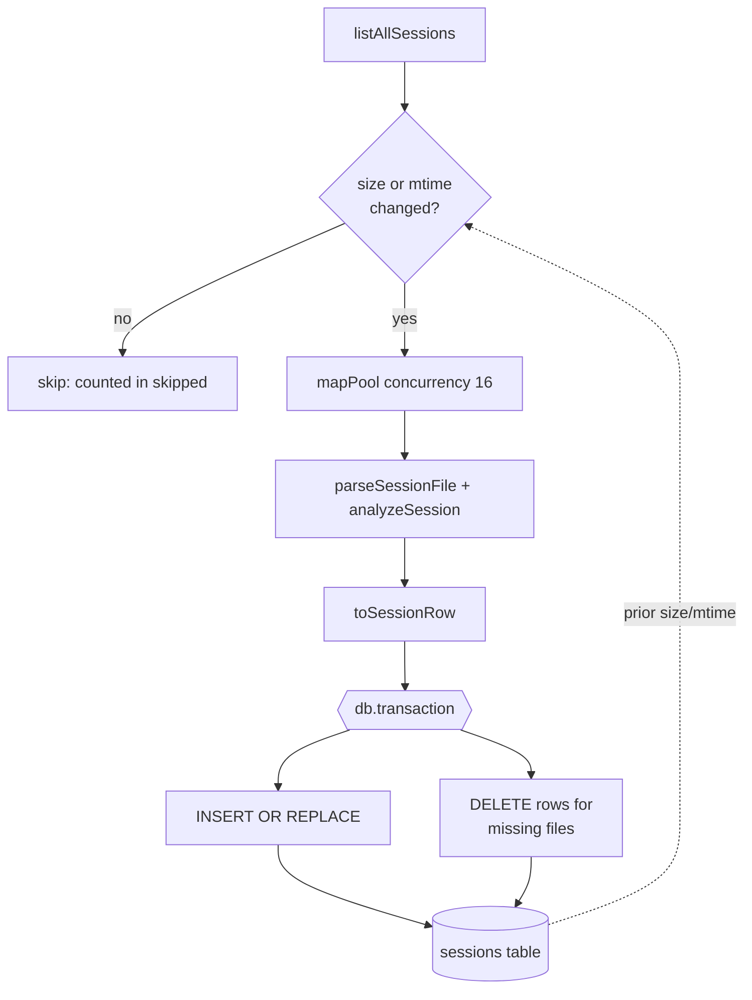

# Index & Portfolio Analytics

> Indexed at commit `4eeed24` on 2026-07-10 · [view on GitHub](https://github.com/yorch/cc-analyzer/tree/4eeed24)

## Relevant source files

- [src/core/db.ts](https://github.com/yorch/cc-analyzer/blob/4eeed24/src/core/db.ts)
- [src/core/indexer.ts](https://github.com/yorch/cc-analyzer/blob/4eeed24/src/core/indexer.ts)
- [src/core/queries.ts](https://github.com/yorch/cc-analyzer/blob/4eeed24/src/core/queries.ts)
- [src/core/stats.ts](https://github.com/yorch/cc-analyzer/blob/4eeed24/src/core/stats.ts)
- [src/core/discover.ts](https://github.com/yorch/cc-analyzer/blob/4eeed24/src/core/discover.ts)
- [src/core/paths.ts](https://github.com/yorch/cc-analyzer/blob/4eeed24/src/core/paths.ts)

## Overview

The index layer turns the per-session analysis produced by the parsing engine into a queryable [SQLite](https://sqlite.org) cache and exposes portfolio-wide aggregations on top of it. It owns a single `sessions` table, keyed by file path, that flattens each `SessionAnalysis` into scalar columns plus a handful of JSON blobs. The index is deliberately disposable: it can be deleted and rebuilt from the JavaScript Object Notation Lines (JSONL) session files at any time, so it stores no authoritative data of its own, as documented in [src/core/db.ts:L54-L57](https://github.com/yorch/cc-analyzer/blob/4eeed24/src/core/db.ts#L54-L57).

Four modules cooperate here. [src/core/db.ts](https://github.com/yorch/cc-analyzer/blob/4eeed24/src/core/db.ts) opens and migrates the database, [src/core/indexer.ts](https://github.com/yorch/cc-analyzer/blob/4eeed24/src/core/indexer.ts) incrementally populates it, [src/core/queries.ts](https://github.com/yorch/cc-analyzer/blob/4eeed24/src/core/queries.ts) provides row-level read helpers for the TUI and web project lists, and [src/core/stats.ts](https://github.com/yorch/cc-analyzer/blob/4eeed24/src/core/stats.ts) provides the roll-up aggregations that power the `stats` command and the web dashboard. File discovery and path resolution come from [src/core/discover.ts](https://github.com/yorch/cc-analyzer/blob/4eeed24/src/core/discover.ts) and [src/core/paths.ts](https://github.com/yorch/cc-analyzer/blob/4eeed24/src/core/paths.ts), which are covered on the parent page.

## Implementation

### Database and schema

`openDb()` resolves the index location to `~/.config/cc-analyzer/index.db` via `indexDbPath()`, creates the state directory, and opens a `bun:sqlite` `Database` with `{ create: true }`. It enables Write-Ahead Logging (WAL) with `PRAGMA journal_mode = WAL` and relaxes durability with `PRAGMA synchronous = NORMAL`, then applies the schema with `db.exec(SCHEMA)`, as shown in [src/core/db.ts:L58-L63](https://github.com/yorch/cc-analyzer/blob/4eeed24/src/core/db.ts#L58-L63). The state directory itself is resolved from `XDG_CONFIG_HOME` (falling back to `~/.config`) by `stateDir()` in [src/core/paths.ts:L22-L29](https://github.com/yorch/cc-analyzer/blob/4eeed24/src/core/paths.ts#L22-L29), and both locations are overridable through environment variables for testing.

The schema defines two tables. A `meta` key/value table holds the `schema_version` marker, and the `sessions` table declares one column per flattened metric plus four JSON columns — `models_json`, `tools_json`, `skills_json`, and `subagents_json` — for the nested breakdowns, as declared in [src/core/db.ts:L5-L50](https://github.com/yorch/cc-analyzer/blob/4eeed24/src/core/db.ts#L5-L50). Three secondary indexes on `project_id`, `month`, and `day` support the grouping queries in the analytics module. After applying the schema, `openDb()` reads the stored `schema_version` and rewrites it with `INSERT OR REPLACE` when it differs from the constant `SCHEMA_VERSION` of `"1"`, giving a minimal migration hook, per [src/core/db.ts:L64-L72](https://github.com/yorch/cc-analyzer/blob/4eeed24/src/core/db.ts#L64-L72).

Sources: [src/core/db.ts:L5-L73](https://github.com/yorch/cc-analyzer/blob/4eeed24/src/core/db.ts#L5-L73) [src/core/paths.ts:L22-L30](https://github.com/yorch/cc-analyzer/blob/4eeed24/src/core/paths.ts#L22-L30)

### Incremental reindex

`reindex()` is the write path, and it is incremental by design. It first lists every session file with `listAllSessions()` and builds a `currentPaths` set, then — unless `opts.rebuild` is set — loads the `path`, `mtime_ms`, and `size_bytes` of every already-indexed row into an `existing` map, per [src/core/indexer.ts:L171-L187](https://github.com/yorch/cc-analyzer/blob/4eeed24/src/core/indexer.ts#L171-L187). A file is queued for ingestion only when it has no prior row or when its modification time or byte size differs from the stored values, which is the `toIngest` filter at [src/core/indexer.ts:L189-L192](https://github.com/yorch/cc-analyzer/blob/4eeed24/src/core/indexer.ts#L189-L192). The `SessionInfo` records carrying that `sizeBytes`/`mtimeMs` metadata come from the `stat` calls in [src/core/discover.ts:L54-L79](https://github.com/yorch/cc-analyzer/blob/4eeed24/src/core/discover.ts#L54-L79).

Queued files are parsed and analyzed through `mapPool()`, a bounded-concurrency worker pool defaulting to 16 that spawns up to `limit` workers, each pulling the next index off a shared counter until the list is exhausted, per [src/core/indexer.ts:L136-L149](https://github.com/yorch/cc-analyzer/blob/4eeed24/src/core/indexer.ts#L136-L149). Each task calls `parseSessionFile()` then `analyzeSession()` and converts the result with `toSessionRow()`; any file that throws is caught and mapped to `null` so one bad file cannot abort the whole run, and a progress callback fires in the `finally` block, as shown in [src/core/indexer.ts:L195-L206](https://github.com/yorch/cc-analyzer/blob/4eeed24/src/core/indexer.ts#L195-L206).

Writes happen inside a single `db.transaction`. Non-null rows are upserted with `INSERT OR REPLACE`, and — outside rebuild mode — any indexed path no longer present on disk is pruned with a `DELETE`, per [src/core/indexer.ts:L208-L225](https://github.com/yorch/cc-analyzer/blob/4eeed24/src/core/indexer.ts#L208-L225). The upsert statement is built from a fixed `COLUMNS` array and bound with positional `?` placeholders via `rowValues()`, deliberately avoiding `bun:sqlite` named-parameter binding, as seen in [src/core/indexer.ts:L90-L134](https://github.com/yorch/cc-analyzer/blob/4eeed24/src/core/indexer.ts#L90-L134). `reindex()` returns a `ReindexResult` reporting `total`, `indexed`, `skipped`, and `deleted` counts, per [src/core/indexer.ts:L227-L233](https://github.com/yorch/cc-analyzer/blob/4eeed24/src/core/indexer.ts#L227-L233).

`toSessionRow()` performs the flattening. It pulls token and cost totals off the analysis, derives the `day` and `month` grouping keys by slicing the ISO start time, serializes the four nested breakdowns with `JSON.stringify`, coerces the boolean `estimated` flag to an integer, and stamps the file's `size_bytes`, `mtime_ms`, and `indexed_at`, per [src/core/indexer.ts:L45-L88](https://github.com/yorch/cc-analyzer/blob/4eeed24/src/core/indexer.ts#L45-L88).

Sources: [src/core/indexer.ts:L45-L234](https://github.com/yorch/cc-analyzer/blob/4eeed24/src/core/indexer.ts#L45-L234) [src/core/discover.ts:L54-L89](https://github.com/yorch/cc-analyzer/blob/4eeed24/src/core/discover.ts#L54-L89)

### Read helpers

[src/core/queries.ts](https://github.com/yorch/cc-analyzer/blob/4eeed24/src/core/queries.ts) exposes row-oriented reads over the `sessions` table. `listIndexedProjects()` groups by `project_id` to produce per-project rollups — session count, summed `cost_total`, and the latest `mtime_ms` — ordered by most recent activity, per [src/core/queries.ts:L25-L39](https://github.com/yorch/cc-analyzer/blob/4eeed24/src/core/queries.ts#L25-L39). `listIndexedSessions()` returns the sessions within one project ordered by recency and re-inflates the integer `cost_estimated` column back into a boolean, per [src/core/queries.ts:L42-L61](https://github.com/yorch/cc-analyzer/blob/4eeed24/src/core/queries.ts#L42-L61). `isIndexEmpty()` and `sessionPathById()` are small lookups; the latter resolves a file path from either a `session_id` match or a `path LIKE '%/<id>.jsonl'` fallback, per [src/core/queries.ts:L63-L74](https://github.com/yorch/cc-analyzer/blob/4eeed24/src/core/queries.ts#L63-L74).

### Portfolio analytics

[src/core/stats.ts](https://github.com/yorch/cc-analyzer/blob/4eeed24/src/core/stats.ts) provides the aggregate queries. `portfolioSummary()` computes a single-row rollup: session count, distinct project count, total cost, an `estimatedShare` derived from `SUM(cost_total * cost_estimated) / SUM(cost_total)`, token totals, and the first and last active day, per [src/core/stats.ts:L47-L87](https://github.com/yorch/cc-analyzer/blob/4eeed24/src/core/stats.ts#L47-L87). `spendByMonth()` and `spendByProject()` group by the `month` and `project_id` columns respectively, summing cost, sessions, and a shared `TOKEN_SUM` expression that adds all five token counters, per [src/core/stats.ts:L45-L114](https://github.com/yorch/cc-analyzer/blob/4eeed24/src/core/stats.ts#L45-L114). `topSessions()` ranks rows by `cost_total` descending with a `LIMIT` bound, per [src/core/stats.ts:L116-L127](https://github.com/yorch/cc-analyzer/blob/4eeed24/src/core/stats.ts#L116-L127).

`spendByModel()` is the exception that cannot be expressed in pure SQL because per-model usage lives in the `models_json` blob. It selects every `models_json` value, parses each with a `try`/`catch` that skips malformed rows, and accumulates `apiCalls` and `cost.total` per model name into a `Map` before returning the entries sorted by cost, per [src/core/stats.ts:L129-L150](https://github.com/yorch/cc-analyzer/blob/4eeed24/src/core/stats.ts#L129-L150). Like the write path, the limit-bearing analytics queries bind their `LIMIT` with positional `?` placeholders.

Sources: [src/core/queries.ts:L25-L74](https://github.com/yorch/cc-analyzer/blob/4eeed24/src/core/queries.ts#L25-L74) [src/core/stats.ts:L45-L150](https://github.com/yorch/cc-analyzer/blob/4eeed24/src/core/stats.ts#L45-L150)

## Diagram

The reindex flow lists every session, diffs each file's `(size, mtime)` against the stored row to decide whether to re-parse, runs the survivors through the bounded worker pool, and commits both upserts and deletions in one transaction. Skipped files never touch the parser, which is what makes repeated runs cheap.

## Usage

`reindex()` is invoked whenever the index needs to be brought up to date, with `rebuild: true` forcing a full re-parse that also disables pruning. Read consumers open the database with `openDb()` and call the `queries.ts` helpers for lists or the `stats.ts` functions for the `stats` command and web dashboard aggregations. Because the index is a pure cache of the JSONL files under `~/.claude/projects`, deleting `index.db` and re-running `reindex()` reproduces identical results.

Sources: [src/core/indexer.ts:L158-L172](https://github.com/yorch/cc-analyzer/blob/4eeed24/src/core/indexer.ts#L158-L172) [src/core/db.ts:L58-L60](https://github.com/yorch/cc-analyzer/blob/4eeed24/src/core/db.ts#L58-L60)

## Related Pages

- Parent: [Core Analysis Engine](./2-core-analysis-engine.md)
- Sibling: [Session Parsing & Events](./2.1-session-parsing-and-events.md)
- Sibling: [Cost & Pricing](./2.2-cost-and-pricing.md)
