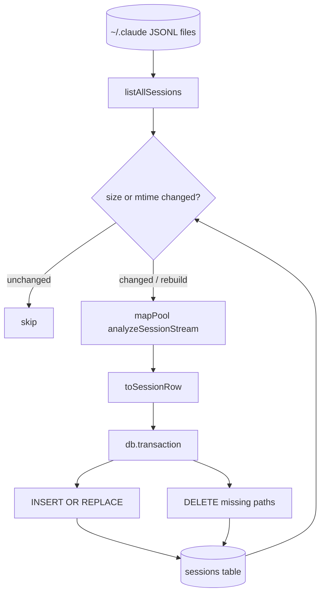

# Index & Aggregation

> Indexed at commit `9d4dd3f` on 2026-07-23 · [view on GitHub](https://github.com/yorch/cc-analyzer/tree/9d4dd3f)

## Relevant source files

- [src/core/db.ts](https://github.com/yorch/cc-analyzer/blob/9d4dd3f/src/core/db.ts)
- [src/core/indexer.ts](https://github.com/yorch/cc-analyzer/blob/9d4dd3f/src/core/indexer.ts)
- [src/core/queries.ts](https://github.com/yorch/cc-analyzer/blob/9d4dd3f/src/core/queries.ts)
- [src/core/stats.ts](https://github.com/yorch/cc-analyzer/blob/9d4dd3f/src/core/stats.ts)

## Overview

The index is a disposable SQLite cache that flattens every analyzed session into a single wide `sessions` table, so the TUI, `stats`, and `serve` frontends read pre-computed aggregates instead of re-parsing JSONL files on every launch. It owns three concerns: the schema and its migration (`db.ts`), the incremental scan that keeps the table in sync with `~/.claude` (`indexer.ts`), and the read-side rollups that fold rows — including JSON blob columns — into portfolio and project analytics (`queries.ts`, `stats.ts`). This page covers the foundational aggregation mechanics; the derived insight, trend, and chart products layered on top are documented in [7-analytics-and-insights](./7-analytics-and-insights.md).

## The schema and its disposable migration

`db.ts` defines one flat `sessions` table keyed by the session's file `path`, with scalar columns for every aggregate metric — token buckets, per-category costs, turn/API/tool counts, web-tool counts, sidechain totals — plus a set of `*_json` TEXT columns that hold structured detail such as `models_json`, `tools_json`, `turn_depths_json`, and `compactions_json` [src/core/db.ts:L12-L65](https://github.com/yorch/cc-analyzer/blob/9d4dd3f/src/core/db.ts#L12-L65). Four secondary indexes cover the common access paths: by `project_id`, `month`, `day`, and `session_id` [src/core/db.ts:L67-L70](https://github.com/yorch/cc-analyzer/blob/9d4dd3f/src/core/db.ts#L67-L70).

`openDb()` opens the database at the state-dir path with `create: true`, enables Write-Ahead Logging (WAL) and `synchronous = NORMAL`, then reconciles the schema version [src/core/db.ts:L88-L108](https://github.com/yorch/cc-analyzer/blob/9d4dd3f/src/core/db.ts#L88-L108). A `meta` table storing `schema_version` is created first, before the main `SCHEMA` runs, because checking the version against a stale `sessions` table that lacks a newer column would fail [src/core/db.ts:L7-L10](https://github.com/yorch/cc-analyzer/blob/9d4dd3f/src/core/db.ts#L7-L10) [src/core/db.ts:L93-L98](https://github.com/yorch/cc-analyzer/blob/9d4dd3f/src/core/db.ts#L93-L98).

Migration is deliberately non-incremental. When the stored version differs from `SCHEMA_VERSION` — currently `"7"` — `openDb()` drops the `sessions` table outright and records the new version, treating the index as a cache that a subsequent `reindex` refills accurately [src/core/db.ts:L82-L106](https://github.com/yorch/cc-analyzer/blob/9d4dd3f/src/core/db.ts#L82-L106). Version 6 replaced classified bash/test columns with raw normalized command heads so query-time heuristics could evolve without a reindex, and version 7 added the `compactions` count column plus `compactions_json` detail [src/core/db.ts:L73-L82](https://github.com/yorch/cc-analyzer/blob/9d4dd3f/src/core/db.ts#L73-L82).

Sources: [src/core/db.ts:L1-L109](https://github.com/yorch/cc-analyzer/blob/9d4dd3f/src/core/db.ts#L1-L109)

## Flattening a SessionAnalysis into a row

`toSessionRow()` in `indexer.ts` maps a `SessionAnalysis` plus its file metadata into the `SessionRow` shape that mirrors the table columns [src/core/indexer.ts:L74-L137](https://github.com/yorch/cc-analyzer/blob/9d4dd3f/src/core/indexer.ts#L74-L137). Scalar totals come straight off `analysis.totals`, while structured fields are serialized with `JSON.stringify` into their `*_json` columns — `models`, `tools`, `toolErrors`, `skills`, `subagents`, `turnDepths`, `commandHeads`, and the full `compactions` list all land as JSON strings [src/core/indexer.ts:L117-L132](https://github.com/yorch/cc-analyzer/blob/9d4dd3f/src/core/indexer.ts#L117-L132).

Two derived fields are computed at flatten time. `day` and `month` are produced by `localDay()`, which formats the session start time in local time so the values agree with the activity heatmap's `strftime(..., 'localtime')` bucketing [src/core/indexer.ts:L63-L72](https://github.com/yorch/cc-analyzer/blob/9d4dd3f/src/core/indexer.ts#L63-L72) [src/core/indexer.ts:L82-L92](https://github.com/yorch/cc-analyzer/blob/9d4dd3f/src/core/indexer.ts#L82-L92). The `compactions` integer counts only the session's own main-chain compactions — filtering out sidechain and inherited entries — so a single compaction never gets counted in two different rows [src/core/indexer.ts:L115-L116](https://github.com/yorch/cc-analyzer/blob/9d4dd3f/src/core/indexer.ts#L115-L116).

Writes use a `COLUMNS` array that fixes column order once, from which both the `INSERT OR REPLACE` placeholder list and the ordered value array are derived [src/core/indexer.ts:L139-L201](https://github.com/yorch/cc-analyzer/blob/9d4dd3f/src/core/indexer.ts#L139-L201). Bindings are positional `?` placeholders filled by `rowValues()` in the same `COLUMNS` order, keeping the SQL and its bind list in lockstep [src/core/indexer.ts:L193-L201](https://github.com/yorch/cc-analyzer/blob/9d4dd3f/src/core/indexer.ts#L193-L201).

Sources: [src/core/indexer.ts:L63-L201](https://github.com/yorch/cc-analyzer/blob/9d4dd3f/src/core/indexer.ts#L63-L201)

## The incremental reindex

`reindex()` is the entry point that keeps the table in sync with the JSONL files, and it is incremental by design [src/core/indexer.ts:L234-L305](https://github.com/yorch/cc-analyzer/blob/9d4dd3f/src/core/indexer.ts#L234-L305). It lists every session file, reads the existing rows' `path`, `mtime_ms`, and `size_bytes` into a map, then selects only files whose size or mtime changed since the last index — unless `rebuild` is set, which re-ingests everything [src/core/indexer.ts:L243-L262](https://github.com/yorch/cc-analyzer/blob/9d4dd3f/src/core/indexer.ts#L243-L262).

Changed files are re-analyzed through `mapPool()`, a bounded-concurrency worker pool defaulting to 16 in-flight tasks [src/core/indexer.ts:L203-L216](https://github.com/yorch/cc-analyzer/blob/9d4dd3f/src/core/indexer.ts#L203-L216) [src/core/indexer.ts:L239-L279](https://github.com/yorch/cc-analyzer/blob/9d4dd3f/src/core/indexer.ts#L239-L279). Each task streams events through `analyzeSessionStream` with `detail: false`, so the per-turn timeline is never materialized — the index only needs aggregates, so even a huge session avoids building a full array [src/core/indexer.ts:L265-L279](https://github.com/yorch/cc-analyzer/blob/9d4dd3f/src/core/indexer.ts#L265-L279). An analysis that throws is caught and mapped to `null`, so one corrupt file cannot abort the whole run [src/core/indexer.ts:L266-L278](https://github.com/yorch/cc-analyzer/blob/9d4dd3f/src/core/indexer.ts#L266-L278).

All writes happen inside a single `db.transaction`. Non-null rows are upserted via `INSERT OR REPLACE`, then any previously indexed path no longer present on disk is deleted, pruning sessions whose files were removed [src/core/indexer.ts:L281-L296](https://github.com/yorch/cc-analyzer/blob/9d4dd3f/src/core/indexer.ts#L281-L296). The returned `ReindexResult` reports `total`, `indexed`, `skipped`, and `deleted` counts [src/core/indexer.ts:L218-L305](https://github.com/yorch/cc-analyzer/blob/9d4dd3f/src/core/indexer.ts#L218-L305).

Sources: [src/core/indexer.ts:L203-L305](https://github.com/yorch/cc-analyzer/blob/9d4dd3f/src/core/indexer.ts#L203-L305)

## Diagram

The reindex compares the on-disk file set against the indexed rows, re-analyzes only changed files under bounded concurrency, and applies upserts plus deletions in one transaction.

Sources: [src/core/indexer.ts:L238-L305](https://github.com/yorch/cc-analyzer/blob/9d4dd3f/src/core/indexer.ts#L238-L305)

## Read helpers and scoped queries

`queries.ts` holds the row-level read helpers the TUI and web project views consume. `listIndexedProjects()` groups by `project_id` to roll up session count, summed cost, token buckets, last activity, and summed `compactions` per project [src/core/queries.ts:L61-L78](https://github.com/yorch/cc-analyzer/blob/9d4dd3f/src/core/queries.ts#L61-L78). Session-level helpers — `listIndexedSessions`, `indexedSessionById`, `listAllSessions`, and `searchSessions` — share a `SESSION_COLUMNS` projection and convert the integer `cost_estimated` flag back to a boolean on read [src/core/queries.ts:L39-L150](https://github.com/yorch/cc-analyzer/blob/9d4dd3f/src/core/queries.ts#L39-L150). Search escapes `LIKE` wildcards in user input via `escapeLike` so `%` and `_` match literally under `ESCAPE '\'` [src/core/queries.ts:L136-L163](https://github.com/yorch/cc-analyzer/blob/9d4dd3f/src/core/queries.ts#L136-L163).

`stats.ts` supplies the portfolio rollups, most of which are pure SQL `GROUP BY` aggregations: `portfolioSummary`, `spendByMonth`, `spendByProject`, and `topSessions` sum cost and token columns directly [src/core/stats.ts:L67-L151](https://github.com/yorch/cc-analyzer/blob/9d4dd3f/src/core/stats.ts#L67-L151). Optional project scoping is centralized: `projectScope()` emits an `AND project_id = ?` fragment and `scopedAll()` binds the project id first so the SQL fragment and its bind list can never drift across the scoped and unscoped branches [src/core/stats.ts:L49-L65](https://github.com/yorch/cc-analyzer/blob/9d4dd3f/src/core/stats.ts#L49-L65). `buildPortfolioStats()` assembles the common shape shared by `cc-analyzer stats` and the web `/api/stats` route in one place [src/core/stats.ts:L1261-L1279](https://github.com/yorch/cc-analyzer/blob/9d4dd3f/src/core/stats.ts#L1261-L1279).

Sources: [src/core/queries.ts:L61-L163](https://github.com/yorch/cc-analyzer/blob/9d4dd3f/src/core/queries.ts#L61-L163) [src/core/stats.ts:L49-L151](https://github.com/yorch/cc-analyzer/blob/9d4dd3f/src/core/stats.ts#L49-L151)

## The single-scan JSON-blob rollup

The metrics that live in JSON columns cannot be aggregated in SQL, so they are folded in application code. Rather than scan the table once per metric — which would multiply full-table JSON parsing by the metric count — `analyticsRollup()` reads every relevant column in one `SELECT` and folds all JSON metrics in a single pass over the rows [src/core/stats.ts:L982-L1021](https://github.com/yorch/cc-analyzer/blob/9d4dd3f/src/core/stats.ts#L982-L1021). Inside the loop it accumulates tool usage, skills, subagents, bash command families, test runs, retries, permission modes, stop reasons, turn depth, versions, and git branches simultaneously [src/core/stats.ts:L1085-L1186](https://github.com/yorch/cc-analyzer/blob/9d4dd3f/src/core/stats.ts#L1085-L1186).

Two design choices make the fold consistent. First, shared accumulators — `newToolFold`/`addToolRow`/`toolRows` and `newDepthFold`/`addDepthRow`/`depthStats` — are reused by both the single-scan rollup and the standalone per-project `toolUsage` and `turnDepthStats` slices, so the portfolio Tools view and a project page can never disagree about error rates or bucket boundaries [src/core/stats.ts:L668-L770](https://github.com/yorch/cc-analyzer/blob/9d4dd3f/src/core/stats.ts#L668-L770). Second, bash families and test runs are classified at query time from the raw command heads stored under schema v6, with each distinct head classified once via a memoized `testOf` map, so the heuristics can change without a reindex [src/core/stats.ts:L1055-L1137](https://github.com/yorch/cc-analyzer/blob/9d4dd3f/src/core/stats.ts#L1055-L1137). `parseJson()` tolerates malformed blobs by falling back to an empty value, keeping the fold resilient to schema drift [src/core/stats.ts:L305-L312](https://github.com/yorch/cc-analyzer/blob/9d4dd3f/src/core/stats.ts#L305-L312).

The insight products built on these primitives — cache-waste ranking, run rate, streaks, concurrency, model mix, compaction pressure, and their cross-frontend rendering — belong to [7-analytics-and-insights](./7-analytics-and-insights.md); this page stops at the foundational aggregation that feeds them.

Sources: [src/core/stats.ts:L668-L770](https://github.com/yorch/cc-analyzer/blob/9d4dd3f/src/core/stats.ts#L668-L770) [src/core/stats.ts:L982-L1254](https://github.com/yorch/cc-analyzer/blob/9d4dd3f/src/core/stats.ts#L982-L1254)

## Related Pages

- Parent: [Core Analysis Engine](./2-core-analysis-engine.md)
- Sibling: [Session Parsing & Events](./2.1-session-parsing-and-events.md)
- Sibling: [Cost & Pricing](./2.2-cost-and-pricing.md)
- Sibling: [Per-Turn Steps](./2.4-per-turn-steps.md)
- See also: [Analytics & Insights](./7-analytics-and-insights.md)
