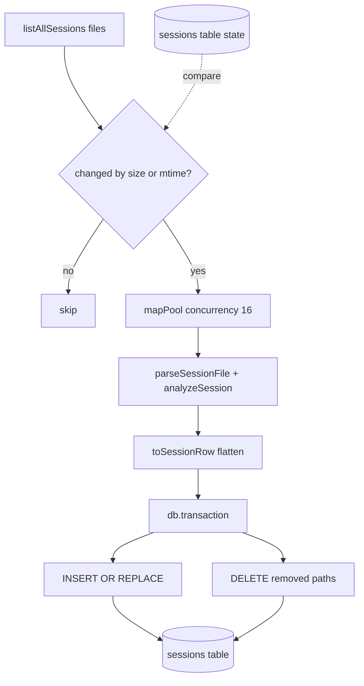

# Index & Portfolio Analytics

> Indexed at commit `bf5a4c8` on 2026-07-12 · [view on GitHub](https://github.com/yorch/cc-analyzer/tree/bf5a4c8)

## Relevant source files

- [src/core/db.ts](https://github.com/yorch/cc-analyzer/blob/bf5a4c8/src/core/db.ts)
- [src/core/indexer.ts](https://github.com/yorch/cc-analyzer/blob/bf5a4c8/src/core/indexer.ts)
- [src/core/queries.ts](https://github.com/yorch/cc-analyzer/blob/bf5a4c8/src/core/queries.ts)
- [src/core/stats.ts](https://github.com/yorch/cc-analyzer/blob/bf5a4c8/src/core/stats.ts)

## Overview

The index layer turns a directory of JSON Lines (JSONL) session files into a queryable SQLite cache. A single `sessions` table flattens each analyzed session into columns plus JSON blobs, and the index is treated as disposable: it can be deleted and rebuilt from the source files at any time ([src/core/db.ts#L54-L57](https://github.com/yorch/cc-analyzer/blob/bf5a4c8/src/core/db.ts#L54-L57)). Building on top of that table, a set of read helpers and aggregate queries power the `stats` command and the terminal and web dashboards without ever re-parsing the raw files.

This layer owns three concerns: opening and migrating the database ([src/core/db.ts](https://github.com/yorch/cc-analyzer/blob/bf5a4c8/src/core/db.ts)), incrementally ingesting session files into it ([src/core/indexer.ts](https://github.com/yorch/cc-analyzer/blob/bf5a4c8/src/core/indexer.ts)), and serving list, search, and portfolio-analytics reads back out ([src/core/queries.ts](https://github.com/yorch/cc-analyzer/blob/bf5a4c8/src/core/queries.ts), [src/core/stats.ts](https://github.com/yorch/cc-analyzer/blob/bf5a4c8/src/core/stats.ts)).

## Implementation

### Database schema and migration

`openDb` opens a `bun:sqlite` database at the configured index path, creating the state directory first ([src/core/db.ts#L58-L60](https://github.com/yorch/cc-analyzer/blob/bf5a4c8/src/core/db.ts#L58-L60)). It enables Write-Ahead Logging (WAL) with `PRAGMA journal_mode = WAL` and relaxes durability with `PRAGMA synchronous = NORMAL`, both appropriate for a rebuildable cache ([src/core/db.ts#L61-L62](https://github.com/yorch/cc-analyzer/blob/bf5a4c8/src/core/db.ts#L61-L62)). It then applies the `SCHEMA` string, which is idempotent: every statement uses `CREATE TABLE IF NOT EXISTS` or `CREATE INDEX IF NOT EXISTS` ([src/core/db.ts#L5-L50](https://github.com/yorch/cc-analyzer/blob/bf5a4c8/src/core/db.ts#L5-L50)).

The schema defines two tables. A `meta` key/value table holds the `schema_version` marker, and the `sessions` table keyed by file `path` carries the flattened session ([src/core/db.ts#L6-L45](https://github.com/yorch/cc-analyzer/blob/bf5a4c8/src/core/db.ts#L6-L45)). Token counts, per-bucket costs, and activity totals are stored as scalar columns, while `models_json`, `tools_json`, `skills_json`, and `subagents_json` hold serialized structures ([src/core/db.ts#L26-L41](https://github.com/yorch/cc-analyzer/blob/bf5a4c8/src/core/db.ts#L26-L41)). Three secondary indexes cover the common group-by keys — `project_id`, `month`, and `day` ([src/core/db.ts#L47-L49](https://github.com/yorch/cc-analyzer/blob/bf5a4c8/src/core/db.ts#L47-L49)). After applying the schema, `openDb` reads the stored `schema_version` and writes the current `SCHEMA_VERSION` (`"1"`) when it differs ([src/core/db.ts#L52](https://github.com/yorch/cc-analyzer/blob/bf5a4c8/src/core/db.ts#L52), [src/core/db.ts#L64-L71](https://github.com/yorch/cc-analyzer/blob/bf5a4c8/src/core/db.ts#L64-L71)).

Sources: [src/core/db.ts:L1-L73](https://github.com/yorch/cc-analyzer/blob/bf5a4c8/src/core/db.ts#L1-L73)

### Incremental reindexing

`reindex` rebuilds the index without re-parsing files that have not changed ([src/core/indexer.ts#L167-L171](https://github.com/yorch/cc-analyzer/blob/bf5a4c8/src/core/indexer.ts#L167-L171)). It lists every session file on disk, loads the previously recorded `mtime_ms` and `size_bytes` per path from the `sessions` table, and selects only files whose modification time or size differs — or that have no existing row ([src/core/indexer.ts#L176-L192](https://github.com/yorch/cc-analyzer/blob/bf5a4c8/src/core/indexer.ts#L176-L192)). Passing `rebuild: true` skips the existing-state load so every file is re-ingested ([src/core/indexer.ts#L180-L187](https://github.com/yorch/cc-analyzer/blob/bf5a4c8/src/core/indexer.ts#L180-L187)).

Changed files are parsed and analyzed concurrently through `mapPool`, a bounded worker pool that runs up to `concurrency` async mappers (default `16`) over the work list ([src/core/indexer.ts#L136-L149](https://github.com/yorch/cc-analyzer/blob/bf5a4c8/src/core/indexer.ts#L136-L149), [src/core/indexer.ts#L172](https://github.com/yorch/cc-analyzer/blob/bf5a4c8/src/core/indexer.ts#L172)). Each mapper calls `parseSessionFile` then `analyzeSession`, converts the result with `toSessionRow`, and reports progress; a parse failure returns `null` rather than aborting the whole run ([src/core/indexer.ts#L195-L206](https://github.com/yorch/cc-analyzer/blob/bf5a4c8/src/core/indexer.ts#L195-L206)). Pricing is resolved once up front, either from the caller or via `loadPricing`, and shared across all mappers ([src/core/indexer.ts#L173](https://github.com/yorch/cc-analyzer/blob/bf5a4c8/src/core/indexer.ts#L173)).

All writes happen inside a single `db.transaction`. Non-null rows are upserted with `INSERT OR REPLACE INTO sessions`, and — unless rebuilding — rows whose paths no longer exist on disk are pruned with `DELETE FROM sessions WHERE path = ?` ([src/core/indexer.ts#L208-L225](https://github.com/yorch/cc-analyzer/blob/bf5a4c8/src/core/indexer.ts#L208-L225)). The function returns counts of total, indexed, skipped, and deleted files ([src/core/indexer.ts#L151-L156](https://github.com/yorch/cc-analyzer/blob/bf5a4c8/src/core/indexer.ts#L151-L156), [src/core/indexer.ts#L227-L233](https://github.com/yorch/cc-analyzer/blob/bf5a4c8/src/core/indexer.ts#L227-L233)).

The upsert deliberately uses positional `?` placeholders. `COLUMNS` defines a fixed column order, `upsertStatement` builds one `?` per column, and `rowValues` maps each row to values in that same order ([src/core/indexer.ts#L90-L134](https://github.com/yorch/cc-analyzer/blob/bf5a4c8/src/core/indexer.ts#L90-L134)). `toSessionRow` performs the flattening itself, projecting `analysis.totals`, token buckets, and cost buckets onto scalar columns and serializing `models`, `tools`, `skills`, and `subagents` with `JSON.stringify`; the boolean `estimated` flag is stored as `1` or `0` ([src/core/indexer.ts#L45-L88](https://github.com/yorch/cc-analyzer/blob/bf5a4c8/src/core/indexer.ts#L45-L88)).

Sources: [src/core/indexer.ts:L45-L234](https://github.com/yorch/cc-analyzer/blob/bf5a4c8/src/core/indexer.ts#L45-L234)

### Read helpers

`queries.ts` exposes typed reads for the terminal and web front ends. `listIndexedProjects` rolls sessions up by `project_id`, summing cost and tokens and taking `MAX(mtime_ms)` as last activity ([src/core/queries.ts#L59-L75](https://github.com/yorch/cc-analyzer/blob/bf5a4c8/src/core/queries.ts#L59-L75)), while `listIndexedSessions` returns a project's sessions ordered by recency ([src/core/queries.ts#L78-L99](https://github.com/yorch/cc-analyzer/blob/bf5a4c8/src/core/queries.ts#L78-L99)). `listAllSessions` and `searchSessions` serve cross-project listings, the latter matching a `LIKE` pattern against title, session id, and project path ([src/core/queries.ts#L126-L144](https://github.com/yorch/cc-analyzer/blob/bf5a4c8/src/core/queries.ts#L126-L144)). Two shared SQL fragments, `IO_TOKENS` and `CACHE_TOKENS`, keep the token math consistent across every query ([src/core/queries.ts#L3-L5](https://github.com/yorch/cc-analyzer/blob/bf5a4c8/src/core/queries.ts#L3-L5)). Because SQLite stores the estimated flag as an integer, each helper maps `costEstimated` back to a boolean on read ([src/core/queries.ts#L52-L56](https://github.com/yorch/cc-analyzer/blob/bf5a4c8/src/core/queries.ts#L52-L56), [src/core/queries.ts#L98](https://github.com/yorch/cc-analyzer/blob/bf5a4c8/src/core/queries.ts#L98)). Lookup helpers `indexedSessionById` and `sessionPathById` resolve a single session for drill-in, and `isIndexEmpty` gates whether a reindex is needed ([src/core/queries.ts#L101-L157](https://github.com/yorch/cc-analyzer/blob/bf5a4c8/src/core/queries.ts#L101-L157)).

Sources: [src/core/queries.ts:L1-L157](https://github.com/yorch/cc-analyzer/blob/bf5a4c8/src/core/queries.ts#L1-L157)

### Portfolio analytics

`stats.ts` provides the aggregate queries behind the `stats` command and the dashboards. `portfolioSummary` computes totals across all sessions in one query — session and distinct-project counts, total cost, input/output and cache token sums, and the first and last active day — deriving `estimatedShare` from `SUM(cost_total * cost_estimated) / SUM(cost_total)` ([src/core/stats.ts#L54-L94](https://github.com/yorch/cc-analyzer/blob/bf5a4c8/src/core/stats.ts#L54-L94)). `spendByMonth` groups by the `month` column, `spendByProject` groups by `project_id` ordered by cost with a default limit of `20`, and `topSessions` ranks individual sessions by `cost_total` ([src/core/stats.ts#L96-L138](https://github.com/yorch/cc-analyzer/blob/bf5a4c8/src/core/stats.ts#L96-L138)).

`spendByModel` is the one aggregate that cannot be expressed in SQL, because per-model usage lives inside the `models_json` blob. It reads every `models_json` value, parses each with a `try`/`catch` guard, and folds the per-model `apiCalls`, `cost.total`, and token buckets into a `Map`, returning the totals sorted by descending cost ([src/core/stats.ts#L148-L182](https://github.com/yorch/cc-analyzer/blob/bf5a4c8/src/core/stats.ts#L148-L182)).

Sources: [src/core/stats.ts:L54-L182](https://github.com/yorch/cc-analyzer/blob/bf5a4c8/src/core/stats.ts#L54-L182)

## Diagram

The reindex pipeline diffs on-disk files against recorded `size_bytes` and `mtime_ms`, parses and analyzes only the changed files through the bounded pool, and commits both upserts and deletions in one transaction ([src/core/indexer.ts#L176-L225](https://github.com/yorch/cc-analyzer/blob/bf5a4c8/src/core/indexer.ts#L176-L225)).

## Related Pages

- Parent: [Core Analysis Engine](./2-core-analysis-engine.md)
- Sibling: [Session Parsing & Events](./2.1-session-parsing-and-events.md)
- Sibling: [Cost & Pricing](./2.2-cost-and-pricing.md)
- Sibling: [Per-Turn Steps](./2.4-per-turn-steps.md)
