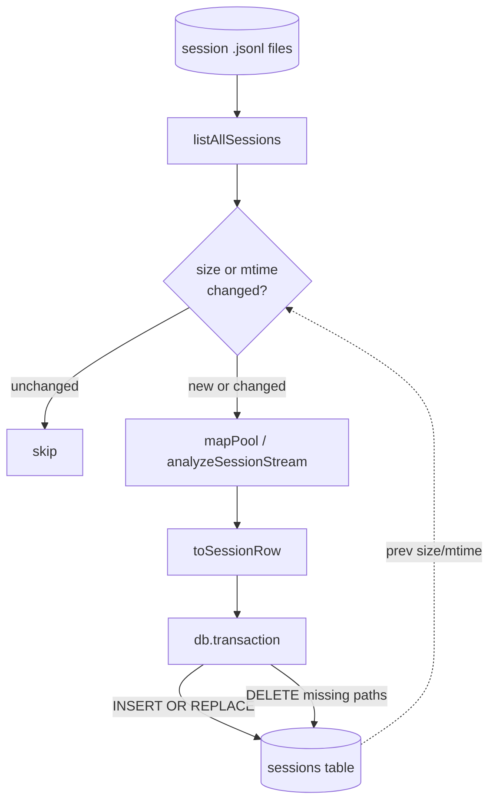

# Index & Aggregation

> Indexed at commit `51ccd4e` on 2026-07-23 · [view on GitHub](https://github.com/yorch/cc-analyzer/tree/51ccd4e)

## Relevant source files

- [src/core/db.ts](https://github.com/yorch/cc-analyzer/blob/51ccd4e/src/core/db.ts)
- [src/core/indexer.ts](https://github.com/yorch/cc-analyzer/blob/51ccd4e/src/core/indexer.ts)
- [src/core/queries.ts](https://github.com/yorch/cc-analyzer/blob/51ccd4e/src/core/queries.ts)
- [src/core/stats.ts](https://github.com/yorch/cc-analyzer/blob/51ccd4e/src/core/stats.ts)

## Overview

The index is a disposable SQLite cache that flattens each analyzed session into a single row so the terminal UI (TUI), the `stats` command, and the `serve` web API can query aggregates without re-parsing JavaScript Object Notation Lines (JSONL) transcripts. Four modules own this layer: [src/core/db.ts](https://github.com/yorch/cc-analyzer/blob/51ccd4e/src/core/db.ts) opens and migrates the database, [src/core/indexer.ts](https://github.com/yorch/cc-analyzer/blob/51ccd4e/src/core/indexer.ts) rebuilds it incrementally, and [src/core/queries.ts](https://github.com/yorch/cc-analyzer/blob/51ccd4e/src/core/queries.ts) plus [src/core/stats.ts](https://github.com/yorch/cc-analyzer/blob/51ccd4e/src/core/stats.ts) read it back. This page covers the storage schema and the foundational aggregation mechanics; the derived insight products, trend series, and cross-frontend chart rendering built on top of these rollups live in [Analytics & Insights](./7-analytics-and-insights.md).

## Implementation

### Schema and migration

`openDb()` opens a `bun:sqlite` `Database` at `~/.config/cc-analyzer/index.db`, creating the state directory first, then sets Write-Ahead Logging (WAL) journaling and `synchronous = NORMAL` for fast bulk writes ([src/core/db.ts#L88-L109](https://github.com/yorch/cc-analyzer/blob/51ccd4e/src/core/db.ts#L88-L109)). Before applying the main schema it creates a `meta` key/value table and reads `schema_version` from it ([src/core/db.ts#L7-L10](https://github.com/yorch/cc-analyzer/blob/51ccd4e/src/core/db.ts#L7-L10)). The current version constant is `"7"` ([src/core/db.ts#L82](https://github.com/yorch/cc-analyzer/blob/51ccd4e/src/core/db.ts#L82)). When the stored version does not match, `openDb()` drops the `sessions` table and rewrites the version marker, so a schema bump simply rebuilds the cache rather than running column migrations ([src/core/db.ts#L99-L106](https://github.com/yorch/cc-analyzer/blob/51ccd4e/src/core/db.ts#L99-L106)).

The `sessions` table keys rows by file `path` and mixes scalar columns for cheap `SUM`/`GROUP BY` aggregation with JSON blob columns for per-session detail that would explode into too many columns ([src/core/db.ts#L12-L65](https://github.com/yorch/cc-analyzer/blob/51ccd4e/src/core/db.ts#L12-L65)). Scalars cover token counts, the four cost categories, durations, and counts like `turns`, `retries`, and `compactions`; blobs hold `models_json`, `tools_json`, `skills_json`, `subagents_json`, `turn_depths_json`, and `compactions_json`, among others. Four secondary indexes on `project_id`, `month`, `day`, and `session_id` back the common lookups ([src/core/db.ts#L67-L70](https://github.com/yorch/cc-analyzer/blob/51ccd4e/src/core/db.ts#L67-L70)). Schema `v7` added the `compactions` count column and the `compactions_json` detail blob; the count records only the session's own main-chain compactions, excluding subagent and inherited-continuation boundaries so one compaction never counts in two rows ([src/core/db.ts#L78-L82](https://github.com/yorch/cc-analyzer/blob/51ccd4e/src/core/db.ts#L78-L82)).

Sources: [src/core/db.ts:L1-L109](https://github.com/yorch/cc-analyzer/blob/51ccd4e/src/core/db.ts#L1-L109)

### Incremental reindex

`reindex()` drives the rebuild. It lists every session file, then loads the existing `(path, mtime_ms, size_bytes)` triples already in the table into a `Map` ([src/core/indexer.ts#L238-L254](https://github.com/yorch/cc-analyzer/blob/51ccd4e/src/core/indexer.ts#L238-L254)). A file is re-ingested only when it is new or its size or modification time changed since the last index; unchanged files are skipped, which makes reindexing cheap after the first full scan ([src/core/indexer.ts#L257-L262](https://github.com/yorch/cc-analyzer/blob/51ccd4e/src/core/indexer.ts#L257-L262)). The `rebuild` option forces every file back through analysis while still pruning deletions. Ingestion runs through `mapPool`, a bounded-concurrency worker pool defaulting to 16, and each worker streams events and calls `analyzeSessionStream` with `detail: false` so a huge session never materializes its full per-turn timeline in memory — the index stores only aggregates ([src/core/indexer.ts#L204-L216](https://github.com/yorch/cc-analyzer/blob/51ccd4e/src/core/indexer.ts#L204-L216) [src/core/indexer.ts#L265-L279](https://github.com/yorch/cc-analyzer/blob/51ccd4e/src/core/indexer.ts#L265-L279)).

`toSessionRow()` flattens the resulting `SessionAnalysis` into a `SessionRow`, serializing each detail structure with `JSON.stringify` and reducing the compaction list to the own-main-chain count for the scalar column ([src/core/indexer.ts#L75-L137](https://github.com/yorch/cc-analyzer/blob/51ccd4e/src/core/indexer.ts#L75-L137)). Writes use `INSERT OR REPLACE INTO sessions` with **positional `?` placeholders** built from a fixed `COLUMNS` array; `rowValues()` maps the same array over the row so the value order can never drift from the placeholder order ([src/core/indexer.ts#L139-L201](https://github.com/yorch/cc-analyzer/blob/51ccd4e/src/core/indexer.ts#L139-L201)). All upserts and the pruning `DELETE` for paths no longer on disk run inside a single `db.transaction`, and `reindex()` returns a `ReindexResult` counting total, indexed, skipped, and deleted files ([src/core/indexer.ts#L281-L305](https://github.com/yorch/cc-analyzer/blob/51ccd4e/src/core/indexer.ts#L281-L305)).

Sources: [src/core/indexer.ts:L238-L305](https://github.com/yorch/cc-analyzer/blob/51ccd4e/src/core/indexer.ts#L238-L305) [src/core/indexer.ts:L75-L201](https://github.com/yorch/cc-analyzer/blob/51ccd4e/src/core/indexer.ts#L75-L201)

### Read helpers and rollups

[src/core/queries.ts](https://github.com/yorch/cc-analyzer/blob/51ccd4e/src/core/queries.ts) holds the direct read helpers the frontends bind to. `listIndexedProjects()` groups sessions by `project_id` with `SUM` of cost and tokens and `COALESCE(SUM(compactions), 0)` for the per-project compaction count ([src/core/queries.ts#L61-L78](https://github.com/yorch/cc-analyzer/blob/51ccd4e/src/core/queries.ts#L61-L78)). `listIndexedSessions()`, `listAllSessions()`, and `searchSessions()` return session rows ordered by `mtime_ms`; search escapes `LIKE` wildcards so user input matches literally against title, session id, and project path ([src/core/queries.ts#L136-L150](https://github.com/yorch/cc-analyzer/blob/51ccd4e/src/core/queries.ts#L136-L150)). These helpers alias index columns to camelCase result fields through the shared `SESSION_COLUMNS` fragment ([src/core/queries.ts#L40-L52](https://github.com/yorch/cc-analyzer/blob/51ccd4e/src/core/queries.ts#L40-L52)).

The heavier aggregation lives in [src/core/stats.ts](https://github.com/yorch/cc-analyzer/blob/51ccd4e/src/core/stats.ts). Scalar-column rollups such as `portfolioSummary()`, `spendByMonth()`, and `spendByProject()` push work into SQL with `GROUP BY`. The JSON-blob rollups fold in application code: `spendByModel()` parses `models_json` per row and sums into a `Map` ([src/core/stats.ts#L162-L195](https://github.com/yorch/cc-analyzer/blob/51ccd4e/src/core/stats.ts#L162-L195)). The central optimization is `analyticsRollup()`, which reads every session's JSON columns in **one table scan** and folds tools, skills, subagents, bash families, test runs, retries, permission modes, stop reasons, turn depth, versions, and branches simultaneously ([src/core/stats.ts#L990-L1021](https://github.com/yorch/cc-analyzer/blob/51ccd4e/src/core/stats.ts#L990-L1021)). Scanning once per metric would multiply full-table JSON parsing by the metric count; bash-family and test-runner classification happen here at query time, so those heuristics can change without a reindex ([src/core/stats.ts#L1085-L1186](https://github.com/yorch/cc-analyzer/blob/51ccd4e/src/core/stats.ts#L1085-L1186)). Shared fold helpers like `addToolRow` and `addDepthRow` are reused by the standalone per-project slices so the portfolio view and project pages can never disagree on error rates or bucket boundaries ([src/core/stats.ts#L673-L704](https://github.com/yorch/cc-analyzer/blob/51ccd4e/src/core/stats.ts#L673-L704)).

`compactionUsage()` deduplicates compactions when rolling up: it reads `compactions_json` per session and runs each list through `summarizeCompactions`, counting only the `own` split — compactions that are neither subagent nor inherited — so the same compaction can't be counted twice across sessions that share a continuation boundary ([src/core/stats.ts#L791-L835](https://github.com/yorch/cc-analyzer/blob/51ccd4e/src/core/stats.ts#L791-L835)). `projectTrends()` bundles the per-project daily, model-mix, scatter, distribution, turn-depth, and tool slices, and `buildPortfolioStats()` assembles the shared portfolio shape behind both `cc-analyzer stats` and the web `/api/stats` route in exactly one place ([src/core/stats.ts#L773-L782](https://github.com/yorch/cc-analyzer/blob/51ccd4e/src/core/stats.ts#L773-L782) [src/core/stats.ts#L1261-L1279](https://github.com/yorch/cc-analyzer/blob/51ccd4e/src/core/stats.ts#L1261-L1279)).

Sources: [src/core/queries.ts:L61-L163](https://github.com/yorch/cc-analyzer/blob/51ccd4e/src/core/queries.ts#L61-L163) [src/core/stats.ts:L990-L1254](https://github.com/yorch/cc-analyzer/blob/51ccd4e/src/core/stats.ts#L990-L1254) [src/core/stats.ts:L791-L835](https://github.com/yorch/cc-analyzer/blob/51ccd4e/src/core/stats.ts#L791-L835)

## Diagram

The incremental reindex compares each on-disk file against the stored `size_bytes` and `mtime_ms`, re-analyzes only changed or new files through the concurrency pool, and applies all upserts plus deletions of vanished paths inside one transaction.

## Related Pages

- Parent: [Core Analysis Engine](./2-core-analysis-engine.md)
- Sibling: [Session Parsing & Events](./2.1-session-parsing-and-events.md)
- Sibling: [Cost & Pricing](./2.2-cost-and-pricing.md)
- Sibling: [Per-Turn Steps](./2.4-per-turn-steps.md)
- See also: [Analytics & Insights](./7-analytics-and-insights.md)
