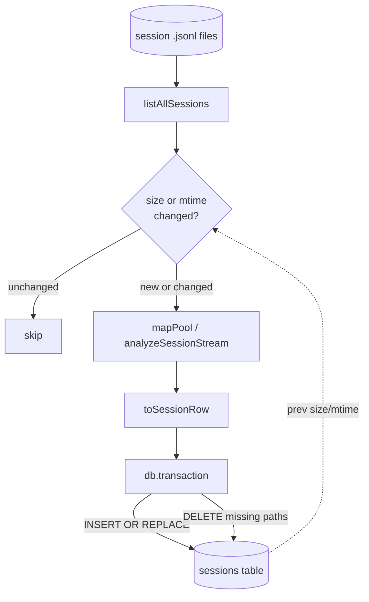

# Index & Aggregation

> Indexed at commit `51ccd4e` on 2026-07-23 · [view on GitHub](https://github.com/yorch/cc-analyzer/tree/51ccd4e)

## Relevant source files

- [src/core/db.ts](https://github.com/yorch/cc-analyzer/blob/51ccd4e/src/core/db.ts)
- [src/core/indexer.ts](https://github.com/yorch/cc-analyzer/blob/51ccd4e/src/core/indexer.ts)
- [src/core/queries.ts](https://github.com/yorch/cc-analyzer/blob/51ccd4e/src/core/queries.ts)
- [src/core/stats.ts](https://github.com/yorch/cc-analyzer/blob/51ccd4e/src/core/stats.ts)

## Overview

The index is a disposable SQLite cache that flattens each analyzed session into a single row so the terminal UI (TUI), the `stats` command, and the `serve` web API can query aggregates without re-parsing JavaScript Object Notation Lines (JSONL) transcripts. Four modules own this layer: [src/core/db.ts](https://github.com/yorch/cc-analyzer/blob/51ccd4e/src/core/db.ts) opens and migrates the database, [src/core/indexer.ts](https://github.com/yorch/cc-analyzer/blob/51ccd4e/src/core/indexer.ts) rebuilds it incrementally, and [src/core/queries.ts](https://github.com/yorch/cc-analyzer/blob/51ccd4e/src/core/queries.ts) plus [src/core/stats.ts](https://github.com/yorch/cc-analyzer/blob/51ccd4e/src/core/stats.ts) read it back. This page covers the storage schema and the foundational aggregation mechanics; the derived insight products, trend series, and cross-frontend chart rendering built on top of these rollups live in [Analytics & Insights](./7-analytics-and-insights.md).

## Implementation

### Schema and migration

`openDb()` opens a `bun:sqlite` `Database` at `~/.config/cc-analyzer/index.db`, creating the state directory first, then sets Write-Ahead Logging (WAL) journaling and `synchronous = NORMAL` for fast bulk writes ([src/core/db.ts#L88-L109](https://github.com/yorch/cc-analyzer/blob/51ccd4e/src/core/db.ts#L88-L109)). Before applying the main schema it creates a `meta` key/value table and reads `schema_version` from it ([src/core/db.ts#L7-L10](https://github.com/yorch/cc-analyzer/blob/51ccd4e/src/core/db.ts#L7-L10)). The current version constant is `"16"` ([src/core/db.ts#L163](https://github.com/yorch/cc-analyzer/blob/51ccd4e/src/core/db.ts#L163)). A schema bump also drops the `usage_keys` table (below), so the cross-file de-dup state rebuilds alongside the rows it protects ([src/core/db.ts#L184](https://github.com/yorch/cc-analyzer/blob/51ccd4e/src/core/db.ts#L184)). When the stored version does not match, `openDb()` drops the `sessions` table and rewrites the version marker, so a schema bump simply rebuilds the cache rather than running column migrations ([src/core/db.ts#L99-L106](https://github.com/yorch/cc-analyzer/blob/51ccd4e/src/core/db.ts#L99-L106)).

The `sessions` table keys rows by file `path` and mixes scalar columns for cheap `SUM`/`GROUP BY` aggregation with JSON blob columns for per-session detail that would explode into too many columns ([src/core/db.ts#L12-L65](https://github.com/yorch/cc-analyzer/blob/51ccd4e/src/core/db.ts#L12-L65)). Scalars cover token counts, the four cost categories, durations, and counts like `turns`, `retries`, and `compactions`; blobs hold `models_json`, `tools_json`, `skills_json`, `skill_turn_costs_json`, `subagents_json`, `turn_depths_json`, and `compactions_json`, among others. Five secondary indexes on `project_id`, `claude_dir`, `month`, `day`, and `session_id` back the common lookups ([src/core/db.ts#L67-L70](https://github.com/yorch/cc-analyzer/blob/51ccd4e/src/core/db.ts#L67-L70)). Schema `v7` added the `compactions` count column and the `compactions_json` detail blob; the count records only the session's own main-chain compactions, excluding subagent and inherited-continuation boundaries so one compaction never counts in two rows ([src/core/db.ts#L78-L82](https://github.com/yorch/cc-analyzer/blob/51ccd4e/src/core/db.ts#L78-L82)). Schema `v8` backfilled the boundary `uuid` into `compactions_json` so portfolio rollups can dedupe on it. Schema `v9` added `first_prompt_tokens`, the context-tax baseline: the prompt-side tokens (input + cache-read + both cache-write TTLs) of a session's **first main-chain API call**, `NULL` when the session never reached the model. Schema `v10` added `skill_turn_costs_json`, the per-skill **turn-scoped** cost attribution: for each skill the session invoked, how many of its turns invoked it and the total cost of those turns (every API call in them, subagent bursts included). Schema `v11` added the three parse-coverage columns — `parse_lines`, `parse_errors`, `unknown_events` — recording how much of each JSONL file this build of the parser actually understood; unlike `first_prompt_tokens` these are `0`, not `NULL`, when empty, because a file with no lines genuinely has none. Schema `v12` added the thrash columns — `test_fail_streak` (the longest run of consecutive failing test runs on one chain, the edit→test→fail loop signal), `redundant_reads` (`Read` invocations beyond the second of the same file on one chain), and `reread_files_json` (the files read ≥ 3 times, most re-read first, capped at 20). Schema `v13` added the correction columns — `correction_turns` (real prompts opening with a correction marker, per the English-only `isCorrectionPrompt` heuristic in `events.ts`) and `interruption_turns` (turns carrying the machine-written `[Request interrupted by user…]` marker, counted once per turn, main chain only). Note the `isTestCommand`-style trade-off made the other way here: the marker phrase list is baked in at index time, so evolving it requires a reindex — a pinning test over the exported `CORRECTION_PATTERN_SOURCE` fails on any edit to that list and instructs the `SCHEMA_VERSION` bump, so the two heuristics can never quietly coexist in one table. Schema `v14` added `claude_dir`, the Claude data directory a session was discovered under, now that more than one can be configured. It scopes the indexer's prune rather than any aggregate: rows whose root is no longer configured are dropped (so removing a directory removes its data), while rows under a configured root that could not be read this scan are **retained**, so an unmounted volume never silently wipes a portfolio. Project ids are made globally unique at index time instead, which is why no aggregate query needs a root clause. Schema `v15` re-keyed every project id to qualify it by root **uniformly** (`<rootSlug>~<name>`), including the primary root's — previously the first-resolved root's ids were left bare, so a project's identity depended on which root sorted first and silently changed if the configured root list was reordered. Schema `v16` changed cost accounting three ways at once, all baked into indexed rows: (1) a new `usage_keys` table claims each counted API call's stable identity (its `message.id`) for the file that first counted it, so a continuation or copied session file no longer double-counts the parent's spend in portfolio rollups (see below); (2) long-context calls (prompt-side tokens over 200K) now price at the tiered `above200k` rates; (3) a zero-token call (a `<synthetic>` error stub) can no longer flip `cost_estimated` for the whole session. All of these bumps exist for the same reason — the incremental indexer skips unchanged files, so without a version change existing rows would keep the old (or missing) value forever; the bump forces the rebuild that fills them.

Sources: [src/core/db.ts:L1-L109](https://github.com/yorch/cc-analyzer/blob/51ccd4e/src/core/db.ts#L1-L109)

### Incremental reindex

`reindex()` drives the rebuild. It lists every session file, then loads the existing `(path, mtime_ms, size_bytes)` triples already in the table into a `Map` ([src/core/indexer.ts#L238-L254](https://github.com/yorch/cc-analyzer/blob/51ccd4e/src/core/indexer.ts#L238-L254)). A file is re-ingested only when it is new or its size or modification time changed since the last index; unchanged files are skipped, which makes reindexing cheap after the first full scan ([src/core/indexer.ts#L257-L262](https://github.com/yorch/cc-analyzer/blob/51ccd4e/src/core/indexer.ts#L257-L262)). The `rebuild` option forces every file back through analysis while still pruning deletions. Ingestion runs through `mapPool`, a bounded-concurrency worker pool defaulting to 16, and each worker streams events and calls `analyzeSessionStream` with `detail: false` so a huge session never materializes its full per-turn timeline in memory — the index stores only aggregates ([src/core/indexer.ts#L204-L216](https://github.com/yorch/cc-analyzer/blob/51ccd4e/src/core/indexer.ts#L204-L216) [src/core/indexer.ts#L265-L279](https://github.com/yorch/cc-analyzer/blob/51ccd4e/src/core/indexer.ts#L265-L279)).

After all upserts and deletions commit successfully, the indexer persists
`last_scan_at` in the `meta` table. `inspectIndexStatus()` uses the same
path/size/mtime identity to count added, changed, and deleted files without
opening or parsing session contents. This exact, cheap check powers
`index --check`, the `stats` metadata, TUI and server warnings, and the web
`/api/index-status` response. Empty indexes are bootstrapped by the TUI and
`serve`; populated indexes refresh only on `cc-analyzer index` or
`serve --refresh`.

`toSessionRow()` flattens the resulting `SessionAnalysis` into a `SessionRow`, serializing each detail structure with `JSON.stringify` and reducing the compaction list to the own-main-chain count for the scalar column ([src/core/indexer.ts#L75-L137](https://github.com/yorch/cc-analyzer/blob/51ccd4e/src/core/indexer.ts#L75-L137)). Writes use `INSERT OR REPLACE INTO sessions` with **positional `?` placeholders** built from a fixed `COLUMNS` array; `rowValues()` maps the same array over the row so the value order can never drift from the placeholder order ([src/core/indexer.ts#L139-L201](https://github.com/yorch/cc-analyzer/blob/51ccd4e/src/core/indexer.ts#L139-L201)). All upserts and the pruning `DELETE` for paths no longer on disk run inside a single `db.transaction`, and `reindex()` returns a `ReindexResult` counting total, indexed, skipped, and deleted files ([src/core/indexer.ts#L281-L305](https://github.com/yorch/cc-analyzer/blob/51ccd4e/src/core/indexer.ts#L281-L305)).

Sources: [src/core/indexer.ts:L238-L305](https://github.com/yorch/cc-analyzer/blob/51ccd4e/src/core/indexer.ts#L238-L305) [src/core/indexer.ts:L75-L201](https://github.com/yorch/cc-analyzer/blob/51ccd4e/src/core/indexer.ts#L75-L201)

### Cross-file usage de-dup

Continuation and copied session files repeat their parent's assistant entries verbatim, down to the same `message.id` — without correction, every portfolio rollup counted that spend twice. The indexer now tracks each counted API call's identity in a `usage_keys` table (`key`, `path`), and `reindex()` claims a key for the file that first counts it: `analyzeSessionStream` is handed a `claimUsage(key)` callback, and when the callback refuses a call's identity — another indexed file already claimed it — `SessionAnalyzer` skips that call's usage, cost, and API-call count exactly like a duplicate streamed continuation line, while tool activity and turn counts are unaffected ([src/core/indexer.ts#L325-L363](https://github.com/yorch/cc-analyzer/blob/51ccd4e/src/core/indexer.ts#L325-L363)).

Claims are resolved in two layers: `runClaims`, a `Map` scoped to this scan (so files analyzed concurrently in the same run can't both count one call), then the `usage_keys` table for claims from prior runs. Files are re-ingested **oldest-first** by `mtime`, so when a continuation file and its parent land in the same scan, the parent claims the shared calls and the copied spend attributes to the session that actually ran it — a matter of attribution, not correctness, since either order counts each call once ([src/core/indexer.ts#L319-L345](https://github.com/yorch/cc-analyzer/blob/51ccd4e/src/core/indexer.ts#L319-L345)). A re-analyzed file's claims are replaced wholesale by its new run's claims; a file whose analysis failed keeps both its old row and its old claims. `cc-analyzer index --rebuild` clears `usage_keys` first, so a full rebuild reclaims and reattributes everything from scratch ([src/core/indexer.ts#L375-L403](https://github.com/yorch/cc-analyzer/blob/51ccd4e/src/core/indexer.ts#L375-L403)).

Four things to keep in mind when a number looks different because of this:

- **Single-session views still show the full transcript.** `cc-analyzer analyze` and the session pages parse and price the file directly, with no claim callback — only *indexed* portfolio numbers de-dup. A continuation session's indexed row can therefore show a lower cost than its own standalone `analyze` report.
- **Only billing numbers de-dup.** Tokens, cost, and API-call count are skipped for a claimed-away call; tool counts, turns, and other activity metrics are not — a continuation file's activity is still its own.
- **Deleting a file frees its claims, but survivors don't retroactively pick them up.** A deleted file's `usage_keys` rows are removed, but the surviving row that could now claim those calls keeps its already-computed (de-duped) numbers until it's re-analyzed. A full rebuild (`cc-analyzer index --rebuild`, or deleting the index file) reattributes everything cleanly.
- **A schema bump (v16) forces a one-time rebuild**, since pre-upgrade rows were indexed without any claims at all.

The first bullet is stated to users directly: the shared `INDEXED_COST_CAVEAT` (`src/core/stats-types.ts`) prints verbatim, once per portfolio surface beside the cost-framing note — CLI `stats`, the TUI portfolio lede and Trends models panel, and the web Dashboard and Insights views — so a reader who notices a continuation session's share reading lower than its standalone analysis finds the explanation on the page showing the number.

Sources: [src/core/indexer.ts:L319-L403](https://github.com/yorch/cc-analyzer/blob/51ccd4e/src/core/indexer.ts#L319-L403) [src/core/db.ts:L84-L89](https://github.com/yorch/cc-analyzer/blob/51ccd4e/src/core/db.ts#L84-L89)

### Read helpers and rollups

[src/core/queries.ts](https://github.com/yorch/cc-analyzer/blob/51ccd4e/src/core/queries.ts) holds the direct read helpers the frontends bind to. `listIndexedProjects()` groups sessions by `project_id` with `SUM` of cost and tokens and `COALESCE(SUM(compactions), 0)` for the per-project compaction count ([src/core/queries.ts#L61-L78](https://github.com/yorch/cc-analyzer/blob/51ccd4e/src/core/queries.ts#L61-L78)). `listIndexedSessions()`, `listAllSessions()`, and `searchSessions()` return session rows ordered by `mtime_ms`; search escapes `LIKE` wildcards so user input matches literally against title, session id, and project path ([src/core/queries.ts#L136-L150](https://github.com/yorch/cc-analyzer/blob/51ccd4e/src/core/queries.ts#L136-L150)). These helpers alias index columns to camelCase result fields through the shared `SESSION_COLUMNS` fragment ([src/core/queries.ts#L40-L52](https://github.com/yorch/cc-analyzer/blob/51ccd4e/src/core/queries.ts#L40-L52)).

The heavier aggregation lives in [src/core/stats.ts](https://github.com/yorch/cc-analyzer/blob/51ccd4e/src/core/stats.ts). Scalar-column rollups such as `portfolioSummary()`, `spendByMonth()`, and `spendByProject()` push work into SQL with `GROUP BY`. The JSON-blob rollups fold in application code: `modelTotals()` parses `models_json` per row and sums calls, indexed cost, and the full four-category token mix into a `Map`, which both `spendByModel()` and `whatIfRepricing()` consume so the two can never disagree about a model's mix ([src/core/stats.ts#L162-L195](https://github.com/yorch/cc-analyzer/blob/51ccd4e/src/core/stats.ts#L162-L195)). The central optimization is `analyticsRollup()`, which reads every session's JSON columns in **one table scan** and folds tools, skills, subagents, bash families, test runs, retries, permission modes, stop reasons, turn depth, versions, and branches simultaneously ([src/core/stats.ts#L990-L1021](https://github.com/yorch/cc-analyzer/blob/51ccd4e/src/core/stats.ts#L990-L1021)). Scanning once per metric would multiply full-table JSON parsing by the metric count; bash-family and test-runner classification happen here at query time, so those heuristics can change without a reindex ([src/core/stats.ts#L1085-L1186](https://github.com/yorch/cc-analyzer/blob/51ccd4e/src/core/stats.ts#L1085-L1186)). Shared fold helpers like `addToolRow` and `addDepthRow` are reused by the standalone per-project slices so the portfolio view and project pages can never disagree on error rates or bucket boundaries ([src/core/stats.ts#L673-L704](https://github.com/yorch/cc-analyzer/blob/51ccd4e/src/core/stats.ts#L673-L704)).

`compactionUsage()` deduplicates compactions when rolling up: it reads `compactions_json` per session and runs each list through `summarizeCompactions`, counting only the `own` split — compactions that are neither subagent nor inherited — so the same compaction can't be counted twice across sessions that share a continuation boundary ([src/core/stats.ts#L791-L835](https://github.com/yorch/cc-analyzer/blob/51ccd4e/src/core/stats.ts#L791-L835)). `projectTrends()` bundles the per-project daily, model-mix, scatter, distribution, turn-depth, and tool slices, and `buildPortfolioStats()` assembles the shared portfolio shape behind both `cc-analyzer stats` and the web `/api/stats` route in exactly one place ([src/core/stats.ts#L773-L782](https://github.com/yorch/cc-analyzer/blob/51ccd4e/src/core/stats.ts#L773-L782) [src/core/stats.ts#L1261-L1279](https://github.com/yorch/cc-analyzer/blob/51ccd4e/src/core/stats.ts#L1261-L1279)).

Sources: [src/core/queries.ts:L61-L163](https://github.com/yorch/cc-analyzer/blob/51ccd4e/src/core/queries.ts#L61-L163) [src/core/stats.ts:L990-L1254](https://github.com/yorch/cc-analyzer/blob/51ccd4e/src/core/stats.ts#L990-L1254) [src/core/stats.ts:L791-L835](https://github.com/yorch/cc-analyzer/blob/51ccd4e/src/core/stats.ts#L791-L835)

## Diagram

```mermaid
flowchart TD
    Files[(session .jsonl files)] --> List[listAllSessions]
    List --> Filter{size or mtime<br/>changed?}
    Existing[(sessions table)] -.prev size/mtime.-> Filter
    Filter -- unchanged --> Skip[skip]
    Filter -- new or changed --> Pool[mapPool / analyzeSessionStream]
    Pool --> Row[toSessionRow]
    Row --> Txn[db.transaction]
    Txn -- INSERT OR REPLACE --> Existing
    Txn -- DELETE missing paths --> Existing
```

The incremental reindex compares each on-disk file against the stored `size_bytes` and `mtime_ms`, re-analyzes only changed or new files through the concurrency pool, and applies all upserts plus deletions of vanished paths inside one transaction. Not pictured: `analyzeSessionStream` also claims each counted call's identity against `usage_keys` as it goes (see Cross-file usage de-dup above), and the same transaction that writes `Row` also writes and deletes claims for the paths it touches.

## Related Pages

- Parent: [Core Analysis Engine](./2-core-analysis-engine.md)
- Sibling: [Session Parsing & Events](./2.1-session-parsing-and-events.md)
- Sibling: [Cost & Pricing](./2.2-cost-and-pricing.md)
- Sibling: [Per-Turn Steps](./2.4-per-turn-steps.md)
- See also: [Analytics & Insights](./7-analytics-and-insights.md)
