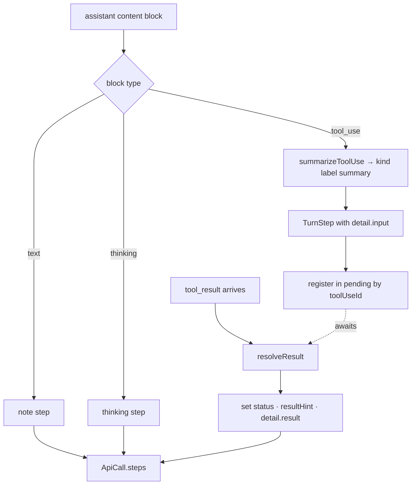

# Per-Turn Step Timeline

> Indexed at commit `9d4dd3f` on 2026-07-23 · [view on GitHub](https://github.com/yorch/cc-analyzer/tree/9d4dd3f)

## Relevant source files

- [src/core/steps.ts](https://github.com/yorch/cc-analyzer/blob/9d4dd3f/src/core/steps.ts)
- [src/core/analyze.ts](https://github.com/yorch/cc-analyzer/blob/9d4dd3f/src/core/analyze.ts)
- [src/tui/theme.ts](https://github.com/yorch/cc-analyzer/blob/9d4dd3f/src/tui/theme.ts)
- [src/tui/screens/SessionDetailScreen.tsx](https://github.com/yorch/cc-analyzer/blob/9d4dd3f/src/tui/screens/SessionDetailScreen.tsx)

## Overview

A *step* is one entry in a structured, human-readable timeline of what happened inside a single assistant inference: a line of narration, a thinking marker, or a tool operation with a one-line summary and a result status. `src/core/steps.ts` owns the `TurnStep` data model and the pure functions that classify a tool call, normalize its result text, and derive short status hints. The timeline is built by the analyzer in [src/core/analyze.ts](https://github.com/yorch/cc-analyzer/blob/9d4dd3f/src/core/analyze.ts) and consumed unchanged by the terminal UI and web per-turn views, plus `analyze --json`. This detail page covers how a `TurnStep` is defined, how steps are emitted from an assistant event's content blocks, and how a later `tool_result` patches a step in place.

## Implementation

### The step model

`TurnStep` carries a `kind` (a `StepKind` enum of twelve categories such as `run`, `read`, `edit`, `search`, `skill`, `subagent`, `note`, and `thinking`), a raw `tool` name for operations, a display `label`, a one-line `summary`, an optional `status` of `"ok"` or `"error"`, a short `resultHint`, the originating `toolUseId`, and an expandable `detail` payload ([src/core/steps.ts:L8-L43](https://github.com/yorch/cc-analyzer/blob/9d4dd3f/src/core/steps.ts#L8-L43)). The `StepDetail` sub-object holds the full tool input JSON and full result or narration text, both capped, with a `truncated` flag ([src/core/steps.ts:L22-L28](https://github.com/yorch/cc-analyzer/blob/9d4dd3f/src/core/steps.ts#L22-L28)). `TurnStep` records no timing or duration of its own — per-inference timing lives on the enclosing `ApiCall.timestamp` and per-turn timing on `Turn.startTime`/`Turn.endTime` in [src/core/analyze.ts:L30-L58](https://github.com/yorch/cc-analyzer/blob/9d4dd3f/src/core/analyze.ts#L30-L58).

Two size caps bound what a step retains: `SUMMARY_CAP` of 140 characters collapses the one-line summary and `DETAIL_CAP` of 2000 characters bounds the expandable body. `truncate()` normalizes whitespace and appends an ellipsis past the cap, while `capDetail()` slices at the detail cap and reports whether it cut ([src/core/steps.ts:L45-L57](https://github.com/yorch/cc-analyzer/blob/9d4dd3f/src/core/steps.ts#L45-L57)).

### Classifying a tool call

`summarizeToolUse(name, input)` maps a `tool_use` block to a `{ kind, label, summary }` triple via a switch over the tool name ([src/core/steps.ts:L86-L169](https://github.com/yorch/cc-analyzer/blob/9d4dd3f/src/core/steps.ts#L86-L169)). Each case pulls the most descriptive field from the tool input — `Bash` prefers `description` then falls back to `command`, `Read`/`Write`/`Edit` use `file_path`, `Grep`/`Glob` use `pattern`, `Task`/`Agent` join `subagent_type` and `description`, and `WebFetch` uses `url`. The `str()` helper safely extracts a string, number, or boolean field from unknown input, returning `undefined` when the key is absent or non-scalar ([src/core/steps.ts:L59-L66](https://github.com/yorch/cc-analyzer/blob/9d4dd3f/src/core/steps.ts#L59-L66)). Any unrecognized tool falls through to a generic case that labels the step `tool` and summarizes the first string field of the input ([src/core/steps.ts:L160-L167](https://github.com/yorch/cc-analyzer/blob/9d4dd3f/src/core/steps.ts#L160-L167)).

### Emitting steps from an assistant event

The analyzer builds `steps` for every assistant line inside `SessionAnalyzer.push`, iterating that event's `message.content` blocks ([src/core/analyze.ts:L585-L689](https://github.com/yorch/cc-analyzer/blob/9d4dd3f/src/core/analyze.ts#L585-L689)). A `text` block becomes a `note` step labeled `Assistant`; a `thinking` block becomes a `thinking` step; a `tool_use` block is passed through `summarizeToolUse` and its full input is stored as capped JSON in `detail.input` ([src/core/analyze.ts:L588-L687](https://github.com/yorch/cc-analyzer/blob/9d4dd3f/src/core/analyze.ts#L588-L687)). Narration and thinking steps are only produced in detail mode — the `if (!this.detail) continue` guards skip them when the timeline is disabled ([src/core/analyze.ts:L589-L602](https://github.com/yorch/cc-analyzer/blob/9d4dd3f/src/core/analyze.ts#L589-L602)). Each newly created tool step is registered in the `pending` map keyed by `tu.id`, so the later-arriving result can find and patch it ([src/core/analyze.ts:L674-L688](https://github.com/yorch/cc-analyzer/blob/9d4dd3f/src/core/analyze.ts#L674-L688)).

### Resolving results and merging streamed lines

When a `tool_result` arrives, `resolveResult` looks up the pending tool by id and, in detail mode, patches its step: it sets `status` to `"ok"` or `"error"`, computes `resultHint` via `makeResultHint`, and stores the capped result text in `detail.result` ([src/core/analyze.ts:L435-L460](https://github.com/yorch/cc-analyzer/blob/9d4dd3f/src/core/analyze.ts#L435-L460)). `resultToText` normalizes the raw `content` — a string, an array of text/image blocks, or an arbitrary object — into readable text before capping ([src/core/steps.ts:L68-L84](https://github.com/yorch/cc-analyzer/blob/9d4dd3f/src/core/steps.ts#L68-L84)). `makeResultHint` derives a compact status line: an error's first non-empty line, a `"N lines"` count for multi-line output, or the single line itself, each truncated to 80 characters ([src/core/steps.ts:L171-L182](https://github.com/yorch/cc-analyzer/blob/9d4dd3f/src/core/steps.ts#L171-L182)). Because a streamed API response is logged as multiple assistant lines sharing one `message.id`, continuation lines append their steps to the originating `ApiCall.steps` rather than creating a new call, keeping the timeline whole ([src/core/analyze.ts:L691-L706](https://github.com/yorch/cc-analyzer/blob/9d4dd3f/src/core/analyze.ts#L691-L706)).

Sources: [src/core/steps.ts:L8-L182](https://github.com/yorch/cc-analyzer/blob/9d4dd3f/src/core/steps.ts#L8-L182) [src/core/analyze.ts:L435-L460](https://github.com/yorch/cc-analyzer/blob/9d4dd3f/src/core/analyze.ts#L435-L460) [src/core/analyze.ts:L585-L706](https://github.com/yorch/cc-analyzer/blob/9d4dd3f/src/core/analyze.ts#L585-L706)

## Diagram

A `note` or `thinking` step is complete on creation, while a tool step is created incomplete, parked in `pending`, and finished when its matching `tool_result` patches it. All steps land on the enclosing `ApiCall.steps`, which forms the ordered per-inference timeline ([src/core/analyze.ts:L585-L706](https://github.com/yorch/cc-analyzer/blob/9d4dd3f/src/core/analyze.ts#L585-L706)).

## Usage

The timeline is opt-in through `AnalyzeOptions.detail`, which defaults to `true`; setting it `false` skips step construction entirely so the indexer computes aggregates only ([src/core/analyze.ts:L155-L163](https://github.com/yorch/cc-analyzer/blob/9d4dd3f/src/core/analyze.ts#L155-L163)). `analyzeSessionStream` threads this flag into the `SessionAnalyzer` constructor ([src/core/analyze.ts:L840-L854](https://github.com/yorch/cc-analyzer/blob/9d4dd3f/src/core/analyze.ts#L840-L854)).

The terminal UI renders each step with a per-kind icon and color drawn from `STEP_ICON` and `STEP_COLOR`, both keyed by `StepKind` ([src/tui/theme.ts:L87-L115](https://github.com/yorch/cc-analyzer/blob/9d4dd3f/src/tui/theme.ts#L87-L115)). `StepRow` shows the icon, label, truncated summary, and an `✓`/`✗` status mark, and expands `detail.input` and `detail.result` inline through `stepDetailLines` when the step carries a detail payload ([src/tui/screens/SessionDetailScreen.tsx:L291-L357](https://github.com/yorch/cc-analyzer/blob/9d4dd3f/src/tui/screens/SessionDetailScreen.tsx#L291-L357)).

Sources: [src/core/analyze.ts:L155-L163](https://github.com/yorch/cc-analyzer/blob/9d4dd3f/src/core/analyze.ts#L155-L163) [src/core/analyze.ts:L840-L854](https://github.com/yorch/cc-analyzer/blob/9d4dd3f/src/core/analyze.ts#L840-L854) [src/tui/theme.ts:L87-L115](https://github.com/yorch/cc-analyzer/blob/9d4dd3f/src/tui/theme.ts#L87-L115) [src/tui/screens/SessionDetailScreen.tsx:L291-L357](https://github.com/yorch/cc-analyzer/blob/9d4dd3f/src/tui/screens/SessionDetailScreen.tsx#L291-L357)

## Related Pages

- Parent: [Core Analysis Engine](./2-core-analysis-engine.md)
- Sibling: [Session Parsing and Events](./2.1-session-parsing-and-events.md)
- Sibling: [Cost and Pricing](./2.2-cost-and-pricing.md)
- Sibling: [Index and Analytics](./2.3-index-and-analytics.md)
