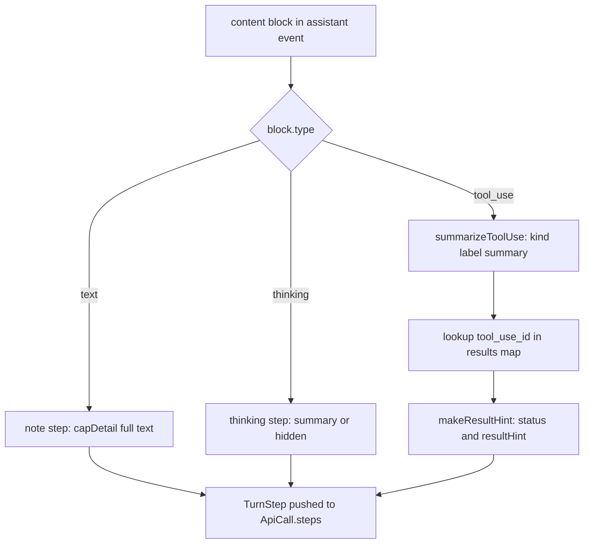

# Per-Turn Step Timeline

> Indexed at commit `bf5a4c8` on 2026-07-12 · [view on GitHub](https://github.com/yorch/cc-analyzer/tree/bf5a4c8)

## Relevant source files

- [src/core/steps.ts](https://github.com/yorch/cc-analyzer/blob/bf5a4c8/src/core/steps.ts)
- [src/core/analyze.ts](https://github.com/yorch/cc-analyzer/blob/bf5a4c8/src/core/analyze.ts)

## Overview

The step timeline turns the raw content of a single inference into a structured, human-readable sequence of actions. Each entry — a `TurnStep` — captures one thing the assistant did inside an API call: narrated text, a thinking marker, or a tool operation with a one-line summary and a result status. The type definitions and the tool-aware formatting helpers live in [src/core/steps.ts#L1-L6](https://github.com/yorch/cc-analyzer/blob/bf5a4c8/src/core/steps.ts#L1-L6), while the timeline itself is assembled during session analysis in [src/core/analyze.ts#L258-L321](https://github.com/yorch/cc-analyzer/blob/bf5a4c8/src/core/analyze.ts#L258-L321). The result is a shared model consumed by the Terminal User Interface (TUI) session view, the web per-turn view, and `analyze --json`.

## Implementation

A `TurnStep` records a `kind` (one of twelve `StepKind` values), an optional raw `tool` name, a display `label`, a one-line `summary`, an optional `status` of `"ok"` or `"error"`, a short `resultHint`, the originating `toolUseId`, and an expandable `detail` payload holding capped input and result text. The `StepKind` union classifies tools into families — `run`, `read`, `edit`, `search`, `skill`, `subagent`, `web`, `task`, `ask` — with `note` and `thinking` for assistant narration and reasoning markers, and `tool` as the catch-all. These shapes are declared in [src/core/steps.ts#L8-L43](https://github.com/yorch/cc-analyzer/blob/bf5a4c8/src/core/steps.ts#L8-L43).

Two size constants bound the timeline's footprint: `SUMMARY_CAP` of 140 characters for one-line summaries and `DETAIL_CAP` of 2000 characters for the expandable payload, defined at [src/core/steps.ts#L45-L57](https://github.com/yorch/cc-analyzer/blob/bf5a4c8/src/core/steps.ts#L45-L57). `truncate` collapses whitespace and appends an ellipsis past a limit, while `capDetail` slices long strings and returns a `truncated` flag so consumers can point the reader to the full transcript. `resultToText` normalizes a `tool_result` `content` field — which may be a raw string or an array of text and image blocks — into readable text, rendering images as the literal `[image]` marker ([src/core/steps.ts#L68-L84](https://github.com/yorch/cc-analyzer/blob/bf5a4c8/src/core/steps.ts#L68-L84)).

The core formatting logic is `summarizeToolUse`, which maps a tool name and its input to a `kind`, `label`, and `summary` via a per-tool `switch` ([src/core/steps.ts#L92-L169](https://github.com/yorch/cc-analyzer/blob/bf5a4c8/src/core/steps.ts#L92-L169)). Each case extracts the most meaningful field: `Bash` prefers `description` then falls back to `command`, `Read`/`Write`/`Edit` use `file_path`, `Grep`/`Glob` use `pattern`, `Task`/`Agent` join `subagent_type` and `description` with a middle dot, and unknown tools take the first string-valued field or an empty summary. The helper `str` safely reads a named string, number, or boolean off an unknown input object ([src/core/steps.ts#L59-L66](https://github.com/yorch/cc-analyzer/blob/bf5a4c8/src/core/steps.ts#L59-L66)). Result status is condensed by `makeResultHint`: for errors it returns the first non-empty line truncated to 80 characters; for success it reports either a line count like `"3 lines"` or the single line of output ([src/core/steps.ts#L171-L182](https://github.com/yorch/cc-analyzer/blob/bf5a4c8/src/core/steps.ts#L171-L182)).

The timeline is built in `analyzeSession`, not in `steps.ts`. For each assistant event, the analyzer walks `event.message.content` and appends a `TurnStep` per block: `text` blocks become `note` steps carrying the full capped text as detail, `thinking` blocks become `thinking` steps (labeled `(hidden)` when empty), and `tool_use` blocks are summarized and paired with their result ([src/core/analyze.ts#L258-L321](https://github.com/yorch/cc-analyzer/blob/bf5a4c8/src/core/analyze.ts#L258-L321)). Results are resolved through a `Map` from `tool_use_id` to `{ isError, text }` produced by `collectToolResults`, which scans user events for `tool_result` blocks ([src/core/analyze.ts#L146-L170](https://github.com/yorch/cc-analyzer/blob/bf5a4c8/src/core/analyze.ts#L146-L170)). Each assembled `TurnStep` array becomes the `steps` field of an `ApiCall`, described as the "ordered timeline of this inference" at [src/core/analyze.ts#L29-L38](https://github.com/yorch/cc-analyzer/blob/bf5a4c8/src/core/analyze.ts#L29-L38).

Sources: [src/core/steps.ts:L1-L182](https://github.com/yorch/cc-analyzer/blob/bf5a4c8/src/core/steps.ts#L1-L182) [src/core/analyze.ts:L258-L321](https://github.com/yorch/cc-analyzer/blob/bf5a4c8/src/core/analyze.ts#L258-L321) [src/core/analyze.ts:L146-L170](https://github.com/yorch/cc-analyzer/blob/bf5a4c8/src/core/analyze.ts#L146-L170)

## Diagram

Each content block of an assistant message is classified by `type` and converted into exactly one `TurnStep`; tool blocks additionally join their `tool_result` to derive a status and hint before being pushed onto the API call's ordered `steps` array.

## Usage

The step model is the single source shared across every turn view. The TUI renders it in [src/tui/screens/SessionDetailScreen.tsx](https://github.com/yorch/cc-analyzer/blob/bf5a4c8/src/tui/screens/SessionDetailScreen.tsx), which maps each `StepKind` to an icon and color and expands `step.detail` on demand, reading `step.resultHint`, `step.status`, and `step.detail.truncated` directly. The web per-turn view mirrors the same fields in [web/src/views/Session.tsx](https://github.com/yorch/cc-analyzer/blob/bf5a4c8/web/src/views/Session.tsx), where the `StepRow` component renders `step.label`, `step.summary`, the ok/error marker, and an expandable input/result block. Because `ApiCall.steps` is part of `SessionAnalysis`, the same timeline is emitted verbatim by `analyze --json`, and the `TurnStep` and `StepKind` types are re-declared for the browser bundle in [web/src/api.ts](https://github.com/yorch/cc-analyzer/blob/bf5a4c8/web/src/api.ts).

Sources: [src/core/analyze.ts:L29-L38](https://github.com/yorch/cc-analyzer/blob/bf5a4c8/src/core/analyze.ts#L29-L38) [src/core/steps.ts:L30-L43](https://github.com/yorch/cc-analyzer/blob/bf5a4c8/src/core/steps.ts#L30-L43)

## Related Pages

- Parent: [Core Analysis Engine](./2-core-analysis-engine.md)
- Sibling: [Session Parsing and Events](./2.1-session-parsing-and-events.md)
- Sibling: [Cost and Pricing](./2.2-cost-and-pricing.md)
- Sibling: [Index and Analytics](./2.3-index-and-analytics.md)
