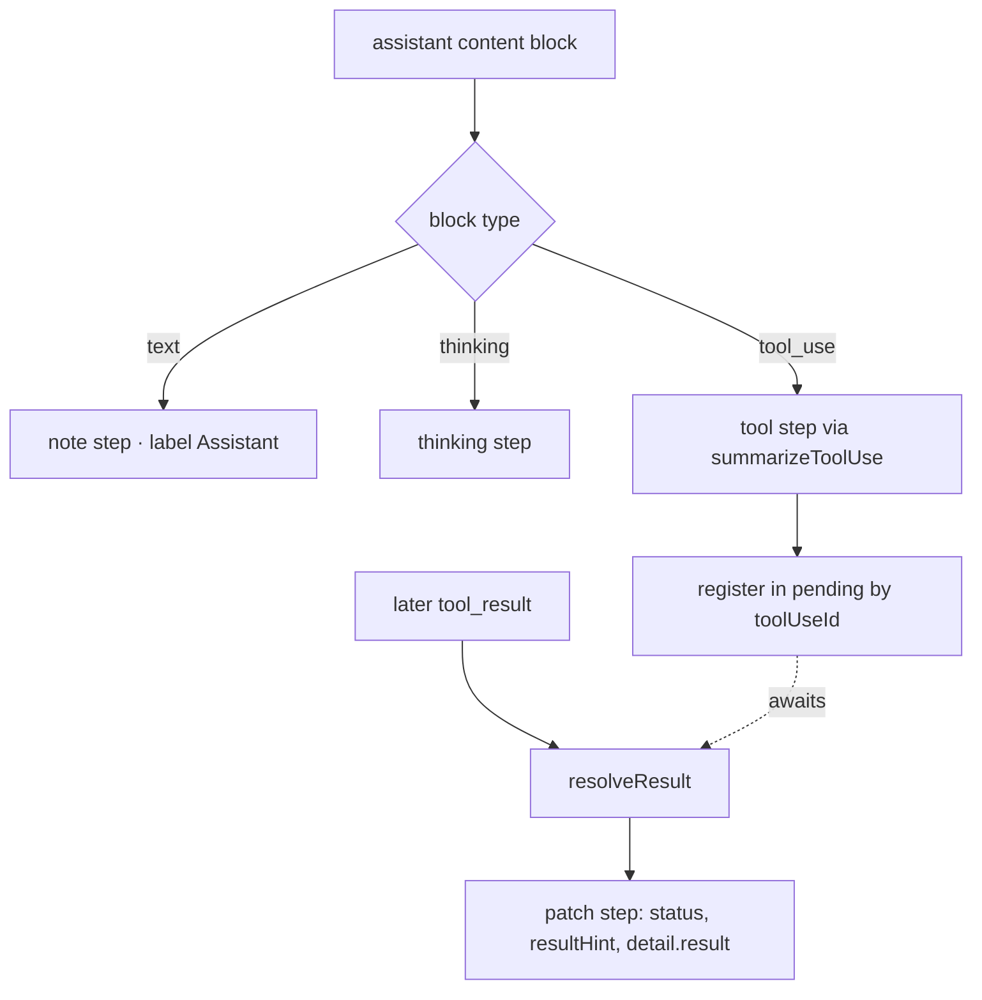

# Per-Turn Step Timeline

> Indexed at commit `51ccd4e` on 2026-07-23 · [view on GitHub](https://github.com/yorch/cc-analyzer/tree/51ccd4e)

## Relevant source files

- [src/core/steps.ts](https://github.com/yorch/cc-analyzer/blob/51ccd4e/src/core/steps.ts)
- [src/core/analyze.ts](https://github.com/yorch/cc-analyzer/blob/51ccd4e/src/core/analyze.ts)

## Overview

The step timeline turns the raw content blocks of a single inference into an ordered, human-readable sequence of what the assistant did: narration text, thinking markers, and individual tool operations each carrying a one-line summary and a result status. The core type is `TurnStep`, defined in [src/core/steps.ts#L30-L43](https://github.com/yorch/cc-analyzer/blob/51ccd4e/src/core/steps.ts#L30-L43), and every `ApiCall` in a turn owns an ordered `steps: TurnStep[]` array as its inner timeline ([src/core/analyze.ts#L39-L41](https://github.com/yorch/cc-analyzer/blob/51ccd4e/src/core/analyze.ts#L39-L41)). This module supplies the shared vocabulary — step kinds, tool summarization, result hints — while [src/core/analyze.ts](https://github.com/yorch/cc-analyzer/blob/51ccd4e/src/core/analyze.ts) assembles the steps as it streams events. The Terminal User Interface (TUI) session-detail view, the web per-turn view, and `analyze --json` all render this same structure.

## Implementation

A `TurnStep` records a `kind` drawn from the `StepKind` union — `note`, `thinking`, `run`, `read`, `edit`, `search`, `skill`, `subagent`, `web`, `task`, `ask`, or `tool` — plus a display `label`, a one-line `summary`, an optional `status` of `"ok"` or `"error"`, a short `resultHint`, the originating `toolUseId`, and an expandable `detail` blob ([src/core/steps.ts#L8-L43](https://github.com/yorch/cc-analyzer/blob/51ccd4e/src/core/steps.ts#L8-L43)). The kinds map fine-grained Claude Code tools onto a small palette a UI can color and iconify: `Bash` becomes `run`, the four file-mutating tools become `edit`, `Grep`/`Glob`/`ToolSearch` become `search`, and anything unrecognized falls through to the generic `tool` kind ([src/core/steps.ts#L93-L169](https://github.com/yorch/cc-analyzer/blob/51ccd4e/src/core/steps.ts#L93-L169)).

Steps are built inside `pushAssistant` as the analyzer walks each assistant event's content blocks ([src/core/analyze.ts#L585-L689](https://github.com/yorch/cc-analyzer/blob/51ccd4e/src/core/analyze.ts#L585-L689)). A `text` block with non-empty content yields a `note` step labeled `"Assistant"`, and a `thinking` block yields a `thinking` step whose summary collapses to `"(hidden)"` when the reasoning text is empty ([src/core/analyze.ts#L588-L612](https://github.com/yorch/cc-analyzer/blob/51ccd4e/src/core/analyze.ts#L588-L612)). Both narration kinds are only produced when the analyzer runs in detail mode; the indexer's aggregate-only pass skips them. A `tool_use` block calls `summarizeToolUse(name, input)` to derive kind, label, and summary, captures the pretty-printed tool input into `detail.input`, and pushes the step with its `toolUseId` set to the tool call's id ([src/core/analyze.ts#L674-L688](https://github.com/yorch/cc-analyzer/blob/51ccd4e/src/core/analyze.ts#L674-L688)).

`summarizeToolUse` is a per-tool switch that pulls the most meaningful field out of each tool's input: `Bash` prefers its `description` and falls back to the raw `command`, `Read`/`Write`/`Edit` show the `file_path`, `Grep`/`Glob` show the `pattern`, `Task`/`Agent` join the `subagent_type` and `description`, and unrecognized tools grab the first string field or compact JSON ([src/core/steps.ts#L92-L169](https://github.com/yorch/cc-analyzer/blob/51ccd4e/src/core/steps.ts#L92-L169)). Every summary passes through `truncate`, which collapses whitespace and clamps to `SUMMARY_CAP` of 140 characters, while expandable detail text runs through `capDetail`, which clamps to `DETAIL_CAP` of 2000 characters and flags truncation ([src/core/steps.ts#L45-L57](https://github.com/yorch/cc-analyzer/blob/51ccd4e/src/core/steps.ts#L45-L57)).

A tool step is created without its result — the matching `tool_result` arrives on a later user event. When a `tool_use` block is processed the analyzer registers it in a `pending` map, keyed by tool id and carrying a reference to the just-pushed step ([src/core/analyze.ts#L688](https://github.com/yorch/cc-analyzer/blob/51ccd4e/src/core/analyze.ts#L688)). When the result appears, `resolveResult` looks up the pending entry and patches the step in place: it sets `status` to `"ok"` or `"error"`, computes a `resultHint` via `makeResultHint`, and stores the normalized result text into `detail.result` ([src/core/analyze.ts#L436-L460](https://github.com/yorch/cc-analyzer/blob/51ccd4e/src/core/analyze.ts#L436-L460)). `resultToText` flattens a `tool_result` content — a plain string or an array of text/image blocks — into readable text ([src/core/steps.ts#L69-L84](https://github.com/yorch/cc-analyzer/blob/51ccd4e/src/core/steps.ts#L69-L84)), and `makeResultHint` returns the first line for errors, a `"N lines"` count for multi-line output, or the single line itself otherwise ([src/core/steps.ts#L172-L182](https://github.com/yorch/cc-analyzer/blob/51ccd4e/src/core/steps.ts#L172-L182)).

Because a streamed API response is logged as one assistant line per content block, steps from a continuation line are appended to the originating `ApiCall`'s `steps` array via the `callsByKey` map rather than starting a new call, keeping the whole inference's timeline in one place ([src/core/analyze.ts#L694-L706](https://github.com/yorch/cc-analyzer/blob/51ccd4e/src/core/analyze.ts#L694-L706)). The result is that each `Turn` holds `apiCalls`, and each `ApiCall` holds an ordered `steps` timeline interleaving narration, thinking, and tool operations in the order they occurred ([src/core/analyze.ts#L30-L58](https://github.com/yorch/cc-analyzer/blob/51ccd4e/src/core/analyze.ts#L30-L58)).

Sources: [src/core/steps.ts#L1-L182](https://github.com/yorch/cc-analyzer/blob/51ccd4e/src/core/steps.ts#L1-L182) [src/core/analyze.ts#L436-L460](https://github.com/yorch/cc-analyzer/blob/51ccd4e/src/core/analyze.ts#L436-L460) [src/core/analyze.ts#L585-L706](https://github.com/yorch/cc-analyzer/blob/51ccd4e/src/core/analyze.ts#L585-L706)

## Diagram

Text and thinking blocks map directly to terminal `note` and `thinking` steps, while a `tool_use` block produces a tool step that is registered in `pending` and completed only when its matching `tool_result` arrives and `resolveResult` patches the step's status and result in place ([src/core/analyze.ts#L585-L689](https://github.com/yorch/cc-analyzer/blob/51ccd4e/src/core/analyze.ts#L585-L689), [src/core/analyze.ts#L436-L460](https://github.com/yorch/cc-analyzer/blob/51ccd4e/src/core/analyze.ts#L436-L460)).

## Usage

The pure helpers in [src/core/steps.ts](https://github.com/yorch/cc-analyzer/blob/51ccd4e/src/core/steps.ts) are imported directly by the analyzer: `analyze.ts` pulls in `summarizeToolUse`, `makeResultHint`, `resultToText`, `capDetail`, `truncate`, and the `TurnStep` type at the top of the file ([src/core/analyze.ts#L21-L28](https://github.com/yorch/cc-analyzer/blob/51ccd4e/src/core/analyze.ts#L21-L28)). Downstream, the produced `steps` array reaches consumers through the `ApiCall.steps` field, which is only populated in detail mode — the aggregate-only indexer path leaves narration and tool steps unbuilt to save memory ([src/core/analyze.ts#L588-L589](https://github.com/yorch/cc-analyzer/blob/51ccd4e/src/core/analyze.ts#L588-L589), [src/core/analyze.ts#L601-L602](https://github.com/yorch/cc-analyzer/blob/51ccd4e/src/core/analyze.ts#L601-L602)). The TUI session-detail view and the web per-turn view iterate over each `ApiCall`'s `steps` to render the timeline, using `kind` for iconography, `summary` and `resultHint` for the collapsed row, and `detail` for the expandable input/result panes.

Sources: [src/core/analyze.ts#L21-L28](https://github.com/yorch/cc-analyzer/blob/51ccd4e/src/core/analyze.ts#L21-L28) [src/core/analyze.ts#L39-L41](https://github.com/yorch/cc-analyzer/blob/51ccd4e/src/core/analyze.ts#L39-L41) [src/core/steps.ts#L22-L43](https://github.com/yorch/cc-analyzer/blob/51ccd4e/src/core/steps.ts#L22-L43)

## Related Pages

- Parent: [Core Analysis Engine](./2-core-analysis-engine.md)
- Sibling: [Session Parsing and Events](./2.1-session-parsing-and-events.md)
- Sibling: [Cost and Pricing](./2.2-cost-and-pricing.md)
- Sibling: [Index and Analytics](./2.3-index-and-analytics.md)
