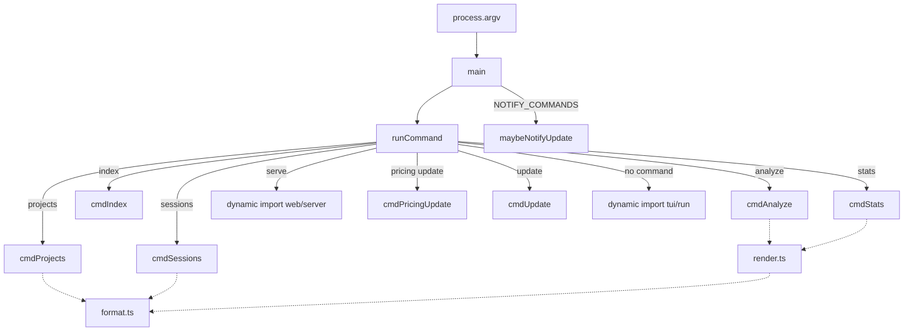
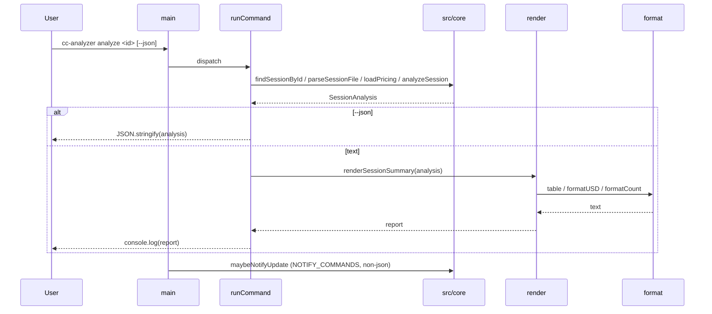

# Command-Line Interface

> Indexed at commit `bf5a4c8` on 2026-07-12 · [view on GitHub](https://github.com/yorch/cc-analyzer/tree/bf5a4c8)

## Relevant source files

- [src/cli/index.ts](https://github.com/yorch/cc-analyzer/blob/bf5a4c8/src/cli/index.ts)
- [src/cli/format.ts](https://github.com/yorch/cc-analyzer/blob/bf5a4c8/src/cli/format.ts)
- [src/cli/render.ts](https://github.com/yorch/cc-analyzer/blob/bf5a4c8/src/cli/render.ts)

## Overview

The Command-Line Interface (CLI) is the primary entry point for `cc-analyzer`. It is a thin dispatch layer that parses `process.argv`, routes to a command handler, and delegates all data work to the core analysis engine under `src/core`. The binary is declared with a `#!/usr/bin/env bun` shebang and executes `process.exit(await main())` at module load, so importing the module runs the program ([src/cli/index.ts#L1](https://github.com/yorch/cc-analyzer/blob/bf5a4c8/src/cli/index.ts#L1), [src/cli/index.ts#L245](https://github.com/yorch/cc-analyzer/blob/bf5a4c8/src/cli/index.ts#L245)).

The CLI covers session discovery (`projects`, `sessions`), single-session analysis (`analyze`), index maintenance (`index`), portfolio analytics (`stats`), the local web app (`serve`), pricing refresh (`pricing update`), self-update (`update`, `version`), and — when invoked with no command — launches the interactive Terminal User Interface (TUI). Presentation is split across two modules: [src/cli/format.ts](https://github.com/yorch/cc-analyzer/blob/bf5a4c8/src/cli/format.ts) provides low-level formatting primitives (aligned tables, human-readable byte/count/time strings), and [src/cli/render.ts](https://github.com/yorch/cc-analyzer/blob/bf5a4c8/src/cli/render.ts) composes those primitives into full text reports. Every command that emits structured data supports a `--json` flag that prints the raw core objects for scripting ([src/cli/index.ts#L99-L100](https://github.com/yorch/cc-analyzer/blob/bf5a4c8/src/cli/index.ts#L99-L100), [src/cli/index.ts#L147](https://github.com/yorch/cc-analyzer/blob/bf5a4c8/src/cli/index.ts#L147)).

## Architecture

`main()` reads `argv`, calls `runCommand()` to dispatch, then — for a fixed set of quick commands — issues a passive update notice before returning the exit code ([src/cli/index.ts#L234-L243](https://github.com/yorch/cc-analyzer/blob/bf5a4c8/src/cli/index.ts#L234-L243)). Command handlers pull data from the core engine and pass it to the render/format layer; `serve` and the no-command TUI are loaded through dynamic `import()` so their heavier dependencies stay out of the fast-path startup.

Sources: [src/cli/index.ts:L184-L243](https://github.com/yorch/cc-analyzer/blob/bf5a4c8/src/cli/index.ts#L184-L243)

## Module Layout

| Module | Path | Responsibility |
| ------ | ---- | -------------- |
| `index` | [src/cli/index.ts](https://github.com/yorch/cc-analyzer/blob/bf5a4c8/src/cli/index.ts) | Binary entry point, argv parsing, command routing, per-command handlers |
| `format` | [src/cli/format.ts](https://github.com/yorch/cc-analyzer/blob/bf5a4c8/src/cli/format.ts) | Formatting primitives: aligned `table`, `formatUSD`, `formatCount`, `formatBytes`, `formatDuration`, `formatRelativeTime`, `truncate` |
| `render` | [src/cli/render.ts](https://github.com/yorch/cc-analyzer/blob/bf5a4c8/src/cli/render.ts) | Report composition: `renderSessionSummary`, `renderStats` |

Sources: [src/cli/index.ts:L1-L20](https://github.com/yorch/cc-analyzer/blob/bf5a4c8/src/cli/index.ts#L1-L20) [src/cli/format.ts:L1-L61](https://github.com/yorch/cc-analyzer/blob/bf5a4c8/src/cli/format.ts#L1-L61) [src/cli/render.ts:L1-L20](https://github.com/yorch/cc-analyzer/blob/bf5a4c8/src/cli/render.ts#L1-L20)

## Command Routing

`runCommand()` is the central dispatcher. It derives a `json` boolean from `--json` presence and a `positional` array by filtering out any argument starting with `--`, then switches on the command string ([src/cli/index.ts#L184-L187](https://github.com/yorch/cc-analyzer/blob/bf5a4c8/src/cli/index.ts#L184-L187)). Unknown commands print the help text and return exit code `2`; `help`, `--help`, and `-h` print help and return `0` ([src/cli/index.ts#L222-L231](https://github.com/yorch/cc-analyzer/blob/bf5a4c8/src/cli/index.ts#L222-L231)). The `HELP` constant documents every command and embeds the current `VERSION` ([src/cli/index.ts#L22-L40](https://github.com/yorch/cc-analyzer/blob/bf5a4c8/src/cli/index.ts#L22-L40)).

Exit codes carry meaning across handlers: `0` on success, `1` for empty results or a failed remote operation, and `2` for usage errors such as a missing argument ([src/cli/index.ts#L59-L67](https://github.com/yorch/cc-analyzer/blob/bf5a4c8/src/cli/index.ts#L59-L67), [src/cli/index.ts#L206-L209](https://github.com/yorch/cc-analyzer/blob/bf5a4c8/src/cli/index.ts#L206-L209)).

Sources: [src/cli/index.ts:L184-L232](https://github.com/yorch/cc-analyzer/blob/bf5a4c8/src/cli/index.ts#L184-L232)

## Key Components

### Discovery commands: `projects` and `sessions`

`cmdProjects()` calls `listProjects()` from the core discovery module and renders a two-column table of session count and truncated project label, followed by a total count; an empty result prints a friendly message and returns `0` ([src/cli/index.ts#L42-L56](https://github.com/yorch/cc-analyzer/blob/bf5a4c8/src/cli/index.ts#L42-L56)). `cmdSessions()` requires a `<projectId>` positional; a missing id returns exit code `2`, and no matching sessions returns `1`. Otherwise it renders each session's id, relative modified time via `formatRelativeTime`, and size via `formatBytes` ([src/cli/index.ts#L58-L76](https://github.com/yorch/cc-analyzer/blob/bf5a4c8/src/cli/index.ts#L58-L76)).

Sources: [src/cli/index.ts:L42-L76](https://github.com/yorch/cc-analyzer/blob/bf5a4c8/src/cli/index.ts#L42-L76)

### `analyze` and session-reference resolution

`cmdAnalyze()` accepts a `<id|path>` reference and a `json` flag. It resolves the reference through `resolveSessionPath()`, which treats any argument ending in `.jsonl` or containing `/` as a filesystem path (returning it only if `Bun.file(ref).exists()`), and otherwise looks the reference up as a session UUID across all projects via `findSessionById()` ([src/cli/index.ts#L78-L83](https://github.com/yorch/cc-analyzer/blob/bf5a4c8/src/cli/index.ts#L78-L83)). An unresolved reference returns `1`. On success it parses the file with `parseSessionFile()`, loads the pricing table with `loadPricing()`, and computes the analysis via `analyzeSession()` ([src/cli/index.ts#L95-L97](https://github.com/yorch/cc-analyzer/blob/bf5a4c8/src/cli/index.ts#L95-L97)).

With `--json`, `cmdAnalyze()` prints the analysis object plus a `parseErrors` count as pretty JSON; otherwise it delegates to `renderSessionSummary()` and appends a note when unparseable lines were skipped ([src/cli/index.ts#L99-L104](https://github.com/yorch/cc-analyzer/blob/bf5a4c8/src/cli/index.ts#L99-L104)).

Sources: [src/cli/index.ts:L78-L106](https://github.com/yorch/cc-analyzer/blob/bf5a4c8/src/cli/index.ts#L78-L106)

### `index` and `stats`

`cmdIndex()` opens the SQLite database with `openDb()` and runs `reindex()`, passing an `onProgress` callback that writes throttled `indexing done/total...` updates to `stderr` (every 200 items or on completion). It reports counts of indexed, skipped, and deleted sessions with elapsed seconds ([src/cli/index.ts#L108-L129](https://github.com/yorch/cc-analyzer/blob/bf5a4c8/src/cli/index.ts#L108-L129)). The `--rebuild` flag is threaded through to force a full rebuild ([src/cli/index.ts#L195-L196](https://github.com/yorch/cc-analyzer/blob/bf5a4c8/src/cli/index.ts#L195-L196)).

`cmdStats()` reads portfolio analytics from the index. It first checks `portfolioSummary()`, returning `1` with a prompt to run `index` if the index is empty. Otherwise it assembles a view from `spendByMonth`, `spendByProject`, `spendByModel`, and `topSessions`, then prints it as JSON or via `renderStats()` depending on the `json` flag ([src/cli/index.ts#L131-L149](https://github.com/yorch/cc-analyzer/blob/bf5a4c8/src/cli/index.ts#L131-L149)).

Sources: [src/cli/index.ts:L108-L149](https://github.com/yorch/cc-analyzer/blob/bf5a4c8/src/cli/index.ts#L108-L149)

### `serve` and the no-command TUI

The `serve` case parses an optional `--port=` argument, dynamically imports `runServe` from [src/web/server.ts](https://github.com/yorch/cc-analyzer/blob/bf5a4c8/src/web/server.ts), and awaits it ([src/cli/index.ts#L199-L205](https://github.com/yorch/cc-analyzer/blob/bf5a4c8/src/cli/index.ts#L199-L205)). When `command` is `undefined` — the program was invoked with no arguments — the router dynamically imports `runTui` from [src/tui/run.tsx](https://github.com/yorch/cc-analyzer/blob/bf5a4c8/src/tui/run.tsx) and launches the interactive interface ([src/cli/index.ts#L217-L221](https://github.com/yorch/cc-analyzer/blob/bf5a4c8/src/cli/index.ts#L217-L221)). Both use lazy `import()` so the web and TUI dependency trees load only when needed. Deep coverage of these subsystems lives in their own pages.

Sources: [src/cli/index.ts:L199-L221](https://github.com/yorch/cc-analyzer/blob/bf5a4c8/src/cli/index.ts#L199-L221)

### `pricing update`

`cmdPricingUpdate()` forces a refresh with `loadPricing({ force: true })` and reports the resolved source and the number of models loaded, formatted with `formatCount`. It returns `0` only when the pricing came from the `remote` source, and `1` otherwise, signalling that a fresh fetch did not succeed ([src/cli/index.ts#L151-L156](https://github.com/yorch/cc-analyzer/blob/bf5a4c8/src/cli/index.ts#L151-L156)). The `pricing` command requires the `update` subcommand; any other form prints a usage line and returns `2` ([src/cli/index.ts#L206-L209](https://github.com/yorch/cc-analyzer/blob/bf5a4c8/src/cli/index.ts#L206-L209)).

Sources: [src/cli/index.ts:L151-L156](https://github.com/yorch/cc-analyzer/blob/bf5a4c8/src/cli/index.ts#L151-L156) [src/cli/index.ts:L206-L209](https://github.com/yorch/cc-analyzer/blob/bf5a4c8/src/cli/index.ts#L206-L209)

### `update`, `version`, and the passive update notice

`cmdUpdate()` handles self-update. With `--check`, it fetches the latest release via `fetchLatestVersion()` and compares against the local `VERSION` using `compareVersions()`, printing either "you're on the latest version" or an availability message; without the flag it runs `performUpdate()` and prints the result message, returning `1` only when the update status is `unsupported`. Any thrown error is caught and reported as an update failure with exit code `1` ([src/cli/index.ts#L158-L179](https://github.com/yorch/cc-analyzer/blob/bf5a4c8/src/cli/index.ts#L158-L179)). The `version`, `--version`, and `-v` cases print `VERSION` and return `0` ([src/cli/index.ts#L212-L216](https://github.com/yorch/cc-analyzer/blob/bf5a4c8/src/cli/index.ts#L212-L216)).

After `runCommand()` returns, `main()` performs a best-effort, non-blocking update check. The `NOTIFY_COMMANDS` set — `projects`, `sessions`, `analyze`, `index`, `stats`, `pricing` — gates this behavior, and the notice is suppressed when `--json` was passed so machine-readable output stays clean; the actual check is delegated to `maybeNotifyUpdate()` ([src/cli/index.ts#L181-L182](https://github.com/yorch/cc-analyzer/blob/bf5a4c8/src/cli/index.ts#L181-L182), [src/cli/index.ts#L238-L241](https://github.com/yorch/cc-analyzer/blob/bf5a4c8/src/cli/index.ts#L238-L241)). The self-update and version-comparison mechanics belong to the Updates & Distribution subsystem.

Sources: [src/cli/index.ts:L158-L182](https://github.com/yorch/cc-analyzer/blob/bf5a4c8/src/cli/index.ts#L158-L182) [src/cli/index.ts:L212-L241](https://github.com/yorch/cc-analyzer/blob/bf5a4c8/src/cli/index.ts#L212-L241)

### Formatting primitives

[src/cli/format.ts](https://github.com/yorch/cc-analyzer/blob/bf5a4c8/src/cli/format.ts) supplies the presentation building blocks. `table()` computes per-column widths from the headers and rows, pads each cell with `padEnd`, and inserts a dash separator row, producing a monospace-aligned block ([src/cli/format.ts#L51-L56](https://github.com/yorch/cc-analyzer/blob/bf5a4c8/src/cli/format.ts#L51-L56)). `formatCount()` abbreviates large numbers with `k`/`M`/`B` suffixes, `formatBytes()` scales to `B`/`KB`/`MB`, and `formatRelativeTime()` renders "just now", minute/hour/day-ago strings, or an ISO date past 30 days ([src/cli/format.ts#L9-L48](https://github.com/yorch/cc-analyzer/blob/bf5a4c8/src/cli/format.ts#L9-L48)). `truncate()` collapses whitespace and clips to a maximum length with an ellipsis, keeping table cells bounded ([src/cli/format.ts#L58-L61](https://github.com/yorch/cc-analyzer/blob/bf5a4c8/src/cli/format.ts#L58-L61)). `formatUSD`, `formatTokens`, and `formatDuration` round out the money, token, and duration formatting used by the report layer ([src/cli/format.ts#L3-L36](https://github.com/yorch/cc-analyzer/blob/bf5a4c8/src/cli/format.ts#L3-L36)).

Sources: [src/cli/format.ts:L1-L61](https://github.com/yorch/cc-analyzer/blob/bf5a4c8/src/cli/format.ts#L1-L61)

### Report rendering

[src/cli/render.ts](https://github.com/yorch/cc-analyzer/blob/bf5a4c8/src/cli/render.ts) turns core data structures into multi-section text reports. `renderSessionSummary()` builds a single-session report: a header with title, session id, project path, git branches, and Claude Code versions, followed by tables for totals, cost by token category, per-model usage, tool counts, and per-turn breakdowns; model and tool tables are sorted by cost and count descending and omitted when empty ([src/cli/render.ts#L18-L92](https://github.com/yorch/cc-analyzer/blob/bf5a4c8/src/cli/render.ts#L18-L92)). It marks estimated costs with an "(estimated)" suffix drawn from `a.totals.cost.estimated` ([src/cli/render.ts#L20](https://github.com/yorch/cc-analyzer/blob/bf5a4c8/src/cli/render.ts#L20)).

`renderStats()` consumes a `PortfolioView` and renders portfolio totals plus optional sections for spend by month, top projects by cost, spend by model, and the most expensive sessions — each conditionally emitted only when its row array is non-empty ([src/cli/render.ts#L94-L188](https://github.com/yorch/cc-analyzer/blob/bf5a4c8/src/cli/render.ts#L94-L188)). The `PortfolioView` interface defined here is the contract `cmdStats()` assembles from the core stats functions ([src/cli/render.ts#L94-L100](https://github.com/yorch/cc-analyzer/blob/bf5a4c8/src/cli/render.ts#L94-L100)).

Sources: [src/cli/render.ts:L18-L188](https://github.com/yorch/cc-analyzer/blob/bf5a4c8/src/cli/render.ts#L18-L188)

## Data Flow

The `analyze` path illustrates the general shape shared by every data command: the CLI resolves and loads core data, then either serializes it directly (`--json`) or routes it through `render` → `format` for human-readable output, before `main()` optionally appends the update notice ([src/cli/index.ts#L85-L106](https://github.com/yorch/cc-analyzer/blob/bf5a4c8/src/cli/index.ts#L85-L106), [src/cli/index.ts#L234-L242](https://github.com/yorch/cc-analyzer/blob/bf5a4c8/src/cli/index.ts#L234-L242)).

Sources: [src/cli/index.ts:L85-L106](https://github.com/yorch/cc-analyzer/blob/bf5a4c8/src/cli/index.ts#L85-L106) [src/cli/render.ts:L18-L92](https://github.com/yorch/cc-analyzer/blob/bf5a4c8/src/cli/render.ts#L18-L92)

## Related Pages

- Core Analysis Engine: [Core Analysis Engine](./2-core-analysis-engine.md)
- Terminal UI: [TUI](./4-tui.md)
- Web server: [Web Server and API](./5-web-server-and-api.md)
- Web frontend: [Web SPA Frontend](./6-web-spa-frontend.md)
- Self-update: [Updates and Distribution](./7-updates-and-distribution.md)
