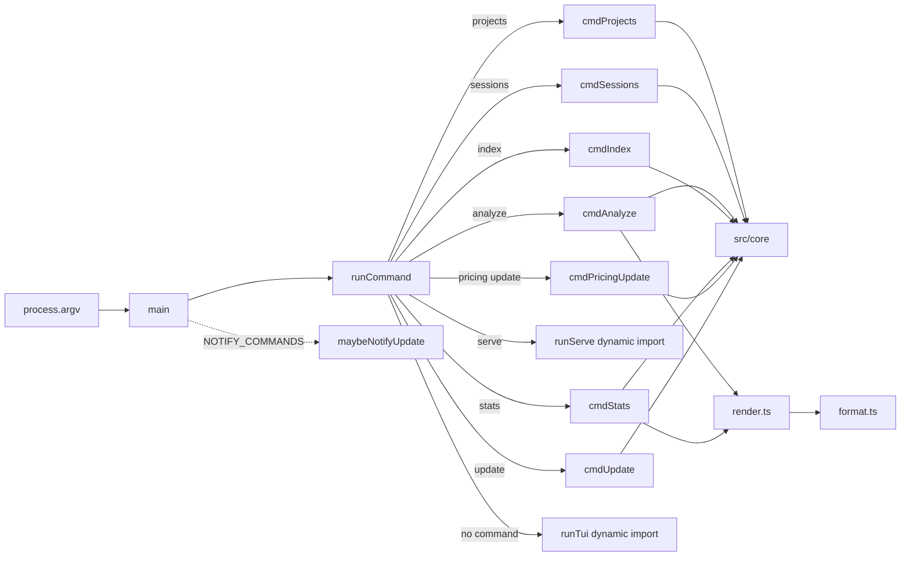

# Command-Line Interface

> Indexed at commit `51ccd4e` on 2026-07-23 · [view on GitHub](https://github.com/yorch/cc-analyzer/tree/51ccd4e)

## Relevant source files

- [src/cli/index.ts](https://github.com/yorch/cc-analyzer/blob/51ccd4e/src/cli/index.ts)
- [src/cli/format.ts](https://github.com/yorch/cc-analyzer/blob/51ccd4e/src/cli/format.ts)
- [src/cli/render.ts](https://github.com/yorch/cc-analyzer/blob/51ccd4e/src/cli/render.ts)

## Overview

The Command-Line Interface (CLI) is the scriptable frontend of `cc-analyzer` and the entrypoint of the compiled binary. [src/cli/index.ts](https://github.com/yorch/cc-analyzer/blob/51ccd4e/src/cli/index.ts) reads `process.argv`, routes the first token to a command handler, and returns a process exit code — the file ends by calling `process.exit(await main())` at [src/cli/index.ts#L279](https://github.com/yorch/cc-analyzer/blob/51ccd4e/src/cli/index.ts#L279). Every handler is a thin wrapper over `src/core`: the CLI parses arguments, invokes a core function, and hands the result to a renderer. It performs no analysis, pricing, or indexing itself.

The subsystem has three modules. [src/cli/index.ts](https://github.com/yorch/cc-analyzer/blob/51ccd4e/src/cli/index.ts) holds the argument router and one `cmd*` function per command. [src/cli/format.ts](https://github.com/yorch/cc-analyzer/blob/51ccd4e/src/cli/format.ts) supplies primitive formatters — currency, counts, byte sizes, durations, relative time — plus a `table` layout helper. [src/cli/render.ts](https://github.com/yorch/cc-analyzer/blob/51ccd4e/src/cli/render.ts) composes those primitives into full text reports for a single session (`renderSessionSummary`) and for portfolio analytics (`renderStats`). Passing `--json` on the commands that support it bypasses the renderers entirely and prints the raw core objects for downstream scripting.

## Architecture

`main` splits `process.argv` into a command and the remaining arguments, then delegates to `runCommand`, whose `switch` maps each command string to a handler at [src/cli/index.ts#L209-L266](https://github.com/yorch/cc-analyzer/blob/51ccd4e/src/cli/index.ts#L209-L266). Handlers call into `src/core`; only `analyze` and `stats` route their human-readable output through the renderers, which in turn depend on `format.ts`. The `serve` and no-command (TUI) branches use dynamic `import()` so the heavier web and Ink dependencies load only when actually invoked.

## Module Layout

| Module | Path | Responsibility |
| ------ | ---- | -------------- |
| `index` | [src/cli/index.ts](https://github.com/yorch/cc-analyzer/blob/51ccd4e/src/cli/index.ts) | Binary entrypoint, argv router, and one handler per command |
| `format` | [src/cli/format.ts](https://github.com/yorch/cc-analyzer/blob/51ccd4e/src/cli/format.ts) | Primitive text formatters and the aligned `table` helper |
| `render` | [src/cli/render.ts](https://github.com/yorch/cc-analyzer/blob/51ccd4e/src/cli/render.ts) | Composes session and portfolio text reports from core data |

Sources: [src/cli/index.ts:L1-L41](https://github.com/yorch/cc-analyzer/blob/51ccd4e/src/cli/index.ts#L1-L41) [src/cli/format.ts:L1-L11](https://github.com/yorch/cc-analyzer/blob/51ccd4e/src/cli/format.ts#L1-L11) [src/cli/render.ts:L1-L20](https://github.com/yorch/cc-analyzer/blob/51ccd4e/src/cli/render.ts#L1-L20)

## Key Components

### Argument router

`main` destructures `process.argv` into `command` and `rest`, calls `runCommand`, and returns its exit code at [src/cli/index.ts#L268-L277](https://github.com/yorch/cc-analyzer/blob/51ccd4e/src/cli/index.ts#L268-L277). `runCommand` derives two shared values before switching: `json` is true when `rest` contains `--json`, and `positional` filters out any argument starting with `--` so handlers can read positional operands cleanly ([src/cli/index.ts#L209-L212](https://github.com/yorch/cc-analyzer/blob/51ccd4e/src/cli/index.ts#L209-L212)). Exit codes are meaningful: `0` for success, `1` for a runtime failure such as a missing session or empty index, and `2` for a usage error such as a missing argument or bad flag.

The `switch` recognizes `version`/`--version`/`-v` (prints `VERSION`), `help`/`--help`/`-h` (prints the `HELP` banner), an `undefined` command that launches the Terminal User Interface (TUI), and a `default` case that reports the unknown command, prints help, and returns exit code `2` ([src/cli/index.ts#L247-L265](https://github.com/yorch/cc-analyzer/blob/51ccd4e/src/cli/index.ts#L247-L265)). The `HELP` string embeds the running `VERSION` and documents every command with its flags ([src/cli/index.ts#L22-L41](https://github.com/yorch/cc-analyzer/blob/51ccd4e/src/cli/index.ts#L22-L41)).

Sources: [src/cli/index.ts:L209-L279](https://github.com/yorch/cc-analyzer/blob/51ccd4e/src/cli/index.ts#L209-L279) [src/cli/index.ts:L22-L41](https://github.com/yorch/cc-analyzer/blob/51ccd4e/src/cli/index.ts#L22-L41)

### Discovery commands: `projects` and `sessions`

`cmdProjects` calls `listProjects()` from the core discovery module and prints an aligned two-column table of session count and truncated project label, followed by a total count ([src/cli/index.ts#L43-L57](https://github.com/yorch/cc-analyzer/blob/51ccd4e/src/cli/index.ts#L43-L57)). When no projects exist under `~/.claude/projects`, it prints a plain message and returns `0`. `cmdSessions` requires a `<projectId>` operand; a missing id returns exit code `2` with guidance to run `cc-analyzer projects`, and an empty project returns `1` ([src/cli/index.ts#L59-L77](https://github.com/yorch/cc-analyzer/blob/51ccd4e/src/cli/index.ts#L59-L77)). Its table renders each session id alongside `formatRelativeTime(s.mtimeMs)` and `formatBytes(s.sizeBytes)`.

Sources: [src/cli/index.ts:L43-L77](https://github.com/yorch/cc-analyzer/blob/51ccd4e/src/cli/index.ts#L43-L77)

### `analyze` — single session

`cmdAnalyze` resolves a session reference through `resolveSessionPath`, which treats an argument ending in `.jsonl` or containing `/` as a filesystem path and otherwise looks the id up across all projects via `findSessionById` ([src/cli/index.ts#L79-L95](https://github.com/yorch/cc-analyzer/blob/51ccd4e/src/cli/index.ts#L79-L95)). It then runs the core pipeline directly: `parseSessionFile` yields events and parse errors, `loadPricing` supplies the pricing table, and `analyzeSession` produces the `SessionAnalysis` ([src/cli/index.ts#L96-L98](https://github.com/yorch/cc-analyzer/blob/51ccd4e/src/cli/index.ts#L96-L98)). With `--json` it prints `JSON.stringify` of the analysis augmented with a `parseErrors` count; otherwise it prints `renderSessionSummary(analysis)` and notes any skipped unparseable lines ([src/cli/index.ts#L100-L106](https://github.com/yorch/cc-analyzer/blob/51ccd4e/src/cli/index.ts#L100-L106)). Unlike `stats` and `serve`, `analyze` reads and parses the raw `.jsonl` file and needs no index.

Sources: [src/cli/index.ts:L79-L107](https://github.com/yorch/cc-analyzer/blob/51ccd4e/src/cli/index.ts#L79-L107)

### `index` — build the SQLite cache

`cmdIndex` opens the database with `openDb`, invokes `reindex(db, { rebuild, onProgress })`, and reports how many sessions were indexed, skipped, and deleted along with an elapsed time in seconds ([src/cli/index.ts#L109-L130](https://github.com/yorch/cc-analyzer/blob/51ccd4e/src/cli/index.ts#L109-L130)). Progress is written to `stderr` with a carriage return so it overwrites in place, throttled to every 200 sessions to avoid flooding the terminal ([src/cli/index.ts#L114-L121](https://github.com/yorch/cc-analyzer/blob/51ccd4e/src/cli/index.ts#L114-L121)). The `--rebuild` flag forces a full re-scan rather than the default incremental pass. `stats`, `serve`, and the TUI all depend on the index this command produces.

Sources: [src/cli/index.ts:L109-L130](https://github.com/yorch/cc-analyzer/blob/51ccd4e/src/cli/index.ts#L109-L130)

### `stats` — portfolio analytics

`cmdStats` builds the shared portfolio shape with `buildPortfolioStats(db, localDayOfMs(Date.now()))` — the same builder that backs the `/api/stats` web endpoint — and returns `1` when the index is empty ([src/cli/index.ts#L132-L141](https://github.com/yorch/cc-analyzer/blob/51ccd4e/src/cli/index.ts#L132-L141)). It then layers terminal-only extras on top: `cacheTtlSplit`, the top ten `analytics.bash` rows, `analytics.tests`, `analytics.retries`, and a `concurrency` headline of `peak` and `parallelDayShare` ([src/cli/index.ts#L142-L153](https://github.com/yorch/cc-analyzer/blob/51ccd4e/src/cli/index.ts#L142-L153)). The composite `view` prints as raw JSON under `--json` or through `renderStats(view)` otherwise ([src/cli/index.ts#L154](https://github.com/yorch/cc-analyzer/blob/51ccd4e/src/cli/index.ts#L154)). The rich analytics behind this command are documented on the [Analytics and Insights](./7-analytics-and-insights.md) page.

Sources: [src/cli/index.ts:L132-L156](https://github.com/yorch/cc-analyzer/blob/51ccd4e/src/cli/index.ts#L132-L156)

### `serve`, `pricing update`, and `update`

The `serve` branch parses an optional `--port=` value, rejecting anything outside the integer range 1–65535 with exit code `2`, reads an optional `--host=`, then dynamically imports `runServe` from the web server module ([src/cli/index.ts#L224-L240](https://github.com/yorch/cc-analyzer/blob/51ccd4e/src/cli/index.ts#L224-L240)). `pricing update` accepts only the `update` sub-token; `cmdPricingUpdate` forces a refresh with `loadPricing({ force: true })` and returns `1` when the source is not `remote`, meaning the remote fetch failed and a cached or bundled table is still in use ([src/cli/index.ts#L158-L170](https://github.com/yorch/cc-analyzer/blob/51ccd4e/src/cli/index.ts#L158-L170)). `cmdUpdate` handles `--check` by comparing `fetchLatestVersion` against `VERSION`, and otherwise runs `performUpdate` with a TTY-only progress callback that writes megabyte counts to `stderr` ([src/cli/index.ts#L172-L204](https://github.com/yorch/cc-analyzer/blob/51ccd4e/src/cli/index.ts#L172-L204)). The update mechanics live on the [Updates and Distribution](./8-updates-and-distribution.md) page.

Sources: [src/cli/index.ts:L158-L204](https://github.com/yorch/cc-analyzer/blob/51ccd4e/src/cli/index.ts#L158-L204) [src/cli/index.ts:L224-L246](https://github.com/yorch/cc-analyzer/blob/51ccd4e/src/cli/index.ts#L224-L246)

### Passive update notice

After `runCommand` returns, `main` fires a best-effort, non-blocking update notice for a curated set of quick commands. `NOTIFY_COMMANDS` contains `projects`, `sessions`, `analyze`, `index`, `stats`, and `pricing`; when the command is in that set and `--json` was not passed, `main` awaits `maybeNotifyUpdate()` before returning the exit code ([src/cli/index.ts#L206-L276](https://github.com/yorch/cc-analyzer/blob/51ccd4e/src/cli/index.ts#L206-L276)). Excluding `--json` keeps machine-readable output clean of the human-facing banner. The notice never changes the exit code — it runs purely for its side effect.

Sources: [src/cli/index.ts:L206-L277](https://github.com/yorch/cc-analyzer/blob/51ccd4e/src/cli/index.ts#L206-L277)

### Formatting primitives

[src/cli/format.ts](https://github.com/yorch/cc-analyzer/blob/51ccd4e/src/cli/format.ts) holds pure, dependency-free formatters. `formatUSD` renders small non-zero amounts to four decimals and everything else to two, preserving sign ([src/cli/format.ts#L3-L10](https://github.com/yorch/cc-analyzer/blob/51ccd4e/src/cli/format.ts#L3-L10)). `formatCount` compacts large numbers into `k`/`M`/`B` suffixes, bucketing on the rounded value so `999_960` renders as `1.0M` rather than `1000.0k` ([src/cli/format.ts#L12-L19](https://github.com/yorch/cc-analyzer/blob/51ccd4e/src/cli/format.ts#L12-L19)). `formatTokens` appends a `+N cache` suffix when cache tokens are present, and `formatBytes`, `formatDuration`, and `formatRelativeTime` cover sizes, elapsed spans, and human-relative timestamps ([src/cli/format.ts#L21-L53](https://github.com/yorch/cc-analyzer/blob/51ccd4e/src/cli/format.ts#L21-L53)). `table` computes per-column widths from headers and rows, then emits a padded header, a dashed separator, and padded rows joined by newlines ([src/cli/format.ts#L55-L61](https://github.com/yorch/cc-analyzer/blob/51ccd4e/src/cli/format.ts#L55-L61)), while `truncate` collapses whitespace and appends an ellipsis past a max length ([src/cli/format.ts#L63-L66](https://github.com/yorch/cc-analyzer/blob/51ccd4e/src/cli/format.ts#L63-L66)).

Sources: [src/cli/format.ts:L1-L66](https://github.com/yorch/cc-analyzer/blob/51ccd4e/src/cli/format.ts#L1-L66)

### Report renderers

`renderSessionSummary` turns a `SessionAnalysis` into a multi-section text report: a header with title, session id, project path, git branches, and Claude Code versions; a Totals table covering cost, turns, API calls, tool calls, tokens, duration, active time, web search/fetch, subagent spend, test runs, and tool-call churn; and a per-token-category cost breakdown ([src/cli/render.ts#L19-L68](https://github.com/yorch/cc-analyzer/blob/51ccd4e/src/cli/render.ts#L19-L68)). It then conditionally emits Models, Tools, Skills, Subagents, files-touched, stop reasons, permission modes, shell commands, and a final per-turn table ([src/cli/render.ts#L70-L121](https://github.com/yorch/cc-analyzer/blob/51ccd4e/src/cli/render.ts#L70-L121)). The permission-modes line appears only when a mode other than plain `default` is present ([src/cli/render.ts#L98-L102](https://github.com/yorch/cc-analyzer/blob/51ccd4e/src/cli/render.ts#L98-L102)).

`renderStats` consumes a `PortfolioView`, the interface that extends `PortfolioStats` with the CLI-only `ttl`, `bash`, `tests`, `retries`, and `concurrency` fields ([src/cli/render.ts#L124-L131](https://github.com/yorch/cc-analyzer/blob/51ccd4e/src/cli/render.ts#L124-L131)). It renders a Portfolio headline table with total cost, session and project counts, date range, token and cache totals, active-time share, duration and cost percentiles, spend concentration, streaks, run rate, subagent spend, cache-write TTL split, test runs, tool-call churn, and parallel-session concurrency ([src/cli/render.ts#L134-L212](https://github.com/yorch/cc-analyzer/blob/51ccd4e/src/cli/render.ts#L134-L212)). Below the headline it appends a bar-chart cost distribution and conditional tables for spend by month, top projects, spend by model, most expensive sessions, top shell commands, and most-retried tools ([src/cli/render.ts#L214-L314](https://github.com/yorch/cc-analyzer/blob/51ccd4e/src/cli/render.ts#L214-L314)).

Sources: [src/cli/render.ts:L19-L315](https://github.com/yorch/cc-analyzer/blob/51ccd4e/src/cli/render.ts#L19-L315)

## Configuration & Extension Points

| Flag | Command | Purpose |
| ---- | ------- | ------- |
| `--json` | `analyze`, `stats` | Emit the raw core object as JSON instead of a rendered report; also suppresses the passive update notice |
| `--rebuild` | `index` | Force a full re-scan instead of the incremental pass |
| `--port=<n>` | `serve` | Bind the web server to an integer port 1–65535; invalid values exit with code `2` |
| `--host=<h>` | `serve` | Bind address for the web server |
| `--check` | `update` | Report whether a newer release exists without installing it |

Sources: [src/cli/index.ts:L209-L246](https://github.com/yorch/cc-analyzer/blob/51ccd4e/src/cli/index.ts#L209-L246)

## Related Pages

- Core pipeline consumed by every handler: [Core Analysis Engine](./2-core-analysis-engine.md)
- Launched by the no-command branch: [Terminal User Interface](./4-tui.md)
- Launched by `serve`: [Web Server and API](./5-web-server-and-api.md)
- Analytics behind `stats`: [Analytics and Insights](./7-analytics-and-insights.md)
- Mechanics behind `update` and `pricing update`: [Updates and Distribution](./8-updates-and-distribution.md)
