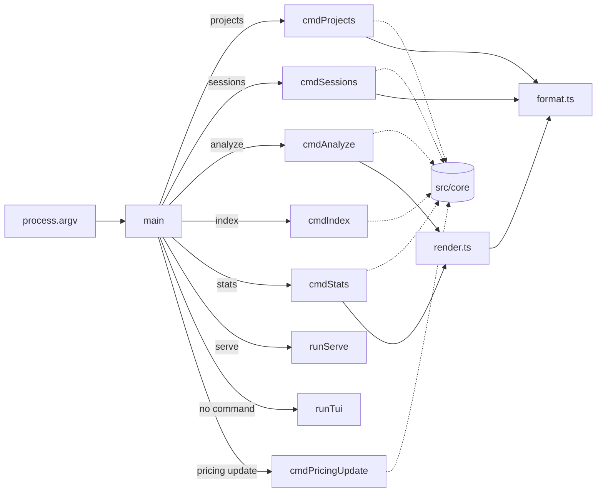

# Command-Line Interface

> Indexed at commit `4eeed24` on 2026-07-10 · [view on GitHub](https://github.com/yorch/cc-analyzer/tree/4eeed24)

## Relevant source files

- [src/cli/index.ts](https://github.com/yorch/cc-analyzer/blob/4eeed24/src/cli/index.ts)
- [src/cli/format.ts](https://github.com/yorch/cc-analyzer/blob/4eeed24/src/cli/format.ts)
- [src/cli/render.ts](https://github.com/yorch/cc-analyzer/blob/4eeed24/src/cli/render.ts)

## Overview

The command-line interface is the executable entry point for `cc-analyzer`. It parses `process.argv`, routes the first argument to a command handler, and prints results to standard output. The file [src/cli/index.ts](https://github.com/yorch/cc-analyzer/blob/4eeed24/src/cli/index.ts) carries the `#!/usr/bin/env bun` shebang and is the binary registered as `bin` in the package manifest, so invoking `cc-analyzer` runs `main()` directly.

The CLI is a thin presentation layer over the analysis core. Each command handler calls into `src/core` functions — session discovery, parsing, per-session analysis, index management, portfolio statistics, and pricing — then hands the returned data structures to formatting helpers for terminal display. Two handlers escape this pattern by dynamically importing sibling subsystems: `serve` loads the web server and the no-argument invocation loads the interactive Terminal User Interface (TUI). Every human-readable command also has a `--json` counterpart that emits the raw core objects for scripting, defined in [src/cli/index.ts#L154](https://github.com/yorch/cc-analyzer/blob/4eeed24/src/cli/index.ts#L154).

Sources: [src/cli/index.ts:L1-L34](https://github.com/yorch/cc-analyzer/blob/4eeed24/src/cli/index.ts#L1-L34) [src/cli/render.ts:L1-L16](https://github.com/yorch/cc-analyzer/blob/4eeed24/src/cli/render.ts#L1-L16)

## Architecture

The `main` function is a `switch` over the command word that dispatches to one handler per command. Handlers backed by the analysis core (dashed arrows) return their data through the render and format helpers, while `serve` and the no-command path branch out to the web and TUI subsystems via dynamic `import`. Every handler returns a numeric exit code that `main` propagates.

Sources: [src/cli/index.ts:L152-L196](https://github.com/yorch/cc-analyzer/blob/4eeed24/src/cli/index.ts#L152-L196)

## Module Layout

| Module | Path | Responsibility |
| ------ | ---- | -------------- |
| `index` | [src/cli/index.ts](https://github.com/yorch/cc-analyzer/blob/4eeed24/src/cli/index.ts) | Binary entry point, argv parsing, command routing, per-command handlers |
| `format` | [src/cli/format.ts](https://github.com/yorch/cc-analyzer/blob/4eeed24/src/cli/format.ts) | Value formatters and aligned text-table rendering |
| `render` | [src/cli/render.ts](https://github.com/yorch/cc-analyzer/blob/4eeed24/src/cli/render.ts) | Composes full text reports for session analysis and portfolio stats |

Sources: [src/cli/index.ts:L1-L16](https://github.com/yorch/cc-analyzer/blob/4eeed24/src/cli/index.ts#L1-L16) [src/cli/format.ts:L1-L54](https://github.com/yorch/cc-analyzer/blob/4eeed24/src/cli/format.ts#L1-L54) [src/cli/render.ts:L1-L10](https://github.com/yorch/cc-analyzer/blob/4eeed24/src/cli/render.ts#L1-L10)

## Command Routing

The `main` function destructures the command word and the remaining arguments from `process.argv`, computes a `json` flag from the presence of `--json`, and filters positional arguments by excluding anything starting with `--`. It then switches on the command word to reach the matching handler. The module ends with `process.exit(await main())`, so the handler's return value becomes the process exit code.

Exit codes follow a small convention: `0` for success, `1` for a missing resource such as an unfound session or empty index, and `2` for a usage error such as a missing required argument or an unknown command. The `default` case and the `pricing` sub-verb both print help or usage text and return `2`, while `help`, `--help`, and `-h` print the `HELP` banner and return `0`.

Sources: [src/cli/index.ts:L152-L196](https://github.com/yorch/cc-analyzer/blob/4eeed24/src/cli/index.ts#L152-L196) [src/cli/index.ts:L18-L34](https://github.com/yorch/cc-analyzer/blob/4eeed24/src/cli/index.ts#L18-L34)

## Key Components

### `cmdProjects` and `cmdSessions`

`cmdProjects` calls `listProjects()` and renders a two-column table of session count and truncated project label, printing a `No projects found` message and returning `0` when the list is empty. `cmdSessions` requires a `projectId` positional argument — it returns `2` when the argument is missing and `1` when the project has no sessions — then renders session id, relative modification time, and size for each session via `listSessions(projectId)`. Both are defined at [src/cli/index.ts#L36](https://github.com/yorch/cc-analyzer/blob/4eeed24/src/cli/index.ts#L36) and [src/cli/index.ts#L52](https://github.com/yorch/cc-analyzer/blob/4eeed24/src/cli/index.ts#L52).

Sources: [src/cli/index.ts:L36-L70](https://github.com/yorch/cc-analyzer/blob/4eeed24/src/cli/index.ts#L36-L70)

### `resolveSessionPath` and `cmdAnalyze`

`resolveSessionPath` accepts a session reference and resolves it to a file path. When the reference ends in `.jsonl` or contains a `/`, it is treated as a filesystem path and returned only if `Bun.file(ref).exists()`; otherwise it is treated as a session UUID and resolved through `findSessionById(ref)`, which searches across all projects. This lets `analyze` accept either a raw transcript path or a bare id.

`cmdAnalyze` resolves the reference, parses the transcript with `parseSessionFile(path)`, loads the pricing table via `loadPricing()`, and produces a `SessionAnalysis` from `analyzeSession(events, pricing)`. With `--json` it prints the analysis object plus a `parseErrors` count as pretty JSON; otherwise it prints `renderSessionSummary(analysis)` and a trailing note counting any unparseable lines skipped.

Sources: [src/cli/index.ts:L72-L100](https://github.com/yorch/cc-analyzer/blob/4eeed24/src/cli/index.ts#L72-L100)

### `cmdIndex`

`cmdIndex` opens the SQLite database with `openDb()` and calls `reindex(db, { rebuild, onProgress })`. The progress callback writes a throttled `indexing done/total...` line to standard error, updating only when a batch completes or at least 200 sessions have been processed since the last update. After closing the database it prints a summary of indexed, skipped, and deleted counts with the elapsed seconds. The `--rebuild` flag is passed through from `rest.includes("--rebuild")` in the router.

Sources: [src/cli/index.ts:L102-L123](https://github.com/yorch/cc-analyzer/blob/4eeed24/src/cli/index.ts#L102-L123) [src/cli/index.ts:L164-L165](https://github.com/yorch/cc-analyzer/blob/4eeed24/src/cli/index.ts#L164-L165)

### `cmdStats`

`cmdStats` opens the database and computes a `portfolioSummary(db)`. When the summary reports zero sessions it closes the database, prints a prompt to run `cc-analyzer index` first, and returns `1`. Otherwise it assembles a view object combining the summary with `spendByMonth`, `spendByProject`, `spendByModel`, and `topSessions`, then prints either that object as JSON or the text report from `renderStats(view)`.

Sources: [src/cli/index.ts:L125-L143](https://github.com/yorch/cc-analyzer/blob/4eeed24/src/cli/index.ts#L125-L143)

### `cmdPricingUpdate`

`cmdPricingUpdate` forces a pricing refresh with `loadPricing({ force: true })` and reports the source and model count. It returns `0` when the source is `remote` and `1` otherwise, so a fall back to bundled or cached pricing surfaces as a non-zero exit code. The `pricing` command word only reaches this handler when its first positional argument is `update`; any other value prints a usage line and returns `2`.

Sources: [src/cli/index.ts:L145-L150](https://github.com/yorch/cc-analyzer/blob/4eeed24/src/cli/index.ts#L145-L150) [src/cli/index.ts:L175-L178](https://github.com/yorch/cc-analyzer/blob/4eeed24/src/cli/index.ts#L175-L178)

### `serve` and the no-command TUI

The `serve` case parses an optional `--port=` argument, dynamically imports `runServe` from [src/web/server.ts](https://github.com/yorch/cc-analyzer/blob/4eeed24/src/web/server.ts), awaits it, and returns `0`. When no command word is present, `main` dynamically imports `runTui` from [src/tui/run.tsx](https://github.com/yorch/cc-analyzer/blob/4eeed24/src/tui/run.tsx) and launches the interactive interface. Deferring these imports keeps the web and TUI dependency trees out of the fast scriptable commands.

Sources: [src/cli/index.ts:L168-L183](https://github.com/yorch/cc-analyzer/blob/4eeed24/src/cli/index.ts#L168-L183)

### Formatting helpers

[src/cli/format.ts](https://github.com/yorch/cc-analyzer/blob/4eeed24/src/cli/format.ts) provides the shared value formatters. `formatUSD` prints currency with extra precision for sub-cent amounts, `formatCount` abbreviates large numbers with `k` and `M` suffixes, `formatBytes` scales to KB and MB, `formatDuration` renders millisecond spans as `s`/`m`/`h`, and `formatRelativeTime` converts a modification timestamp into phrases like `5m ago` or an ISO date past 30 days. The `table` function computes per-column widths and pads cells into an aligned, two-space-separated grid with a dashed separator row, and `truncate` collapses whitespace and clips strings with an ellipsis.

Sources: [src/cli/format.ts:L1-L54](https://github.com/yorch/cc-analyzer/blob/4eeed24/src/cli/format.ts#L1-L54)

### Report renderers

[src/cli/render.ts](https://github.com/yorch/cc-analyzer/blob/4eeed24/src/cli/render.ts) turns core data structures into multi-section text reports. `renderSessionSummary` builds a `SessionAnalysis` report: a header with title, session id, project path, git branches and CC versions, followed by tables for totals, cost by token category, per-model usage sorted by cost, tool counts sorted by frequency, and a per-turn breakdown. `renderStats` renders the `PortfolioView` — a portfolio summary table plus conditional sections for spend by month, top projects, spend by model, and the most expensive sessions. Both compose their output exclusively from the `table` and value helpers in `format.ts`, so all terminal alignment lives in one place.

Sources: [src/cli/render.ts:L18-L92](https://github.com/yorch/cc-analyzer/blob/4eeed24/src/cli/render.ts#L18-L92) [src/cli/render.ts:L94-L181](https://github.com/yorch/cc-analyzer/blob/4eeed24/src/cli/render.ts#L94-L181)

## Configuration & Extension Points

| Command | Flag / Argument | Default | Purpose |
| ------- | --------------- | ------- | ------- |
| `analyze` | `<id\|path>` | required | Session UUID resolved across projects, or a `.jsonl` transcript path |
| `analyze` / `stats` | `--json` | text output | Emit the raw analysis or stats object as pretty JSON |
| `index` | `--rebuild` | incremental | Rebuild the index from scratch instead of refreshing it |
| `serve` | `--port=<n>` | undefined (server default) | Port for the local web application |
| `sessions` | `<projectId>` | required | Project whose sessions are listed |
| `pricing` | `update` | — | Sub-verb that forces a pricing cache refresh |

Sources: [src/cli/index.ts:L152-L193](https://github.com/yorch/cc-analyzer/blob/4eeed24/src/cli/index.ts#L152-L193) [src/cli/index.ts:L18-L34](https://github.com/yorch/cc-analyzer/blob/4eeed24/src/cli/index.ts#L18-L34)

## Related Pages

- Core analysis engine: [Core Analysis Engine](./2-core-analysis-engine.md)
- Terminal UI: [TUI](./4-tui.md)
- Web server and API: [Web Server and API](./5-web-server-and-api.md)
- Web SPA frontend: [Web SPA Frontend](./6-web-spa-frontend.md)
