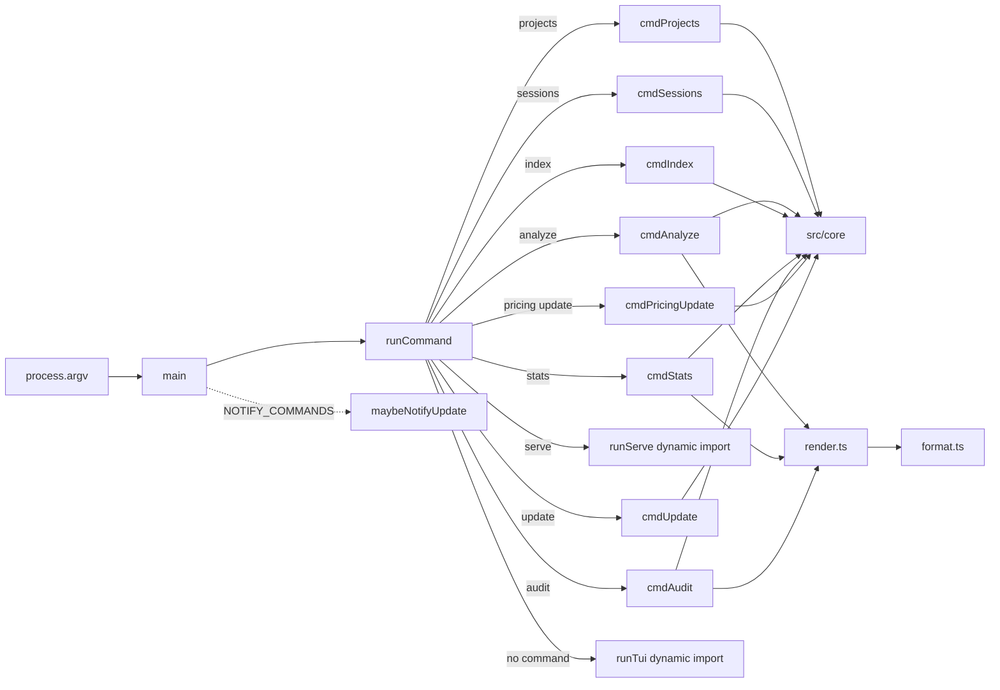

# Command-Line Interface

> Indexed at commit `51ccd4e` on 2026-07-23 · [view on GitHub](https://github.com/yorch/cc-analyzer/tree/51ccd4e)

## Relevant source files

- [src/cli/index.ts](https://github.com/yorch/cc-analyzer/blob/51ccd4e/src/cli/index.ts)
- [src/cli/format.ts](https://github.com/yorch/cc-analyzer/blob/51ccd4e/src/cli/format.ts)
- [src/cli/render.ts](https://github.com/yorch/cc-analyzer/blob/51ccd4e/src/cli/render.ts)

## Overview

The Command-Line Interface (CLI) is the scriptable frontend of `cc-analyzer` and the entrypoint of the compiled binary. [src/cli/index.ts](https://github.com/yorch/cc-analyzer/blob/51ccd4e/src/cli/index.ts) reads `process.argv`, routes the first token to a command handler, and returns a process exit code — the file ends by calling `process.exit(await main())` at [src/cli/index.ts#L279](https://github.com/yorch/cc-analyzer/blob/51ccd4e/src/cli/index.ts#L279). Every handler is a thin wrapper over `src/core`: the CLI parses arguments, invokes a core function, and hands the result to a renderer. It performs no analysis, pricing, or indexing itself.

The subsystem has three modules. [src/cli/index.ts](https://github.com/yorch/cc-analyzer/blob/51ccd4e/src/cli/index.ts) holds the argument router and one `cmd*` function per command. [src/cli/format.ts](https://github.com/yorch/cc-analyzer/blob/51ccd4e/src/cli/format.ts) supplies primitive formatters — currency, counts, byte sizes, durations, relative time — plus a `table` layout helper. [src/cli/render.ts](https://github.com/yorch/cc-analyzer/blob/51ccd4e/src/cli/render.ts) composes those primitives into full text reports for a single session (`renderSessionSummary`), for portfolio analytics (`renderStats`), for the setup audit (`renderSetupAudit`), and for the portfolio insights (`renderPortfolioInsights`). Passing `--json` on the commands that support it bypasses the renderers entirely and prints the raw core objects for downstream scripting.

## Architecture

```mermaid
flowchart LR
    argv[process.argv] --> main
    main --> runCommand
    runCommand -->|projects| cmdProjects
    runCommand -->|sessions| cmdSessions
    runCommand -->|analyze| cmdAnalyze
    runCommand -->|index| cmdIndex
    runCommand -->|stats| cmdStats
    runCommand -->|audit| cmdAudit
    runCommand -->|serve| runServe[runServe dynamic import]
    runCommand -->|pricing update| cmdPricingUpdate
    runCommand -->|update| cmdUpdate
    runCommand -->|no command| runTui[runTui dynamic import]
    main -.NOTIFY_COMMANDS.-> maybeNotifyUpdate

    cmdProjects & cmdSessions & cmdAnalyze & cmdIndex & cmdStats & cmdAudit & cmdPricingUpdate & cmdUpdate --> core[src/core]
    cmdAnalyze --> render[render.ts]
    cmdStats --> render
    cmdAudit --> render
    render --> format[format.ts]
```

`main` splits `process.argv` into a command and the remaining arguments, then delegates to `runCommand`, whose `switch` maps each command string to a handler at [src/cli/index.ts#L209-L266](https://github.com/yorch/cc-analyzer/blob/51ccd4e/src/cli/index.ts#L209-L266). Handlers call into `src/core`; only `analyze`, `stats`, `audit`, and `insights` route their human-readable output through the renderers, which in turn depend on `format.ts`. The `serve` and no-command (TUI) branches use dynamic `import()` so the heavier web and Ink dependencies load only when actually invoked.

## Module Layout

| Module | Path | Responsibility |
| ------ | ---- | -------------- |
| `index` | [src/cli/index.ts](https://github.com/yorch/cc-analyzer/blob/51ccd4e/src/cli/index.ts) | Binary entrypoint, argv router, and one handler per command |
| `format` | [src/cli/format.ts](https://github.com/yorch/cc-analyzer/blob/51ccd4e/src/cli/format.ts) | Primitive text formatters and the aligned `table` helper |
| `render` | [src/cli/render.ts](https://github.com/yorch/cc-analyzer/blob/51ccd4e/src/cli/render.ts) | Composes session, portfolio, and setup-audit text reports from core data |

Sources: [src/cli/index.ts:L1-L41](https://github.com/yorch/cc-analyzer/blob/51ccd4e/src/cli/index.ts#L1-L41) [src/cli/format.ts:L1-L11](https://github.com/yorch/cc-analyzer/blob/51ccd4e/src/cli/format.ts#L1-L11) [src/cli/render.ts:L1-L20](https://github.com/yorch/cc-analyzer/blob/51ccd4e/src/cli/render.ts#L1-L20)

## Key Components

### Argument router

`main` destructures `process.argv` into `command` and `rest`, calls `runCommand`, and returns its exit code at [src/cli/index.ts#L268-L277](https://github.com/yorch/cc-analyzer/blob/51ccd4e/src/cli/index.ts#L268-L277). `runCommand` derives two shared values before switching: `json` is true when `rest` contains `--json`, and `positional` filters out any argument starting with `--` so handlers can read positional operands cleanly ([src/cli/index.ts#L209-L212](https://github.com/yorch/cc-analyzer/blob/51ccd4e/src/cli/index.ts#L209-L212)). Exit codes are meaningful: `0` for success, `1` for a runtime failure such as a missing session or empty index, and `2` for a usage error such as a missing argument or bad flag.

The `switch` recognizes `version`/`--version`/`-v` (prints `VERSION`), `help`/`--help`/`-h` (prints the `HELP` banner), an `undefined` command that launches the Terminal User Interface (TUI), and a `default` case that reports the unknown command, prints help, and returns exit code `2` ([src/cli/index.ts#L247-L265](https://github.com/yorch/cc-analyzer/blob/51ccd4e/src/cli/index.ts#L247-L265)). The `HELP` string embeds the running `VERSION` and documents every command with its flags ([src/cli/index.ts#L22-L41](https://github.com/yorch/cc-analyzer/blob/51ccd4e/src/cli/index.ts#L22-L41)).

Sources: [src/cli/index.ts:L209-L279](https://github.com/yorch/cc-analyzer/blob/51ccd4e/src/cli/index.ts#L209-L279) [src/cli/index.ts:L22-L41](https://github.com/yorch/cc-analyzer/blob/51ccd4e/src/cli/index.ts#L22-L41)

### Discovery commands: `projects` and `sessions`

`cmdProjects` calls `listProjects()` from the core discovery module and prints an aligned two-column table of session count and truncated project label, followed by a total count ([src/cli/index.ts#L43-L57](https://github.com/yorch/cc-analyzer/blob/51ccd4e/src/cli/index.ts#L43-L57)). When no projects exist under `~/.claude/projects`, it prints a plain message and returns `0`. `cmdSessions` requires a `<projectId>` operand; a missing id returns exit code `2` with guidance to run `cc-analyzer projects`, and an empty project returns `1` ([src/cli/index.ts#L59-L77](https://github.com/yorch/cc-analyzer/blob/51ccd4e/src/cli/index.ts#L59-L77)). Its table renders each session id alongside `formatRelativeTime(s.mtimeMs)` and `formatBytes(s.sizeBytes)`.

Sources: [src/cli/index.ts:L43-L77](https://github.com/yorch/cc-analyzer/blob/51ccd4e/src/cli/index.ts#L43-L77)

### `analyze` — single session

`cmdAnalyze` resolves a session reference through `resolveSessionPath`, which treats an argument ending in `.jsonl` or containing `/` as a filesystem path and otherwise looks the id up across all projects via `findSessionById` ([src/cli/index.ts#L79-L95](https://github.com/yorch/cc-analyzer/blob/51ccd4e/src/cli/index.ts#L79-L95)). It then runs the core pipeline directly: `parseSessionFile` yields events and parse errors, `loadPricing` supplies the pricing table, and `analyzeSession` produces the `SessionAnalysis` ([src/cli/index.ts#L96-L98](https://github.com/yorch/cc-analyzer/blob/51ccd4e/src/cli/index.ts#L96-L98)). With `--json` it prints `JSON.stringify` of the analysis augmented with a `parseErrors` count; otherwise it prints `renderSessionSummary(analysis, { color })` and, when anything was not fully understood, closes with the session's parse coverage — unparseable lines skipped, lines kept as tolerant "unknown" events, and the total line count. Color is enabled only when stdout is a terminal and `NO_COLOR` is absent, so redirected reports remain plain text. Unlike `stats` and `serve`, `analyze` reads and parses the raw `.jsonl` file and needs no index.

Sources: [src/cli/index.ts:L79-L107](https://github.com/yorch/cc-analyzer/blob/51ccd4e/src/cli/index.ts#L79-L107)

### `index` — build the SQLite cache

`cmdIndex` opens the database with `openDb`, invokes `reindex(db, { rebuild, onProgress })`, and reports how many sessions were indexed, skipped, and deleted along with an elapsed time in seconds ([src/cli/index.ts#L109-L130](https://github.com/yorch/cc-analyzer/blob/51ccd4e/src/cli/index.ts#L109-L130)). Progress is written to `stderr` with a carriage return so it overwrites in place, throttled to every 200 sessions to avoid flooding the terminal ([src/cli/index.ts#L114-L121](https://github.com/yorch/cc-analyzer/blob/51ccd4e/src/cli/index.ts#L114-L121)). The `--rebuild` flag forces a full re-scan rather than the default incremental pass. `--check` performs a metadata-only source comparison and exits non-zero when sessions were added, changed, or deleted, without mutating the cache; it then prints one line of portfolio **parse coverage** — the share of indexed lines this build of the parser fully understood, with unreadable and unknown-event counts, and an `cc-analyzer update` prompt when the share crosses the drift threshold. That line is read straight off the indexed rows with a single SQL scan, so `--check` still parses no session content. Each successful scan records `last_scan_at`.

`stats`, `serve`, and the TUI read this index. The interactive frontends bootstrap it automatically when empty; a populated index is not refreshed implicitly. `stats` reports its exact freshness status in both human and JSON output.

Sources: [src/cli/index.ts:L109-L130](https://github.com/yorch/cc-analyzer/blob/51ccd4e/src/cli/index.ts#L109-L130)

### `stats` — portfolio analytics

`cmdStats` builds the shared portfolio shape with `buildPortfolioStats(db, localDayOfMs(Date.now()))` — the same builder that backs the `/api/stats` web endpoint — and returns `1` when the index is empty ([src/cli/index.ts#L132-L141](https://github.com/yorch/cc-analyzer/blob/51ccd4e/src/cli/index.ts#L132-L141)). It then layers terminal-only extras on top: `cacheTtlSplit`, the top ten `analytics.bash` rows, `analytics.tests`, `analytics.retries`, and a `concurrency` headline of `peak` and `parallelDayShare` ([src/cli/index.ts#L142-L153](https://github.com/yorch/cc-analyzer/blob/51ccd4e/src/cli/index.ts#L142-L153)). The composite `view` prints as raw JSON under `--json` or through `renderStats(view, { color })` otherwise. As with `analyze`, styling is TTY-only and honors `NO_COLOR`, leaving pipes and redirected output ANSI-free. The rich analytics behind this command are documented on the [Analytics and Insights](./7-analytics-and-insights.md) page.

Sources: [src/cli/index.ts:L132-L156](https://github.com/yorch/cc-analyzer/blob/51ccd4e/src/cli/index.ts#L132-L156)

### `audit` — setup audit

`cmdAudit` is the one command that reads *configuration* rather than transcripts. It scans the Claude dir with `scanInventory()` (`src/core/inventory.ts`) for installed skills, subagents, plugins, MCP servers, hooks, and permission rules, pulls observed usage from the index with `analyticsRollup(db)`, and cross-references the two through the bun-free `buildSetupAudit(inventory, usage, today)` (`src/core/setup-audit.ts`). It returns `1` when the index is empty — with no observed usage every installed item would be reported as unused — and otherwise prints `renderSetupAudit(audit, { color })`, or the raw `SetupAudit` under `--json`. The audit rules and their thresholds are documented on the [Analytics and Insights](./7-analytics-and-insights.md) page.

Sources: [src/cli/index.ts](https://github.com/yorch/cc-analyzer/blob/51ccd4e/src/cli/index.ts) [src/core/inventory.ts](https://github.com/yorch/cc-analyzer/blob/51ccd4e/src/core/inventory.ts) [src/core/setup-audit.ts](https://github.com/yorch/cc-analyzer/blob/51ccd4e/src/core/setup-audit.ts)

### `insights` — portfolio insights

`cmdInsights` is the CLI face of the portfolio rules engine. It refuses on an empty index (exit `1`, like `stats` and `audit`), assembles every portfolio signal with `assemblePortfolioSignals(db, pricing)` (`src/core/portfolio-signals.ts` — the same assembler the web `/api/insights` route and the TUI insights screen use, so all three feed the rules identical inputs), and folds them through the bun-free `buildPortfolioDiagnostics(signals)` (`src/core/portfolio-diagnostics.ts`). The ranked findings print through `renderPortfolioInsights` — warnings first, each with its evidence, an optional project line, and a muted `Next:` action — or as the raw `PortfolioDiagnostic[]` under `--json`. When nothing crosses a threshold it prints an explicit "No findings — the portfolio looks healthy by every rule (13 rules checked)" line rather than nothing. The rule table and thresholds are documented on the [Analytics and Insights](./7-analytics-and-insights.md) page.

Sources: [src/cli/index.ts](https://github.com/yorch/cc-analyzer/blob/51ccd4e/src/cli/index.ts) [src/core/portfolio-diagnostics.ts](https://github.com/yorch/cc-analyzer/blob/51ccd4e/src/core/portfolio-diagnostics.ts) [src/core/portfolio-signals.ts](https://github.com/yorch/cc-analyzer/blob/51ccd4e/src/core/portfolio-signals.ts)

### `cost-basis` — dollar framing preference

`cmdCostBasis` (mirroring `cmdTelemetry`'s on/off/status shape) reads or writes the persisted cost-basis preference from `src/core/prefs.ts`. `cc-analyzer cost-basis` with no argument prints the current value; `cc-analyzer cost-basis api` or `cc-analyzer cost-basis subscription` sets it and confirms. The preference never changes how a dollar figure is *computed* — costs are always tokens × API rates — only how it's *framed*: `api` (the default) reads as a bill, `subscription` reframes the same numbers as API-equivalent value for flat-plan Pro/Max users who aren't billed per token. `cmdStats` reads the current basis and threads it into `renderStats`, which prints the canonical framing note (from the bun-free `src/core/cost-framing.ts`) near the top of the report when the basis is `subscription`, and folds the same wording into the run-rate line so a "projected" figure doesn't read as a bill. The TUI and web app read the same preference at their own presentation boundaries; see [Web Server and API](./5-web-server-and-api.md) and [Web SPA Frontend](./6-web-spa-frontend.md).

### `serve`, `pricing update`, and `update`

The `serve` branch parses `--port=` and `--host=`, plus `--refresh` to run an incremental index update before binding and `--open` to launch the browser after binding. Browser launch is best-effort and restricted to loopback hosts. Invalid ports return exit code `2`, and the web server is dynamically imported so web dependencies stay out of other command startup paths. `pricing update` accepts only the `update` sub-token; `cmdPricingUpdate` forces a refresh with `loadPricing({ force: true })` and returns `1` when the source is not `remote`, meaning the remote fetch failed and a cached or bundled table is still in use ([src/cli/index.ts#L158-L170](https://github.com/yorch/cc-analyzer/blob/51ccd4e/src/cli/index.ts#L158-L170)). `cmdUpdate` handles `--check` by comparing `fetchLatestVersion` against `VERSION`, and otherwise runs `performUpdate` with a TTY-only progress callback that writes megabyte counts to `stderr` ([src/cli/index.ts#L172-L204](https://github.com/yorch/cc-analyzer/blob/51ccd4e/src/cli/index.ts#L172-L204)). The update mechanics live on the [Updates and Distribution](./8-updates-and-distribution.md) page.

Sources: [src/cli/index.ts:L158-L204](https://github.com/yorch/cc-analyzer/blob/51ccd4e/src/cli/index.ts#L158-L204) [src/cli/index.ts:L224-L246](https://github.com/yorch/cc-analyzer/blob/51ccd4e/src/cli/index.ts#L224-L246)

### Passive update notice

After `runCommand` returns, `main` fires a best-effort, non-blocking update notice for a curated set of quick commands. `NOTIFY_COMMANDS` contains `projects`, `sessions`, `analyze`, `index`, `stats`, `audit`, `insights`, and `pricing`; when the command is in that set and `--json` was not passed, `main` awaits `maybeNotifyUpdate()` before returning the exit code ([src/cli/index.ts#L206-L276](https://github.com/yorch/cc-analyzer/blob/51ccd4e/src/cli/index.ts#L206-L276)). Excluding `--json` keeps machine-readable output clean of the human-facing banner. Before process exit, `main` also awaits the bounded `flushTelemetry()` drain introduced for reliable delivery by quick commands; it never changes the command result and waits at most briefly for already-pending events.

Sources: [src/cli/index.ts:L206-L277](https://github.com/yorch/cc-analyzer/blob/51ccd4e/src/cli/index.ts#L206-L277)

### Formatting primitives

[src/cli/format.ts](https://github.com/yorch/cc-analyzer/blob/51ccd4e/src/cli/format.ts) holds pure, dependency-free formatters. `formatUSD` renders small non-zero amounts to four decimals and everything else to two, preserving sign ([src/cli/format.ts#L3-L10](https://github.com/yorch/cc-analyzer/blob/51ccd4e/src/cli/format.ts#L3-L10)). `formatCount` compacts large numbers into `k`/`M`/`B` suffixes, bucketing on the rounded value so `999_960` renders as `1.0M` rather than `1000.0k` ([src/cli/format.ts#L12-L19](https://github.com/yorch/cc-analyzer/blob/51ccd4e/src/cli/format.ts#L12-L19)). `formatTokens` appends a `+N cache` suffix when cache tokens are present, and `formatBytes`, `formatDuration`, and `formatRelativeTime` cover sizes, elapsed spans, and human-relative timestamps ([src/cli/format.ts#L21-L53](https://github.com/yorch/cc-analyzer/blob/51ccd4e/src/cli/format.ts#L21-L53)). `table` computes per-column widths from headers and rows, then emits a padded header, dashed separator, and rows; its optional `align` array right-aligns numeric columns while text remains left-aligned. `truncate` collapses whitespace and appends an ellipsis past a max length.

Sources: [src/cli/format.ts:L1-L66](https://github.com/yorch/cc-analyzer/blob/51ccd4e/src/cli/format.ts#L1-L66)

### Report renderers

`renderSessionSummary` turns a `SessionAnalysis` into a multi-section text report: a branded title and muted identity line; a Totals table covering cost, turns, API calls, tool calls, tokens, duration, active time, web search/fetch, subagent spend, test runs, and tool-call churn; and a per-token-category cost breakdown. It then conditionally emits Models, Tools, a Skills table (uses, attributed turns, and the turn-scoped `turn $` cost, closed by the shared `SKILL_COST_CAVEAT`), Subagents, files-touched, stop reasons, permission modes, shell commands, and a final per-turn table. Section markers and numeric alignment match the portfolio report, while color remains an injected rendering option rather than a core-data concern. The permission-modes line appears only when a mode other than plain `default` is present.

`renderStats` consumes a `PortfolioView`, the interface that extends `PortfolioStats` with the CLI-only `ttl`, `bash`, `tests`, `retries`, `concurrency`, `contextTax`, and `whatIf` fields. It leads with a compact portfolio headline—total spend, session/project counts, date range, tokens, and active time—then separates the dense metrics into **Activity** and **Efficiency & reliability** tables. Below those it appends a block-character session-cost distribution and conditional, numerically aligned tables for spend by month, top projects, spend by model, **what-if model repricing** (each model's actual token mix at the other models' rates, with the cheapest-single-model headline and the "different model, different tokens; quality not priced in" caveat), **context tax** (per-project median/p90/average tokens consumed before the user types, with the heuristic caveat), most expensive sessions, top shell commands, and most-retried tools. A read-only/local footer closes the human report. `--json` bypasses this presentation layer entirely, so the machine-readable contract is unchanged.

`renderSetupAudit` renders a `SetupAudit`: a title with the scanned Claude dir, an **Inventory** table (skills, subagents, plugins, MCP servers with their global/project split, hooks, permission rules, pinned model), and a **Findings** block that lists warnings before info-level items in the `session-diagnostics` style — title, evidence, then a muted `Next:` action. The mandatory machine-local/historical caveat (`SETUP_AUDIT_CAVEAT`, exported from core so every surface prints the same words) closes the report. `renderPortfolioInsights` renders the ranked `PortfolioDiagnostic[]` in the same style — warnings first, evidence, project line when scoped, `Next:` action — with an explicit healthy line naming the rule count when nothing fired.

Sources: [src/cli/render.ts:L19-L315](https://github.com/yorch/cc-analyzer/blob/51ccd4e/src/cli/render.ts#L19-L315)

## Configuration & Extension Points

| Flag | Command | Purpose |
| ---- | ------- | ------- |
| `--json` | `analyze`, `stats`, `audit`, `insights` | Emit the raw core object as JSON instead of a rendered report; also suppresses the passive update notice |
| `--rebuild` | `index` | Force a full re-scan instead of the incremental pass |
| `--check` | `index` | Compare source metadata with the cache without changing it; exit non-zero when stale |
| `--port=<n>` | `serve` | Bind the web server to an integer port 1–65535; invalid values exit with code `2` |
| `--host=<h>` | `serve` | Bind address for the web server |
| `--refresh` | `serve` | Incrementally refresh the index before starting the server |
| `--open` | `serve` | Open the served URL in the default browser when bound to loopback |
| `--check` | `update` | Report whether a newer release exists without installing it |
| `NO_COLOR` | `analyze`, `stats`, `audit`, `insights` | Disable ANSI styling even when stdout is an interactive terminal |

Sources: [src/cli/index.ts:L209-L246](https://github.com/yorch/cc-analyzer/blob/51ccd4e/src/cli/index.ts#L209-L246)

## Related Pages

- Core pipeline consumed by every handler: [Core Analysis Engine](./2-core-analysis-engine.md)
- Launched by the no-command branch: [Terminal User Interface](./4-tui.md)
- Launched by `serve`: [Web Server and API](./5-web-server-and-api.md)
- Analytics behind `stats`: [Analytics and Insights](./7-analytics-and-insights.md)
- Mechanics behind `update` and `pricing update`: [Updates and Distribution](./8-updates-and-distribution.md)
