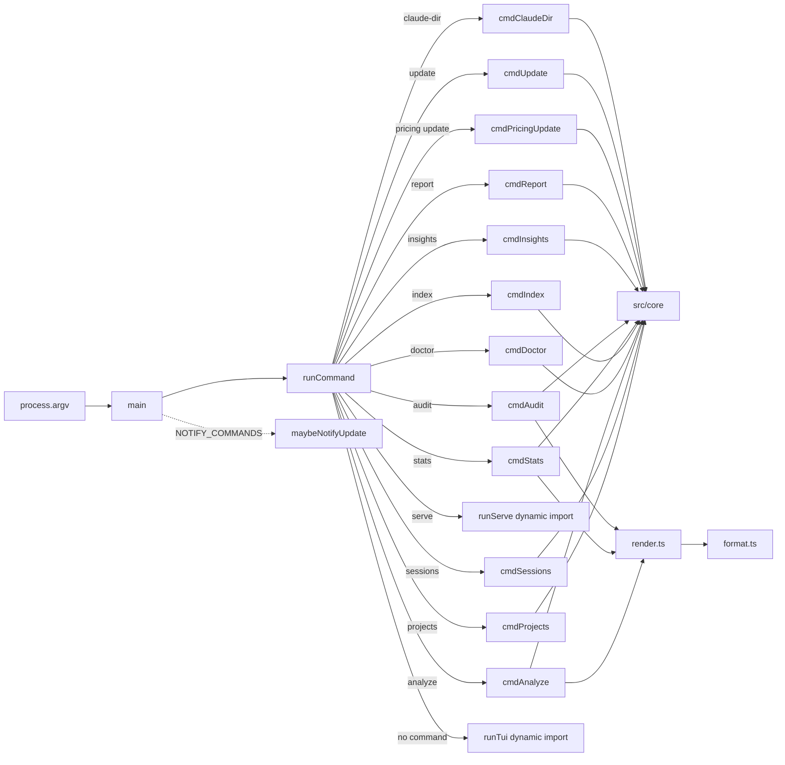

# Command-Line Interface

> Indexed at commit `51ccd4e` on 2026-07-23 · [view on GitHub](https://github.com/yorch/cc-analyzer/tree/51ccd4e)

## Relevant source files

- [src/cli/index.ts](https://github.com/yorch/cc-analyzer/blob/51ccd4e/src/cli/index.ts)
- [src/cli/format.ts](https://github.com/yorch/cc-analyzer/blob/51ccd4e/src/cli/format.ts)
- [src/cli/render.ts](https://github.com/yorch/cc-analyzer/blob/51ccd4e/src/cli/render.ts)

## Overview

The Command-Line Interface (CLI) is the scriptable frontend of `cc-analyzer` and the entrypoint of the compiled binary. [src/cli/index.ts](https://github.com/yorch/cc-analyzer/blob/51ccd4e/src/cli/index.ts) reads `process.argv`, routes the first token to a command handler, and returns a process exit code — the file ends by calling `process.exit(await main())` at [src/cli/index.ts#L279](https://github.com/yorch/cc-analyzer/blob/51ccd4e/src/cli/index.ts#L279). Every handler is a thin wrapper over `src/core`: the CLI parses arguments, invokes a core function, and hands the result to a renderer. It performs no analysis, pricing, or indexing itself.

The subsystem has three modules. [src/cli/index.ts](https://github.com/yorch/cc-analyzer/blob/51ccd4e/src/cli/index.ts) holds the argument router and one `cmd*` function per command. [src/cli/format.ts](https://github.com/yorch/cc-analyzer/blob/51ccd4e/src/cli/format.ts) supplies primitive formatters — currency, counts, byte sizes, durations, relative time — plus a `table` layout helper. [src/cli/render.ts](https://github.com/yorch/cc-analyzer/blob/51ccd4e/src/cli/render.ts) composes those primitives into full text reports for a single session (`renderSessionSummary`), for portfolio analytics (`renderStats`), for the setup audit (`renderSetupAudit`), for the portfolio insights (`renderPortfolioInsights`), and for the weekly digest (`renderWeeklyDigest`). Passing `--json` on the commands that support it bypasses the renderers entirely and prints the raw core objects for downstream scripting.

## Architecture

```mermaid
flowchart LR
    argv[process.argv] --> main
    main --> runCommand
    runCommand -->|projects| cmdProjects
    runCommand -->|sessions| cmdSessions
    runCommand -->|analyze| cmdAnalyze
    runCommand -->|doctor| cmdDoctor
    runCommand -->|index| cmdIndex
    runCommand -->|stats| cmdStats
    runCommand -->|audit| cmdAudit
    runCommand -->|insights| cmdInsights
    runCommand -->|report| cmdReport
    runCommand -->|serve| runServe[runServe dynamic import]
    runCommand -->|pricing update| cmdPricingUpdate
    runCommand -->|update| cmdUpdate
    runCommand -->|claude-dir| cmdClaudeDir
    runCommand -->|no command| runTui[runTui dynamic import]
    main -.NOTIFY_COMMANDS.-> maybeNotifyUpdate

    cmdProjects & cmdSessions & cmdAnalyze & cmdDoctor & cmdIndex & cmdStats & cmdAudit & cmdInsights & cmdReport & cmdPricingUpdate & cmdUpdate & cmdClaudeDir --> core[src/core]
    cmdAnalyze --> render[render.ts]
    cmdStats --> render
    cmdAudit --> render
    render --> format[format.ts]
```

`main` splits `process.argv` into a command and the remaining arguments, then delegates to `runCommand`, whose `switch` maps each command string to a handler at [src/cli/index.ts#L209-L266](https://github.com/yorch/cc-analyzer/blob/51ccd4e/src/cli/index.ts#L209-L266). Handlers call into `src/core`; only `analyze`, `stats`, `audit`, `insights`, and `report` route their human-readable output through the renderers, which in turn depend on `format.ts`. The `serve` and no-command (TUI) branches use dynamic `import()` so the heavier web and Ink dependencies load only when actually invoked.

## Module Layout

| Module | Path | Responsibility |
| ------ | ---- | -------------- |
| `index` | [src/cli/index.ts](https://github.com/yorch/cc-analyzer/blob/51ccd4e/src/cli/index.ts) | Binary entrypoint, argv router, and one handler per command |
| `format` | [src/cli/format.ts](https://github.com/yorch/cc-analyzer/blob/51ccd4e/src/cli/format.ts) | Primitive text formatters and the aligned `table` helper |
| `render` | [src/cli/render.ts](https://github.com/yorch/cc-analyzer/blob/51ccd4e/src/cli/render.ts) | Composes session, portfolio, and setup-audit text reports from core data |

Sources: [src/cli/index.ts:L1-L41](https://github.com/yorch/cc-analyzer/blob/51ccd4e/src/cli/index.ts#L1-L41) [src/cli/format.ts:L1-L11](https://github.com/yorch/cc-analyzer/blob/51ccd4e/src/cli/format.ts#L1-L11) [src/cli/render.ts:L1-L20](https://github.com/yorch/cc-analyzer/blob/51ccd4e/src/cli/render.ts#L1-L20)

## Key Components

### Argument router

`main` first strips the global `--claude-dir=<path>` flag from `process.argv` (applying it through `setClaudeRootsOverride`, so it may appear anywhere on the line and never reaches a handler as a positional), then destructures the remainder into `command` and `rest`, calls `runCommand`, and returns its exit code at [src/cli/index.ts#L268-L277](https://github.com/yorch/cc-analyzer/blob/51ccd4e/src/cli/index.ts#L268-L277). `runCommand` derives two shared values before switching: `json` is true when `rest` contains `--json`, and `positional` filters out any argument starting with `--` so handlers can read positional operands cleanly ([src/cli/index.ts#L209-L212](https://github.com/yorch/cc-analyzer/blob/51ccd4e/src/cli/index.ts#L209-L212)). Exit codes are meaningful: `0` for success, `1` for a runtime failure such as a missing session or empty index, and `2` for a usage error such as a missing argument or bad flag.

The `switch` recognizes `version`/`--version`/`-v` (prints `VERSION`), `help`/`--help`/`-h` (prints the `HELP` banner), an `undefined` command that launches the Terminal User Interface (TUI), and a `default` case that reports the unknown command, prints help, and returns exit code `2` ([src/cli/index.ts#L247-L265](https://github.com/yorch/cc-analyzer/blob/51ccd4e/src/cli/index.ts#L247-L265)). The `HELP` string embeds the running `VERSION` and documents every command with its flags ([src/cli/index.ts#L22-L41](https://github.com/yorch/cc-analyzer/blob/51ccd4e/src/cli/index.ts#L22-L41)).

Sources: [src/cli/index.ts:L209-L279](https://github.com/yorch/cc-analyzer/blob/51ccd4e/src/cli/index.ts#L209-L279) [src/cli/index.ts:L22-L41](https://github.com/yorch/cc-analyzer/blob/51ccd4e/src/cli/index.ts#L22-L41)

### Discovery commands: `projects` and `sessions`

`cmdProjects` calls `listProjects()` from the core discovery module and prints an aligned table of session count and truncated project label, followed by a total count ([src/cli/index.ts#L43-L57](https://github.com/yorch/cc-analyzer/blob/51ccd4e/src/cli/index.ts#L43-L57)). A third **claude dir** column appears only when the listed projects span more than one Claude root, since two roots can hold projects whose labels are identical. When no projects exist it returns `0`, printing every directory that was searched and the setting that put it there — the commonest cause of an empty portfolio is a relocated Claude directory, and naming `~/.claude` unconditionally would be a lie. `cmdSessions` requires a `<projectId>` operand and resolves it through `findProject()`: stored ids are root-qualified, so it accepts either the full id or the bare encoded name, resolving the latter when exactly one root holds that project. A missing operand returns exit `2`; a name held by several roots also returns `2`, listing each candidate id with its Claude directory rather than silently choosing one; an unknown name returns `1`, and a known-but-empty project returns `1` ([src/cli/index.ts#L59-L77](https://github.com/yorch/cc-analyzer/blob/51ccd4e/src/cli/index.ts#L59-L77)). Its table renders each session id alongside `formatRelativeTime(s.mtimeMs)` and `formatBytes(s.sizeBytes)`.

Sources: [src/cli/index.ts:L43-L77](https://github.com/yorch/cc-analyzer/blob/51ccd4e/src/cli/index.ts#L43-L77)

### `analyze` — single session

`cmdAnalyze` resolves a session reference through `resolveSessionPath`, which treats an argument ending in `.jsonl` or containing `/` as a filesystem path and otherwise looks the id up across all projects via `findSessionById` ([src/cli/index.ts#L79-L95](https://github.com/yorch/cc-analyzer/blob/51ccd4e/src/cli/index.ts#L79-L95)). It then runs the core pipeline directly: `parseSessionFile` yields events and parse errors, `loadPricing` supplies the pricing table, and `analyzeSession` produces the `SessionAnalysis` ([src/cli/index.ts#L96-L98](https://github.com/yorch/cc-analyzer/blob/51ccd4e/src/cli/index.ts#L96-L98)). With `--json` it prints `JSON.stringify` of the analysis augmented with a `parseErrors` count; otherwise it prints `renderSessionSummary(analysis, { color })` and, when anything was not fully understood, closes with the session's parse coverage — unparseable lines skipped, lines kept as tolerant "unknown" events, and the total line count. Color is enabled only when stdout is a terminal and `NO_COLOR` is absent, so redirected reports remain plain text. Unlike `stats` and `serve`, `analyze` reads and parses the raw `.jsonl` file and needs no index.

Sources: [src/cli/index.ts:L79-L107](https://github.com/yorch/cc-analyzer/blob/51ccd4e/src/cli/index.ts#L79-L107)

### `doctor` — structural session health

`doctor <id|path>` resolves and parses a source session exactly like `analyze`, but
does not load pricing or require the SQLite index. It passes both usable events and
recorded parser errors to the shared `inspectSessionHealth` core function, then
prints a `healthy`, `warning`, or `damaged` report. Findings cover parser integrity,
session and event identity, local parent/leaf continuity, tool-call/result pairing,
unanswered human prompts, and sessions ending after Claude Code's machine-written
interruption marker. Each includes observed evidence and a next action; the command
never repairs or rewrites the source.

Human and `--json` output are both scriptable: exit code `0` means healthy, `1`
means findings exist or the source was not found, and `2` means invalid usage.
Warnings deliberately include conditions that may be valid in continuation files,
so the report does not overstate local evidence as corruption.

### `index` — build the SQLite cache

`cmdIndex` opens the database with `openDb`, invokes `reindex(db, { rebuild, onProgress })`, and reports how many sessions were indexed, skipped, and deleted along with an elapsed time in seconds ([src/cli/index.ts#L109-L130](https://github.com/yorch/cc-analyzer/blob/51ccd4e/src/cli/index.ts#L109-L130)). Progress is written to `stderr` with a carriage return so it overwrites in place, throttled to every 200 sessions to avoid flooding the terminal ([src/cli/index.ts#L114-L121](https://github.com/yorch/cc-analyzer/blob/51ccd4e/src/cli/index.ts#L114-L121)). The `--rebuild` flag forces a full re-scan rather than the default incremental pass. `--check` performs a metadata-only source comparison and exits non-zero when sessions were added, changed, or deleted, without mutating the cache; it then prints one line of portfolio **parse coverage** — the share of indexed lines this build of the parser fully understood, with unreadable and unknown-event counts, and an `cc-analyzer update` prompt when the share crosses the drift threshold. That line is read straight off the indexed rows with a single SQL scan, so `--check` still parses no session content. Each successful scan records `last_scan_at`.

`stats`, `serve`, and the TUI read this index. The interactive frontends bootstrap it automatically when empty; a populated index is not refreshed implicitly. `stats` reports its exact freshness status in both human and JSON output.

Sources: [src/cli/index.ts:L109-L130](https://github.com/yorch/cc-analyzer/blob/51ccd4e/src/cli/index.ts#L109-L130)

### `stats` — portfolio analytics

`cmdStats` builds the shared portfolio shape with `buildPortfolioStats(db, localDayOfMs(Date.now()))` — the same builder that backs the `/api/stats` web endpoint — and returns `1` when the index is empty ([src/cli/index.ts#L132-L141](https://github.com/yorch/cc-analyzer/blob/51ccd4e/src/cli/index.ts#L132-L141)). It then layers terminal-only extras on top: `cacheTtlSplit`, the top ten `analytics.bash` rows, `analytics.tests`, `analytics.retries`, and a `concurrency` headline of `peak` and `parallelDayShare` ([src/cli/index.ts#L142-L153](https://github.com/yorch/cc-analyzer/blob/51ccd4e/src/cli/index.ts#L142-L153)). The composite `view` prints as raw JSON under `--json` or through `renderStats(view, { color })` otherwise. As with `analyze`, styling is TTY-only and honors `NO_COLOR`, leaving pipes and redirected output ANSI-free. The rich analytics behind this command are documented on the [Analytics and Insights](./7-analytics-and-insights.md) page.

Sources: [src/cli/index.ts:L132-L156](https://github.com/yorch/cc-analyzer/blob/51ccd4e/src/cli/index.ts#L132-L156)

### `audit` — setup audit

`cmdAudit` is the one command that reads *configuration* rather than transcripts. It scans the Claude dir with `scanInventories()` (`src/core/inventory.ts`) for installed skills, subagents, plugins, MCP servers, hooks, and permission rules, pulls observed usage from the index with `analyticsRollup(db)`, and cross-references the two through the bun-free `buildSetupAudit(inventory, usage, today)` (`src/core/setup-audit.ts`). It returns `1` when the index is empty — with no observed usage every installed item would be reported as unused — and otherwise prints `renderSetupAudit(audit, { color })`, or the raw `SetupAudit` under `--json`. The human report is three sections: **Inventory** (what's installed), **Plugins**, and **Findings**. The Plugins table appears only when at least one plugin is installed and mirrors `SetupAudit.plugins` (the `buildPluginUsage` rollup, also carried verbatim in `--json` as `plugins`): plugin name, skills used-of-shipped, subagents used-of-shipped, skill invocations, turn-scoped dollars, and last-used day, most expensive first. Because that dollar column is the same turn-scoped attribution the skills table uses, the shared `SKILL_COST_CAVEAT` prints once beneath it. When several Claude roots are configured, `scanInventories()` scans each and folds them into one inventory — same-named skills collapse to a single entry (usage is recorded by name only, so two entries would report one unused on evidence that cannot tell them apart), hook and permission counts sum, and the pinned model is the primary root's. `SetupInventory.claudeDirs` carries every scanned root, so render sites name them all rather than just the first. The audit rules and their thresholds are documented on the [Analytics and Insights](./7-analytics-and-insights.md) page.

Sources: [src/cli/index.ts](https://github.com/yorch/cc-analyzer/blob/51ccd4e/src/cli/index.ts) [src/core/inventory.ts](https://github.com/yorch/cc-analyzer/blob/51ccd4e/src/core/inventory.ts) [src/core/setup-audit.ts](https://github.com/yorch/cc-analyzer/blob/51ccd4e/src/core/setup-audit.ts)

### `insights` — portfolio insights

`cmdInsights` is the CLI face of the portfolio rules engine. It refuses on an empty index (exit `1`, like `stats` and `audit`), assembles every portfolio signal with `assemblePortfolioSignals(db, pricing)` (`src/core/portfolio-signals.ts` — the same assembler the web `/api/insights` route and the TUI insights screen use, so all three feed the rules identical inputs), and folds them through the bun-free `buildPortfolioDiagnostics(signals)` (`src/core/portfolio-diagnostics.ts`). The ranked findings print through `renderPortfolioInsights` — warnings first, each with its evidence, an optional project line, and a muted `Next:` action — or as the raw `PortfolioDiagnostic[]` under `--json`. When nothing crosses a threshold it prints an explicit "No findings — the portfolio looks healthy by every rule (16 rules checked)" line rather than nothing (the count is derived from `PORTFOLIO_DIAGNOSTIC_CODES.length`, so it tracks the rule list automatically). The rule table and thresholds are documented on the [Analytics and Insights](./7-analytics-and-insights.md) page.

Sources: [src/cli/index.ts](https://github.com/yorch/cc-analyzer/blob/51ccd4e/src/cli/index.ts) [src/core/portfolio-diagnostics.ts](https://github.com/yorch/cc-analyzer/blob/51ccd4e/src/core/portfolio-diagnostics.ts) [src/core/portfolio-signals.ts](https://github.com/yorch/cc-analyzer/blob/51ccd4e/src/core/portfolio-signals.ts)

### `report` — weekly digest

`cmdReport` is the push-shaped counterpart of `stats`/`insights`: one week of usage, what changed against the week before, and what to fix. It refuses on an empty index (exit `1`, like `stats`, `audit`, and `insights`), loads the cached pricing table (the what-if signal inside the insight snapshot needs rates), and assembles the digest with `buildWeeklyDigest(db, pricing, { week })` (`src/core/digest-signals.ts`). Output has three modes: the default terminal report through `renderWeeklyDigest`, `--md` for paste-ready markdown through the bun-free `buildDigestMarkdown` (printed to stdout — the command never writes files, so users redirect), and `--json` for the raw `WeeklyDigest`. `--md` and `--json` are **mutually exclusive** — asking for both would silently print only one, so it exits `2`.

The period defaults to the **last complete ISO week** (Monday–Sunday) relative to today, because a half-finished current week would always read as a decline against a full prior week. `--week YYYY-MM-DD` (also accepted as `--week=YYYY-MM-DD`) reports the week containing any given day; a malformed value exits `2`, and so does a `--week` with no value — a following token that starts with `-` is the next flag, not the week (`report --week --md` is an error, not a silently ignored `--md`). A period with **zero sessions is not an error** — the report says "No sessions in this period", still shows the prior period's totals, and still renders the insight snapshot.

Two scoping rules travel with the output. Period metrics are **session-day-scoped**: a session counts toward the period containing its start day (the index's `day` column) with all of its cost, so a session running past midnight is not split. The insight snapshot is **not** period-scoped — it is `buildPortfolioDiagnostics` over the whole indexed portfolio, i.e. current state — and both facts are printed in the report itself, not only documented here.

Sources: [src/cli/index.ts](https://github.com/yorch/cc-analyzer/blob/51ccd4e/src/cli/index.ts) [src/core/digest.ts](https://github.com/yorch/cc-analyzer/blob/51ccd4e/src/core/digest.ts) [src/core/digest-signals.ts](https://github.com/yorch/cc-analyzer/blob/51ccd4e/src/core/digest-signals.ts)

### `cost-basis` — dollar framing preference

`cmdCostBasis` (mirroring `cmdTelemetry`'s on/off/status shape) reads or writes the persisted cost-basis preference from `src/core/prefs.ts`. `cc-analyzer cost-basis` with no argument prints the current value; `cc-analyzer cost-basis api` or `cc-analyzer cost-basis subscription` sets it and confirms. The preference never changes how a dollar figure is *computed* — costs are always tokens × API rates — only how it's *framed*: `api` (the default) reads as a bill, `subscription` reframes the same numbers as API-equivalent value for flat-plan Pro/Max users who aren't billed per token. `cmdStats` reads the current basis and threads it into `renderStats`, which prints the canonical framing note (from the bun-free `src/core/cost-framing.ts`) near the top of the report when the basis is `subscription`, and folds the same wording into the run-rate line so a "projected" figure doesn't read as a bill. This CLI command is no longer the only way to *set* the preference: the web app has its own toggle (`PUT /api/prefs`, a `Seg` control on the Dashboard hero) for users who never touch the CLI, writing through the same `setCostBasis()`. The TUI and web app read the preference at their own presentation boundaries; see [Web Server and API](./5-web-server-and-api.md) and [Web SPA Frontend](./6-web-spa-frontend.md).

### `claude-dir` — which Claude data directories are read

`cmdClaudeDir` reads or writes the persisted `claudeDirs` preference (`src/core/prefs.ts`), the third of the five tiers `claudeRoots()` resolves. `cc-analyzer claude-dir` with no argument (or `show`) prints every resolved directory, *the tier it came from*, and a marker on any that holds no `projects/` directory. The tier it names — `--claude-dir`, `CC_ANALYZER_CLAUDE_DIR`, `cc-analyzer claude-dir`, `CLAUDE_CONFIG_DIR`, or `default` — is what makes an empty portfolio diagnosable rather than mysterious. It suggests configuring something only when **no** resolved directory is readable: the default `~/.claude` and an inherited `CLAUDE_CONFIG_DIR` are both working setups that persist nothing, so prompting those users would read as a fault report. `set <path>` replaces the persisted list; `add <path>` appends to the directories **currently in effect** — with nothing persisted yet that means the default or `CLAUDE_CONFIG_DIR` root, which must be carried into the new list or the exclusive prefs tier would silently drop it and the next `index` would prune its rows; `remove <path>` drops one (exit `1` if it was not persisted), and `reset` clears the preference so resolution falls back through `CLAUDE_CONFIG_DIR` to `~/.claude`. Paths are expanded (`~`) and made absolute before storage; a path that does not exist yet is a *warning*, not an error, since a synced or mounted directory can legitimately be absent right now. Every mutating form closes by printing the newly resolved list and reminding the user to run `cc-analyzer index`, because the index mirrors the configured set — a de-configured directory's rows are pruned on the next scan. A bad subcommand or a missing operand exits `2`. Writes touch only `<stateDir>/prefs.json`; no Claude directory is ever modified.

The global `--claude-dir=<path>` flag covers the one-invocation case. `applyClaudeDirFlag` strips it from `process.argv` in `main()` *before* the command is read — so the flag may appear anywhere on the line — and applies it via `setClaudeRootsOverride()`. Only the inline `=` form is accepted: `runCommand` derives positionals with `rest.filter(a => !a.startsWith("--"))`, so a space-separated value would survive as a positional and be read as, say, the `<projectId>` operand. The space form and a valueless flag both exit `2` with guidance rather than being silently ignored. Multiple flags accumulate, and each value may itself be a `PATH`-style list.

The flag is **scoped to the commands that read session files directly** — `projects`, `sessions`, `analyze`, `doctor`. `runCommand` refuses it on every index-backed command (`index`, `stats`, `audit`, `insights`, `report`, `serve`, and the no-command TUI) with exit `2`. The reason is that the index always covers the whole configured set — that is what lets the query layer aggregate without a root clause — so a one-invocation scope has no honest meaning there: a read command would ignore it and still report the whole portfolio, and `index` would prune the rows of every directory it was not pointed at. The refusal message names which of the two applies and points at `cc-analyzer claude-dir set`. `CC_ANALYZER_CLAUDE_DIR` is deliberately *not* guarded: it is the hermetic test/CI hook the suite drives every command through.

### `serve`, `pricing update`, and `update`

The `serve` branch parses `--port=` and `--host=`, plus `--refresh` to run an incremental index update before binding and `--open` to launch the browser after binding. Browser launch is best-effort and restricted to loopback hosts. Invalid ports return exit code `2`, and the web server is dynamically imported so web dependencies stay out of other command startup paths. `pricing update` accepts only the `update` sub-token; `cmdPricingUpdate` forces a refresh with `loadPricing({ force: true })` and returns `1` when the source is not `remote`, meaning the remote fetch failed and a cached or bundled table is still in use ([src/cli/index.ts#L158-L170](https://github.com/yorch/cc-analyzer/blob/51ccd4e/src/cli/index.ts#L158-L170)). `cmdUpdate` handles `--check` by comparing `fetchLatestVersion` against `VERSION`, and otherwise runs `performUpdate` with a TTY-only progress callback that writes megabyte counts to `stderr` ([src/cli/index.ts#L172-L204](https://github.com/yorch/cc-analyzer/blob/51ccd4e/src/cli/index.ts#L172-L204)). The update mechanics live on the [Updates and Distribution](./8-updates-and-distribution.md) page.

Sources: [src/cli/index.ts:L158-L204](https://github.com/yorch/cc-analyzer/blob/51ccd4e/src/cli/index.ts#L158-L204) [src/cli/index.ts:L224-L246](https://github.com/yorch/cc-analyzer/blob/51ccd4e/src/cli/index.ts#L224-L246)

### Passive update notice

After `runCommand` returns, `main` fires a best-effort, non-blocking update notice for a curated set of quick commands. `NOTIFY_COMMANDS` contains `projects`, `sessions`, `analyze`, `doctor`, `index`, `stats`, `audit`, `insights`, `report`, and `pricing`; when the command is in that set and `--json` was not passed, `main` awaits `maybeNotifyUpdate()` before returning the exit code ([src/cli/index.ts#L206-L276](https://github.com/yorch/cc-analyzer/blob/51ccd4e/src/cli/index.ts#L206-L276)). Excluding `--json` keeps machine-readable output clean of the human-facing banner. Before process exit, `main` also awaits the bounded `flushTelemetry()` drain; it never changes the command result and waits at most briefly for already-pending events. On the normal path nothing is pending and it returns immediately, because a quick command's telemetry event is delivered by a **detached child process** rather than by the parent: `process.exit()` would otherwise kill the socket long before a cold TLS handshake completes. `trackCommand` re-invokes the executable with the hidden `__telemetry-post` marker, the endpoint, and the prebuilt event body; the drain covers only the in-process fallback used when that spawn is refused. The marker is absent from `HELP`, is never itself tracked, prints nothing, and re-checks the opt-out before sending.

Sources: [src/cli/index.ts:L206-L277](https://github.com/yorch/cc-analyzer/blob/51ccd4e/src/cli/index.ts#L206-L277)

### Formatting primitives

[src/cli/format.ts](https://github.com/yorch/cc-analyzer/blob/51ccd4e/src/cli/format.ts) holds pure, dependency-free formatters. The money/count/duration primitives — `formatUSD` (small non-zero amounts to four decimals, everything else to two, sign preserved), `formatCount` (compacts large numbers into `k`/`M`/`B` suffixes, bucketing on the rounded value so `999_960` renders as `1.0M` rather than `1000.0k`), plus `formatSignedCount`, `formatDuration`, and `formatCompactDuration` — are defined once in the bun-free [src/core/format-shared.ts](https://github.com/yorch/cc-analyzer/blob/51ccd4e/src/core/format-shared.ts) and **re-exported** here, so the terminal, the digest markdown, and the web app print identical numbers. `format.ts` itself defines the terminal-only helpers: `formatTokens` appends a `+N cache` suffix when cache tokens are present, `formatBytes` and `formatRelativeTime` cover sizes and human-relative timestamps ([src/cli/format.ts](https://github.com/yorch/cc-analyzer/blob/51ccd4e/src/cli/format.ts)). `table` computes per-column widths from headers and rows, then emits a padded header, dashed separator, and rows; its optional `align` array right-aligns numeric columns while text remains left-aligned. `truncate` collapses whitespace and appends an ellipsis past a max length.

Sources: [src/cli/format.ts:L1-L66](https://github.com/yorch/cc-analyzer/blob/51ccd4e/src/cli/format.ts#L1-L66)

### Report renderers

`renderSessionSummary` turns a `SessionAnalysis` into a multi-section text report: a branded title and muted identity line; a Totals table covering cost, turns, API calls, tool calls, tokens, duration, active time, web search/fetch, subagent spend, test runs, tool-call churn, a `corrections` line when the session had any correction or interruption turns (e.g. `3 correction turns (18%) · 1 interruption`, followed by the shared `CORRECTION_CAVEAT`), and — only when a signal is non-trivial (a failing-test streak ≥ 3 or ≥ 4 redundant reads) — one `thrash` line. **Actionable diagnostics** follows immediately after Totals (and its correction caveat), so the session's next-step findings are never scrolled away by the reference tables below — before Cost by token category, Cost-per-outcome (per turn / per file touched / per test run / per active hour, only ratios whose denominator exists, closed by the shared `OUTCOME_CAVEAT`), Models, a What-if repricing table when the caller passed one in via `options.whatIf` (computed in `cmdAnalyze` from `sessionWhatIf` — the renderer never sees the pricing table — closed by the shared `WHATIF_CAVEAT`), Tools, a Skills table (uses, attributed turns, and the turn-scoped `turn $` cost, closed by the shared `SKILL_COST_CAVEAT`), and a Subagent-bursts table when the session spawned subagents (per-burst type, turn, calls, and cost, with a best-effort-attribution caveat line). A **▸ Session facts** section then collects `Subagents:` (kept even when the burst join fails to attribute types), `Files touched:`, `Stop reasons:`, `Permission modes:` (present only when a mode other than plain `default` is present), and `Shell commands:` as prose lines rendered `Bash 412 · Read 298 · Edit 150` (not the machine-facing `Bash:412, Read:298`) — the section header itself is omitted when none of the five apply. Finally the per-turn Turns table adds a `flags` column built from the shared `turnFlags()` predicate (interrupted / correction / retries / test failures / redundant reads / tool errors, joined `interrupted · 2 retries`) via `buildTurnSeries`, caps at 40 rows, and prints a muted "… N more turns — use --json for the full list." line when truncated. Section markers and numeric alignment match the portfolio report, while color remains an injected rendering option rather than a core-data concern.

`renderStats` consumes a `PortfolioView`, the interface that extends `PortfolioStats` with the CLI-only `ttl`, `bash`, `tests`, `retries`, `corrections`, `concurrency`, `contextTax`, and `whatIf` fields. It leads with a compact portfolio headline — total, est. `costNoun(costBasis)` "(API rates)" (e.g. `spend` for the default `api` basis, `API-equivalent value` for `subscription`, so the headline never contradicts the framing note printed below it), session/project counts, date range, tokens, and active time — then separates the dense metrics into **Activity** and **Efficiency & reliability** tables (the latter includes a `corrections` row — correction turns, their share of real-prompt turns, and interrupted turns — followed by the shared `CORRECTION_CAVEAT` when anything was detected). Below those it appends a block-character session-cost distribution and conditional, numerically aligned tables for spend by month, top projects, spend by model, **what-if model repricing** (each model's actual token mix at the other models' rates, with the cheapest-single-model headline, signed deltas via `formatSignedUSD`, and the shared `WHATIF_CAVEAT` printed verbatim), **context tax** (per-project median/p90/average tokens consumed before the user types, with the heuristic caveat), most expensive sessions, top shell commands, and most-retried tools. The **Top projects by cost** and **Context tax** tables gain a trailing `claude dir` column (via `labelProjects`/`rootTag`, the same rule `cmdProjects` uses) whenever the ranked rows span more than one configured Claude root, since two roots can hold a project for the same working directory and produce byte-identical labels otherwise. All percentages in this report go through the shared `pct()` formatter. A read-only/local footer closes the human report. `--json` bypasses this presentation layer entirely, so the machine-readable contract is unchanged.

`renderSetupAudit` renders a `SetupAudit`: a title with the scanned Claude dir, an **Inventory** table (skills, subagents, plugins, MCP servers with their global/project split, hooks, permission rules, pinned model), and a **Findings** block that lists warnings before info-level items in the `session-diagnostics` style — title, evidence, then a muted `Next:` action. The mandatory machine-local/historical caveat (`SETUP_AUDIT_CAVEAT`, exported from core so every surface prints the same words) closes the report. `renderPortfolioInsights` renders the ranked `PortfolioDiagnostic[]` in the same style — warnings first, evidence, project line when scoped, `Next:` action — with an explicit healthy line naming the rule count when nothing fired.

`renderWeeklyDigest` renders a `WeeklyDigest`: a title, the period and the period it is compared against, a **Summary** table whose first row label is `costNoun(d.costBasis)` (so a subscription-basis digest reads "API-equivalent value" instead of "spend") with signed deltas (`+$1.90 (+18%)`, or `new` when the prior period was empty), then **Top projects** (with the same `claude dir` disambiguation column as `renderStats` when the ranked projects span more than one Claude root), **Models**, **Cache & reliability** (closed by the shared `CORRECTION_CAVEAT`, printed only when the period actually had correction or interruption turns), **Skills** (turn-scoped cost, closed by `SKILL_COST_CAVEAT`), and the current-state **Insights** list. `buildDigestMarkdown` mirrors the same gating: its Summary table's cost label goes through `costNoun` too (Title Cased for the markdown header), its Top projects table gains the matching `Claude dir` column, and its `_CORRECTION_CAVEAT_` line is likewise omitted when neither signal fired in the period. Both renderings read the same digest object, so the terminal report and the markdown export cannot disagree; `formatDigestDelta` lives in the bun-free `src/core/digest.ts` and the number formatters it is handed (`formatUSD`, `formatSignedCount`, `formatCompactDuration`) in the bun-free `src/core/format-shared.ts`, precisely so both renderings — and the web app's copy button — share them.

Sources: [src/cli/render.ts:L19-L315](https://github.com/yorch/cc-analyzer/blob/51ccd4e/src/cli/render.ts#L19-L315)

## Configuration & Extension Points

| Flag | Command | Purpose |
| ---- | ------- | ------- |
| `--json` | `analyze`, `doctor`, `stats`, `audit`, `insights`, `report` | Emit the raw core object as JSON instead of a rendered report; also suppresses the passive update notice |
| `--claude-dir=<path>` | `projects`, `sessions`, `analyze`, `doctor` (global; repeatable) | Read the given Claude data directory for one invocation. Refused with exit `2` on every index-backed command, since the index always covers the whole configured set |
| `--md` | `report` | Print the digest as paste-ready markdown on stdout (no file is written); mutually exclusive with `--json` (both ⇒ exit `2`) |
| `--week <day>` | `report` | Report the ISO week containing that `YYYY-MM-DD` day instead of the last complete week; a missing or flag-shaped value exits `2` |
| `--rebuild` | `index` | Force a full re-scan instead of the incremental pass |
| `--check` | `index` | Compare source metadata with the cache without changing it; exit non-zero when stale |
| `--port=<n>` | `serve` | Bind the web server to an integer port 1–65535; invalid values exit with code `2` |
| `--host=<h>` | `serve` | Bind address for the web server |
| `--refresh` | `serve` | Incrementally refresh the index before starting the server |
| `--open` | `serve` | Open the served URL in the default browser when bound to loopback |
| `--check` | `update` | Report whether a newer release exists without installing it |
| `NO_COLOR` | `analyze`, `stats`, `audit`, `insights`, `report` | Disable ANSI styling even when stdout is an interactive terminal |

Sources: [src/cli/index.ts:L209-L246](https://github.com/yorch/cc-analyzer/blob/51ccd4e/src/cli/index.ts#L209-L246)

## Related Pages

- Core pipeline consumed by every handler: [Core Analysis Engine](./2-core-analysis-engine.md)
- Launched by the no-command branch: [Terminal User Interface](./4-tui.md)
- Launched by `serve`: [Web Server and API](./5-web-server-and-api.md)
- Analytics behind `stats`: [Analytics and Insights](./7-analytics-and-insights.md)
- Mechanics behind `update` and `pricing update`: [Updates and Distribution](./8-updates-and-distribution.md)
