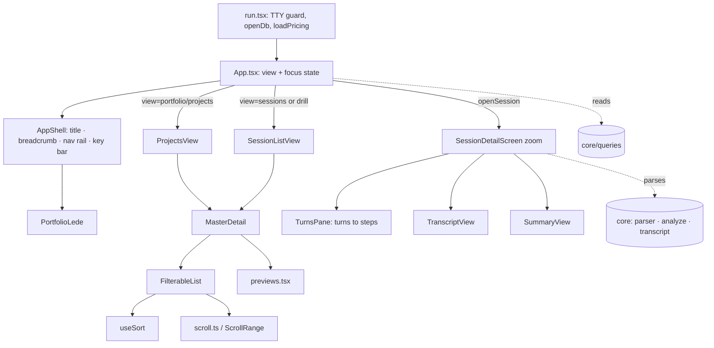

# Interactive Terminal UI

> Indexed at commit `7ef3ef4` on 2026-07-12 · [view on GitHub](https://github.com/yorch/cc-analyzer/tree/7ef3ef4)

## Relevant source files

- [src/tui/run.tsx](https://github.com/yorch/cc-analyzer/blob/7ef3ef4/src/tui/run.tsx)
- [src/tui/App.tsx](https://github.com/yorch/cc-analyzer/blob/7ef3ef4/src/tui/App.tsx)
- [src/tui/theme.ts](https://github.com/yorch/cc-analyzer/blob/7ef3ef4/src/tui/theme.ts)
- [src/tui/scroll.ts](https://github.com/yorch/cc-analyzer/blob/7ef3ef4/src/tui/scroll.ts)
- [src/tui/usePageSize.ts](https://github.com/yorch/cc-analyzer/blob/7ef3ef4/src/tui/usePageSize.ts)
- [src/tui/useTermSize.ts](https://github.com/yorch/cc-analyzer/blob/7ef3ef4/src/tui/useTermSize.ts)
- [src/tui/useSort.ts](https://github.com/yorch/cc-analyzer/blob/7ef3ef4/src/tui/useSort.ts)
- [src/tui/shell/AppShell.tsx](https://github.com/yorch/cc-analyzer/blob/7ef3ef4/src/tui/shell/AppShell.tsx)
- [src/tui/shell/MasterDetail.tsx](https://github.com/yorch/cc-analyzer/blob/7ef3ef4/src/tui/shell/MasterDetail.tsx)
- [src/tui/components/FilterableList.tsx](https://github.com/yorch/cc-analyzer/blob/7ef3ef4/src/tui/components/FilterableList.tsx)
- [src/tui/components/PortfolioLede.tsx](https://github.com/yorch/cc-analyzer/blob/7ef3ef4/src/tui/components/PortfolioLede.tsx)
- [src/tui/components/previews.tsx](https://github.com/yorch/cc-analyzer/blob/7ef3ef4/src/tui/components/previews.tsx)
- [src/tui/components/ui.tsx](https://github.com/yorch/cc-analyzer/blob/7ef3ef4/src/tui/components/ui.tsx)
- [src/tui/screens/ProjectsView.tsx](https://github.com/yorch/cc-analyzer/blob/7ef3ef4/src/tui/screens/ProjectsView.tsx)
- [src/tui/screens/SessionListView.tsx](https://github.com/yorch/cc-analyzer/blob/7ef3ef4/src/tui/screens/SessionListView.tsx)
- [src/tui/screens/SessionDetailScreen.tsx](https://github.com/yorch/cc-analyzer/blob/7ef3ef4/src/tui/screens/SessionDetailScreen.tsx)

## Overview

The interactive Terminal User Interface (TUI) is the default frontend: running `cc-analyzer` with no command launches it. It is built with Ink and React, and reads exclusively from the SQLite index — it never re-parses the raw session store to render its lists. The entry point [src/tui/run.tsx](https://github.com/yorch/cc-analyzer/blob/7ef3ef4/src/tui/run.tsx) guards for a teletypewriter (TTY), opens the index database with `openDb()`, loads the pricing table with `loadPricing()`, then renders `<App>` and waits for exit before closing the database.

The UI presents a single persistent layout shell rather than a stack of full screens. A left-hand navigation rail selects the active *view* — `portfolio`, `projects`, or `sessions`, with dimmed `insights` and `trends` placeholders — and the body renders a two-pane master-detail for that view. Opening a session escapes the shell into a full-screen `SessionDetailScreen` "zoom", which is the only place raw session files are parsed and analyzed on demand. The visual identity is an amber-phosphor palette centralized in [src/tui/theme.ts](https://github.com/yorch/cc-analyzer/blob/7ef3ef4/src/tui/theme.ts).

If the index is empty, `App` short-circuits to a prompt telling the user to run `cc-analyzer index` first, since every list is index-backed.

Sources: [src/tui/run.tsx:L1-L20](https://github.com/yorch/cc-analyzer/blob/7ef3ef4/src/tui/run.tsx#L1-L20) [src/tui/App.tsx:L38-L84](https://github.com/yorch/cc-analyzer/blob/7ef3ef4/src/tui/App.tsx#L38-L84)

## Architecture

`App` owns two pieces of top-level state: `view` (which rail entry is active) and `focus` (either `"rail"` or `"body"`). A `drill` project and `openSession` add two nested navigation levels — drilling into a project swaps the body to that project's sessions, and opening a session replaces the whole shell with the detail zoom. The shell chrome and the active body are composed together and handed to `AppShell`, which pins the frame to the terminal height so it never overflows the viewport.

Sources: [src/tui/App.tsx:L38-L195](https://github.com/yorch/cc-analyzer/blob/7ef3ef4/src/tui/App.tsx#L38-L195) [src/tui/shell/AppShell.tsx:L42-L69](https://github.com/yorch/cc-analyzer/blob/7ef3ef4/src/tui/shell/AppShell.tsx#L42-L69)

## Module Layout

| Module | Path | Responsibility |
| ------ | ---- | -------------- |
| `run` | [src/tui/run.tsx](https://github.com/yorch/cc-analyzer/blob/7ef3ef4/src/tui/run.tsx) | TTY guard, open index + load pricing, render `<App>` |
| `App` | [src/tui/App.tsx](https://github.com/yorch/cc-analyzer/blob/7ef3ef4/src/tui/App.tsx) | Layout shell, view + focus router, rail input, drill/open state |
| `theme` | [src/tui/theme.ts](https://github.com/yorch/cc-analyzer/blob/7ef3ef4/src/tui/theme.ts) | Amber palette, semantic `role` map, `selection`/`gutter`, `sparkline`/`bar`, step/kind color maps |
| `AppShell` | [src/tui/shell/AppShell.tsx](https://github.com/yorch/cc-analyzer/blob/7ef3ef4/src/tui/shell/AppShell.tsx) | Persistent chrome pinned to terminal height; nav rail, title bar, key bar |
| `MasterDetail` | [src/tui/shell/MasterDetail.tsx](https://github.com/yorch/cc-analyzer/blob/7ef3ef4/src/tui/shell/MasterDetail.tsx) | Two-pane body; `masterWidth()` sizing; collapses on narrow terminals |
| `FilterableList` | [src/tui/components/FilterableList.tsx](https://github.com/yorch/cc-analyzer/blob/7ef3ef4/src/tui/components/FilterableList.tsx) | Shared list: filter, sort keys, scroll window, live-highlight callback |
| `previews` | [src/tui/components/previews.tsx](https://github.com/yorch/cc-analyzer/blob/7ef3ef4/src/tui/components/previews.tsx) | `ProjectPreview` / `SessionPreview` detail-pane cards |
| `PortfolioLede` | [src/tui/components/PortfolioLede.tsx](https://github.com/yorch/cc-analyzer/blob/7ef3ef4/src/tui/components/PortfolioLede.tsx) | Full-width portfolio band: total + months spend sparkline |
| `ui` | [src/tui/components/ui.tsx](https://github.com/yorch/cc-analyzer/blob/7ef3ef4/src/tui/components/ui.tsx) | `ScrollRange`, `Empty`, `Loading`, `Footer`, `HelpOverlay` |
| `ProjectsView` | [src/tui/screens/ProjectsView.tsx](https://github.com/yorch/cc-analyzer/blob/7ef3ef4/src/tui/screens/ProjectsView.tsx) | Projects master list → project preview |
| `SessionListView` | [src/tui/screens/SessionListView.tsx](https://github.com/yorch/cc-analyzer/blob/7ef3ef4/src/tui/screens/SessionListView.tsx) | Sessions master list → session preview (all-sessions and drilled-in) |
| `SessionDetailScreen` | [src/tui/screens/SessionDetailScreen.tsx](https://github.com/yorch/cc-analyzer/blob/7ef3ef4/src/tui/screens/SessionDetailScreen.tsx) | Full-screen turns / transcript / summary zoom |
| `useTermSize` | [src/tui/useTermSize.ts](https://github.com/yorch/cc-analyzer/blob/7ef3ef4/src/tui/useTermSize.ts) | Live terminal size + `layoutMode()` breakpoints |
| `useSort` | [src/tui/useSort.ts](https://github.com/yorch/cc-analyzer/blob/7ef3ef4/src/tui/useSort.ts) | Client-side sort field cycling + direction flip |
| `scroll` / `usePageSize` | [src/tui/scroll.ts](https://github.com/yorch/cc-analyzer/blob/7ef3ef4/src/tui/scroll.ts) | Shared scroll-window math and page-size derivation |

Sources: [src/tui/App.tsx:L1-L36](https://github.com/yorch/cc-analyzer/blob/7ef3ef4/src/tui/App.tsx#L1-L36) [src/tui/theme.ts:L19-L44](https://github.com/yorch/cc-analyzer/blob/7ef3ef4/src/tui/theme.ts#L19-L44)

## Key Components

### Theme and visual identity

[src/tui/theme.ts](https://github.com/yorch/cc-analyzer/blob/7ef3ef4/src/tui/theme.ts) is the single source of palette and semantic roles, so screens reference intent (`heading`, `cost`, `ok`) rather than raw hex. Colors are hex strings handed to chalk, which auto-downsamples to 256/16-color on weaker terminals so amber degrades to yellow rather than breaking. There is no painted full-screen background; the phosphor look comes from amber foregrounds, borders, and an inverse selection bar. The `selection()` helper returns the amber-inverse style for a selected row and `gutter()` returns the `❯ ` marker, while `sparkline()` and `bar()` render block-glyph mini-charts. `STEP_ICON`, `STEP_COLOR`, and `KIND_COLOR` map core step kinds and transcript kinds to glyphs and colors for the detail screen.

Sources: [src/tui/theme.ts:L19-L122](https://github.com/yorch/cc-analyzer/blob/7ef3ef4/src/tui/theme.ts#L19-L122)

### AppShell and the nav rail

[AppShell](https://github.com/yorch/cc-analyzer/blob/7ef3ef4/src/tui/shell/AppShell.tsx) renders the persistent chrome: a title bar with the current version, a breadcrumb, the nav rail, and a key-hint bar. The outer box is `height={rows - 2}` with `overflow="hidden"`, and the body between the lede and key bar uses `flexGrow={1}` and clips its overflow. This keeps the title and key bars always on screen and stops the frame from growing taller than the viewport, which would otherwise scroll the header off the top. The `NavRail` highlights the active entry with an amber background, dims `soon` placeholders, and shows a `❯` marker only when the rail itself holds focus.

Sources: [src/tui/shell/AppShell.tsx:L32-L119](https://github.com/yorch/cc-analyzer/blob/7ef3ef4/src/tui/shell/AppShell.tsx#L32-L119)

### MasterDetail and responsive layout

[MasterDetail](https://github.com/yorch/cc-analyzer/blob/7ef3ef4/src/tui/shell/MasterDetail.tsx) is the two-pane body: a master list on the left drives a live detail preview on the right. `layoutMode()` in [src/tui/useTermSize.ts](https://github.com/yorch/cc-analyzer/blob/7ef3ef4/src/tui/useTermSize.ts) reports `full` (≥100 columns, rail with labels + two panes), `compact` (90–99, rail as an icon strip + two panes), or `narrow` (<90, single pane, rail hidden). On a narrow terminal `MasterDetail` renders the master pane alone and the detail is reached by drilling in. `masterWidth()` computes the master pane's column width (defaulting to 40%), and each view uses it to truncate row content so Ink never wraps a row.

Sources: [src/tui/shell/MasterDetail.tsx:L16-L60](https://github.com/yorch/cc-analyzer/blob/7ef3ef4/src/tui/shell/MasterDetail.tsx#L16-L60) [src/tui/useTermSize.ts:L29-L41](https://github.com/yorch/cc-analyzer/blob/7ef3ef4/src/tui/useTermSize.ts#L29-L41)

### FilterableList, sorting, and scrolling

[FilterableList](https://github.com/yorch/cc-analyzer/blob/7ef3ef4/src/tui/components/FilterableList.tsx) is the shared list primitive behind both list views. Printable keys build an inline substring query, arrows move the cursor, `enter` selects, backspace edits the query, and `escape` clears the query or calls `onBack` when it is already empty. Vim `j`/`k` are deliberately not bound to navigation here so those letters can be typed into the filter. An `onHighlight` callback fires with the highlighted item on every cursor or filter change, which is how the master list drives the live preview pane. Sort state comes from [useSort](https://github.com/yorch/cc-analyzer/blob/7ef3ef4/src/tui/useSort.ts) — `tab` cycles the field and `shift-tab` flips direction, defaulting to descending — and the parent applies `sorted()` before passing items in.

Both the list and every scrollable pane share [scrollOffset()](https://github.com/yorch/cc-analyzer/blob/7ef3ef4/src/tui/scroll.ts) to keep the cursor within a `[offset, offset + size)` window, and render the `ScrollRange` "X–Y / N" indicator from [ui.tsx](https://github.com/yorch/cc-analyzer/blob/7ef3ef4/src/tui/components/ui.tsx). The window size (`pageSize`) is passed from `App`, which computes it from `rows` while accounting for the portfolio lede; `FilterableList` falls back to `usePageSize` when no size is supplied.

Sources: [src/tui/components/FilterableList.tsx:L34-L145](https://github.com/yorch/cc-analyzer/blob/7ef3ef4/src/tui/components/FilterableList.tsx#L34-L145) [src/tui/useSort.ts:L25-L42](https://github.com/yorch/cc-analyzer/blob/7ef3ef4/src/tui/useSort.ts#L25-L42) [src/tui/scroll.ts:L1-L11](https://github.com/yorch/cc-analyzer/blob/7ef3ef4/src/tui/scroll.ts#L1-L11)

### List views and previews

[ProjectsView](https://github.com/yorch/cc-analyzer/blob/7ef3ef4/src/tui/screens/ProjectsView.tsx) renders a lean projects master (cost + name) and a live `ProjectPreview`, sortable by recent, cost, tokens, sessions, or name. [SessionListView](https://github.com/yorch/cc-analyzer/blob/7ef3ef4/src/tui/screens/SessionListView.tsx) is shared: the `sessions` rail view passes `showProject` to include the owning project path in the row's filter text, and a drilled-in project reuses the same component without it. Both drive the `SessionPreview` card in [previews.tsx](https://github.com/yorch/cc-analyzer/blob/7ef3ef4/src/tui/components/previews.tsx), which shows spend, tokens, cache share, turn counts, and timestamps. The portfolio lede in [PortfolioLede](https://github.com/yorch/cc-analyzer/blob/7ef3ef4/src/tui/components/PortfolioLede.tsx) renders the aggregate total and a months-spend sparkline in the shell's `lede` slot on the portfolio view.

Sources: [src/tui/screens/ProjectsView.tsx:L28-L62](https://github.com/yorch/cc-analyzer/blob/7ef3ef4/src/tui/screens/ProjectsView.tsx#L28-L62) [src/tui/screens/SessionListView.tsx:L31-L78](https://github.com/yorch/cc-analyzer/blob/7ef3ef4/src/tui/screens/SessionListView.tsx#L31-L78) [src/tui/components/previews.tsx:L28-L110](https://github.com/yorch/cc-analyzer/blob/7ef3ef4/src/tui/components/previews.tsx#L28-L110)

### SessionDetailScreen

[SessionDetailScreen](https://github.com/yorch/cc-analyzer/blob/7ef3ef4/src/tui/screens/SessionDetailScreen.tsx) is a full-screen zoom rendered outside the shell when a session is opened. On mount it reads the raw session file with `parseSessionFile`, then builds a `SessionAnalysis` via `analyzeSession` and a `TranscriptItem[]` via `buildTranscript` — the only place in the TUI that touches the core parsing pipeline rather than the index. It is pinned to `rows - 2` with clipped overflow like the shell, and shows a persistent vitals band (cost, turns, calls, tools, cache share, models, duration) above the body.

The screen has three modes selected with `t`/`s`/`1`/`2`/`3` or tab. In `turns` mode, `TurnsPane` is itself a two-pane master-detail: a turns list on the left and the selected turn's steps on the right, with a turns↔steps focus toggle mirroring the shell's rail↔body model, `g`/`G` jumps, and an expandable amber detail card per step (`StepRow`). `transcript` mode lists transcript items with per-row expansion, and `summary` mode renders the full per-session breakdown. Each mode owns its own cursor and scroll offset, and `escape` steps back toward `turns` before closing.

Sources: [src/tui/screens/SessionDetailScreen.tsx:L40-L106](https://github.com/yorch/cc-analyzer/blob/7ef3ef4/src/tui/screens/SessionDetailScreen.tsx#L40-L106) [src/tui/screens/SessionDetailScreen.tsx:L146-L277](https://github.com/yorch/cc-analyzer/blob/7ef3ef4/src/tui/screens/SessionDetailScreen.tsx#L146-L277)

## Input Handling & Keybindings

The core design decision is a two-zone focus model that resolves the collision between view-switching keys and type-to-filter lists. `App` handles input only when `focus === "rail"`; when the body has focus, the active view's own `useInput` owns every keystroke, so letters flow into the list filter instead of switching views. In a list, `escape` on an empty filter moves focus to the rail; in the rail, `↑`/`↓` or `1`-`5` switch views and `enter`/`→` returns focus to the body. The `?` key toggles a modal `HelpOverlay` at any time, and both list navigation and rail navigation are disabled while it or a session detail is open.

| Context | Key | Action |
| ------- | --- | ------ |
| Global | `?` | Toggle the help overlay |
| Global | `ctrl-c` | Quit |
| List (body focus) | *type* | Build the substring filter |
| List | `↑` / `↓` | Move cursor · updates the live preview |
| List | `tab` / `shift-tab` | Cycle sort field / flip direction |
| List | `↵` | Open (drill into project or open session) |
| List | `esc` | Clear filter, or focus the rail when empty |
| Nav rail | `↑` / `↓` | Switch active view |
| Nav rail | `1`-`5` | Jump directly to a view |
| Nav rail | `↵` / `→` / `esc` | Return focus to the body |
| Session detail | `1`/`2`/`3`, `t`, `s` | Switch turns / transcript / summary modes |
| Session turns | `↑` / `↓` | Move turn selection |
| Session turns | `→` / `tab` / `↵` | Descend into the turn's steps |
| Session steps | `←` / `shift-tab` / `esc` | Return to the turns pane |
| Session steps | `↵` / `space` | Expand the step detail card |
| Session detail | `g` / `G` | Jump to top / bottom |
| Session detail | `esc` (in turns) | Close and return to the list |

Sources: [src/tui/App.tsx:L52-L138](https://github.com/yorch/cc-analyzer/blob/7ef3ef4/src/tui/App.tsx#L52-L138) [src/tui/components/FilterableList.tsx:L69-L108](https://github.com/yorch/cc-analyzer/blob/7ef3ef4/src/tui/components/FilterableList.tsx#L69-L108) [src/tui/screens/SessionDetailScreen.tsx:L59-L69](https://github.com/yorch/cc-analyzer/blob/7ef3ef4/src/tui/screens/SessionDetailScreen.tsx#L59-L69) [src/tui/components/ui.tsx:L43-L105](https://github.com/yorch/cc-analyzer/blob/7ef3ef4/src/tui/components/ui.tsx#L43-L105)

## Related Pages

- [Core Analysis Engine](./2-core-analysis-engine.md) — `parseSessionFile`, `analyzeSession`, `buildTranscript`, and the pricing table the detail screen consumes
- [Command-Line Interface](./3-cli.md) — the argv router that launches the TUI on a no-command invocation
- [Web Server and API](./5-web-server-and-api.md) — the `serve` frontend over the same core
- [Web SPA Frontend](./6-web-spa-frontend.md) — the browser counterpart to this terminal UI
