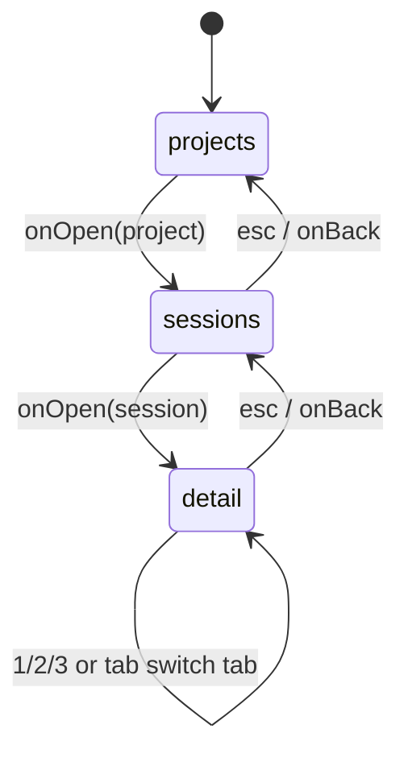

# Interactive Terminal UI

> Indexed at commit `4eeed24` on 2026-07-10 · [view on GitHub](https://github.com/yorch/cc-analyzer/tree/4eeed24)

## Relevant source files

- [src/tui/run.tsx](https://github.com/yorch/cc-analyzer/blob/4eeed24/src/tui/run.tsx)
- [src/tui/App.tsx](https://github.com/yorch/cc-analyzer/blob/4eeed24/src/tui/App.tsx)
- [src/tui/components/FilterableList.tsx](https://github.com/yorch/cc-analyzer/blob/4eeed24/src/tui/components/FilterableList.tsx)
- [src/tui/screens/ProjectsScreen.tsx](https://github.com/yorch/cc-analyzer/blob/4eeed24/src/tui/screens/ProjectsScreen.tsx)
- [src/tui/screens/SessionsScreen.tsx](https://github.com/yorch/cc-analyzer/blob/4eeed24/src/tui/screens/SessionsScreen.tsx)
- [src/tui/screens/SessionDetailScreen.tsx](https://github.com/yorch/cc-analyzer/blob/4eeed24/src/tui/screens/SessionDetailScreen.tsx)

## Overview

The Interactive Terminal UI is a browser for the local session index, built with Ink (React for the terminal). It launches when the `cc-analyzer` command runs with no arguments, presenting a three-level drill-down: a list of projects, the sessions inside a selected project, and a detailed view of a single session with Summary, Turns, and Transcript tabs. The entry point [src/tui/run.tsx#L7](https://github.com/yorch/cc-analyzer/blob/4eeed24/src/tui/run.tsx#L7) opens the SQLite database, loads the pricing table, and renders the root [`App`](https://github.com/yorch/cc-analyzer/blob/4eeed24/src/tui/App.tsx#L30) component.

The UI is read-only and depends entirely on data already written by the indexer, so `cc-analyzer index` must run before the TUI shows anything. It also requires an interactive terminal: [`runTui`](https://github.com/yorch/cc-analyzer/blob/4eeed24/src/tui/run.tsx#L7-L20) refuses to start when standard input or output is not a teletype (TTY), directing the user to the non-interactive subcommands instead. Navigation is modeled as a small screen state machine in [`App`](https://github.com/yorch/cc-analyzer/blob/4eeed24/src/tui/App.tsx#L30), while keyboard handling is decentralized: each screen owns its own `useInput` hook.

Sources: [src/tui/run.tsx:L1-L20](https://github.com/yorch/cc-analyzer/blob/4eeed24/src/tui/run.tsx#L1-L20) [src/tui/App.tsx:L30-L86](https://github.com/yorch/cc-analyzer/blob/4eeed24/src/tui/App.tsx#L30-L86)

## Architecture

The navigation model is a discriminated union `Nav` with three variants — `projects`, `sessions`, and `detail` — held in a single `useState` inside [`App`](https://github.com/yorch/cc-analyzer/blob/4eeed24/src/tui/App.tsx#L20-L40). Opening an item transitions forward and carries the data the next screen needs (the selected project plus its freshly queried sessions, then the selected session), while the shared [`back`](https://github.com/yorch/cc-analyzer/blob/4eeed24/src/tui/App.tsx#L34-L40) function pops one level toward `projects`. The `detail` screen manages its own internal tab state and never leaves the state machine except by returning to `sessions`.

Sources: [src/tui/App.tsx:L20-L86](https://github.com/yorch/cc-analyzer/blob/4eeed24/src/tui/App.tsx#L20-L86)

## Module Layout

| Module | Path | Responsibility |
| ------ | ---- | -------------- |
| `runTui` | [src/tui/run.tsx](https://github.com/yorch/cc-analyzer/blob/4eeed24/src/tui/run.tsx) | TTY guard, database/pricing bootstrap, Ink `render` |
| `App` | [src/tui/App.tsx](https://github.com/yorch/cc-analyzer/blob/4eeed24/src/tui/App.tsx) | Screen state machine and forward/back transitions |
| `FilterableList` | [src/tui/components/FilterableList.tsx](https://github.com/yorch/cc-analyzer/blob/4eeed24/src/tui/components/FilterableList.tsx) | Reusable filterable, scrolling, selectable list |
| `ProjectsScreen` | [src/tui/screens/ProjectsScreen.tsx](https://github.com/yorch/cc-analyzer/blob/4eeed24/src/tui/screens/ProjectsScreen.tsx) | Project list with cost and session totals |
| `SessionsScreen` | [src/tui/screens/SessionsScreen.tsx](https://github.com/yorch/cc-analyzer/blob/4eeed24/src/tui/screens/SessionsScreen.tsx) | Session list for one project |
| `SessionDetailScreen` | [src/tui/screens/SessionDetailScreen.tsx](https://github.com/yorch/cc-analyzer/blob/4eeed24/src/tui/screens/SessionDetailScreen.tsx) | Summary / Turns / Transcript tabbed detail view |

Sources: [src/tui/run.tsx:L1-L20](https://github.com/yorch/cc-analyzer/blob/4eeed24/src/tui/run.tsx#L1-L20) [src/tui/App.tsx:L1-L86](https://github.com/yorch/cc-analyzer/blob/4eeed24/src/tui/App.tsx#L1-L86) [src/tui/components/FilterableList.tsx:L1-L30](https://github.com/yorch/cc-analyzer/blob/4eeed24/src/tui/components/FilterableList.tsx#L1-L30)

## Key Components

### Entry point and TTY guard

[`runTui`](https://github.com/yorch/cc-analyzer/blob/4eeed24/src/tui/run.tsx#L7-L20) is the async launcher invoked by the command-line interface when no subcommand is given. It first checks `process.stdin.isTTY` and `process.stdout.isTTY`; when either is false it prints guidance toward the `stats`, `projects`, `sessions`, and `analyze` subcommands and returns without rendering ([src/tui/run.tsx#L8-L14](https://github.com/yorch/cc-analyzer/blob/4eeed24/src/tui/run.tsx#L8-L14)). Otherwise it opens the SQLite database via `openDb`, awaits `loadPricing`, renders the `App`, waits for exit with `app.waitUntilExit`, and closes the database.

Sources: [src/tui/run.tsx:L1-L20](https://github.com/yorch/cc-analyzer/blob/4eeed24/src/tui/run.tsx#L1-L20)

### App state machine

[`App`](https://github.com/yorch/cc-analyzer/blob/4eeed24/src/tui/App.tsx#L30-L86) reads all indexed projects once with `listIndexedProjects`, memoized on the database handle ([src/tui/App.tsx#L31](https://github.com/yorch/cc-analyzer/blob/4eeed24/src/tui/App.tsx#L31)). When the project list is empty it short-circuits to a message telling the user to run `cc-analyzer index` and relaunch ([src/tui/App.tsx#L42-L52](https://github.com/yorch/cc-analyzer/blob/4eeed24/src/tui/App.tsx#L42-L52)). Otherwise it renders exactly one screen based on `nav.screen`, passing `isActive` so the visible screen owns keyboard focus.

Forward navigation is data-carrying: opening a project calls `listIndexedSessions` for that project's id and stores the result on the `sessions` variant, and opening a session copies that list onto the `detail` variant so returning to `sessions` needs no re-query ([src/tui/App.tsx#L60-L83](https://github.com/yorch/cc-analyzer/blob/4eeed24/src/tui/App.tsx#L60-L83)). The [`back`](https://github.com/yorch/cc-analyzer/blob/4eeed24/src/tui/App.tsx#L34-L40) reducer maps `detail → sessions` and `sessions → projects`, and is a no-op on `projects`.

Sources: [src/tui/App.tsx:L30-L86](https://github.com/yorch/cc-analyzer/blob/4eeed24/src/tui/App.tsx#L30-L86)

### FilterableList

[`FilterableList`](https://github.com/yorch/cc-analyzer/blob/4eeed24/src/tui/components/FilterableList.tsx#L22-L106) is the generic list primitive shared by the project and session screens. It is parameterized over an item type `T` and takes `items`, a `filterText` accessor, a `renderItem` renderer, `onSelect`, `onBack`, and an optional `pageSize` defaulting to 15 ([src/tui/components/FilterableList.tsx#L4-L14](https://github.com/yorch/cc-analyzer/blob/4eeed24/src/tui/components/FilterableList.tsx#L4-L14)). It holds three pieces of local state: the filter `query`, the `cursor` position, and the scroll `offset` ([src/tui/components/FilterableList.tsx#L31-L33](https://github.com/yorch/cc-analyzer/blob/4eeed24/src/tui/components/FilterableList.tsx#L31-L33)).

Filtering is a case-insensitive substring match applied to `filterText(item)` on every keystroke, and the header shows a live `filtered/total` count ([src/tui/components/FilterableList.tsx#L35-L90](https://github.com/yorch/cc-analyzer/blob/4eeed24/src/tui/components/FilterableList.tsx#L35-L90)). Its `useInput` handler routes keys directly: Escape clears the query or, when the query is already empty, calls `onBack`; Enter selects the item under the cursor; the arrow keys move the cursor and adjust `offset` to keep the selection within the visible page window; Backspace or Delete edits the query; any other printable input that is not a modifier chord appends to the query ([src/tui/components/FilterableList.tsx#L44-L79](https://github.com/yorch/cc-analyzer/blob/4eeed24/src/tui/components/FilterableList.tsx#L44-L79)). Vim `j`/`k` are deliberately not bound to movement so those letters remain typeable into the filter ([src/tui/components/FilterableList.tsx#L16-L21](https://github.com/yorch/cc-analyzer/blob/4eeed24/src/tui/components/FilterableList.tsx#L16-L21)).

Sources: [src/tui/components/FilterableList.tsx:L1-L106](https://github.com/yorch/cc-analyzer/blob/4eeed24/src/tui/components/FilterableList.tsx#L1-L106)

### ProjectsScreen

[`ProjectsScreen`](https://github.com/yorch/cc-analyzer/blob/4eeed24/src/tui/screens/ProjectsScreen.tsx#L13-L47) renders a header aggregating total cost and session count across all projects, then delegates the list to `FilterableList`. Items are filtered by `projectPath` (falling back to `projectId`), and each row shows padded cost, session count, relative last-activity time, and a truncated path ([src/tui/screens/ProjectsScreen.tsx#L23-L41](https://github.com/yorch/cc-analyzer/blob/4eeed24/src/tui/screens/ProjectsScreen.tsx#L23-L41)). The selected row is highlighted with a cyan background. `onSelect` forwards to the parent's `onOpen`, driving the transition into the sessions screen.

Sources: [src/tui/screens/ProjectsScreen.tsx:L1-L47](https://github.com/yorch/cc-analyzer/blob/4eeed24/src/tui/screens/ProjectsScreen.tsx#L1-L47)

### SessionsScreen

[`SessionsScreen`](https://github.com/yorch/cc-analyzer/blob/4eeed24/src/tui/screens/SessionsScreen.tsx#L14-L46) mirrors the projects screen for one project's sessions. Its header shows the project path and session count, and rows render cost (with a `~` marker when `costEstimated` is set), relative modified time, and a truncated title ([src/tui/screens/SessionsScreen.tsx#L29-L40](https://github.com/yorch/cc-analyzer/blob/4eeed24/src/tui/screens/SessionsScreen.tsx#L29-L40)). Filtering matches against the concatenation of session title and id ([src/tui/screens/SessionsScreen.tsx#L28](https://github.com/yorch/cc-analyzer/blob/4eeed24/src/tui/screens/SessionsScreen.tsx#L28)). Because it wires `onBack` through to `FilterableList`, pressing Escape on an empty filter returns to the projects list.

Sources: [src/tui/screens/SessionsScreen.tsx:L1-L46](https://github.com/yorch/cc-analyzer/blob/4eeed24/src/tui/screens/SessionsScreen.tsx#L1-L46)

### SessionDetailScreen

[`SessionDetailScreen`](https://github.com/yorch/cc-analyzer/blob/4eeed24/src/tui/screens/SessionDetailScreen.tsx#L38-L116) is the only screen that reads the raw session file rather than the index. On mount it runs an effect that calls `parseSessionFile`, `analyzeSession`, and `buildTranscript`, using a `cancelled` flag to avoid setting state after unmount, and shows "Loading session…" until the data arrives ([src/tui/screens/SessionDetailScreen.tsx#L43-L84](https://github.com/yorch/cc-analyzer/blob/4eeed24/src/tui/screens/SessionDetailScreen.tsx#L43-L84)). It maintains a `tab` state over the three tabs and a scroll `offset` reset whenever the tab changes ([src/tui/screens/SessionDetailScreen.tsx#L39-L63](https://github.com/yorch/cc-analyzer/blob/4eeed24/src/tui/screens/SessionDetailScreen.tsx#L39-L63)).

The Summary tab renders per-category cost, turn/API/tool counts, duration, models, tools, skills, subagents, and files touched via [`SummaryView`](https://github.com/yorch/cc-analyzer/blob/4eeed24/src/tui/screens/SessionDetailScreen.tsx#L118-L151). The Turns tab paginates the analysis turns with per-turn cost, API-call count, and prompt preview ([src/tui/screens/SessionDetailScreen.tsx#L153-L179](https://github.com/yorch/cc-analyzer/blob/4eeed24/src/tui/screens/SessionDetailScreen.tsx#L153-L179)), and the Transcript tab renders each item color-coded by kind — prompt, text, thinking, tool_use, tool_result — clipping each body to four lines with an ellipsis marker ([src/tui/screens/SessionDetailScreen.tsx#L30-L36](https://github.com/yorch/cc-analyzer/blob/4eeed24/src/tui/screens/SessionDetailScreen.tsx#L30-L36) [src/tui/screens/SessionDetailScreen.tsx#L181-L216](https://github.com/yorch/cc-analyzer/blob/4eeed24/src/tui/screens/SessionDetailScreen.tsx#L181-L216)).

Sources: [src/tui/screens/SessionDetailScreen.tsx:L1-L216](https://github.com/yorch/cc-analyzer/blob/4eeed24/src/tui/screens/SessionDetailScreen.tsx#L1-L216)

## Input Handling & Keybindings

Keyboard handling is decentralized: there is no central dispatcher, and each screen registers its own `useInput` gated by an `isActive` flag so only the mounted screen responds. The list screens inherit their bindings from `FilterableList`, while `SessionDetailScreen` defines its own set for tab switching and scrolling ([src/tui/screens/SessionDetailScreen.tsx#L65-L82](https://github.com/yorch/cc-analyzer/blob/4eeed24/src/tui/screens/SessionDetailScreen.tsx#L65-L82)). Because the detail screen has no free-text filter, it can bind `j`/`k` and `g`/`G` for navigation that the list screens reserve for typing.

| Key | Projects / Sessions | Session Detail |
| --- | ------------------- | -------------- |
| printable | append to filter | `1`/`s`, `2`/`t`, `3`/`r` switch tab |
| `↑` / `↓` | move cursor | scroll one row (`k`/`j` also) |
| `tab` | (ignored) | next tab |
| `g` / `G` | append to filter | jump to top / bottom |
| `enter` | open item | (none) |
| `backspace` | edit filter | (none) |
| `esc` | clear filter, else back | back to sessions |
| `ctrl-c` | quit | quit |

Sources: [src/tui/components/FilterableList.tsx:L44-L79](https://github.com/yorch/cc-analyzer/blob/4eeed24/src/tui/components/FilterableList.tsx#L44-L79) [src/tui/screens/SessionDetailScreen.tsx:L65-L82](https://github.com/yorch/cc-analyzer/blob/4eeed24/src/tui/screens/SessionDetailScreen.tsx#L65-L82) [src/tui/screens/ProjectsScreen.tsx:L42-L44](https://github.com/yorch/cc-analyzer/blob/4eeed24/src/tui/screens/ProjectsScreen.tsx#L42-L44)

## Related Pages

- Core analysis engine: [Core Analysis Engine](./2-core-analysis-engine.md)
- Command-line interface: [CLI](./3-cli.md)
- Web server and API: [Web Server and API](./5-web-server-and-api.md)
- Web SPA frontend: [Web SPA Frontend](./6-web-spa-frontend.md)
