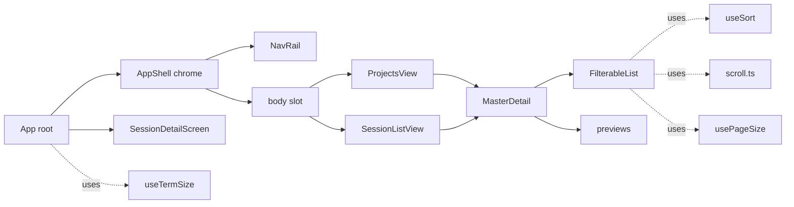
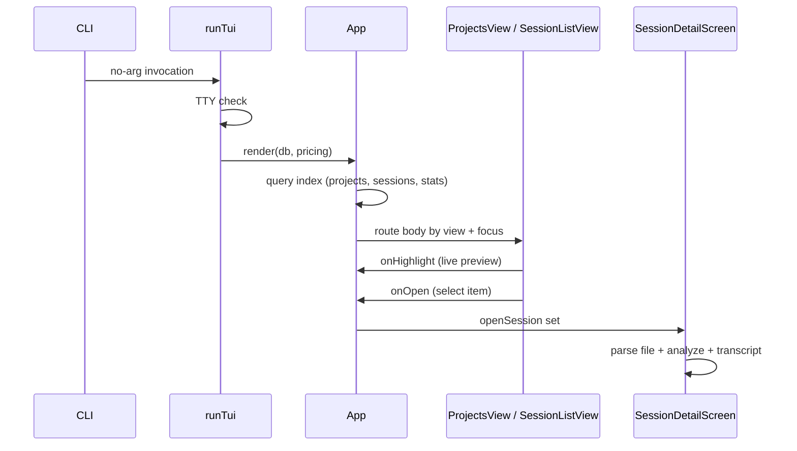

# Interactive Terminal UI

> Indexed at commit `bf5a4c8` on 2026-07-12 · [view on GitHub](https://github.com/yorch/cc-analyzer/tree/bf5a4c8)

## Relevant source files

- [src/tui/run.tsx](https://github.com/yorch/cc-analyzer/blob/bf5a4c8/src/tui/run.tsx)
- [src/tui/App.tsx](https://github.com/yorch/cc-analyzer/blob/bf5a4c8/src/tui/App.tsx)
- [src/tui/shell/AppShell.tsx](https://github.com/yorch/cc-analyzer/blob/bf5a4c8/src/tui/shell/AppShell.tsx)
- [src/tui/shell/MasterDetail.tsx](https://github.com/yorch/cc-analyzer/blob/bf5a4c8/src/tui/shell/MasterDetail.tsx)
- [src/tui/theme.ts](https://github.com/yorch/cc-analyzer/blob/bf5a4c8/src/tui/theme.ts)
- [src/tui/scroll.ts](https://github.com/yorch/cc-analyzer/blob/bf5a4c8/src/tui/scroll.ts)
- [src/tui/useTermSize.ts](https://github.com/yorch/cc-analyzer/blob/bf5a4c8/src/tui/useTermSize.ts)
- [src/tui/usePageSize.ts](https://github.com/yorch/cc-analyzer/blob/bf5a4c8/src/tui/usePageSize.ts)
- [src/tui/useSort.ts](https://github.com/yorch/cc-analyzer/blob/bf5a4c8/src/tui/useSort.ts)
- [src/tui/components/FilterableList.tsx](https://github.com/yorch/cc-analyzer/blob/bf5a4c8/src/tui/components/FilterableList.tsx)
- [src/tui/components/ui.tsx](https://github.com/yorch/cc-analyzer/blob/bf5a4c8/src/tui/components/ui.tsx)
- [src/tui/components/PortfolioLede.tsx](https://github.com/yorch/cc-analyzer/blob/bf5a4c8/src/tui/components/PortfolioLede.tsx)
- [src/tui/components/previews.tsx](https://github.com/yorch/cc-analyzer/blob/bf5a4c8/src/tui/components/previews.tsx)
- [src/tui/screens/ProjectsView.tsx](https://github.com/yorch/cc-analyzer/blob/bf5a4c8/src/tui/screens/ProjectsView.tsx)
- [src/tui/screens/SessionListView.tsx](https://github.com/yorch/cc-analyzer/blob/bf5a4c8/src/tui/screens/SessionListView.tsx)
- [src/tui/screens/SessionDetailScreen.tsx](https://github.com/yorch/cc-analyzer/blob/bf5a4c8/src/tui/screens/SessionDetailScreen.tsx)

## Overview

The interactive Terminal User Interface (TUI) is an Ink (React-for-terminal) application that browses the indexed portfolio of Claude Code sessions inside a persistent, amber-phosphor master-detail shell. It launches when the Command-Line Interface (CLI) runs with no arguments, via `runTui` in [src/tui/run.tsx](https://github.com/yorch/cc-analyzer/blob/bf5a4c8/src/tui/run.tsx), which opens the SQLite index with `openDb`, loads a pricing table with `loadPricing`, and renders the `App` component through Ink's `render` ([src/tui/run.tsx#L15-L19](https://github.com/yorch/cc-analyzer/blob/bf5a4c8/src/tui/run.tsx#L15-L19)). It requires a real terminal: when either standard-input or standard-output is not a TeleTYpewriter (TTY), `runTui` prints a message pointing at the non-interactive commands and returns without rendering ([src/tui/run.tsx#L8-L14](https://github.com/yorch/cc-analyzer/blob/bf5a4c8/src/tui/run.tsx#L8-L14)).

The UI reads entirely from the SQLite index rather than parsing session files on the fly, so `cc-analyzer index` must run first. The `App` root pulls projects, sessions, and portfolio statistics from `../core/queries.ts` and `../core/stats.ts` ([src/tui/App.tsx#L39-L42](https://github.com/yorch/cc-analyzer/blob/bf5a4c8/src/tui/App.tsx#L39-L42)); when the index holds no projects it renders an empty-state prompt telling the user to run the indexer and relaunch ([src/tui/App.tsx#L74-L84](https://github.com/yorch/cc-analyzer/blob/bf5a4c8/src/tui/App.tsx#L74-L84)). The one exception is the session detail screen, which parses the raw session file to build a full transcript on demand.

## Architecture

The `App` root owns view and focus state, wraps everything in the `AppShell` chrome, and swaps the body between `ProjectsView` and `SessionListView`. Each of those list screens composes `MasterDetail`, which pairs a `FilterableList` master with a preview detail pane. Opening a session escapes the shell entirely and mounts the full-screen `SessionDetailScreen` ([src/tui/App.tsx#L94-L107](https://github.com/yorch/cc-analyzer/blob/bf5a4c8/src/tui/App.tsx#L94-L107)). The hooks (`useSort`, `useTermSize`, `usePageSize`) and `scroll.ts` are cross-cutting utilities the screens share.

Sources: [src/tui/App.tsx:L38-L195](https://github.com/yorch/cc-analyzer/blob/bf5a4c8/src/tui/App.tsx#L38-L195) [src/tui/shell/AppShell.tsx:L42-L69](https://github.com/yorch/cc-analyzer/blob/bf5a4c8/src/tui/shell/AppShell.tsx#L42-L69) [src/tui/shell/MasterDetail.tsx:L29-L60](https://github.com/yorch/cc-analyzer/blob/bf5a4c8/src/tui/shell/MasterDetail.tsx#L29-L60)

## Module Layout

| Module | Path | Responsibility |
| ------ | ---- | -------------- |
| `runTui` | [src/tui/run.tsx](https://github.com/yorch/cc-analyzer/blob/bf5a4c8/src/tui/run.tsx) | TTY gate, database and pricing setup, Ink render entry point |
| `App` | [src/tui/App.tsx](https://github.com/yorch/cc-analyzer/blob/bf5a4c8/src/tui/App.tsx) | Root: view/focus/drill state, keybindings, body routing |
| `AppShell` | [src/tui/shell/AppShell.tsx](https://github.com/yorch/cc-analyzer/blob/bf5a4c8/src/tui/shell/AppShell.tsx) | Persistent chrome: title bar, nav rail, lede slot, key bar |
| `MasterDetail` | [src/tui/shell/MasterDetail.tsx](https://github.com/yorch/cc-analyzer/blob/bf5a4c8/src/tui/shell/MasterDetail.tsx) | Two-pane master-detail body with responsive collapse |
| `theme` | [src/tui/theme.ts](https://github.com/yorch/cc-analyzer/blob/bf5a4c8/src/tui/theme.ts) | Amber-phosphor palette, semantic roles, selection style, sparklines |
| `ProjectsView` | [src/tui/screens/ProjectsView.tsx](https://github.com/yorch/cc-analyzer/blob/bf5a4c8/src/tui/screens/ProjectsView.tsx) | Projects master list + live project preview |
| `SessionListView` | [src/tui/screens/SessionListView.tsx](https://github.com/yorch/cc-analyzer/blob/bf5a4c8/src/tui/screens/SessionListView.tsx) | Sessions master list + live session preview |
| `SessionDetailScreen` | [src/tui/screens/SessionDetailScreen.tsx](https://github.com/yorch/cc-analyzer/blob/bf5a4c8/src/tui/screens/SessionDetailScreen.tsx) | Full-screen session view: turns, transcript, summary |
| `FilterableList` | [src/tui/components/FilterableList.tsx](https://github.com/yorch/cc-analyzer/blob/bf5a4c8/src/tui/components/FilterableList.tsx) | Reusable scrolling list with inline substring filter |
| hooks/utils | [src/tui/useSort.ts](https://github.com/yorch/cc-analyzer/blob/bf5a4c8/src/tui/useSort.ts), [src/tui/scroll.ts](https://github.com/yorch/cc-analyzer/blob/bf5a4c8/src/tui/scroll.ts) | Column sorting, scroll-window math, responsive sizing |

Sources: [src/tui/App.tsx:L1-L36](https://github.com/yorch/cc-analyzer/blob/bf5a4c8/src/tui/App.tsx#L1-L36) [src/tui/run.tsx:L1-L20](https://github.com/yorch/cc-analyzer/blob/bf5a4c8/src/tui/run.tsx#L1-L20)

## Key Components

### App root and navigation model

`App` holds the whole navigation state: the active `view` (one of `portfolio`, `projects`, `sessions`, `insights`, `trends`), whether input `focus` is on the `rail` or the `body`, the drilled-into `drill` project and its `drillSessions`, the `openSession`, and the `help` flag ([src/tui/App.tsx#L45-L50](https://github.com/yorch/cc-analyzer/blob/bf5a4c8/src/tui/App.tsx#L45-L50)). The `useInput` handler only acts when focus is on the rail: arrows move between views with `moveView`, digits `1`-`5` jump directly to a view, and Enter, right-arrow, Escape, or left-arrow hand focus to the body ([src/tui/App.tsx#L58-L72](https://github.com/yorch/cc-analyzer/blob/bf5a4c8/src/tui/App.tsx#L58-L72)). When the body has focus, the active list owns input, so the handler defers to it ([src/tui/App.tsx#L61](https://github.com/yorch/cc-analyzer/blob/bf5a4c8/src/tui/App.tsx#L61)).

Drilling is a two-level model. From the projects list, `openProject` records the drill target and loads its sessions with `listIndexedSessions` ([src/tui/App.tsx#L111-L115](https://github.com/yorch/cc-analyzer/blob/bf5a4c8/src/tui/App.tsx#L111-L115)); `popDrill` clears it. Opening any session sets `openSession`, which short-circuits the render to the full-screen detail screen ([src/tui/App.tsx#L94-L107](https://github.com/yorch/cc-analyzer/blob/bf5a4c8/src/tui/App.tsx#L94-L107)). The `insights` and `trends` views are placeholders marked `soon`, rendering a "Coming in a later phase" note ([src/tui/App.tsx#L176](https://github.com/yorch/cc-analyzer/blob/bf5a4c8/src/tui/App.tsx#L176), [src/tui/App.tsx#L197-L203](https://github.com/yorch/cc-analyzer/blob/bf5a4c8/src/tui/App.tsx#L197-L203)).

Sources: [src/tui/App.tsx:L38-L195](https://github.com/yorch/cc-analyzer/blob/bf5a4c8/src/tui/App.tsx#L38-L195)

### AppShell chrome

`AppShell` is the persistent frame: a `TitleBar` showing `◆ cc-analyzer` with the version and a right-aligned breadcrumb, an optional `lede` band, the nav rail beside the body, and a `KeyBar` of context hints ([src/tui/shell/AppShell.tsx#L54-L68](https://github.com/yorch/cc-analyzer/blob/bf5a4c8/src/tui/shell/AppShell.tsx#L54-L68)). The whole shell is pinned to `rows - 2` with `overflow="hidden"`, and the body between the lede and key bar flex-grows and clips overflow, so the title and key bar stay on screen and the frame never grows taller than the viewport ([src/tui/shell/AppShell.tsx#L32-L55](https://github.com/yorch/cc-analyzer/blob/bf5a4c8/src/tui/shell/AppShell.tsx#L32-L55)). The `NavRail` renders each entry's icon and label, highlighting the active view with an inverse amber bar and a `❯` marker when the rail is focused ([src/tui/shell/AppShell.tsx#L82-L118](https://github.com/yorch/cc-analyzer/blob/bf5a4c8/src/tui/shell/AppShell.tsx#L82-L118)). The `KeyBar` always appends `? help · ctrl-c quit` ([src/tui/shell/AppShell.tsx#L121-L128](https://github.com/yorch/cc-analyzer/blob/bf5a4c8/src/tui/shell/AppShell.tsx#L121-L128)).

Sources: [src/tui/shell/AppShell.tsx:L1-L129](https://github.com/yorch/cc-analyzer/blob/bf5a4c8/src/tui/shell/AppShell.tsx#L1-L129)

### MasterDetail pane pattern

`MasterDetail` is the two-pane body used by both list screens: a fixed-width master pane on the left drives a flex-growing detail pane on the right ([src/tui/shell/MasterDetail.tsx#L39-L59](https://github.com/yorch/cc-analyzer/blob/bf5a4c8/src/tui/shell/MasterDetail.tsx#L39-L59)). The `masterWidth` helper computes the master pane's column width — 40% of terminal columns by default, floored at 22 — so list rows can truncate their content to fit rather than wrap ([src/tui/shell/MasterDetail.tsx#L20-L22](https://github.com/yorch/cc-analyzer/blob/bf5a4c8/src/tui/shell/MasterDetail.tsx#L20-L22)). On narrow terminals the detail pane is dropped and only the master renders, matching the pre-shell single-column stack ([src/tui/shell/MasterDetail.tsx#L36-L38](https://github.com/yorch/cc-analyzer/blob/bf5a4c8/src/tui/shell/MasterDetail.tsx#L36-L38)).

Sources: [src/tui/shell/MasterDetail.tsx:L1-L60](https://github.com/yorch/cc-analyzer/blob/bf5a4c8/src/tui/shell/MasterDetail.tsx#L1-L60)

### FilterableList and previews

`FilterableList` is the reusable master widget. Printable keys build an inline substring `query`, arrows move the `cursor`, Enter selects, backspace edits the query, and Escape clears the query or calls `onBack` when it is already empty ([src/tui/components/FilterableList.tsx#L69-L108](https://github.com/yorch/cc-analyzer/blob/bf5a4c8/src/tui/components/FilterableList.tsx#L69-L108)). Vim `j`/`k` are deliberately not bound so those letters can be typed into the filter ([src/tui/components/FilterableList.tsx#L28-L33](https://github.com/yorch/cc-analyzer/blob/bf5a4c8/src/tui/components/FilterableList.tsx#L28-L33)). As the cursor or filter moves, the list fires `onHighlight` with the current item so the parent can update the live detail preview ([src/tui/components/FilterableList.tsx#L57-L62](https://github.com/yorch/cc-analyzer/blob/bf5a4c8/src/tui/components/FilterableList.tsx#L57-L62)). The header shows the filter query, a `filtered/total` count, and the current sort label ([src/tui/components/FilterableList.tsx#L112-L129](https://github.com/yorch/cc-analyzer/blob/bf5a4c8/src/tui/components/FilterableList.tsx#L112-L129)).

The `previews` module renders the detail pane. `ProjectPreview` shows a selected project's spend, session count, tokens, cache share, and last-active time ([src/tui/components/previews.tsx#L29-L59](https://github.com/yorch/cc-analyzer/blob/bf5a4c8/src/tui/components/previews.tsx#L29-L59)), and `SessionPreview` shows a session's cost, tokens, turns, call and tool counts, and timestamps ([src/tui/components/previews.tsx#L62-L110](https://github.com/yorch/cc-analyzer/blob/bf5a4c8/src/tui/components/previews.tsx#L62-L110)). Both close with a hint that Enter drills deeper. The shared `ui.tsx` supplies `Footer`, `Loading`, `Empty`, `ScrollRange`, and the modal `HelpOverlay` cheatsheet that lists every keybinding and closes on any key ([src/tui/components/ui.tsx#L79-L105](https://github.com/yorch/cc-analyzer/blob/bf5a4c8/src/tui/components/ui.tsx#L79-L105)).

Sources: [src/tui/components/FilterableList.tsx:L1-L145](https://github.com/yorch/cc-analyzer/blob/bf5a4c8/src/tui/components/FilterableList.tsx#L1-L145) [src/tui/components/previews.tsx:L1-L110](https://github.com/yorch/cc-analyzer/blob/bf5a4c8/src/tui/components/previews.tsx#L1-L110) [src/tui/components/ui.tsx:L1-L105](https://github.com/yorch/cc-analyzer/blob/bf5a4c8/src/tui/components/ui.tsx#L1-L105)

### List screens and PortfolioLede

`ProjectsView` and `SessionListView` are thin adapters that wrap a `FilterableList` master and a preview detail inside `MasterDetail`. Each defines its own `SORT_FIELDS` — projects sort by recent, cost, tokens, sessions, or name ([src/tui/screens/ProjectsView.tsx#L11-L17](https://github.com/yorch/cc-analyzer/blob/bf5a4c8/src/tui/screens/ProjectsView.tsx#L11-L17)); sessions by recent, cost, tokens, or title ([src/tui/screens/SessionListView.tsx#L11-L16](https://github.com/yorch/cc-analyzer/blob/bf5a4c8/src/tui/screens/SessionListView.tsx#L11-L16)) — and pipe the sorted rows into the list while tracking the highlighted item for the preview ([src/tui/screens/ProjectsView.tsx#L29-L61](https://github.com/yorch/cc-analyzer/blob/bf5a4c8/src/tui/screens/ProjectsView.tsx#L29-L61)). `SessionListView` is generic and shared by both the all-sessions rail view and a project's drilled-in list, with a `showProject` flag adding the owning project to the searchable filter text ([src/tui/screens/SessionListView.tsx#L31-L63](https://github.com/yorch/cc-analyzer/blob/bf5a4c8/src/tui/screens/SessionListView.tsx#L31-L63)). `PortfolioLede` is the full-width band under the title bar on the portfolio view: total spend, tokens, session and project counts, date range, estimated share, and a per-month spend sparkline ([src/tui/components/PortfolioLede.tsx#L8-L40](https://github.com/yorch/cc-analyzer/blob/bf5a4c8/src/tui/components/PortfolioLede.tsx#L8-L40)).

Sources: [src/tui/screens/ProjectsView.tsx:L1-L62](https://github.com/yorch/cc-analyzer/blob/bf5a4c8/src/tui/screens/ProjectsView.tsx#L1-L62) [src/tui/screens/SessionListView.tsx:L1-L78](https://github.com/yorch/cc-analyzer/blob/bf5a4c8/src/tui/screens/SessionListView.tsx#L1-L78) [src/tui/components/PortfolioLede.tsx:L1-L40](https://github.com/yorch/cc-analyzer/blob/bf5a4c8/src/tui/components/PortfolioLede.tsx#L1-L40)

### SessionDetailScreen

Opening a session mounts `SessionDetailScreen` full-screen. It parses the raw session file with `parseSessionFile`, runs `analyzeSession`, and builds a transcript with `buildTranscript` in an effect, showing a `Loading` line until the data arrives ([src/tui/screens/SessionDetailScreen.tsx#L44-L71](https://github.com/yorch/cc-analyzer/blob/bf5a4c8/src/tui/screens/SessionDetailScreen.tsx#L44-L71)). It has three modes — `turns`, `transcript`, `summary` — switched with `t`/`s`/`u` or digits `1`-`3`, with Escape returning to `turns` from the other modes ([src/tui/screens/SessionDetailScreen.tsx#L59-L69](https://github.com/yorch/cc-analyzer/blob/bf5a4c8/src/tui/screens/SessionDetailScreen.tsx#L59-L69)). The `TurnsPane` is itself a master-detail: a turns list drives a steps detail, toggling between the `turns` and `steps` panes with right/left arrows, Tab, or Enter, mirroring the shell's rail-body model ([src/tui/screens/SessionDetailScreen.tsx#L144-L208](https://github.com/yorch/cc-analyzer/blob/bf5a4c8/src/tui/screens/SessionDetailScreen.tsx#L144-L208)). Individual steps expand in place via `StepRow`, showing per-step input and result detail with a chevron and status marks ([src/tui/screens/SessionDetailScreen.tsx#L279-L324](https://github.com/yorch/cc-analyzer/blob/bf5a4c8/src/tui/screens/SessionDetailScreen.tsx#L279-L324)).

Sources: [src/tui/screens/SessionDetailScreen.tsx:L40-L324](https://github.com/yorch/cc-analyzer/blob/bf5a4c8/src/tui/screens/SessionDetailScreen.tsx#L40-L324)

### Theme, sizing, sorting, and scrolling

`theme.ts` is the single source of the amber-phosphor design system: a `palette` of hex colors, intent-named `role` aliases (`heading`, `cost`, `body`, `muted`), a `selection` style that paints selected rows amber-inverse, and helpers for sparklines and bars ([src/tui/theme.ts#L19-L84](https://github.com/yorch/cc-analyzer/blob/bf5a4c8/src/tui/theme.ts#L19-L84)). It also maps step and transcript kinds to icons and colors ([src/tui/theme.ts#L86-L122](https://github.com/yorch/cc-analyzer/blob/bf5a4c8/src/tui/theme.ts#L86-L122)). `useTermSize` tracks live terminal dimensions, updating on resize and falling back to 80×24 ([src/tui/useTermSize.ts#L10-L27](https://github.com/yorch/cc-analyzer/blob/bf5a4c8/src/tui/useTermSize.ts#L10-L27)), and its `layoutMode` classifies width into `full`, `compact`, or `narrow` to drive the responsive rail and pane collapse ([src/tui/useTermSize.ts#L29-L41](https://github.com/yorch/cc-analyzer/blob/bf5a4c8/src/tui/useTermSize.ts#L29-L41)). `usePageSize` derives how many list rows fit from terminal height minus reserved chrome ([src/tui/usePageSize.ts#L9-L13](https://github.com/yorch/cc-analyzer/blob/bf5a4c8/src/tui/usePageSize.ts#L9-L13)). `useSort` cycles sort fields on Tab and flips direction on Shift-Tab, defaulting to descending ([src/tui/useSort.ts#L30-L42](https://github.com/yorch/cc-analyzer/blob/bf5a4c8/src/tui/useSort.ts#L30-L42)). `scrollOffset` keeps the cursor inside the visible window so every scrollable pane scrolls identically ([src/tui/scroll.ts#L7-L11](https://github.com/yorch/cc-analyzer/blob/bf5a4c8/src/tui/scroll.ts#L7-L11)).

Sources: [src/tui/theme.ts:L19-L122](https://github.com/yorch/cc-analyzer/blob/bf5a4c8/src/tui/theme.ts#L19-L122) [src/tui/useTermSize.ts:L10-L41](https://github.com/yorch/cc-analyzer/blob/bf5a4c8/src/tui/useTermSize.ts#L10-L41) [src/tui/usePageSize.ts:L9-L13](https://github.com/yorch/cc-analyzer/blob/bf5a4c8/src/tui/usePageSize.ts#L9-L13) [src/tui/useSort.ts:L30-L42](https://github.com/yorch/cc-analyzer/blob/bf5a4c8/src/tui/useSort.ts#L30-L42) [src/tui/scroll.ts:L7-L11](https://github.com/yorch/cc-analyzer/blob/bf5a4c8/src/tui/scroll.ts#L7-L11)

## Data Flow

The flow starts with a no-argument CLI invocation reaching `runTui`, which gates on a TTY and renders `App` with the database and pricing table ([src/tui/run.tsx#L7-L19](https://github.com/yorch/cc-analyzer/blob/bf5a4c8/src/tui/run.tsx#L7-L19)). `App` queries the index once via memoized selectors and routes the body based on the current view and focus ([src/tui/App.tsx#L39-L177](https://github.com/yorch/cc-analyzer/blob/bf5a4c8/src/tui/App.tsx#L39-L177)). List screens report highlights back for live previews and selections back to open items; selecting a session hands off to `SessionDetailScreen`, the only place that reads a raw session file ([src/tui/screens/SessionDetailScreen.tsx#L44-L55](https://github.com/yorch/cc-analyzer/blob/bf5a4c8/src/tui/screens/SessionDetailScreen.tsx#L44-L55)).

Sources: [src/tui/run.tsx:L7-L19](https://github.com/yorch/cc-analyzer/blob/bf5a4c8/src/tui/run.tsx#L7-L19) [src/tui/App.tsx:L39-L177](https://github.com/yorch/cc-analyzer/blob/bf5a4c8/src/tui/App.tsx#L39-L177) [src/tui/screens/SessionDetailScreen.tsx:L44-L69](https://github.com/yorch/cc-analyzer/blob/bf5a4c8/src/tui/screens/SessionDetailScreen.tsx#L44-L69)

## Configuration & Extension Points

| Setting | Type | Default | Purpose |
| ------- | ---- | ------- | ------- |
| `layoutMode` breakpoints | `LayoutMode` | `full` ≥100, `compact` ≥90, else `narrow` | Responsive rail labels and two-pane collapse |
| `masterWidth` percentage | `number` | 40% of columns, min 22 | Master pane width; drives row truncation |
| `SORT_FIELDS` | `SortField<T>[]` | recent (descending) | Per-list Tab-cycled sort columns |
| `usePageSize` reserved | `number` | varies per screen | Chrome lines subtracted from terminal height |

The responsive breakpoints in `layoutMode` and the `masterWidth` split govern how the shell reflows across terminal sizes ([src/tui/useTermSize.ts#L37-L41](https://github.com/yorch/cc-analyzer/blob/bf5a4c8/src/tui/useTermSize.ts#L37-L41), [src/tui/shell/MasterDetail.tsx#L16-L22](https://github.com/yorch/cc-analyzer/blob/bf5a4c8/src/tui/shell/MasterDetail.tsx#L16-L22)). New sort columns are added by extending a screen's `SORT_FIELDS` array, and the amber-phosphor identity is centralized in `theme.ts`, so restyling touches one file.

Sources: [src/tui/useTermSize.ts:L37-L41](https://github.com/yorch/cc-analyzer/blob/bf5a4c8/src/tui/useTermSize.ts#L37-L41) [src/tui/shell/MasterDetail.tsx:L16-L22](https://github.com/yorch/cc-analyzer/blob/bf5a4c8/src/tui/shell/MasterDetail.tsx#L16-L22) [src/tui/theme.ts:L19-L44](https://github.com/yorch/cc-analyzer/blob/bf5a4c8/src/tui/theme.ts#L19-L44)

## Related Pages

- Core analysis engine: [Core Analysis Engine](./2-core-analysis-engine.md)
- Command-line interface: [CLI](./3-cli.md)
- Web server and API: [Web Server and API](./5-web-server-and-api.md)
- Web single-page app: [Web SPA Frontend](./6-web-spa-frontend.md)
