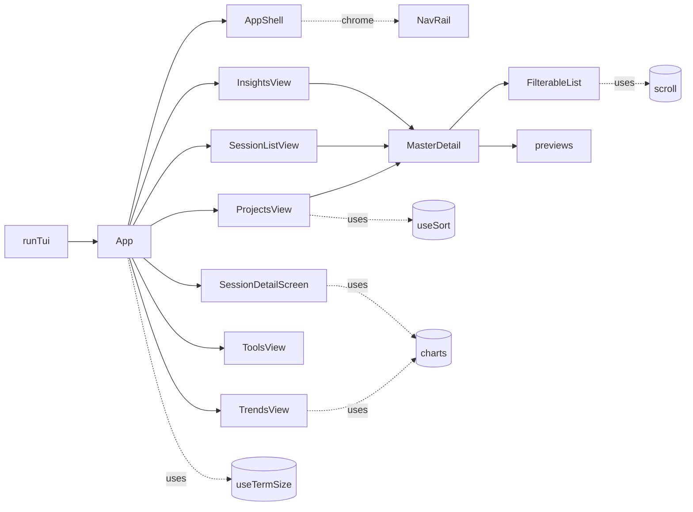
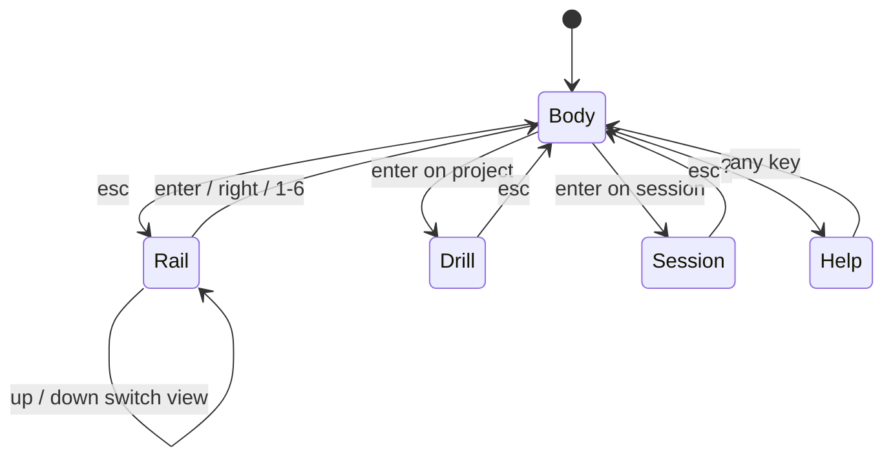

# Interactive Terminal UI

> Indexed at commit `51ccd4e` on 2026-07-23 · [view on GitHub](https://github.com/yorch/cc-analyzer/tree/51ccd4e)

## Relevant source files

- [src/tui/run.tsx](https://github.com/yorch/cc-analyzer/blob/51ccd4e/src/tui/run.tsx)
- [src/tui/App.tsx](https://github.com/yorch/cc-analyzer/blob/51ccd4e/src/tui/App.tsx)
- [src/tui/shell/AppShell.tsx](https://github.com/yorch/cc-analyzer/blob/51ccd4e/src/tui/shell/AppShell.tsx)
- [src/tui/shell/MasterDetail.tsx](https://github.com/yorch/cc-analyzer/blob/51ccd4e/src/tui/shell/MasterDetail.tsx)
- [src/tui/theme.ts](https://github.com/yorch/cc-analyzer/blob/51ccd4e/src/tui/theme.ts)
- [src/tui/keys.ts](https://github.com/yorch/cc-analyzer/blob/51ccd4e/src/tui/keys.ts)
- [src/tui/scroll.ts](https://github.com/yorch/cc-analyzer/blob/51ccd4e/src/tui/scroll.ts)
- [src/tui/charts.ts](https://github.com/yorch/cc-analyzer/blob/51ccd4e/src/tui/charts.ts)
- [src/tui/useTermSize.ts](https://github.com/yorch/cc-analyzer/blob/51ccd4e/src/tui/useTermSize.ts)
- [src/tui/usePageSize.ts](https://github.com/yorch/cc-analyzer/blob/51ccd4e/src/tui/usePageSize.ts)
- [src/tui/useSort.ts](https://github.com/yorch/cc-analyzer/blob/51ccd4e/src/tui/useSort.ts)
- [src/tui/components/FilterableList.tsx](https://github.com/yorch/cc-analyzer/blob/51ccd4e/src/tui/components/FilterableList.tsx)
- [src/tui/components/ui.tsx](https://github.com/yorch/cc-analyzer/blob/51ccd4e/src/tui/components/ui.tsx)
- [src/tui/components/PortfolioLede.tsx](https://github.com/yorch/cc-analyzer/blob/51ccd4e/src/tui/components/PortfolioLede.tsx)
- [src/tui/components/previews.tsx](https://github.com/yorch/cc-analyzer/blob/51ccd4e/src/tui/components/previews.tsx)
- [src/tui/screens/ProjectsView.tsx](https://github.com/yorch/cc-analyzer/blob/51ccd4e/src/tui/screens/ProjectsView.tsx)
- [src/tui/screens/SessionListView.tsx](https://github.com/yorch/cc-analyzer/blob/51ccd4e/src/tui/screens/SessionListView.tsx)
- [src/tui/screens/SessionDetailScreen.tsx](https://github.com/yorch/cc-analyzer/blob/51ccd4e/src/tui/screens/SessionDetailScreen.tsx)
- [src/tui/screens/InsightsView.tsx](https://github.com/yorch/cc-analyzer/blob/51ccd4e/src/tui/screens/InsightsView.tsx)
- [src/tui/screens/TrendsView.tsx](https://github.com/yorch/cc-analyzer/blob/51ccd4e/src/tui/screens/TrendsView.tsx)
- [src/tui/screens/ToolsView.tsx](https://github.com/yorch/cc-analyzer/blob/51ccd4e/src/tui/screens/ToolsView.tsx)

## Overview

The interactive terminal user interface (TUI) is the default frontend of `cc-analyzer`: running the command with no arguments launches it via `runTui()` in [src/tui/run.tsx](https://github.com/yorch/cc-analyzer/blob/51ccd4e/src/tui/run.tsx). It is built with Ink (React rendered to the terminal) and reads exclusively from the SQLite index. On first use, `runTui()` builds an empty index automatically before loading pricing and mounting the root `App`; later launches inspect freshness without re-parsing changed sessions. Because it needs raw terminal input and cursor control, it refuses to start unless both stdin and stdout are a teletypewriter (TTY), printing a hint to use the scriptable `stats`, `sessions`, or `analyze` commands instead ([src/tui/run.tsx#L8-L14](https://github.com/yorch/cc-analyzer/blob/51ccd4e/src/tui/run.tsx#L8-L14)).

Visually the TUI is an amber-phosphor master-detail application: a persistent chrome of title bar, nav rail, and key bar wraps a body that switches between six views — `portfolio`, `projects`, `sessions`, `insights`, `trends`, and `tools` ([src/tui/App.tsx#L40-L49](https://github.com/yorch/cc-analyzer/blob/51ccd4e/src/tui/App.tsx#L40-L49)). Most views follow the same pattern: a scrollable, filterable master list drives a live detail preview, and drilling into a row either descends a level or opens a full-screen session detail. The design system, keybindings, scroll math, and terminal-native chart primitives are factored into small shared modules so every screen behaves identically.

Sources: [src/tui/run.tsx:L1-L21](https://github.com/yorch/cc-analyzer/blob/51ccd4e/src/tui/run.tsx#L1-L21) [src/tui/App.tsx:L40-L49](https://github.com/yorch/cc-analyzer/blob/51ccd4e/src/tui/App.tsx#L40-L49)

## Architecture

`App` is the single stateful router: it holds the current `view`, whether focus is on the `rail` or the `body`, the drilled-in project, and the open session, then selects one screen component to render inside `AppShell` ([src/tui/App.tsx#L61-L66](https://github.com/yorch/cc-analyzer/blob/51ccd4e/src/tui/App.tsx#L61-L66), [src/tui/App.tsx#L164-L219](https://github.com/yorch/cc-analyzer/blob/51ccd4e/src/tui/App.tsx#L164-L219)). List-based views compose `MasterDetail` around a `FilterableList` and a preview component, while the analytics views (`trends`, `tools`) render their own chart layouts. Shared hooks (`useTermSize`, `useSort`) and utility modules (`scroll`, `charts`, `theme`, `keys`) are consumed across screens so layout and behavior stay consistent.

Sources: [src/tui/App.tsx:L51-L247](https://github.com/yorch/cc-analyzer/blob/51ccd4e/src/tui/App.tsx#L51-L247) [src/tui/shell/AppShell.tsx:L42-L69](https://github.com/yorch/cc-analyzer/blob/51ccd4e/src/tui/shell/AppShell.tsx#L42-L69) [src/tui/shell/MasterDetail.tsx:L29-L60](https://github.com/yorch/cc-analyzer/blob/51ccd4e/src/tui/shell/MasterDetail.tsx#L29-L60)

## Module Layout

| Module | Path | Responsibility |
| ------ | ---- | -------------- |
| `runTui` | [src/tui/run.tsx](https://github.com/yorch/cc-analyzer/blob/51ccd4e/src/tui/run.tsx) | TTY guard, open the index, render `App`, return the exit code |
| `App` | [src/tui/App.tsx](https://github.com/yorch/cc-analyzer/blob/51ccd4e/src/tui/App.tsx) | Root router: view/focus/drill state and rail keybindings |
| `AppShell` | [src/tui/shell/AppShell.tsx](https://github.com/yorch/cc-analyzer/blob/51ccd4e/src/tui/shell/AppShell.tsx) | Persistent chrome: title bar, nav rail, key bar, pinned height |
| `MasterDetail` | [src/tui/shell/MasterDetail.tsx](https://github.com/yorch/cc-analyzer/blob/51ccd4e/src/tui/shell/MasterDetail.tsx) | Two-pane layout that collapses to one pane on narrow terminals |
| `theme` | [src/tui/theme.ts](https://github.com/yorch/cc-analyzer/blob/51ccd4e/src/tui/theme.ts) | Amber-phosphor palette, semantic roles, selection styling, spark/bar helpers |
| `keys` | [src/tui/keys.ts](https://github.com/yorch/cc-analyzer/blob/51ccd4e/src/tui/keys.ts) | `keyIndex` guard for number-key handling |
| `scroll` | [src/tui/scroll.ts](https://github.com/yorch/cc-analyzer/blob/51ccd4e/src/tui/scroll.ts) | Shared window/cursor scroll math |
| `charts` | [src/tui/charts.ts](https://github.com/yorch/cc-analyzer/blob/51ccd4e/src/tui/charts.ts) | Braille/ASCII chart, sparkline, calendar and heatmap grids |
| `useTermSize` | [src/tui/useTermSize.ts](https://github.com/yorch/cc-analyzer/blob/51ccd4e/src/tui/useTermSize.ts) | Live terminal size + responsive `layoutMode` |
| `useSort` | [src/tui/useSort.ts](https://github.com/yorch/cc-analyzer/blob/51ccd4e/src/tui/useSort.ts) | Client-side list sort state |
| `FilterableList` | [src/tui/components/FilterableList.tsx](https://github.com/yorch/cc-analyzer/blob/51ccd4e/src/tui/components/FilterableList.tsx) | Scrolling list with inline substring filter and live highlight |
| Screens | [src/tui/screens/ProjectsView.tsx](https://github.com/yorch/cc-analyzer/blob/51ccd4e/src/tui/screens/ProjectsView.tsx) | One component per view plus the session detail screen |

Sources: [src/tui/App.tsx:L1-L49](https://github.com/yorch/cc-analyzer/blob/51ccd4e/src/tui/App.tsx#L1-L49) [src/tui/theme.ts:L1-L45](https://github.com/yorch/cc-analyzer/blob/51ccd4e/src/tui/theme.ts#L1-L45)

## Key Components

### App shell and the nav rail

`AppShell` renders the persistent frame: a `TitleBar` showing the version and breadcrumb, an index-status notice when the source differs from the cache or the last scan is old/unknown, an optional `lede` band, the `NavRail`, the active body, and a `KeyBar` of context hints. The notice includes the exact added, changed, and deleted counts when known and directs the user to `cc-analyzer index`. The whole shell is pinned to `rows - 2` with `overflow="hidden"`, and the body flex-grows and clips, so the header and key bar always stay on screen rather than scrolling off the top of the terminal ([src/tui/shell/AppShell.tsx#L32-L55](https://github.com/yorch/cc-analyzer/blob/51ccd4e/src/tui/shell/AppShell.tsx#L32-L55)). The `NavRail` lists the six views by icon and label, marking the active entry with an inverse amber background and a `❯` cursor when the rail itself is focused ([src/tui/shell/AppShell.tsx#L82-L118](https://github.com/yorch/cc-analyzer/blob/51ccd4e/src/tui/shell/AppShell.tsx#L82-L118)).

Sources: [src/tui/shell/AppShell.tsx:L42-L129](https://github.com/yorch/cc-analyzer/blob/51ccd4e/src/tui/shell/AppShell.tsx#L42-L129)

### MasterDetail two-pane pattern

`MasterDetail` is the layout primitive behind the list views: a fixed-width master pane on the left, separated by a right border, and a flex-grown detail pane on the right ([src/tui/shell/MasterDetail.tsx#L39-L59](https://github.com/yorch/cc-analyzer/blob/51ccd4e/src/tui/shell/MasterDetail.tsx#L39-L59)). On a narrow terminal it collapses to the master pane alone, matching the pre-shell single-column behavior ([src/tui/shell/MasterDetail.tsx#L36-L38](https://github.com/yorch/cc-analyzer/blob/51ccd4e/src/tui/shell/MasterDetail.tsx#L36-L38)). The exported `masterWidth()` computes the master column width (40% of columns by default, floored at 22), so callers can truncate row content to fit rather than letting Ink wrap it ([src/tui/shell/MasterDetail.tsx#L20-L22](https://github.com/yorch/cc-analyzer/blob/51ccd4e/src/tui/shell/MasterDetail.tsx#L20-L22)).

Sources: [src/tui/shell/MasterDetail.tsx:L16-L60](https://github.com/yorch/cc-analyzer/blob/51ccd4e/src/tui/shell/MasterDetail.tsx#L16-L60)

### FilterableList

`FilterableList` is the interactive list core reused by the projects, sessions, and insights screens. Printable keys build a substring query, arrows move the cursor, Enter selects, backspace edits the query, and Escape clears the query or calls `onBack` when it is already empty; vim `j`/`k` are deliberately not bound so those letters can be typed into the filter ([src/tui/components/FilterableList.tsx#L28-L119](https://github.com/yorch/cc-analyzer/blob/51ccd4e/src/tui/components/FilterableList.tsx#L28-L119)). Tab and shift-Tab cycle and reverse the sort through the optional `onCycleSort`/`onReverseSort` callbacks, and each cursor move fires `onHighlight` so the parent can render a live detail preview ([src/tui/components/FilterableList.tsx#L65-L104](https://github.com/yorch/cc-analyzer/blob/51ccd4e/src/tui/components/FilterableList.tsx#L65-L104)). It clamps its stored cursor and window offset against the (possibly shrunk) filtered length via `clampWindow`, preventing a stale offset from slicing past the end when a drill-down reuses the component ([src/tui/components/FilterableList.tsx#L55-L63](https://github.com/yorch/cc-analyzer/blob/51ccd4e/src/tui/components/FilterableList.tsx#L55-L63)).

Sources: [src/tui/components/FilterableList.tsx:L34-L156](https://github.com/yorch/cc-analyzer/blob/51ccd4e/src/tui/components/FilterableList.tsx#L34-L156) [src/tui/scroll.ts:L1-L28](https://github.com/yorch/cc-analyzer/blob/51ccd4e/src/tui/scroll.ts#L1-L28)

### Theme and design system

`theme.ts` is the single source of the amber-phosphor look: a `palette` of hex colors and an intent-named `role` map so screens reference `role.cost` or `role.heading` rather than raw hex ([src/tui/theme.ts#L20-L45](https://github.com/yorch/cc-analyzer/blob/51ccd4e/src/tui/theme.ts#L20-L45)). There is no painted full-screen background; the phosphor identity comes from amber foregrounds, borders, and an inverse selection bar produced by `selection()` and `gutter()` ([src/tui/theme.ts#L52-L64](https://github.com/yorch/cc-analyzer/blob/51ccd4e/src/tui/theme.ts#L52-L64)). The module also exports the `sparkline()` and `bar()` block-glyph helpers and per-kind icon/color maps for transcript kinds, step kinds, and cache verdicts ([src/tui/theme.ts#L66-L130](https://github.com/yorch/cc-analyzer/blob/51ccd4e/src/tui/theme.ts#L66-L130)).

Sources: [src/tui/theme.ts:L1-L130](https://github.com/yorch/cc-analyzer/blob/51ccd4e/src/tui/theme.ts#L1-L130)

### Charts

`charts.ts` holds pure ASCII/braille chart primitives, kept free of Ink and the database so series-in/strings-out functions are trivially testable ([src/tui/charts.ts#L1-L4](https://github.com/yorch/cc-analyzer/blob/51ccd4e/src/tui/charts.ts#L1-L4)). `brailleChart()` packs 2×4 dots per cell to plot a filled area chart at `2·width × 4·height` resolution, bucketing by max-per-column so spikes survive downsampling ([src/tui/charts.ts#L29-L72](https://github.com/yorch/cc-analyzer/blob/51ccd4e/src/tui/charts.ts#L29-L72)), and `markerRow()` renders a `▼` row aligned to the same column bucketing to mark events like compactions ([src/tui/charts.ts#L74-L94](https://github.com/yorch/cc-analyzer/blob/51ccd4e/src/tui/charts.ts#L74-L94)). It also provides a block-eighths `sparkline()`, a GitHub-style `calendarGrid()`, and a weekday-by-hour `heatGrid()`, all built on a shared `RAMP` shade ramp; the series-bucketing logic itself is re-exported from bun-free core so the TUI and web SPA can't total a week differently ([src/tui/charts.ts#L96-L174](https://github.com/yorch/cc-analyzer/blob/51ccd4e/src/tui/charts.ts#L96-L174), [src/tui/charts.ts#L9-L19](https://github.com/yorch/cc-analyzer/blob/51ccd4e/src/tui/charts.ts#L9-L19)).

Sources: [src/tui/charts.ts:L1-L174](https://github.com/yorch/cc-analyzer/blob/51ccd4e/src/tui/charts.ts#L1-L174)

### Hooks: terminal size, page size, sort

`useTermSize()` tracks live terminal dimensions, subscribing to the stdout `resize` event and falling back to 80×24 when unknown ([src/tui/useTermSize.ts#L10-L27](https://github.com/yorch/cc-analyzer/blob/51ccd4e/src/tui/useTermSize.ts#L10-L27)). The companion `layoutMode()` derives a responsive breakpoint — `full` (≥100 cols) shows the nav rail with labels and two panes, `compact` (90–99) shows an icon strip, and `narrow` (<90) hides the rail and drops to a single pane ([src/tui/useTermSize.ts#L37-L41](https://github.com/yorch/cc-analyzer/blob/51ccd4e/src/tui/useTermSize.ts#L37-L41)). `usePageSize()` returns the row budget for a scrollable list given the chrome's reserved lines ([src/tui/usePageSize.ts#L9-L13](https://github.com/yorch/cc-analyzer/blob/51ccd4e/src/tui/usePageSize.ts#L9-L13)), and `useSort()` holds client-side sort state, cycling fields on Tab and flipping direction on shift-Tab, defaulting to descending ([src/tui/useSort.ts#L30-L42](https://github.com/yorch/cc-analyzer/blob/51ccd4e/src/tui/useSort.ts#L30-L42)).

Sources: [src/tui/useTermSize.ts:L1-L41](https://github.com/yorch/cc-analyzer/blob/51ccd4e/src/tui/useTermSize.ts#L1-L41) [src/tui/usePageSize.ts:L1-L13](https://github.com/yorch/cc-analyzer/blob/51ccd4e/src/tui/usePageSize.ts#L1-L13) [src/tui/useSort.ts:L1-L42](https://github.com/yorch/cc-analyzer/blob/51ccd4e/src/tui/useSort.ts#L1-L42)

## Views

### Portfolio and projects

The `portfolio` view shows the projects list with the `PortfolioLede` band mounted in the shell's `lede` slot: a large total spend figure, a months-spend sparkline, and time/percentile/streak vitals computed from `portfolioSummary`, `spendByMonth`, and related core stats ([src/tui/App.tsx#L143-L147](https://github.com/yorch/cc-analyzer/blob/51ccd4e/src/tui/App.tsx#L143-L147), [src/tui/components/PortfolioLede.tsx#L15-L61](https://github.com/yorch/cc-analyzer/blob/51ccd4e/src/tui/components/PortfolioLede.tsx#L15-L61)). Both `portfolio` and `projects` render `ProjectsView`, a lean cost-and-name master list sortable by recency, cost, tokens, sessions, or name, driving a `ProjectPreview` detail pane ([src/tui/screens/ProjectsView.tsx#L12-L63](https://github.com/yorch/cc-analyzer/blob/51ccd4e/src/tui/screens/ProjectsView.tsx#L12-L63)). `ProjectPreview` runs cheap per-highlight index queries for a weekly burn sparkline, a session-cost distribution ramp, and a turn-depth ramp, all memoized on the selected project id ([src/tui/components/previews.tsx#L42-L133](https://github.com/yorch/cc-analyzer/blob/51ccd4e/src/tui/components/previews.tsx#L42-L133)). Pressing Enter drills into that project's sessions via `openProject`, which loads the session list and updates the breadcrumb ([src/tui/App.tsx#L129-L133](https://github.com/yorch/cc-analyzer/blob/51ccd4e/src/tui/App.tsx#L129-L133)).

Sources: [src/tui/screens/ProjectsView.tsx:L1-L64](https://github.com/yorch/cc-analyzer/blob/51ccd4e/src/tui/screens/ProjectsView.tsx#L1-L64) [src/tui/components/PortfolioLede.tsx:L1-L62](https://github.com/yorch/cc-analyzer/blob/51ccd4e/src/tui/components/PortfolioLede.tsx#L1-L62) [src/tui/components/previews.tsx:L42-L133](https://github.com/yorch/cc-analyzer/blob/51ccd4e/src/tui/components/previews.tsx#L42-L133)

### Sessions

`SessionListView` renders both the all-sessions rail view and a single project's drilled-in list, sharing one component parameterized by a `showProject` flag ([src/tui/screens/SessionListView.tsx#L29-L47](https://github.com/yorch/cc-analyzer/blob/51ccd4e/src/tui/screens/SessionListView.tsx#L29-L47)). Rows show cost, an estimated-cost `~` marker, relative modified time, and a truncated title, sortable by recency, cost, tokens, or title ([src/tui/screens/SessionListView.tsx#L11-L16](https://github.com/yorch/cc-analyzer/blob/51ccd4e/src/tui/screens/SessionListView.tsx#L11-L16), [src/tui/screens/SessionListView.tsx#L64-L72](https://github.com/yorch/cc-analyzer/blob/51ccd4e/src/tui/screens/SessionListView.tsx#L64-L72)). The `SessionPreview` detail pane surfaces project, cost, tokens, cache share, turn/call/tool counts, and timestamps ([src/tui/components/previews.tsx#L135-L184](https://github.com/yorch/cc-analyzer/blob/51ccd4e/src/tui/components/previews.tsx#L135-L184)). Selecting a row calls `setOpenSession`, which swaps the whole body for the full-screen session detail ([src/tui/App.tsx#L112-L125](https://github.com/yorch/cc-analyzer/blob/51ccd4e/src/tui/App.tsx#L112-L125)).

Sources: [src/tui/screens/SessionListView.tsx:L1-L78](https://github.com/yorch/cc-analyzer/blob/51ccd4e/src/tui/screens/SessionListView.tsx#L1-L78) [src/tui/components/previews.tsx:L135-L184](https://github.com/yorch/cc-analyzer/blob/51ccd4e/src/tui/components/previews.tsx#L135-L184)

### Session detail

`SessionDetailScreen` opens a session in its own full-height frame, parsing and analyzing the `.jsonl` file on mount and exposing four modes — `turns`, `charts`, `transcript`, and `summary` — switched by number keys `1`–`4` or the letters `u`/`c`/`t`/`s` ([src/tui/screens/SessionDetailScreen.tsx#L47-L104](https://github.com/yorch/cc-analyzer/blob/51ccd4e/src/tui/screens/SessionDetailScreen.tsx#L47-L104)). The `turns` mode is itself a two-pane master-detail: a turns list drives a per-turn steps pane, with a `turns↔steps` focus toggle mirroring the shell's rail↔body model, and each step row expands inline to show capped input/result detail ([src/tui/screens/SessionDetailScreen.tsx#L156-L336](https://github.com/yorch/cc-analyzer/blob/51ccd4e/src/tui/screens/SessionDetailScreen.tsx#L156-L336)). The `charts` mode draws a braille context-window sawtooth annotated with `▼` compaction markers plus cost-per-call and cost-per-turn sparklines, sharing its series with the web charts through `chart-series.ts` ([src/tui/screens/SessionDetailScreen.tsx#L366-L446](https://github.com/yorch/cc-analyzer/blob/51ccd4e/src/tui/screens/SessionDetailScreen.tsx#L366-L446)). The `transcript` mode is a scrollable, expandable list of transcript items, and `summary` combines the flat cost/token/tool/skill/subagent/compaction facts with the shared evidence-backed context and cost diagnostics rendered by the CLI and web app ([src/tui/screens/SessionDetailScreen.tsx#L448-L562](https://github.com/yorch/cc-analyzer/blob/51ccd4e/src/tui/screens/SessionDetailScreen.tsx#L448-L562)).

Sources: [src/tui/screens/SessionDetailScreen.tsx:L47-L562](https://github.com/yorch/cc-analyzer/blob/51ccd4e/src/tui/screens/SessionDetailScreen.tsx#L47-L562)

### Insights, trends, and tools

The three analytics views present index-wide aggregates; their underlying data series are documented on the [Analytics and Insights](./7-analytics-and-insights.md) page, so the boundary is cited here rather than covered in depth. `InsightsView` is a cache-efficiency hit-list: projects ranked by un-amortized cache-write dollars, with a summary header and a two-level drill into a project's sessions, each row colored by cache verdict and backed by a `CachePreview` detail pane ([src/tui/screens/InsightsView.tsx#L44-L190](https://github.com/yorch/cc-analyzer/blob/51ccd4e/src/tui/screens/InsightsView.tsx#L44-L190), [src/tui/components/previews.tsx#L186-L211](https://github.com/yorch/cc-analyzer/blob/51ccd4e/src/tui/components/previews.tsx#L186-L211)). `TrendsView` is a three-panel dashboard — a braille burn chart, a weekday-by-hour heatmap, and a GitHub-style calendar — switched by Tab or `1`/`2`/`3`, with `m` cycling the metric and `g` cycling burn granularity ([src/tui/screens/TrendsView.tsx#L36-L99](https://github.com/yorch/cc-analyzer/blob/51ccd4e/src/tui/screens/TrendsView.tsx#L36-L99)). `ToolsView` ranks tool, skill, and subagent usage in switchable panels, the skills panel adding invocation/reach/reliability/cost columns and an adoption sparkline strip for the selected skill ([src/tui/screens/ToolsView.tsx#L52-L235](https://github.com/yorch/cc-analyzer/blob/51ccd4e/src/tui/screens/ToolsView.tsx#L52-L235)).

Sources: [src/tui/screens/InsightsView.tsx:L44-L190](https://github.com/yorch/cc-analyzer/blob/51ccd4e/src/tui/screens/InsightsView.tsx#L44-L190) [src/tui/screens/TrendsView.tsx:L36-L238](https://github.com/yorch/cc-analyzer/blob/51ccd4e/src/tui/screens/TrendsView.tsx#L36-L238) [src/tui/screens/ToolsView.tsx:L52-L235](https://github.com/yorch/cc-analyzer/blob/51ccd4e/src/tui/screens/ToolsView.tsx#L52-L235)

## Navigation and Keybindings

`App` owns the top-level focus model: when focus is on the `rail`, the arrow keys switch views, Enter or the right arrow focuses the body, and `1`–`6` jump directly to a view ([src/tui/App.tsx#L74-L90](https://github.com/yorch/cc-analyzer/blob/51ccd4e/src/tui/App.tsx#L74-L90)). When focus is on the `body`, the active view owns input, so `App` deliberately returns early rather than intercepting keys ([src/tui/App.tsx#L76-L77](https://github.com/yorch/cc-analyzer/blob/51ccd4e/src/tui/App.tsx#L76-L77)). Escape from a list focuses the rail; drilling into a project or opening a session pushes a deeper state that Escape pops. The `?` key is handled at the top and stays active even while a session is open, so help is always reachable ([src/tui/App.tsx#L74-L90](https://github.com/yorch/cc-analyzer/blob/51ccd4e/src/tui/App.tsx#L74-L90)).

Number-key handling routes through `keyIndex()`, which guards an Ink footgun: non-character keys arrive as `input === ""`, and `"123".indexOf("")` returns `0`, so a naive check would make every arrow register as the first number key — `keyIndex` returns `-1` for empty input instead ([src/tui/keys.ts#L1-L10](https://github.com/yorch/cc-analyzer/blob/51ccd4e/src/tui/keys.ts#L1-L10)). The `HelpOverlay` in [src/tui/components/ui.tsx](https://github.com/yorch/cc-analyzer/blob/51ccd4e/src/tui/components/ui.tsx) is a modal cheatsheet listing every binding by section — Global, Navigation, Lists, Trends, Tools, and Session detail — and closes on any key ([src/tui/components/ui.tsx#L43-L123](https://github.com/yorch/cc-analyzer/blob/51ccd4e/src/tui/components/ui.tsx#L43-L123)). Context-specific hints for the current view are assembled in `App` and rendered in the shell's key bar ([src/tui/App.tsx#L153-L162](https://github.com/yorch/cc-analyzer/blob/51ccd4e/src/tui/App.tsx#L153-L162)).

Sources: [src/tui/App.tsx:L61-L162](https://github.com/yorch/cc-analyzer/blob/51ccd4e/src/tui/App.tsx#L61-L162) [src/tui/keys.ts:L1-L10](https://github.com/yorch/cc-analyzer/blob/51ccd4e/src/tui/keys.ts#L1-L10) [src/tui/components/ui.tsx:L43-L123](https://github.com/yorch/cc-analyzer/blob/51ccd4e/src/tui/components/ui.tsx#L43-L123)

## Layout Sizing

The TUI never relies on the terminal to scroll; every scrollable pane is sized to fit the viewport. `App` computes `listPageSize` as the terminal height minus the fixed chrome and the list's own header and scroll indicator, so the master list renders exactly as many rows as fit ([src/tui/App.tsx#L143-L147](https://github.com/yorch/cc-analyzer/blob/51ccd4e/src/tui/App.tsx#L143-L147)). Panes share `scrollOffset()`, which keeps the cursor inside `[offset, offset + size)` and only moves the window when the cursor reaches an edge, so lists, turns, steps, and the transcript all scroll identically ([src/tui/scroll.ts#L1-L11](https://github.com/yorch/cc-analyzer/blob/51ccd4e/src/tui/scroll.ts#L1-L11)). The `ScrollRange` component prints an `X–Y / N` indicator, hidden when everything already fits ([src/tui/components/ui.tsx#L25-L41](https://github.com/yorch/cc-analyzer/blob/51ccd4e/src/tui/components/ui.tsx#L25-L41)).

| Setting | Type | Default | Purpose |
| ------- | ---- | ------- | ------- |
| `layoutMode` | `"full" \| "compact" \| "narrow"` | width-derived | Rail-with-labels / icon-strip / single-pane breakpoints |
| `masterWidth` | `number` | 40% of columns, min 22 | Master pane column width for row truncation |
| `usePageSize` reserved | `number` | caller-supplied | Chrome lines subtracted from terminal height for a list |

Sources: [src/tui/scroll.ts:L1-L28](https://github.com/yorch/cc-analyzer/blob/51ccd4e/src/tui/scroll.ts#L1-L28) [src/tui/useTermSize.ts:L29-L41](https://github.com/yorch/cc-analyzer/blob/51ccd4e/src/tui/useTermSize.ts#L29-L41) [src/tui/shell/MasterDetail.tsx:L16-L22](https://github.com/yorch/cc-analyzer/blob/51ccd4e/src/tui/shell/MasterDetail.tsx#L16-L22)

## Related Pages

- Core analysis engine: [Core Analysis Engine](./2-core-analysis-engine.md)
- Command-line interface: [CLI](./3-cli.md)
- Analytics data and series: [Analytics and Insights](./7-analytics-and-insights.md)
- Web frontend: [Web SPA Frontend](./6-web-spa-frontend.md)
