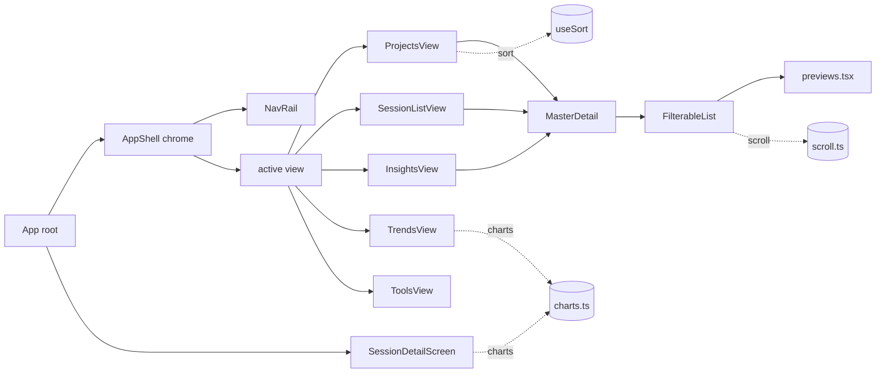

# Interactive Terminal UI

> Indexed at commit `9d4dd3f` on 2026-07-23 · [view on GitHub](https://github.com/yorch/cc-analyzer/tree/9d4dd3f)

## Relevant source files

- [src/tui/run.tsx](https://github.com/yorch/cc-analyzer/blob/9d4dd3f/src/tui/run.tsx)
- [src/tui/App.tsx](https://github.com/yorch/cc-analyzer/blob/9d4dd3f/src/tui/App.tsx)
- [src/tui/shell/AppShell.tsx](https://github.com/yorch/cc-analyzer/blob/9d4dd3f/src/tui/shell/AppShell.tsx)
- [src/tui/shell/MasterDetail.tsx](https://github.com/yorch/cc-analyzer/blob/9d4dd3f/src/tui/shell/MasterDetail.tsx)
- [src/tui/theme.ts](https://github.com/yorch/cc-analyzer/blob/9d4dd3f/src/tui/theme.ts)
- [src/tui/keys.ts](https://github.com/yorch/cc-analyzer/blob/9d4dd3f/src/tui/keys.ts)
- [src/tui/scroll.ts](https://github.com/yorch/cc-analyzer/blob/9d4dd3f/src/tui/scroll.ts)
- [src/tui/charts.ts](https://github.com/yorch/cc-analyzer/blob/9d4dd3f/src/tui/charts.ts)
- [src/tui/useTermSize.ts](https://github.com/yorch/cc-analyzer/blob/9d4dd3f/src/tui/useTermSize.ts)
- [src/tui/usePageSize.ts](https://github.com/yorch/cc-analyzer/blob/9d4dd3f/src/tui/usePageSize.ts)
- [src/tui/useSort.ts](https://github.com/yorch/cc-analyzer/blob/9d4dd3f/src/tui/useSort.ts)
- [src/tui/components/FilterableList.tsx](https://github.com/yorch/cc-analyzer/blob/9d4dd3f/src/tui/components/FilterableList.tsx)
- [src/tui/components/ui.tsx](https://github.com/yorch/cc-analyzer/blob/9d4dd3f/src/tui/components/ui.tsx)
- [src/tui/components/PortfolioLede.tsx](https://github.com/yorch/cc-analyzer/blob/9d4dd3f/src/tui/components/PortfolioLede.tsx)
- [src/tui/components/previews.tsx](https://github.com/yorch/cc-analyzer/blob/9d4dd3f/src/tui/components/previews.tsx)
- [src/tui/screens/ProjectsView.tsx](https://github.com/yorch/cc-analyzer/blob/9d4dd3f/src/tui/screens/ProjectsView.tsx)
- [src/tui/screens/SessionListView.tsx](https://github.com/yorch/cc-analyzer/blob/9d4dd3f/src/tui/screens/SessionListView.tsx)
- [src/tui/screens/SessionDetailScreen.tsx](https://github.com/yorch/cc-analyzer/blob/9d4dd3f/src/tui/screens/SessionDetailScreen.tsx)
- [src/tui/screens/InsightsView.tsx](https://github.com/yorch/cc-analyzer/blob/9d4dd3f/src/tui/screens/InsightsView.tsx)
- [src/tui/screens/TrendsView.tsx](https://github.com/yorch/cc-analyzer/blob/9d4dd3f/src/tui/screens/TrendsView.tsx)
- [src/tui/screens/ToolsView.tsx](https://github.com/yorch/cc-analyzer/blob/9d4dd3f/src/tui/screens/ToolsView.tsx)

## Overview

The Interactive Terminal UI (TUI) is the frontend `cc-analyzer` launches when the Command-Line Interface (CLI) is run with no subcommand. It is built with Ink, a React renderer for the terminal, and presents an amber-phosphor master-detail shell whose persistent navigation rail spans six views: portfolio, projects, sessions, insights, trends, and tools. Every view reads exclusively from the SQLite index; a session's full detail screen re-parses and re-analyzes the source `.jsonl` on demand.

The entrypoint is [src/tui/run.tsx](https://github.com/yorch/cc-analyzer/blob/9d4dd3f/src/tui/run.tsx). `runTui()` refuses to start without a real terminal, opens the index database with `openDb()`, loads the pricing table via `loadPricing()`, then renders the root `App` and blocks on `waitUntilExit()` before closing the database ([src/tui/run.tsx:L7-L21](https://github.com/yorch/cc-analyzer/blob/9d4dd3f/src/tui/run.tsx#L7-L21)). When `stdin`/`stdout` are not a Teletype (TTY) it prints a redirect to the non-interactive commands and returns exit code 2 ([src/tui/run.tsx:L8-L14](https://github.com/yorch/cc-analyzer/blob/9d4dd3f/src/tui/run.tsx#L8-L14)). The presentation layer computes nothing analytical itself: all series, rollups, and aggregates come from `src/core/`, documented on the [Analytics and Insights](./7-analytics-and-insights.md) page.

## Architecture

`App` owns the view/focus state machine and mounts `AppShell`, which draws the title bar, nav rail, and key-hint bar around whichever view is active ([src/tui/App.tsx:L221-L246](https://github.com/yorch/cc-analyzer/blob/9d4dd3f/src/tui/App.tsx#L221-L246), [src/tui/shell/AppShell.tsx:L42-L69](https://github.com/yorch/cc-analyzer/blob/9d4dd3f/src/tui/shell/AppShell.tsx#L42-L69)). The three list-based views compose `MasterDetail` + `FilterableList` and render a live preview from [src/tui/components/previews.tsx](https://github.com/yorch/cc-analyzer/blob/9d4dd3f/src/tui/components/previews.tsx), while the chart-based views draw braille/ASCII primitives from [src/tui/charts.ts](https://github.com/yorch/cc-analyzer/blob/9d4dd3f/src/tui/charts.ts). Opening a session bypasses the shell entirely and renders `SessionDetailScreen` full-frame.

Sources: [src/tui/App.tsx:L51-L247](https://github.com/yorch/cc-analyzer/blob/9d4dd3f/src/tui/App.tsx#L51-L247) [src/tui/shell/AppShell.tsx:L42-L69](https://github.com/yorch/cc-analyzer/blob/9d4dd3f/src/tui/shell/AppShell.tsx#L42-L69) [src/tui/shell/MasterDetail.tsx:L29-L60](https://github.com/yorch/cc-analyzer/blob/9d4dd3f/src/tui/shell/MasterDetail.tsx#L29-L60)

## Module Layout

| Module | Path | Responsibility |
| ------ | ---- | -------------- |
| `runTui` | [src/tui/run.tsx](https://github.com/yorch/cc-analyzer/blob/9d4dd3f/src/tui/run.tsx) | TTY guard, database + pricing bootstrap, Ink render loop |
| `App` | [src/tui/App.tsx](https://github.com/yorch/cc-analyzer/blob/9d4dd3f/src/tui/App.tsx) | View router, rail/body focus, drill-in and session-open state |
| `AppShell` | [src/tui/shell/AppShell.tsx](https://github.com/yorch/cc-analyzer/blob/9d4dd3f/src/tui/shell/AppShell.tsx) | Title bar, nav rail, key bar, viewport pinning |
| `MasterDetail` | [src/tui/shell/MasterDetail.tsx](https://github.com/yorch/cc-analyzer/blob/9d4dd3f/src/tui/shell/MasterDetail.tsx) | Two-pane list/preview layout, narrow-mode collapse |
| `theme` | [src/tui/theme.ts](https://github.com/yorch/cc-analyzer/blob/9d4dd3f/src/tui/theme.ts) | Amber-phosphor palette, semantic roles, sparkline/bar helpers |
| `keys` | [src/tui/keys.ts](https://github.com/yorch/cc-analyzer/blob/9d4dd3f/src/tui/keys.ts) | `keyIndex` guard for number-key input |
| `scroll` | [src/tui/scroll.ts](https://github.com/yorch/cc-analyzer/blob/9d4dd3f/src/tui/scroll.ts) | Shared cursor/window scroll math |
| `charts` | [src/tui/charts.ts](https://github.com/yorch/cc-analyzer/blob/9d4dd3f/src/tui/charts.ts) | Braille area charts, sparklines, calendar/heatmap grids |
| `useTermSize` / `usePageSize` | [src/tui/useTermSize.ts](https://github.com/yorch/cc-analyzer/blob/9d4dd3f/src/tui/useTermSize.ts) | Live terminal size, layout mode, list page sizing |
| `useSort` | [src/tui/useSort.ts](https://github.com/yorch/cc-analyzer/blob/9d4dd3f/src/tui/useSort.ts) | Client-side sort-field cycling for lists |
| `FilterableList` | [src/tui/components/FilterableList.tsx](https://github.com/yorch/cc-analyzer/blob/9d4dd3f/src/tui/components/FilterableList.tsx) | Filter + scroll + select list primitive |
| screens | [src/tui/screens/](https://github.com/yorch/cc-analyzer/blob/9d4dd3f/src/tui/screens/SessionDetailScreen.tsx) | The six views plus the session detail screen |

Sources: [src/tui/App.tsx:L22-L49](https://github.com/yorch/cc-analyzer/blob/9d4dd3f/src/tui/App.tsx#L22-L49) [src/tui/run.tsx:L1-L21](https://github.com/yorch/cc-analyzer/blob/9d4dd3f/src/tui/run.tsx#L1-L21)

## Key Components

### App root and navigation state

`App` is a single stateful component holding the current `view`, whether the nav rail or the body has `focus`, an optional drilled-into project, and an optional open session ([src/tui/App.tsx:L61-L66](https://github.com/yorch/cc-analyzer/blob/9d4dd3f/src/tui/App.tsx#L61-L66)). It reads all portfolio-level aggregates once through memoized `src/core/queries.ts` and `src/core/stats.ts` calls so the shell can render without re-querying on every keypress ([src/tui/App.tsx:L52-L58](https://github.com/yorch/cc-analyzer/blob/9d4dd3f/src/tui/App.tsx#L52-L58)). When the index is empty it shows a "run `cc-analyzer index` first" panel instead of the shell ([src/tui/App.tsx:L92-L102](https://github.com/yorch/cc-analyzer/blob/9d4dd3f/src/tui/App.tsx#L92-L102)).

Global input is handled at the root: `?` opens the help overlay from anywhere, and when focus is on the rail the arrows switch views, `1`-`6` jump to a view, and Enter/→ hands focus to the body ([src/tui/App.tsx:L74-L90](https://github.com/yorch/cc-analyzer/blob/9d4dd3f/src/tui/App.tsx#L74-L90)). When focus is on the body the active view owns input, so `App` returns early ([src/tui/App.tsx:L77](https://github.com/yorch/cc-analyzer/blob/9d4dd3f/src/tui/App.tsx#L77)). The body is chosen by a cascade on `view` (and `drill`), passing each screen a computed `listPageSize` so lists fit the pinned viewport without overflow ([src/tui/App.tsx:L143-L219](https://github.com/yorch/cc-analyzer/blob/9d4dd3f/src/tui/App.tsx#L143-L219)).

Sources: [src/tui/App.tsx:L51-L162](https://github.com/yorch/cc-analyzer/blob/9d4dd3f/src/tui/App.tsx#L51-L162) [src/tui/keys.ts:L8-L10](https://github.com/yorch/cc-analyzer/blob/9d4dd3f/src/tui/keys.ts#L8-L10)

### AppShell and the nav rail

`AppShell` is the persistent chrome. It pins its root `Box` to `rows - 2` with `overflow="hidden"`, so the title bar and key bar stay on screen and the frame never grows taller than the viewport and scrolls the header off the top ([src/tui/shell/AppShell.tsx:L54-L67](https://github.com/yorch/cc-analyzer/blob/9d4dd3f/src/tui/shell/AppShell.tsx#L54-L67)). The `TitleBar` shows the app name and version against the breadcrumb; the `KeyBar` renders the caller's context hints and appends `? help · ctrl-c quit` ([src/tui/shell/AppShell.tsx:L71-L129](https://github.com/yorch/cc-analyzer/blob/9d4dd3f/src/tui/shell/AppShell.tsx#L71-L129)).

The `NavRail` renders each `NavEntry` as an icon-plus-label row, inverting the active entry to the amber selection bar and marking it with `❯` only when the rail itself is focused ([src/tui/shell/AppShell.tsx:L82-L119](https://github.com/yorch/cc-analyzer/blob/9d4dd3f/src/tui/shell/AppShell.tsx#L82-L119)). The rail entries are defined in `App` as the six `RAIL` items with per-view icons ([src/tui/App.tsx:L42-L49](https://github.com/yorch/cc-analyzer/blob/9d4dd3f/src/tui/App.tsx#L42-L49)). On narrow terminals the rail is hidden and on compact ones it collapses to icons only, driven by `layoutMode` ([src/tui/shell/AppShell.tsx:L53-L61](https://github.com/yorch/cc-analyzer/blob/9d4dd3f/src/tui/shell/AppShell.tsx#L53-L61)).

Sources: [src/tui/shell/AppShell.tsx:L42-L129](https://github.com/yorch/cc-analyzer/blob/9d4dd3f/src/tui/shell/AppShell.tsx#L42-L129) [src/tui/App.tsx:L42-L49](https://github.com/yorch/cc-analyzer/blob/9d4dd3f/src/tui/App.tsx#L42-L49)

### MasterDetail and FilterableList

`MasterDetail` is the two-pane body used by the list views: a fixed-width master column on the left and a flex-growing detail pane on the right. `masterWidth()` computes the master column as a percentage of terminal columns (default 40%, floor 22) so callers can truncate rows to fit rather than letting Ink wrap them ([src/tui/shell/MasterDetail.tsx:L20-L22](https://github.com/yorch/cc-analyzer/blob/9d4dd3f/src/tui/shell/MasterDetail.tsx#L20-L22)). In narrow mode it collapses to the master pane alone, matching the pre-shell single-column behavior ([src/tui/shell/MasterDetail.tsx:L36-L38](https://github.com/yorch/cc-analyzer/blob/9d4dd3f/src/tui/shell/MasterDetail.tsx#L36-L38)).

`FilterableList` is the reusable list primitive. Printable keys build an inline substring query, arrows move the cursor, Enter selects, Backspace edits the query, and Escape clears the query or calls `onBack` when it is already empty ([src/tui/components/FilterableList.tsx:L77-L119](https://github.com/yorch/cc-analyzer/blob/9d4dd3f/src/tui/components/FilterableList.tsx#L77-L119)). Vim `j`/`k` are deliberately not bound to navigation so those letters can be typed into the filter ([src/tui/components/FilterableList.tsx:L28-L33](https://github.com/yorch/cc-analyzer/blob/9d4dd3f/src/tui/components/FilterableList.tsx#L28-L33)). Tab and Shift-Tab delegate to `onCycleSort`/`onReverseSort`, and every cursor move fires `onHighlight` so the parent can drive a live detail preview ([src/tui/components/FilterableList.tsx:L66-L104](https://github.com/yorch/cc-analyzer/blob/9d4dd3f/src/tui/components/FilterableList.tsx#L66-L104)). It clamps cursor and window with `clampWindow` so a stale offset from a shrunk list can't slice past the end ([src/tui/components/FilterableList.tsx:L55-L63](https://github.com/yorch/cc-analyzer/blob/9d4dd3f/src/tui/components/FilterableList.tsx#L55-L63)).

Sources: [src/tui/shell/MasterDetail.tsx:L20-L60](https://github.com/yorch/cc-analyzer/blob/9d4dd3f/src/tui/shell/MasterDetail.tsx#L20-L60) [src/tui/components/FilterableList.tsx:L34-L156](https://github.com/yorch/cc-analyzer/blob/9d4dd3f/src/tui/components/FilterableList.tsx#L34-L156) [src/tui/scroll.ts:L7-L28](https://github.com/yorch/cc-analyzer/blob/9d4dd3f/src/tui/scroll.ts#L7-L28)

### Projects and sessions views

`ProjectsView` sorts projects by recent/cost/tokens/sessions/name via `useSort`, tracks a highlighted row, and renders a lean master row (cost + name) beside a rich `ProjectPreview` ([src/tui/screens/ProjectsView.tsx:L12-L63](https://github.com/yorch/cc-analyzer/blob/9d4dd3f/src/tui/screens/ProjectsView.tsx#L12-L63)). The portfolio and projects rail entries both route here; the portfolio view additionally shows the `PortfolioLede` band above the list ([src/tui/App.tsx:L143-L187](https://github.com/yorch/cc-analyzer/blob/9d4dd3f/src/tui/App.tsx#L143-L187)). Selecting a project drills into its session list through `openProject` ([src/tui/App.tsx:L129-L133](https://github.com/yorch/cc-analyzer/blob/9d4dd3f/src/tui/App.tsx#L129-L133)).

`SessionListView` is the shared sessions master list, used both for the all-sessions rail view (with `showProject`) and for a single project's drilled-in sessions ([src/tui/screens/SessionListView.tsx:L31-L78](https://github.com/yorch/cc-analyzer/blob/9d4dd3f/src/tui/screens/SessionListView.tsx#L31-L78)). Each row shows cost, an estimated-cost `~` flag, relative modified time, and a truncated title, with the owning project kept searchable but shown only in the `SessionPreview` detail pane ([src/tui/screens/SessionListView.tsx:L45-L72](https://github.com/yorch/cc-analyzer/blob/9d4dd3f/src/tui/screens/SessionListView.tsx#L45-L72)). The previews compute per-highlight chart lines (weekly burn sparkline, cost/turn-depth distribution ramps) live from the index, memoized on the selected id ([src/tui/components/previews.tsx:L42-L133](https://github.com/yorch/cc-analyzer/blob/9d4dd3f/src/tui/components/previews.tsx#L42-L133)).

Sources: [src/tui/screens/ProjectsView.tsx:L31-L63](https://github.com/yorch/cc-analyzer/blob/9d4dd3f/src/tui/screens/ProjectsView.tsx#L31-L63) [src/tui/screens/SessionListView.tsx:L31-L78](https://github.com/yorch/cc-analyzer/blob/9d4dd3f/src/tui/screens/SessionListView.tsx#L31-L78) [src/tui/components/previews.tsx:L42-L184](https://github.com/yorch/cc-analyzer/blob/9d4dd3f/src/tui/components/previews.tsx#L42-L184)

### Session detail screen

Opening a session renders `SessionDetailScreen` full-frame, outside the shell ([src/tui/App.tsx:L112-L125](https://github.com/yorch/cc-analyzer/blob/9d4dd3f/src/tui/App.tsx#L112-L125)). Unlike the index-backed views, it re-reads the raw `.jsonl` with `parseSessionFile`, then runs `analyzeSession` and `buildTranscript` in an effect keyed on the session path ([src/tui/screens/SessionDetailScreen.tsx:L51-L62](https://github.com/yorch/cc-analyzer/blob/9d4dd3f/src/tui/screens/SessionDetailScreen.tsx#L51-L62)). A one-line `SummaryBand` of vitals stays above four switchable modes: turns, charts, transcript, and summary ([src/tui/screens/SessionDetailScreen.tsx:L83-L118](https://github.com/yorch/cc-analyzer/blob/9d4dd3f/src/tui/screens/SessionDetailScreen.tsx#L83-L118)). Mode keys `1`-`4` and letters `u`/`c`/`t`/`s` select modes, and Escape returns to turns from any other mode ([src/tui/screens/SessionDetailScreen.tsx:L66-L78](https://github.com/yorch/cc-analyzer/blob/9d4dd3f/src/tui/screens/SessionDetailScreen.tsx#L66-L78)).

The turns mode is itself a nested master-detail: a turns list drives a per-turn steps pane, with a turns↔steps focus toggle mirroring the shell's rail↔body model ([src/tui/screens/SessionDetailScreen.tsx:L156-L220](https://github.com/yorch/cc-analyzer/blob/9d4dd3f/src/tui/screens/SessionDetailScreen.tsx#L156-L220)). Each `StepRow` shows a kind icon, label, and status tick, expanding on Enter to show capped input/result detail lines ([src/tui/screens/SessionDetailScreen.tsx:L291-L357](https://github.com/yorch/cc-analyzer/blob/9d4dd3f/src/tui/screens/SessionDetailScreen.tsx#L291-L357)). The charts mode renders a braille context-window sawtooth with `▼` compaction markers plus cost-per-call and cost-per-turn sparklines, sharing series with the web charts via `chart-series.ts` ([src/tui/screens/SessionDetailScreen.tsx:L366-L446](https://github.com/yorch/cc-analyzer/blob/9d4dd3f/src/tui/screens/SessionDetailScreen.tsx#L366-L446)).

Sources: [src/tui/screens/SessionDetailScreen.tsx:L47-L446](https://github.com/yorch/cc-analyzer/blob/9d4dd3f/src/tui/screens/SessionDetailScreen.tsx#L47-L446)

### Insights, trends, and tools views

`InsightsView` is a cache-efficiency hit-list: projects ranked by un-amortized cache-write dollars, drilling into a project's sessions, with a shared `CacheHitList` master list plus `CachePreview` detail ([src/tui/screens/InsightsView.tsx:L49-L190](https://github.com/yorch/cc-analyzer/blob/9d4dd3f/src/tui/screens/InsightsView.tsx#L49-L190)). Each row shows waste dollars, the read:write ratio, and a colored verdict dot; opening a session forwards its id to `App`'s `openSessionById` ([src/tui/screens/InsightsView.tsx:L84-L178](https://github.com/yorch/cc-analyzer/blob/9d4dd3f/src/tui/screens/InsightsView.tsx#L84-L178)).

`TrendsView` is a three-panel time-series dashboard: a braille burn chart, an activity heatmap, and a contribution calendar, switched with Tab or `1`/`2`/`3` ([src/tui/screens/TrendsView.tsx:L36-L99](https://github.com/yorch/cc-analyzer/blob/9d4dd3f/src/tui/screens/TrendsView.tsx#L36-L99)). `m` cycles the metric per panel and `g` cycles burn granularity across day/week/month ([src/tui/screens/TrendsView.tsx:L47-L69](https://github.com/yorch/cc-analyzer/blob/9d4dd3f/src/tui/screens/TrendsView.tsx#L47-L69)). `ToolsView` presents tool, skill, and subagent usage as switchable ranked-list panels fed by a single `analyticsRollup` scan, with `s` cycling the sort field and the skills panel adding an adoption detail strip (first/last use, avg cost, weekly invocation sparkline) for the selected skill ([src/tui/screens/ToolsView.tsx:L55-L235](https://github.com/yorch/cc-analyzer/blob/9d4dd3f/src/tui/screens/ToolsView.tsx#L55-L235)). The data series behind all three views live in core and are documented on the [Analytics and Insights](./7-analytics-and-insights.md) page.

Sources: [src/tui/screens/InsightsView.tsx:L49-L190](https://github.com/yorch/cc-analyzer/blob/9d4dd3f/src/tui/screens/InsightsView.tsx#L49-L190) [src/tui/screens/TrendsView.tsx:L36-L238](https://github.com/yorch/cc-analyzer/blob/9d4dd3f/src/tui/screens/TrendsView.tsx#L36-L238) [src/tui/screens/ToolsView.tsx:L55-L235](https://github.com/yorch/cc-analyzer/blob/9d4dd3f/src/tui/screens/ToolsView.tsx#L55-L235)

### Theme, charts, and shared hooks

The amber-phosphor design system lives in [src/tui/theme.ts](https://github.com/yorch/cc-analyzer/blob/9d4dd3f/src/tui/theme.ts). It defines a raw hex `palette` plus intent-named `role` tokens so screens reference `cost`/`heading`/`ok` rather than hex, and there is no painted background — the phosphor look comes from amber foregrounds, borders, and the inverse selection bar ([src/tui/theme.ts:L20-L64](https://github.com/yorch/cc-analyzer/blob/9d4dd3f/src/tui/theme.ts#L20-L64)). It also maps step kinds and cache verdicts to icons and colors and provides `sparkline`/`bar` block helpers ([src/tui/theme.ts:L66-L130](https://github.com/yorch/cc-analyzer/blob/9d4dd3f/src/tui/theme.ts#L66-L130)).

`charts.ts` holds the pure ASCII/braille primitives, kept free of Ink and the database so they are trivially unit-testable: `brailleChart` packs 2×4 dots per cell into a filled area chart, `markerRow` aligns event markers to its column bucketing, and `calendarGrid`/`heatGrid` render ramp-shaded density grids ([src/tui/charts.ts:L35-L174](https://github.com/yorch/cc-analyzer/blob/9d4dd3f/src/tui/charts.ts#L35-L174)). Layout hooks read the live terminal: `useTermSize` tracks columns/rows on resize and `layoutMode` classifies width into full/compact/narrow at the 100- and 90-column breakpoints ([src/tui/useTermSize.ts:L10-L41](https://github.com/yorch/cc-analyzer/blob/9d4dd3f/src/tui/useTermSize.ts#L10-L41)). `usePageSize` derives scrollable list height from terminal rows minus reserved chrome, and `useSort` holds the cycle-and-reverse sort state that lists apply before rendering ([src/tui/usePageSize.ts:L9-L13](https://github.com/yorch/cc-analyzer/blob/9d4dd3f/src/tui/usePageSize.ts#L9-L13), [src/tui/useSort.ts:L30-L42](https://github.com/yorch/cc-analyzer/blob/9d4dd3f/src/tui/useSort.ts#L30-L42)).

Sources: [src/tui/theme.ts:L20-L130](https://github.com/yorch/cc-analyzer/blob/9d4dd3f/src/tui/theme.ts#L20-L130) [src/tui/charts.ts:L22-L174](https://github.com/yorch/cc-analyzer/blob/9d4dd3f/src/tui/charts.ts#L22-L174) [src/tui/useTermSize.ts:L10-L41](https://github.com/yorch/cc-analyzer/blob/9d4dd3f/src/tui/useTermSize.ts#L10-L41)

## Keybindings

The centralized bindings are surfaced to the user by the `HelpOverlay`, a modal cheatsheet that any key closes, defined in [src/tui/components/ui.tsx](https://github.com/yorch/cc-analyzer/blob/9d4dd3f/src/tui/components/ui.tsx) ([src/tui/components/ui.tsx:L43-L123](https://github.com/yorch/cc-analyzer/blob/9d4dd3f/src/tui/components/ui.tsx#L43-L123)). Context-specific hints are computed per view in `App` and rendered in the shell's key bar ([src/tui/App.tsx:L153-L162](https://github.com/yorch/cc-analyzer/blob/9d4dd3f/src/tui/App.tsx#L153-L162)).

| Key | Context | Action |
| --- | ------- | ------ |
| `?` | global | Toggle the help overlay |
| `ctrl-c` | global | Quit |
| `↑`/`↓` | nav rail | Switch view |
| `1`-`6` | nav rail | Jump to a view |
| `↵`/`→` | nav rail | Focus the list body |
| type | lists | Build the substring filter |
| `tab` / `shift-tab` | lists | Cycle sort / flip direction |
| `esc` | lists | Clear filter, then focus the rail |
| `1`-`4` / `u c t s` | session detail | Turns / charts / transcript / summary |
| `→` / `tab` | session detail turns | Focus the steps pane |
| `g` / `G` | scrollable panes | Jump to top / bottom |
| `tab` / `1 2 3` | trends & tools | Switch panel |
| `m` / `g` | trends | Cycle metric / burn granularity |
| `s` | tools | Cycle sort field |

The `keyIndex` helper guards an Ink footgun: non-character keys arrive as `input === ""`, and `"123".indexOf("")` is 0, which would otherwise register every arrow or function key as the first number key ([src/tui/keys.ts:L1-L10](https://github.com/yorch/cc-analyzer/blob/9d4dd3f/src/tui/keys.ts#L1-L10)). It is used by the rail number jumps and the `ToolsView` panel switch ([src/tui/App.tsx:L81-L85](https://github.com/yorch/cc-analyzer/blob/9d4dd3f/src/tui/App.tsx#L81-L85), [src/tui/screens/ToolsView.tsx:L94-L95](https://github.com/yorch/cc-analyzer/blob/9d4dd3f/src/tui/screens/ToolsView.tsx#L94-L95)).

Sources: [src/tui/components/ui.tsx:L43-L123](https://github.com/yorch/cc-analyzer/blob/9d4dd3f/src/tui/components/ui.tsx#L43-L123) [src/tui/App.tsx:L74-L162](https://github.com/yorch/cc-analyzer/blob/9d4dd3f/src/tui/App.tsx#L74-L162) [src/tui/keys.ts:L1-L10](https://github.com/yorch/cc-analyzer/blob/9d4dd3f/src/tui/keys.ts#L1-L10)

## Related Pages

- Core analysis engine: [Core Analysis Engine](./2-core-analysis-engine.md)
- Non-interactive frontend: [Command-Line Interface](./3-cli.md)
- Web frontend that mirrors these views: [Web SPA Frontend](./6-web-spa-frontend.md)
- Data series behind the analytics views: [Analytics and Insights](./7-analytics-and-insights.md)
