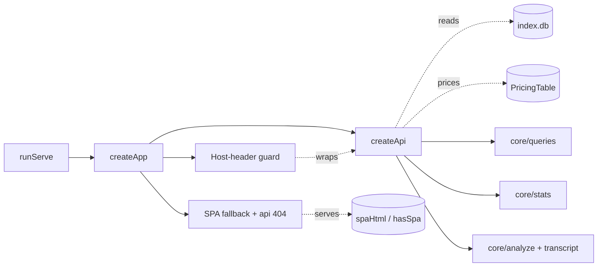
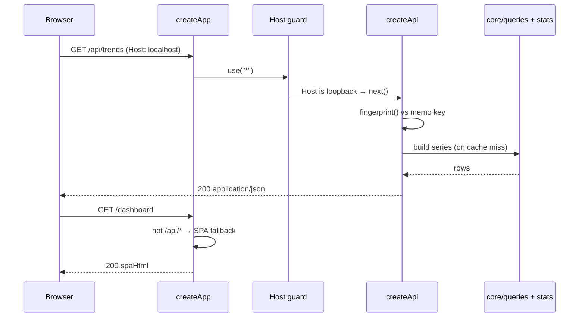

# Web Server & API

> Indexed at commit `9d4dd3f` on 2026-07-23 · [view on GitHub](https://github.com/yorch/cc-analyzer/tree/9d4dd3f)

## Relevant source files

- [src/web/server.ts](https://github.com/yorch/cc-analyzer/blob/9d4dd3f/src/web/server.ts)
- [src/web/api.ts](https://github.com/yorch/cc-analyzer/blob/9d4dd3f/src/web/api.ts)
- [src/web/spa.ts](https://github.com/yorch/cc-analyzer/blob/9d4dd3f/src/web/spa.ts)
- [scripts/embed-spa.ts](https://github.com/yorch/cc-analyzer/blob/9d4dd3f/scripts/embed-spa.ts)

## Overview

The Web Server & API subsystem is the backend of `cc-analyzer serve`: a local [Hono](https://hono.dev) application that exposes the analytics core over a JSON HTTP API and serves the single-page application (SPA) that renders it. It is the third of the three frontends over `src/core/`, alongside the command-line interface (CLI) and the terminal UI (TUI), and it is the only one that reaches the browser. The entry point `runServe()` opens the SQLite index, loads pricing, composes the app, and binds a `Bun.serve` socket on port `4317` by default ([src/web/server.ts#L81-L106](https://github.com/yorch/cc-analyzer/blob/9d4dd3f/src/web/server.ts#L81-L106)).

The subsystem has three concerns kept in separate modules: request routing and read-only data access ([src/web/api.ts](https://github.com/yorch/cc-analyzer/blob/9d4dd3f/src/web/api.ts)), app composition with a loopback security guard and SPA fallback ([src/web/server.ts](https://github.com/yorch/cc-analyzer/blob/9d4dd3f/src/web/server.ts)), and the embedded SPA bytes ([src/web/spa.ts](https://github.com/yorch/cc-analyzer/blob/9d4dd3f/src/web/spa.ts)). All three factory functions — `createApi`, `createApp` — are pure over their `db` and `pricing` arguments, so the app can be built and exercised without binding a port ([src/web/api.ts#L45](https://github.com/yorch/cc-analyzer/blob/9d4dd3f/src/web/api.ts#L45), [src/web/server.ts#L39-L43](https://github.com/yorch/cc-analyzer/blob/9d4dd3f/src/web/server.ts#L39-L43)).

## Architecture

`runServe()` composes the app once and hands `app.fetch` to `Bun.serve` ([src/web/server.ts#L92-L95](https://github.com/yorch/cc-analyzer/blob/9d4dd3f/src/web/server.ts#L92-L95)). `createApp` mounts the Host-header guard first so it wraps every route, mounts the API router at `/`, adds a JSON 404 for unmatched `/api/*` paths, then falls back to the SPA for everything else ([src/web/server.ts#L50-L72](https://github.com/yorch/cc-analyzer/blob/9d4dd3f/src/web/server.ts#L50-L72)). `createApi` reads exclusively from the SQLite index and the loaded pricing table, delegating all computation to `src/core/` modules.

## Module Layout

| Module | Path | Responsibility |
| ------ | ---- | -------------- |
| `server` | [src/web/server.ts](https://github.com/yorch/cc-analyzer/blob/9d4dd3f/src/web/server.ts) | `runServe` lifecycle, `createApp` composition, loopback Host guard, SPA fallback |
| `api` | [src/web/api.ts](https://github.com/yorch/cc-analyzer/blob/9d4dd3f/src/web/api.ts) | `createApi` Hono router: all `/api/*` JSON endpoints with fingerprint memoization |
| `spa` | [src/web/spa.ts](https://github.com/yorch/cc-analyzer/blob/9d4dd3f/src/web/spa.ts) | Generated module exporting `spaHtml` and `hasSpa` — the baked-in web UI |
| `embed-spa` | [scripts/embed-spa.ts](https://github.com/yorch/cc-analyzer/blob/9d4dd3f/scripts/embed-spa.ts) | Build script that writes the Vite single-file HTML into `spa.ts` |

Sources: [src/web/server.ts:L1-L106](https://github.com/yorch/cc-analyzer/blob/9d4dd3f/src/web/server.ts#L1-L106) [src/web/api.ts:L1-L45](https://github.com/yorch/cc-analyzer/blob/9d4dd3f/src/web/api.ts#L1-L45) [scripts/embed-spa.ts:L1-L22](https://github.com/yorch/cc-analyzer/blob/9d4dd3f/scripts/embed-spa.ts#L1-L22)

## Key Components

### runServe lifecycle

`runServe()` is the `serve` command body. It opens the index with `openDb()` and refuses to start when the index is empty, printing a hint to run `cc-analyzer index` first and returning exit code `1` ([src/web/server.ts#L81-L88](https://github.com/yorch/cc-analyzer/blob/9d4dd3f/src/web/server.ts#L81-L88)). It then loads pricing via `loadPricing()`, resolves the bind hostname (default `127.0.0.1`), and derives `loopbackOnly` from `isLoopbackHost()` before composing the app ([src/web/server.ts#L89-L92](https://github.com/yorch/cc-analyzer/blob/9d4dd3f/src/web/server.ts#L89-L92)). After binding it prints the browsable URL and, when bound to a non-loopback address, warns on stderr that session transcripts are exposed to the network ([src/web/server.ts#L96-L102](https://github.com/yorch/cc-analyzer/blob/9d4dd3f/src/web/server.ts#L96-L102)). The function then returns a never-resolving `Promise`, keeping the process alive until it is killed ([src/web/server.ts#L104-L105](https://github.com/yorch/cc-analyzer/blob/9d4dd3f/src/web/server.ts#L104-L105)).

Sources: [src/web/server.ts:L77-L106](https://github.com/yorch/cc-analyzer/blob/9d4dd3f/src/web/server.ts#L77-L106)

### createApp and the loopback Host guard

`createApp` wires the middleware stack. When `loopbackOnly` is set it registers a `use("*")` middleware that rejects any request whose `Host` header is not a local name with a `403 Forbidden` ([src/web/server.ts#L50-L58](https://github.com/yorch/cc-analyzer/blob/9d4dd3f/src/web/server.ts#L50-L58)). This is a Domain Name System (DNS) rebinding defense: a hostile page that re-resolves its own domain to `127.0.0.1` would otherwise gain same-origin access to the API. The guard is registered before the API routes so it wraps them.

`isLoopbackHost()` normalizes the host through the URL host grammar, bracketing bare Internet Protocol version 6 (IPv6) literals so odd spellings and trailing ports resolve consistently, then checks the parsed hostname against the set `{localhost, 127.0.0.1, ::1}` ([src/web/server.ts#L16-L33](https://github.com/yorch/cc-analyzer/blob/9d4dd3f/src/web/server.ts#L16-L33)). After the API router, `createApp` returns a JSON `404` for any unmatched `/api/*` path so API misses never fall through to HTML, and serves the SPA for every other path ([src/web/server.ts#L60-L72](https://github.com/yorch/cc-analyzer/blob/9d4dd3f/src/web/server.ts#L60-L72)).

Sources: [src/web/server.ts:L16-L75](https://github.com/yorch/cc-analyzer/blob/9d4dd3f/src/web/server.ts#L16-L75)

### createApi and fingerprint memoization

`createApi` builds the `/api` router. Because the index only changes when `cc-analyzer index` runs, the aggregate endpoints memoize their serialized JSON against a cheap `fingerprint()` — the sessions row count plus the newest `indexed_at` timestamp ([src/web/api.ts#L52-L57](https://github.com/yorch/cc-analyzer/blob/9d4dd3f/src/web/api.ts#L52-L57)). A reindex, even from another process, changes the fingerprint and invalidates the cache on the next request. `cachedJson()` stores one entry per endpoint name in a `Map`, rebuilding the body only when the key differs and returning the pre-serialized string with an explicit `application/json` content type ([src/web/api.ts#L58-L65](https://github.com/yorch/cc-analyzer/blob/9d4dd3f/src/web/api.ts#L58-L65)).

The `MAX_PROJECT_ROWS` cap of `2000` bounds project-list payloads: the dashboard filters client-side, so the server returns more than a top-N slice while still refusing to ship unbounded JSON for a pathological portfolio ([src/web/api.ts#L38-L42](https://github.com/yorch/cc-analyzer/blob/9d4dd3f/src/web/api.ts#L38-L42)).

Sources: [src/web/api.ts:L44-L65](https://github.com/yorch/cc-analyzer/blob/9d4dd3f/src/web/api.ts#L44-L65)

### Portfolio, insights, trends, and analytics endpoints

The aggregate endpoints are the portfolio-wide views. `GET /api/stats` returns `buildPortfolioStats`, keyed by the fingerprint plus the current local day so streaks and run-rate roll over at midnight ([src/web/api.ts#L67-L73](https://github.com/yorch/cc-analyzer/blob/9d4dd3f/src/web/api.ts#L67-L73)). `GET /api/insights` bundles cache-efficiency data — a `cacheSummary`, projects ranked by un-amortized cache-write dollars via `cacheWasteByProject`, a time-to-live (TTL) split, and idle-share buckets — and `GET /api/insights/:id/sessions` drills into one project's wasteful sessions ([src/web/api.ts#L80-L91](https://github.com/yorch/cc-analyzer/blob/9d4dd3f/src/web/api.ts#L80-L91)).

`GET /api/trends` assembles the time-series for charts: daily spend, a weekday-by-hour heatmap, model mix, concurrency lanes, weekly error rate, the sidechain trend, and the cost/duration/prompt scatter ([src/web/api.ts#L97-L107](https://github.com/yorch/cc-analyzer/blob/9d4dd3f/src/web/api.ts#L97-L107)). `GET /api/analytics` spreads `analyticsRollup` — a single table scan covering tool, skill, subagent, shell, retry, permission-mode, stop-reason, turn-depth, version, and branch metrics — and adds web-tool usage, sidechain summaries, and compaction usage ([src/web/api.ts#L112-L119](https://github.com/yorch/cc-analyzer/blob/9d4dd3f/src/web/api.ts#L112-L119)). The response shapes of these aggregate endpoints are documented in [Analytics & Insights](./7-analytics-and-insights.md).

Sources: [src/web/api.ts:L67-L119](https://github.com/yorch/cc-analyzer/blob/9d4dd3f/src/web/api.ts#L67-L119)

### Project and session endpoints

Project drill-down endpoints scope data to one encoded project id. `GET /api/projects` lists indexed projects; `GET /api/projects/:id/sessions` lists that project's sessions; `GET /api/projects/:id/files` returns the files Claude touched, hottest first ([src/web/api.ts#L75](https://github.com/yorch/cc-analyzer/blob/9d4dd3f/src/web/api.ts#L75), [src/web/api.ts#L121](https://github.com/yorch/cc-analyzer/blob/9d4dd3f/src/web/api.ts#L121), [src/web/api.ts#L135](https://github.com/yorch/cc-analyzer/blob/9d4dd3f/src/web/api.ts#L135)). `GET /api/projects/:id/trends` returns per-project chart series memoized under a per-id cache key, and it verifies the project exists before touching the memo `Map` so unknown ids `404` rather than growing the keyspace with probed ids ([src/web/api.ts#L127-L132](https://github.com/yorch/cc-analyzer/blob/9d4dd3f/src/web/api.ts#L127-L132)).

`GET /api/sessions/search` is registered before `/api/sessions/:id` so the literal segment `search` is not captured as an id; it clamps the `limit` query to the range `1..1000` to avoid SQLite's `LIMIT -1` unlimited behavior and abusive values, returning an empty array for a blank query ([src/web/api.ts#L137-L144](https://github.com/yorch/cc-analyzer/blob/9d4dd3f/src/web/api.ts#L137-L144)). The two per-session endpoints re-parse the live `.jsonl` file rather than serving stale index rows: `GET /api/sessions/:id` returns `analyzeSession(...)` and `GET /api/sessions/:id/transcript` returns `buildTranscript(...)` ([src/web/api.ts#L157-L171](https://github.com/yorch/cc-analyzer/blob/9d4dd3f/src/web/api.ts#L157-L171)). Because the index is a disposable cache, a `readSession` helper swallows parse failures and both endpoints `404` with a "re-run `cc-analyzer index`" hint when the underlying file has been deleted, never crashing into a `500` ([src/web/api.ts#L146-L163](https://github.com/yorch/cc-analyzer/blob/9d4dd3f/src/web/api.ts#L146-L163)).

Sources: [src/web/api.ts:L75-L171](https://github.com/yorch/cc-analyzer/blob/9d4dd3f/src/web/api.ts#L75-L171)

### SPA embedding

The web UI is baked into the compiled binary as a string. [src/web/spa.ts](https://github.com/yorch/cc-analyzer/blob/9d4dd3f/src/web/spa.ts) exports `spaHtml` (the full HTML document) and the `hasSpa` boolean, which the server consults to decide whether to serve the app or a plain-text "not built" notice ([src/web/server.ts#L66-L72](https://github.com/yorch/cc-analyzer/blob/9d4dd3f/src/web/server.ts#L66-L72)). The committed placeholder ships `spaHtml = ""` and `hasSpa = false`, so the server compiles and runs before the SPA is ever built ([src/web/spa.ts#L1-L5](https://github.com/yorch/cc-analyzer/blob/9d4dd3f/src/web/spa.ts#L1-L5)).

`scripts/embed-spa.ts` regenerates the module. It reads the single-file Vite build at `web/dist/index.html`, exits with an error if the build output is missing, and otherwise writes a `GENERATED` module setting `spaHtml` to the JSON-stringified HTML and `hasSpa` to `true` ([scripts/embed-spa.ts#L7-L22](https://github.com/yorch/cc-analyzer/blob/9d4dd3f/scripts/embed-spa.ts#L7-L22)). `bun build --compile` then bakes the string into the binary, so a release serves the whole UI with no external assets. The real `spa.ts` is git-ignored and only the placeholder is force-added once — regenerated content stays untracked. The React SPA that this HTML boots is documented in [Web SPA Frontend](./6-web-spa-frontend.md).

Sources: [src/web/spa.ts:L1-L5](https://github.com/yorch/cc-analyzer/blob/9d4dd3f/src/web/spa.ts#L1-L5) [scripts/embed-spa.ts:L1-L22](https://github.com/yorch/cc-analyzer/blob/9d4dd3f/scripts/embed-spa.ts#L1-L22) [src/web/server.ts:L66-L72](https://github.com/yorch/cc-analyzer/blob/9d4dd3f/src/web/server.ts#L66-L72)

## Data Flow

A browser request first passes the loopback Host guard, which either forwards it or returns `403`. API requests hit `createApi`, where aggregate endpoints check the index fingerprint against their memoized body and rebuild from `src/core/` only on a miss before returning `application/json` ([src/web/api.ts#L59-L65](https://github.com/yorch/cc-analyzer/blob/9d4dd3f/src/web/api.ts#L59-L65)). Any non-API path returns the embedded SPA so client-side routes such as `/dashboard` resolve to the app shell ([src/web/server.ts#L60-L72](https://github.com/yorch/cc-analyzer/blob/9d4dd3f/src/web/server.ts#L60-L72)).

Sources: [src/web/server.ts:L50-L72](https://github.com/yorch/cc-analyzer/blob/9d4dd3f/src/web/server.ts#L50-L72) [src/web/api.ts:L52-L107](https://github.com/yorch/cc-analyzer/blob/9d4dd3f/src/web/api.ts#L52-L107)

## Configuration & Extension Points

| Setting | Type | Default | Purpose |
| ------- | ---- | ------- | ------- |
| `port` | `number` | `4317` | TCP port passed to `Bun.serve` |
| `host` | `string` | `127.0.0.1` | Bind address; a non-loopback value enables network exposure and disables the Host guard |
| `MAX_PROJECT_ROWS` | `number` | `2000` | Upper bound on project-list rows in aggregate payloads |
| `limit` (query) | `number` | `100` | Search result cap, clamped to `1..1000` |

Sources: [src/web/server.ts:L10-L14](https://github.com/yorch/cc-analyzer/blob/9d4dd3f/src/web/server.ts#L10-L14) [src/web/server.ts:L90-L95](https://github.com/yorch/cc-analyzer/blob/9d4dd3f/src/web/server.ts#L90-L95) [src/web/api.ts:L42](https://github.com/yorch/cc-analyzer/blob/9d4dd3f/src/web/api.ts#L42) [src/web/api.ts:L138-L143](https://github.com/yorch/cc-analyzer/blob/9d4dd3f/src/web/api.ts#L138-L143)

## Related Pages

- Web SPA Frontend: [6. Web SPA Frontend](./6-web-spa-frontend.md)
- Analytics & Insights: [7. Analytics & Insights](./7-analytics-and-insights.md)
- Core Analysis Engine: [2. Core Analysis Engine](./2-core-analysis-engine.md)
- CLI: [3. CLI](./3-cli.md)
- TUI: [4. TUI](./4-tui.md)
