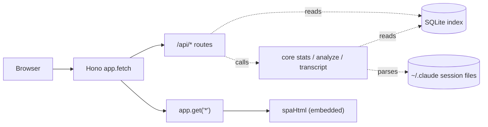
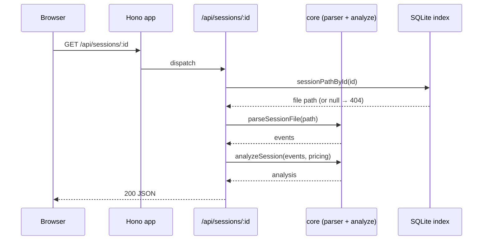

# Web Server & API

> Indexed at commit `4eeed24` on 2026-07-10 · [view on GitHub](https://github.com/yorch/cc-analyzer/tree/4eeed24)

## Relevant source files

- [src/web/server.ts](https://github.com/yorch/cc-analyzer/blob/4eeed24/src/web/server.ts)
- [src/web/api.ts](https://github.com/yorch/cc-analyzer/blob/4eeed24/src/web/api.ts)
- [src/web/spa.ts](https://github.com/yorch/cc-analyzer/blob/4eeed24/src/web/spa.ts)
- [scripts/embed-spa.ts](https://github.com/yorch/cc-analyzer/blob/4eeed24/scripts/embed-spa.ts)

## Overview

The Web Server & API subsystem is the local HTTP backend launched by the `cc-analyzer serve` command. It runs a single [Hono](https://hono.dev) application that simultaneously serves a JavaScript Object Notation (JSON) API under `/api` and the compiled single-page application (SPA) for every other route, all from one [Bun](https://bun.sh) process on port `4317` by default ([src/web/server.ts:L32-L34](https://github.com/yorch/cc-analyzer/blob/4eeed24/src/web/server.ts#L32-L34)). The API is a thin read-only layer: it opens the SQLite index, delegates aggregation to the core analytics functions, and returns their results as JSON ([src/web/api.ts:L17-L48](https://github.com/yorch/cc-analyzer/blob/4eeed24/src/web/api.ts#L17-L48)).

The subsystem owns three concerns: process bootstrap and lifecycle ([src/web/server.ts](https://github.com/yorch/cc-analyzer/blob/4eeed24/src/web/server.ts)), route definitions ([src/web/api.ts](https://github.com/yorch/cc-analyzer/blob/4eeed24/src/web/api.ts)), and the build-time mechanism that bakes the front-end HTML into the compiled binary ([scripts/embed-spa.ts](https://github.com/yorch/cc-analyzer/blob/4eeed24/scripts/embed-spa.ts), [src/web/spa.ts](https://github.com/yorch/cc-analyzer/blob/4eeed24/src/web/spa.ts)). The React front end that consumes this API is documented separately on the [Web SPA Frontend](./6-web-spa-frontend.md) page.

Sources: [src/web/server.ts:L1-L38](https://github.com/yorch/cc-analyzer/blob/4eeed24/src/web/server.ts#L1-L38) [src/web/api.ts:L1-L49](https://github.com/yorch/cc-analyzer/blob/4eeed24/src/web/api.ts#L1-L49)

## Architecture

`runServe` wires one Hono instance that branches two ways: requests whose path starts with `/api` match the route handlers registered by `createApi`, while all other paths fall through to a catch-all `app.get("*")` handler that returns the embedded SPA HTML ([src/web/server.ts:L21-L30](https://github.com/yorch/cc-analyzer/blob/4eeed24/src/web/server.ts#L21-L30)). The API handlers read from the SQLite index and, for per-session endpoints, re-parse the original session files on the filesystem ([src/web/api.ts:L34-L46](https://github.com/yorch/cc-analyzer/blob/4eeed24/src/web/api.ts#L34-L46)).

Sources: [src/web/server.ts:L12-L37](https://github.com/yorch/cc-analyzer/blob/4eeed24/src/web/server.ts#L12-L37) [src/web/api.ts:L17-L48](https://github.com/yorch/cc-analyzer/blob/4eeed24/src/web/api.ts#L17-L48)

## Module Layout

| Module | Path | Responsibility |
| ------ | ---- | -------------- |
| `runServe` | [src/web/server.ts](https://github.com/yorch/cc-analyzer/blob/4eeed24/src/web/server.ts) | Opens the database, builds the app, mounts the SPA catch-all, and starts `Bun.serve` |
| `createApi` | [src/web/api.ts](https://github.com/yorch/cc-analyzer/blob/4eeed24/src/web/api.ts) | Defines all `/api` JSON routes over a database and pricing table |
| `spa` | [src/web/spa.ts](https://github.com/yorch/cc-analyzer/blob/4eeed24/src/web/spa.ts) | Generated module exporting `spaHtml` and `hasSpa` |
| `embed-spa` | [scripts/embed-spa.ts](https://github.com/yorch/cc-analyzer/blob/4eeed24/scripts/embed-spa.ts) | Build script that writes the Vite output into `spa.ts` |

Sources: [src/web/server.ts:L1-L38](https://github.com/yorch/cc-analyzer/blob/4eeed24/src/web/server.ts#L1-L38) [src/web/api.ts:L1-L49](https://github.com/yorch/cc-analyzer/blob/4eeed24/src/web/api.ts#L1-L49) [scripts/embed-spa.ts:L1-L22](https://github.com/yorch/cc-analyzer/blob/4eeed24/scripts/embed-spa.ts#L1-L22)

## Key Components

### Server bootstrap: `runServe`

`runServe` is the entry point invoked by the `serve` command. It opens the SQLite database with `openDb` and immediately guards against an unindexed environment: if `isIndexEmpty` returns true it prints an instruction to run `cc-analyzer index` first, closes the database, and returns without starting a server ([src/web/server.ts:L12-L18](https://github.com/yorch/cc-analyzer/blob/4eeed24/src/web/server.ts#L12-L18)). It then loads the pricing table via `loadPricing` and hands both the database and the pricing `table` to `createApi` ([src/web/server.ts:L20-L21](https://github.com/yorch/cc-analyzer/blob/4eeed24/src/web/server.ts#L20-L21)).

After registering the SPA catch-all, `runServe` starts the listener with `Bun.serve({ port, fetch: app.fetch })`, defaulting `port` to `4317`, and logs the resolved URL ([src/web/server.ts:L32-L34](https://github.com/yorch/cc-analyzer/blob/4eeed24/src/web/server.ts#L32-L34)). The function then awaits a `Promise` that never resolves, keeping the process alive until it is killed with Ctrl-C ([src/web/server.ts:L36-L37](https://github.com/yorch/cc-analyzer/blob/4eeed24/src/web/server.ts#L36-L37)).

Sources: [src/web/server.ts:L12-L37](https://github.com/yorch/cc-analyzer/blob/4eeed24/src/web/server.ts#L12-L37)

### The API surface: `createApi`

`createApi(db, pricing)` builds and returns a Hono instance with five JSON routes, taking its database and `PricingTable` as explicit inputs so it is pure over those dependencies ([src/web/api.ts:L16-L18](https://github.com/yorch/cc-analyzer/blob/4eeed24/src/web/api.ts#L16-L18)). The `/api/stats` route returns the full portfolio dashboard payload in one response, composing `portfolioSummary`, `spendByMonth`, `spendByProject` (capped at 50), `spendByModel`, and `topSessions` (capped at 20) ([src/web/api.ts:L20-L28](https://github.com/yorch/cc-analyzer/blob/4eeed24/src/web/api.ts#L20-L28)).

Two routes provide the project drill-down navigation. `/api/projects` returns the indexed project list via `listIndexedProjects`, and `/api/projects/:id/sessions` returns the sessions belonging to a project via `listIndexedSessions`, keyed by the `id` path parameter ([src/web/api.ts:L30-L32](https://github.com/yorch/cc-analyzer/blob/4eeed24/src/web/api.ts#L30-L32)). All three aggregate routes read exclusively from the SQLite index, so they respond without touching the original session files.

Sources: [src/web/api.ts:L17-L32](https://github.com/yorch/cc-analyzer/blob/4eeed24/src/web/api.ts#L17-L32)

### Per-session endpoints

The two session-scoped routes re-parse the source file rather than reading precomputed values, giving full fidelity for a single session. Both first resolve the on-disk path with `sessionPathById`, returning a `404` JSON body when the identifier is unknown ([src/web/api.ts:L34-L36](https://github.com/yorch/cc-analyzer/blob/4eeed24/src/web/api.ts#L34-L36)). `/api/sessions/:id` then calls `parseSessionFile` and passes the events plus the pricing table to `analyzeSession`, returning the full analysis ([src/web/api.ts:L34-L39](https://github.com/yorch/cc-analyzer/blob/4eeed24/src/web/api.ts#L34-L39)).

`/api/sessions/:id/transcript` follows the same path-resolution and parse steps but returns the output of `buildTranscript`, a message-by-message rendering of the conversation ([src/web/api.ts:L41-L46](https://github.com/yorch/cc-analyzer/blob/4eeed24/src/web/api.ts#L41-L46)). Both handlers are `async` because parsing reads from the filesystem. These routes bridge into the [Core Analysis Engine](./2-core-analysis-engine.md), whose `analyzeSession`, `parseSessionFile`, and `buildTranscript` functions do the actual work ([src/web/api.ts:L3-L14](https://github.com/yorch/cc-analyzer/blob/4eeed24/src/web/api.ts#L3-L14)).

Sources: [src/web/api.ts:L34-L46](https://github.com/yorch/cc-analyzer/blob/4eeed24/src/web/api.ts#L34-L46) [src/web/api.ts:L1-L14](https://github.com/yorch/cc-analyzer/blob/4eeed24/src/web/api.ts#L1-L14)

### SPA catch-all and the embed mechanism

The SPA is served by a catch-all route registered after the API routes so it only matches non-API paths. When `hasSpa` is true it returns `spaHtml` via `c.html`; otherwise it returns a plain-text message instructing the user to run `bun run build:web` or use a release build ([src/web/server.ts:L23-L30](https://github.com/yorch/cc-analyzer/blob/4eeed24/src/web/server.ts#L23-L30)). Both `spaHtml` and `hasSpa` are imported from the generated [src/web/spa.ts](https://github.com/yorch/cc-analyzer/blob/4eeed24/src/web/spa.ts) module ([src/web/server.ts:L5](https://github.com/yorch/cc-analyzer/blob/4eeed24/src/web/server.ts#L5)).

`spa.ts` is a generated, git-ignored file. The committed version is a force-added placeholder that exports an empty `spaHtml` and `hasSpa = false`, letting the server compile before the front end is ever built ([src/web/spa.ts:L1-L5](https://github.com/yorch/cc-analyzer/blob/4eeed24/src/web/spa.ts#L1-L5)). The build script [scripts/embed-spa.ts](https://github.com/yorch/cc-analyzer/blob/4eeed24/scripts/embed-spa.ts) reads the single-file Vite build output at `web/dist/index.html`, exits with an error if that file is absent, and rewrites `spa.ts` with the HTML serialized through `JSON.stringify` and `hasSpa = true` ([scripts/embed-spa.ts:L7-L22](https://github.com/yorch/cc-analyzer/blob/4eeed24/scripts/embed-spa.ts#L7-L22)). Because the entire UI is a JavaScript string constant, `bun build --compile` bakes the whole front end into the standalone binary with no external asset files.

Sources: [src/web/server.ts:L5-L30](https://github.com/yorch/cc-analyzer/blob/4eeed24/src/web/server.ts#L5-L30) [src/web/spa.ts:L1-L5](https://github.com/yorch/cc-analyzer/blob/4eeed24/src/web/spa.ts#L1-L5) [scripts/embed-spa.ts:L1-L22](https://github.com/yorch/cc-analyzer/blob/4eeed24/scripts/embed-spa.ts#L1-L22)

## Data Flow

A per-session request resolves the file path from the index, parses the source session file, runs the analysis with the loaded pricing table, and returns JSON. A missing identifier short-circuits to a `404` before any parsing occurs ([src/web/api.ts:L34-L39](https://github.com/yorch/cc-analyzer/blob/4eeed24/src/web/api.ts#L34-L39)).

Sources: [src/web/api.ts:L34-L46](https://github.com/yorch/cc-analyzer/blob/4eeed24/src/web/api.ts#L34-L46)

## Configuration & Extension Points

| Setting | Type | Default | Purpose |
| ------- | ---- | ------- | ------- |
| `port` | `number` | `4317` | Listen port for the HTTP server ([src/web/server.ts:L7-L9](https://github.com/yorch/cc-analyzer/blob/4eeed24/src/web/server.ts#L7-L9), [src/web/server.ts:L32](https://github.com/yorch/cc-analyzer/blob/4eeed24/src/web/server.ts#L32)) |
| `hasSpa` | `boolean` | `false` (placeholder) | Whether an embedded SPA is available to serve ([src/web/spa.ts:L5](https://github.com/yorch/cc-analyzer/blob/4eeed24/src/web/spa.ts#L5)) |

The `port` is the sole runtime option, passed through `ServeOptions` from the `serve` command ([src/web/server.ts:L7-L12](https://github.com/yorch/cc-analyzer/blob/4eeed24/src/web/server.ts#L7-L12)). Adding an API route means registering another handler inside `createApi`; each handler follows the same pattern of reading from the database or delegating to a core function and returning `c.json` ([src/web/api.ts:L20-L46](https://github.com/yorch/cc-analyzer/blob/4eeed24/src/web/api.ts#L20-L46)).

Sources: [src/web/server.ts:L7-L34](https://github.com/yorch/cc-analyzer/blob/4eeed24/src/web/server.ts#L7-L34) [src/web/spa.ts:L1-L5](https://github.com/yorch/cc-analyzer/blob/4eeed24/src/web/spa.ts#L1-L5)

## Related Pages

- Core analytics consumed by the API: [Core Analysis Engine](./2-core-analysis-engine.md)
- The command that launches the server: [CLI](./3-cli.md)
- The React front end served by this backend: [Web SPA Frontend](./6-web-spa-frontend.md)
- Alternative interactive view: [TUI](./4-tui.md)
