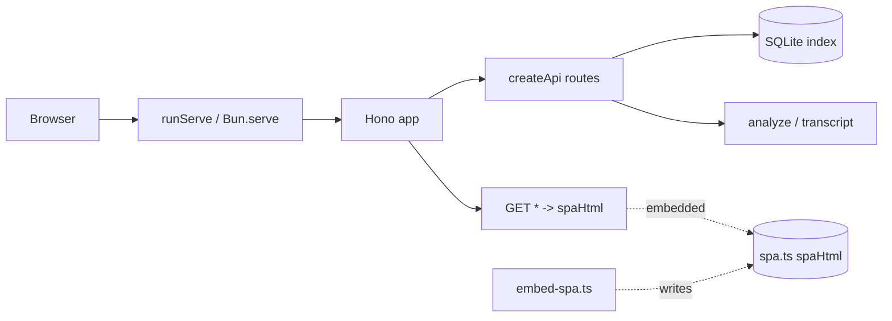
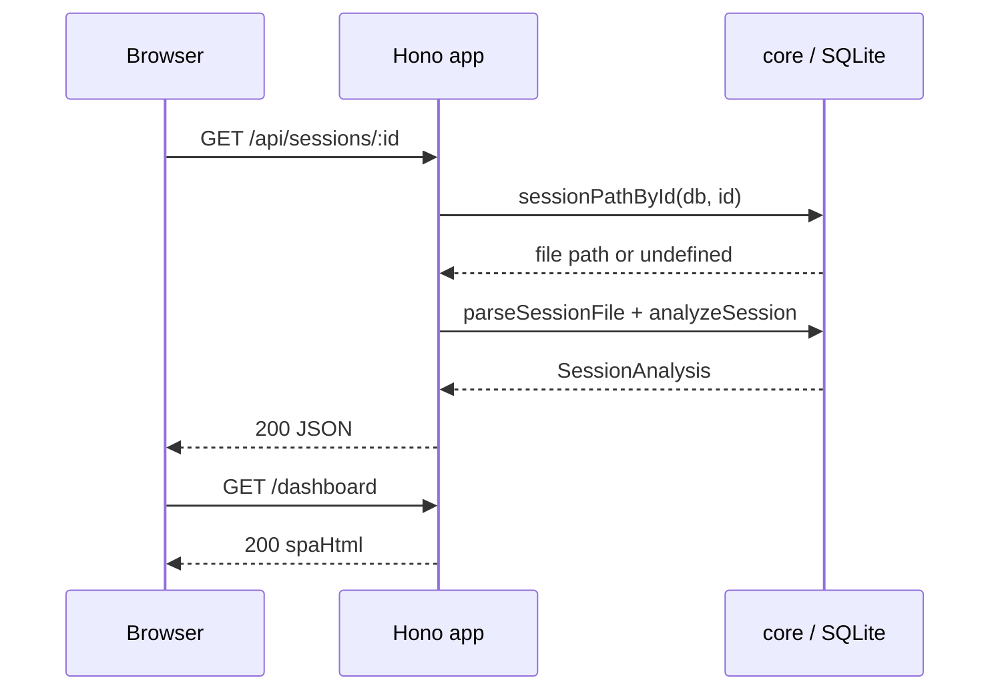

# Web Server & API

> Indexed at commit `bf5a4c8` on 2026-07-12 · [view on GitHub](https://github.com/yorch/cc-analyzer/tree/bf5a4c8)

## Relevant source files

- [src/web/server.ts](https://github.com/yorch/cc-analyzer/blob/bf5a4c8/src/web/server.ts)
- [src/web/api.ts](https://github.com/yorch/cc-analyzer/blob/bf5a4c8/src/web/api.ts)
- [src/web/spa.ts](https://github.com/yorch/cc-analyzer/blob/bf5a4c8/src/web/spa.ts)
- [scripts/embed-spa.ts](https://github.com/yorch/cc-analyzer/blob/bf5a4c8/scripts/embed-spa.ts)

## Overview

The Web Server & API subsystem is the backend for `cc-analyzer`'s local web app, launched by the `cc-analyzer serve` command. It runs a single [Hono](https://hono.dev) application on top of `Bun.serve` that serves both a JavaScript Object Notation (JSON) Application Programming Interface (API) under `/api` and, for every other path, the embedded single-page application (SPA). The server reads exclusively from the local SQLite index and the core analysis functions; it never touches the Claude Code session files directly except to parse a single session on demand.

The subsystem has three runtime modules plus one build script. [src/web/server.ts](https://github.com/yorch/cc-analyzer/blob/bf5a4c8/src/web/server.ts) owns process startup, [src/web/api.ts](https://github.com/yorch/cc-analyzer/blob/bf5a4c8/src/web/api.ts) declares the routes, and [src/web/spa.ts](https://github.com/yorch/cc-analyzer/blob/bf5a4c8/src/web/spa.ts) is a generated module holding the compiled front-end HTML. The build script [scripts/embed-spa.ts](https://github.com/yorch/cc-analyzer/blob/bf5a4c8/scripts/embed-spa.ts) bakes the Vite build output into `spa.ts` so that `bun build --compile` produces a self-contained binary with no external assets.

## Architecture

`runServe` composes one Hono application from `createApi` and a catch-all route. Requests to `/api/*` resolve against the SQLite index and core analysis helpers, while all other paths return the embedded SPA HTML. The `embed-spa.ts` script populates `spa.ts` at build time, closing the loop between the front-end build and the compiled binary.

## Module Layout

| Module | Path | Responsibility |
| ------ | ---- | -------------- |
| `runServe` | [src/web/server.ts](https://github.com/yorch/cc-analyzer/blob/bf5a4c8/src/web/server.ts) | Open the index, mount the API and SPA routes, start `Bun.serve` |
| `createApi` | [src/web/api.ts](https://github.com/yorch/cc-analyzer/blob/bf5a4c8/src/web/api.ts) | Declare the JSON API routes over the database and pricing table |
| `spa` | [src/web/spa.ts](https://github.com/yorch/cc-analyzer/blob/bf5a4c8/src/web/spa.ts) | Export `spaHtml` and `hasSpa` for the static route |
| `embed-spa` | [scripts/embed-spa.ts](https://github.com/yorch/cc-analyzer/blob/bf5a4c8/scripts/embed-spa.ts) | Write the Vite build into `spa.ts` at build time |

Sources: [src/web/server.ts:L1-L38](https://github.com/yorch/cc-analyzer/blob/bf5a4c8/src/web/server.ts#L1-L38) [src/web/api.ts:L1-L62](https://github.com/yorch/cc-analyzer/blob/bf5a4c8/src/web/api.ts#L1-L62) [scripts/embed-spa.ts:L1-L22](https://github.com/yorch/cc-analyzer/blob/bf5a4c8/scripts/embed-spa.ts#L1-L22)

## Key Components

### Server startup (`runServe`)

`runServe` accepts a `ServeOptions` object with an optional `port` and blocks until the process is killed ([src/web/server.ts#L12](https://github.com/yorch/cc-analyzer/blob/bf5a4c8/src/web/server.ts#L12)). It opens the SQLite index with `openDb` and short-circuits when the index is empty, printing a message that directs the user to run `cc-analyzer index` first ([src/web/server.ts:L13-L18](https://github.com/yorch/cc-analyzer/blob/bf5a4c8/src/web/server.ts#L13-L18)). The empty check is delegated to `isIndexEmpty` from the core query layer ([src/core/queries.ts#L146](https://github.com/yorch/cc-analyzer/blob/bf5a4c8/src/core/queries.ts#L146)).

After loading the pricing table via `loadPricing`, it builds the Hono app with `createApi(db, table)` and registers a catch-all `GET *` route ([src/web/server.ts:L20-L30](https://github.com/yorch/cc-analyzer/blob/bf5a4c8/src/web/server.ts#L20-L30)). The server binds to port `4317` by default and starts with `Bun.serve({ port, fetch: app.fetch })`, then awaits a never-resolving promise to keep the process alive ([src/web/server.ts:L32-L37](https://github.com/yorch/cc-analyzer/blob/bf5a4c8/src/web/server.ts#L32-L37)). The command is wired into the Command-Line Interface (CLI) dispatcher, which lazily imports `runServe` for the `serve` case ([src/cli/index.ts:L199-L203](https://github.com/yorch/cc-analyzer/blob/bf5a4c8/src/cli/index.ts#L199-L203)).

Sources: [src/web/server.ts:L7-L38](https://github.com/yorch/cc-analyzer/blob/bf5a4c8/src/web/server.ts#L7-L38) [src/cli/index.ts:L199-L203](https://github.com/yorch/cc-analyzer/blob/bf5a4c8/src/cli/index.ts#L199-L203)

### JSON API (`createApi`)

`createApi` is pure over its `Database` and `PricingTable` inputs, returning a fresh `Hono` instance with all routes mounted under `/api` ([src/web/api.ts:L22-L61](https://github.com/yorch/cc-analyzer/blob/bf5a4c8/src/web/api.ts#L22-L61)). The `/api/stats` route aggregates the portfolio view in a single JSON payload, combining `portfolioSummary`, `spendByMonth`, `spendByProject` (capped at 50 projects), `spendByModel`, and the top 20 sessions from `topSessions` ([src/web/api.ts:L25-L33](https://github.com/yorch/cc-analyzer/blob/bf5a4c8/src/web/api.ts#L25-L33)). These read-only aggregates come from the core stats module ([src/core/stats.ts:L54-L149](https://github.com/yorch/cc-analyzer/blob/bf5a4c8/src/core/stats.ts#L54-L149)).

Project drill-down uses two routes: `/api/projects` lists every indexed project via `listIndexedProjects`, and `/api/projects/:id/sessions` lists the sessions for one project via `listIndexedSessions` using the `id` path parameter ([src/web/api.ts:L35-L37](https://github.com/yorch/cc-analyzer/blob/bf5a4c8/src/web/api.ts#L35-L37)). Both delegate to the core query layer ([src/core/queries.ts:L59-L78](https://github.com/yorch/cc-analyzer/blob/bf5a4c8/src/core/queries.ts#L59-L78)).

Two cache-efficiency routes back the web **Insights** view: `/api/insights` returns a portfolio `cacheSummary` plus projects ranked by un-amortized cache-write cost from `cacheWasteByProject`, and `/api/insights/:id/sessions` ranks one project's sessions by the same waste metric via `cacheWasteBySession` ([src/web/api.ts](https://github.com/yorch/cc-analyzer/blob/4d7658d/src/web/api.ts) · [src/core/stats.ts](https://github.com/yorch/cc-analyzer/blob/4d7658d/src/core/stats.ts)). Like the other reads, these are pure SQL aggregates over the index.

Sources: [src/web/api.ts:L22-L45](https://github.com/yorch/cc-analyzer/blob/bf5a4c8/src/web/api.ts#L22-L45) [src/core/stats.ts:L54-L149](https://github.com/yorch/cc-analyzer/blob/bf5a4c8/src/core/stats.ts#L54-L149) [src/core/queries.ts:L59-L78](https://github.com/yorch/cc-analyzer/blob/bf5a4c8/src/core/queries.ts#L59-L78)

### Search and session routes

`/api/sessions/search` reads the `q` query parameter and an optional `limit` (defaulting to 100 and guarded with `Number.isFinite`), returning `searchSessions` results or an empty array when the trimmed query is blank ([src/web/api.ts:L40-L45](https://github.com/yorch/cc-analyzer/blob/bf5a4c8/src/web/api.ts#L40-L45)). This route is registered before `/api/sessions/:id` on purpose, so the literal segment `search` is not captured as a session id ([src/web/api.ts:L39-L40](https://github.com/yorch/cc-analyzer/blob/bf5a4c8/src/web/api.ts#L39-L40)).

The two per-session routes both resolve a filesystem path with `sessionPathById` and return a 404 JSON error when the id is unknown ([src/web/api.ts:L47-L59](https://github.com/yorch/cc-analyzer/blob/bf5a4c8/src/web/api.ts#L47-L59)). `/api/sessions/:id` parses the session file and returns `analyzeSession(events, pricing)`, the full per-session analysis including cost ([src/web/api.ts:L47-L52](https://github.com/yorch/cc-analyzer/blob/bf5a4c8/src/web/api.ts#L47-L52)). `/api/sessions/:id/transcript` parses the same file and returns `buildTranscript(events)`, the ordered transcript items the front-end renders ([src/web/api.ts:L54-L59](https://github.com/yorch/cc-analyzer/blob/bf5a4c8/src/web/api.ts#L54-L59)). Both parse on demand via `parseSessionFile` rather than caching parsed events ([src/core/parser.ts](https://github.com/yorch/cc-analyzer/blob/bf5a4c8/src/core/parser.ts) · [src/core/transcript.ts#L55](https://github.com/yorch/cc-analyzer/blob/bf5a4c8/src/core/transcript.ts#L55)).

Sources: [src/web/api.ts:L39-L61](https://github.com/yorch/cc-analyzer/blob/bf5a4c8/src/web/api.ts#L39-L61) [src/core/queries.ts:L134-L152](https://github.com/yorch/cc-analyzer/blob/bf5a4c8/src/core/queries.ts#L134-L152) [src/core/analyze.ts#L181](https://github.com/yorch/cc-analyzer/blob/bf5a4c8/src/core/analyze.ts#L181) [src/core/transcript.ts#L55](https://github.com/yorch/cc-analyzer/blob/bf5a4c8/src/core/transcript.ts#L55)

### SPA embedding

The static route in `runServe` returns `c.html(spaHtml)` when `hasSpa` is true, and otherwise returns a plain-text message telling the user to run `bun run build:web` or use a release build ([src/web/server.ts:L23-L30](https://github.com/yorch/cc-analyzer/blob/bf5a4c8/src/web/server.ts#L23-L30)). The committed [src/web/spa.ts](https://github.com/yorch/cc-analyzer/blob/bf5a4c8/src/web/spa.ts) is a placeholder: `spaHtml` is an empty string and `hasSpa` is `false`, which lets the server compile before the front-end is ever built ([src/web/spa.ts:L1-L5](https://github.com/yorch/cc-analyzer/blob/bf5a4c8/src/web/spa.ts#L1-L5)). The file is listed in `.gitignore` and force-added as this placeholder so a fresh checkout still typechecks.

`embed-spa.ts` regenerates `spa.ts` from the Vite single-file build at `web/dist/index.html` ([scripts/embed-spa.ts:L5-L14](https://github.com/yorch/cc-analyzer/blob/bf5a4c8/scripts/embed-spa.ts#L5-L14)). It reads the built HTML, `JSON.stringify`s it into a `spaHtml` export, sets `hasSpa` to `true`, and writes the module with a "GENERATED — do not edit by hand" header ([scripts/embed-spa.ts:L16-L22](https://github.com/yorch/cc-analyzer/blob/bf5a4c8/scripts/embed-spa.ts#L16-L22)). The script exits with an error if the build output is absent ([scripts/embed-spa.ts:L11-L14](https://github.com/yorch/cc-analyzer/blob/bf5a4c8/scripts/embed-spa.ts#L11-L14)). Because the whole UI lives inside a string constant, `bun build --compile` bakes it into the binary with no external asset files.

Sources: [src/web/spa.ts:L1-L5](https://github.com/yorch/cc-analyzer/blob/bf5a4c8/src/web/spa.ts#L1-L5) [scripts/embed-spa.ts:L1-L22](https://github.com/yorch/cc-analyzer/blob/bf5a4c8/scripts/embed-spa.ts#L1-L22) [src/web/server.ts:L23-L30](https://github.com/yorch/cc-analyzer/blob/bf5a4c8/src/web/server.ts#L23-L30)

## Data Flow

An API request first resolves the session id to a path through the query layer, then parses and analyzes the file before returning JSON, while any non-API path falls through the catch-all route and receives the embedded SPA HTML. Unknown session ids short-circuit to a 404 before any parsing occurs ([src/web/api.ts:L47-L52](https://github.com/yorch/cc-analyzer/blob/bf5a4c8/src/web/api.ts#L47-L52)).

Sources: [src/web/api.ts:L47-L59](https://github.com/yorch/cc-analyzer/blob/bf5a4c8/src/web/api.ts#L47-L59) [src/web/server.ts:L23-L37](https://github.com/yorch/cc-analyzer/blob/bf5a4c8/src/web/server.ts#L23-L37)

## Configuration & Extension Points

| Setting | Type | Default | Purpose |
| ------- | ---- | ------- | ------- |
| `port` | `number` | `4317` | Listen port passed via `ServeOptions` and the `--port` CLI flag |
| `q` | query string | `""` | Search query for `/api/sessions/search` |
| `limit` | query string | `100` | Result cap for `/api/sessions/search` |

The `port` flows from the CLI `serve` command into `ServeOptions` and finally into `Bun.serve` ([src/web/server.ts:L7-L33](https://github.com/yorch/cc-analyzer/blob/bf5a4c8/src/web/server.ts#L7-L33) · [src/cli/index.ts:L199-L203](https://github.com/yorch/cc-analyzer/blob/bf5a4c8/src/cli/index.ts#L199-L203)). The search parameters are parsed directly from the request query in `createApi` ([src/web/api.ts:L40-L45](https://github.com/yorch/cc-analyzer/blob/bf5a4c8/src/web/api.ts#L40-L45)).

Sources: [src/web/server.ts:L7-L33](https://github.com/yorch/cc-analyzer/blob/bf5a4c8/src/web/server.ts#L7-L33) [src/web/api.ts:L40-L45](https://github.com/yorch/cc-analyzer/blob/bf5a4c8/src/web/api.ts#L40-L45)

## Related Pages

- Front-end consumer: [Web SPA Frontend](./6-web-spa-frontend.md)
- Data source: [Core Analysis Engine](./2-core-analysis-engine.md)
- Launching command: [CLI](./3-cli.md)
- Sibling interface: [TUI](./4-tui.md)
