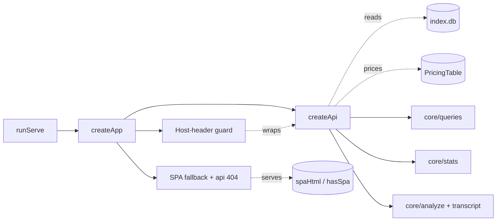
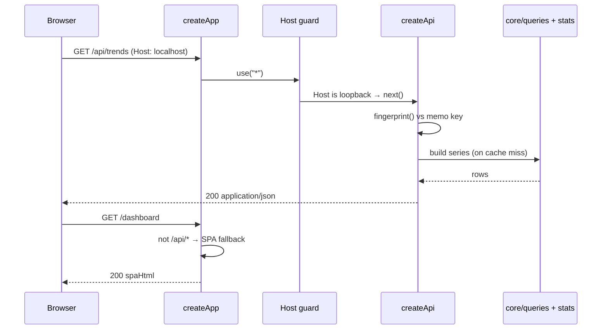

# Web Server & API

> Indexed at commit `51ccd4e` on 2026-07-23 · [view on GitHub](https://github.com/yorch/cc-analyzer/tree/51ccd4e)

## Relevant source files

- [src/web/server.ts](https://github.com/yorch/cc-analyzer/blob/51ccd4e/src/web/server.ts)
- [src/web/api.ts](https://github.com/yorch/cc-analyzer/blob/51ccd4e/src/web/api.ts)
- [src/web/spa.ts](https://github.com/yorch/cc-analyzer/blob/51ccd4e/src/web/spa.ts)
- `scripts/compile-with-spa.ts`

## Overview

The Web Server & API subsystem is the backend of `cc-analyzer serve`: a local [Hono](https://hono.dev) application that exposes the analytics core over a JSON HTTP API and serves the single-page application (SPA) that renders it. It is the third of the three frontends over `src/core/`, alongside the command-line interface (CLI) and the terminal UI (TUI), and it is the only one that reaches the browser. The entry point `runServe()` opens the SQLite index, loads pricing, composes the app, and binds a `Bun.serve` socket on port `4317` by default ([src/web/server.ts#L81-L106](https://github.com/yorch/cc-analyzer/blob/51ccd4e/src/web/server.ts#L81-L106)).

The subsystem has three concerns kept in separate modules: request routing and read-only data access ([src/web/api.ts](https://github.com/yorch/cc-analyzer/blob/51ccd4e/src/web/api.ts)), app composition with a loopback security guard and SPA fallback ([src/web/server.ts](https://github.com/yorch/cc-analyzer/blob/51ccd4e/src/web/server.ts)), and the embedded SPA bytes ([src/web/spa.ts](https://github.com/yorch/cc-analyzer/blob/51ccd4e/src/web/spa.ts)). All three factory functions — `createApi`, `createApp` — are pure over their `db` and `pricing` arguments, so the app can be built and exercised without binding a port ([src/web/api.ts#L45](https://github.com/yorch/cc-analyzer/blob/51ccd4e/src/web/api.ts#L45), [src/web/server.ts#L39-L43](https://github.com/yorch/cc-analyzer/blob/51ccd4e/src/web/server.ts#L39-L43)).

## Architecture

```mermaid
flowchart LR
    runServe[runServe] --> createApp
    createApp --> HostGuard[Host-header guard]
    createApp --> createApi
    createApp --> Fallback[SPA fallback + api 404]

    HostGuard -.wraps.-> createApi
    createApi -.reads.-> DB[(index.db)]
    createApi -.prices.-> Pricing[(PricingTable)]
    Fallback -.serves.-> SPA[(spaHtml / hasSpa)]

    createApi --> Queries[core/queries]
    createApi --> Stats[core/stats]
    createApi --> Analyze[core/analyze + transcript]
```

`runServe()` composes the app once and hands `app.fetch` to `Bun.serve` ([src/web/server.ts#L92-L95](https://github.com/yorch/cc-analyzer/blob/51ccd4e/src/web/server.ts#L92-L95)). `createApp` mounts the Host-header guard first so it wraps every route, mounts the API router at `/`, adds a JSON 404 for unmatched `/api/*` paths, then falls back to the SPA for everything else ([src/web/server.ts#L50-L72](https://github.com/yorch/cc-analyzer/blob/51ccd4e/src/web/server.ts#L50-L72)). `createApi` reads exclusively from the SQLite index and the loaded pricing table, delegating all computation to `src/core/` modules.

## Module Layout

| Module | Path | Responsibility |
| ------ | ---- | -------------- |
| `server` | [src/web/server.ts](https://github.com/yorch/cc-analyzer/blob/51ccd4e/src/web/server.ts) | `runServe` lifecycle, `createApp` composition, loopback Host guard, SPA fallback |
| `api` | [src/web/api.ts](https://github.com/yorch/cc-analyzer/blob/51ccd4e/src/web/api.ts) | `createApi` Hono router: all `/api/*` JSON endpoints with fingerprint memoization |
| `spa` | [src/web/spa.ts](https://github.com/yorch/cc-analyzer/blob/51ccd4e/src/web/spa.ts) | Tracked placeholder used by clean source checkouts |
| `compile-with-spa` | `scripts/compile-with-spa.ts` | Compiles a disposable source copy containing embedded HTML |

Sources: `src/web/server.ts`, `src/web/api.ts`, `scripts/compile-with-spa.ts`

## Key Components

### runServe lifecycle

`runServe()` is the `serve` command body. It opens the index with `openDb()` and builds it automatically when empty; `--refresh` requests the same incremental update for an existing cache. Otherwise startup performs only a metadata freshness check, warning about exact added, changed, and deleted counts without making startup pay the cost of parsing large sessions. It then loads pricing, resolves the bind hostname (default `127.0.0.1`), and derives `loopbackOnly` from `isLoopbackHost()` before composing the app. After binding it prints the browsable URL and, when bound to a non-loopback address, warns on stderr that session transcripts are exposed to the network. `--open` launches the URL in the default browser only for loopback bindings and treats failure as a warning. The function then returns a never-resolving `Promise`, keeping the process alive until it is killed.

Sources: [src/web/server.ts:L77-L106](https://github.com/yorch/cc-analyzer/blob/51ccd4e/src/web/server.ts#L77-L106)

### createApp and the loopback Host guard

`createApp` wires the middleware stack. When `loopbackOnly` is set it registers a `use("*")` middleware that rejects any request whose `Host` header is not a local name with a `403 Forbidden` ([src/web/server.ts#L50-L58](https://github.com/yorch/cc-analyzer/blob/51ccd4e/src/web/server.ts#L50-L58)). This is a Domain Name System (DNS) rebinding defense: a hostile page that re-resolves its own domain to `127.0.0.1` would otherwise gain same-origin access to the API. The guard is registered before the API routes so it wraps them.

`isLoopbackHost()` normalizes the host through the URL host grammar, bracketing bare Internet Protocol version 6 (IPv6) literals so odd spellings and trailing ports resolve consistently, then checks the parsed hostname against the set `{localhost, 127.0.0.1, ::1}` ([src/web/server.ts#L16-L33](https://github.com/yorch/cc-analyzer/blob/51ccd4e/src/web/server.ts#L16-L33)). After the API router, `createApp` returns a JSON `404` for any unmatched `/api/*` path so API misses never fall through to HTML, and serves the SPA for every other path ([src/web/server.ts#L60-L72](https://github.com/yorch/cc-analyzer/blob/51ccd4e/src/web/server.ts#L60-L72)).

Sources: [src/web/server.ts:L16-L75](https://github.com/yorch/cc-analyzer/blob/51ccd4e/src/web/server.ts#L16-L75)

### createApi and fingerprint memoization

`createApi` builds the `/api` router. Because the index only changes when `cc-analyzer index` runs, the aggregate endpoints memoize their serialized JSON against a cheap `fingerprint()` — the sessions row count plus the newest `indexed_at` timestamp ([src/web/api.ts#L52-L57](https://github.com/yorch/cc-analyzer/blob/51ccd4e/src/web/api.ts#L52-L57)). A reindex, even from another process, changes the fingerprint and invalidates the cache on the next request. One `memo(name, key, build)` helper over a single `Map` backs every cached thing here — built objects (the portfolio stats, the shared signals) and serialized payloads alike; `cachedJson()` is the thin wrapper that stringifies inside it and returns the pre-serialized string with an explicit `application/json` content type. A slot is re-inserted on every read, so `Map` iteration order is true recency and the slot cap (`capSlots`, which governs the whole keyspace) evicts the least recently *requested* entry ([src/web/api.ts#L58-L65](https://github.com/yorch/cc-analyzer/blob/51ccd4e/src/web/api.ts#L58-L65)).

`GET /api/index-status` returns the shared `IndexStatus` shape: the last successful refresh timestamp and age plus exact `stale`, `added`, `changed`, and `deleted` fields. It compares only file path, size, and modification time, so the browser can poll freshness without triggering session parsing or changing the index.

The `MAX_PROJECT_ROWS` cap of `2000` bounds project-list payloads: the dashboard filters client-side, so the server returns more than a top-N slice while still refusing to ship unbounded JSON for a pathological portfolio ([src/web/api.ts#L38-L42](https://github.com/yorch/cc-analyzer/blob/51ccd4e/src/web/api.ts#L38-L42)).

Sources: [src/web/api.ts:L44-L65](https://github.com/yorch/cc-analyzer/blob/51ccd4e/src/web/api.ts#L44-L65)

### Portfolio, insights, trends, and analytics endpoints

The aggregate endpoints are the portfolio-wide views. `GET /api/stats` returns `buildPortfolioStats`, keyed by the fingerprint plus the current local day so streaks and run-rate roll over at midnight ([src/web/api.ts#L67-L73](https://github.com/yorch/cc-analyzer/blob/51ccd4e/src/web/api.ts#L67-L73)), plus a `costBasis` field (`"api"` or `"subscription"`) merged in at the route handler from `getCostBasis()` (`src/core/prefs.ts`). `costBasis` is read fresh on every request rather than baked into the memoized rollup — the two are cached separately (the expensive `buildPortfolioStats` result behind the fingerprint, the cheap preference read behind nothing) — so flipping the preference with `cc-analyzer cost-basis` is reflected on the very next request, without touching the index or its fingerprint. It's not part of the pure `PortfolioStats` shape core builds; the SPA reads it to decide whether to render the subscription framing note (see [Web SPA Frontend](./6-web-spa-frontend.md)).

`GET /api/prefs` and `PUT /api/prefs` (`POST` accepted as an alias) are the API's one read/write pair for the preference: `GET` returns `{ costBasis }` fresh per request — the same canonical read `/api/stats` merges in, exposed on its own so the SPA doesn't have to fetch the whole portfolio payload just to know the current setting; `PUT`/`POST` take a JSON body `{ "costBasis": "api" | "subscription" }`, validate it strictly (an unrecognized value or unparsable body is a `400` with a JSON `{ error }`, and the stored preference is left untouched), persist a valid one via `setCostBasis()`, and echo `{ costBasis }` back. This is the API's **only write endpoint**. It's safe as one: the server binds to loopback (`127.0.0.1`) by default and is meant for a single local user (see `runServe` above and the Host-header guard below), and the write itself never touches `~/.claude` — it persists only to cc-analyzer's own `<stateDir>/prefs.json` (`src/core/prefs.ts`), so the tool's read-only guarantee over Claude session data holds. Neither route touches the fingerprint-memoized caches — `costBasis` was already served fresh outside them, so the toggle takes effect on the very next `/api/stats` (or `/api/prefs`) fetch without a reindex.

`GET /api/insights` bundles cache-efficiency data — a `cacheSummary`, projects ranked by un-amortized cache-write dollars via `cacheWasteByProject`, a time-to-live (TTL) split, and idle-share buckets — plus `diagnostics`, the ranked `PortfolioDiagnostic[]` from the bun-free rules engine (`buildPortfolioDiagnostics` over `assemblePortfolioSignals(db, pricing)`); because those signals include the setup audit's filesystem inventory scan, the route is memoized on `fingerprint():today` like `/api/audit`, so staleness rolls over at midnight. The signals object is memoized once per `fingerprint():today` and shared with `/api/audit` and `/api/report`, so the summary, TTL split, and idle buckets are read off it rather than recomputed; only the ranked project list is its own query, since the client filters that list and needs every project rather than the rules' default top slice. `GET /api/insights/:id/sessions` drills into one project's wasteful sessions ([src/web/api.ts#L80-L91](https://github.com/yorch/cc-analyzer/blob/51ccd4e/src/web/api.ts#L80-L91)).

`GET /api/trends` assembles the time-series for charts: daily spend, a weekday-by-hour heatmap, model mix, concurrency lanes, weekly error rate, the sidechain trend, and the cost/duration/prompt scatter ([src/web/api.ts#L97-L107](https://github.com/yorch/cc-analyzer/blob/51ccd4e/src/web/api.ts#L97-L107)). `GET /api/analytics` spreads `analyticsRollup` — a single table scan covering tool, skill, subagent, shell, retry, thrash (edit-test-loop sessions, redundant reads, top re-read files), corrections (correction/interruption turns, their shares of real-prompt turns, and a weekly trend), permission-mode, stop-reason, turn-depth, version, and branch metrics — and adds web-tool usage, sidechain summaries, compaction usage, and the two cost-optimization rollups: `contextTax` (per-project median/p90 tokens spent before the user types) and `whatIf` (each model's actual token mix repriced at the other models' rates, which is why the route needs the pricing table) — plus `parseCoverage`, the portfolio and per-Claude-Code-version record of how much of the indexed JSONL this build of the parser understood ([src/web/api.ts#L112-L119](https://github.com/yorch/cc-analyzer/blob/51ccd4e/src/web/api.ts#L112-L119)). The response shapes of these aggregate endpoints are documented in [Analytics & Insights](./7-analytics-and-insights.md).

`GET /api/audit` returns the `SetupAudit`: `scanInventory()` reads the installed setup off the Claude dir (skills, subagents, plugins, MCP servers, hooks, permission rules) and `buildSetupAudit(inventory, analyticsRollup(db), today)` cross-references it with observed usage. The route serves the `audit` field of the shared portfolio-signals memo rather than building a second one, so the audit `/api/insights` folds into its findings and the audit this route returns are the same object. Alongside `inventory`, `counts`, and `findings`, the payload carries `plugins` — the `PluginUsageRow[]` per-plugin rollup (skills/subagents/MCP servers used of shipped, invocations, subagent sessions, turn-scoped turns and cost, last-used day), sorted most expensive first and always present, `[]` when no plugin is installed. Its inputs include the filesystem (as do `/api/insights`'s, whose diagnostics embed the same audit), so it is memoized on the fingerprint plus the local day: any reindex — or a new day, since staleness rolls over at midnight — rebuilds the whole payload, inventory scan included. The scan is read-only and never throws, so a missing or malformed config file degrades to a smaller inventory rather than a `500`.

`GET /api/report` returns the weekly digest: `buildWeeklyDigest(db, pricing, { week, today, costBasis })` (`src/core/digest-signals.ts`). The optional `?week=YYYY-MM-DD` query selects the ISO week containing that day; omitting it reports the last complete week, and a malformed value is a `400` with a JSON `{ error }` (the same `isDayString` guard the CLI's `--week` uses). `?insights=0` builds the digest with an empty insight snapshot — the expensive half of the response — for callers that render none of it, such as the dashboard card; it gets its own memo slot so it never evicts the full report. Its insight snapshot is the same current-state `PortfolioDiagnostic[]` `/api/insights` serves, taken from one memo shared by both routes (`buildPortfolioDiagnostics(assemblePortfolioSignals(db, pricing))` keyed `fingerprint():today`, because those signals embed the audit's filesystem inventory scan and its staleness rolls over at midnight) and injected through `WeeklyDigestOptions.insights`, so the two routes assemble them once between them; the CLI keeps assembling its own. The period is resolved **before** the memo, so each ISO week gets its own slot (`report:<period start>`, keyed `fingerprint():today`): two days of the same week share one entry, and asking for an older week never evicts the default one. That slot name is the one memo keyspace a client can enumerate — `?week=` is a validated day, but there are many days — so report slots are capped at the most recently requested `MAX_REPORT_SLOTS` weeks; a dropped week costs one rebuild. The `costBasis` display preference is read at the route boundary and handed to the builder through `WeeklyDigestOptions.costBasis` (the core builder never reads `prefs.ts`); it rides in the memo *key* rather than being merged over a cached digest, because it is baked into the framing sentence and into the markdown the SPA copies, and flipping it is rare enough that one cheap period rebuild is the simpler correct answer. Period metrics are session-day-scoped (a session counts toward the period containing its start day); the insight snapshot is portfolio-wide current state, not period-scoped — see [Analytics & Insights](./7-analytics-and-insights.md).

Sources: [src/web/api.ts:L67-L119](https://github.com/yorch/cc-analyzer/blob/51ccd4e/src/web/api.ts#L67-L119) [src/core/inventory.ts](https://github.com/yorch/cc-analyzer/blob/51ccd4e/src/core/inventory.ts) [src/core/setup-audit.ts](https://github.com/yorch/cc-analyzer/blob/51ccd4e/src/core/setup-audit.ts)

### Project and session endpoints

Project drill-down endpoints scope data to one encoded project id. `GET /api/projects` lists indexed projects; `GET /api/projects/:id/sessions` lists that project's sessions; `GET /api/projects/:id/files` returns the files Claude touched, hottest first ([src/web/api.ts#L75](https://github.com/yorch/cc-analyzer/blob/51ccd4e/src/web/api.ts#L75), [src/web/api.ts#L121](https://github.com/yorch/cc-analyzer/blob/51ccd4e/src/web/api.ts#L121), [src/web/api.ts#L135](https://github.com/yorch/cc-analyzer/blob/51ccd4e/src/web/api.ts#L135)). `GET /api/projects/:id/trends` returns per-project chart series memoized under a per-id cache key, and it verifies the project exists before touching the memo `Map` so unknown ids `404` rather than growing the keyspace with probed ids ([src/web/api.ts#L127-L132](https://github.com/yorch/cc-analyzer/blob/51ccd4e/src/web/api.ts#L127-L132)).

`GET /api/sessions/search` is registered before `/api/sessions/:id` so the literal segment `search` is not captured as an id; it clamps the `limit` query to the range `1..1000` to avoid SQLite's `LIMIT -1` unlimited behavior and abusive values, returning an empty array for a blank query ([src/web/api.ts#L137-L144](https://github.com/yorch/cc-analyzer/blob/51ccd4e/src/web/api.ts#L137-L144)). The two per-session endpoints re-parse the live `.jsonl` file rather than serving stale index rows: `GET /api/sessions/:id` returns `analyzeSession(...)` and `GET /api/sessions/:id/transcript` returns `buildTranscript(...)` ([src/web/api.ts#L157-L171](https://github.com/yorch/cc-analyzer/blob/51ccd4e/src/web/api.ts#L157-L171)). Because the index is a disposable cache, a `readSession` helper swallows parse failures and both endpoints `404` with a "re-run `cc-analyzer index`" hint when the underlying file has been deleted, never crashing into a `500` ([src/web/api.ts#L146-L163](https://github.com/yorch/cc-analyzer/blob/51ccd4e/src/web/api.ts#L146-L163)).

Sources: [src/web/api.ts:L75-L171](https://github.com/yorch/cc-analyzer/blob/51ccd4e/src/web/api.ts#L75-L171)

### SPA embedding

The web UI is baked into the compiled binary as a string. [src/web/spa.ts](https://github.com/yorch/cc-analyzer/blob/51ccd4e/src/web/spa.ts) exports `spaHtml` (the full HTML document) and the `hasSpa` boolean, which the server consults to decide whether to serve the app or a plain-text "not built" notice ([src/web/server.ts#L66-L72](https://github.com/yorch/cc-analyzer/blob/51ccd4e/src/web/server.ts#L66-L72)). The committed placeholder ships `spaHtml = ""` and `hasSpa = false`, so the server compiles and runs before the SPA is ever built ([src/web/spa.ts#L1-L5](https://github.com/yorch/cc-analyzer/blob/51ccd4e/src/web/spa.ts#L1-L5)).

`scripts/compile-with-spa.ts` reads the single-file Vite build at `web/dist/index.html`, copies the source tree under ignored `tmp/`, writes `spaHtml` and `hasSpa = true` into that disposable copy, and runs `bun build --compile` against the copied entrypoint. Release binaries therefore serve the whole UI with no external assets while the tracked placeholder is never modified. The React SPA that this HTML boots is documented in [Web SPA Frontend](./6-web-spa-frontend.md).

Sources: `src/web/spa.ts`, `scripts/compile-with-spa.ts`, `src/web/server.ts`

## Data Flow

```mermaid
sequenceDiagram
    participant Browser
    participant createApp
    participant HostGuard as Host guard
    participant createApi
    participant Core as core/queries + stats

    Browser->>createApp: GET /api/trends (Host: localhost)
    createApp->>HostGuard: use("*")
    HostGuard->>createApi: Host is loopback → next()
    createApi->>createApi: fingerprint() vs memo key
    createApi->>Core: build series (on cache miss)
    Core-->>createApi: rows
    createApi-->>Browser: 200 application/json

    Browser->>createApp: GET /dashboard
    createApp->>createApp: not /api/* → SPA fallback
    createApp-->>Browser: 200 spaHtml
```

A browser request first passes the loopback Host guard, which either forwards it or returns `403`. API requests hit `createApi`, where aggregate endpoints check the index fingerprint against their memoized body and rebuild from `src/core/` only on a miss before returning `application/json` ([src/web/api.ts#L59-L65](https://github.com/yorch/cc-analyzer/blob/51ccd4e/src/web/api.ts#L59-L65)). Any non-API path returns the embedded SPA so client-side routes such as `/dashboard` resolve to the app shell ([src/web/server.ts#L60-L72](https://github.com/yorch/cc-analyzer/blob/51ccd4e/src/web/server.ts#L60-L72)).

Sources: [src/web/server.ts:L50-L72](https://github.com/yorch/cc-analyzer/blob/51ccd4e/src/web/server.ts#L50-L72) [src/web/api.ts:L52-L107](https://github.com/yorch/cc-analyzer/blob/51ccd4e/src/web/api.ts#L52-L107)

## Configuration & Extension Points

| Setting | Type | Default | Purpose |
| ------- | ---- | ------- | ------- |
| `port` | `number` | `4317` | TCP port passed to `Bun.serve` |
| `host` | `string` | `127.0.0.1` | Bind address; a non-loopback value enables network exposure and disables the Host guard |
| `MAX_PROJECT_ROWS` | `number` | `2000` | Upper bound on project-list rows in aggregate payloads |
| `limit` (query) | `number` | `100` | Search result cap, clamped to `1..1000` |

Sources: [src/web/server.ts:L10-L14](https://github.com/yorch/cc-analyzer/blob/51ccd4e/src/web/server.ts#L10-L14) [src/web/server.ts:L90-L95](https://github.com/yorch/cc-analyzer/blob/51ccd4e/src/web/server.ts#L90-L95) [src/web/api.ts:L42](https://github.com/yorch/cc-analyzer/blob/51ccd4e/src/web/api.ts#L42) [src/web/api.ts:L138-L143](https://github.com/yorch/cc-analyzer/blob/51ccd4e/src/web/api.ts#L138-L143)

## Related Pages

- Web SPA Frontend: [6. Web SPA Frontend](./6-web-spa-frontend.md)
- Analytics & Insights: [7. Analytics & Insights](./7-analytics-and-insights.md)
- Core Analysis Engine: [2. Core Analysis Engine](./2-core-analysis-engine.md)
- CLI: [3. CLI](./3-cli.md)
- TUI: [4. TUI](./4-tui.md)
