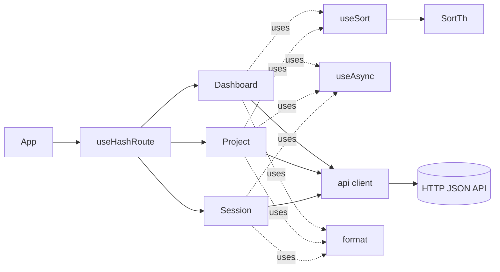
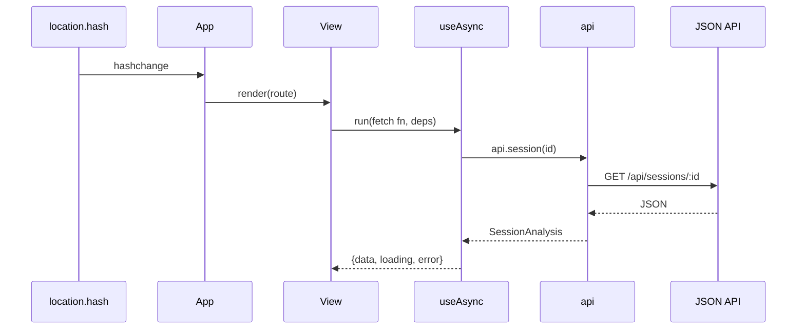

# Web SPA Frontend

> Indexed at commit `bf5a4c8` on 2026-07-12 · [view on GitHub](https://github.com/yorch/cc-analyzer/tree/bf5a4c8)

## Relevant source files

- [web/src/App.tsx](https://github.com/yorch/cc-analyzer/blob/bf5a4c8/web/src/App.tsx)
- [web/src/router.ts](https://github.com/yorch/cc-analyzer/blob/bf5a4c8/web/src/router.ts)
- [web/src/api.ts](https://github.com/yorch/cc-analyzer/blob/bf5a4c8/web/src/api.ts)
- [web/src/useAsync.ts](https://github.com/yorch/cc-analyzer/blob/bf5a4c8/web/src/useAsync.ts)
- [web/src/useSort.ts](https://github.com/yorch/cc-analyzer/blob/bf5a4c8/web/src/useSort.ts)
- [web/src/SortTh.tsx](https://github.com/yorch/cc-analyzer/blob/bf5a4c8/web/src/SortTh.tsx)
- [web/src/format.ts](https://github.com/yorch/cc-analyzer/blob/bf5a4c8/web/src/format.ts)
- [web/src/views/Dashboard.tsx](https://github.com/yorch/cc-analyzer/blob/bf5a4c8/web/src/views/Dashboard.tsx)
- [web/src/views/Project.tsx](https://github.com/yorch/cc-analyzer/blob/bf5a4c8/web/src/views/Project.tsx)
- [web/src/views/Session.tsx](https://github.com/yorch/cc-analyzer/blob/bf5a4c8/web/src/views/Session.tsx)
- [web/vite.config.ts](https://github.com/yorch/cc-analyzer/blob/bf5a4c8/web/vite.config.ts)

## Overview

The Web Single-Page Application (SPA) is the browser front end that `cc-analyzer serve` ships. It lives in the `web/` tree, which is distinct from the `src/web/` server tree that hosts the JavaScript Object Notation (JSON) Application Programming Interface (API). The SPA is a React 19 application built with three top-level views — Dashboard, Project, and Session — wired together by a hash-based router in [web/src/router.ts#L17-L31](https://github.com/yorch/cc-analyzer/blob/bf5a4c8/web/src/router.ts#L17-L31) and mounted by [web/src/App.tsx#L6-L24](https://github.com/yorch/cc-analyzer/blob/bf5a4c8/web/src/App.tsx#L6-L24).

Data enters exclusively through the typed client in [web/src/api.ts#L168-L178](https://github.com/yorch/cc-analyzer/blob/bf5a4c8/web/src/api.ts#L168-L178), whose response interfaces mirror the server's `core/stats`, `core/queries`, `core/analyze`, and `core/transcript` outputs. Shared behavior lives in small hooks and helpers: [web/src/useAsync.ts](https://github.com/yorch/cc-analyzer/blob/bf5a4c8/web/src/useAsync.ts) for fetch state, [web/src/useSort.ts](https://github.com/yorch/cc-analyzer/blob/bf5a4c8/web/src/useSort.ts) with [web/src/SortTh.tsx](https://github.com/yorch/cc-analyzer/blob/bf5a4c8/web/src/SortTh.tsx) for sortable tables, and [web/src/format.ts](https://github.com/yorch/cc-analyzer/blob/bf5a4c8/web/src/format.ts) for currency, token, and time formatting. Vite compiles the whole tree into one self-contained Hypertext Markup Language (HTML) file that the binary embeds and serves.

## Architecture

`App` reads the current route and renders exactly one view; each view fetches through the shared `api` client via `useAsync`, and formats output through `format`. Sortable tables are the only stateful table pattern, shared by Dashboard and Project through `useSort` and its header component `SortTh`.

## Module Layout

| Module | Path | Responsibility |
| ------ | ---- | -------------- |
| `App` | [web/src/App.tsx](https://github.com/yorch/cc-analyzer/blob/bf5a4c8/web/src/App.tsx) | Masthead plus route-to-view switch |
| `router` | [web/src/router.ts](https://github.com/yorch/cc-analyzer/blob/bf5a4c8/web/src/router.ts) | Hash parsing, `useHashRoute`, `link` builders |
| `api` | [web/src/api.ts](https://github.com/yorch/cc-analyzer/blob/bf5a4c8/web/src/api.ts) | Typed `fetch` wrappers and response interfaces |
| `useAsync` | [web/src/useAsync.ts](https://github.com/yorch/cc-analyzer/blob/bf5a4c8/web/src/useAsync.ts) | Async data-fetch state hook |
| `useSort` / `SortTh` | [web/src/useSort.ts](https://github.com/yorch/cc-analyzer/blob/bf5a4c8/web/src/useSort.ts) | Client-side table sort and clickable headers |
| `format` | [web/src/format.ts](https://github.com/yorch/cc-analyzer/blob/bf5a4c8/web/src/format.ts) | Currency, token, duration, path helpers |
| `Dashboard` | [web/src/views/Dashboard.tsx](https://github.com/yorch/cc-analyzer/blob/bf5a4c8/web/src/views/Dashboard.tsx) | Portfolio overview, search, project filter |
| `Project` | [web/src/views/Project.tsx](https://github.com/yorch/cc-analyzer/blob/bf5a4c8/web/src/views/Project.tsx) | Per-project session list |
| `Session` | [web/src/views/Session.tsx](https://github.com/yorch/cc-analyzer/blob/bf5a4c8/web/src/views/Session.tsx) | Per-session summary, turns, transcript |
| `vite.config` | [web/vite.config.ts](https://github.com/yorch/cc-analyzer/blob/bf5a4c8/web/vite.config.ts) | Single-file build configuration |

Sources: [web/src/App.tsx:L1-L24](https://github.com/yorch/cc-analyzer/blob/bf5a4c8/web/src/App.tsx#L1-L24) [web/src/api.ts:L162-L178](https://github.com/yorch/cc-analyzer/blob/bf5a4c8/web/src/api.ts#L162-L178) [web/vite.config.ts:L1-L17](https://github.com/yorch/cc-analyzer/blob/bf5a4c8/web/vite.config.ts#L1-L17)

## Key Components

### Routing and App shell

`App` calls `useHashRoute()` once and switches on `route.name`, rendering `Dashboard`, `Project`, or `Session` inside a fixed masthead in [web/src/App.tsx#L19-L21](https://github.com/yorch/cc-analyzer/blob/bf5a4c8/web/src/App.tsx#L19-L21). The router parses `window.location.hash` into a discriminated `Route` union — `dashboard`, `project` with an `id`, or `session` with an `id` — using two regular expressions and `decodeURIComponent`, defaulting to `dashboard` in [web/src/router.ts#L8-L15](https://github.com/yorch/cc-analyzer/blob/bf5a4c8/web/src/router.ts#L8-L15). `useHashRoute` seeds state from the current hash and subscribes to the `hashchange` event so navigation re-renders without a full reload in [web/src/router.ts#L17-L25](https://github.com/yorch/cc-analyzer/blob/bf5a4c8/web/src/router.ts#L17-L25). The `link` object builds the matching URLs (`#/`, `#/project/<id>`, `#/session/<id>`) so views never hand-write hashes in [web/src/router.ts#L27-L31](https://github.com/yorch/cc-analyzer/blob/bf5a4c8/web/src/router.ts#L27-L31).

Sources: [web/src/App.tsx:L1-L24](https://github.com/yorch/cc-analyzer/blob/bf5a4c8/web/src/App.tsx#L1-L24) [web/src/router.ts:L1-L31](https://github.com/yorch/cc-analyzer/blob/bf5a4c8/web/src/router.ts#L1-L31)

### API client and types

`api.ts` exposes a single `get<T>` helper that wraps `fetch`, throws on a non-`ok` status, and casts the parsed JSON to the requested type in [web/src/api.ts#L162-L166](https://github.com/yorch/cc-analyzer/blob/bf5a4c8/web/src/api.ts#L162-L166). The exported `api` object binds six endpoints: `stats`, `projects`, `sessions`, `session`, `transcript`, and `searchSessions`, each URL-encoding its path parameters in [web/src/api.ts#L168-L178](https://github.com/yorch/cc-analyzer/blob/bf5a4c8/web/src/api.ts#L168-L178). The file also declares the full response contract, including `StatsResponse` for the dashboard, `SessionAnalysis` with nested `Turn`, `ApiCall`, and `TurnStep` shapes for the session view, and `TranscriptItem` for the reader in [web/src/api.ts#L43-L160](https://github.com/yorch/cc-analyzer/blob/bf5a4c8/web/src/api.ts#L43-L160).

Sources: [web/src/api.ts:L1-L178](https://github.com/yorch/cc-analyzer/blob/bf5a4c8/web/src/api.ts#L1-L178)

### Data-fetch and sorting hooks

`useAsync` is a minimal fetch hook that re-runs its function when `deps` change, tracks `data`, `error`, and `loading`, and guards against stale updates with a `cancelled` flag in its cleanup in [web/src/useAsync.ts#L10-L24](https://github.com/yorch/cc-analyzer/blob/bf5a4c8/web/src/useAsync.ts#L10-L24). Every view resolves its network state through this one hook. `useSort` performs client-side sorting: it holds the active `key` and `dir`, resolves a value accessor from an `Accessors` map, and returns a `sorted` copy plus a `toggle` that flips direction on the active column or switches to a new column descending-first in [web/src/useSort.ts#L22-L42](https://github.com/yorch/cc-analyzer/blob/bf5a4c8/web/src/useSort.ts#L22-L42). Its `compare` function sorts numbers numerically and strings with a case-insensitive `localeCompare` in [web/src/useSort.ts#L13-L16](https://github.com/yorch/cc-analyzer/blob/bf5a4c8/web/src/useSort.ts#L13-L16). `SortTh` renders a clickable `th` that calls `sort.toggle`, shows an ascending or descending arrow on the active column, and sets `aria-sort` for accessibility in [web/src/SortTh.tsx#L15-L27](https://github.com/yorch/cc-analyzer/blob/bf5a4c8/web/src/SortTh.tsx#L15-L27).

Sources: [web/src/useAsync.ts:L1-L25](https://github.com/yorch/cc-analyzer/blob/bf5a4c8/web/src/useAsync.ts#L1-L25) [web/src/useSort.ts:L1-L42](https://github.com/yorch/cc-analyzer/blob/bf5a4c8/web/src/useSort.ts#L1-L42) [web/src/SortTh.tsx:L1-L28](https://github.com/yorch/cc-analyzer/blob/bf5a4c8/web/src/SortTh.tsx#L1-L28)

### Formatting helpers

`format.ts` centralizes display formatting so views stay declarative. `usd` scales precision by magnitude — four decimals below a cent, two below `1000`, and grouped whole dollars above — in [web/src/format.ts#L1-L6](https://github.com/yorch/cc-analyzer/blob/bf5a4c8/web/src/format.ts#L1-L6), while `count` abbreviates large numbers with `k`, `M`, and `B` suffixes in [web/src/format.ts#L8-L13](https://github.com/yorch/cc-analyzer/blob/bf5a4c8/web/src/format.ts#L8-L13). `tokens` and `tokensOf` render an input/output figure with an optional `+<n> cache` tail, deriving cache totals from all three cache fields in [web/src/format.ts#L18-L27](https://github.com/yorch/cc-analyzer/blob/bf5a4c8/web/src/format.ts#L18-L27). `duration` collapses milliseconds into `s`/`m`/`h`/`d` units, `relTime` produces relative "ago" labels, and `shortPath` truncates long paths to their last two segments in [web/src/format.ts#L29-L55](https://github.com/yorch/cc-analyzer/blob/bf5a4c8/web/src/format.ts#L29-L55).

Sources: [web/src/format.ts:L1-L55](https://github.com/yorch/cc-analyzer/blob/bf5a4c8/web/src/format.ts#L1-L55)

### Dashboard view

`Dashboard` fetches `api.stats()` once and renders a hero panel of total spend, estimated share, token totals, and session counts in [web/src/views/Dashboard.tsx#L41-L104](https://github.com/yorch/cc-analyzer/blob/bf5a4c8/web/src/views/Dashboard.tsx#L41-L104). Below it sit four sortable tables — spend by month (with an inline cost bar scaled to `maxMonth`), top projects, spend by model, and most expensive sessions — each driven by its own `Accessors` map and a `useSort` instance in [web/src/views/Dashboard.tsx#L16-L55](https://github.com/yorch/cc-analyzer/blob/bf5a4c8/web/src/views/Dashboard.tsx#L16-L55). The top-projects table adds a client-side path filter and caps the unfiltered view to the first 15 rows in [web/src/views/Dashboard.tsx#L48-L67](https://github.com/yorch/cc-analyzer/blob/bf5a4c8/web/src/views/Dashboard.tsx#L48-L67). A separate `GlobalSearch` component debounces nothing but requires at least two characters, calls `api.searchSessions`, and links matches to their session pages in [web/src/views/Dashboard.tsx#L236-L303](https://github.com/yorch/cc-analyzer/blob/bf5a4c8/web/src/views/Dashboard.tsx#L236-L303).

Sources: [web/src/views/Dashboard.tsx:L1-L303](https://github.com/yorch/cc-analyzer/blob/bf5a4c8/web/src/views/Dashboard.tsx#L1-L303)

### Project view

`Project` fetches the project list and the project's sessions together with `Promise.all`, re-running whenever the route `id` changes in [web/src/views/Project.tsx#L18-L22](https://github.com/yorch/cc-analyzer/blob/bf5a4c8/web/src/views/Project.tsx#L18-L22). It resolves the current project's metadata by matching `projectId`, renders a header with a session count and cost, and offers a title/id filter input in [web/src/views/Project.tsx#L35-L57](https://github.com/yorch/cc-analyzer/blob/bf5a4c8/web/src/views/Project.tsx#L35-L57). The session table is sortable across cost, tokens, turns, tools, modified time, and title, defaulting to most-recently modified, and each title links to its session page in [web/src/views/Project.tsx#L9-L16](https://github.com/yorch/cc-analyzer/blob/bf5a4c8/web/src/views/Project.tsx#L9-L16) and [web/src/views/Project.tsx#L72-L91](https://github.com/yorch/cc-analyzer/blob/bf5a4c8/web/src/views/Project.tsx#L72-L91).

Sources: [web/src/views/Project.tsx:L1-L96](https://github.com/yorch/cc-analyzer/blob/bf5a4c8/web/src/views/Project.tsx#L1-L96)

### Session view

`Session` is the deepest view. It fetches both `api.session(id)` and `api.transcript(id)` and switches between three tabs — `summary`, `turns`, and `transcript` — held in local state in [web/src/views/Session.tsx#L9-L58](https://github.com/yorch/cc-analyzer/blob/bf5a4c8/web/src/views/Session.tsx#L9-L58). A row of `Card` metrics shows cost, tokens, turns, tool calls, and duration above the tabs in [web/src/views/Session.tsx#L31-L37](https://github.com/yorch/cc-analyzer/blob/bf5a4c8/web/src/views/Session.tsx#L31-L37). The `Summary` tab lays out a cost/token breakdown table plus tags for tools, skills, and subagents in [web/src/views/Session.tsx#L71-L107](https://github.com/yorch/cc-analyzer/blob/bf5a4c8/web/src/views/Session.tsx#L71-L107).

The `Turns` tab renders each turn as a collapsible `item` whose header shows the index, cost, tokens, call count, tool counts, and a 140-character prompt preview in [web/src/views/Session.tsx#L133-L152](https://github.com/yorch/cc-analyzer/blob/bf5a4c8/web/src/views/Session.tsx#L133-L152). Expanding a turn reveals each API call divided by model, and every call renders its `TurnStep` timeline through `StepRow` in [web/src/views/Session.tsx#L153-L176](https://github.com/yorch/cc-analyzer/blob/bf5a4c8/web/src/views/Session.tsx#L153-L176). A `StepRow` maps each step `kind` to an icon from `STEP_ICON`, shows status ticks and result hints, and expands to a `pre` of input and result when detail exists, distinguishing note/thinking "full text" from tool "result" in [web/src/views/Session.tsx#L178-L236](https://github.com/yorch/cc-analyzer/blob/bf5a4c8/web/src/views/Session.tsx#L178-L236). The `Transcript` tab is a windowed reader that shows `TRANSCRIPT_WINDOW` (200) color-coded items keyed by `kind` and grows the window with "Show more" or jumps to the full length with "Show all" in [web/src/views/Session.tsx#L238-L270](https://github.com/yorch/cc-analyzer/blob/bf5a4c8/web/src/views/Session.tsx#L238-L270).

Sources: [web/src/views/Session.tsx:L1-L270](https://github.com/yorch/cc-analyzer/blob/bf5a4c8/web/src/views/Session.tsx#L1-L270)

## Data Flow

Every view follows the same lifecycle: a hash change re-renders `App`, the selected view registers a fetch function with `useAsync`, and the typed `api` client issues the corresponding `GET` request. The hook flips `loading` to false and hands back `data` or `error`, which the view renders as a table, card grid, or loading/error banner. Route identifiers flow into the fetch through the `deps` array, so navigating between sessions or projects transparently refetches in [web/src/views/Session.tsx#L11-L12](https://github.com/yorch/cc-analyzer/blob/bf5a4c8/web/src/views/Session.tsx#L11-L12) and [web/src/useAsync.ts#L12-L23](https://github.com/yorch/cc-analyzer/blob/bf5a4c8/web/src/useAsync.ts#L12-L23).

Sources: [web/src/useAsync.ts:L1-L25](https://github.com/yorch/cc-analyzer/blob/bf5a4c8/web/src/useAsync.ts#L1-L25) [web/src/api.ts:L162-L178](https://github.com/yorch/cc-analyzer/blob/bf5a4c8/web/src/api.ts#L162-L178) [web/src/router.ts:L17-L25](https://github.com/yorch/cc-analyzer/blob/bf5a4c8/web/src/router.ts#L17-L25)

## Build & Packaging

Vite builds the SPA with the React plugin and `vite-plugin-singlefile`, which inlines every script and style into one `dist` HTML file so the output can be embedded in the `cc-analyzer` binary as a single string and served by the Hono API in [web/vite.config.ts#L6-L17](https://github.com/yorch/cc-analyzer/blob/bf5a4c8/web/vite.config.ts#L6-L17). The config sets `base: "./"` for relative asset paths, empties the output directory on each build, and raises the chunk-size warning limit to accommodate the single bundle in [web/vite.config.ts#L8-L16](https://github.com/yorch/cc-analyzer/blob/bf5a4c8/web/vite.config.ts#L8-L16). Because the artifact is one file, the browser makes no secondary requests for assets, only the runtime `/api/*` calls issued by the client.

Sources: [web/vite.config.ts:L1-L17](https://github.com/yorch/cc-analyzer/blob/bf5a4c8/web/vite.config.ts#L1-L17)

## Related Pages

- Parent: [Web Server and API](./5-web-server-and-api.md)
- Sibling: [Core Analysis Engine](./2-core-analysis-engine.md)
- Sibling: [CLI](./3-cli.md)
- Sibling: [TUI](./4-tui.md)
