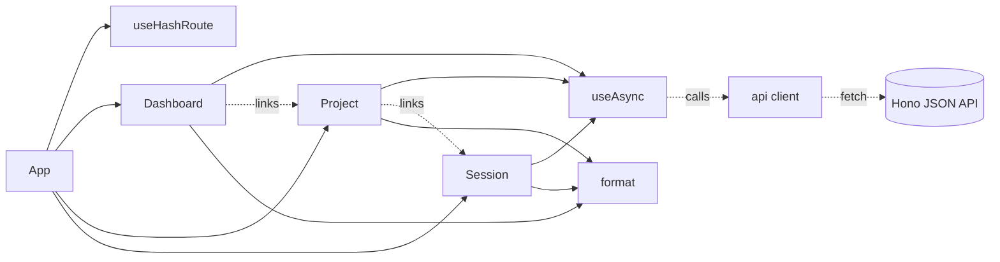
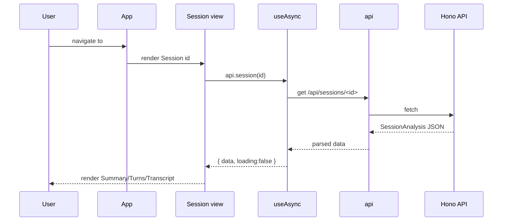

# Web SPA Frontend

> Indexed at commit `4eeed24` on 2026-07-10 · [view on GitHub](https://github.com/yorch/cc-analyzer/tree/4eeed24)

## Relevant source files

- [web/src/App.tsx](https://github.com/yorch/cc-analyzer/blob/4eeed24/web/src/App.tsx)
- [web/src/router.ts](https://github.com/yorch/cc-analyzer/blob/4eeed24/web/src/router.ts)
- [web/src/api.ts](https://github.com/yorch/cc-analyzer/blob/4eeed24/web/src/api.ts)
- [web/src/useAsync.ts](https://github.com/yorch/cc-analyzer/blob/4eeed24/web/src/useAsync.ts)
- [web/src/format.ts](https://github.com/yorch/cc-analyzer/blob/4eeed24/web/src/format.ts)
- [web/src/views/Dashboard.tsx](https://github.com/yorch/cc-analyzer/blob/4eeed24/web/src/views/Dashboard.tsx)
- [web/src/views/Project.tsx](https://github.com/yorch/cc-analyzer/blob/4eeed24/web/src/views/Project.tsx)
- [web/src/views/Session.tsx](https://github.com/yorch/cc-analyzer/blob/4eeed24/web/src/views/Session.tsx)
- [web/index.html](https://github.com/yorch/cc-analyzer/blob/4eeed24/web/index.html)
- [web/vite.config.ts](https://github.com/yorch/cc-analyzer/blob/4eeed24/web/vite.config.ts)

## Overview

The Web Single-Page Application (SPA) is the browser-facing frontend served by the `cc-analyzer serve` command. It lives under the `web/` source tree, which is distinct from `src/web/` (the Hono server that hosts it), and renders portfolio analytics for Claude Code sessions entirely client-side. The application is built with React 19 and Vite, and it consumes the server's JSON Application Programming Interface (API) through a small typed fetch client in [web/src/api.ts](https://github.com/yorch/cc-analyzer/blob/4eeed24/web/src/api.ts#L1-L140).

The public surface is a three-view application: a `Dashboard` portfolio overview, a `Project` drill-down, and a per-session `Session` detail view. Navigation between them uses a hand-rolled hash router in [web/src/router.ts](https://github.com/yorch/cc-analyzer/blob/4eeed24/web/src/router.ts#L17-L31) rather than a routing library. Vite compiles the entire application into a single self-contained HyperText Markup Language (HTML) file via `vite-plugin-singlefile`, which is then embedded into the `cc-analyzer` binary and returned by the server, per [web/vite.config.ts](https://github.com/yorch/cc-analyzer/blob/4eeed24/web/vite.config.ts#L6-L17).

Sources: [web/src/App.tsx:L1-L24](https://github.com/yorch/cc-analyzer/blob/4eeed24/web/src/App.tsx#L1-L24) [web/vite.config.ts:L1-L17](https://github.com/yorch/cc-analyzer/blob/4eeed24/web/vite.config.ts#L1-L17) [web/index.html:L1-L12](https://github.com/yorch/cc-analyzer/blob/4eeed24/web/index.html#L1-L12)

## Architecture

The `App` root reads the current route from `useHashRoute` and conditionally renders exactly one of the three view components ([web/src/App.tsx:L6-L23](https://github.com/yorch/cc-analyzer/blob/4eeed24/web/src/App.tsx#L6-L23)). Each view fetches its own data through the `useAsync` hook, which wraps the typed `api` client, and formats values for display with the helpers in `format`. The `Dashboard` links into `Project`, and `Project` links into `Session`, forming a top-down drill path expressed entirely through hash-fragment URLs.

Sources: [web/src/App.tsx:L1-L24](https://github.com/yorch/cc-analyzer/blob/4eeed24/web/src/App.tsx#L1-L24) [web/src/router.ts:L27-L31](https://github.com/yorch/cc-analyzer/blob/4eeed24/web/src/router.ts#L27-L31) [web/src/useAsync.ts:L10-L25](https://github.com/yorch/cc-analyzer/blob/4eeed24/web/src/useAsync.ts#L10-L25)

## Module Layout

| Module | Path | Responsibility |
| ------ | ---- | -------------- |
| `App` | [web/src/App.tsx](https://github.com/yorch/cc-analyzer/blob/4eeed24/web/src/App.tsx) | Root component; renders masthead and dispatches to the active view |
| `router` | [web/src/router.ts](https://github.com/yorch/cc-analyzer/blob/4eeed24/web/src/router.ts) | Hash-based route parsing, the `useHashRoute` hook, and `link` URL builders |
| `api` | [web/src/api.ts](https://github.com/yorch/cc-analyzer/blob/4eeed24/web/src/api.ts) | Typed `fetch` client and the response interfaces mirroring server output |
| `useAsync` | [web/src/useAsync.ts](https://github.com/yorch/cc-analyzer/blob/4eeed24/web/src/useAsync.ts) | Generic data-fetching hook exposing `{ data, error, loading }` |
| `format` | [web/src/format.ts](https://github.com/yorch/cc-analyzer/blob/4eeed24/web/src/format.ts) | Display helpers for currency, counts, durations, relative time, and paths |
| `Dashboard` | [web/src/views/Dashboard.tsx](https://github.com/yorch/cc-analyzer/blob/4eeed24/web/src/views/Dashboard.tsx) | Portfolio overview with month, project, model, and top-session tables |
| `Project` | [web/src/views/Project.tsx](https://github.com/yorch/cc-analyzer/blob/4eeed24/web/src/views/Project.tsx) | Per-project session list with title filtering |
| `Session` | [web/src/views/Session.tsx](https://github.com/yorch/cc-analyzer/blob/4eeed24/web/src/views/Session.tsx) | Per-session detail with Summary, Turns, and Transcript tabs |

Sources: [web/src/App.tsx:L1-L24](https://github.com/yorch/cc-analyzer/blob/4eeed24/web/src/App.tsx#L1-L24) [web/src/router.ts:L1-L31](https://github.com/yorch/cc-analyzer/blob/4eeed24/web/src/router.ts#L1-L31) [web/src/api.ts:L1-L140](https://github.com/yorch/cc-analyzer/blob/4eeed24/web/src/api.ts#L1-L140)

## Key Components

### Router

The router is a self-contained module with no external dependency. `parse` turns a location hash into a discriminated `Route` union of `dashboard`, `project`, and `session` variants, matching `#/project/<id>` and `#/session/<id>` with regular expressions and `decodeURIComponent` for the identifier ([web/src/router.ts:L3-L15](https://github.com/yorch/cc-analyzer/blob/4eeed24/web/src/router.ts#L3-L15)). The `useHashRoute` hook seeds state from `window.location.hash` and subscribes to the `hashchange` event, re-parsing on every change ([web/src/router.ts:L17-L25](https://github.com/yorch/cc-analyzer/blob/4eeed24/web/src/router.ts#L17-L25)). The exported `link` object builds encoded hash URLs so views never assemble route strings by hand ([web/src/router.ts:L27-L31](https://github.com/yorch/cc-analyzer/blob/4eeed24/web/src/router.ts#L27-L31)).

Sources: [web/src/router.ts:L1-L31](https://github.com/yorch/cc-analyzer/blob/4eeed24/web/src/router.ts#L1-L31)

### API client and `useAsync`

The `api` object exposes five endpoint methods — `stats`, `projects`, `sessions`, `session`, and `transcript` — each a thin wrapper over a shared `get<T>` helper that calls `fetch`, throws on a non-`ok` response, and casts the parsed JavaScript Object Notation (JSON) to the declared type ([web/src/api.ts:L126-L140](https://github.com/yorch/cc-analyzer/blob/4eeed24/web/src/api.ts#L126-L140)). The response interfaces such as `StatsResponse`, `IndexedSession`, `SessionAnalysis`, and `TranscriptItem` mirror the server's `core/stats`, `core/queries`, `core/analyze`, and `core/transcript` outputs ([web/src/api.ts:L1-L124](https://github.com/yorch/cc-analyzer/blob/4eeed24/web/src/api.ts#L1-L124)).

Views subscribe to these calls through `useAsync`, a minimal hook that runs an async `fn` whenever its `deps` change and tracks `data`, `error`, and `loading` in a single state object ([web/src/useAsync.ts:L10-L24](https://github.com/yorch/cc-analyzer/blob/4eeed24/web/src/useAsync.ts#L10-L24)). It guards against stale updates with a `cancelled` flag in the effect cleanup, so a superseded fetch cannot overwrite fresher state ([web/src/useAsync.ts:L12-L21](https://github.com/yorch/cc-analyzer/blob/4eeed24/web/src/useAsync.ts#L12-L21)).

Sources: [web/src/api.ts:L126-L140](https://github.com/yorch/cc-analyzer/blob/4eeed24/web/src/api.ts#L126-L140) [web/src/useAsync.ts:L1-L25](https://github.com/yorch/cc-analyzer/blob/4eeed24/web/src/useAsync.ts#L1-L25)

### Dashboard view

`Dashboard` fetches the portfolio `stats` once on mount and destructures `summary`, `byMonth`, `byProject`, `byModel`, and `top` from the response ([web/src/views/Dashboard.tsx:L8-L14](https://github.com/yorch/cc-analyzer/blob/4eeed24/web/src/views/Dashboard.tsx#L8-L14)). A hero block shows total spend, estimated-cost share, date range, and session count, followed by tables for spend by month, top projects, spend by model, and the most expensive sessions ([web/src/views/Dashboard.tsx:L26-L174](https://github.com/yorch/cc-analyzer/blob/4eeed24/web/src/views/Dashboard.tsx#L26-L174)). The month table renders an inline bar sized against `maxMonth` so relative spend is visible without a charting library ([web/src/views/Dashboard.tsx:L15-L15](https://github.com/yorch/cc-analyzer/blob/4eeed24/web/src/views/Dashboard.tsx#L15) [web/src/views/Dashboard.tsx:L77-L81](https://github.com/yorch/cc-analyzer/blob/4eeed24/web/src/views/Dashboard.tsx#L77-L81)).

A `projectQuery` state drives client-side project search: when the query is empty the table shows the first 15 projects, otherwise it filters `byProject` on a lowercased match against `projectPath` or `projectId` ([web/src/views/Dashboard.tsx:L19-L22](https://github.com/yorch/cc-analyzer/blob/4eeed24/web/src/views/Dashboard.tsx#L19-L22)). Project and session rows link into their detail views through `link.project` and `link.session` ([web/src/views/Dashboard.tsx:L113-L113](https://github.com/yorch/cc-analyzer/blob/4eeed24/web/src/views/Dashboard.tsx#L113) [web/src/views/Dashboard.tsx:L164-L164](https://github.com/yorch/cc-analyzer/blob/4eeed24/web/src/views/Dashboard.tsx#L164)).

Sources: [web/src/views/Dashboard.tsx:L1-L177](https://github.com/yorch/cc-analyzer/blob/4eeed24/web/src/views/Dashboard.tsx#L1-L177)

### Project view

`Project` takes an `id` prop and fetches the full project list and that project's sessions together with `Promise.all`, keyed on `[id]` so navigation to another project refetches ([web/src/views/Project.tsx:L7-L17](https://github.com/yorch/cc-analyzer/blob/4eeed24/web/src/views/Project.tsx#L7-L17)). It locates the matching project row for its header and applies a `query` filter over each session's title and identifier ([web/src/views/Project.tsx:L18-L22](https://github.com/yorch/cc-analyzer/blob/4eeed24/web/src/views/Project.tsx#L18-L22)). The session table shows cost, turn count, tool-call count, and a relative modified time from `relTime`, with an `est` marker on estimated costs ([web/src/views/Project.tsx:L45-L77](https://github.com/yorch/cc-analyzer/blob/4eeed24/web/src/views/Project.tsx#L45-L77)).

Sources: [web/src/views/Project.tsx:L1-L80](https://github.com/yorch/cc-analyzer/blob/4eeed24/web/src/views/Project.tsx#L1-L80)

### Session view

`Session` is the richest view. It fetches the analysis and transcript independently via two `useAsync` calls and drives a three-way `Tab` state — `summary`, `turns`, and `transcript` ([web/src/views/Session.tsx:L9-L17](https://github.com/yorch/cc-analyzer/blob/4eeed24/web/src/views/Session.tsx#L9-L17)). Four summary cards for cost, turns, tool calls, and duration render above the tab strip regardless of the active tab ([web/src/views/Session.tsx:L31-L49](https://github.com/yorch/cc-analyzer/blob/4eeed24/web/src/views/Session.tsx#L31-L49)). The `Summary` sub-component tabulates cost splits, models, web search and fetch counts, git branches, Claude Code versions, and file-touch totals, then renders per-tool tag chips ([web/src/views/Session.tsx:L70-L98](https://github.com/yorch/cc-analyzer/blob/4eeed24/web/src/views/Session.tsx#L70-L98)).

The `Turns` sub-component maintains an `open` set of expanded turn indices and toggles membership on click ([web/src/views/Session.tsx:L111-L119](https://github.com/yorch/cc-analyzer/blob/4eeed24/web/src/views/Session.tsx#L111-L119)). Each turn header shows its cost, API-call count, and tool-count summary; expanding a turn reveals each API call's model and cost plus color-coded tool-call chips, where an errored call carries an `err` class and a `✗` mark ([web/src/views/Session.tsx:L123-L166](https://github.com/yorch/cc-analyzer/blob/4eeed24/web/src/views/Session.tsx#L123-L166)). The `Transcript` sub-component is a windowed reader that initially shows `TRANSCRIPT_WINDOW` (200) items and grows the `visible` count by 200 or jumps to the full length via "Show more" and "Show all" buttons ([web/src/views/Session.tsx:L171-L202](https://github.com/yorch/cc-analyzer/blob/4eeed24/web/src/views/Session.tsx#L171-L202)). Each transcript item is styled by a `k-<kind>` class for color coding and flags errors inline ([web/src/views/Session.tsx:L182-L190](https://github.com/yorch/cc-analyzer/blob/4eeed24/web/src/views/Session.tsx#L182-L190)).

Sources: [web/src/views/Session.tsx:L1-L203](https://github.com/yorch/cc-analyzer/blob/4eeed24/web/src/views/Session.tsx#L1-L203)

### Format helpers

`format` centralizes all display formatting so views stay declarative. `usd` chooses between four-decimal, two-decimal, and thousands-grouped currency strings based on magnitude ([web/src/format.ts:L1-L6](https://github.com/yorch/cc-analyzer/blob/4eeed24/web/src/format.ts#L1-L6)), and `count` abbreviates large integers with `k`, `M`, and `B` suffixes ([web/src/format.ts:L8-L13](https://github.com/yorch/cc-analyzer/blob/4eeed24/web/src/format.ts#L8-L13)). `duration`, `relTime`, and `shortPath` render millisecond durations, ago-style timestamps, and truncated project paths respectively ([web/src/format.ts:L15-L41](https://github.com/yorch/cc-analyzer/blob/4eeed24/web/src/format.ts#L15-L41)).

Sources: [web/src/format.ts:L1-L41](https://github.com/yorch/cc-analyzer/blob/4eeed24/web/src/format.ts#L1-L41)

## Data Flow

Navigation begins when a `link`-built hash URL changes `window.location.hash`, which fires `hashchange` and updates `useHashRoute`, causing `App` to swap the rendered view ([web/src/router.ts:L17-L31](https://github.com/yorch/cc-analyzer/blob/4eeed24/web/src/router.ts#L17-L31) [web/src/App.tsx:L19-L21](https://github.com/yorch/cc-analyzer/blob/4eeed24/web/src/App.tsx#L19-L21)). The mounted view calls `useAsync`, which invokes an `api` method, receives typed JSON from the Hono server, and returns `loading`, `error`, or `data` for the view to render ([web/src/useAsync.ts:L10-L24](https://github.com/yorch/cc-analyzer/blob/4eeed24/web/src/useAsync.ts#L10-L24) [web/src/api.ts:L132-L140](https://github.com/yorch/cc-analyzer/blob/4eeed24/web/src/api.ts#L132-L140)).

Sources: [web/src/router.ts:L17-L31](https://github.com/yorch/cc-analyzer/blob/4eeed24/web/src/router.ts#L17-L31) [web/src/useAsync.ts:L10-L24](https://github.com/yorch/cc-analyzer/blob/4eeed24/web/src/useAsync.ts#L10-L24) [web/src/api.ts:L132-L140](https://github.com/yorch/cc-analyzer/blob/4eeed24/web/src/api.ts#L132-L140)

## Build & Packaging

Vite is configured to build the SPA into a single self-contained HTML file. The config sets the `web/` directory as `root`, uses a relative `base`, and applies both `@vitejs/plugin-react` and `viteSingleFile` so all JavaScript and CSS are inlined into one `dist/` artifact ([web/vite.config.ts:L8-L17](https://github.com/yorch/cc-analyzer/blob/4eeed24/web/vite.config.ts#L8-L17)). The comment in the config states this artifact is embedded in the `cc-analyzer` binary as one string and served by Hono ([web/vite.config.ts:L6-L7](https://github.com/yorch/cc-analyzer/blob/4eeed24/web/vite.config.ts#L6-L7)). The development entry point is [web/index.html](https://github.com/yorch/cc-analyzer/blob/4eeed24/web/index.html#L8-L11), which mounts the app into a `#root` div and loads `/src/main.tsx` as a module.

Sources: [web/vite.config.ts:L1-L17](https://github.com/yorch/cc-analyzer/blob/4eeed24/web/vite.config.ts#L1-L17) [web/index.html:L1-L12](https://github.com/yorch/cc-analyzer/blob/4eeed24/web/index.html#L1-L12)

## Related Pages

- Parent: [Web Server and API](./5-web-server-and-api.md)
- Sibling: [Core Analysis Engine](./2-core-analysis-engine.md)
- Sibling: [CLI](./3-cli.md)
- Sibling: [TUI](./4-tui.md)
