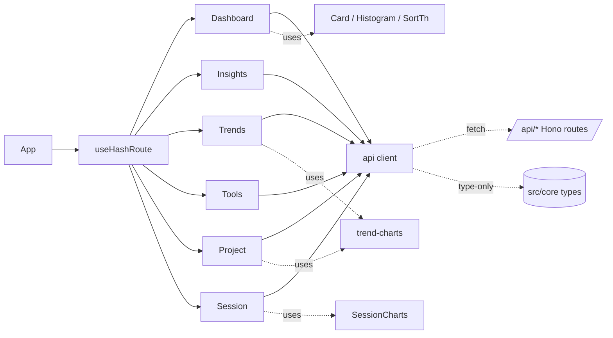

# Web SPA Frontend

> Indexed at commit `51ccd4e` on 2026-07-23 · [view on GitHub](https://github.com/yorch/cc-analyzer/tree/51ccd4e)

## Relevant source files

- [web/src/App.tsx](https://github.com/yorch/cc-analyzer/blob/51ccd4e/web/src/App.tsx)
- [web/src/router.ts](https://github.com/yorch/cc-analyzer/blob/51ccd4e/web/src/router.ts)
- [web/src/api.ts](https://github.com/yorch/cc-analyzer/blob/51ccd4e/web/src/api.ts)
- [web/src/useAsync.ts](https://github.com/yorch/cc-analyzer/blob/51ccd4e/web/src/useAsync.ts)
- [web/src/useSort.ts](https://github.com/yorch/cc-analyzer/blob/51ccd4e/web/src/useSort.ts)
- [web/src/SortTh.tsx](https://github.com/yorch/cc-analyzer/blob/51ccd4e/web/src/SortTh.tsx)
- [web/src/format.ts](https://github.com/yorch/cc-analyzer/blob/51ccd4e/web/src/format.ts)
- [web/src/Card.tsx](https://github.com/yorch/cc-analyzer/blob/51ccd4e/web/src/Card.tsx)
- [web/src/Seg.tsx](https://github.com/yorch/cc-analyzer/blob/51ccd4e/web/src/Seg.tsx)
- [web/src/Histogram.tsx](https://github.com/yorch/cc-analyzer/blob/51ccd4e/web/src/Histogram.tsx)
- [web/src/SessionCharts.tsx](https://github.com/yorch/cc-analyzer/blob/51ccd4e/web/src/SessionCharts.tsx)
- [web/src/trend-charts.tsx](https://github.com/yorch/cc-analyzer/blob/51ccd4e/web/src/trend-charts.tsx)
- [web/src/views/Dashboard.tsx](https://github.com/yorch/cc-analyzer/blob/51ccd4e/web/src/views/Dashboard.tsx)
- [web/src/views/Project.tsx](https://github.com/yorch/cc-analyzer/blob/51ccd4e/web/src/views/Project.tsx)
- [web/src/views/Session.tsx](https://github.com/yorch/cc-analyzer/blob/51ccd4e/web/src/views/Session.tsx)
- [web/src/views/Insights.tsx](https://github.com/yorch/cc-analyzer/blob/51ccd4e/web/src/views/Insights.tsx)
- [web/src/views/Trends.tsx](https://github.com/yorch/cc-analyzer/blob/51ccd4e/web/src/views/Trends.tsx)
- [web/src/views/Tools.tsx](https://github.com/yorch/cc-analyzer/blob/51ccd4e/web/src/views/Tools.tsx)
- [web/vite.config.ts](https://github.com/yorch/cc-analyzer/blob/51ccd4e/web/vite.config.ts)

## Overview

The Web Single-Page Application (SPA) is the browser frontend served by `cc-analyzer serve`. It is a React 19 application that lives entirely under the `web/` tree, kept separate from the Hono server code under `src/web/`. It renders the same portfolio analytics the terminal user interface (TUI) shows, reading everything over a small typed JSON API and drawing every chart with hand-built inline Scalable Vector Graphics (SVG) — no charting library.

The SPA has no build-time coupling to a backend URL: it fetches from same-origin `/api/*` routes through the `api` client in [web/src/api.ts](https://github.com/yorch/cc-analyzer/blob/51ccd4e/web/src/api.ts). Its response types are imported type-only from `src/core/`, so the client cannot drift from the server's shapes ([web/src/api.ts#L7-L46](https://github.com/yorch/cc-analyzer/blob/51ccd4e/web/src/api.ts#L7-L46)). Vite bundles the whole app — HTML, CSS, and JavaScript — into one self-contained file that the release binary embeds and serves ([web/vite.config.ts#L1-L17](https://github.com/yorch/cc-analyzer/blob/51ccd4e/web/vite.config.ts#L1-L17)).

## Architecture

`App` reads the current route from `useHashRoute` and renders exactly one view component ([web/src/App.tsx#L9-L45](https://github.com/yorch/cc-analyzer/blob/51ccd4e/web/src/App.tsx#L9-L45)). Every view fetches its own data through the shared `api` client and composes presentational primitives (`Card`, `Histogram`, `SortTh`) and SVG chart modules (`trend-charts`, `SessionCharts`). The `api` client is the single boundary to the backend; its type imports point at `src/core/`, documented on the Analytics and Insights page.

## Module Layout

| Module | Path | Responsibility |
| ------ | ---- | -------------- |
| `App` | [web/src/App.tsx](https://github.com/yorch/cc-analyzer/blob/51ccd4e/web/src/App.tsx) | Masthead, navigation, route-to-view switch |
| `router` | [web/src/router.ts](https://github.com/yorch/cc-analyzer/blob/51ccd4e/web/src/router.ts) | Hash-route parsing, `useHashRoute`, `link` builders |
| `api` | [web/src/api.ts](https://github.com/yorch/cc-analyzer/blob/51ccd4e/web/src/api.ts) | Typed `fetch` client and response envelope types |
| `useAsync` | [web/src/useAsync.ts](https://github.com/yorch/cc-analyzer/blob/51ccd4e/web/src/useAsync.ts) | Minimal data-fetching hook |
| `useSort` / `SortTh` | [web/src/useSort.ts](https://github.com/yorch/cc-analyzer/blob/51ccd4e/web/src/useSort.ts) | Client-side table sort state + clickable headers |
| `format` | [web/src/format.ts](https://github.com/yorch/cc-analyzer/blob/51ccd4e/web/src/format.ts) | Money, token, duration, path formatting |
| `Card` / `Seg` / `Histogram` | [web/src/Card.tsx](https://github.com/yorch/cc-analyzer/blob/51ccd4e/web/src/Card.tsx) | Stat card, segmented control, bar histogram |
| `trend-charts` | [web/src/trend-charts.tsx](https://github.com/yorch/cc-analyzer/blob/51ccd4e/web/src/trend-charts.tsx) | Shared SVG geometry, burn/model-mix/scatter panels |
| `SessionCharts` | [web/src/SessionCharts.tsx](https://github.com/yorch/cc-analyzer/blob/51ccd4e/web/src/SessionCharts.tsx) | Per-session context, cost, and per-turn charts |
| views | [web/src/views/](https://github.com/yorch/cc-analyzer/blob/51ccd4e/web/src/views/Dashboard.tsx) | Dashboard, Project, Session, Insights, Trends, Tools |

Sources: [web/src/App.tsx#L1-L46](https://github.com/yorch/cc-analyzer/blob/51ccd4e/web/src/App.tsx#L1-L46) [web/src/api.ts#L108-L133](https://github.com/yorch/cc-analyzer/blob/51ccd4e/web/src/api.ts#L108-L133)

## Routing and shell

Routing is client-side and hash-based. `parse()` turns `window.location.hash` into a discriminated `Route` union covering `dashboard`, `insights`, `insightsProject`, `trends`, `tools`, `project`, and `session`, extracting the id segment with `decodeURIComponent` for the parameterized routes ([web/src/router.ts#L3-L25](https://github.com/yorch/cc-analyzer/blob/51ccd4e/web/src/router.ts#L3-L25)). `useHashRoute` seeds state from the initial hash and subscribes to the `hashchange` event, re-parsing on every navigation ([web/src/router.ts#L27-L35](https://github.com/yorch/cc-analyzer/blob/51ccd4e/web/src/router.ts#L27-L35)). The `link` object centralizes URL construction so views never hand-build hashes, encoding ids symmetrically with `encodeURIComponent` ([web/src/router.ts#L37-L45](https://github.com/yorch/cc-analyzer/blob/51ccd4e/web/src/router.ts#L37-L45)).

`App` renders a fixed masthead with a brand link and a four-item nav — Dashboard, Insights, Trends, Tools — marking the active tab by comparing `route.name`, and treats both `insights` and `insightsProject` as the Insights tab ([web/src/App.tsx#L11-L36](https://github.com/yorch/cc-analyzer/blob/51ccd4e/web/src/App.tsx#L11-L36)). Below the header it conditionally mounts the one matching view, passing `route.id` to `Project`, `Session`, and `InsightsProject` ([web/src/App.tsx#L37-L44](https://github.com/yorch/cc-analyzer/blob/51ccd4e/web/src/App.tsx#L37-L44)).

Sources: [web/src/router.ts#L1-L45](https://github.com/yorch/cc-analyzer/blob/51ccd4e/web/src/router.ts#L1-L45) [web/src/App.tsx#L9-L45](https://github.com/yorch/cc-analyzer/blob/51ccd4e/web/src/App.tsx#L9-L45)

## Data layer

The `api` object is a flat map of endpoint functions, each delegating to a generic `get<T>` helper that throws on a non-`ok` response so `useAsync` can surface the status in an error banner ([web/src/api.ts#L108-L133](https://github.com/yorch/cc-analyzer/blob/51ccd4e/web/src/api.ts#L108-L133)). Response envelope types such as `InsightsResponse`, `TrendsResponse`, and `AnalyticsResponse` are declared here, while the leaf row shapes are imported type-only from `src/core/stats-types.ts` and erased at build time ([web/src/api.ts#L7-L106](https://github.com/yorch/cc-analyzer/blob/51ccd4e/web/src/api.ts#L7-L106)). The client re-exports `chart-series.ts` at runtime — a bun-free core module — so the SPA computes chart geometry from the identical numbers the TUI renders ([web/src/api.ts#L40-L45](https://github.com/yorch/cc-analyzer/blob/51ccd4e/web/src/api.ts#L40-L45)); this shared-series boundary is covered on the Analytics and Insights page.

`useAsync` is the only fetching primitive: it re-runs `fn` whenever `deps` change, tracks `{ data, error, loading }`, and guards against setting state after unmount with a `cancelled` flag ([web/src/useAsync.ts#L10-L25](https://github.com/yorch/cc-analyzer/blob/51ccd4e/web/src/useAsync.ts#L10-L25)). Sorting is equally small: `useSort` holds a `key`/`dir` pair, sorts a copy of the rows through a caller-supplied accessor map, and toggles descending-first on header clicks ([web/src/useSort.ts#L22-L42](https://github.com/yorch/cc-analyzer/blob/51ccd4e/web/src/useSort.ts#L22-L42)). `SortTh` is the clickable `<th>` that drives a `useSort` instance and reflects direction in an `aria-sort` attribute and a ▲/▼ arrow ([web/src/SortTh.tsx#L4-L27](https://github.com/yorch/cc-analyzer/blob/51ccd4e/web/src/SortTh.tsx#L4-L27)).

`format.ts` holds every display helper: `usd` with magnitude-adaptive precision, `count` with k/M/B suffixes, `tokens`/`tokensOf` for the "213M +52B cache" token label, plus `duration`, `relTime`, and `shortPath` ([web/src/format.ts#L1-L55](https://github.com/yorch/cc-analyzer/blob/51ccd4e/web/src/format.ts#L1-L55)).

Sources: [web/src/api.ts#L1-L133](https://github.com/yorch/cc-analyzer/blob/51ccd4e/web/src/api.ts#L1-L133) [web/src/useAsync.ts#L1-L25](https://github.com/yorch/cc-analyzer/blob/51ccd4e/web/src/useAsync.ts#L1-L25) [web/src/useSort.ts#L1-L42](https://github.com/yorch/cc-analyzer/blob/51ccd4e/web/src/useSort.ts#L1-L42) [web/src/format.ts#L1-L55](https://github.com/yorch/cc-analyzer/blob/51ccd4e/web/src/format.ts#L1-L55)

## Views

### Dashboard

`Dashboard` is the portfolio overview at `#/`. It fetches `/api/stats` once and renders a hero panel of total spend, a `StatCards` row of headline metrics (time with Claude, session-length percentiles, streaks, month-end forecast, subagent spend), and a cost-distribution histogram ([web/src/views/Dashboard.tsx#L45-L117](https://github.com/yorch/cc-analyzer/blob/51ccd4e/web/src/views/Dashboard.tsx#L45-L117)). Four sortable tables follow — spend by month, top projects, spend by model, and most expensive sessions — each wired to its own `useSort` accessor map and `SortTh` headers ([web/src/views/Dashboard.tsx#L20-L59](https://github.com/yorch/cc-analyzer/blob/51ccd4e/web/src/views/Dashboard.tsx#L20-L59)). A `GlobalSearch` component debounces to a two-character minimum and calls `/api/sessions/search`, linking each hit to its session ([web/src/views/Dashboard.tsx#L347-L413](https://github.com/yorch/cc-analyzer/blob/51ccd4e/web/src/views/Dashboard.tsx#L347-L413)).

Sources: [web/src/views/Dashboard.tsx#L45-L326](https://github.com/yorch/cc-analyzer/blob/51ccd4e/web/src/views/Dashboard.tsx#L45-L326)

### Project

`Project` drills into one project, fetching its row, session list, hot files, and trends in a single `Promise.all` keyed on the project id ([web/src/views/Project.tsx#L27-L43](https://github.com/yorch/cc-analyzer/blob/51ccd4e/web/src/views/Project.tsx#L27-L43)). The session table is filterable by title and sortable across cost, tokens, turns, tools, and modified time, defaulting to most-recently-modified ([web/src/views/Project.tsx#L18-L39](https://github.com/yorch/cc-analyzer/blob/51ccd4e/web/src/views/Project.tsx#L18-L39)). When trends exist it renders a `BurnPanel`, a cost-distribution histogram, a turn-depth histogram, a tool-mix histogram, a `ModelMix` band chart, and a `ScatterPanel`, then a "hot files" table of paths Claude repeatedly edits ([web/src/views/Project.tsx#L64-L156](https://github.com/yorch/cc-analyzer/blob/51ccd4e/web/src/views/Project.tsx#L64-L156)).

Sources: [web/src/views/Project.tsx#L27-L236](https://github.com/yorch/cc-analyzer/blob/51ccd4e/web/src/views/Project.tsx#L27-L236)

### Session

`Session` is the deepest view, a five-tab reader over one `SessionAnalysis`: `summary`, `charts`, `timeline`, `turns`, and `transcript` ([web/src/views/Session.tsx#L16-L96](https://github.com/yorch/cc-analyzer/blob/51ccd4e/web/src/views/Session.tsx#L16-L96)). The transcript is fetched lazily — an effect latches `transcriptWanted` the first time the transcript tab is reached so the potentially huge payload is never fetched eagerly, yet a second visit does not refetch ([web/src/views/Session.tsx#L19-L32](https://github.com/yorch/cc-analyzer/blob/51ccd4e/web/src/views/Session.tsx#L19-L32)). The `Summary` tab is a facts table plus tool, skill, and subagent tags ([web/src/views/Session.tsx#L98-L169](https://github.com/yorch/cc-analyzer/blob/51ccd4e/web/src/views/Session.tsx#L98-L169)).

The `Turns` tab lists every turn and expands one on click into its API calls, each broken into per-call `StepRow` entries; a `StepRow` is itself expandable into the tool input and result, with per-kind icons ([web/src/views/Session.tsx#L305-L422](https://github.com/yorch/cc-analyzer/blob/51ccd4e/web/src/views/Session.tsx#L305-L422)). Long lists are paged through the shared `useWindowed` hook, which reveals items in fixed-size chunks with "Show more" / "Show all" controls — used by `Timeline` (window 200), `Turns` (window 100), and `Transcript` (window 200) ([web/src/views/Session.tsx#L288-L303](https://github.com/yorch/cc-analyzer/blob/51ccd4e/web/src/views/Session.tsx#L288-L303)). The `Timeline` tab is a per-turn Gantt whose geometry is parsed once via `useMemo`, since huge sessions carry tens of thousands of API-call dots ([web/src/views/Session.tsx#L194-L282](https://github.com/yorch/cc-analyzer/blob/51ccd4e/web/src/views/Session.tsx#L194-L282)). The `charts` tab renders `SessionCharts`.

Sources: [web/src/views/Session.tsx#L18-L456](https://github.com/yorch/cc-analyzer/blob/51ccd4e/web/src/views/Session.tsx#L18-L456)

### Insights, Trends, and Tools

`Insights` ranks projects by cache-write dollars that were never read back — the un-amortized "waste" — with a read:write ratio and a `Verdict` badge derived from `cacheVerdict` ([web/src/views/Insights.tsx#L15-L107](https://github.com/yorch/cc-analyzer/blob/51ccd4e/web/src/views/Insights.tsx#L15-L107)). A collapsible `IdleBuckets` panel correlates idle share against cache waste, and `InsightsProject` drills the same ranking down to a project's individual sessions ([web/src/views/Insights.tsx#L111-L227](https://github.com/yorch/cc-analyzer/blob/51ccd4e/web/src/views/Insights.tsx#L111-L227)). `Trends` is a stack of time-series panels — burn, a 53-week contribution `Calendar`, `ModelMix`, an hour-by-weekday `Heatmap`, the cost×duration `ScatterPanel`, weekly tool-error rate, subagent share, and parallel-session concurrency — several toggled between cost and session metrics with `Seg` controls ([web/src/views/Trends.tsx#L176-L258](https://github.com/yorch/cc-analyzer/blob/51ccd4e/web/src/views/Trends.tsx#L176-L258)). `Tools` fetches `/api/analytics` and renders sortable tables for tools, shell commands, skills, subagents, permission modes, stop reasons, versions, and branches, plus reliability, turn-depth, and compaction rollups; the skills table pairs a selected row with a weekly-invocation `SkillSpark` sparkline ([web/src/views/Tools.tsx#L42-L129](https://github.com/yorch/cc-analyzer/blob/51ccd4e/web/src/views/Tools.tsx#L42-L129)).

Sources: [web/src/views/Insights.tsx#L29-L227](https://github.com/yorch/cc-analyzer/blob/51ccd4e/web/src/views/Insights.tsx#L29-L227) [web/src/views/Trends.tsx#L27-L258](https://github.com/yorch/cc-analyzer/blob/51ccd4e/web/src/views/Trends.tsx#L27-L258) [web/src/views/Tools.tsx#L344-L456](https://github.com/yorch/cc-analyzer/blob/51ccd4e/web/src/views/Tools.tsx#L344-L456)

## Chart and UI primitives

Charts are drawn as inline SVG with no external library. `trend-charts.tsx` owns the shared geometry: a fixed `CHART_W` of 900, `CHART_PAD` of 6, an `xScale` closure, and `linePath`/`areaPath` builders that emit SVG `d` strings, plus a `MAX_LINE_DOTS` cap of 366 above which hover dots are suppressed so the raw path stands alone ([web/src/trend-charts.tsx#L23-L49](https://github.com/yorch/cc-analyzer/blob/51ccd4e/web/src/trend-charts.tsx#L23-L49)). It exports the reusable `LineChart`, the self-controlled `BurnPanel` (metric and granularity `Seg` toggles), the `ModelMix` stacked-area band chart, and the `Scatter`/`ScatterPanel` cost-versus-duration plot whose sqrt scales keep the dense cheap-and-short corner readable ([web/src/trend-charts.tsx#L51-L290](https://github.com/yorch/cc-analyzer/blob/51ccd4e/web/src/trend-charts.tsx#L51-L290)).

`SessionCharts` renders three session-scoped SVG panels from `chart-series.ts` builders memoized on the analysis ([web/src/SessionCharts.tsx#L28-L62](https://github.com/yorch/cc-analyzer/blob/51ccd4e/web/src/SessionCharts.tsx#L28-L62)). The `ContextChart` plots prompt-side tokens per main-chain API call as a filled line, overlays vertical dashed compaction markers positioned between the last pre-compaction call and the first one after, and captions the peak token count with the auto/manual/subagent/inherited compaction split from `summarizeCompactions` ([web/src/SessionCharts.tsx#L73-L149](https://github.com/yorch/cc-analyzer/blob/51ccd4e/web/src/SessionCharts.tsx#L73-L149)). `BurnChart` draws cumulative cost with an optional teal subagent line, and `TurnBars` is a per-turn bar chart toggled between cost, tokens, and calls by a `Seg` control ([web/src/SessionCharts.tsx#L151-L271](https://github.com/yorch/cc-analyzer/blob/51ccd4e/web/src/SessionCharts.tsx#L151-L271)).

The small presentational primitives are `Card` (label/value/sub stat tile), `Seg` (segmented single-choice button group), and `Histogram` (horizontal bars normalized to the fullest bucket) ([web/src/Card.tsx#L2-L10](https://github.com/yorch/cc-analyzer/blob/51ccd4e/web/src/Card.tsx#L2-L10), [web/src/Seg.tsx#L2-L25](https://github.com/yorch/cc-analyzer/blob/51ccd4e/web/src/Seg.tsx#L2-L25), [web/src/Histogram.tsx#L9-L24](https://github.com/yorch/cc-analyzer/blob/51ccd4e/web/src/Histogram.tsx#L9-L24)).

Sources: [web/src/trend-charts.tsx#L1-L290](https://github.com/yorch/cc-analyzer/blob/51ccd4e/web/src/trend-charts.tsx#L1-L290) [web/src/SessionCharts.tsx#L1-L271](https://github.com/yorch/cc-analyzer/blob/51ccd4e/web/src/SessionCharts.tsx#L1-L271)

## Build and embedding

The SPA is bundled by Vite into a single self-contained HTML file. `vite.config.ts` sets the `web/` directory as root, a relative `base`, and the `viteSingleFile` plugin, which inlines all CSS and JavaScript so the output has no external assets ([web/vite.config.ts#L8-L17](https://github.com/yorch/cc-analyzer/blob/51ccd4e/web/vite.config.ts#L8-L17)). That single HTML string is then embedded into the compiled `cc-analyzer` binary and served by the Hono backend, so the release ships the whole UI with no filesystem dependencies.

Sources: [web/vite.config.ts#L1-L17](https://github.com/yorch/cc-analyzer/blob/51ccd4e/web/vite.config.ts#L1-L17)

## Related Pages

- Parent: [Web Server and API](./5-web-server-and-api.md)
- Sibling: [Core Analysis Engine](./2-core-analysis-engine.md)
- Sibling: [CLI](./3-cli.md)
- Sibling: [TUI](./4-tui.md)
- Sibling: [Analytics and Insights](./7-analytics-and-insights.md)
