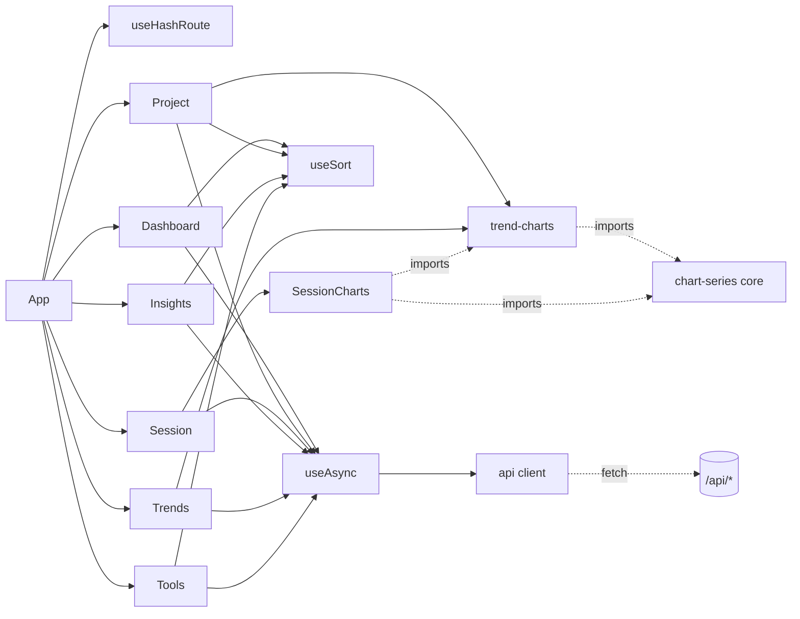
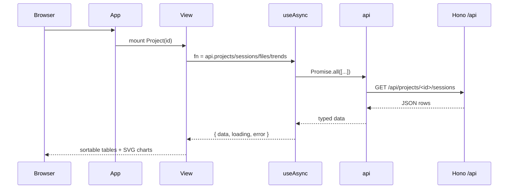

# Web SPA Frontend

> Indexed at commit `9d4dd3f` on 2026-07-23 · [view on GitHub](https://github.com/yorch/cc-analyzer/tree/9d4dd3f)

## Relevant source files

- [web/src/App.tsx](https://github.com/yorch/cc-analyzer/blob/9d4dd3f/web/src/App.tsx)
- [web/src/router.ts](https://github.com/yorch/cc-analyzer/blob/9d4dd3f/web/src/router.ts)
- [web/src/api.ts](https://github.com/yorch/cc-analyzer/blob/9d4dd3f/web/src/api.ts)
- [web/src/useAsync.ts](https://github.com/yorch/cc-analyzer/blob/9d4dd3f/web/src/useAsync.ts)
- [web/src/useSort.ts](https://github.com/yorch/cc-analyzer/blob/9d4dd3f/web/src/useSort.ts)
- [web/src/SortTh.tsx](https://github.com/yorch/cc-analyzer/blob/9d4dd3f/web/src/SortTh.tsx)
- [web/src/format.ts](https://github.com/yorch/cc-analyzer/blob/9d4dd3f/web/src/format.ts)
- [web/src/Card.tsx](https://github.com/yorch/cc-analyzer/blob/9d4dd3f/web/src/Card.tsx)
- [web/src/Seg.tsx](https://github.com/yorch/cc-analyzer/blob/9d4dd3f/web/src/Seg.tsx)
- [web/src/Histogram.tsx](https://github.com/yorch/cc-analyzer/blob/9d4dd3f/web/src/Histogram.tsx)
- [web/src/SessionCharts.tsx](https://github.com/yorch/cc-analyzer/blob/9d4dd3f/web/src/SessionCharts.tsx)
- [web/src/trend-charts.tsx](https://github.com/yorch/cc-analyzer/blob/9d4dd3f/web/src/trend-charts.tsx)
- [web/src/views/Dashboard.tsx](https://github.com/yorch/cc-analyzer/blob/9d4dd3f/web/src/views/Dashboard.tsx)
- [web/src/views/Project.tsx](https://github.com/yorch/cc-analyzer/blob/9d4dd3f/web/src/views/Project.tsx)
- [web/src/views/Session.tsx](https://github.com/yorch/cc-analyzer/blob/9d4dd3f/web/src/views/Session.tsx)
- [web/src/views/Insights.tsx](https://github.com/yorch/cc-analyzer/blob/9d4dd3f/web/src/views/Insights.tsx)
- [web/src/views/Trends.tsx](https://github.com/yorch/cc-analyzer/blob/9d4dd3f/web/src/views/Trends.tsx)
- [web/src/views/Tools.tsx](https://github.com/yorch/cc-analyzer/blob/9d4dd3f/web/src/views/Tools.tsx)
- [web/vite.config.ts](https://github.com/yorch/cc-analyzer/blob/9d4dd3f/web/vite.config.ts)

## Overview

The Web Single-Page Application (SPA) is the browser frontend that `cc-analyzer serve` ships. It is a React 19 application rooted in the `web/` tree (distinct from the `src/web/` server), built by Vite into one self-contained HTML file and embedded into the compiled binary. It renders the same portfolio, project, session, and analytics data the Terminal UI (TUI) shows, reading everything over a small typed JSON HTTP client rather than touching the SQLite index directly.

The SPA has no build-time server dependency: its type imports (`SessionAnalysis`, the `stats-types.ts` rollup shapes, `TranscriptItem`) come straight from the bun-free core modules and are erased at compile time, and its runtime chart-geometry helpers import the same `chart-series.ts` builders the TUI uses, so the two frontends chart identical numbers ([web/src/api.ts#L40-L46](https://github.com/yorch/cc-analyzer/blob/9d4dd3f/web/src/api.ts#L40-L46)). Its public surface is a hash-routed set of seven views wired together in [web/src/App.tsx](https://github.com/yorch/cc-analyzer/blob/9d4dd3f/web/src/App.tsx), each driven by a single `useAsync` fetch against the API in [web/src/api.ts#L114-L133](https://github.com/yorch/cc-analyzer/blob/9d4dd3f/web/src/api.ts#L114-L133).

## Architecture

`App` reads the current route from `useHashRoute` and mounts exactly one view. Every view fetches through `useAsync`, which calls a method on the shared `api` object; the chart views (`Project`, `Trends`, `Session`) render SVG built by geometry helpers in `trend-charts.tsx` and `SessionCharts.tsx`, both of which derive their series from the bun-free core `chart-series.ts` builders.

## Module Layout

| Module | Path | Responsibility |
| ------ | ---- | -------------- |
| `App` | [web/src/App.tsx](https://github.com/yorch/cc-analyzer/blob/9d4dd3f/web/src/App.tsx) | Masthead, nav, and route-to-view dispatch |
| `router` | [web/src/router.ts](https://github.com/yorch/cc-analyzer/blob/9d4dd3f/web/src/router.ts) | Hash-based `Route` type, `useHashRoute`, `link` builders |
| `api` | [web/src/api.ts](https://github.com/yorch/cc-analyzer/blob/9d4dd3f/web/src/api.ts) | Typed `fetch` client + response envelope types |
| `useAsync` | [web/src/useAsync.ts](https://github.com/yorch/cc-analyzer/blob/9d4dd3f/web/src/useAsync.ts) | Fetch-on-deps-change data hook |
| `useSort` / `SortTh` | [web/src/useSort.ts](https://github.com/yorch/cc-analyzer/blob/9d4dd3f/web/src/useSort.ts) | Client-side table sorting and clickable headers |
| `format` | [web/src/format.ts](https://github.com/yorch/cc-analyzer/blob/9d4dd3f/web/src/format.ts) | Currency, count, token, duration formatters |
| primitives | [web/src/Card.tsx](https://github.com/yorch/cc-analyzer/blob/9d4dd3f/web/src/Card.tsx) [web/src/Seg.tsx](https://github.com/yorch/cc-analyzer/blob/9d4dd3f/web/src/Seg.tsx) [web/src/Histogram.tsx](https://github.com/yorch/cc-analyzer/blob/9d4dd3f/web/src/Histogram.tsx) | Stat card, segmented control, bar histogram |
| charts | [web/src/trend-charts.tsx](https://github.com/yorch/cc-analyzer/blob/9d4dd3f/web/src/trend-charts.tsx) [web/src/SessionCharts.tsx](https://github.com/yorch/cc-analyzer/blob/9d4dd3f/web/src/SessionCharts.tsx) | Inline SVG line/area/scatter charts |
| views | [web/src/views/](https://github.com/yorch/cc-analyzer/blob/9d4dd3f/web/src/views/Dashboard.tsx) | The seven page components |

Sources: [web/src/App.tsx:L1-L46](https://github.com/yorch/cc-analyzer/blob/9d4dd3f/web/src/App.tsx#L1-L46) [web/src/api.ts:L1-L46](https://github.com/yorch/cc-analyzer/blob/9d4dd3f/web/src/api.ts#L1-L46)

## Key Components

### Routing and App shell

`App` renders a persistent masthead with links built from the `link` helper and highlights the active tab by comparing `route.name` ([web/src/App.tsx#L9-L45](https://github.com/yorch/cc-analyzer/blob/9d4dd3f/web/src/App.tsx#L9-L45)). Routing is hash-based: `parse()` matches the `location.hash` against a fixed set of patterns and returns a discriminated `Route` union covering `dashboard`, `insights`, `insightsProject`, `trends`, `tools`, `project`, and `session` ([web/src/router.ts#L3-L25](https://github.com/yorch/cc-analyzer/blob/9d4dd3f/web/src/router.ts#L3-L25)). `useHashRoute` seeds state from the current hash and subscribes to the `hashchange` event, so navigation is a pure client-side URL change with no history-API or server round trip ([web/src/router.ts#L27-L45](https://github.com/yorch/cc-analyzer/blob/9d4dd3f/web/src/router.ts#L27-L45)).

Sources: [web/src/router.ts:L1-L45](https://github.com/yorch/cc-analyzer/blob/9d4dd3f/web/src/router.ts#L1-L45) [web/src/App.tsx:L1-L46](https://github.com/yorch/cc-analyzer/blob/9d4dd3f/web/src/App.tsx#L1-L46)

### Data layer: api, useAsync, useSort

`api` is a flat object of methods that each call a generic `get<T>` wrapping `fetch`, throwing on non-OK responses ([web/src/api.ts#L108-L133](https://github.com/yorch/cc-analyzer/blob/9d4dd3f/web/src/api.ts#L108-L133)). Its response types re-export core shapes verbatim — `StatsResponse` is `PortfolioStats`, and `InsightsResponse`, `TrendsResponse`, and `AnalyticsResponse` compose the cache, day-row, and rollup types from `stats-types.ts` so the server and client cannot drift ([web/src/api.ts#L84-L106](https://github.com/yorch/cc-analyzer/blob/9d4dd3f/web/src/api.ts#L84-L106)). `useAsync` runs its `fn` whenever `deps` change, tracks `{ data, error, loading }`, and guards against setting state after unmount with a `cancelled` flag ([web/src/useAsync.ts#L10-L25](https://github.com/yorch/cc-analyzer/blob/9d4dd3f/web/src/useAsync.ts#L10-L25)).

`useSort` implements every sortable table: it takes rows plus an `Accessors` map, sorts a copy by the active key, and `toggle` flips direction on the active column or switches to a new one descending-first ([web/src/useSort.ts#L22-L42](https://github.com/yorch/cc-analyzer/blob/9d4dd3f/web/src/useSort.ts#L22-L42)). `SortTh` is the clickable header that drives a `useSort` instance, rendering the sort arrow and an `aria-sort` attribute ([web/src/SortTh.tsx#L4-L28](https://github.com/yorch/cc-analyzer/blob/9d4dd3f/web/src/SortTh.tsx#L4-L28)). Display formatting lives in `format.ts`: `usd`, `count` (with k/M/B suffixes), `tokens`, `duration`, `relTime`, and `shortPath` ([web/src/format.ts#L1-L55](https://github.com/yorch/cc-analyzer/blob/9d4dd3f/web/src/format.ts#L1-L55)).

Sources: [web/src/api.ts:L108-L133](https://github.com/yorch/cc-analyzer/blob/9d4dd3f/web/src/api.ts#L108-L133) [web/src/useAsync.ts:L1-L25](https://github.com/yorch/cc-analyzer/blob/9d4dd3f/web/src/useAsync.ts#L1-L25) [web/src/useSort.ts:L1-L42](https://github.com/yorch/cc-analyzer/blob/9d4dd3f/web/src/useSort.ts#L1-L42) [web/src/format.ts:L1-L55](https://github.com/yorch/cc-analyzer/blob/9d4dd3f/web/src/format.ts#L1-L55)

### Dashboard

`Dashboard` is the portfolio overview. It fetches `api.stats()` once and renders a hero spend figure, a `StatCards` band of headline metrics (time with Claude, session-length percentiles, cost percentiles, streaks, month projection, subagent spend), and a per-session cost `Distribution` histogram ([web/src/views/Dashboard.tsx#L45-L118](https://github.com/yorch/cc-analyzer/blob/9d4dd3f/web/src/views/Dashboard.tsx#L45-L118)). Below the hero come sortable tables for spend by month, top projects, spend by model, and the most expensive sessions, each wired to its own `useSort` over an `Accessors` map ([web/src/views/Dashboard.tsx#L20-L59](https://github.com/yorch/cc-analyzer/blob/9d4dd3f/web/src/views/Dashboard.tsx#L20-L59)). `GlobalSearch` debounces a two-character-minimum query against `api.searchSessions` and lists matching sessions across projects ([web/src/views/Dashboard.tsx#L347-L414](https://github.com/yorch/cc-analyzer/blob/9d4dd3f/web/src/views/Dashboard.tsx#L347-L414)).

Sources: [web/src/views/Dashboard.tsx:L45-L118](https://github.com/yorch/cc-analyzer/blob/9d4dd3f/web/src/views/Dashboard.tsx#L45-L118) [web/src/views/Dashboard.tsx:L283-L414](https://github.com/yorch/cc-analyzer/blob/9d4dd3f/web/src/views/Dashboard.tsx#L283-L414)

### Project drill-down

`Project` fetches four endpoints in parallel with `Promise.all` — the project list, this project's sessions, its hot files, and its trend series — keyed on the project `id` ([web/src/views/Project.tsx#L27-L39](https://github.com/yorch/cc-analyzer/blob/9d4dd3f/web/src/views/Project.tsx#L27-L39)). It renders a filterable, sortable session table, then a `BurnPanel`, cost-distribution and turn-depth histograms, a tool-mix histogram, a `ModelMix` stacked area, and a `ScatterPanel`, followed by a "hot files" table of paths Claude repeatedly edits ([web/src/views/Project.tsx#L64-L156](https://github.com/yorch/cc-analyzer/blob/9d4dd3f/web/src/views/Project.tsx#L64-L156)). The chart components are the same ones the Trends page uses, so a project's spend chart matches the portfolio-wide one in shape.

Sources: [web/src/views/Project.tsx:L27-L156](https://github.com/yorch/cc-analyzer/blob/9d4dd3f/web/src/views/Project.tsx#L27-L156)

### Session detail

`Session` is the deepest view. It fetches `api.session(id)` for the analysis and lazily fetches the transcript only after the transcript tab is first opened, latching a `transcriptWanted` flag in an effect so any route to that tab triggers the one-time load ([web/src/views/Session.tsx#L18-L32](https://github.com/yorch/cc-analyzer/blob/9d4dd3f/web/src/views/Session.tsx#L18-L32)). Five tabs — `summary`, `charts`, `timeline`, `turns`, `transcript` — sit above a `Card` band of cost, tokens, turns, tool calls, duration, and subagent totals ([web/src/views/Session.tsx#L51-L96](https://github.com/yorch/cc-analyzer/blob/9d4dd3f/web/src/views/Session.tsx#L51-L96)). The `Turns` tab renders one collapsible header per turn that expands into per-`ApiCall` blocks, each listing `TurnStep` rows whose `StepRow` further expands into input/result detail panes ([web/src/views/Session.tsx#L305-L407](https://github.com/yorch/cc-analyzer/blob/9d4dd3f/web/src/views/Session.tsx#L305-L407)).

Long lists are windowed by `useWindowed`, which reveals rows in fixed chunks with "Show more" / "Show all" controls so a session with tens of thousands of API calls does not render at once ([web/src/views/Session.tsx#L288-L303](https://github.com/yorch/cc-analyzer/blob/9d4dd3f/web/src/views/Session.tsx#L288-L303)). The `Timeline` tab parses each turn's timestamps once via `useMemo` and draws a per-turn Gantt lane of API-call dots, and the `Transcript` tab renders the windowed `TranscriptItem[]` as labelled `pre` blocks ([web/src/views/Session.tsx#L194-L282](https://github.com/yorch/cc-analyzer/blob/9d4dd3f/web/src/views/Session.tsx#L194-L282), [web/src/views/Session.tsx#L426-L456](https://github.com/yorch/cc-analyzer/blob/9d4dd3f/web/src/views/Session.tsx#L426-L456)).

Sources: [web/src/views/Session.tsx:L18-L96](https://github.com/yorch/cc-analyzer/blob/9d4dd3f/web/src/views/Session.tsx#L18-L96) [web/src/views/Session.tsx:L194-L456](https://github.com/yorch/cc-analyzer/blob/9d4dd3f/web/src/views/Session.tsx#L194-L456)

### Analytics views: Insights, Trends, Tools

`Insights` ranks projects by cache-write dollars that were never read back, rendering a `Verdict` badge from `cacheVerdict(ratio)`, a write-TTL mix line, and an idle-time-versus-cache-waste correlation panel ([web/src/views/Insights.tsx#L29-L107](https://github.com/yorch/cc-analyzer/blob/9d4dd3f/web/src/views/Insights.tsx#L29-L107)). `InsightsProject` drills into one project's per-session cache rows ([web/src/views/Insights.tsx#L154-L227](https://github.com/yorch/cc-analyzer/blob/9d4dd3f/web/src/views/Insights.tsx#L154-L227)). `Trends` is time-series: a `BurnPanel`, a contribution `Calendar`, a `ModelMix` migration chart, an activity `Heatmap` keyed by weekday and hour, a `ScatterPanel`, and weekly error-rate, subagent-share, and parallel-session line charts ([web/src/views/Trends.tsx#L176-L258](https://github.com/yorch/cc-analyzer/blob/9d4dd3f/web/src/views/Trends.tsx#L176-L258)).

`Tools` fetches `api.analytics()` and renders sortable tables for tools, shell commands, skills, subagents, permission modes, stop reasons, Claude Code versions, and git branches, plus reliability and compaction rollups ([web/src/views/Tools.tsx#L344-L456](https://github.com/yorch/cc-analyzer/blob/9d4dd3f/web/src/views/Tools.tsx#L344-L456)). Its `SkillsTable` links a selected row to a `SkillDetail` panel with a per-week invocation sparkline built from the shared SVG helpers ([web/src/views/Tools.tsx#L42-L129](https://github.com/yorch/cc-analyzer/blob/9d4dd3f/web/src/views/Tools.tsx#L42-L129)). The metric definitions and series builders behind all of these are documented on the analytics page — see Related Pages.

Sources: [web/src/views/Insights.tsx:L29-L227](https://github.com/yorch/cc-analyzer/blob/9d4dd3f/web/src/views/Insights.tsx#L29-L227) [web/src/views/Trends.tsx:L176-L258](https://github.com/yorch/cc-analyzer/blob/9d4dd3f/web/src/views/Trends.tsx#L176-L258) [web/src/views/Tools.tsx:L344-L456](https://github.com/yorch/cc-analyzer/blob/9d4dd3f/web/src/views/Tools.tsx#L344-L456)

### Chart and UI primitives

Charts are hand-rolled inline SVG, not a charting library. `trend-charts.tsx` exports the shared geometry — a fixed `CHART_W` of 900, an `xScale`, `linePath`, and `areaPath` — plus the reusable `LineChart`, the metric/granularity-toggling `BurnPanel`, the `ModelMix` stacked-area band builder, and the sqrt-scaled `Scatter`/`ScatterPanel` ([web/src/trend-charts.tsx#L21-L97](https://github.com/yorch/cc-analyzer/blob/9d4dd3f/web/src/trend-charts.tsx#L21-L97), [web/src/trend-charts.tsx#L101-L290](https://github.com/yorch/cc-analyzer/blob/9d4dd3f/web/src/trend-charts.tsx#L101-L290)). `SessionCharts` reuses that geometry for session-scoped context-window, cumulative-cost, and per-turn bar charts, computing its series with `buildContextSeries`, `buildBurnSeries`, and `buildTurnSeries` from core ([web/src/SessionCharts.tsx#L28-L62](https://github.com/yorch/cc-analyzer/blob/9d4dd3f/web/src/SessionCharts.tsx#L28-L62)). Past `MAX_LINE_DOTS` points the hover dots are dropped and the path stands alone ([web/src/trend-charts.tsx#L26-L27](https://github.com/yorch/cc-analyzer/blob/9d4dd3f/web/src/trend-charts.tsx#L26-L27)).

The small primitives are `Card` (label/value/sub stat block), `Seg` (a segmented button control used for every metric toggle), and `Histogram` (a horizontal bar chart normalized to the fullest bucket) ([web/src/Card.tsx#L2-L10](https://github.com/yorch/cc-analyzer/blob/9d4dd3f/web/src/Card.tsx#L2-L10), [web/src/Seg.tsx#L2-L25](https://github.com/yorch/cc-analyzer/blob/9d4dd3f/web/src/Seg.tsx#L2-L25), [web/src/Histogram.tsx#L9-L24](https://github.com/yorch/cc-analyzer/blob/9d4dd3f/web/src/Histogram.tsx#L9-L24)).

Sources: [web/src/trend-charts.tsx:L21-L290](https://github.com/yorch/cc-analyzer/blob/9d4dd3f/web/src/trend-charts.tsx#L21-L290) [web/src/SessionCharts.tsx:L28-L62](https://github.com/yorch/cc-analyzer/blob/9d4dd3f/web/src/SessionCharts.tsx#L28-L62) [web/src/Card.tsx:L1-L10](https://github.com/yorch/cc-analyzer/blob/9d4dd3f/web/src/Card.tsx#L1-L10) [web/src/Seg.tsx:L1-L25](https://github.com/yorch/cc-analyzer/blob/9d4dd3f/web/src/Seg.tsx#L1-L25) [web/src/Histogram.tsx:L1-L24](https://github.com/yorch/cc-analyzer/blob/9d4dd3f/web/src/Histogram.tsx#L1-L24)

## Data Flow

A hash change updates the route, `App` mounts the matching view, and the view's `useAsync` fires its `api` call(s) keyed on route params. The client throws on any non-OK status, which `useAsync` catches into `error` and each view renders as an error banner ([web/src/api.ts#L108-L112](https://github.com/yorch/cc-analyzer/blob/9d4dd3f/web/src/api.ts#L108-L112), [web/src/useAsync.ts#L12-L24](https://github.com/yorch/cc-analyzer/blob/9d4dd3f/web/src/useAsync.ts#L12-L24)). All sorting, filtering, and windowing then happen entirely client-side over the already-fetched data.

Sources: [web/src/api.ts:L108-L133](https://github.com/yorch/cc-analyzer/blob/9d4dd3f/web/src/api.ts#L108-L133) [web/src/useAsync.ts:L1-L25](https://github.com/yorch/cc-analyzer/blob/9d4dd3f/web/src/useAsync.ts#L1-L25) [web/src/views/Project.tsx:L27-L45](https://github.com/yorch/cc-analyzer/blob/9d4dd3f/web/src/views/Project.tsx#L27-L45)

## Build

Vite builds the SPA with `@vitejs/plugin-react` and `vite-plugin-singlefile`, inlining every asset into one self-contained HTML file so the output can be embedded in the `cc-analyzer` binary as a single string and served by Hono ([web/vite.config.ts#L1-L17](https://github.com/yorch/cc-analyzer/blob/9d4dd3f/web/vite.config.ts#L1-L17)). The `base` is set to `./` and the `chunkSizeWarningLimit` is raised to 4000 because the singlefile output is one large bundle by design. The embedding step and the generated `src/web/spa.ts` artifact belong to the server subsystem — see Related Pages.

Sources: [web/vite.config.ts:L1-L17](https://github.com/yorch/cc-analyzer/blob/9d4dd3f/web/vite.config.ts#L1-L17)

## Related Pages

- Parent: [Web Server and API](./5-web-server-and-api.md)
- Sibling: [Core Analysis Engine](./2-core-analysis-engine.md)
- Sibling: [CLI](./3-cli.md)
- Sibling: [Terminal UI](./4-tui.md)
- Sibling: [Analytics and Insights](./7-analytics-and-insights.md)
