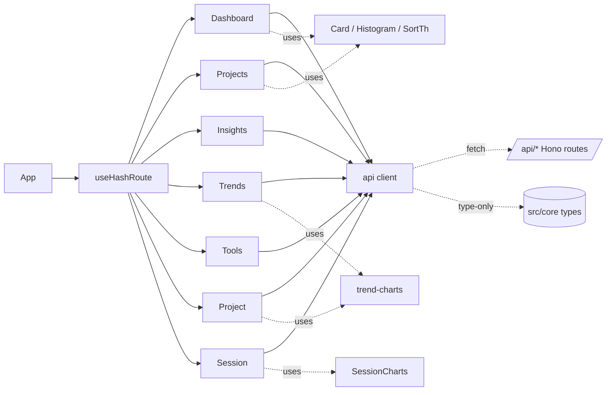

# Web SPA Frontend

> Indexed at commit `51ce1a4` on 2026-08-26 · [view on GitHub](https://github.com/yorch/cc-analyzer/tree/51ce1a4)

## Relevant source files

- [web/src/App.tsx](https://github.com/yorch/cc-analyzer/blob/51ce1a4/web/src/App.tsx)
- [web/src/router.ts](https://github.com/yorch/cc-analyzer/blob/51ce1a4/web/src/router.ts)
- [web/src/api.ts](https://github.com/yorch/cc-analyzer/blob/51ce1a4/web/src/api.ts)
- [web/src/useAsync.ts](https://github.com/yorch/cc-analyzer/blob/51ce1a4/web/src/useAsync.ts)
- [web/src/useSort.ts](https://github.com/yorch/cc-analyzer/blob/51ce1a4/web/src/useSort.ts)
- [web/src/SortTh.tsx](https://github.com/yorch/cc-analyzer/blob/51ce1a4/web/src/SortTh.tsx)
- [web/src/ViewTabs.tsx](https://github.com/yorch/cc-analyzer/blob/main/web/src/ViewTabs.tsx)
- [web/src/format.ts](https://github.com/yorch/cc-analyzer/blob/51ce1a4/web/src/format.ts)
- [web/src/Card.tsx](https://github.com/yorch/cc-analyzer/blob/51ce1a4/web/src/Card.tsx)
- [web/src/Seg.tsx](https://github.com/yorch/cc-analyzer/blob/51ce1a4/web/src/Seg.tsx)
- [web/src/Histogram.tsx](https://github.com/yorch/cc-analyzer/blob/51ce1a4/web/src/Histogram.tsx)
- [web/src/SessionCharts.tsx](https://github.com/yorch/cc-analyzer/blob/51ce1a4/web/src/SessionCharts.tsx)
- [web/src/trend-charts.tsx](https://github.com/yorch/cc-analyzer/blob/51ce1a4/web/src/trend-charts.tsx)
- [web/src/chart-hover.tsx](https://github.com/yorch/cc-analyzer/blob/main/web/src/chart-hover.tsx)
- [web/src/views/Dashboard.tsx](https://github.com/yorch/cc-analyzer/blob/51ce1a4/web/src/views/Dashboard.tsx)
- [web/src/views/Project.tsx](https://github.com/yorch/cc-analyzer/blob/51ce1a4/web/src/views/Project.tsx)
- [web/src/views/Session.tsx](https://github.com/yorch/cc-analyzer/blob/51ce1a4/web/src/views/Session.tsx)
- [web/src/views/Insights.tsx](https://github.com/yorch/cc-analyzer/blob/51ce1a4/web/src/views/Insights.tsx)
- [web/src/views/Trends.tsx](https://github.com/yorch/cc-analyzer/blob/51ce1a4/web/src/views/Trends.tsx)
- [web/src/views/Tools.tsx](https://github.com/yorch/cc-analyzer/blob/51ce1a4/web/src/views/Tools.tsx)
- [web/vite.config.ts](https://github.com/yorch/cc-analyzer/blob/51ce1a4/web/vite.config.ts)

## Overview

The Web Single-Page Application (SPA) is the browser frontend served by `cc-analyzer serve`. It is a React 19 application that lives entirely under the `web/` tree, kept separate from the Hono server code under `src/web/`. It renders the same portfolio analytics the terminal user interface (TUI) shows, reading everything over a small typed JSON API and drawing every chart with hand-built inline Scalable Vector Graphics (SVG) — no charting library.

The SPA has no build-time coupling to a backend URL: it fetches from same-origin `/api/*` routes through the `api` client in [web/src/api.ts](https://github.com/yorch/cc-analyzer/blob/51ce1a4/web/src/api.ts). Its response types are imported type-only from `src/core/`, so the client cannot drift from the server's shapes ([web/src/api.ts#L7-L46](https://github.com/yorch/cc-analyzer/blob/51ce1a4/web/src/api.ts#L7-L46)). Vite bundles the whole app — HTML, CSS, and JavaScript — into one self-contained file that the release binary embeds and serves ([web/vite.config.ts#L1-L17](https://github.com/yorch/cc-analyzer/blob/51ce1a4/web/vite.config.ts#L1-L17)).

## Architecture

```mermaid
flowchart LR
    App[App] --> Router[useHashRoute]
    Router --> Dashboard
    Router --> Projects
    Router --> Insights
    Router --> Trends
    Router --> Tools
    Router --> Project
    Router --> Session

    Dashboard --> api[api client]
    Projects --> api
    Insights --> api
    Trends --> api
    Tools --> api
    Project --> api
    Session --> api

    api -.fetch.-> Backend[/api/* Hono routes/]
    api -.type-only.-> Core[(src/core types)]

    Dashboard -.uses.-> Prim[Card / Histogram / SortTh]
    Projects -.uses.-> Prim
    Trends -.uses.-> Charts[trend-charts]
    Project -.uses.-> Charts
    Session -.uses.-> SessCharts[SessionCharts]
```

`App` reads the current route from `useHashRoute` and renders exactly one view component ([web/src/App.tsx#L9-L45](https://github.com/yorch/cc-analyzer/blob/51ce1a4/web/src/App.tsx#L9-L45)). Every view fetches its own data through the shared `api` client and composes presentational primitives (`Card`, `Histogram`, `SortTh`) and SVG chart modules (`trend-charts`, `SessionCharts`). The `api` client is the single boundary to the backend; its type imports point at `src/core/`, documented on the Analytics and Insights page.

## Module Layout

| Module | Path | Responsibility |
| ------ | ---- | -------------- |
| `App` | [web/src/App.tsx](https://github.com/yorch/cc-analyzer/blob/51ce1a4/web/src/App.tsx) | Masthead, navigation, route-to-view switch |
| `router` | [web/src/router.ts](https://github.com/yorch/cc-analyzer/blob/51ce1a4/web/src/router.ts) | Hash-route parsing, `useHashRoute`, `link` builders |
| `api` | [web/src/api.ts](https://github.com/yorch/cc-analyzer/blob/51ce1a4/web/src/api.ts) | Typed `fetch` client and response envelope types |
| `useAsync` | [web/src/useAsync.ts](https://github.com/yorch/cc-analyzer/blob/51ce1a4/web/src/useAsync.ts) | Minimal data-fetching hook |
| `useSort` / `SortTh` | [web/src/useSort.ts](https://github.com/yorch/cc-analyzer/blob/51ce1a4/web/src/useSort.ts) | Client-side table sort state + clickable headers |
| `ViewTabs` / `ViewPanel` | [web/src/ViewTabs.tsx](https://github.com/yorch/cc-analyzer/blob/main/web/src/ViewTabs.tsx) | Shared URL-backed section tabs with keyboard and ARIA behavior |
| `format` | [web/src/format.ts](https://github.com/yorch/cc-analyzer/blob/51ce1a4/web/src/format.ts) | Money, token, duration, path formatting |
| `Card` / `Seg` / `Histogram` | [web/src/Card.tsx](https://github.com/yorch/cc-analyzer/blob/51ce1a4/web/src/Card.tsx) | Stat card, segmented control, bar histogram |
| `trend-charts` | [web/src/trend-charts.tsx](https://github.com/yorch/cc-analyzer/blob/51ce1a4/web/src/trend-charts.tsx) | Shared SVG geometry, burn/model-mix/scatter panels |
| `chart-hover` | [web/src/chart-hover.tsx](https://github.com/yorch/cc-analyzer/blob/main/web/src/chart-hover.tsx) | Shared pointer layer: crosshair, themed tooltip, snap/nearest hit-testing, pin |
| `SessionCharts` | [web/src/SessionCharts.tsx](https://github.com/yorch/cc-analyzer/blob/51ce1a4/web/src/SessionCharts.tsx) | Per-session context, cost, and per-turn charts |
| views | [web/src/views/](https://github.com/yorch/cc-analyzer/blob/51ce1a4/web/src/views/Dashboard.tsx) | Dashboard, Projects, Project, Session, Insights, Trends, Tools |

When more than one Claude data directory is configured, the Dashboard's project table, the Projects page, the Project header, and the Insights page's cache-efficiency and context-tax tables name the directory through the bun-free `labelProjects()` in `src/core/project-labels.ts` — the same helper the CLI and TUI import, so the surfaces cannot disagree about whether a label is ambiguous. It qualifies only labels that actually collide across roots, so a single-root portfolio renders exactly as before. Wherever a table is labelled that way, its project **filter and its sort accessor read the same qualified label the cell renders** — sorting by a string the reader cannot see is how a column silently stops meaning what it shows — and the labelling is computed over the whole row set rather than the filtered slice, so a name's ambiguity doesn't come and go as the reader types.

`useProjects()` ([web/src/useProjects.ts](https://github.com/yorch/cc-analyzer/blob/main/web/src/useProjects.ts)) is a small module-level cache over `GET /api/projects`, shared by every caller — the Projects page, `Project`'s header lookup, `Session`'s breadcrumb, and `InsightsProject`'s ambiguous-id notice all read the same fetch instead of each re-requesting the whole portfolio. It mirrors the module-level singleton pattern `telemetry.ts` uses for its injected config. A `409` from a project-scoped route (a bare id/name matching more than one root-qualified project — see `projectParam` on the Web Server and API page) is no longer a bare error banner: `api.ts` throws a typed `ApiError` carrying the parsed response body, `useAsync` exposes it as `errorCause` alongside the stringified `error`, and `ambiguousProjectCandidates()` narrows it so `Project` and `InsightsProject` can render `AmbiguousProjectNotice` — a pick-one list of the candidate projects, labelled through the same `useProjects()` cache — instead of the id.

Empty results are one component, not one phrasing per panel: chart panels and tables render `EmptyNotice` ("No dated sessions in the index", "No costed sessions yet") instead of a bare muted paragraph, so an empty chart reads the same everywhere.

The `Session` view's tab strip carries a sixth **claude** tab — **Analyze with Claude Code**. Its `SessionClaude` panel offers a model picker (persisted through `api.setAnalysisModel` → `PUT /api/prefs`, defaulting to `sonnet`) and an Analyze button that calls `api.analyze(id, model, onEvent)`, which POSTs `/api/sessions/:id/analyze` and dispatches each streamed NDJSON `AnalysisEvent` as it arrives — appending `text` deltas into a live output pane and showing the run's `costUsd` when the terminal `result` lands. It's explicitly opt-in (nothing runs until the button is clicked, since each run is a real, billable Claude Code session) and surfaces a friendly message when the server reports `claude` isn't installed (`503`). `AnalysisEvent` is defined locally in `web/src/api.ts` because its core home (`claude-handoff.ts`) is bun-side and can't be imported into the SPA graph.

Sources: [web/src/App.tsx#L1-L46](https://github.com/yorch/cc-analyzer/blob/51ce1a4/web/src/App.tsx#L1-L46) [web/src/api.ts#L108-L133](https://github.com/yorch/cc-analyzer/blob/51ce1a4/web/src/api.ts#L108-L133)

## Routing and shell

The application shell fetches `/api/index-status` independently of the active
route. `IndexNotice` renders a global warning when session files differ from the
cache or when the last successful scan is old or unknown, and the footer always
shows the last refresh time. The warning points users to `cc-analyzer index`;
the browser remains read-only and never starts an index operation itself.

Routing is client-side and hash-based. `parse()` turns `window.location.hash` into a discriminated `Route` union covering `dashboard`, `insights`, `insightsProject`, `trends`, `tools`, `projects`, `project`, and `session`, extracting the id segment with `decodeURIComponent` for the parameterized routes ([web/src/router.ts#L3-L25](https://github.com/yorch/cc-analyzer/blob/51ce1a4/web/src/router.ts#L3-L25)). `useHashRoute` seeds state from the initial hash and subscribes to the `hashchange` event, re-parsing on every navigation ([web/src/router.ts#L27-L35](https://github.com/yorch/cc-analyzer/blob/51ce1a4/web/src/router.ts#L27-L35)). The `link` object centralizes URL construction so views never hand-build hashes, encoding ids symmetrically with `encodeURIComponent` ([web/src/router.ts#L37-L45](https://github.com/yorch/cc-analyzer/blob/51ce1a4/web/src/router.ts#L37-L45)).

`App` renders a fixed masthead with a brand link and a five-item nav — Dashboard, Projects, Insights, Trends, Tools — marking the active tab by comparing `route.name`, and treats both `projects` and `project` as the Projects tab (same pattern as `insights`/`insightsProject`) ([web/src/App.tsx#L11-L36](https://github.com/yorch/cc-analyzer/blob/51ce1a4/web/src/App.tsx#L11-L36)). Below the header it conditionally mounts the one matching view, passing `route.id` to `Project`, `Session`, and `InsightsProject` ([web/src/App.tsx#L37-L44](https://github.com/yorch/cc-analyzer/blob/51ce1a4/web/src/App.tsx#L37-L44)).

Sources: [web/src/router.ts#L1-L45](https://github.com/yorch/cc-analyzer/blob/51ce1a4/web/src/router.ts#L1-L45) [web/src/App.tsx#L9-L45](https://github.com/yorch/cc-analyzer/blob/51ce1a4/web/src/App.tsx#L9-L45)

## Data layer

The `api` object is a flat map of endpoint functions, each delegating to a generic `get<T>` helper that throws on a non-`ok` response so `useAsync` can surface the status in an error banner ([web/src/api.ts#L108-L133](https://github.com/yorch/cc-analyzer/blob/51ce1a4/web/src/api.ts#L108-L133)). Response envelope types such as `InsightsResponse`, `TrendsResponse`, and `AnalyticsResponse` are declared here, while the leaf row shapes are imported type-only from `src/core/stats-types.ts` and erased at build time ([web/src/api.ts#L7-L106](https://github.com/yorch/cc-analyzer/blob/51ce1a4/web/src/api.ts#L7-L106)). The client re-exports `chart-series.ts` at runtime — a bun-free core module — so the SPA computes chart geometry from the identical numbers the TUI renders ([web/src/api.ts#L40-L45](https://github.com/yorch/cc-analyzer/blob/51ce1a4/web/src/api.ts#L40-L45)); this shared-series boundary is covered on the Analytics and Insights page.

`useAsync` is the only fetching primitive: it re-runs `fn` whenever `deps` change, tracks `{ data, error, loading }`, and guards against setting state after unmount with a `cancelled` flag ([web/src/useAsync.ts#L10-L25](https://github.com/yorch/cc-analyzer/blob/51ce1a4/web/src/useAsync.ts#L10-L25)). Sorting is equally small: `useSort` holds a `key`/`dir` pair, sorts a copy of the rows through a caller-supplied accessor map, and toggles descending-first on header clicks ([web/src/useSort.ts#L22-L42](https://github.com/yorch/cc-analyzer/blob/51ce1a4/web/src/useSort.ts#L22-L42)). `SortTh` is the clickable `<th>` that drives a `useSort` instance and reflects direction in an `aria-sort` attribute and a ▲/▼ arrow ([web/src/SortTh.tsx#L4-L27](https://github.com/yorch/cc-analyzer/blob/51ce1a4/web/src/SortTh.tsx#L4-L27)).

`format.ts` holds every display helper: `usd` with magnitude-adaptive precision, `count` with k/M/B suffixes, `tokens`/`tokensOf` for the "213M +52B cache" token label, plus `duration`, `relTime`, and `shortPath` ([web/src/format.ts#L1-L55](https://github.com/yorch/cc-analyzer/blob/51ce1a4/web/src/format.ts#L1-L55)).

Sources: [web/src/api.ts#L1-L133](https://github.com/yorch/cc-analyzer/blob/51ce1a4/web/src/api.ts#L1-L133) [web/src/useAsync.ts#L1-L25](https://github.com/yorch/cc-analyzer/blob/51ce1a4/web/src/useAsync.ts#L1-L25) [web/src/useSort.ts#L1-L42](https://github.com/yorch/cc-analyzer/blob/51ce1a4/web/src/useSort.ts#L1-L42) [web/src/format.ts#L1-L55](https://github.com/yorch/cc-analyzer/blob/51ce1a4/web/src/format.ts#L1-L55)

## Views

### Dashboard

`Dashboard` is the portfolio overview at `#/`. It fetches `/api/stats` once and renders a hero panel of estimated cost (labeled `Est. {costNoun(costBasis)} (API rates)` — "Est. spend" on the API basis, "Est. API-equivalent value" on a flat plan, from the bun-free `cost-framing.ts`, so the one hardcoded noun can no longer contradict the toggle right below it), a `StatCards` row of headline metrics (time with Claude, session-length percentiles, streaks, month-end forecast, subagent spend), and a cost-distribution histogram ([web/src/views/Dashboard.tsx#L45-L117](https://github.com/yorch/cc-analyzer/blob/51ce1a4/web/src/views/Dashboard.tsx#L45-L117)). When the response's `costBasis` field is `"subscription"`, the hero renders one extra muted line — the canonical cost-framing sentence from the bun-free `src/core/cost-framing.ts` (`costFramingNote`), explaining the dollars are API-equivalent value rather than a bill; the `api` basis renders nothing extra. Beside it sits a small `Seg` segmented control ("API bill" / "Subscription") reflecting the fetched `costBasis`; changing it calls `api.setCostBasis()` (`PUT /api/prefs`) and, on success, calls the `useAsync` hook's `retry()` to refetch `/api/stats` — no full page reload — so the hero, the framing note, and the toggle itself all update from the same round trip. This is the only place the preference can be *set* in the web app; the Insights page (below) only *reads* it, on its own next fetch. Four sortable tables follow — spend by month, top projects, spend by model, and most expensive sessions — each wired to its own `useSort` accessor map and `SortTh` headers ([web/src/views/Dashboard.tsx#L20-L59](https://github.com/yorch/cc-analyzer/blob/51ce1a4/web/src/views/Dashboard.tsx#L20-L59)). A `GlobalSearch` component debounces to a two-character minimum and calls `/api/sessions/search`, linking each hit to its session ([web/src/views/Dashboard.tsx#L347-L413](https://github.com/yorch/cc-analyzer/blob/51ce1a4/web/src/views/Dashboard.tsx#L347-L413)).

Between the search box and the stat cards sits the **Weekly digest** card (`WeeklyDigestCard`), a compact read of `/api/report?insights=0` (the card renders no finding, so it skips the snapshot that costs the response most of its time): the period label with the period it is compared against, then four cards — cost with its signed delta, sessions with theirs, the week's top project, and the correction share. A zero-session period renders "No sessions in this period" instead of the cards; it is a legitimate answer, not an error. The correction share is closed by the shared `CORRECTION_CAVEAT` like every other corrections render site, and the card refetches when the hero's cost-basis toggle flips, so the digest — and the markdown it copies — never carries the previous framing sentence. A **Copy as markdown** button fetches the full report on demand (once per cost basis, then reused) and writes it to the clipboard using `buildDigestMarkdown` imported straight from the bun-free `src/core/digest.ts` (through the injectable `copyText` helper in `web/src/clipboard.ts`, which feature-detects `navigator.clipboard` — undefined outside a secure context, exactly what `serve --host 0.0.0.0` over plain http gives a phone on the LAN — and reports the same "couldn't copy" status for a missing API and a denied permission instead of throwing) — the same function `cc-analyzer report --md` calls — so the pasted text is byte-identical to the CLI's and no extra endpoint or `?format=` branch exists on the server. The card's delta figures go through the shared bun-free formatters in `src/core/format-shared.ts` (the same `formatUSD` the markdown uses) rather than the SPA's `Intl` helpers, so a number on the card and the same number in the copied report read alike. The card's own subtitle carries the scoping note (sessions are attributed to their start day). A failed fetch renders the shared `ErrorNotice` with a retry, like every other surface — the card used to return `null` and vanish silently — and the copy button shows a disabled "Copying…" while the full report is in flight (which also guards against a double click paying for it twice), then settles its status message back to idle after a few seconds. The full digest, including models, cache, reliability, skills, and the insight snapshot, lives in `cc-analyzer report`.

Sources: [web/src/views/Dashboard.tsx#L45-L326](https://github.com/yorch/cc-analyzer/blob/51ce1a4/web/src/views/Dashboard.tsx#L45-L326)

### Projects

`Projects`, at `#/projects`, is the complete, unpaginated project list — what the Dashboard's "top 15 by cost" table (above) links out to via a "View all projects" affordance for "show me everything". It reads the shared `useProjects()` cache for identity/cost/tokens/sessions/last-activity/compactions and separately fetches `/api/insights` to fold in each project's cache-waste dollars, read:write `Verdict`, and a count of the portfolio-diagnostic findings scoped to it (hover for their titles) — both are already single portfolio-wide calls, so enriching every row costs two requests total, not one per row. A project with no cache-write activity (most, on a `/api/insights` payload that only returns cache-active rows) simply renders `—` in those columns rather than blocking the rest of the table. The table is filterable by name and sortable via the shared `useSort`/`SortTh`, defaulting to most-recently-active first — deliberately different from the Dashboard's cost ranking, since this page's job is "find the project I was just in".

Sources: [web/src/views/Projects.tsx](https://github.com/yorch/cc-analyzer/blob/main/web/src/views/Projects.tsx) [web/src/useProjects.ts](https://github.com/yorch/cc-analyzer/blob/main/web/src/useProjects.ts)

### Project

`Project` drills into one project, fetching its row, session list, hot files, and trends in a single `Promise.all` keyed on the project id. It uses the shared `ViewTabs` primitive to split the formerly long report into URL-backed **Overview**, **Sessions**, **Trends**, and **Files** sections. Overview presents cost distribution, turn depth, and tool mix; Sessions owns the filterable and sortable session table; Trends contains burn, model-mix, and scatter charts; Files contains the hot-files table. Arrow keys move between section tabs, and the active section is preserved in the hash query.

Sources: [web/src/views/Project.tsx#L27-L236](https://github.com/yorch/cc-analyzer/blob/51ce1a4/web/src/views/Project.tsx#L27-L236)

### Session

Its breadcrumb resolves the owning project by `projectId` — the field `/api/sessions/:id` carries alongside the analysis — rather than by matching `projectPath`, which is not unique once two Claude roots hold a project for the same working directory. `Session` is the deepest view, a five-tab reader over one `SessionAnalysis`: `summary`, `charts`, `timeline`, `turns`, and `transcript` ([web/src/views/Session.tsx#L16-L96](https://github.com/yorch/cc-analyzer/blob/51ce1a4/web/src/views/Session.tsx#L16-L96)). The transcript is fetched lazily — an effect latches `transcriptWanted` the first time the transcript tab is reached so the potentially huge payload is never fetched eagerly, yet a second visit does not refetch ([web/src/views/Session.tsx#L19-L32](https://github.com/yorch/cc-analyzer/blob/51ce1a4/web/src/views/Session.tsx#L19-L32)). The `Summary` tab opens with actionable context and cost diagnostics derived by the shared Bun-free `session-diagnostics.ts` module; every signal shows its evidence and a suggested next action. The remaining facts are grouped into **Spend & Tokens**, **Execution**, and **Environment** panels, followed by tool, skill, and subagent tags.

Above the tab strip sits the **SessionExport** bar (`web/src/views/Session.tsx` `SessionExport`). Two checkboxes — **redact** and **transcript** — and four actions — **Copy as Markdown**, **Download MD**, **Download HTML**, **Download JSON** — let the session be shared as a single file. **Copy as Markdown** calls `api.sessionReportText(id, { redact, transcript })` which `GET`s `/api/sessions/:id/report?format=md` and writes the returned `text/markdown` to the clipboard via `web/src/clipboard.ts` (feature-detected `navigator.clipboard`). The three **Download** buttons call `api.sessionReport(id, { format, redact, transcript })` to build a `GET /api/sessions/:id/report?format=md|html|json&redact=1&transcript=1` URL, create a hidden `<a download>` anchor and click it, so the browser honors the server's `Content-Disposition: attachment; filename="cc-analyzer-<sanitizedId>.md"` without leaving the SPA. The endpoint is loopback-bound like `/api/sessions/:id` and caps transcript at `600 × 2000 chars` and samples the `Turns` table at `300`. It reuses the same bun-free `buildSessionMarkdown`/`buildSessionHtml` + `sanitizeFilename` builders the CLI (`analyze --md/--html/--json --out`) and TUI (`export` mode) call, so the three surfaces are byte-identical for the same flags.

The `Turns` tab lists every turn and expands one on click into its API calls, each broken into per-call `StepRow` entries; a `StepRow` is itself expandable into the tool input and result, with per-kind icons ([web/src/views/Session.tsx#L305-L422](https://github.com/yorch/cc-analyzer/blob/51ce1a4/web/src/views/Session.tsx#L305-L422)). Long lists are paged through the shared `useWindowed` hook, which reveals items in fixed-size chunks with "Show more" / "Show all" controls — used by `Timeline` (window 200), `Turns` (window 100), and `Transcript` (window 200) ([web/src/views/Session.tsx#L288-L303](https://github.com/yorch/cc-analyzer/blob/51ce1a4/web/src/views/Session.tsx#L288-L303)). The `Timeline` tab is a per-turn Gantt whose geometry is parsed once via `useMemo`, since huge sessions carry tens of thousands of API-call dots ([web/src/views/Session.tsx#L194-L282](https://github.com/yorch/cc-analyzer/blob/51ce1a4/web/src/views/Session.tsx#L194-L282)). The `charts` tab renders `SessionCharts`.

Sources: [web/src/views/Session.tsx#L18-L456](https://github.com/yorch/cc-analyzer/blob/51ce1a4/web/src/views/Session.tsx#L18-L456)

### Insights, Trends, and Tools

`Insights` reads `costBasis` from the tiny `/api/prefs` endpoint rather than pulling the whole portfolio payload for one field and, when it's `"subscription"`, prints the same canonical framing note once near the top of the page, above the cache-waste and what-if dollar tables. It opens with a **Portfolio insights** section — the ranked `PortfolioDiagnostic[]` served in the `/api/insights` payload, rendered as warning/info cards through the shared `DiagnosticList` component (title, evidence, `Next:` action — the same markup the Session and Setup findings use), with project-scoped findings linking to their project page and an explicit "healthy by every rule" line (rule count from the bun-free `PORTFOLIO_DIAGNOSTIC_CODES`) when nothing fired. Below it, the page ranks projects by cache-write dollars that were never read back — the un-amortized "waste" — with a read:write ratio and a `Verdict` badge derived from `cacheVerdict`; the page states the ratio thresholds directly. A collapsible `IdleBuckets` panel correlates idle share against cache waste, and `InsightsProject` drills the same ranking down to a project's individual sessions. Below the cache hit-list, a `CostOptimization` block fetches `/api/analytics` separately — so a slow analytics scan never blocks the cache ranking — and renders two tables: **context tax** per project (median/p90/average tokens paid before the user types, linking to the project page) and **what-if model repricing** (per model: actual cost, then each alternative's repriced cost and signed delta). Each states its caveat inline; the repricing table's caveat callout is mandatory, since the numbers are the user's real token counts at other models' rates, not a forecast. `Trends` leads with latest-30-day spend, peak spend day, and latest tool-error-rate cards, followed by burn, a 53-week contribution `Calendar`, `ModelMix`, an hour-by-weekday `Heatmap`, the cost×duration `ScatterPanel`, weekly tool-error rate, subagent share, and parallel-session concurrency. Metric, granularity, and scatter-axis choices persist in the URL. The **Latest 30 Days** card compares two equal **calendar** windows ending on the newest indexed day (`calendarWindows`), not `daily.slice(-30)` against `slice(-60, -30)`: `daily` carries only days that had sessions, so slicing rows compared 30 *active* days against however long the 30 before them happened to span, and a quiet fortnight read as no change instead of a decline. Its delta is signed and coloured through the same `delta-up` / `delta-down` classes the what-if tables use (up is red — this is spend). The `Calendar` labels months along its x-axis and closes with a GitHub-style "less → more" intensity legend, and both it and the activity `Heatmap` give an empty cell a faint fill (`--grid`) instead of leaving it transparent — a zero-opacity cell reads as a hole in the grid, not as "nothing happened here". `Tools` splits analytics into URL-backed **Tools**, **Reliability**, **Compactions**, **Skills**, **Agents**, **Setup**, and **Environment** sections. The page's filter field renders on every one of those tabs, so every one of them consumes it: **Reliability** filters its retried-tools and most-re-read-files tables, and **Compactions** filters its per-project table — both previously rendered the control and ignored what was typed. Every capped table also says so on screen ("showing the 10 most-retried of 34 tools", "showing 15 of 22 versions"), and the caps are applied *after* filtering so the count describes what the filter matched. Continuing: the Reliability section carries test runs, tool-call churn, a **Thrash** block — edit-test-loop sessions (with the worst failing-test streak), total redundant reads, and a most-re-read-files table with the "every re-read pays the whole file into context again" note — and a **Corrections** block: correction turns as a share of real-prompt turns, sessions affected, and turns interrupted mid-flight, closed by the shared `CORRECTION_CAVEAT` (the detector is an English-only keyword heuristic that undercounts); the Skills table leads with the turn-scoped `Turn $` column (the cost of the turns that invoked the skill) and keeps the session-scoped `Session $` beside it as the upper bound, both sortable, with the shared `SKILL_COST_CAVEAT` under the table; its filter matches explicit displayed labels rather than serialized hidden row fields. The **Setup** section is the setup audit: it fetches `/api/audit` on its own (the rest of the page reads `/api/analytics`, so a filesystem scan never blocks the usage tables), shows inventory count cards for skills, subagents, plugins, MCP servers, hooks, and permission rules, then — when any plugin is installed — a sortable **Plugins** table (plugin, skills used-of-shipped, subagents used-of-shipped, invocations, turn-scoped dollars, last used) rendered from the payload's `plugins` rollup and closed by the shared `SKILL_COST_CAVEAT`, since that dollar column is the same turn-scoped attribution the Skills table uses; then it lists findings as warning/info cards through the shared `DiagnosticList` component. The page filter narrows findings by subject, code, or title, and the mandatory machine-local caveat (`SETUP_AUDIT_CAVEAT`, imported from bun-free core) closes the section. The **Environment** section closes with a **Parse coverage** block beside the Claude Code versions table: the share of indexed lines this build of the parser fully understood, portfolio-wide and per version (newest first), with unreadable and unknown-event counts. When the newest version crosses the shared `PARSE_COVERAGE_MAX_UNPARSED_SHARE` / `PARSE_COVERAGE_MIN_LINES` thresholds — imported from the bun-free rules module, so the SPA and the `parse-coverage-drop` diagnostic can never disagree about when the parser is behind — the caption turns into an `cc-analyzer update` prompt; otherwise it states that unparsed lines are excluded from every metric and that the version split is best-effort.

Sources: [web/src/views/Insights.tsx#L29-L227](https://github.com/yorch/cc-analyzer/blob/51ce1a4/web/src/views/Insights.tsx#L29-L227) [web/src/views/Trends.tsx#L27-L258](https://github.com/yorch/cc-analyzer/blob/51ce1a4/web/src/views/Trends.tsx#L27-L258) [web/src/views/Tools.tsx#L344-L456](https://github.com/yorch/cc-analyzer/blob/51ce1a4/web/src/views/Tools.tsx#L344-L456)

## Chart and UI primitives

Charts are drawn as inline SVG with no external library. `trend-charts.tsx` owns the shared geometry: a fixed `CHART_W` of 900, `CHART_PAD` of 6, an `xScale` closure, and `linePath`/`areaPath` builders that emit SVG `d` strings, plus a `MAX_LINE_DOTS` cap of 366 above which hover dots are suppressed so the raw path stands alone. It exports the reusable `LineChart`, the URL-controlled `BurnPanel` (metric and granularity `Seg` toggles), the `ModelMix` stacked-area band chart, and the `Scatter`/`ScatterPanel` cost-versus-duration plot whose sqrt scales keep the dense cheap-and-short corner readable.

**Scaling is uniform.** Every chart is `width: 100%` and takes its ratio from its own viewBox through the shared `chartBox(w, h)` helper (an inline `aspect-ratio`), with the CSS carrying only a `max-height` that letterboxes. No chart sets `preserveAspectRatio="none"` any more: a fixed CSS height against a differently shaped viewBox scaled x and y by different factors, which turned hover dots into ellipses (r=3 dots into ~1px slivers on a phone) and made `LineChart`'s `height` argument decorative. The session Timeline follows the same rule with a `min-width` floor, so a narrow viewport scrolls sideways in `.timelinewrap` instead of shrinking call dots into specks.

**Every chart carries a y-scale and a legend.** The shared `YAxis` draws a faint gridline plus a tick label at the top and middle of the value scale, in the chart's own formatter — used by `LineChart`, `ModelMix`, `Scatter`, and the session context/burn/turn/tool charts. (`CacheChart` keeps its "y: 0–100%" axis note: the scale is fixed, so a full axis is overkill.) Anything encoded only by colour or line style gets a sample: the context chart legends its dashed compaction marker and dotted window limit, the burn chart its teal subagent line and idle-gap marker, `TurnBars` its four stacked cost categories and the red flagged-turn strip, and the Timeline its lane and dot colours as swatches — split out of the caption paragraph they used to be buried in.

**Every chart carries a tabular fallback.** The exported `ChartData` component renders the collapsible "View Chart Data" table — exact values for keyboard, touch, and assistive-technology users, and the page's copy/export escape hatch — and the session charts (context, cache, burn, per-turn, tool activity) and the Timeline now render one too, not just `role="img"` and an aria-label. `ModelMix` renders the daily series behind its bands (bucketed by ISO week past 92 days) rather than only per-model totals, and caps itself at seven bands, folding the tail into one labelled "other (N models)" band — recycling a colour past `mix-6` would have made two bands claim one swatch. Tools' skill sparkline captions itself with its week count, min, max, and total, and — like every other line chart — carries the shared hover layer below.

**Every chart carries a themed hover layer.** `chart-hover.tsx` is the one module that owns pointer interaction, so all charts respond the same way and no chart relies on the browser's native `<title>` tooltip (slow, unstyled, and dead on dense charts whose dots are suppressed past `MAX_LINE_DOTS`). `usePointerIndex(n, xOf, locate, …)` tracks the pointer over the whole plot and snaps to the nearest point — line charts via `lineLocate` (the inverse of `xScale`), bar charts via `barLocate` (the slot under the pointer, since on a bar chart the mark is the hit target) — while `usePointerNearest` gives the cost×duration scatter a nearest-point hit test so the reader only has to be closest, not dead-centre on a 3.5px dot. A resolved hover renders a `Crosshair`, an `ActiveDot`, and a `ChartTip` — a theme-styled overlay positioned inside a `.chart-wrap` whose width equals the SVG's, so a viewBox x maps to a left-percentage that lands on the crosshair; the tip anchors left/centre/right so it never spills past the edge, and lists every series at that x with the value leading and a colour-keyed label following. The tabular `
` fallback stays the keyboard/no-JS path; this layer is a pointer-and-touch enhancement on top, and touches nothing in `chart-series.ts`/`stats-types.ts`, so the TUI/web number parity is unaffected. The two dense cell grids (the contribution `Calendar` and the activity `Heatmap`) keep their per-cell native tooltip — every pixel is already a mark, so no crosshair is needed — and gain only a CSS hover lift; the `Histogram`, whose value is always printed inline, does the same.

**The context and cache session charts share one cursor.** They chart the identical per-main-chain-call axis (cache is derived point-for-point from context), so `SessionCharts` lifts a single `useState` and passes it to both as the optional `controller` of `usePointerIndex`: hover either chart and the same call lights up on the other. `activeAt(hover, arr, n, xOf)` resolves a hover into `{ i, x, p }` in one guarded object (a value derived from `hover` alone does not narrow it back to non-null, and the guard also clamps a stale shared-cursor index).

**Click to pin, drag to zoom.** On charts that are not driven by a shared cursor, a click freezes the tooltip at its point (`usePointerIndex` returns `pinned`; the crosshair goes solid and the tip shows a "click to release" hint) so a value can be read — or two compared — without holding the pointer still. The generic `LineChart` additionally supports brush-to-zoom: a drag past a small threshold selects an x-range and rescales the visible window while the `ChartData` table still lists every point; a "reset zoom" control returns to the full series. Pin and brush are composed on one SVG — a drag is a brush and suppresses the hover cursor, a plain click falls through to the pin toggle — and pointer capture keeps a drag alive if it leaves the chart.

`SidechainBursts`' turn cell is a control, not text: it switches the page to the **Turns** tab and scrolls that turn into view. Every turn header carries an anchor id (`turn-<n>`), and the request travels as a `{ turn, nonce }` focus object so `Turns` can widen its own `useWindowed` limit to cover turn #480 before the scroll runs — and so clicking the same anchor twice still scrolls.

`SessionCharts` renders the session-scoped SVG panels — context window (with compaction-reclaim annotations and a headroom projection), cache efficiency, cumulative cost with idle-gap markers, per-turn bars (cost/tokens/calls/depth/time, stacked cost categories, and interrupted/correction/thrash markers), tool activity, model mix, and subagent bursts — from `chart-series.ts` builders memoized on the analysis ([web/src/SessionCharts.tsx#L28-L62](https://github.com/yorch/cc-analyzer/blob/51ce1a4/web/src/SessionCharts.tsx#L28-L62)). The `ContextChart` plots prompt-side tokens per main-chain API call as a filled line, overlays vertical dashed compaction markers positioned between the last pre-compaction call and the first one after, and captions the peak token count with the auto/manual/subagent/inherited compaction split from `summarizeCompactions` ([web/src/SessionCharts.tsx#L73-L149](https://github.com/yorch/cc-analyzer/blob/51ce1a4/web/src/SessionCharts.tsx#L73-L149)). `BurnChart` draws cumulative cost with an optional teal subagent line, and `TurnBars` is a per-turn bar chart toggled between cost, tokens, and calls by a `Seg` control ([web/src/SessionCharts.tsx#L151-L271](https://github.com/yorch/cc-analyzer/blob/51ce1a4/web/src/SessionCharts.tsx#L151-L271)).

Colour is never the only carrier of a signal: the analytics error-rate cells prefix the top tier with ⚠ and title every cell with the tier it belongs to, and the `~` estimated-cost marker on the Project session table carries a title plus screen-reader text ("estimated (heuristic pricing)"). In `styles.css` the text tokens (`--muted`, `--faint`) are tuned per theme to clear WCAG AA against every surface — `--faint` styles 10–11px labels and used to sit at 3.1:1 dark / 2.6:1 light — and the chart palette lives in its own tokens (`--grid`, `--data-neutral`, `--data-violet`, `--data-blue`, `--data-clay`, each with a light-theme override) so tuning text contrast can never shift a chart colour, and the three non-brand series colours keep their separation on the light panel.

The small presentational primitives are `Card` (label/value/sub stat tile, whose `sub` takes nodes so a card can colour a delta), `Seg` (segmented single-choice button group — every instance passes a real `aria-label`, e.g. "Burn metric", "Granularity", "Scatter x-axis", "Turn bar metric"), and `Histogram` (horizontal bars normalized to the fullest bucket) ([web/src/Card.tsx#L2-L10](https://github.com/yorch/cc-analyzer/blob/51ce1a4/web/src/Card.tsx#L2-L10), [web/src/Seg.tsx#L2-L25](https://github.com/yorch/cc-analyzer/blob/51ce1a4/web/src/Seg.tsx#L2-L25), [web/src/Histogram.tsx#L9-L24](https://github.com/yorch/cc-analyzer/blob/51ce1a4/web/src/Histogram.tsx#L9-L24)).

Sources: [web/src/trend-charts.tsx#L1-L290](https://github.com/yorch/cc-analyzer/blob/51ce1a4/web/src/trend-charts.tsx#L1-L290) [web/src/SessionCharts.tsx#L1-L271](https://github.com/yorch/cc-analyzer/blob/51ce1a4/web/src/SessionCharts.tsx#L1-L271)

## Build and embedding

The SPA is bundled by Vite into a single self-contained HTML file. `vite.config.ts` sets the `web/` directory as root, a relative `base`, and the `viteSingleFile` plugin, which inlines all CSS and JavaScript so the output has no external assets ([web/vite.config.ts#L8-L17](https://github.com/yorch/cc-analyzer/blob/51ce1a4/web/vite.config.ts#L8-L17)). That single HTML string is then embedded into the compiled `cc-analyzer` binary and served by the Hono backend, so the release ships the whole UI with no filesystem dependencies.

Sources: [web/vite.config.ts#L1-L17](https://github.com/yorch/cc-analyzer/blob/51ce1a4/web/vite.config.ts#L1-L17)

## Related Pages

- Parent: [Web Server and API](./5-web-server-and-api.md)
- Sibling: [Core Analysis Engine](./2-core-analysis-engine.md)
- Sibling: [CLI](./3-cli.md)
- Sibling: [TUI](./4-tui.md)
- Sibling: [Analytics and Insights](./7-analytics-and-insights.md)
