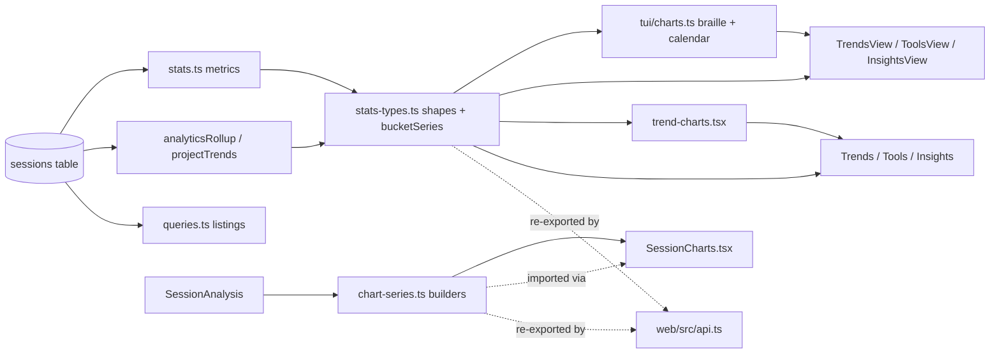

# Analytics & Insights

> Indexed at commit `9d4dd3f` on 2026-07-23 · [view on GitHub](https://github.com/yorch/cc-analyzer/tree/9d4dd3f)

## Relevant source files

- [src/core/stats.ts](https://github.com/yorch/cc-analyzer/blob/9d4dd3f/src/core/stats.ts)
- [src/core/stats-types.ts](https://github.com/yorch/cc-analyzer/blob/9d4dd3f/src/core/stats-types.ts)
- [src/core/chart-series.ts](https://github.com/yorch/cc-analyzer/blob/9d4dd3f/src/core/chart-series.ts)
- [src/core/queries.ts](https://github.com/yorch/cc-analyzer/blob/9d4dd3f/src/core/queries.ts)
- [src/tui/charts.ts](https://github.com/yorch/cc-analyzer/blob/9d4dd3f/src/tui/charts.ts)
- [src/tui/screens/InsightsView.tsx](https://github.com/yorch/cc-analyzer/blob/9d4dd3f/src/tui/screens/InsightsView.tsx)
- [src/tui/screens/TrendsView.tsx](https://github.com/yorch/cc-analyzer/blob/9d4dd3f/src/tui/screens/TrendsView.tsx)
- [src/tui/screens/ToolsView.tsx](https://github.com/yorch/cc-analyzer/blob/9d4dd3f/src/tui/screens/ToolsView.tsx)
- [web/src/trend-charts.tsx](https://github.com/yorch/cc-analyzer/blob/9d4dd3f/web/src/trend-charts.tsx)
- [web/src/SessionCharts.tsx](https://github.com/yorch/cc-analyzer/blob/9d4dd3f/web/src/SessionCharts.tsx)
- [web/src/views/Insights.tsx](https://github.com/yorch/cc-analyzer/blob/9d4dd3f/web/src/views/Insights.tsx)
- [web/src/views/Trends.tsx](https://github.com/yorch/cc-analyzer/blob/9d4dd3f/web/src/views/Trends.tsx)
- [web/src/views/Tools.tsx](https://github.com/yorch/cc-analyzer/blob/9d4dd3f/web/src/views/Tools.tsx)
- [web/src/api.ts](https://github.com/yorch/cc-analyzer/blob/9d4dd3f/web/src/api.ts)

## Overview

Analytics & Insights is the derived-analytics product of `cc-analyzer`: the twenty-plus portfolio metrics, cross-insights, time-series, and per-session charts that turn the flattened SQLite index into cost, cache-efficiency, tool-usage, and adoption reporting. The metric math lives in [src/core/stats.ts](https://github.com/yorch/cc-analyzer/blob/9d4dd3f/src/core/stats.ts), the shared data shapes and series bucketing in [src/core/stats-types.ts](https://github.com/yorch/cc-analyzer/blob/9d4dd3f/src/core/stats-types.ts), and the per-session chart series in [src/core/chart-series.ts](https://github.com/yorch/cc-analyzer/blob/9d4dd3f/src/core/chart-series.ts). Two frontends — the Ink terminal UI and the embedded web Single-Page Application (SPA) — render these numbers without recomputing them.

The subsystem's organizing principle is a single source of truth for every series. The pure shape-and-series modules are deliberately free of `bun:sqlite` imports so the browser TypeScript configuration can type-check them, letting the SPA import the same builders the TUI uses ([src/core/chart-series.ts#L1-L11](https://github.com/yorch/cc-analyzer/blob/9d4dd3f/src/core/chart-series.ts#L1-L11), [src/core/stats-types.ts#L1-L9](https://github.com/yorch/cc-analyzer/blob/9d4dd3f/src/core/stats-types.ts#L1-L9)). Because both frontends bucket the same `DayRow` series and split compactions the same way, they cannot total a week, price a token, or count a compaction differently.

## Architecture

The SQLite `sessions` table feeds the `bun:sqlite`-dependent computations in [src/core/stats.ts](https://github.com/yorch/cc-analyzer/blob/9d4dd3f/src/core/stats.ts) and the row listings in [src/core/queries.ts](https://github.com/yorch/cc-analyzer/blob/9d4dd3f/src/core/queries.ts). Those functions return the pure shapes declared in [src/core/stats-types.ts](https://github.com/yorch/cc-analyzer/blob/9d4dd3f/src/core/stats-types.ts), which also owns the frontend-shared bucketing. The web SPA reaches the bun-free modules by re-export through [web/src/api.ts#L40-L44](https://github.com/yorch/cc-analyzer/blob/9d4dd3f/web/src/api.ts#L40-L44), so its charts compute geometry from the exact numbers the TUI renders.

## Module Layout

| Module | Path | Responsibility |
| ------ | ---- | -------------- |
| `stats-types` | [src/core/stats-types.ts](https://github.com/yorch/cc-analyzer/blob/9d4dd3f/src/core/stats-types.ts) | Bun-free metric shapes, date helpers, and frontend-shared series bucketing |
| `chart-series` | [src/core/chart-series.ts](https://github.com/yorch/cc-analyzer/blob/9d4dd3f/src/core/chart-series.ts) | Bun-free per-session chart builders (context, burn, turns, compactions) |
| `stats` | [src/core/stats.ts](https://github.com/yorch/cc-analyzer/blob/9d4dd3f/src/core/stats.ts) | SQL metric computations, cross-insights, and the single-scan rollups |
| `queries` | [src/core/queries.ts](https://github.com/yorch/cc-analyzer/blob/9d4dd3f/src/core/queries.ts) | Project/session row listings and search over the index |
| `charts` | [src/tui/charts.ts](https://github.com/yorch/cc-analyzer/blob/9d4dd3f/src/tui/charts.ts) | Braille/ASCII chart, sparkline, calendar, and heatmap primitives |
| TUI views | [src/tui/screens/](https://github.com/yorch/cc-analyzer/blob/9d4dd3f/src/tui/screens/TrendsView.tsx) | `TrendsView`, `ToolsView`, `InsightsView` terminal renderers |
| `trend-charts` | [web/src/trend-charts.tsx](https://github.com/yorch/cc-analyzer/blob/9d4dd3f/web/src/trend-charts.tsx) | SVG line/area, model-mix, and scatter chart components |
| `SessionCharts` | [web/src/SessionCharts.tsx](https://github.com/yorch/cc-analyzer/blob/9d4dd3f/web/src/SessionCharts.tsx) | SVG context/burn/turn charts for a single session |
| Web views | [web/src/views/](https://github.com/yorch/cc-analyzer/blob/9d4dd3f/web/src/views/Trends.tsx) | `Trends`, `Tools`, `Insights` SPA pages |

Sources: [src/core/stats-types.ts:L1-L44](https://github.com/yorch/cc-analyzer/blob/9d4dd3f/src/core/stats-types.ts#L1-L44) [src/core/stats.ts:L1-L65](https://github.com/yorch/cc-analyzer/blob/9d4dd3f/src/core/stats.ts#L1-L65) [src/core/queries.ts:L1-L60](https://github.com/yorch/cc-analyzer/blob/9d4dd3f/src/core/queries.ts#L1-L60)

## Key Components

### Shared pure shapes and series bucketing

[src/core/stats-types.ts](https://github.com/yorch/cc-analyzer/blob/9d4dd3f/src/core/stats-types.ts) declares every row and summary interface the analytics layer emits — from `PortfolioStats` and `AnalyticsRollup` to `CacheMetrics`, `SkillUsageRow`, `CompactionSummary`, and `ProjectTrends` — plus the tiny pure helpers that operate on them. It carries the canonical date rules (`localDayOfMs`, `shiftDay`, `weekOf`) so the indexer, stats layer, and both frontends bucket days and weeks identically ([src/core/stats-types.ts#L11-L30](https://github.com/yorch/cc-analyzer/blob/9d4dd3f/src/core/stats-types.ts#L11-L30)). The `cacheVerdict` classifier maps a read:write ratio to `efficient`/`ok`/`leaky` in one place, shared by both frontends' badges ([src/core/stats-types.ts#L269-L276](https://github.com/yorch/cc-analyzer/blob/9d4dd3f/src/core/stats-types.ts#L269-L276)).

The frontend-shared bucketing functions live here too. `bucketSeries` regroups a daily series into day/week/month `SeriesPoint`s, `metricValue` projects a point onto the selected `BurnMetric`, and `weeklySeries` and `calendarWeeks` build the adoption-sparkline and contribution-calendar grids ([src/core/stats-types.ts#L62-L165](https://github.com/yorch/cc-analyzer/blob/9d4dd3f/src/core/stats-types.ts#L62-L165)). One implementation of each means the TUI burn chart and the SPA burn panel cannot total a week differently.

Sources: [src/core/stats-types.ts:L11-L165](https://github.com/yorch/cc-analyzer/blob/9d4dd3f/src/core/stats-types.ts#L11-L165) [src/core/stats-types.ts:L521-L637](https://github.com/yorch/cc-analyzer/blob/9d4dd3f/src/core/stats-types.ts#L521-L637)

### Per-session chart series

[src/core/chart-series.ts](https://github.com/yorch/cc-analyzer/blob/9d4dd3f/src/core/chart-series.ts) derives chart-ready series from a detail-mode `SessionAnalysis`, and is bun-free for the same reason as `stats-types.ts` — the web client imports the builders directly. `buildContextSeries` produces the context-window sawtooth from main-chain API calls, excluding sidechain calls that run in their own context windows, and places compaction markers by timestamp ([src/core/chart-series.ts#L82-L131](https://github.com/yorch/cc-analyzer/blob/9d4dd3f/src/core/chart-series.ts#L82-L131)). `buildBurnSeries` accumulates cost over every call ordered by timestamp, and `buildTurnSeries` shapes the per-turn bars ([src/core/chart-series.ts#L150-L200](https://github.com/yorch/cc-analyzer/blob/9d4dd3f/src/core/chart-series.ts#L150-L200)).

Compaction accounting is single-sourced here. `isOwnCompaction` defines a session's own main-chain compaction as neither a subagent's nor an inherited continuation boundary, and `summarizeCompactions` splits a session's records into `own`/`triggers`/`sidechain`/`inherited` ([src/core/chart-series.ts#L16-L52](https://github.com/yorch/cc-analyzer/blob/9d4dd3f/src/core/chart-series.ts#L16-L52)). Both frontends' chart markers, the portfolio `compactionUsage` rollup, and the indexer's `compactions` column all consume this one split, so no real compaction is counted twice.

Sources: [src/core/chart-series.ts:L16-L200](https://github.com/yorch/cc-analyzer/blob/9d4dd3f/src/core/chart-series.ts#L16-L200)

### Portfolio metric computations

[src/core/stats.ts](https://github.com/yorch/cc-analyzer/blob/9d4dd3f/src/core/stats.ts) holds the SQL-backed metric families. Cost and token rollups include `portfolioSummary`, `spendByMonth`, `spendByProject`, `spendByModel`, `topSessions`, and the daily burn series `spendByDay` ([src/core/stats.ts#L67-L288](https://github.com/yorch/cc-analyzer/blob/9d4dd3f/src/core/stats.ts#L67-L288)). Cadence and distribution metrics — `durationSummary`, `costDistribution` with log-scale buckets and a top-decile share, `streaks`, and `runRate` with a month-end projection — round out the portfolio numbers ([src/core/stats.ts#L329-L482](https://github.com/yorch/cc-analyzer/blob/9d4dd3f/src/core/stats.ts#L329-L482)). `buildPortfolioStats` assembles the common `PortfolioStats` bundle so that `cc-analyzer stats` and the web `/api/stats` route cannot drift ([src/core/stats.ts#L1261-L1279](https://github.com/yorch/cc-analyzer/blob/9d4dd3f/src/core/stats.ts#L1261-L1279)).

Project- and portfolio-scoped queries share a `projectScope`/`scopedAll` helper pair, so a project filter binds the same way in every branch instead of a hand-rolled ternary per query ([src/core/stats.ts#L49-L65](https://github.com/yorch/cc-analyzer/blob/9d4dd3f/src/core/stats.ts#L49-L65)). Several rollups fold JSON columns — `hotFiles`, `modelMixByDay`, `toolUsage`, and `turnDepthStats` — reusing the same `ToolFold`/`DepthFold` accumulators the single-scan rollup uses, so the portfolio Tools view and the project pages agree on error rates and bucket boundaries ([src/core/stats.ts#L668-L770](https://github.com/yorch/cc-analyzer/blob/9d4dd3f/src/core/stats.ts#L668-L770)).

Sources: [src/core/stats.ts:L67-L482](https://github.com/yorch/cc-analyzer/blob/9d4dd3f/src/core/stats.ts#L67-L482) [src/core/stats.ts:L668-L782](https://github.com/yorch/cc-analyzer/blob/9d4dd3f/src/core/stats.ts#L668-L782)

### Single-scan rollups and project trends

`analyticsRollup` folds every per-session JSON rollup in one table scan, because the Tools surfaces need most of them at once and scanning per metric multiplied full-table JSON parsing by the metric count ([src/core/stats.ts#L982-L1021](https://github.com/yorch/cc-analyzer/blob/9d4dd3f/src/core/stats.ts#L982-L1021)). In that pass it accumulates tool usage with error rates, per-skill invocation/reach/reliability/adoption/cost, subagent frequency, Bash command families, test runs, retries, permission modes, stop reasons, turn depth, versions, and branches — classifying Bash and test heuristics at query time so they can change without a reindex ([src/core/stats.ts#L1085-L1254](https://github.com/yorch/cc-analyzer/blob/9d4dd3f/src/core/stats.ts#L1085-L1254)). `projectTrends` bundles the six series a project page needs — daily spend, model mix, scatter, distribution, turn depth, and tools ([src/core/stats.ts#L772-L782](https://github.com/yorch/cc-analyzer/blob/9d4dd3f/src/core/stats.ts#L772-L782)).

Skill cost is explicitly correlational: a session using N skills counts its full cost toward each, and the row shapes and both frontends label it as such ([src/core/stats-types.ts#L300-L323](https://github.com/yorch/cc-analyzer/blob/9d4dd3f/src/core/stats-types.ts#L300-L323), [web/src/views/Tools.tsx#L123-L127](https://github.com/yorch/cc-analyzer/blob/9d4dd3f/web/src/views/Tools.tsx#L123-L127)).

Sources: [src/core/stats.ts:L982-L1254](https://github.com/yorch/cc-analyzer/blob/9d4dd3f/src/core/stats.ts#L982-L1254) [src/core/stats.ts:L772-L782](https://github.com/yorch/cc-analyzer/blob/9d4dd3f/src/core/stats.ts#L772-L782)

### Cache-efficiency insights

Cache accounting is where most real spend hides, so it gets a dedicated metric family. A shared `WASTE_EXPR` computes per-session un-amortized cache-write cost — the write dollars not read back — and `cacheSummary`, `cacheWasteByProject`, and `cacheWasteBySession` rank offenders by it, attaching the read:write `ratio` through a shared `withRatio` helper ([src/core/stats.ts#L197-L275](https://github.com/yorch/cc-analyzer/blob/9d4dd3f/src/core/stats.ts#L197-L275)). `cacheTtlSplit` breaks writes into the 5-minute and 1-hour (2×-priced) TTL buckets ([src/core/stats.ts#L489-L498](https://github.com/yorch/cc-analyzer/blob/9d4dd3f/src/core/stats.ts#L489-L498)).

Both frontends render this as a two-level drill: projects ranked by waste, drilling into a project's sessions. The TUI `InsightsView` is a self-contained master/detail hit-list with a verdict dot per row ([src/tui/screens/InsightsView.tsx#L44-L123](https://github.com/yorch/cc-analyzer/blob/9d4dd3f/src/tui/screens/InsightsView.tsx#L44-L123)); the web `Insights` and `InsightsProject` views are sortable, filterable tables with the same `cacheVerdict` badge ([web/src/views/Insights.tsx#L29-L107](https://github.com/yorch/cc-analyzer/blob/9d4dd3f/web/src/views/Insights.tsx#L29-L107)).

Sources: [src/core/stats.ts:L197-L275](https://github.com/yorch/cc-analyzer/blob/9d4dd3f/src/core/stats.ts#L197-L275) [src/tui/screens/InsightsView.tsx:L44-L123](https://github.com/yorch/cc-analyzer/blob/9d4dd3f/src/tui/screens/InsightsView.tsx#L44-L123) [web/src/views/Insights.tsx:L29-L107](https://github.com/yorch/cc-analyzer/blob/9d4dd3f/web/src/views/Insights.tsx#L29-L107)

### Cross-insights and compaction pressure

Three functions correlate metrics that individually mislead. `idleVsCache` buckets sessions by idle share and reports how the cache amortized in each, testing whether waste concentrates in sessions that sat idle while the TTL lapsed ([src/core/stats.ts#L913-L953](https://github.com/yorch/cc-analyzer/blob/9d4dd3f/src/core/stats.ts#L913-L953)). `concurrency` runs a sweep-line over session start/end edges to find peak parallel-Claude usage per day, and `errorRateByWeek` tracks tool-error rate over ISO weeks ([src/core/stats.ts#L846-L976](https://github.com/yorch/cc-analyzer/blob/9d4dd3f/src/core/stats.ts#L846-L976)). `compactionUsage` reports which projects chronically hit the context ceiling, deriving its summary from `compactions_json` through the shared `summarizeCompactions` split ([src/core/stats.ts#L791-L835](https://github.com/yorch/cc-analyzer/blob/9d4dd3f/src/core/stats.ts#L791-L835)).

Sources: [src/core/stats.ts:L791-L976](https://github.com/yorch/cc-analyzer/blob/9d4dd3f/src/core/stats.ts#L791-L976)

### TUI renderers

[src/tui/charts.ts](https://github.com/yorch/cc-analyzer/blob/9d4dd3f/src/tui/charts.ts) holds pure ASCII/braille primitives — `brailleChart` packs 2×4 dots per cell for a filled area chart, `markerRow` aligns compaction markers to its column bucketing, `sparkline` renders block-eighths, and `calendarGrid`/`heatGrid` shade ramp characters ([src/tui/charts.ts#L35-L174](https://github.com/yorch/cc-analyzer/blob/9d4dd3f/src/tui/charts.ts#L35-L174)). It re-exports the bun-free bucketing so TUI callers keep one chart-import site ([src/tui/charts.ts#L12-L19](https://github.com/yorch/cc-analyzer/blob/9d4dd3f/src/tui/charts.ts#L12-L19)). `TrendsView` composes a three-panel burn/heatmap/calendar dashboard with metric and granularity controls ([src/tui/screens/TrendsView.tsx#L36-L99](https://github.com/yorch/cc-analyzer/blob/9d4dd3f/src/tui/screens/TrendsView.tsx#L36-L99)), and `ToolsView` drives tools/skills/subagents panels from one `analyticsRollup` scan, adding an adoption sparkline strip for the selected skill ([src/tui/screens/ToolsView.tsx#L55-L233](https://github.com/yorch/cc-analyzer/blob/9d4dd3f/src/tui/screens/ToolsView.tsx#L55-L233)).

Sources: [src/tui/charts.ts:L35-L174](https://github.com/yorch/cc-analyzer/blob/9d4dd3f/src/tui/charts.ts#L35-L174) [src/tui/screens/TrendsView.tsx:L36-L99](https://github.com/yorch/cc-analyzer/blob/9d4dd3f/src/tui/screens/TrendsView.tsx#L36-L99) [src/tui/screens/ToolsView.tsx:L55-L233](https://github.com/yorch/cc-analyzer/blob/9d4dd3f/src/tui/screens/ToolsView.tsx#L55-L233)

### Web renderers

The SPA renders the same numbers as SVG. [web/src/trend-charts.tsx](https://github.com/yorch/cc-analyzer/blob/9d4dd3f/web/src/trend-charts.tsx) supplies the shared line-chart geometry (`xScale`, `linePath`, `areaPath`, `LineChart`), the self-contained `BurnPanel` with metric/granularity controls, the `ModelMix` stacked area, and the `Scatter`/`ScatterPanel` efficiency frontier ([web/src/trend-charts.tsx#L21-L290](https://github.com/yorch/cc-analyzer/blob/9d4dd3f/web/src/trend-charts.tsx#L21-L290)). [web/src/SessionCharts.tsx](https://github.com/yorch/cc-analyzer/blob/9d4dd3f/web/src/SessionCharts.tsx) builds the per-session context, cumulative-cost, and per-turn charts from the `chart-series.ts` builders, so its numbers match the TUI exactly ([web/src/SessionCharts.tsx#L28-L62](https://github.com/yorch/cc-analyzer/blob/9d4dd3f/web/src/SessionCharts.tsx#L28-L62)). The `Trends` and `Tools` views compose these into full pages — `Trends` adds a heatmap, calendar, error-rate, sidechain-share, and concurrency panel ([web/src/views/Trends.tsx#L176-L259](https://github.com/yorch/cc-analyzer/blob/9d4dd3f/web/src/views/Trends.tsx#L176-L259)), while `Tools` lays out every rollup family plus the compaction pressure table ([web/src/views/Tools.tsx#L344-L456](https://github.com/yorch/cc-analyzer/blob/9d4dd3f/web/src/views/Tools.tsx#L344-L456)).

Sources: [web/src/trend-charts.tsx:L21-L290](https://github.com/yorch/cc-analyzer/blob/9d4dd3f/web/src/trend-charts.tsx#L21-L290) [web/src/SessionCharts.tsx:L28-L62](https://github.com/yorch/cc-analyzer/blob/9d4dd3f/web/src/SessionCharts.tsx#L28-L62) [web/src/views/Trends.tsx:L176-L259](https://github.com/yorch/cc-analyzer/blob/9d4dd3f/web/src/views/Trends.tsx#L176-L259) [web/src/views/Tools.tsx:L344-L456](https://github.com/yorch/cc-analyzer/blob/9d4dd3f/web/src/views/Tools.tsx#L344-L456)

## Data Flow

Analytics runs against the SQLite index rather than raw session files, so every metric here assumes an existing index. The index's `sessions` table shape — its flattened token, cost, and JSON-rollup columns — is read by [src/core/queries.ts](https://github.com/yorch/cc-analyzer/blob/9d4dd3f/src/core/queries.ts) and the `stats.ts` queries; the schema and the aggregation that populates those columns are owned by the index subsystem and documented on its own page. On the read side, `stats.ts` functions execute grouped SQL (or fold JSON columns in memory) and return `stats-types.ts` shapes; the TUI consumes them directly, while the SPA reaches both the bun-free series builders and the shapes through the `web/src/api.ts` re-export barrel ([web/src/api.ts#L40-L44](https://github.com/yorch/cc-analyzer/blob/9d4dd3f/web/src/api.ts#L40-L44)). The per-session charts diverge from the portfolio path: they run the `chart-series.ts` builders over a live `SessionAnalysis` rather than an index row, which is why they return empty series for an aggregate-mode analysis ([src/core/chart-series.ts#L1-L14](https://github.com/yorch/cc-analyzer/blob/9d4dd3f/src/core/chart-series.ts#L1-L14)).

Sources: [src/core/queries.ts:L1-L60](https://github.com/yorch/cc-analyzer/blob/9d4dd3f/src/core/queries.ts#L1-L60) [web/src/api.ts:L40-L46](https://github.com/yorch/cc-analyzer/blob/9d4dd3f/web/src/api.ts#L40-L46) [src/core/chart-series.ts:L1-L14](https://github.com/yorch/cc-analyzer/blob/9d4dd3f/src/core/chart-series.ts#L1-L14)

## Related Pages

- Parent capability: [Core Analysis Engine](./2-core-analysis-engine.md)
- Index and aggregation mechanics: [Index & Analytics](./2-3-index-and-analytics.md)
- Terminal renderers: [TUI](./4-tui.md)
- API surface: [Web Server & API](./5-web-server-and-api.md)
- SPA rendering: [Web SPA Frontend](./6-web-spa-frontend.md)
