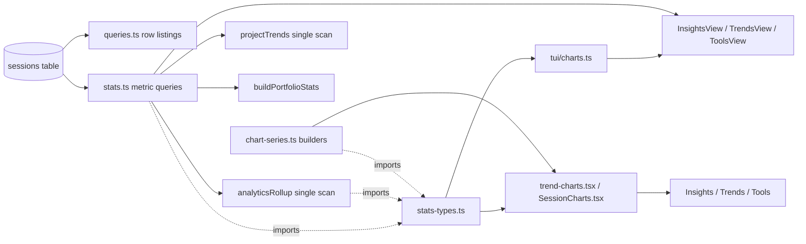

# Analytics & Insights

> Indexed at commit `51ccd4e` on 2026-07-23 · [view on GitHub](https://github.com/yorch/cc-analyzer/tree/51ccd4e)

## Relevant source files

- [src/core/stats-types.ts](https://github.com/yorch/cc-analyzer/blob/51ccd4e/src/core/stats-types.ts)
- [src/core/chart-series.ts](https://github.com/yorch/cc-analyzer/blob/51ccd4e/src/core/chart-series.ts)
- [src/core/stats.ts](https://github.com/yorch/cc-analyzer/blob/51ccd4e/src/core/stats.ts)
- [src/core/queries.ts](https://github.com/yorch/cc-analyzer/blob/51ccd4e/src/core/queries.ts)
- [src/tui/charts.ts](https://github.com/yorch/cc-analyzer/blob/51ccd4e/src/tui/charts.ts)
- [src/tui/screens/InsightsView.tsx](https://github.com/yorch/cc-analyzer/blob/51ccd4e/src/tui/screens/InsightsView.tsx)
- [src/tui/screens/TrendsView.tsx](https://github.com/yorch/cc-analyzer/blob/51ccd4e/src/tui/screens/TrendsView.tsx)
- [src/tui/screens/ToolsView.tsx](https://github.com/yorch/cc-analyzer/blob/51ccd4e/src/tui/screens/ToolsView.tsx)
- [web/src/views/Insights.tsx](https://github.com/yorch/cc-analyzer/blob/51ccd4e/web/src/views/Insights.tsx)
- [web/src/views/Trends.tsx](https://github.com/yorch/cc-analyzer/blob/51ccd4e/web/src/views/Trends.tsx)
- [web/src/views/Tools.tsx](https://github.com/yorch/cc-analyzer/blob/51ccd4e/web/src/views/Tools.tsx)
- [web/src/trend-charts.tsx](https://github.com/yorch/cc-analyzer/blob/51ccd4e/web/src/trend-charts.tsx)
- [web/src/SessionCharts.tsx](https://github.com/yorch/cc-analyzer/blob/51ccd4e/web/src/SessionCharts.tsx)

## Overview

The Analytics & Insights subsystem turns the flattened SQLite index into the twenty-plus derived metrics that the terminal UI (TUI) and the web single-page application (SPA) render: spend and token totals, cache-efficiency verdicts, tool/skill/subagent usage, time-series burn charts, activity heatmaps, compaction pressure, and per-session context-window charts. It owns everything computed *from* the index; the index schema itself and the per-session aggregation that populates it belong to the Index & Analytics page. The metric computations live in [src/core/stats.ts](https://github.com/yorch/cc-analyzer/blob/51ccd4e/src/core/stats.ts#L1) and [src/core/queries.ts](https://github.com/yorch/cc-analyzer/blob/51ccd4e/src/core/queries.ts#L1); the shared data shapes and pure series builders live in two deliberately Bun-free modules, [src/core/stats-types.ts](https://github.com/yorch/cc-analyzer/blob/51ccd4e/src/core/stats-types.ts#L1) and [src/core/chart-series.ts](https://github.com/yorch/cc-analyzer/blob/51ccd4e/src/core/chart-series.ts#L1).

The organizing principle is single-sourcing: every number both frontends display is computed in exactly one place, so the TUI braille chart and the SPA scalable vector graphics (SVG) chart can never disagree. The Bun-free modules carry this rule to the browser — the SPA imports the same series builders the TUI uses instead of reimplementing them ([src/core/chart-series.ts:L1-L14](https://github.com/yorch/cc-analyzer/blob/51ccd4e/src/core/chart-series.ts#L1-L14), [src/core/stats-types.ts:L1-L10](https://github.com/yorch/cc-analyzer/blob/51ccd4e/src/core/stats-types.ts#L1-L10)). Two portfolio-wide entry points anchor the layer: `buildPortfolioStats` for the shared overview ([src/core/stats.ts:L1312-L1330](https://github.com/yorch/cc-analyzer/blob/51ccd4e/src/core/stats.ts#L1312-L1330)) and `analyticsRollup` for the tools/skills/reliability surface computed in one table scan ([src/core/stats.ts:L1041-L1305](https://github.com/yorch/cc-analyzer/blob/51ccd4e/src/core/stats.ts#L1041-L1305)).

## Architecture

The database sits on the left; the middle tier is the core computation in `stats.ts`, `queries.ts`, and the two Bun-free modules; the right tier is the two renderers. Solid arrows carry data; dashed arrows mark the shared type and helper dependency. `stats-types.ts` and `chart-series.ts` are the pivot: both frontends and the core layer import them, which is what keeps the two renderers charting identical numbers.

## Module Layout

| Module | Path | Responsibility |
| ------ | ---- | -------------- |
| stats-types | `src/core/stats-types.ts` | Bun-free shapes, date helpers, and series bucketing |
| chart-series | `src/core/chart-series.ts` | Bun-free per-session chart builders (context/burn/turn) |
| stats | `src/core/stats.ts` | SQL metric computations, single-scan rollups, portfolio bundle |
| queries | `src/core/queries.ts` | Row-level session/project listings and search |
| tui/charts | `src/tui/charts.ts` | Braille/ASCII chart primitives for the TUI |
| tui screens | `src/tui/screens/{Insights,Trends,Tools}View.tsx` | TUI analytics panels |
| web charts | `web/src/{trend-charts,SessionCharts}.tsx` | SVG chart building blocks |
| web views | `web/src/views/{Insights,Trends,Tools}.tsx` | SPA analytics pages |

Sources: [src/core/stats-types.ts:L1-L44](https://github.com/yorch/cc-analyzer/blob/51ccd4e/src/core/stats-types.ts#L1-L44) [src/core/chart-series.ts:L1-L14](https://github.com/yorch/cc-analyzer/blob/51ccd4e/src/core/chart-series.ts#L1-L14) [src/core/queries.ts:L1-L5](https://github.com/yorch/cc-analyzer/blob/51ccd4e/src/core/queries.ts#L1-L5)

## Key Components

### Bun-free shared modules

[src/core/stats-types.ts](https://github.com/yorch/cc-analyzer/blob/51ccd4e/src/core/stats-types.ts#L1-L10) holds the pure data shapes and helpers that both the Bun runtime and the browser type-check. It defines the canonical date rules — `localDayOfMs`, `shiftDay`, and `weekOf` at [src/core/stats-types.ts:L12-L30](https://github.com/yorch/cc-analyzer/blob/51ccd4e/src/core/stats-types.ts#L12-L30) — so the indexer, stats layer, TUI, and web bucket days and weeks identically. The series bucketing that regroups a daily series into day/week/month buckets is `bucketSeries` ([src/core/stats-types.ts:L62-L88](https://github.com/yorch/cc-analyzer/blob/51ccd4e/src/core/stats-types.ts#L62-L88)); `weeklySeries` produces the dense weekly totals behind adoption sparklines ([src/core/stats-types.ts:L101-L117](https://github.com/yorch/cc-analyzer/blob/51ccd4e/src/core/stats-types.ts#L101-L117)); and `calendarWeeks` produces the contribution-calendar grid shared by the TUI ramp calendar and the web SVG calendar ([src/core/stats-types.ts:L139-L165](https://github.com/yorch/cc-analyzer/blob/51ccd4e/src/core/stats-types.ts#L139-L165)). It also holds `cacheVerdict`, which classifies cache amortization from the read:write ratio ([src/core/stats-types.ts:L272-L276](https://github.com/yorch/cc-analyzer/blob/51ccd4e/src/core/stats-types.ts#L272-L276)), plus the interface set consumed everywhere — `ToolUsageRow`, `SkillUsageRow`, `AnalyticsRollup`, `ProjectTrends`, `PortfolioStats`, and `CompactionSummary` among them ([src/core/stats-types.ts:L521-L591](https://github.com/yorch/cc-analyzer/blob/51ccd4e/src/core/stats-types.ts#L521-L591)).

[src/core/chart-series.ts](https://github.com/yorch/cc-analyzer/blob/51ccd4e/src/core/chart-series.ts#L1-L14) derives per-session chart series from a `SessionAnalysis` and is imported directly by the SPA. `buildContextSeries` walks main-chain API calls to produce the context-window sawtooth ([src/core/chart-series.ts:L113-L165](https://github.com/yorch/cc-analyzer/blob/51ccd4e/src/core/chart-series.ts#L113-L165)), `buildBurnSeries` produces the cumulative-cost curve over every call ordered by timestamp ([src/core/chart-series.ts:L184-L212](https://github.com/yorch/cc-analyzer/blob/51ccd4e/src/core/chart-series.ts#L184-L212)), and `buildTurnSeries` produces the per-turn bar series ([src/core/chart-series.ts:L224-L233](https://github.com/yorch/cc-analyzer/blob/51ccd4e/src/core/chart-series.ts#L224-L233)). Because all three walk `analysis.turns`, they return empty series for an aggregate-mode analysis, matching the per-turn views.

Sources: [src/core/stats-types.ts:L1-L165](https://github.com/yorch/cc-analyzer/blob/51ccd4e/src/core/stats-types.ts#L1-L165) [src/core/chart-series.ts:L113-L233](https://github.com/yorch/cc-analyzer/blob/51ccd4e/src/core/chart-series.ts#L113-L233)

### Portfolio and cost/token metrics

`stats.ts` computes the cost, token, and cadence metrics from the index. `portfolioSummary` returns session counts, distinct projects, four-way token totals, and the estimated-pricing share ([src/core/stats.ts:L67-L107](https://github.com/yorch/cc-analyzer/blob/51ccd4e/src/core/stats.ts#L67-L107)); `spendByProject` and `spendByModel` rank spend by project and by model, with model totals parsed out of the per-session `models_json` column ([src/core/stats.ts:L123-L136](https://github.com/yorch/cc-analyzer/blob/51ccd4e/src/core/stats.ts#L123-L136), [src/core/stats.ts:L162-L195](https://github.com/yorch/cc-analyzer/blob/51ccd4e/src/core/stats.ts#L162-L195)). Cadence and distribution follow: `durationSummary`, `costDistribution` with a log-scale histogram and a top-decile share nulled below ten sessions, `streaks`, and `runRate` with a month-end projection ([src/core/stats.ts:L330-L482](https://github.com/yorch/cc-analyzer/blob/51ccd4e/src/core/stats.ts#L330-L482)). `buildPortfolioStats` assembles the whole overview in one place so `cc-analyzer stats` and the `/api/stats` route cannot drift ([src/core/stats.ts:L1312-L1330](https://github.com/yorch/cc-analyzer/blob/51ccd4e/src/core/stats.ts#L1312-L1330)). Project- and portfolio-scoped queries share a `projectScope`/`scopedAll` helper pair so a project filter binds identically in every branch ([src/core/stats.ts:L49-L65](https://github.com/yorch/cc-analyzer/blob/51ccd4e/src/core/stats.ts#L49-L65)).

Sources: [src/core/stats.ts:L49-L195](https://github.com/yorch/cc-analyzer/blob/51ccd4e/src/core/stats.ts#L49-L195) [src/core/stats.ts:L330-L482](https://github.com/yorch/cc-analyzer/blob/51ccd4e/src/core/stats.ts#L330-L482) [src/core/queries.ts:L61-L78](https://github.com/yorch/cc-analyzer/blob/51ccd4e/src/core/queries.ts#L61-L78)

### Cache-efficiency insights

Cache accounting is where most real spend hides, so it gets a dedicated surface. A shared `WASTE_EXPR` computes each session's un-amortized cache-write cost — the write dollars never read back ([src/core/stats.ts:L197-L201](https://github.com/yorch/cc-analyzer/blob/51ccd4e/src/core/stats.ts#L197-L201)). `cacheSummary` totals written cost, read cost, and waste ([src/core/stats.ts:L211-L221](https://github.com/yorch/cc-analyzer/blob/51ccd4e/src/core/stats.ts#L211-L221)); `cacheWasteByProject` and `cacheWasteBySession` rank offenders by that waste and attach the read:write ratio ([src/core/stats.ts:L224-L275](https://github.com/yorch/cc-analyzer/blob/51ccd4e/src/core/stats.ts#L224-L275)). The cross-insight `idleVsCache` buckets sessions by idle share to test whether waste concentrates in sessions that sat idle long enough for the cache time-to-live (TTL) to lapse ([src/core/stats.ts:L975-L1004](https://github.com/yorch/cc-analyzer/blob/51ccd4e/src/core/stats.ts#L975-L1004)). Both frontends render these as ranked hit-lists with a verdict badge: the TUI `InsightsView` drills project-to-session with a cache preview ([src/tui/screens/InsightsView.tsx:L49-L123](https://github.com/yorch/cc-analyzer/blob/51ccd4e/src/tui/screens/InsightsView.tsx#L49-L123)), and the web `Insights` view renders the same ranking plus the idle-bucket panel ([web/src/views/Insights.tsx:L29-L144](https://github.com/yorch/cc-analyzer/blob/51ccd4e/web/src/views/Insights.tsx#L29-L144)).

Sources: [src/core/stats.ts:L197-L275](https://github.com/yorch/cc-analyzer/blob/51ccd4e/src/core/stats.ts#L197-L275) [src/core/stats.ts:L975-L1004](https://github.com/yorch/cc-analyzer/blob/51ccd4e/src/core/stats.ts#L975-L1004) [src/tui/screens/InsightsView.tsx:L49-L190](https://github.com/yorch/cc-analyzer/blob/51ccd4e/src/tui/screens/InsightsView.tsx#L49-L190) [web/src/views/Insights.tsx:L29-L144](https://github.com/yorch/cc-analyzer/blob/51ccd4e/web/src/views/Insights.tsx#L29-L144)

### Single-scan analytics rollup and project trends

Full-table JSON parsing is expensive, so `analyticsRollup` folds every per-session JSON rollup in one table scan rather than scanning per metric ([src/core/stats.ts:L1041-L1305](https://github.com/yorch/cc-analyzer/blob/51ccd4e/src/core/stats.ts#L1041-L1305)). A single pass over the rows accumulates tool usage with error rates, rich per-skill analytics (invocations, reach, reliability, adoption, and session-scoped cost), subagent frequency, Bash command families, test runs, retries, permission modes, stop reasons, turn depth, Claude Code versions, and Git branches. Bash families and test runs are classified at query time from the raw command heads, so those heuristics can change without a reindex. The per-project variant `projectTrends` also runs a single project scan, feeding the shared `newToolFold`, `newDepthFold`, and `newModelMixFold` accumulators so the portfolio Tools view and the project pages can never disagree about error rates or bucket boundaries ([src/core/stats.ts:L778-L808](https://github.com/yorch/cc-analyzer/blob/51ccd4e/src/core/stats.ts#L778-L808)).

The `SkillUsageRow` shape carries the invocation depth, project reach, error rate, first/last-used dates, and a per-day series for the adoption sparkline ([src/core/stats-types.ts:L302-L323](https://github.com/yorch/cc-analyzer/blob/51ccd4e/src/core/stats-types.ts#L302-L323)). Skill cost is session-scoped and correlational — a session using several skills counts its full cost toward each — a caveat both frontends print. The TUI `ToolsView` runs one rollup and switches between tools/skills/subagents panels, adding an adoption strip for the selected skill ([src/tui/screens/ToolsView.tsx:L55-L235](https://github.com/yorch/cc-analyzer/blob/51ccd4e/src/tui/screens/ToolsView.tsx#L55-L235)); the web `Tools` view renders the same rollup plus reliability, depth, compaction, web-tool, mode, stop-reason, version, and branch tables ([web/src/views/Tools.tsx:L344-L456](https://github.com/yorch/cc-analyzer/blob/51ccd4e/web/src/views/Tools.tsx#L344-L456)).

Sources: [src/core/stats.ts:L1041-L1305](https://github.com/yorch/cc-analyzer/blob/51ccd4e/src/core/stats.ts#L1041-L1305) [src/core/stats.ts:L778-L808](https://github.com/yorch/cc-analyzer/blob/51ccd4e/src/core/stats.ts#L778-L808) [src/tui/screens/ToolsView.tsx:L55-L235](https://github.com/yorch/cc-analyzer/blob/51ccd4e/src/tui/screens/ToolsView.tsx#L55-L235) [web/src/views/Tools.tsx:L344-L456](https://github.com/yorch/cc-analyzer/blob/51ccd4e/web/src/views/Tools.tsx#L344-L456)

### Trends and time-series

The trends surface is built from daily and weekly series. `spendByDay` returns the daily burn series oldest-first ([src/core/stats.ts:L279-L288](https://github.com/yorch/cc-analyzer/blob/51ccd4e/src/core/stats.ts#L279-L288)), `activityHeatmap` buckets sessions and cost by local weekday × hour ([src/core/stats.ts:L292-L303](https://github.com/yorch/cc-analyzer/blob/51ccd4e/src/core/stats.ts#L292-L303)), `modelMixByDay` folds daily spend per model for the stacked model-mix chart ([src/core/stats.ts:L665-L672](https://github.com/yorch/cc-analyzer/blob/51ccd4e/src/core/stats.ts#L665-L672)), and `errorRateByWeek` and `concurrency` produce the weekly error-rate and parallel-session lines ([src/core/stats.ts:L1007-L1027](https://github.com/yorch/cc-analyzer/blob/51ccd4e/src/core/stats.ts#L1007-L1027), [src/core/stats.ts:L897-L962](https://github.com/yorch/cc-analyzer/blob/51ccd4e/src/core/stats.ts#L897-L962)). Both frontends bucket the daily series through the shared `bucketSeries` and offer cost/tokens/sessions metrics and day/week/month granularity toggles. The TUI `TrendsView` renders burn, heatmap, and calendar panels with braille and ramp characters ([src/tui/screens/TrendsView.tsx:L36-L206](https://github.com/yorch/cc-analyzer/blob/51ccd4e/src/tui/screens/TrendsView.tsx#L36-L206)); the web `Trends` view renders the same series as SVG line, area, stacked-mix, scatter, and calendar charts ([web/src/views/Trends.tsx:L176-L258](https://github.com/yorch/cc-analyzer/blob/51ccd4e/web/src/views/Trends.tsx#L176-L258)).

Sources: [src/core/stats.ts:L279-L303](https://github.com/yorch/cc-analyzer/blob/51ccd4e/src/core/stats.ts#L279-L303) [src/core/stats.ts:L897-L1027](https://github.com/yorch/cc-analyzer/blob/51ccd4e/src/core/stats.ts#L897-L1027) [src/tui/screens/TrendsView.tsx:L36-L206](https://github.com/yorch/cc-analyzer/blob/51ccd4e/src/tui/screens/TrendsView.tsx#L36-L206) [web/src/views/Trends.tsx:L176-L258](https://github.com/yorch/cc-analyzer/blob/51ccd4e/web/src/views/Trends.tsx#L176-L258) [web/src/trend-charts.tsx:L101-L219](https://github.com/yorch/cc-analyzer/blob/51ccd4e/web/src/trend-charts.tsx#L101-L219)

### Compaction tracking

Compaction accounting counts how often sessions hit the context ceiling, and it takes care not to double-count. `isOwnCompaction` defines a session's own compaction as neither a subagent's nor an inherited boundary copied from a parent session at a continuation-file start ([src/core/chart-series.ts:L23](https://github.com/yorch/cc-analyzer/blob/51ccd4e/src/core/chart-series.ts#L23)), and `summarizeCompactions` splits records that one canonical way ([src/core/chart-series.ts:L57-L72](https://github.com/yorch/cc-analyzer/blob/51ccd4e/src/core/chart-series.ts#L57-L72)). Because copied session files land the same boundary event in several rows, `dedupeCompactions` filters records through a shared `seen` set keyed by the boundary `uuid`; uuid-less records from older files always pass ([src/core/chart-series.ts:L43-L51](https://github.com/yorch/cc-analyzer/blob/51ccd4e/src/core/chart-series.ts#L43-L51)). `compactionUsage` scans `compactions_json` in a `path`-ordered, uuid-deduped pass so a rerun always attributes a shared compaction to the same session ([src/core/stats.ts:L835-L886](https://github.com/yorch/cc-analyzer/blob/51ccd4e/src/core/stats.ts#L835-L886)), producing the `CompactionSummary` shape ([src/core/stats-types.ts:L576-L591](https://github.com/yorch/cc-analyzer/blob/51ccd4e/src/core/stats-types.ts#L576-L591)). The web `Tools` view renders the per-project compaction pressure and the auto/manual/unknown/subagent/inherited breakdown ([web/src/views/Tools.tsx:L274-L305](https://github.com/yorch/cc-analyzer/blob/51ccd4e/web/src/views/Tools.tsx#L274-L305)).

Sources: [src/core/chart-series.ts:L23-L72](https://github.com/yorch/cc-analyzer/blob/51ccd4e/src/core/chart-series.ts#L23-L72) [src/core/stats.ts:L835-L886](https://github.com/yorch/cc-analyzer/blob/51ccd4e/src/core/stats.ts#L835-L886) [src/core/stats-types.ts:L576-L591](https://github.com/yorch/cc-analyzer/blob/51ccd4e/src/core/stats-types.ts#L576-L591) [web/src/views/Tools.tsx:L274-L305](https://github.com/yorch/cc-analyzer/blob/51ccd4e/web/src/views/Tools.tsx#L274-L305)

### Per-session charts and the context-window limit line

The per-session charts come from `chart-series.ts` and render identically in both frontends. `buildContextSeries` also tracks a `contextLimit`: the largest known context-window size across the charted models, single-sourced here as both the limit line and the "% of window" denominator ([src/core/chart-series.ts:L94-L106](https://github.com/yorch/cc-analyzer/blob/51ccd4e/src/core/chart-series.ts#L94-L106)). It reads each call's model limit from `analysis.models`, keeps the largest, and drops the limit when the peak exceeds it by more than ten percent — the sign that a bigger-window variant was priced by the family heuristic's smaller entry — rather than render an impossible ">100% of window" ([src/core/chart-series.ts:L124-L142](https://github.com/yorch/cc-analyzer/blob/51ccd4e/src/core/chart-series.ts#L124-L142)). The helper `pctOfLimit` renders the percentage ([src/core/chart-series.ts:L53-L54](https://github.com/yorch/cc-analyzer/blob/51ccd4e/src/core/chart-series.ts#L53-L54)). The web `SessionCharts.tsx` draws the sawtooth with a dashed `ctx-limit` line at `contextLimit`, compaction markers, the cumulative-burn curve, and per-turn bars ([web/src/SessionCharts.tsx:L29-L149](https://github.com/yorch/cc-analyzer/blob/51ccd4e/web/src/SessionCharts.tsx#L29-L149)).

Sources: [src/core/chart-series.ts:L53-L165](https://github.com/yorch/cc-analyzer/blob/51ccd4e/src/core/chart-series.ts#L53-L165) [web/src/SessionCharts.tsx:L29-L271](https://github.com/yorch/cc-analyzer/blob/51ccd4e/web/src/SessionCharts.tsx#L29-L271)

### Frontend chart primitives

The two renderers share numbers but not drawing code. The TUI uses pure text primitives in [src/tui/charts.ts](https://github.com/yorch/cc-analyzer/blob/51ccd4e/src/tui/charts.ts#L1-L19): `brailleChart` packs a filled area chart into braille dots ([src/tui/charts.ts:L37-L79](https://github.com/yorch/cc-analyzer/blob/51ccd4e/src/tui/charts.ts#L37-L79)), `sparkline` renders block-eighths adoption lines ([src/tui/charts.ts:L109-L123](https://github.com/yorch/cc-analyzer/blob/51ccd4e/src/tui/charts.ts#L109-L123)), and `calendarGrid` and `heatGrid` shade grids with ramp characters ([src/tui/charts.ts:L146-L174](https://github.com/yorch/cc-analyzer/blob/51ccd4e/src/tui/charts.ts#L146-L174)). It re-exports `bucketSeries` and `weeklySeries` from core so TUI callers keep one import site while the totals stay shared ([src/tui/charts.ts:L12-L19](https://github.com/yorch/cc-analyzer/blob/51ccd4e/src/tui/charts.ts#L12-L19)). The SPA uses SVG building blocks in [web/src/trend-charts.tsx](https://github.com/yorch/cc-analyzer/blob/51ccd4e/web/src/trend-charts.tsx#L1-L19): `LineChart`, the metric/granularity `BurnPanel`, the stacked `ModelMix`, and the cost×duration `Scatter` ([web/src/trend-charts.tsx:L51-L290](https://github.com/yorch/cc-analyzer/blob/51ccd4e/web/src/trend-charts.tsx#L51-L290)).

Sources: [src/tui/charts.ts:L1-L174](https://github.com/yorch/cc-analyzer/blob/51ccd4e/src/tui/charts.ts#L1-L174) [web/src/trend-charts.tsx:L1-L290](https://github.com/yorch/cc-analyzer/blob/51ccd4e/web/src/trend-charts.tsx#L1-L290)

## Related Pages

- Index & foundational aggregation: [Index & Analytics](./2.3-index-and-analytics.md)
- Parent capability: [Core Analysis Engine](./2-core-analysis-engine.md)
- Terminal renderers: [TUI](./4-tui.md)
- Web API surface: [Web Server & API](./5-web-server-and-api.md)
- Web SPA rendering: [Web SPA Frontend](./6-web-spa-frontend.md)
