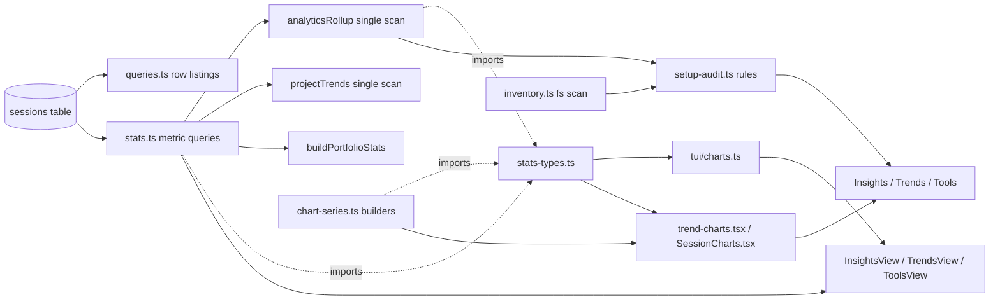

# Analytics & Insights

> Indexed at commit `51ccd4e` on 2026-07-23 · [view on GitHub](https://github.com/yorch/cc-analyzer/tree/51ccd4e)

## Relevant source files

- [src/core/stats-types.ts](https://github.com/yorch/cc-analyzer/blob/51ccd4e/src/core/stats-types.ts)
- [src/core/chart-series.ts](https://github.com/yorch/cc-analyzer/blob/51ccd4e/src/core/chart-series.ts)
- [src/core/stats.ts](https://github.com/yorch/cc-analyzer/blob/51ccd4e/src/core/stats.ts)
- [src/core/inventory.ts](https://github.com/yorch/cc-analyzer/blob/51ccd4e/src/core/inventory.ts)
- [src/core/setup-audit.ts](https://github.com/yorch/cc-analyzer/blob/51ccd4e/src/core/setup-audit.ts)
- [src/core/queries.ts](https://github.com/yorch/cc-analyzer/blob/51ccd4e/src/core/queries.ts)
- [src/tui/charts.ts](https://github.com/yorch/cc-analyzer/blob/51ccd4e/src/tui/charts.ts)
- [src/tui/screens/InsightsView.tsx](https://github.com/yorch/cc-analyzer/blob/51ccd4e/src/tui/screens/InsightsView.tsx)
- [src/tui/screens/TrendsView.tsx](https://github.com/yorch/cc-analyzer/blob/51ccd4e/src/tui/screens/TrendsView.tsx)
- [src/tui/screens/ToolsView.tsx](https://github.com/yorch/cc-analyzer/blob/51ccd4e/src/tui/screens/ToolsView.tsx)
- [web/src/views/Insights.tsx](https://github.com/yorch/cc-analyzer/blob/51ccd4e/web/src/views/Insights.tsx)
- [web/src/views/Trends.tsx](https://github.com/yorch/cc-analyzer/blob/51ccd4e/web/src/views/Trends.tsx)
- [web/src/views/Tools.tsx](https://github.com/yorch/cc-analyzer/blob/51ccd4e/web/src/views/Tools.tsx)
- [web/src/trend-charts.tsx](https://github.com/yorch/cc-analyzer/blob/51ccd4e/web/src/trend-charts.tsx)
- [web/src/SessionCharts.tsx](https://github.com/yorch/cc-analyzer/blob/51ccd4e/web/src/SessionCharts.tsx)

## Overview

The Analytics & Insights subsystem turns the flattened SQLite index into the twenty-plus derived metrics that the terminal UI (TUI) and the web single-page application (SPA) render: spend and token totals, cache-efficiency verdicts, tool/skill/subagent usage, time-series burn charts, activity heatmaps, compaction pressure, and per-session context-window charts. It owns everything computed *from* the index; the index schema itself and the per-session aggregation that populates it belong to the Index & Analytics page. The metric computations live in [src/core/stats.ts](https://github.com/yorch/cc-analyzer/blob/51ccd4e/src/core/stats.ts#L1) and [src/core/queries.ts](https://github.com/yorch/cc-analyzer/blob/51ccd4e/src/core/queries.ts#L1); the shared data shapes and pure series builders live in two deliberately Bun-free modules, [src/core/stats-types.ts](https://github.com/yorch/cc-analyzer/blob/51ccd4e/src/core/stats-types.ts#L1) and [src/core/chart-series.ts](https://github.com/yorch/cc-analyzer/blob/51ccd4e/src/core/chart-series.ts#L1).

The organizing principle is single-sourcing: every number both frontends display is computed in exactly one place, so the TUI braille chart and the SPA scalable vector graphics (SVG) chart can never disagree. The Bun-free modules carry this rule to the browser — the SPA imports the same series builders the TUI uses instead of reimplementing them ([src/core/chart-series.ts:L1-L14](https://github.com/yorch/cc-analyzer/blob/51ccd4e/src/core/chart-series.ts#L1-L14), [src/core/stats-types.ts:L1-L10](https://github.com/yorch/cc-analyzer/blob/51ccd4e/src/core/stats-types.ts#L1-L10)). Two portfolio-wide entry points anchor the layer: `buildPortfolioStats` for the shared overview ([src/core/stats.ts:L1312-L1330](https://github.com/yorch/cc-analyzer/blob/51ccd4e/src/core/stats.ts#L1312-L1330)) and `analyticsRollup` for the tools/skills/reliability surface computed in one table scan ([src/core/stats.ts:L1041-L1305](https://github.com/yorch/cc-analyzer/blob/51ccd4e/src/core/stats.ts#L1041-L1305)).

## Architecture

```mermaid
flowchart LR
    DB[(sessions table)] --> queries[queries.ts row listings]
    DB --> stats[stats.ts metric queries]
    stats --> rollup[analyticsRollup single scan]
    stats --> trends[projectTrends single scan]
    stats --> portfolio[buildPortfolioStats]

    stats -.imports.-> types[stats-types.ts]
    rollup -.imports.-> types
    series[chart-series.ts builders] -.imports.-> types

    types --> tuiCharts[tui/charts.ts]
    tuiCharts --> tuiViews[InsightsView / TrendsView / ToolsView]
    stats --> tuiViews

    types --> webCharts[trend-charts.tsx / SessionCharts.tsx]
    series --> webCharts
    webCharts --> webViews[Insights / Trends / Tools]

    inventory[inventory.ts fs scan] --> audit[setup-audit.ts rules]
    rollup --> audit
    audit --> webViews
```

The database sits on the left; the middle tier is the core computation in `stats.ts`, `queries.ts`, and the two Bun-free modules; the right tier is the two renderers. Solid arrows carry data; dashed arrows mark the shared type and helper dependency. `stats-types.ts` and `chart-series.ts` are the pivot: both frontends and the core layer import them, which is what keeps the two renderers charting identical numbers.

## Module Layout

| Module | Path | Responsibility |
| ------ | ---- | -------------- |
| stats-types | `src/core/stats-types.ts` | Bun-free shapes, date helpers, and series bucketing |
| chart-series | `src/core/chart-series.ts` | Bun-free per-session chart builders (context/burn/turn/cache/idle-gaps/headroom/model-mix/turn-flags/burst-grouping) |
| session-insights | `src/core/session-insights.ts` | Bun-free session-scoped insights: the shared what-if repricing fold (`repriceModelMixes`, also used portfolio-wide by `stats.ts`), cost-per-outcome ratios and their shared row derivation, and `OUTCOME_CAVEAT` |
| stats | `src/core/stats.ts` | SQL metric computations, single-scan rollups, portfolio bundle |
| queries | `src/core/queries.ts` | Row-level session/project listings and search |
| inventory | `src/core/inventory.ts` | Tolerant, read-only scan of the installed Claude setup |
| setup-audit | `src/core/setup-audit.ts` | Bun-free setup shapes and the inventory-vs-usage rules |
| portfolio-diagnostics | `src/core/portfolio-diagnostics.ts` | Bun-free portfolio-wide rules engine (ranked findings) |
| portfolio-signals | `src/core/portfolio-signals.ts` | Assembles `PortfolioSignals` from the index + pricing (+ audit) |
| tui/charts | `src/tui/charts.ts` | Braille/ASCII chart primitives for the TUI |
| tui screens | `src/tui/screens/{Insights,Trends,Tools}View.tsx` | TUI analytics panels |
| web charts | `web/src/{trend-charts,SessionCharts}.tsx` | SVG chart building blocks |
| web views | `web/src/views/{Insights,Trends,Tools}.tsx` | SPA analytics pages |

Sources: [src/core/stats-types.ts:L1-L44](https://github.com/yorch/cc-analyzer/blob/51ccd4e/src/core/stats-types.ts#L1-L44) [src/core/chart-series.ts:L1-L14](https://github.com/yorch/cc-analyzer/blob/51ccd4e/src/core/chart-series.ts#L1-L14) [src/core/queries.ts:L1-L5](https://github.com/yorch/cc-analyzer/blob/51ccd4e/src/core/queries.ts#L1-L5)

## Key Components

### Bun-free shared modules

[src/core/stats-types.ts](https://github.com/yorch/cc-analyzer/blob/51ccd4e/src/core/stats-types.ts#L1-L10) holds the pure data shapes and helpers that both the Bun runtime and the browser type-check. It defines the canonical date rules — `localDayOfMs`, `shiftDay`, and `weekOf` at [src/core/stats-types.ts:L12-L30](https://github.com/yorch/cc-analyzer/blob/51ccd4e/src/core/stats-types.ts#L12-L30) — so the indexer, stats layer, TUI, and web bucket days and weeks identically. The series bucketing that regroups a daily series into day/week/month buckets is `bucketSeries` ([src/core/stats-types.ts:L62-L88](https://github.com/yorch/cc-analyzer/blob/51ccd4e/src/core/stats-types.ts#L62-L88)); `weeklySeries` produces the dense weekly totals behind adoption sparklines ([src/core/stats-types.ts:L101-L117](https://github.com/yorch/cc-analyzer/blob/51ccd4e/src/core/stats-types.ts#L101-L117)); and `calendarWeeks` produces the contribution-calendar grid shared by the TUI ramp calendar and the web SVG calendar ([src/core/stats-types.ts:L139-L165](https://github.com/yorch/cc-analyzer/blob/51ccd4e/src/core/stats-types.ts#L139-L165)). It also holds `cacheVerdict`, which classifies cache amortization from the read:write ratio ([src/core/stats-types.ts:L272-L276](https://github.com/yorch/cc-analyzer/blob/51ccd4e/src/core/stats-types.ts#L272-L276)), plus the interface set consumed everywhere — `ToolUsageRow`, `SkillUsageRow`, `AnalyticsRollup`, `ProjectTrends`, `PortfolioStats`, and `CompactionSummary` among them ([src/core/stats-types.ts:L521-L591](https://github.com/yorch/cc-analyzer/blob/51ccd4e/src/core/stats-types.ts#L521-L591)).

[src/core/chart-series.ts](https://github.com/yorch/cc-analyzer/blob/51ccd4e/src/core/chart-series.ts#L1-L14) derives per-session chart series from a `SessionAnalysis` and is imported directly by the SPA. `buildContextSeries` walks main-chain API calls to produce the context-window sawtooth ([src/core/chart-series.ts:L113-L165](https://github.com/yorch/cc-analyzer/blob/51ccd4e/src/core/chart-series.ts#L113-L165)), `buildBurnSeries` produces the cumulative-cost curve over every call ordered by timestamp ([src/core/chart-series.ts:L184-L212](https://github.com/yorch/cc-analyzer/blob/51ccd4e/src/core/chart-series.ts#L184-L212)), and `buildTurnSeries` produces the per-turn bar series — now carrying the four cost categories, wall time, operation-step kind counts, tool errors, and the per-turn interrupted/correction/retry/test-failure/redundant-read signals ([src/core/chart-series.ts:L224-L233](https://github.com/yorch/cc-analyzer/blob/51ccd4e/src/core/chart-series.ts#L224-L233)). Beside them sit `buildCacheSeries` (per-call cached-vs-fresh split and token-weighted hit rate), `buildGapMarkers` (idle gaps over the shared five-minute threshold), `projectHeadroom` (calls-to-window extrapolation since the last compaction), and `modelMixRows` (in-session model ranking); the sibling bun-free `session-insights.ts` supplies the shared what-if repricing fold (`repriceModelMixes`, also used portfolio-wide by `stats.ts`) and the cost-per-outcome ratios. Because the turn-walking builders read `analysis.turns`, they return empty series for an aggregate-mode analysis, matching the per-turn views.

Sources: [src/core/stats-types.ts:L1-L165](https://github.com/yorch/cc-analyzer/blob/51ccd4e/src/core/stats-types.ts#L1-L165) [src/core/chart-series.ts:L113-L233](https://github.com/yorch/cc-analyzer/blob/51ccd4e/src/core/chart-series.ts#L113-L233)

### Portfolio and cost/token metrics

`stats.ts` computes the cost, token, and cadence metrics from the index. `portfolioSummary` returns session counts, distinct projects, four-way token totals, and the estimated-pricing share ([src/core/stats.ts:L67-L107](https://github.com/yorch/cc-analyzer/blob/51ccd4e/src/core/stats.ts#L67-L107)); `spendByProject` and `spendByModel` rank spend by project and by model, with model totals parsed out of the per-session `models_json` column ([src/core/stats.ts:L123-L136](https://github.com/yorch/cc-analyzer/blob/51ccd4e/src/core/stats.ts#L123-L136), [src/core/stats.ts:L162-L195](https://github.com/yorch/cc-analyzer/blob/51ccd4e/src/core/stats.ts#L162-L195)). Cadence and distribution follow: `durationSummary`, `costDistribution` with a log-scale histogram and a top-decile share nulled below ten sessions, `streaks`, and `runRate` with a month-end projection ([src/core/stats.ts:L330-L482](https://github.com/yorch/cc-analyzer/blob/51ccd4e/src/core/stats.ts#L330-L482)). `buildPortfolioStats` assembles the whole overview in one place so `cc-analyzer stats` and the `/api/stats` route cannot drift ([src/core/stats.ts:L1312-L1330](https://github.com/yorch/cc-analyzer/blob/51ccd4e/src/core/stats.ts#L1312-L1330)). Project- and portfolio-scoped queries share a `projectScope`/`scopedAll` helper pair so a project filter binds identically in every branch ([src/core/stats.ts:L49-L65](https://github.com/yorch/cc-analyzer/blob/51ccd4e/src/core/stats.ts#L49-L65)).

Sources: [src/core/stats.ts:L49-L195](https://github.com/yorch/cc-analyzer/blob/51ccd4e/src/core/stats.ts#L49-L195) [src/core/stats.ts:L330-L482](https://github.com/yorch/cc-analyzer/blob/51ccd4e/src/core/stats.ts#L330-L482) [src/core/queries.ts:L61-L78](https://github.com/yorch/cc-analyzer/blob/51ccd4e/src/core/queries.ts#L61-L78)

### Cache-efficiency insights

Cache accounting is where most real spend hides, so it gets a dedicated surface. A shared `WASTE_EXPR` computes each session's un-amortized cache-write cost — the write dollars never read back ([src/core/stats.ts:L197-L201](https://github.com/yorch/cc-analyzer/blob/51ccd4e/src/core/stats.ts#L197-L201)). `cacheSummary` totals written cost, read cost, and waste ([src/core/stats.ts:L211-L221](https://github.com/yorch/cc-analyzer/blob/51ccd4e/src/core/stats.ts#L211-L221)); `cacheWasteByProject` and `cacheWasteBySession` rank offenders by that waste and attach the read:write ratio ([src/core/stats.ts:L224-L275](https://github.com/yorch/cc-analyzer/blob/51ccd4e/src/core/stats.ts#L224-L275)). The cross-insight `idleVsCache` buckets sessions by idle share to test whether waste concentrates in sessions that sat idle long enough for the cache time-to-live (TTL) to lapse ([src/core/stats.ts:L975-L1004](https://github.com/yorch/cc-analyzer/blob/51ccd4e/src/core/stats.ts#L975-L1004)). Both frontends render these as ranked hit-lists with a verdict badge: the TUI `InsightsView` drills project-to-session with a cache preview ([src/tui/screens/InsightsView.tsx:L49-L123](https://github.com/yorch/cc-analyzer/blob/51ccd4e/src/tui/screens/InsightsView.tsx#L49-L123)), and the web `Insights` view renders the same ranking plus the idle-bucket panel ([web/src/views/Insights.tsx:L29-L144](https://github.com/yorch/cc-analyzer/blob/51ccd4e/web/src/views/Insights.tsx#L29-L144)). The web `Projects` page folds the same per-project waste and verdict badge into its own table as one more column, reusing the `/api/insights` payload rather than a separate query ([web/src/views/Projects.tsx](https://github.com/yorch/cc-analyzer/blob/main/web/src/views/Projects.tsx)), and the TUI project preview shows the same verdict/ratio/waste line for the highlighted project, joined from a full-width `cacheWasteByProject` map computed once at App startup ([src/tui/components/previews.tsx](https://github.com/yorch/cc-analyzer/blob/main/src/tui/components/previews.tsx)). Both Insights surfaces also carry the context-tax and what-if repricing summaries described below — the TUI as two header lines computed at the screen boundary, the web as two tables fetched from `/api/analytics`.

Sources: [src/core/stats.ts:L197-L275](https://github.com/yorch/cc-analyzer/blob/51ccd4e/src/core/stats.ts#L197-L275) [src/core/stats.ts:L975-L1004](https://github.com/yorch/cc-analyzer/blob/51ccd4e/src/core/stats.ts#L975-L1004) [src/tui/screens/InsightsView.tsx:L49-L190](https://github.com/yorch/cc-analyzer/blob/51ccd4e/src/tui/screens/InsightsView.tsx#L49-L190) [web/src/views/Insights.tsx:L29-L144](https://github.com/yorch/cc-analyzer/blob/51ccd4e/web/src/views/Insights.tsx#L29-L144)

### Context tax and what-if model repricing

Two cost-optimization rollups answer the questions "what do I pay before I type?" and "should this work have gone to a cheaper model?". Both are portfolio-wide (optionally project-scoped) and ride along on the `/api/analytics` payload.

`contextTax` reads the `first_prompt_tokens` column (schema `v9`) — the prompt-side tokens of a session's first main-chain API call, which approximates the fixed per-session overhead: system prompt, `CLAUDE.md`, and MCP tool schemas. It groups sessions by project and reports mean, median, and p90 through the same `percentile` helper `costDistribution` uses, ranked by median. Percentiles rather than a mean alone, because one session opened with a large paste — or a continuation session resuming from an inherited compaction summary — inflates the average while the median still shows the recurring floor. Sessions with no main-chain call carry `NULL` and are excluded entirely: the absence of a baseline is unknown, not zero. Sidechain calls never set the baseline, since subagents run in their own context windows.

`whatIfRepricing` folds `models_json` through the shared `modelTotals` accumulator, then replays each model's **actual** token mix at every other model's rates via the existing `computeCost`, so all four token categories and both cache-write TTLs are repriced rather than approximated from a headline rate. Alternatives are the other models the user actually ran — the realistic comparison set — falling back to the canonical `FALLBACK_WHATIF_MODELS` ladder (one model per family, newest present in the bundled pricing snapshot) when fewer than two of their models resolve in the pricing table. Models the pricing table cannot resolve are excluded from both sides: an unresolvable id would price at $0 and read as an enormous saving. The `WhatIfRow` shape carries per-alternative `cost` and `delta` (alternative − actual, negative = saving), and the summary names the cheapest single model to have run everything on. This is strictly a **rate comparison**, and the caveat is mandatory at every render site: a different model would produce a different number of tokens, and output quality is not priced in at all.

Sources: [src/core/stats.ts](https://github.com/yorch/cc-analyzer/blob/51ccd4e/src/core/stats.ts) [src/core/stats-types.ts](https://github.com/yorch/cc-analyzer/blob/51ccd4e/src/core/stats-types.ts) [src/core/pricing.ts](https://github.com/yorch/cc-analyzer/blob/51ccd4e/src/core/pricing.ts)

### Parse coverage

Every metric in this page rests on a parser reading an **undocumented** file format that moves between Claude Code releases. `parseCoverage(db)` makes the resulting uncertainty measurable: it scans the `parse_lines`, `parse_errors`, and `unknown_events` columns (schema `v11`) and returns a portfolio `ParseCoverageSummary` plus one row per Claude Code version, each with `unparsedShare = (parseErrors + unknownEvents) / lines`, guarded against a zero-line denominator (an empty index, or rows written before v11). `parseErrors` counts lines that produced no event at all; `unknownEvents` counts lines kept only as tolerant "unknown" events — see [Session Parsing & Events](./2.1-session-parsing-and-events.md) for how the counters are produced.

Version attribution is deliberately **best effort**: a session records every version it ran under (it can span an upgrade) and is attributed wholly to the newest of them, since that is the version most likely to have written the lines the parser choked on. Sessions with no recorded version count toward the summary but toward no version row. Rows are sorted newest version first (numerically, through `compareVersions`), so `byVersion[0]` is the version to judge the current parser by — which is exactly what the `parse-coverage-drop` rule reads.

Surfaces: `cc-analyzer index --check` prints the portfolio line (one SQL scan, so `--check` still parses no sessions), `cc-analyzer analyze` reports the single session's counters under its report, `/api/analytics` carries the rollup as `parseCoverage`, and the web Tools → Environment tab renders the per-version table next to the Claude Code versions table.

Sources: [src/core/stats.ts](https://github.com/yorch/cc-analyzer/blob/main/src/core/stats.ts) [src/core/stats-types.ts](https://github.com/yorch/cc-analyzer/blob/main/src/core/stats-types.ts) [src/core/parser.ts](https://github.com/yorch/cc-analyzer/blob/main/src/core/parser.ts)

### Single-scan analytics rollup and project trends

Full-table JSON parsing is expensive, so `analyticsRollup` folds every per-session JSON rollup in one table scan rather than scanning per metric ([src/core/stats.ts:L1041-L1305](https://github.com/yorch/cc-analyzer/blob/51ccd4e/src/core/stats.ts#L1041-L1305)). A single pass over the rows accumulates tool usage with error rates, rich per-skill analytics (invocations, reach, reliability, adoption, turn-scoped cost attribution, and session-scoped cost), subagent frequency, Bash command families, test runs, retries, thrash (sessions with a failing-test streak ≥ 3, total redundant reads, and the portfolio-wide top re-read files off the schema v12 columns), corrections (correction and interruption turns off the schema v13 columns, with the real-prompt turn total as denominator, per-share guards against zero turns, and a weekly `{week, correctionTurns, turns}` trend folded in the same scan — every corrections surface prints the shared `CORRECTION_CAVEAT`, because the detector is an English-only keyword heuristic that undercounts by design), permission modes, stop reasons, turn depth, Claude Code versions, and Git branches. Bash families and test runs are classified at query time from the raw command heads, so those heuristics can change without a reindex. The per-project variant `projectTrends` also runs a single project scan, feeding the shared `newToolFold`, `newDepthFold`, and `newModelMixFold` accumulators so the portfolio Tools view and the project pages can never disagree about error rates or bucket boundaries ([src/core/stats.ts:L778-L808](https://github.com/yorch/cc-analyzer/blob/51ccd4e/src/core/stats.ts#L778-L808)).

The `SkillUsageRow` shape carries the invocation depth, project reach, error rate, first/last-used dates, a per-day series for the adoption sparkline, and skill cost at **two scopes** ([src/core/stats-types.ts:L302-L323](https://github.com/yorch/cc-analyzer/blob/51ccd4e/src/core/stats-types.ts#L302-L323)). The primary number is turn-scoped: `attributedTurns` / `attributedCost` sum the per-session `skill_turn_costs_json` blob (schema v10), i.e. the cost of the *turns* that invoked the skill — the containing turn's API calls, its tool loop, and any subagent burst inside it. `totalCost` / `avgCostPerSession` remain as the session-scoped upper bound: a session's whole cost charged to every skill it touched. Neither is causal — a turn invoking several skills counts its full cost toward each — and the shared `SKILL_COST_CAVEAT` string, exported from the bun-free `stats-types.ts`, is what every surface prints so the wording cannot drift. Surfaces: the `Skills` section of `cc-analyzer stats` and of a single-session report (`turn $` beside `session $`), the TUI skills panel (`TURN $` / `SESS $` columns, both sortable), and the web Tools view's Skills table. The TUI `ToolsView` runs one rollup and switches between tools/skills/subagents panels, adding an adoption strip for the selected skill ([src/tui/screens/ToolsView.tsx:L55-L235](https://github.com/yorch/cc-analyzer/blob/51ccd4e/src/tui/screens/ToolsView.tsx#L55-L235)); the web `Tools` view renders the same rollup plus reliability, depth, compaction, web-tool, mode, stop-reason, version, and branch tables ([web/src/views/Tools.tsx:L344-L456](https://github.com/yorch/cc-analyzer/blob/51ccd4e/web/src/views/Tools.tsx#L344-L456)).

Sources: [src/core/stats.ts:L1041-L1305](https://github.com/yorch/cc-analyzer/blob/51ccd4e/src/core/stats.ts#L1041-L1305) [src/core/stats.ts:L778-L808](https://github.com/yorch/cc-analyzer/blob/51ccd4e/src/core/stats.ts#L778-L808) [src/tui/screens/ToolsView.tsx:L55-L235](https://github.com/yorch/cc-analyzer/blob/51ccd4e/src/tui/screens/ToolsView.tsx#L55-L235) [web/src/views/Tools.tsx:L344-L456](https://github.com/yorch/cc-analyzer/blob/51ccd4e/web/src/views/Tools.tsx#L344-L456)

### Trends and time-series

The trends surface is built from daily and weekly series. `spendByDay` returns the daily burn series oldest-first ([src/core/stats.ts:L279-L288](https://github.com/yorch/cc-analyzer/blob/51ccd4e/src/core/stats.ts#L279-L288)), `activityHeatmap` buckets sessions and cost by local weekday × hour ([src/core/stats.ts:L292-L303](https://github.com/yorch/cc-analyzer/blob/51ccd4e/src/core/stats.ts#L292-L303)), `modelMixByDay` folds daily spend per model for the stacked model-mix chart ([src/core/stats.ts:L665-L672](https://github.com/yorch/cc-analyzer/blob/51ccd4e/src/core/stats.ts#L665-L672)), and `errorRateByWeek` and `concurrency` produce the weekly error-rate and parallel-session lines ([src/core/stats.ts:L1007-L1027](https://github.com/yorch/cc-analyzer/blob/51ccd4e/src/core/stats.ts#L1007-L1027), [src/core/stats.ts:L897-L962](https://github.com/yorch/cc-analyzer/blob/51ccd4e/src/core/stats.ts#L897-L962)). Both frontends bucket the daily series through the shared `bucketSeries` and offer cost/tokens/sessions metrics and day/week/month granularity toggles. The TUI `TrendsView` renders burn, heatmap, and calendar panels with braille and ramp characters ([src/tui/screens/TrendsView.tsx:L36-L206](https://github.com/yorch/cc-analyzer/blob/51ccd4e/src/tui/screens/TrendsView.tsx#L36-L206)); the web `Trends` view renders the same series as SVG line, area, stacked-mix, scatter, and calendar charts ([web/src/views/Trends.tsx:L176-L258](https://github.com/yorch/cc-analyzer/blob/51ccd4e/web/src/views/Trends.tsx#L176-L258)).

Sources: [src/core/stats.ts:L279-L303](https://github.com/yorch/cc-analyzer/blob/51ccd4e/src/core/stats.ts#L279-L303) [src/core/stats.ts:L897-L1027](https://github.com/yorch/cc-analyzer/blob/51ccd4e/src/core/stats.ts#L897-L1027) [src/tui/screens/TrendsView.tsx:L36-L206](https://github.com/yorch/cc-analyzer/blob/51ccd4e/src/tui/screens/TrendsView.tsx#L36-L206) [web/src/views/Trends.tsx:L176-L258](https://github.com/yorch/cc-analyzer/blob/51ccd4e/web/src/views/Trends.tsx#L176-L258) [web/src/trend-charts.tsx:L101-L219](https://github.com/yorch/cc-analyzer/blob/51ccd4e/web/src/trend-charts.tsx#L101-L219)

### Compaction tracking

Compaction accounting counts how often sessions hit the context ceiling, and it takes care not to double-count. `isOwnCompaction` defines a session's own compaction as neither a subagent's nor an inherited boundary copied from a parent session at a continuation-file start ([src/core/chart-series.ts:L23](https://github.com/yorch/cc-analyzer/blob/51ccd4e/src/core/chart-series.ts#L23)), and `summarizeCompactions` splits records that one canonical way ([src/core/chart-series.ts:L57-L72](https://github.com/yorch/cc-analyzer/blob/51ccd4e/src/core/chart-series.ts#L57-L72)). Because copied session files land the same boundary event in several rows, `dedupeCompactions` filters records through a shared `seen` set keyed by the boundary `uuid`; uuid-less records from older files always pass ([src/core/chart-series.ts:L43-L51](https://github.com/yorch/cc-analyzer/blob/51ccd4e/src/core/chart-series.ts#L43-L51)). `compactionUsage` scans `compactions_json` in a `path`-ordered, uuid-deduped pass so a rerun always attributes a shared compaction to the same session ([src/core/stats.ts:L835-L886](https://github.com/yorch/cc-analyzer/blob/51ccd4e/src/core/stats.ts#L835-L886)), producing the `CompactionSummary` shape ([src/core/stats-types.ts:L576-L591](https://github.com/yorch/cc-analyzer/blob/51ccd4e/src/core/stats-types.ts#L576-L591)). The web `Tools` view renders the per-project compaction pressure and the auto/manual/unknown/subagent/inherited breakdown ([web/src/views/Tools.tsx:L274-L305](https://github.com/yorch/cc-analyzer/blob/51ccd4e/web/src/views/Tools.tsx#L274-L305)).

Sources: [src/core/chart-series.ts:L23-L72](https://github.com/yorch/cc-analyzer/blob/51ccd4e/src/core/chart-series.ts#L23-L72) [src/core/stats.ts:L835-L886](https://github.com/yorch/cc-analyzer/blob/51ccd4e/src/core/stats.ts#L835-L886) [src/core/stats-types.ts:L576-L591](https://github.com/yorch/cc-analyzer/blob/51ccd4e/src/core/stats-types.ts#L576-L591) [web/src/views/Tools.tsx:L274-L305](https://github.com/yorch/cc-analyzer/blob/51ccd4e/web/src/views/Tools.tsx#L274-L305)

### Per-session charts and the context-window limit line

The per-session charts come from `chart-series.ts` and render identically in both frontends. `buildContextSeries` also tracks a `contextLimit`: the largest known context-window size across the charted models, single-sourced here as both the limit line and the "% of window" denominator ([src/core/chart-series.ts:L94-L106](https://github.com/yorch/cc-analyzer/blob/51ccd4e/src/core/chart-series.ts#L94-L106)). It reads each call's model limit from `analysis.models`, keeps the largest, and drops the limit when the peak exceeds it by more than ten percent — the sign that a bigger-window variant was priced by the family heuristic's smaller entry — rather than render an impossible ">100% of window" ([src/core/chart-series.ts:L124-L142](https://github.com/yorch/cc-analyzer/blob/51ccd4e/src/core/chart-series.ts#L124-L142)). The helper `pctOfLimit` renders the percentage ([src/core/chart-series.ts:L53-L54](https://github.com/yorch/cc-analyzer/blob/51ccd4e/src/core/chart-series.ts#L53-L54)). The web `SessionCharts.tsx` draws the sawtooth with a dashed `ctx-limit` line at `contextLimit`, compaction markers, the cumulative-burn curve, and per-turn bars ([web/src/SessionCharts.tsx:L29-L149](https://github.com/yorch/cc-analyzer/blob/51ccd4e/web/src/SessionCharts.tsx#L29-L149)).

Sources: [src/core/chart-series.ts:L53-L165](https://github.com/yorch/cc-analyzer/blob/51ccd4e/src/core/chart-series.ts#L53-L165) [web/src/SessionCharts.tsx:L29-L271](https://github.com/yorch/cc-analyzer/blob/51ccd4e/web/src/SessionCharts.tsx#L29-L271)

### Actionable session diagnostics

`session-diagnostics.ts` turns detail-mode session evidence into named,
explainable recommendations shared by the CLI, TUI, and web summary. The
diagnostic set covers context pressure at or above 75% of a known window, a
single-call context increase of at least 25% of the window, cache writes following
gaps of at least five minutes, a first post-compaction call that refills at least
75% of recorded pre-compaction context, one turn carrying at least half the
cost of a session with three or more turns, `edit-test-thrash` (at least three
consecutive failing test runs without a pass on one chain — info at 3, warning
at 4; edits between the failures do not break the streak), and
`repeated-file-reads` (at least four redundant reads — the 3rd+ read of a file
on one chain — or any single file read four times; warning at eight redundant
reads, naming the most re-read file), and `correction-loop` (at least three
correction turns that are also ≥ 25% of the session's turns — warning at 40% —
computed from the same `isCorrectionPrompt`/`isInterruptionMarker` heuristics
the index stores, with the English-only-heuristic caveat inside the evidence
text). Each result includes the observed
evidence, affected turn when known, severity, and suggested next action.

The thresholds are deliberately documented in code and the output remains
heuristic: diagnostics do not produce an opaque quality score, infer account-wide
subscription usage, or claim to know which tool payload caused a context jump.
The module is Bun-free so all three presentation layers derive identical results
without adding fields to the disposable aggregate index.

### Setup audit: inventory vs observed usage

The setup audit is the only analytics surface whose input is *configuration*
rather than transcripts. `scanInventories()` (over every configured Claude root) in
[src/core/inventory.ts](https://github.com/yorch/cc-analyzer/blob/51ccd4e/src/core/inventory.ts)
reads each configured Claude dir — `settings.json` (permission rule counts, hook
events, a pinned `model`, any `mcpServers`), `skills/<name>/SKILL.md`,
`agents/<name>.md`, a best-effort walk of `plugins/` (a dir counts as a plugin
when it declares `.claude-plugin/plugin.json` or ships `skills`/`agents`/`commands`,
and the plugin's own skills, agents, and MCP servers are recorded with it — the
servers come from the plugin's own `.mcp.json` or an `mcpServers` field in its
manifest, inline or by path, and are deliberately *not* folded into the
user-configured server list) — plus the sibling
`<claudeDir>.json`, whose top-level `mcpServers` are global and whose
`projects.<path>.mcpServers` are project-scoped. Every read is wrapped: a missing
dir, an unfamiliar layout, or malformed JSON is skipped silently, because this is
user-editable config whose shape changes between Claude Code releases.

`buildSetupAudit(inventory, usage, today)` in
[src/core/setup-audit.ts](https://github.com/yorch/cc-analyzer/blob/51ccd4e/src/core/setup-audit.ts)
is Bun-free and pure — `today` is passed in, never read from the clock — and
takes its usage side straight from `analyticsRollup`: `skills`, `subagents`, and
`tools` (MCP calls appear as `mcp__<server>__<tool>`). It emits findings in the
`session-diagnostics` shape (`code`, `severity`, `title`, `evidence`, `action`,
plus the `subject` the finding is about), warnings first:

| Code | Severity | Rule and rationale |
| ---- | -------- | ------------------ |
| `unused-mcp-server` | warning | A configured server with no `mcp__<server>__*` call. A warning because every configured server's tool schemas are re-sent with each turn — an unused one is pure context tax. The evidence names global vs project scope. |
| `error-prone-skill` | warning | Error rate ≥ 25% over ≥ 5 invocations. One in four failing is past flaky; the floor of five keeps a single bad run out of two from being called error-prone. |
| `unused-skill` | info | An installed skill with zero matching invocations; the evidence names the install source (user dir or plugin). |
| `unused-agent` | info | An installed subagent never named by a `Task`/`Agent` call. |
| `unused-plugin` | info | An installed plugin where *nothing* it ships was ever used — no skill invocation, no subagent session, no MCP tool call. Fires once for the plugin instead of one finding per dead component, and suppresses its components' own `unused-skill`/`unused-agent` findings. A plugin with nothing discoverable (known only by name, or commands-only) never fires it: "all zero components unused" is vacuously true. Worded "appears unused" because the matching is loose. |
| `stale-skill` | info | Previously used, but last used ≥ 30 days before `today` — one month covers a normal work cycle, and anything shorter would flag genuinely monthly skills. |
| `missing-but-used` | info | Skills or subagents observed in sessions but absent from the inventory, aggregated into one finding per kind. Suppressed entirely when there is no Claude dir to compare against. |

Every name question — the findings above and the per-plugin numbers below —
goes through the single classifier `attribute(observed, item, owners,
userNames)`, and the two differ only in the strictness they accept. The
findings ask it loosely (anything but `"none"` counts as used): a plugin skill
may be invoked qualified (`my-plugin:review`) or bare, and either form counts,
because a loose match yields a false negative — the audit stays quiet — which
is strictly better than accusing a daily-driver skill of being unused. The one
thing loose matching does *not* do is let two installed items claim the same
observation: a user-installed skill owns bare invocations of its name, so a
plugin shipping a same-named skill is shadowed (case 4 below) and one erroring
`deploy` row produces one `error-prone-skill` finding, not one per copy.

`buildPluginUsage(inventory, usage)` rolls that up one level, from per-skill to
per-plugin, answering "what is this plugin doing for me, and what does it
cost?". Each `PluginUsageRow` carries how many of the plugin's shipped skills,
subagents, and MCP servers were used, its total skill invocations, the sessions
its subagents ran in, the turn-scoped `attributedTurns`/`attributedCost` summed
over its skills, and the latest day any of them ran. Rows sort by attributed
cost, then invocations.

A plugin row carries *numbers*, not just a yes/no, and there loose matching
would not be silence but invention — the same bare `fmt` row would be summed
into every plugin shipping an `fmt` skill, and a user's own `fmt` skill would
have its dollars claimed by a plugin. So usedness stays loose while the numbers
are attributed strictly, over the same four cases the classifier decides (a
user-installed item is case 0: trivially its own owner, since nothing shadows
a skill the user installed themselves):

1. a **qualified** row (`toolkit:fmt`) names its owner — it counts for that
   plugin, both as usedness and in every number;
2. a **bare** row shipped by exactly one plugin and by no user-installed skill
   of that name is unambiguous, and counts the same way (this is what keeps a
   plugin skill logged under both name forms summed into one row);
3. a **bare** row shipped by two or more plugins counts toward *usedness* for
   each candidate — one of them really did run it, and accusing them all of
   being unused would be a guaranteed false accusation — but toward the numbers
   of none;
4. a **bare** row whose name is also a user-installed skill is shadowed: a bare
   invocation resolves to the user's own skill, so the plugin gets neither the
   numbers nor the usedness and stays eligible for `unused-plugin`.

Subagent sessions follow the same rule. `unused-plugin` keys off the loose
usedness side, so case (3) suppresses it while case (4) does not.

The costs are the same turn-scoped attribution the per-skill table uses, so
`SKILL_COST_CAVEAT` is printed wherever the rollup renders. The rollup rides on
`SetupAudit.plugins`, so `cc-analyzer audit` (a Plugins table, and `plugins` in
`--json`), `GET /api/audit`, and the web Tools → Setup section all read the same
numbers. Subagent sessions are an upper bound: the rollup only has per-name
session counts, so one session dispatching two of a plugin's agents counts twice.

The whole result is machine-local and historical: the index can cover sessions
that predate the current setup, and project-scoped skills, subagents, and MCP
servers live outside the Claude config dir. That caveat ships as the exported
`SETUP_AUDIT_CAVEAT` string so `cc-analyzer audit`, `/api/audit`, and the web
Tools view all print the same words. The TUI intentionally has no audit screen;
the CLI and web cover it.

Sources: [src/core/inventory.ts](https://github.com/yorch/cc-analyzer/blob/51ccd4e/src/core/inventory.ts) [src/core/setup-audit.ts](https://github.com/yorch/cc-analyzer/blob/51ccd4e/src/core/setup-audit.ts) [src/cli/render.ts](https://github.com/yorch/cc-analyzer/blob/51ccd4e/src/cli/render.ts) [web/src/views/Tools.tsx](https://github.com/yorch/cc-analyzer/blob/51ccd4e/web/src/views/Tools.tsx)

### Portfolio insights: the cross-signal rules engine

`portfolio-diagnostics.ts` generalizes the session-diagnostics pattern
portfolio-wide: a Bun-free, pure rules engine
([src/core/portfolio-diagnostics.ts](https://github.com/yorch/cc-analyzer/blob/51ccd4e/src/core/portfolio-diagnostics.ts))
that folds every portfolio signal into a ranked `PortfolioDiagnostic[]` — the
same `{code, severity, title, evidence, action}` shape, plus optional
`projectId`/`projectPath` when a finding is scoped to (or points at) one
project. Input is a single plain-data `PortfolioSignals` object; callers
assemble it with `assemblePortfolioSignals(db, pricing)`
([src/core/portfolio-signals.ts](https://github.com/yorch/cc-analyzer/blob/51ccd4e/src/core/portfolio-signals.ts)),
which bundles `buildPortfolioStats`, `analyticsRollup`, the cache rollups
(summary, TTL split, idle buckets, per-project waste), `compactionUsage`,
`errorRateByWeek`, `contextTax`, `whatIfRepricing`, `parseCoverage`, and
(optionally — it is the one filesystem-touching input) the setup audit. "Today" is pinned at that
boundary, so the rules module never reads the clock. The engine ranks warnings
before infos, and within a severity by addressable dollar impact (cache waste,
repricing savings) with insertion order as the tiebreak. It deliberately does
**not** use the correlational cost rollups (skill /
permission-mode / branch cost); the one correlational signal it reads (idle
share × cache waste) carries the caveat in the finding text.

The rules, with thresholds (each documented beside its code with a rationale):

| Code | Severity | Rule and thresholds |
| ---- | -------- | ------------------- |
| `cache-leaky` | warning | Portfolio cache read:write token ratio < 1 with ≥ $5 of cache writes. Evidence carries the ratio, write $, and waste $; the action is to batch related work inside the 5-minute cache TTL. |
| `cache-waste-heavy` | warning | Un-amortized cache-write $ ≥ 20% of write spend AND ≥ $10, pointing at the top wasting project. |
| `idle-cache-pattern` | info | A high-idle bucket (≥ 50% idle, ≥ 5 sessions) shows a waste share ≥ 15 points above the < 25%-idle bucket's, or a read:write ratio at ≤ half of it. Explicitly correlational. |
| `compaction-pressure` | warning | A project with ≥ 5 sessions where ≥ 50% of them compacted. |
| `context-tax-heavy` | info / warning | A project with ≥ 5 sessions whose median first-call baseline is ≥ 30k tokens (warning at ≥ 50k). Cross-references the setup audit's unused MCP servers when present. |
| `model-downshift-opportunity` | info | The what-if best single-model delta saves ≥ 20% of actual cost AND ≥ $5. The quality-not-priced caveat is part of the action text. |
| `retry-churn` | info | One tool retried ≥ 20 times across ≥ 3 sessions, or ≥ 1 retry per session on average over ≥ 10 sessions; names the top tool. |
| `error-rate-rising` | warning | With the newest (in-progress) week dropped and ≥ 8 full weeks left: the last 4 weeks' pooled tool-error rate ≥ 1.5× the prior 4 weeks', both windows ≥ 200 calls, recent rate ≥ 2%. |
| `spend-concentration` | info | Top decile of sessions carries ≥ 60% of spend, over ≥ 20 sessions. |
| `estimated-pricing-share` | info | ≥ 25% of computed spend used heuristic (family-matched) pricing. |
| `setup-debt` | info | The setup audit (when supplied) contains ≥ 1 warning; names the top one and points at `cc-analyzer audit` / the Setup tab. |
| `parse-coverage-drop` | warning | The newest Claude Code version's sessions have an unparsed share ≥ 1% over ≥ 10k lines. Judged per version rather than over a rolling window, because a format change ships with a release; the action is `cc-analyzer update`. |
| `sidechain-imbalance` | info | Subagent spend share ≥ 50% (verify the delegation earns its keep), or exactly $0 of subagent spend over ≥ 50 sessions (worth trying). Only one side can fire. |
| `test-thrash-pattern` | warning | ≥ 3 sessions hit a streak of ≥ 3 consecutive failing test runs, AND those sessions are ≥ 10% of the sessions that ran tests (volume guard). Evidence carries the session count and worst streak; the action mirrors the `edit-test-thrash` session diagnostic. |
| `reread-heavy` | info | ≥ 200 redundant reads portfolio-wide across ≥ 10 sessions with 4+ each; names the top re-read file. Action: put hot reference files in CLAUDE.md summaries or delegate bulk reading to subagents. |
| `correction-heavy` | info | Portfolio correction share ≥ 15% over ≥ 200 real-prompt turns. Evidence carries the correction share, session count, interruption share, and the English-only-heuristic caveat; the action mirrors the `correction-loop` session diagnostic (invest in first prompts; `/clear` + a fresh, fuller prompt beats iterating on a misfire). |

The surfaces: `cc-analyzer insights` renders the ranked findings (with an
explicit "healthy by every rule" line and the rule count when nothing fires),
the `/api/insights` payload carries them as `diagnostics` for the web Insights
page's top section, and the TUI insights screen prepends a compact
glyph-and-title list computed at the screen boundary. The web `Projects` page
is a fourth, lighter-weight consumer of that same `diagnostics` array — it
counts the findings scoped to each project id and surfaces the count (with
their titles as a hover) in its own table, off the same `/api/insights` fetch
rather than a separate request — and the TUI project preview is a fifth: the
TUI `App` assembles a second, `audit: false` signal set at startup and shows
each highlighted project its scoped findings (count + top title; no
project-scoped rule fires on the audit, so skipping the filesystem scan
changes nothing it shows). All the primary surfaces assemble signals through
the same `assemblePortfolioSignals`, so they cannot disagree.

Sources: [src/core/portfolio-diagnostics.ts](https://github.com/yorch/cc-analyzer/blob/51ccd4e/src/core/portfolio-diagnostics.ts) [src/core/portfolio-signals.ts](https://github.com/yorch/cc-analyzer/blob/51ccd4e/src/core/portfolio-signals.ts) [src/cli/render.ts](https://github.com/yorch/cc-analyzer/blob/51ccd4e/src/cli/render.ts) [web/src/views/Insights.tsx](https://github.com/yorch/cc-analyzer/blob/51ccd4e/web/src/views/Insights.tsx) [src/tui/screens/InsightsView.tsx](https://github.com/yorch/cc-analyzer/blob/51ccd4e/src/tui/screens/InsightsView.tsx)

### Weekly digest: period-scoped vs current-state

The digest (`cc-analyzer report`, `GET /api/report`, the web Dashboard card) is
the one surface that reports a *window of time* rather than the whole portfolio,
so it splits cleanly in two — and the split is printed in the output, not just
documented here.

**Period-scoped** (the sessions whose start day falls in the period): the
headline (cost, sessions, active time, input+output tokens, cache tokens), the
top projects, the model mix, cache write/read/un-amortized dollars, the
reliability signals (tool calls and errors, test runs and failures, retries,
worst failing-test streak, redundant reads, correction and interruption turns),
and the top skills by turn-scoped cost. Each headline metric and each project
carries a `DigestDelta` against the equally long period immediately before:
`{ current, prior, absolute, share }`, where `share` is **null** when the prior
period was empty — there is no percentage change from zero, and render sites
print `new` instead.

**Current state, not period-scoped**: the `insights` array is
`buildPortfolioDiagnostics` over the whole indexed portfolio (see the rules table
above). A single week rarely carries enough evidence to fire those conservative
thresholds honestly, and the actionable question is "what should I fix now", not
"what fired last week". Every render site labels the section accordingly.

The two-layer split follows the house pattern: [src/core/digest.ts](https://github.com/yorch/cc-analyzer/blob/51ccd4e/src/core/digest.ts) is bun-free
(shapes, period math via the shared `weekOf`/`shiftDay` helpers, delta math, and
`buildDigestMarkdown`), so the SPA imports it and its "copy as markdown" button
emits exactly what `cc-analyzer report --md` prints; [src/core/digest-signals.ts](https://github.com/yorch/cc-analyzer/blob/51ccd4e/src/core/digest-signals.ts)
is the bun-side assembler that reads the index. It owns almost no SQL of its
own: the rollups it needs already exist and take an optional `DayRange`, so
period-scoped JSON-blob signals come from `analyticsRollup(db, undefined,
period)` (the same single-scan folds the portfolio rollup uses, with a `day
BETWEEN ? AND ?` filter), the cache section from `cacheSummary(db, period)` —
which is why `DigestCache` is simply `CacheSummary` — and the top projects from
`spendByProject(db, limit, period)`, the same ranking `cc-analyzer stats` shows.
The model mix reuses `addModelTotalsRow` (shared with `spendByModel` and
`whatIfRepricing`) and the headline's token sums the exported `IO_TOKENS` /
`CACHE_TOKENS` expressions, so a digest number and the analytics number for the
same span cannot disagree. Each shared function is called twice, once per period
(current and prior); a single CASE-bucketed pass would save a scan and cost the
reader the plain reading, which is not a trade this codebase makes.

Attribution honesty: the index holds one row per session dated by its **start
day**, so a session counts wholly toward the period it began in and one that ran
past midnight is not split. The default period is the last **complete** ISO week
(Monday–Sunday) relative to today, because a half-finished current week would
always read as a decline; `--week` / `?week=` selects the week containing any
given day. A period with zero sessions is a valid digest, not an error. The
skills and corrections numbers carry the shared `SKILL_COST_CAVEAT` and
`CORRECTION_CAVEAT` verbatim, as everywhere else.

Sources: [src/core/digest.ts](https://github.com/yorch/cc-analyzer/blob/51ccd4e/src/core/digest.ts) [src/core/digest-signals.ts](https://github.com/yorch/cc-analyzer/blob/51ccd4e/src/core/digest-signals.ts) [src/cli/render.ts](https://github.com/yorch/cc-analyzer/blob/51ccd4e/src/cli/render.ts) [web/src/views/Dashboard.tsx](https://github.com/yorch/cc-analyzer/blob/51ccd4e/web/src/views/Dashboard.tsx)

### Frontend chart primitives

The two renderers share numbers but not drawing code. The TUI uses pure text primitives in [src/tui/charts.ts](https://github.com/yorch/cc-analyzer/blob/51ccd4e/src/tui/charts.ts#L1-L19): `brailleChart` packs a filled area chart into braille dots ([src/tui/charts.ts:L37-L79](https://github.com/yorch/cc-analyzer/blob/51ccd4e/src/tui/charts.ts#L37-L79)), `sparkline` renders block-eighths adoption lines ([src/tui/charts.ts:L109-L123](https://github.com/yorch/cc-analyzer/blob/51ccd4e/src/tui/charts.ts#L109-L123)), and `calendarGrid` and `heatGrid` shade grids with ramp characters ([src/tui/charts.ts:L146-L174](https://github.com/yorch/cc-analyzer/blob/51ccd4e/src/tui/charts.ts#L146-L174)). It re-exports `bucketSeries` and `weeklySeries` from core so TUI callers keep one import site while the totals stay shared ([src/tui/charts.ts:L12-L19](https://github.com/yorch/cc-analyzer/blob/51ccd4e/src/tui/charts.ts#L12-L19)). The SPA uses SVG building blocks in [web/src/trend-charts.tsx](https://github.com/yorch/cc-analyzer/blob/51ccd4e/web/src/trend-charts.tsx#L1-L19): `LineChart`, the metric/granularity `BurnPanel`, the stacked `ModelMix`, and the cost×duration `Scatter` ([web/src/trend-charts.tsx:L51-L290](https://github.com/yorch/cc-analyzer/blob/51ccd4e/web/src/trend-charts.tsx#L51-L290)).

Sources: [src/tui/charts.ts:L1-L174](https://github.com/yorch/cc-analyzer/blob/51ccd4e/src/tui/charts.ts#L1-L174) [web/src/trend-charts.tsx:L1-L290](https://github.com/yorch/cc-analyzer/blob/51ccd4e/web/src/trend-charts.tsx#L1-L290)

## Related Pages

- Index & foundational aggregation: [Index & Analytics](./2.3-index-and-analytics.md)
- Parent capability: [Core Analysis Engine](./2-core-analysis-engine.md)
- Terminal renderers: [TUI](./4-tui.md)
- Web API surface: [Web Server & API](./5-web-server-and-api.md)
- Web SPA rendering: [Web SPA Frontend](./6-web-spa-frontend.md)
