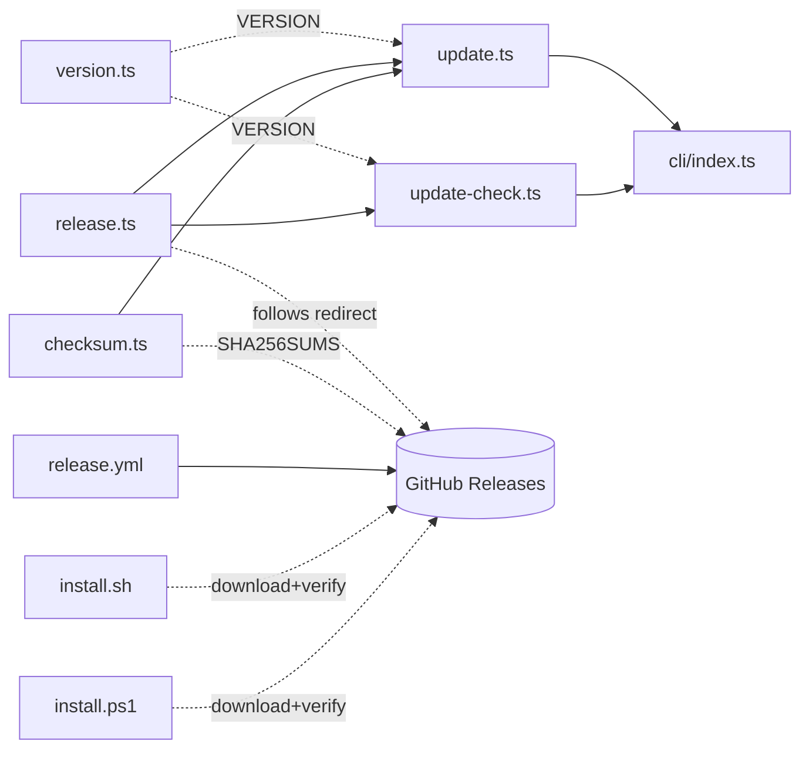
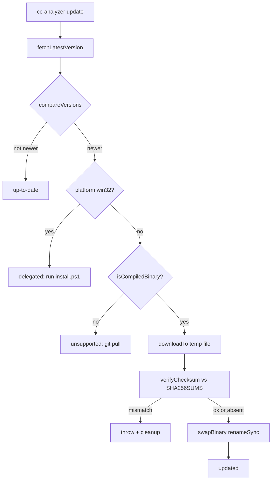

# Updates & Distribution

> Indexed at commit `bf5a4c8` on 2026-07-12 · [view on GitHub](https://github.com/yorch/cc-analyzer/tree/bf5a4c8)

## Relevant source files

- [src/core/version.ts](https://github.com/yorch/cc-analyzer/blob/bf5a4c8/src/core/version.ts)
- [src/core/release.ts](https://github.com/yorch/cc-analyzer/blob/bf5a4c8/src/core/release.ts)
- [src/core/update.ts](https://github.com/yorch/cc-analyzer/blob/bf5a4c8/src/core/update.ts)
- [src/core/update-check.ts](https://github.com/yorch/cc-analyzer/blob/bf5a4c8/src/core/update-check.ts)
- [src/core/checksum.ts](https://github.com/yorch/cc-analyzer/blob/bf5a4c8/src/core/checksum.ts)
- [src/cli/index.ts](https://github.com/yorch/cc-analyzer/blob/bf5a4c8/src/cli/index.ts)
- [site/public/install.sh](https://github.com/yorch/cc-analyzer/blob/bf5a4c8/site/public/install.sh)
- [site/public/install.ps1](https://github.com/yorch/cc-analyzer/blob/bf5a4c8/site/public/install.ps1)
- [.github/workflows/release.yml](https://github.com/yorch/cc-analyzer/blob/bf5a4c8/.github/workflows/release.yml)

## Overview

`cc-analyzer` ships as a single self-contained executable, one per platform and architecture, built by `bun build --compile`. This subsystem owns everything about getting that binary onto a machine and keeping it current: shell installers that download and verify a release asset, a `cc-analyzer update` command that replaces the running binary in place, a passive once-a-day "update available" notice, and the GitHub Actions workflow that compiles and publishes the assets plus a checksum manifest. Version discovery deliberately avoids the GitHub Application Programming Interface (API): both the installers and the runtime resolve the latest release by following the `/releases/latest` redirect, which needs no token and is not rate-limited ([src/core/release.ts:L1-L10](https://github.com/yorch/cc-analyzer/blob/bf5a4c8/src/core/release.ts#L1-L10), [site/public/install.sh:L41-L49](https://github.com/yorch/cc-analyzer/blob/bf5a4c8/site/public/install.sh#L41-L49)).

Integrity is guarded by SHA-256 checksums published in a `SHA256SUMS` manifest alongside each release. Every download path — the two installers and the in-binary updater — verifies the downloaded asset against that manifest before installing it. The checksum defends against corrupted or partially tampered downloads served over HyperText Transfer Protocol Secure (HTTPS); because the manifest is served from the same release as the binary, it is not a cryptographic signature and does not defend against a fully compromised release ([src/core/checksum.ts:L1-L9](https://github.com/yorch/cc-analyzer/blob/bf5a4c8/src/core/checksum.ts#L1-L9)).

## Architecture

The runtime side centers on three helpers — `release.ts` resolves versions and builds asset Uniform Resource Locators (URLs), `checksum.ts` parses and verifies the manifest, and `version.ts` supplies the running version — which `update.ts` and `update-check.ts` compose into the interactive updater and the passive notice. Both surface through `cli/index.ts`. The distribution side is independent: `release.yml` produces the assets and manifest that the two shell installers, and the runtime updater, all consume from GitHub Releases ([src/core/update.ts:L1-L11](https://github.com/yorch/cc-analyzer/blob/bf5a4c8/src/core/update.ts#L1-L11), [.github/workflows/release.yml:L26-L49](https://github.com/yorch/cc-analyzer/blob/bf5a4c8/.github/workflows/release.yml#L26-L49)).

## Module Layout

| Module | Path | Responsibility |
| ------ | ---- | -------------- |
| `version` | [src/core/version.ts](https://github.com/yorch/cc-analyzer/blob/bf5a4c8/src/core/version.ts) | Embeds the `package.json` version into the binary at build time |
| `release` | [src/core/release.ts](https://github.com/yorch/cc-analyzer/blob/bf5a4c8/src/core/release.ts) | Resolves the latest release, compares versions, maps platform to asset URLs |
| `update` | [src/core/update.ts](https://github.com/yorch/cc-analyzer/blob/bf5a4c8/src/core/update.ts) | Downloads, verifies, and atomically swaps the running binary |
| `update-check` | [src/core/update-check.ts](https://github.com/yorch/cc-analyzer/blob/bf5a4c8/src/core/update-check.ts) | Passive once-a-day cached "update available" notice |
| `checksum` | [src/core/checksum.ts](https://github.com/yorch/cc-analyzer/blob/bf5a4c8/src/core/checksum.ts) | Parses `SHA256SUMS` and computes file digests |
| CLI wiring | [src/cli/index.ts](https://github.com/yorch/cc-analyzer/blob/bf5a4c8/src/cli/index.ts) | `update`, `version`, and post-command notice dispatch |
| POSIX installer | [site/public/install.sh](https://github.com/yorch/cc-analyzer/blob/bf5a4c8/site/public/install.sh) | macOS/Linux download, verify, and install |
| Windows installer | [site/public/install.ps1](https://github.com/yorch/cc-analyzer/blob/bf5a4c8/site/public/install.ps1) | Windows PowerShell download, verify, and install |
| Release workflow | [.github/workflows/release.yml](https://github.com/yorch/cc-analyzer/blob/bf5a4c8/.github/workflows/release.yml) | Compiles cross-platform binaries and publishes them with checksums |

Sources: [src/core/version.ts:L1-L8](https://github.com/yorch/cc-analyzer/blob/bf5a4c8/src/core/version.ts#L1-L8) [src/core/release.ts:L1-L68](https://github.com/yorch/cc-analyzer/blob/bf5a4c8/src/core/release.ts#L1-L68) [src/core/update.ts:L1-L138](https://github.com/yorch/cc-analyzer/blob/bf5a4c8/src/core/update.ts#L1-L138)

## Key Components

### Version embedding

`version.ts` imports `package.json` and re-exports its `version` field as the `VERSION` constant ([src/core/version.ts:L1-L8](https://github.com/yorch/cc-analyzer/blob/bf5a4c8/src/core/version.ts#L1-L8)). Because `bun build --compile` bundles the JavaScript Object Notation (JSON) import into the standalone binary, the compiled executable knows its own version without a manifest on disk; running from source reads the same file. `VERSION` backs the `cc-analyzer version`, `--version`, and `-v` commands, the help banner, and every comparison against the latest release ([src/cli/index.ts:L212-L216](https://github.com/yorch/cc-analyzer/blob/bf5a4c8/src/cli/index.ts#L212-L216), [src/cli/index.ts:L22-L22](https://github.com/yorch/cc-analyzer/blob/bf5a4c8/src/cli/index.ts#L22)).

Sources: [src/core/version.ts:L1-L8](https://github.com/yorch/cc-analyzer/blob/bf5a4c8/src/core/version.ts#L1-L8) [src/cli/index.ts:L212-L216](https://github.com/yorch/cc-analyzer/blob/bf5a4c8/src/cli/index.ts#L212-L216)

### Release resolution and asset mapping

`release.ts` resolves the latest published version in `fetchLatestVersion`, which issues a `HEAD` request to `LATEST_RELEASE_URL` with `redirect: "follow"` and reads the tag from the final URL, throwing if the tag does not parse as a dotted version ([src/core/release.ts:L56-L68](https://github.com/yorch/cc-analyzer/blob/bf5a4c8/src/core/release.ts#L56-L68)). The request is bounded by an `AbortSignal.timeout`; the default is 10 seconds for a user-invoked update, and the passive check passes a 1-second timeout of its own. `normalizeVersion` strips a leading `v` and whitespace, and `compareVersions` compares two dotted versions numerically component by component, returning `-1`, `0`, or `1` ([src/core/release.ts:L13-L28](https://github.com/yorch/cc-analyzer/blob/bf5a4c8/src/core/release.ts#L13-L28)).

`assetName` maps a platform and architecture to a published asset filename. Windows always resolves to `cc-analyzer-windows-x64.exe` (the x64 binary runs on ARM64 via emulation), while `darwin` and `linux` each pair with `arm64` or `x64`; unsupported combinations return `undefined` ([src/core/release.ts:L30-L38](https://github.com/yorch/cc-analyzer/blob/bf5a4c8/src/core/release.ts#L30-L38)). `assetDownloadUrl` builds a direct `releases/download/v<version>/<asset>` URL, and `checksumsUrl` is that same helper applied to the `SHA256SUMS` asset ([src/core/release.ts:L40-L48](https://github.com/yorch/cc-analyzer/blob/bf5a4c8/src/core/release.ts#L40-L48)).

Sources: [src/core/release.ts:L13-L68](https://github.com/yorch/cc-analyzer/blob/bf5a4c8/src/core/release.ts#L13-L68)

### Checksum verification

`checksum.ts` handles the `SHA256SUMS` manifest in the standard `sha256sum` format. `parseChecksums` reads each line, matching a 64-character hex digest followed by a filename (tolerating the binary-mode `*` prefix), and returns a `Map` of filename to lowercase hex ([src/core/checksum.ts:L11-L21](https://github.com/yorch/cc-analyzer/blob/bf5a4c8/src/core/checksum.ts#L11-L21)). `expectedHash` looks up an asset in that map, and `fileSha256` computes a file's digest with `Bun.CryptoHasher` ([src/core/checksum.ts:L23-L33](https://github.com/yorch/cc-analyzer/blob/bf5a4c8/src/core/checksum.ts#L23-L33)). Verification is best-effort by design: it protects against corrupted downloads and partial tampering, but since the manifest ships from the same release as the binary it is not a substitute for signing ([src/core/checksum.ts:L1-L9](https://github.com/yorch/cc-analyzer/blob/bf5a4c8/src/core/checksum.ts#L1-L9)).

Sources: [src/core/checksum.ts:L1-L33](https://github.com/yorch/cc-analyzer/blob/bf5a4c8/src/core/checksum.ts#L1-L33)

### In-place self-update

`performUpdate` orchestrates the runtime update. It resolves the latest version, returns `up-to-date` when `compareVersions` shows nothing newer, then branches on environment: on Windows it returns `delegated` with a hint to re-run the PowerShell installer, and when the process is not a compiled binary it returns `unsupported` with a `git pull` hint ([src/core/update.ts:L70-L98](https://github.com/yorch/cc-analyzer/blob/bf5a4c8/src/core/update.ts#L70-L98)). `isCompiledBinary` distinguishes a standalone binary from `bun run` by checking for the `$bunfs` marker in `import.meta.url`, falling back to an `execPath` basename check that rejects `bun`/`node` ([src/core/update.ts:L19-L23](https://github.com/yorch/cc-analyzer/blob/bf5a4c8/src/core/update.ts#L19-L23)).

For a supported binary, it downloads the asset to a temporary file beside `process.execPath`, calls `verifyChecksum`, then `swapBinary`. `verifyChecksum` fetches the manifest and silently returns when it is absent, unfetchable, or does not list the asset, but throws on a real hash mismatch so a corrupted or tampered download is never installed ([src/core/update.ts:L46-L67](https://github.com/yorch/cc-analyzer/blob/bf5a4c8/src/core/update.ts#L46-L67)). `swapBinary` chmods the temp file to `0o755` and `renameSync`s it over the target; the rename is atomic on the same filesystem and can replace the running executable on macOS and Linux ([src/core/update.ts:L32-L38](https://github.com/yorch/cc-analyzer/blob/bf5a4c8/src/core/update.ts#L32-L38)). On failure the temp file is removed, and an `EACCES`/`EPERM` error is rethrown as a permission-denied message pointing at the installer and `CC_ANALYZER_INSTALL_DIR` ([src/core/update.ts:L112-L130](https://github.com/yorch/cc-analyzer/blob/bf5a4c8/src/core/update.ts#L112-L130)).

Sources: [src/core/update.ts:L19-L138](https://github.com/yorch/cc-analyzer/blob/bf5a4c8/src/core/update.ts#L19-L138)

### Passive update notice

`update-check.ts` prints an "update available" line without ever delaying output or affecting the exit code. `maybeNotifyUpdate` first checks `notifyEnabled`, which suppresses the check when `CC_ANALYZER_NO_UPDATE_CHECK` or `CI` is set, or when stderr is not a Teletype (TTY) ([src/core/update-check.ts:L20-L24](https://github.com/yorch/cc-analyzer/blob/bf5a4c8/src/core/update-check.ts#L20-L24)). It reads a cache from `updateCachePath`, and when the cache is missing or `isStale` (older than one day) it refreshes via `fetchLatestVersion(1000)` and writes the result back, falling back to the cached value if the network is slow or offline ([src/core/update-check.ts:L64-L79](https://github.com/yorch/cc-analyzer/blob/bf5a4c8/src/core/update-check.ts#L64-L79)). `updateNotice` returns the one-line message only when the latest version is newer, and the whole function is wrapped so it never throws ([src/core/update-check.ts:L31-L35](https://github.com/yorch/cc-analyzer/blob/bf5a4c8/src/core/update-check.ts#L31-L35), [src/core/update-check.ts:L85-L88](https://github.com/yorch/cc-analyzer/blob/bf5a4c8/src/core/update-check.ts#L85-L88)).

Sources: [src/core/update-check.ts:L20-L88](https://github.com/yorch/cc-analyzer/blob/bf5a4c8/src/core/update-check.ts#L20-L88)

### CLI wiring

`cmdUpdate` implements `cc-analyzer update [--check]`. With `--check` it prints whether a newer version exists and always exits `0`; otherwise it runs `performUpdate`, prints the result message, and returns `1` only for an `unsupported` status ([src/cli/index.ts:L158-L179](https://github.com/yorch/cc-analyzer/blob/bf5a4c8/src/cli/index.ts#L158-L179)). The passive notice is fired from `main` after the command completes: for commands in `NOTIFY_COMMANDS` — `projects`, `sessions`, `analyze`, `index`, `stats`, `pricing` — and only when `--json` is absent, `main` awaits `maybeNotifyUpdate` before returning the exit code ([src/cli/index.ts:L182-L182](https://github.com/yorch/cc-analyzer/blob/bf5a4c8/src/cli/index.ts#L182), [src/cli/index.ts:L234-L242](https://github.com/yorch/cc-analyzer/blob/bf5a4c8/src/cli/index.ts#L234-L242)).

Sources: [src/cli/index.ts:L158-L182](https://github.com/yorch/cc-analyzer/blob/bf5a4c8/src/cli/index.ts#L158-L182) [src/cli/index.ts:L234-L242](https://github.com/yorch/cc-analyzer/blob/bf5a4c8/src/cli/index.ts#L234-L242)

### Shell installers

`install.sh` installs on macOS and Linux. It detects the operating system and architecture with `uname`, maps them to an asset name matching `assetName`, and resolves the download base from either `releases/latest/download` or a pinned `CC_ANALYZER_VERSION` ([site/public/install.sh:L24-L49](https://github.com/yorch/cc-analyzer/blob/bf5a4c8/site/public/install.sh#L24-L49)). After downloading to a `mktemp` file, `verify_checksum` fetches `SHA256SUMS`, extracts the expected hash with `awk`, and computes the actual hash using whichever of `sha256sum` or `shasum` is present, skipping gracefully when the manifest, the entry, or a hashing tool is unavailable and aborting on a mismatch ([site/public/install.sh:L60-L81](https://github.com/yorch/cc-analyzer/blob/bf5a4c8/site/public/install.sh#L60-L81)). It then installs to `CC_ANALYZER_INSTALL_DIR` (default `$HOME/.local/bin`) and prints PATH guidance when that directory is not already on `PATH` ([site/public/install.sh:L83-L99](https://github.com/yorch/cc-analyzer/blob/bf5a4c8/site/public/install.sh#L83-L99)).

`install.ps1` mirrors this on Windows. It always targets the `cc-analyzer-windows-x64.exe` asset, downloads with `Invoke-WebRequest`, and verifies with `Get-FileHash`, treating a missing manifest (a `WebException`) or an unlisted asset as a skip and a mismatch as a fatal error ([site/public/install.ps1:L15-L51](https://github.com/yorch/cc-analyzer/blob/bf5a4c8/site/public/install.ps1#L15-L51)). The default install directory is `%LOCALAPPDATA%\cc-analyzer\bin`, and it prints per-user PATH guidance for new terminals ([site/public/install.ps1:L12-L13](https://github.com/yorch/cc-analyzer/blob/bf5a4c8/site/public/install.ps1#L12-L13), [site/public/install.ps1:L56-L62](https://github.com/yorch/cc-analyzer/blob/bf5a4c8/site/public/install.ps1#L56-L62)).

Sources: [site/public/install.sh:L24-L99](https://github.com/yorch/cc-analyzer/blob/bf5a4c8/site/public/install.sh#L24-L99) [site/public/install.ps1:L15-L62](https://github.com/yorch/cc-analyzer/blob/bf5a4c8/site/public/install.ps1#L15-L62)

### Release workflow

`release.yml` runs on any `v*` tag push with `contents: write` permission. It installs dependencies, builds and embeds the web User Interface (UI), then compiles five binaries with `bun build --compile --minify` across the `bun-linux-x64`, `bun-linux-arm64`, `bun-darwin-x64`, `bun-darwin-arm64`, and `bun-windows-x64` targets into `dist/` ([.github/workflows/release.yml:L1-L44](https://github.com/yorch/cc-analyzer/blob/bf5a4c8/.github/workflows/release.yml#L1-L44)). It generates the manifest by running `sha256sum cc-analyzer-* > SHA256SUMS` from inside `dist/` so entries are basenames, then publishes all binaries plus `SHA256SUMS` with `gh release create --generate-notes` ([.github/workflows/release.yml:L46-L60](https://github.com/yorch/cc-analyzer/blob/bf5a4c8/.github/workflows/release.yml#L46-L60)). The basename detail is what makes the manifest match the asset names the installers and updater look up.

Sources: [.github/workflows/release.yml:L1-L60](https://github.com/yorch/cc-analyzer/blob/bf5a4c8/.github/workflows/release.yml#L1-L60)

## Data Flow

The updater short-circuits at each decision before touching the filesystem: version comparison first, then the Windows and from-source branches, and only then the download-verify-swap sequence that ends in an atomic rename over the running binary ([src/core/update.ts:L70-L138](https://github.com/yorch/cc-analyzer/blob/bf5a4c8/src/core/update.ts#L70-L138)).

Sources: [src/core/update.ts:L70-L138](https://github.com/yorch/cc-analyzer/blob/bf5a4c8/src/core/update.ts#L70-L138) [src/core/release.ts:L30-L48](https://github.com/yorch/cc-analyzer/blob/bf5a4c8/src/core/release.ts#L30-L48)

## Configuration & Extension Points

| Setting | Type | Default | Purpose |
| ------- | ---- | ------- | ------- |
| `CC_ANALYZER_NO_UPDATE_CHECK` | env | unset | Disables the passive update notice ([src/core/update-check.ts:L21-L21](https://github.com/yorch/cc-analyzer/blob/bf5a4c8/src/core/update-check.ts#L21)) |
| `CI` | env | unset | Suppresses the passive notice in continuous-integration environments ([src/core/update-check.ts:L22-L22](https://github.com/yorch/cc-analyzer/blob/bf5a4c8/src/core/update-check.ts#L22)) |
| `CC_ANALYZER_VERSION` | env | `latest` | Pins the release tag the installers download ([site/public/install.sh:L14-L14](https://github.com/yorch/cc-analyzer/blob/bf5a4c8/site/public/install.sh#L14), [site/public/install.ps1:L13-L13](https://github.com/yorch/cc-analyzer/blob/bf5a4c8/site/public/install.ps1#L13)) |
| `CC_ANALYZER_INSTALL_DIR` | env | `$HOME/.local/bin` / `%LOCALAPPDATA%\cc-analyzer\bin` | Overrides the install directory ([site/public/install.sh:L13-L13](https://github.com/yorch/cc-analyzer/blob/bf5a4c8/site/public/install.sh#L13), [site/public/install.ps1:L12-L12](https://github.com/yorch/cc-analyzer/blob/bf5a4c8/site/public/install.ps1#L12)) |
| `--check` | flag | off | `cc-analyzer update --check` reports availability without installing ([src/cli/index.ts:L158-L171](https://github.com/yorch/cc-analyzer/blob/bf5a4c8/src/cli/index.ts#L158-L171)) |

Sources: [src/core/update-check.ts:L20-L24](https://github.com/yorch/cc-analyzer/blob/bf5a4c8/src/core/update-check.ts#L20-L24) [site/public/install.sh:L11-L14](https://github.com/yorch/cc-analyzer/blob/bf5a4c8/site/public/install.sh#L11-L14) [site/public/install.ps1:L10-L13](https://github.com/yorch/cc-analyzer/blob/bf5a4c8/site/public/install.ps1#L10-L13)

## Related Pages

- Core analysis engine: [Core Analysis Engine](./2-core-analysis-engine.md)
- Command-line interface: [CLI](./3-cli.md)
- Terminal UI: [TUI](./4-tui.md)
- Local web server: [Web Server and API](./5-web-server-and-api.md)
- Documentation site: [Docs Site](./8-docs-site.md)
