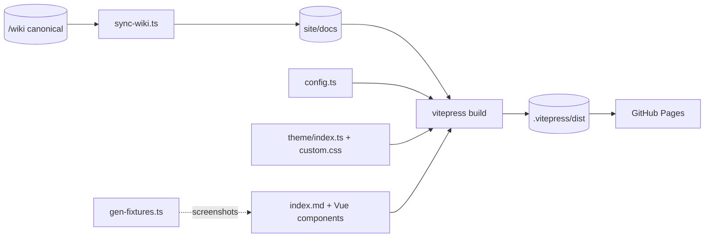
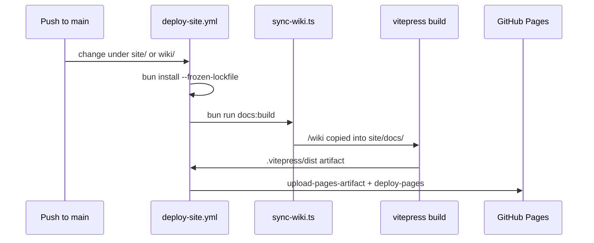

# Docs Site

> Indexed at commit `bf5a4c8` on 2026-07-12 · [view on GitHub](https://github.com/yorch/cc-analyzer/tree/bf5a4c8)

## Relevant source files

- [site/.vitepress/config.ts](https://github.com/yorch/cc-analyzer/blob/bf5a4c8/site/.vitepress/config.ts)
- [site/index.md](https://github.com/yorch/cc-analyzer/blob/bf5a4c8/site/index.md)
- [site/.vitepress/theme/index.ts](https://github.com/yorch/cc-analyzer/blob/bf5a4c8/site/.vitepress/theme/index.ts)
- [site/.vitepress/theme/Layout.vue](https://github.com/yorch/cc-analyzer/blob/bf5a4c8/site/.vitepress/theme/Layout.vue)
- [site/.vitepress/theme/custom.css](https://github.com/yorch/cc-analyzer/blob/bf5a4c8/site/.vitepress/theme/custom.css)
- [site/.vitepress/theme/components/TerminalHero.vue](https://github.com/yorch/cc-analyzer/blob/bf5a4c8/site/.vitepress/theme/components/TerminalHero.vue)
- [site/.vitepress/theme/components/TerminalModules.vue](https://github.com/yorch/cc-analyzer/blob/bf5a4c8/site/.vitepress/theme/components/TerminalModules.vue)
- [site/.vitepress/theme/components/CommandDeck.vue](https://github.com/yorch/cc-analyzer/blob/bf5a4c8/site/.vitepress/theme/components/CommandDeck.vue)
- [site/scripts/sync-wiki.ts](https://github.com/yorch/cc-analyzer/blob/bf5a4c8/site/scripts/sync-wiki.ts)
- [site/scripts/gen-fixtures.ts](https://github.com/yorch/cc-analyzer/blob/bf5a4c8/site/scripts/gen-fixtures.ts)
- [site/package.json](https://github.com/yorch/cc-analyzer/blob/bf5a4c8/site/package.json)
- [site/README.md](https://github.com/yorch/cc-analyzer/blob/bf5a4c8/site/README.md)
- [site/GOTCHAS.md](https://github.com/yorch/cc-analyzer/blob/bf5a4c8/site/GOTCHAS.md)
- [.github/workflows/deploy-site.yml](https://github.com/yorch/cc-analyzer/blob/bf5a4c8/.github/workflows/deploy-site.yml)

## Overview

The `site/` directory holds the source for the project's GitHub Pages site at `https://yorch.github.io/cc-analyzer/`: a marketing landing page plus the full wiki rendered as browsable docs, built with VitePress. It is an isolated toolchain with its own `package.json` and lockfile so that VitePress's Vite 5 does not collide with the Single-Page Application's (SPA) Vite 8 in the repository root, as [site/README.md#L5-L7](https://github.com/yorch/cc-analyzer/blob/bf5a4c8/site/README.md#L5-L7) states. The dependency set is deliberately small — `vitepress`, `vitepress-plugin-mermaid`, `mermaid`, and the IBM Plex Mono webfont — declared in [site/package.json#L12-L17](https://github.com/yorch/cc-analyzer/blob/bf5a4c8/site/package.json#L12-L17).

The site has two content halves. The landing page (`/`) is a custom-built, amber-phosphor Cathode-Ray Tube (CRT) experience assembled from three Vue components, and the docs section (`/docs/`) is the canonical `/wiki` copied in at build time. The `/wiki` directory at the repository root is the single source of truth for docs; [site/scripts/sync-wiki.ts](https://github.com/yorch/cc-analyzer/blob/bf5a4c8/site/scripts/sync-wiki.ts) copies it into `site/docs/` on every build with filename and link transforms that make it route cleanly in VitePress.

Sources: [site/README.md:L1-L51](https://github.com/yorch/cc-analyzer/blob/bf5a4c8/site/README.md#L1-L51) [site/package.json:L1-L18](https://github.com/yorch/cc-analyzer/blob/bf5a4c8/site/package.json#L1-L18) [site/.vitepress/config.ts:L1-L94](https://github.com/yorch/cc-analyzer/blob/bf5a4c8/site/.vitepress/config.ts#L1-L94)

## Architecture

The build pipeline has two inputs that converge at `vitepress build`: the docs content, which flows from the canonical `/wiki` through [site/scripts/sync-wiki.ts](https://github.com/yorch/cc-analyzer/blob/bf5a4c8/site/scripts/sync-wiki.ts) into the git-ignored `site/docs/`, and the landing page plus theme, which are hand-authored under `site/`. The `docs:build` script chains `sync` before `vitepress build` so the copy is always fresh, per [site/package.json#L8-L9](https://github.com/yorch/cc-analyzer/blob/bf5a4c8/site/package.json#L8-L9). [site/scripts/gen-fixtures.ts](https://github.com/yorch/cc-analyzer/blob/bf5a4c8/site/scripts/gen-fixtures.ts) is an offline helper that produces a synthetic dataset for privacy-safe screenshots and does not run in the build.

Sources: [site/package.json:L6-L11](https://github.com/yorch/cc-analyzer/blob/bf5a4c8/site/package.json#L6-L11) [site/scripts/sync-wiki.ts:L1-L54](https://github.com/yorch/cc-analyzer/blob/bf5a4c8/site/scripts/sync-wiki.ts#L1-L54) [.github/workflows/deploy-site.yml:L36-L46](https://github.com/yorch/cc-analyzer/blob/bf5a4c8/.github/workflows/deploy-site.yml#L36-L46)

## Module Layout

| Module | Path | Responsibility |
| ------ | ---- | -------------- |
| Site config | [site/.vitepress/config.ts](https://github.com/yorch/cc-analyzer/blob/bf5a4c8/site/.vitepress/config.ts) | VitePress config: base path, Mermaid theming, nav, hand-defined docs sidebar |
| Theme entry | [site/.vitepress/theme/index.ts](https://github.com/yorch/cc-analyzer/blob/bf5a4c8/site/.vitepress/theme/index.ts) | Extends the default theme, registers landing components, loads fonts and CSS |
| Layout wrapper | [site/.vitepress/theme/Layout.vue](https://github.com/yorch/cc-analyzer/blob/bf5a4c8/site/.vitepress/theme/Layout.vue) | Injects the full-viewport CRT scanline overlay |
| Theme CSS | [site/.vitepress/theme/custom.css](https://github.com/yorch/cc-analyzer/blob/bf5a4c8/site/.vitepress/theme/custom.css) | Amber-phosphor design tokens mapped onto VitePress variables |
| Landing page | [site/index.md](https://github.com/yorch/cc-analyzer/blob/bf5a4c8/site/index.md) | `layout: page` shell composing the three landing components |
| Landing components | [site/.vitepress/theme/components/](https://github.com/yorch/cc-analyzer/blob/bf5a4c8/site/.vitepress/theme/components/TerminalHero.vue) | `TerminalHero`, `TerminalModules`, `CommandDeck` |
| Wiki sync | [site/scripts/sync-wiki.ts](https://github.com/yorch/cc-analyzer/blob/bf5a4c8/site/scripts/sync-wiki.ts) | Copies `/wiki` into `site/docs/` with filename and link rewrites |
| Fixture generator | [site/scripts/gen-fixtures.ts](https://github.com/yorch/cc-analyzer/blob/bf5a4c8/site/scripts/gen-fixtures.ts) | Builds a synthetic `~/.claude` dataset for stable screenshots |
| Deploy workflow | [.github/workflows/deploy-site.yml](https://github.com/yorch/cc-analyzer/blob/bf5a4c8/.github/workflows/deploy-site.yml) | Builds and publishes to GitHub Pages on relevant pushes |

Sources: [site/.vitepress/config.ts:L1-L94](https://github.com/yorch/cc-analyzer/blob/bf5a4c8/site/.vitepress/config.ts#L1-L94) [site/.vitepress/theme/index.ts:L1-L23](https://github.com/yorch/cc-analyzer/blob/bf5a4c8/site/.vitepress/theme/index.ts#L1-L23) [site/scripts/sync-wiki.ts:L1-L54](https://github.com/yorch/cc-analyzer/blob/bf5a4c8/site/scripts/sync-wiki.ts#L1-L54)

## Key Components

### VitePress configuration

[site/.vitepress/config.ts](https://github.com/yorch/cc-analyzer/blob/bf5a4c8/site/.vitepress/config.ts) wraps the config in `withMermaid` so Mermaid fences render natively, and sets `base: "/cc-analyzer/"` for the project-subpath Pages deployment along with `cleanUrls`, `lastUpdated`, and a forced-`dark` default appearance at [config.ts#L4-L15](https://github.com/yorch/cc-analyzer/blob/bf5a4c8/site/.vitepress/config.ts#L4-L15). The `mermaid.themeVariables` block tunes diagrams for the light "print-out" palette — cream nodes, amber-ink borders, monospace labels — at [config.ts#L21-L38](https://github.com/yorch/cc-analyzer/blob/bf5a4c8/site/.vitepress/config.ts#L21-L38); the dark render is repainted separately in CSS because the plugin owns the dark Mermaid theme.

The docs sidebar is defined by hand under the `/docs/` key at [config.ts#L46-L77](https://github.com/yorch/cc-analyzer/blob/bf5a4c8/site/.vitepress/config.ts#L46-L77), enumerating every wiki page including the nested `2.1`–`2.3` detail pages using their transformed `2-1-` slugs. Because this list is not derived from the wiki, it must be updated by hand whenever the wiki's page set changes, as [site/README.md#L30-L31](https://github.com/yorch/cc-analyzer/blob/bf5a4c8/site/README.md#L30-L31) notes. The `editLink` points contributors back to `wiki/:path` on `main`, reinforcing that the wiki is the edit target rather than `site/docs/`, per [config.ts#L83-L86](https://github.com/yorch/cc-analyzer/blob/bf5a4c8/site/.vitepress/config.ts#L83-L86).

Sources: [site/.vitepress/config.ts:L1-L94](https://github.com/yorch/cc-analyzer/blob/bf5a4c8/site/.vitepress/config.ts#L1-L94) [site/README.md:L30-L31](https://github.com/yorch/cc-analyzer/blob/bf5a4c8/site/README.md#L30-L31)

### Wiki sync bridge

[site/scripts/sync-wiki.ts](https://github.com/yorch/cc-analyzer/blob/bf5a4c8/site/scripts/sync-wiki.ts) is the bridge that keeps `/wiki` as the single source of truth while VitePress serves the copy. `main` reads every `.md` file from `../../wiki`, skipping the `_meta.json` and `_SIDEBAR.md` meta files, then clears and recreates `../docs` before writing each transformed page, per [sync-wiki.ts#L38-L52](https://github.com/yorch/cc-analyzer/blob/bf5a4c8/site/scripts/sync-wiki.ts#L38-L52). It throws if no wiki pages are found, guarding against a silent empty build at [sync-wiki.ts#L41](https://github.com/yorch/cc-analyzer/blob/bf5a4c8/site/scripts/sync-wiki.ts#L41).

Two transforms make the wiki route cleanly. `targetName` renames `README.md` to `index.md` (the docs-section home) and converts dotted `2.1-` prefixes to `2-1-`, since dots produce fragile VitePress routes, at [sync-wiki.ts#L25-L29](https://github.com/yorch/cc-analyzer/blob/bf5a4c8/site/scripts/sync-wiki.ts#L25-L29). `rewriteLinks` applies the matching rewrite to intra-wiki relative links so `./README.md` and `./2.1-` targets keep resolving after the rename, at [sync-wiki.ts#L31-L36](https://github.com/yorch/cc-analyzer/blob/bf5a4c8/site/scripts/sync-wiki.ts#L31-L36). The page headers and absolute GitHub citation URLs are left untouched.

Sources: [site/scripts/sync-wiki.ts:L1-L54](https://github.com/yorch/cc-analyzer/blob/bf5a4c8/site/scripts/sync-wiki.ts#L1-L54)

### Landing page and CRT theme

[site/index.md](https://github.com/yorch/cc-analyzer/blob/bf5a4c8/site/index.md) uses `layout: page` and `pageClass: cc-landing`, then drops in the three registered components `<TerminalHero />`, `<TerminalModules />`, and `<CommandDeck />` followed by a closing call-to-action, per [index.md#L1-L21](https://github.com/yorch/cc-analyzer/blob/bf5a4c8/site/index.md#L1-L21). The theme entry [site/.vitepress/theme/index.ts](https://github.com/yorch/cc-analyzer/blob/bf5a4c8/site/.vitepress/theme/index.ts) extends `DefaultTheme`, swaps in the custom `Layout`, globally registers those three components, and imports the IBM Plex Mono weights plus `custom.css` at [theme/index.ts#L15-L23](https://github.com/yorch/cc-analyzer/blob/bf5a4c8/site/.vitepress/theme/index.ts#L15-L23).

`TerminalHero` renders a wordmark, tagline, install hint, and an animated boot-sequence terminal whose sample `stats` output reveals line by line via a staggered `--i` CSS custom property, per [TerminalHero.vue#L6-L63](https://github.com/yorch/cc-analyzer/blob/bf5a4c8/site/.vitepress/theme/components/TerminalHero.vue#L6-L63). `TerminalModules` presents the six capabilities as loadable "modules" with inline line-SVG icons and no external asset requests, defined in [TerminalModules.vue#L4-L41](https://github.com/yorch/cc-analyzer/blob/bf5a4c8/site/.vitepress/theme/components/TerminalModules.vue#L4-L41). `CommandDeck` renders a scripted quick-start session where each token is tagged (`c`/`p`/`x`/`o`) for phosphor coloring, per [CommandDeck.vue#L2-L18](https://github.com/yorch/cc-analyzer/blob/bf5a4c8/site/.vitepress/theme/components/CommandDeck.vue#L2-L18).

The retro aesthetic lives in [site/.vitepress/theme/custom.css](https://github.com/yorch/cc-analyzer/blob/bf5a4c8/site/.vitepress/theme/custom.css), which defines a `--cc-*` token palette — amber phosphor on near-black in dark mode, warm amber ink on cream in light mode — and maps those tokens onto VitePress's `--vp-*` variables, per [custom.css#L18-L90](https://github.com/yorch/cc-analyzer/blob/bf5a4c8/site/.vitepress/theme/custom.css#L18-L90). [site/.vitepress/theme/Layout.vue](https://github.com/yorch/cc-analyzer/blob/bf5a4c8/site/.vitepress/theme/Layout.vue) wraps the default layout and injects a purely decorative full-viewport `cc-crt` scanline overlay via the `#layout-top` slot, at [Layout.vue#L7-L15](https://github.com/yorch/cc-analyzer/blob/bf5a4c8/site/.vitepress/theme/Layout.vue#L7-L15).

Sources: [site/index.md:L1-L21](https://github.com/yorch/cc-analyzer/blob/bf5a4c8/site/index.md#L1-L21) [site/.vitepress/theme/index.ts:L1-L23](https://github.com/yorch/cc-analyzer/blob/bf5a4c8/site/.vitepress/theme/index.ts#L1-L23) [site/.vitepress/theme/components/TerminalHero.vue:L1-L67](https://github.com/yorch/cc-analyzer/blob/bf5a4c8/site/.vitepress/theme/components/TerminalHero.vue#L1-L67) [site/.vitepress/theme/components/TerminalModules.vue:L1-L65](https://github.com/yorch/cc-analyzer/blob/bf5a4c8/site/.vitepress/theme/components/TerminalModules.vue#L1-L65) [site/.vitepress/theme/components/CommandDeck.vue:L1-L52](https://github.com/yorch/cc-analyzer/blob/bf5a4c8/site/.vitepress/theme/components/CommandDeck.vue#L1-L52) [site/.vitepress/theme/custom.css:L1-L90](https://github.com/yorch/cc-analyzer/blob/bf5a4c8/site/.vitepress/theme/custom.css#L1-L90) [site/.vitepress/theme/Layout.vue:L1-L15](https://github.com/yorch/cc-analyzer/blob/bf5a4c8/site/.vitepress/theme/Layout.vue#L1-L15)

### Screenshot fixtures

[site/scripts/gen-fixtures.ts](https://github.com/yorch/cc-analyzer/blob/bf5a4c8/site/scripts/gen-fixtures.ts) generates a synthetic `~/.claude`-shaped dataset so screenshots never expose real session data. It uses a seeded `mulberry32` pseudo-random generator so output is deterministic and screenshots stay stable across runs, per [gen-fixtures.ts#L19-L29](https://github.com/yorch/cc-analyzer/blob/bf5a4c8/site/scripts/gen-fixtures.ts#L19-L29). `buildSession` emits JSON Lines transcripts that mirror Claude Code's real shape — user prompts, assistant messages with model, tool-use, and token `usage` fields, and tool results — into project directories whose names encode the `cwd` path the way Claude Code does, per [gen-fixtures.ts#L56-L166](https://github.com/yorch/cc-analyzer/blob/bf5a4c8/site/scripts/gen-fixtures.ts#L56-L166). The app is pointed at the result with `CC_ANALYZER_CLAUDE_DIR`, as documented in [site/README.md#L34-L45](https://github.com/yorch/cc-analyzer/blob/bf5a4c8/site/README.md#L34-L45).

Sources: [site/scripts/gen-fixtures.ts:L1-L190](https://github.com/yorch/cc-analyzer/blob/bf5a4c8/site/scripts/gen-fixtures.ts#L1-L190) [site/README.md:L34-L45](https://github.com/yorch/cc-analyzer/blob/bf5a4c8/site/README.md#L34-L45)

## Data Flow

[.github/workflows/deploy-site.yml](https://github.com/yorch/cc-analyzer/blob/bf5a4c8/.github/workflows/deploy-site.yml) triggers on pushes to `main` that touch `site/**`, `wiki/**`, or the workflow file itself, and on manual `workflow_dispatch`, per [deploy-site.yml#L3-L10](https://github.com/yorch/cc-analyzer/blob/bf5a4c8/.github/workflows/deploy-site.yml#L3-L10). The `build` job runs inside `site/`, installs with a frozen lockfile using Bun 1.3.14, runs `docs:build` (which syncs the wiki then builds), and uploads `site/.vitepress/dist` as the Pages artifact at [deploy-site.yml#L23-L46](https://github.com/yorch/cc-analyzer/blob/bf5a4c8/.github/workflows/deploy-site.yml#L23-L46). A separate `deploy` job publishes the artifact via `actions/deploy-pages`, gated by `pages: write` and `id-token: write` permissions and a `pages` concurrency group that does not cancel in-progress runs, per [deploy-site.yml#L12-L21](https://github.com/yorch/cc-analyzer/blob/bf5a4c8/.github/workflows/deploy-site.yml#L12-L21).

Sources: [.github/workflows/deploy-site.yml:L1-L55](https://github.com/yorch/cc-analyzer/blob/bf5a4c8/.github/workflows/deploy-site.yml#L1-L55)

## Configuration & Extension Points

| Setting | Value | Purpose |
| ------- | ----- | ------- |
| `base` | `/cc-analyzer/` | Project-subpath prefix for all Pages URLs and assets |
| `appearance` | `dark` | Forces the amber-phosphor CRT theme as the default |
| `mermaid.theme` | `base` | Light "print-out" palette; dark render repainted in CSS |
| `themeConfig.sidebar["/docs/"]` | hand-authored list | Docs navigation; updated manually when the wiki page set changes |
| `search.provider` | `local` | Client-side local search over the docs |
| `SKIP` set | `_meta.json`, `_SIDEBAR.md` | Wiki meta files excluded from the docs copy |

The single most maintenance-sensitive point is the hand-defined `/docs/` sidebar in [config.ts#L46-L77](https://github.com/yorch/cc-analyzer/blob/bf5a4c8/site/.vitepress/config.ts#L46-L77): it is not generated from the wiki, so a regenerated wiki with a different set of pages requires a matching manual edit. Contributors changing icons, diagrams, or the preview workflow are pointed to [site/GOTCHAS.md](https://github.com/yorch/cc-analyzer/blob/bf5a4c8/site/GOTCHAS.md), which records three non-obvious VitePress/Mermaid pitfalls: feature-page icons must be passed as raw SVG strings rather than `{ svg }` objects, light Mermaid `themeVariables` leak into dark mode and must be repainted with `.dark`-scoped CSS, and `vitepress preview` serves stale content-hashed chunks after a rebuild and must be restarted, per [GOTCHAS.md#L7-L71](https://github.com/yorch/cc-analyzer/blob/bf5a4c8/site/GOTCHAS.md#L7-L71).

Sources: [site/.vitepress/config.ts:L4-L79](https://github.com/yorch/cc-analyzer/blob/bf5a4c8/site/.vitepress/config.ts#L4-L79) [site/scripts/sync-wiki.ts:L21-L36](https://github.com/yorch/cc-analyzer/blob/bf5a4c8/site/scripts/sync-wiki.ts#L21-L36) [site/GOTCHAS.md:L1-L74](https://github.com/yorch/cc-analyzer/blob/bf5a4c8/site/GOTCHAS.md#L1-L74)

## Related Pages

- Repository layout and conventions: [Repository Structure](./1-repository-structure.md)
- Binaries and install scripts served from `site/public/`: [Updates and Distribution](./7-updates-and-distribution.md)
