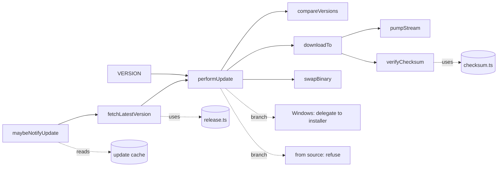
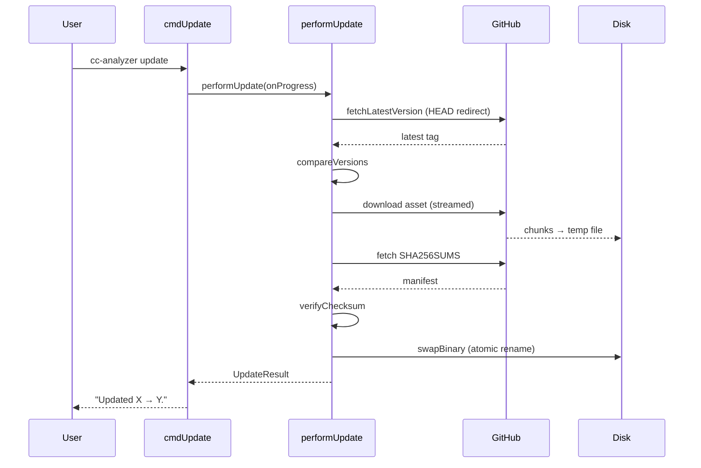

# Updates & Distribution

> Indexed at commit `51ccd4e` on 2026-07-23 · [view on GitHub](https://github.com/yorch/cc-analyzer/tree/51ccd4e)

## Relevant source files

- [src/core/version.ts](https://github.com/yorch/cc-analyzer/blob/51ccd4e/src/core/version.ts)
- [src/core/release.ts](https://github.com/yorch/cc-analyzer/blob/51ccd4e/src/core/release.ts)
- [src/core/update.ts](https://github.com/yorch/cc-analyzer/blob/51ccd4e/src/core/update.ts)
- [src/core/update-check.ts](https://github.com/yorch/cc-analyzer/blob/51ccd4e/src/core/update-check.ts)
- [src/core/checksum.ts](https://github.com/yorch/cc-analyzer/blob/51ccd4e/src/core/checksum.ts)
- [src/cli/index.ts](https://github.com/yorch/cc-analyzer/blob/51ccd4e/src/cli/index.ts)
- [site/public/install.sh](https://github.com/yorch/cc-analyzer/blob/51ccd4e/site/public/install.sh)
- [site/public/install.ps1](https://github.com/yorch/cc-analyzer/blob/51ccd4e/site/public/install.ps1)
- [.github/workflows/release.yml](https://github.com/yorch/cc-analyzer/blob/51ccd4e/.github/workflows/release.yml)

## Overview

The Updates & Distribution subsystem covers how `cc-analyzer` learns its own version, discovers newer releases, downloads and verifies them, and replaces the running binary in place. It also covers the first-install path: the shell and PowerShell scripts under [site/public/](https://github.com/yorch/cc-analyzer/blob/51ccd4e/site/public/install.sh) and the GitHub Actions workflow that compiles, checksums, and attests every release. The design centers on a single distribution channel — GitHub Releases — reached without an API token by following the `/releases/latest` redirect ([src/core/release.ts:L1-L7](https://github.com/yorch/cc-analyzer/blob/51ccd4e/src/core/release.ts#L1-L7)).

The public surface is `cc-analyzer update [--check]`, a passive once-a-day "update available" notice appended to fast commands, and the two installer scripts. `cc-analyzer` ships as a single `bun build --compile` binary, so self-update means overwriting one executable file rather than a package-manager transaction. Self-update is deliberately narrow: it runs only from a compiled binary on macOS or Linux, delegates Windows to the installer, and refuses when running from source ([src/core/update.ts:L191-L265](https://github.com/yorch/cc-analyzer/blob/51ccd4e/src/core/update.ts#L191-L265)).

## Architecture

`performUpdate()` is the orchestrator: it resolves the running `VERSION` and the latest published version, compares them, and — when a newer version exists on a supported platform — streams the asset to a temporary file, verifies its checksum, and atomically swaps it over `process.execPath` ([src/core/update.ts:L193-L265](https://github.com/yorch/cc-analyzer/blob/51ccd4e/src/core/update.ts#L193-L265)). The passive `maybeNotifyUpdate()` shares the same `fetchLatestVersion()` and `compareVersions()` but never downloads anything ([src/core/update-check.ts:L64-L92](https://github.com/yorch/cc-analyzer/blob/51ccd4e/src/core/update-check.ts#L64-L92)).

## Module Layout

| Module | Path | Responsibility |
| ------ | ---- | -------------- |
| `version` | [src/core/version.ts](https://github.com/yorch/cc-analyzer/blob/51ccd4e/src/core/version.ts) | Embeds `package.json` version into the binary as `VERSION` |
| `release` | [src/core/release.ts](https://github.com/yorch/cc-analyzer/blob/51ccd4e/src/core/release.ts) | Resolves latest version and builds asset/checksum URLs |
| `update` | [src/core/update.ts](https://github.com/yorch/cc-analyzer/blob/51ccd4e/src/core/update.ts) | Streams, verifies, and swaps the binary on self-update |
| `update-check` | [src/core/update-check.ts](https://github.com/yorch/cc-analyzer/blob/51ccd4e/src/core/update-check.ts) | Passive once-a-day "update available" notice |
| `checksum` | [src/core/checksum.ts](https://github.com/yorch/cc-analyzer/blob/51ccd4e/src/core/checksum.ts) | Parses `SHA256SUMS` and hashes downloaded files |
| CLI dispatch | [src/cli/index.ts](https://github.com/yorch/cc-analyzer/blob/51ccd4e/src/cli/index.ts) | `update` command, progress rendering, notice trigger |
| installers | [site/public/install.sh](https://github.com/yorch/cc-analyzer/blob/51ccd4e/site/public/install.sh) | First-install for macOS/Linux and Windows |
| release CI | [.github/workflows/release.yml](https://github.com/yorch/cc-analyzer/blob/51ccd4e/.github/workflows/release.yml) | Cross-compiles, checksums, attests, publishes |

Sources: [src/core/version.ts:L1-L8](https://github.com/yorch/cc-analyzer/blob/51ccd4e/src/core/version.ts#L1-L8) [src/core/release.ts:L1-L76](https://github.com/yorch/cc-analyzer/blob/51ccd4e/src/core/release.ts#L1-L76) [src/core/update.ts:L1-L265](https://github.com/yorch/cc-analyzer/blob/51ccd4e/src/core/update.ts#L1-L265)

## Key Components

### Version embedding

[src/core/version.ts](https://github.com/yorch/cc-analyzer/blob/51ccd4e/src/core/version.ts) exports `VERSION` by importing `package.json` directly. Because `bun build --compile` bundles the JSON import, the standalone binary carries its own version string; running from source reads the same file ([src/core/version.ts:L1-L8](https://github.com/yorch/cc-analyzer/blob/51ccd4e/src/core/version.ts#L1-L8)). This is why the release process requires the version bump to land on `main` before the tag — the binary's self-reported version is whatever `package.json` said at compile time. The release workflow enforces this with a guard step that fails when the tag does not match `package.json` ([.github/workflows/release.yml:L28-L36](https://github.com/yorch/cc-analyzer/blob/51ccd4e/.github/workflows/release.yml#L28-L36)).

Sources: [src/core/version.ts:L1-L8](https://github.com/yorch/cc-analyzer/blob/51ccd4e/src/core/version.ts#L1-L8) [.github/workflows/release.yml:L25-L36](https://github.com/yorch/cc-analyzer/blob/51ccd4e/.github/workflows/release.yml#L25-L36)

### Release discovery

[src/core/release.ts](https://github.com/yorch/cc-analyzer/blob/51ccd4e/src/core/release.ts) resolves the latest version without a GitHub API token. `fetchLatestVersion()` issues a `HEAD` request to `https://github.com/yorch/cc-analyzer/releases/latest` with redirects followed, then reads the tag from the final URL and extracts the leading `X.Y.Z` core so a re-cut suffixed tag still resolves ([src/core/release.ts:L62-L76](https://github.com/yorch/cc-analyzer/blob/51ccd4e/src/core/release.ts#L62-L76)). This is the same redirect trick the shell installer uses ([site/public/install.sh:L44-L57](https://github.com/yorch/cc-analyzer/blob/51ccd4e/site/public/install.sh#L44-L57)).

`compareVersions()` compares dotted versions numerically, coercing non-numeric segments such as a `-rc` suffix to `0` so a prerelease never sorts as newest ([src/core/release.ts:L18-L34](https://github.com/yorch/cc-analyzer/blob/51ccd4e/src/core/release.ts#L18-L34)). `assetName()` maps `process.platform` and `process.arch` to a published asset — `darwin`/`linux` × `arm64`/`x64`, and a single `cc-analyzer-windows-x64.exe` that runs on ARM64 via emulation ([src/core/release.ts:L37-L44](https://github.com/yorch/cc-analyzer/blob/51ccd4e/src/core/release.ts#L37-L44)). `assetDownloadUrl()` and `checksumsUrl()` build the direct download links for the asset and the `SHA256SUMS` manifest ([src/core/release.ts:L47-L54](https://github.com/yorch/cc-analyzer/blob/51ccd4e/src/core/release.ts#L47-L54)).

Sources: [src/core/release.ts:L9-L76](https://github.com/yorch/cc-analyzer/blob/51ccd4e/src/core/release.ts#L9-L76)

### Self-update

`performUpdate()` drives the whole flow. It reads `VERSION`, resolves `latest`, and returns an `up-to-date` result when the latest is not newer ([src/core/update.ts:L196-L201](https://github.com/yorch/cc-analyzer/blob/51ccd4e/src/core/update.ts#L196-L201)). On Windows it returns a `delegated` result telling the user to re-run the PowerShell installer rather than swapping the executable in place ([src/core/update.ts:L203-L212](https://github.com/yorch/cc-analyzer/blob/51ccd4e/src/core/update.ts#L203-L212)). `isCompiledBinary()` gates self-update to real binaries by checking for the `$bunfs` marker in `import.meta.url`, with an allowlist fallback on the executable basename so a renamed interpreter is never overwritten; a source checkout returns an `unsupported` result advising `git pull` ([src/core/update.ts:L19-L26](https://github.com/yorch/cc-analyzer/blob/51ccd4e/src/core/update.ts#L19-L26) [src/core/update.ts:L214-L223](https://github.com/yorch/cc-analyzer/blob/51ccd4e/src/core/update.ts#L214-L223)).

When all guards pass, the asset downloads to a per-pid temp file beside `process.execPath`, is checksum-verified, and is swapped in ([src/core/update.ts:L235-L257](https://github.com/yorch/cc-analyzer/blob/51ccd4e/src/core/update.ts#L235-L257)). `swapBinary()` `chmod`s the temp file to `0o755` and `renameSync()`s it over the target — atomic when both paths share a filesystem, and valid for replacing the running executable on macOS and Linux ([src/core/update.ts:L36-L41](https://github.com/yorch/cc-analyzer/blob/51ccd4e/src/core/update.ts#L36-L41)). Any failure removes the temp file; an `EACCES`/`EPERM` error is rewritten into a hint to re-run the installer or set `CC_ANALYZER_INSTALL_DIR` ([src/core/update.ts:L243-L257](https://github.com/yorch/cc-analyzer/blob/51ccd4e/src/core/update.ts#L243-L257)).

Sources: [src/core/update.ts:L19-L41](https://github.com/yorch/cc-analyzer/blob/51ccd4e/src/core/update.ts#L19-L41) [src/core/update.ts:L191-L265](https://github.com/yorch/cc-analyzer/blob/51ccd4e/src/core/update.ts#L191-L265)

### Streaming download with stall detection

The download streams to disk with live progress and a per-chunk stall timeout, replacing an earlier buffered download that could hang silently. `downloadTo()` bounds only the connect/headers phase with an `AbortController` on a 30-second timer, then hands the response body to `pumpStream()` ([src/core/update.ts:L108-L157](https://github.com/yorch/cc-analyzer/blob/51ccd4e/src/core/update.ts#L108-L157)). `pumpStream()` reads chunks through `withStall()`, which rejects if no chunk arrives within `stallMs` (30 seconds); the timer resets on every chunk, so a slow-but-moving download is never killed — only a true stall aborts ([src/core/update.ts:L50-L106](https://github.com/yorch/cc-analyzer/blob/51ccd4e/src/core/update.ts#L50-L106)). Each chunk is awaited into a `Bun.FileSink`, applying backpressure and surfacing disk-full errors cleanly ([src/core/update.ts:L134-L152](https://github.com/yorch/cc-analyzer/blob/51ccd4e/src/core/update.ts#L134-L152)).

`pumpStream()` reports `{ received, total }` per chunk via `onProgress`, and `downloadTo()` compares the received byte count against `Content-Length`, throwing on a short download so a cleanly-ended-but-truncated stream never installs a partial binary ([src/core/update.ts:L94-L96](https://github.com/yorch/cc-analyzer/blob/51ccd4e/src/core/update.ts#L94-L96) [src/core/update.ts:L153-L157](https://github.com/yorch/cc-analyzer/blob/51ccd4e/src/core/update.ts#L153-L157)). The CLI renders this as a live percentage line on a TTY via `renderDownloadProgress()`, kept off piped output so redirected output stays clean ([src/cli/index.ts:L172-L180](https://github.com/yorch/cc-analyzer/blob/51ccd4e/src/cli/index.ts#L172-L180)).

Sources: [src/core/update.ts:L43-L157](https://github.com/yorch/cc-analyzer/blob/51ccd4e/src/core/update.ts#L43-L157) [src/cli/index.ts:L172-L204](https://github.com/yorch/cc-analyzer/blob/51ccd4e/src/cli/index.ts#L172-L204)

### Checksum verification

[src/core/checksum.ts](https://github.com/yorch/cc-analyzer/blob/51ccd4e/src/core/checksum.ts) handles the `SHA256SUMS` manifest. `parseChecksums()` reads the standard `sha256sum` format — a 64-hex digest, whitespace, an optional `*` binary-mode marker, and the filename — into a filename-to-hash map ([src/core/checksum.ts:L12-L21](https://github.com/yorch/cc-analyzer/blob/51ccd4e/src/core/checksum.ts#L12-L21)). `expectedHash()` looks up an asset, and `fileSha256()` computes a file's lowercase-hex digest with `Bun.CryptoHasher` ([src/core/checksum.ts:L24-L33](https://github.com/yorch/cc-analyzer/blob/51ccd4e/src/core/checksum.ts#L24-L33)).

`verifyChecksum()` in [src/core/update.ts](https://github.com/yorch/cc-analyzer/blob/51ccd4e/src/core/update.ts) fetches the manifest for the target version and aborts the update if it cannot be fetched, if it lists no entry for the asset, or if the computed hash does not match ([src/core/update.ts:L159-L189](https://github.com/yorch/cc-analyzer/blob/51ccd4e/src/core/update.ts#L159-L189)). Verification is required for the self-updater: an attacker who can tamper with an asset can usually also make the manifest fetch fail, so failing open would defeat the check ([src/core/update.ts:L159-L165](https://github.com/yorch/cc-analyzer/blob/51ccd4e/src/core/update.ts#L159-L165)). This is an integrity guard, not a signature — the manifest ships from the same release, so it protects against corrupted downloads and partial tampering but is not a substitute for signing ([src/core/checksum.ts:L1-L9](https://github.com/yorch/cc-analyzer/blob/51ccd4e/src/core/checksum.ts#L1-L9)).

Sources: [src/core/checksum.ts:L1-L33](https://github.com/yorch/cc-analyzer/blob/51ccd4e/src/core/checksum.ts#L1-L33) [src/core/update.ts:L159-L189](https://github.com/yorch/cc-analyzer/blob/51ccd4e/src/core/update.ts#L159-L189)

### Passive update notice

[src/core/update-check.ts](https://github.com/yorch/cc-analyzer/blob/51ccd4e/src/core/update-check.ts) prints a passive "update available" line without ever delaying a command. `maybeNotifyUpdate()` reads a cached result for an instant notice and refreshes the cache at most once a day with a short 1-second-timeout request at the tail of the command ([src/core/update-check.ts:L6-L10](https://github.com/yorch/cc-analyzer/blob/51ccd4e/src/core/update-check.ts#L6-L10) [src/core/update-check.ts:L64-L92](https://github.com/yorch/cc-analyzer/blob/51ccd4e/src/core/update-check.ts#L64-L92)). `notifyEnabled()` gates it off when `CC_ANALYZER_NO_UPDATE_CHECK` or `CI` is set, or when stderr is not a TTY ([src/core/update-check.ts:L20-L24](https://github.com/yorch/cc-analyzer/blob/51ccd4e/src/core/update-check.ts#L20-L24)). The whole function is wrapped so it never throws and never affects the exit code ([src/core/update-check.ts:L64-L92](https://github.com/yorch/cc-analyzer/blob/51ccd4e/src/core/update-check.ts#L64-L92)).

The CLI triggers the notice only for a fixed set of quick commands and only when `--json` is absent, so structured output is never polluted ([src/cli/index.ts:L206-L207](https://github.com/yorch/cc-analyzer/blob/51ccd4e/src/cli/index.ts#L206-L207) [src/cli/index.ts:L272-L276](https://github.com/yorch/cc-analyzer/blob/51ccd4e/src/cli/index.ts#L272-L276)). When a fetch fails, the cache keeps any previously known version and advances `lastCheck`, so an offline user does not pay the timeout on every command for the rest of the day ([src/core/update-check.ts:L72-L83](https://github.com/yorch/cc-analyzer/blob/51ccd4e/src/core/update-check.ts#L72-L83)).

Sources: [src/core/update-check.ts:L1-L92](https://github.com/yorch/cc-analyzer/blob/51ccd4e/src/core/update-check.ts#L1-L92) [src/cli/index.ts:L206-L276](https://github.com/yorch/cc-analyzer/blob/51ccd4e/src/cli/index.ts#L206-L276)

## Data Flow

`cmdUpdate()` handles `--check` by resolving the latest version and printing whether an update exists, without downloading; otherwise it calls `performUpdate()` with the progress renderer and prints the result message, exiting non-zero only when the status is `unsupported` ([src/cli/index.ts:L182-L204](https://github.com/yorch/cc-analyzer/blob/51ccd4e/src/cli/index.ts#L182-L204)).

Sources: [src/cli/index.ts:L182-L204](https://github.com/yorch/cc-analyzer/blob/51ccd4e/src/cli/index.ts#L182-L204) [src/core/update.ts:L191-L265](https://github.com/yorch/cc-analyzer/blob/51ccd4e/src/core/update.ts#L191-L265)

## First-install scripts and release build

The installers mirror the self-updater's logic for users who have no binary yet. [site/public/install.sh](https://github.com/yorch/cc-analyzer/blob/51ccd4e/site/public/install.sh) detects OS and architecture, pins `latest` to a concrete tag via the same redirect, restricts transfers to HTTPS with no protocol downgrade, and verifies the checksum with whichever of `sha256sum` or `shasum` is present ([site/public/install.sh:L24-L90](https://github.com/yorch/cc-analyzer/blob/51ccd4e/site/public/install.sh#L24-L90)). The Windows script uses `Invoke-WebRequest` and `Get-FileHash`, and cleans its temp file on every failure path ([site/public/install.ps1:L26-L63](https://github.com/yorch/cc-analyzer/blob/51ccd4e/site/public/install.ps1#L26-L63)). Unlike the self-updater, both installers skip verification gracefully for releases that predate the manifest ([site/public/install.sh:L69-L90](https://github.com/yorch/cc-analyzer/blob/51ccd4e/site/public/install.sh#L69-L90) [site/public/install.ps1:L36-L57](https://github.com/yorch/cc-analyzer/blob/51ccd4e/site/public/install.ps1#L36-L57)).

[.github/workflows/release.yml](https://github.com/yorch/cc-analyzer/blob/51ccd4e/.github/workflows/release.yml) runs on `v*` tags. It verifies the tag matches `package.json`, embeds the web UI, and cross-compiles five binaries — Linux and macOS on x64 and arm64, plus Windows x64 ([.github/workflows/release.yml:L28-L62](https://github.com/yorch/cc-analyzer/blob/51ccd4e/.github/workflows/release.yml#L28-L62)). It then generates `SHA256SUMS` from the `dist/` basenames and publishes the release with the binaries and manifest attached ([.github/workflows/release.yml:L64-L85](https://github.com/yorch/cc-analyzer/blob/51ccd4e/.github/workflows/release.yml#L64-L85)). The workflow also runs `actions/attest-build-provenance`, which signs each binary with a workflow identity via OpenID Connect (OIDC) that in-job code cannot forge, verifiable with `gh attestation verify` ([.github/workflows/release.yml:L7-L14](https://github.com/yorch/cc-analyzer/blob/51ccd4e/.github/workflows/release.yml#L7-L14) [.github/workflows/release.yml:L70-L76](https://github.com/yorch/cc-analyzer/blob/51ccd4e/.github/workflows/release.yml#L70-L76)). The checksums guard integrity; the provenance attestation adds supply-chain traceability that the same-job manifest cannot.

Sources: [site/public/install.sh:L1-L111](https://github.com/yorch/cc-analyzer/blob/51ccd4e/site/public/install.sh#L1-L111) [site/public/install.ps1:L1-L75](https://github.com/yorch/cc-analyzer/blob/51ccd4e/site/public/install.ps1#L1-L75) [.github/workflows/release.yml:L1-L85](https://github.com/yorch/cc-analyzer/blob/51ccd4e/.github/workflows/release.yml#L1-L85)

## Related Pages

- Command dispatch: [CLI](./3-cli.md)
- Core building blocks: [Core Analysis Engine](./2-core-analysis-engine.md)
- Documentation and install site: [Docs Site](./9-docs-site.md)
