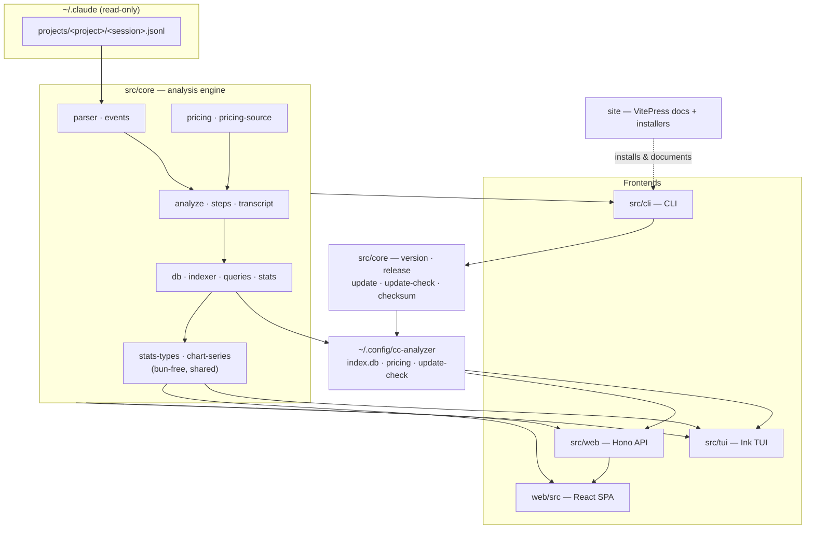

# cc-analyzer Wiki

> Indexed at commit `51ccd4e` on 2026-07-23 · [view on GitHub](https://github.com/yorch/cc-analyzer/tree/51ccd4e)

## Relevant source files

- [README.md](https://github.com/yorch/cc-analyzer/blob/51ccd4e/README.md)
- [package.json](https://github.com/yorch/cc-analyzer/blob/51ccd4e/package.json)
- [src/cli/index.ts](https://github.com/yorch/cc-analyzer/blob/51ccd4e/src/cli/index.ts)
- [src/core/analyze.ts](https://github.com/yorch/cc-analyzer/blob/51ccd4e/src/core/analyze.ts)

## Overview

`cc-analyzer` is a read-only command-line tool that browses and analyzes [Claude Code](https://claude.com/claude-code) sessions stored under `~/.claude`. Claude Code writes each session as a JSONL transcript that records token usage per API call but not cost; `cc-analyzer` derives cost from those token counts and a per-model pricing table, then surfaces cost, tokens, tools, skills, subagents, a per-turn (and per-step) breakdown, and a growing suite of portfolio analytics — cache-efficiency insights, time-series trends, tool/skill usage, and session/project charts ([README.md](https://github.com/yorch/cc-analyzer/blob/51ccd4e/README.md)).

The tool never writes to `~/.claude`. Its own state — a pricing cache, a SQLite session index, and an update-check cache — lives under `~/.config/cc-analyzer/`. It is written in TypeScript, runs on Bun, and ships as a single self-contained binary bundling the CLI, the terminal UI, the web API, and the web front end.

## What is cc-analyzer?

`cc-analyzer` is version `0.6.0`, a TypeScript project targeting the Bun runtime (≥ 1.3) and distributed as a compiled binary ([package.json:L1-L20](https://github.com/yorch/cc-analyzer/blob/51ccd4e/package.json#L1-L20)). It exposes several ways to consume one analysis core: scriptable CLI commands, an interactive Ink terminal UI, a local Hono web API, and an embedded React single-page application — plus a VitePress documentation site. Dependencies reflect those surfaces: `ink` (TUI), `hono` (API), `react`/`react-dom` (SPA), `zod` (tolerant event parsing), and Bun's built-in SQLite driver for the index.

## High-Level Architecture



Every frontend is a thin presentation layer over `src/core`. A single session flows `.jsonl → parser → SessionEvent[] → analyzeSession() → SessionAnalysis` (with a streaming variant for very large sessions), which the frontends render and which `indexer.ts` flattens into a SQLite row. The index then feeds portfolio analytics: `stats.ts` and the bun-free `stats-types.ts`/`chart-series.ts` modules build metrics and chart series that the TUI and web SPA import directly, so both frontends chart identical data ([src/core/analyze.ts:L1-L40](https://github.com/yorch/cc-analyzer/blob/51ccd4e/src/core/analyze.ts#L1-L40)).

## Repository Layout

```text
cc-analyzer/
├── src/
│   ├── core/   # Parsing, analysis, steps, pricing, index, analytics, self-update
│   ├── cli/    # Scriptable command router + text renderers
│   ├── tui/    # Ink master-detail UI (portfolio · projects · sessions · insights · trends · tools)
│   └── web/    # Hono API + generated embedded SPA module
├── web/        # React SPA source (built by Vite, separate tsconfig)
├── site/       # VitePress docs site (landing + this wiki) + install scripts
├── scripts/    # embed-spa.ts — bakes the built SPA into the binary
├── test/       # Bun tests, mirroring src/
├── docs/       # Design specs
└── .github/    # CI (matrix), release (binaries + checksums + provenance), Pages-deploy
```

The project uses a plain `src/` layout, not a monorepo. Two subtleties: `src/web/` is the API *server* while top-level `web/` is the React SPA *source*; and `site/` is an isolated VitePress toolchain with its own `package.json`/lockfile.

## Key Subsystems

### Core Analysis Engine
Parses transcripts, segments them into turns and per-turn steps, derives cost from tokens, and builds the portfolio SQLite index. [Details](./2-core-analysis-engine.md) — with pages on [parsing & events](./2.1-session-parsing-and-events.md), [cost & pricing](./2.2-cost-and-pricing.md), [index & aggregation](./2.3-index-and-analytics.md), and the [per-turn step timeline](./2.4-per-turn-steps.md).

### Command-Line Interface
The binary entrypoint and argv router: `projects`, `sessions`, `analyze`, `index`, `stats`, `serve`, `pricing`, `update`, and `version`, with `--json` modes for scripting. [Details](./3-cli.md).

### Interactive Terminal UI
An Ink master-detail shell launched when the CLI runs with no command: a nav rail across portfolio, projects, sessions, insights, trends, and tools views, with in-terminal charts. [Details](./4-tui.md).

### Web Server & API
`cc-analyzer serve` runs a Hono server exposing a JSON API (including analytics endpoints) over the index and serving the embedded SPA. [Details](./5-web-server-and-api.md).

### Web SPA Frontend
The React 19 single-page app — dashboard, project drill-down, per-session view with charts, and the Insights/Trends/Tools analytics views. [Details](./6-web-spa-frontend.md).

### Analytics & Insights
The cross-cutting analytics capability: 20+ metrics, cache-efficiency insights, time-series trends, tool/skill/subagent analytics, and session/project charts — built once in bun-free core modules and rendered by both the TUI and the web SPA. [Details](./7-analytics-and-insights.md).

### Updates & Distribution
Version embedding, latest-release resolution, self-update with a streaming download and checksum verification, a passive update notice, and the cross-platform install scripts. [Details](./8-updates-and-distribution.md).

### Docs Site
The VitePress site that renders this wiki and the landing page, syncs `/wiki` as its single source of truth, and hosts the install scripts on GitHub Pages. [Details](./9-docs-site.md).

## Build & Tooling

Bun is both the runtime and the package manager. `bun test` runs the suite, Biome handles lint/format, and TypeScript type-checks in two passes (Bun-targeted core/CLI/TUI/server, and the browser-targeted SPA). `bun run build` bundles the SPA with Vite, embeds it into `src/web/spa.ts`, then compiles a single binary. See [Repository Structure](./1-repository-structure.md) for the full pipeline and the CI/release/deploy workflows.

## Child Pages

- [1. Repository Structure](./1-repository-structure.md)
- [2. Core Analysis Engine](./2-core-analysis-engine.md)
  - [2.1 Session Parsing & Event Model](./2.1-session-parsing-and-events.md)
  - [2.2 Cost & Pricing Model](./2.2-cost-and-pricing.md)
  - [2.3 Index & Aggregation](./2.3-index-and-analytics.md)
  - [2.4 Per-Turn Step Timeline](./2.4-per-turn-steps.md)
- [3. Command-Line Interface](./3-cli.md)
- [4. Interactive Terminal UI](./4-tui.md)
- [5. Web Server & API](./5-web-server-and-api.md)
- [6. Web SPA Frontend](./6-web-spa-frontend.md)
- [7. Analytics & Insights](./7-analytics-and-insights.md)
- [8. Updates & Distribution](./8-updates-and-distribution.md)
- [9. Docs Site](./9-docs-site.md)
- [Glossary](./glossary.md)

Sources: [README.md](https://github.com/yorch/cc-analyzer/blob/51ccd4e/README.md) [package.json:L1-L42](https://github.com/yorch/cc-analyzer/blob/51ccd4e/package.json#L1-L42) [src/cli/index.ts:L1-L40](https://github.com/yorch/cc-analyzer/blob/51ccd4e/src/cli/index.ts#L1-L40) [src/core/analyze.ts:L1-L40](https://github.com/yorch/cc-analyzer/blob/51ccd4e/src/core/analyze.ts#L1-L40)

---

_Generated by [`repo-wiki-generator`](https://github.com/yorch/claude-skills/tree/main/skills/repo-wiki-generator) on 2026-07-23 from commit `51ccd4e`._
