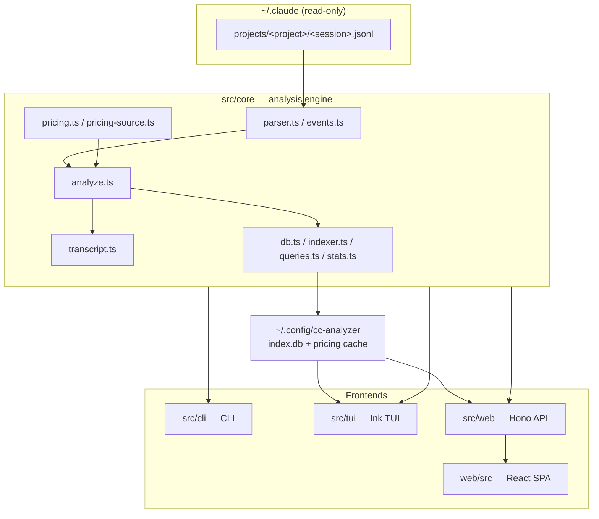

# cc-analyzer Wiki

> Indexed at commit `4eeed24` on 2026-07-10 · [view on GitHub](https://github.com/yorch/cc-analyzer/tree/4eeed24)

## Relevant source files

- [README.md](https://github.com/yorch/cc-analyzer/blob/4eeed24/README.md)
- [package.json](https://github.com/yorch/cc-analyzer/blob/4eeed24/package.json)
- [src/cli/index.ts](https://github.com/yorch/cc-analyzer/blob/4eeed24/src/cli/index.ts)
- [src/core/analyze.ts](https://github.com/yorch/cc-analyzer/blob/4eeed24/src/core/analyze.ts)

## Overview

`cc-analyzer` is a read-only command-line tool that browses and analyzes [Claude Code](https://claude.com/claude-code) sessions stored under `~/.claude`. Claude Code writes every session as a JSONL transcript that records token usage per API call but not cost; `cc-analyzer` derives cost from those token counts and a per-model pricing table, then surfaces tokens, cost, tools, skills, models, and a per-turn breakdown ([README.md](https://github.com/yorch/cc-analyzer/blob/4eeed24/README.md)).

The tool never writes to `~/.claude`. Its own state — a pricing cache and a SQLite session index — lives under `~/.config/cc-analyzer/`. It is written in TypeScript, runs on Bun, and ships as a single self-contained binary that bundles the CLI, the terminal UI, the web API, and the web front end.

## What is cc-analyzer?

`cc-analyzer` is version `0.1.0`, a TypeScript project targeting the Bun runtime (≥ 1.3) and distributed as a compiled binary ([package.json:L1-L20](https://github.com/yorch/cc-analyzer/blob/4eeed24/package.json#L1-L20)). It exposes four ways to consume the same analysis core: scriptable CLI commands, an interactive Ink terminal UI, a local Hono web API, and an embedded React single-page application. Its dependencies reflect those surfaces — `ink` for the TUI, `hono` for the API, `react`/`react-dom` for the SPA, `zod` for tolerant event parsing, and Bun's built-in SQLite driver for the index ([package.json:L21-L41](https://github.com/yorch/cc-analyzer/blob/4eeed24/package.json#L21-L41)).

## High-Level Architecture



Every frontend is a thin presentation layer over `src/core`. A single session flows `.jsonl → parser → SessionEvent[] → analyzeSession() → SessionAnalysis`, which the CLI and web renderers display directly and which `indexer.ts` flattens into a SQLite row for portfolio-wide analytics ([src/core/analyze.ts:L170-L341](https://github.com/yorch/cc-analyzer/blob/4eeed24/src/core/analyze.ts#L170-L341)). The TUI, `stats`, and `serve` all read from the SQLite index rather than re-parsing files on every request.

## Repository Layout

```text
cc-analyzer/
├── src/
│   ├── core/        # Parsing, analysis, pricing, indexing — the engine
│   ├── cli/         # Scriptable command router + text renderers
│   ├── tui/         # Interactive Ink (React-for-terminal) UI
│   └── web/         # Hono API + generated embedded SPA module
├── web/             # React SPA source (built by Vite, separate tsconfig)
├── scripts/         # embed-spa.ts — bakes the built SPA into the binary
├── test/            # Bun tests, mirroring src/ (+ a JSONL fixture)
├── docs/            # Design spec
└── .github/         # CI + multi-platform release workflows
```

The project uses a plain `src/` layout, not a monorepo. The one structural subtlety: `src/web/` is the API *server*, while the top-level `web/` directory is the React SPA *source* — two distinct codebases with two separate TypeScript configs.

## Key Subsystems

### Core Analysis Engine

The engine under `src/core/` parses session transcripts, segments them into turns, derives cost from tokens, and builds both per-session analyses and a portfolio-wide SQLite index. [Details](./2-core-analysis-engine.md), with dedicated pages on [parsing & events](./2.1-session-parsing-and-events.md), [cost & pricing](./2.2-cost-and-pricing.md), and [index & analytics](./2.3-index-and-analytics.md).

### Command-Line Interface

`src/cli/` is the binary entrypoint and argv router. It dispatches `projects`, `sessions`, `analyze`, `index`, `stats`, `serve`, and `pricing update`, formats human-readable output, and offers `--json` modes for scripting. [Details](./3-cli.md).

### Interactive Terminal UI

`src/tui/` is an Ink application launched when the CLI runs with no command. It navigates projects → sessions → session detail with an inline filterable list and a tabbed detail view. [Details](./4-tui.md).

### Web Server & API

`src/web/` runs a Hono server (`cc-analyzer serve`) that exposes a JSON API over the index and serves the embedded SPA. It documents the build-time mechanism that bakes the front end into the binary. [Details](./5-web-server-and-api.md).

### Web SPA Frontend

`web/src/` is the React 19 single-page app — a portfolio dashboard, project drill-down, and per-session view with an expandable turns tab and a windowed transcript reader. Vite bundles it into one self-contained HTML file. [Details](./6-web-spa-frontend.md).

## Build & Tooling

Bun is both the runtime and the package manager. `bun test` runs the suite, Biome handles lint and format, and TypeScript type-checks in two passes — one for the Bun-targeted core/CLI/TUI/server and one for the browser-targeted SPA. `bun run build` bundles the SPA with Vite, embeds it into `src/web/spa.ts`, then compiles a single binary with `bun build --compile` ([package.json:L9-L20](https://github.com/yorch/cc-analyzer/blob/4eeed24/package.json#L9-L20)). See [Repository Structure](./1-repository-structure.md) for the full build pipeline and CI/release workflows.

## Child Pages

- [1. Repository Structure](./1-repository-structure.md)
- [2. Core Analysis Engine](./2-core-analysis-engine.md)
  - [2.1 Session Parsing & Event Model](./2.1-session-parsing-and-events.md)
  - [2.2 Cost & Pricing Model](./2.2-cost-and-pricing.md)
  - [2.3 Index & Portfolio Analytics](./2.3-index-and-analytics.md)
- [3. Command-Line Interface](./3-cli.md)
- [4. Interactive Terminal UI](./4-tui.md)
- [5. Web Server & API](./5-web-server-and-api.md)
- [6. Web SPA Frontend](./6-web-spa-frontend.md)
- [Glossary](./glossary.md)

Sources: [README.md](https://github.com/yorch/cc-analyzer/blob/4eeed24/README.md) [package.json:L1-L41](https://github.com/yorch/cc-analyzer/blob/4eeed24/package.json#L1-L41) [src/cli/index.ts:L1-L34](https://github.com/yorch/cc-analyzer/blob/4eeed24/src/cli/index.ts#L1-L34) [src/core/analyze.ts:L170-L341](https://github.com/yorch/cc-analyzer/blob/4eeed24/src/core/analyze.ts#L170-L341)

---

_Generated by `repo-wiki-generator` on 2026-07-10 from commit `4eeed24`._
